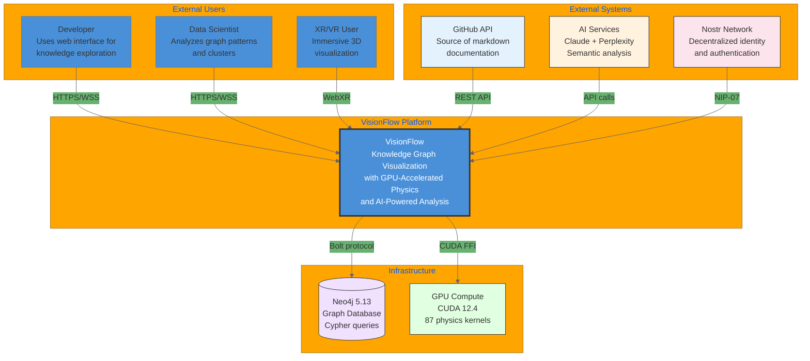

# C4 Context Diagram - VisionFlow System

This diagram shows VisionFlow at the system context level (C4 Level 1), illustrating how external users and systems interact with the platform.

## System Context

## User Personas

| Persona | Primary Use Case | Key Features Used |
|---------|------------------|-------------------|
| Developer | Navigate codebase knowledge graph | Graph exploration, search, GitHub sync |
| Data Scientist | Analyze patterns and clusters | Clustering algorithms, PageRank, community detection |
| XR/VR User | Immersive visualization | WebXR, spatial interaction, voice commands |

## External System Integrations

| System | Protocol | Data Flow | Purpose |
|--------|----------|-----------|---------|
| GitHub API | REST + Webhooks | Bidirectional | Sync markdown documentation |
| AI Services | HTTPS REST | Request-Response | Semantic analysis, embeddings |
| Nostr Network | NIP-07 WebSocket | Bidirectional | Decentralized authentication |
| Neo4j | Bolt (TCP) | Bidirectional | Graph persistence |
| GPU (CUDA) | FFI | Local | Physics simulation |

## System Boundaries

**Inside VisionFlow:**
- Web application (React + Three.js)
- REST and WebSocket APIs
- Actor-based backend (Actix)
- GPU physics engine (CUDA)
- OWL/RDF ontology processing

**Outside VisionFlow:**
- User browsers and XR devices
- GitHub repositories
- AI/ML service providers
- Nostr relay network
- External databases

## Related Documentation

- [C4 Container Diagram](c4-container.md)
- [System Architecture Overview](../overview.md)
- [Data Flow Documentation](../../diagrams/data-flow/complete-data-flows.md)
