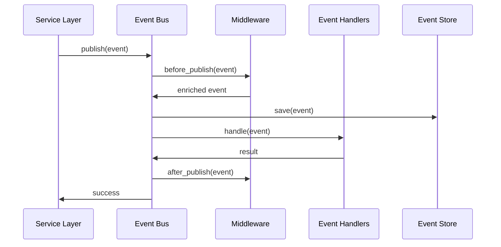

# Event-Driven Architecture

VisionFlow implements a robust event-driven architecture using domain events and the pub/sub pattern to enable loose coupling between system components.

## Overview

The event-driven system allows different parts of the application to react to changes without tight coupling. When significant actions occur (nodes added, physics simulations started, ontologies imported), domain events are published to an event bus where registered handlers can process them asynchronously.

## Architecture Components

### 1. Event Bus (`src/events/bus.rs`)

The central pub/sub mechanism for event distribution:

```rust
pub struct EventBus {
    subscribers: Arc<RwLock<HashMap<String, Vec<Arc<dyn EventHandler>>>>>,
    middleware: Arc<RwLock<Vec<Arc<dyn EventMiddleware>>>>,
    sequence: Arc<RwLock<i64>>,
    enabled: Arc<RwLock<bool>>,
}
```

**Key Features:**
- **Asynchronous publishing** with retry logic
- **Multiple subscribers** per event type
- **Middleware pipeline** for cross-cutting concerns
- **Sequential ordering** via sequence numbers
- **Graceful degradation** when handlers fail

### 2. Domain Events (`src/events/domain_events.rs`)

Strongly-typed events representing business-significant occurrences:

#### Graph Events
- `NodeAddedEvent` - Node created in graph
- `NodeUpdatedEvent` - Node properties modified
- `NodeRemovedEvent` - Node deleted
- `EdgeAddedEvent` - Relationship created
- `EdgeRemovedEvent` - Relationship deleted
- `GraphSavedEvent` - Graph persisted to disk
- `GraphClearedEvent` - All graph data removed

#### Ontology Events
- `ClassAddedEvent` - OWL class defined
- `PropertyAddedEvent` - Object/data property added
- `AxiomAddedEvent` - Logical axiom asserted
- `OntologyImportedEvent` - External ontology loaded
- `InferenceCompletedEvent` - Reasoning finished

#### Physics Events
- `SimulationStartedEvent` - Physics simulation begun
- `SimulationStoppedEvent` - Physics simulation ended
- `LayoutOptimizedEvent` - Graph layout improved
- `PositionsUpdatedEvent` - Node positions changed

#### Settings Events
- `SettingUpdatedEvent` - Configuration modified
- `PhysicsProfileSavedEvent` - Physics preset saved
- `SettingsImportedEvent` - Settings loaded from file

### 3. Event Handlers (`src/events/handlers/`)

Specialized processors for different event types:

- **`GraphEventHandler`** - Updates graph state, triggers re-renders
- **`OntologyEventHandler`** - Manages ontology cache, triggers inference
- **`NotificationEventHandler`** - Sends user notifications
- **`AuditEventHandler`** - Logs events for compliance
- **`InferenceTriggerHandler`** - Auto-triggers reasoning on ontology changes

### 4. Event Middleware (`src/events/middleware.rs`)

Cross-cutting concerns applied to all events:

- **`LoggingMiddleware`** - Structured event logging
- **`MetricsMiddleware`** - Performance tracking
- **`ValidationMiddleware`** - Event payload validation
- **`EnrichmentMiddleware`** - Adds correlation IDs, timestamps
- **`RetryMiddleware`** - Automatic retry on transient failures

### 5. Event Store (`src/events/store.rs`)

Persistent event log for audit trails and event sourcing:

```rust
pub trait EventRepository {
    async fn save(&self, event: &StoredEvent) -> EventResult<i64>;
    async fn get_by_sequence(&self, sequence: i64) -> EventResult<Option<StoredEvent>>;
    async fn get_by_aggregate(&self, aggregate_id: &str) -> EventResult<Vec<StoredEvent>>;
    async fn get_since(&self, sequence: i64) -> EventResult<Vec<StoredEvent>>;
}
```

**Features:**
- **Full event history** preserved
- **Aggregate reconstruction** from events
- **Temporal queries** (events since timestamp)
- **In-memory implementation** for testing
- **Database implementation** for production

## Event Flow



## Usage Examples

### Publishing Events

```rust
use crate::events::{EventBus, NodeAddedEvent};
use chrono::Utc;

let bus = EventBus::new();

let event = NodeAddedEvent {
    node_id: "node-123".to_string(),
    label: "Research Paper".to_string(),
    node_type: "Document".to_string(),
    properties: HashMap::new(),
    timestamp: Utc::now(),
};

bus.publish(event).await?;
```

### Subscribing to Events

```rust
use crate::events::{EventBus, EventHandler};
use async_trait::async_trait;

struct CustomHandler;

#[async_trait]
impl EventHandler for CustomHandler {
    fn event_type(&self) -> &'static str {
        "NodeAdded"
    }

    fn handler_id(&self) -> &str {
        "custom-handler"
    }

    async fn handle(&self, event: &StoredEvent) -> Result<(), EventError> {
        // Process the event
        println!("Received: {}", event.metadata.event_type);
        Ok(())
    }
}

let bus = EventBus::new();
bus.subscribe(Arc::new(CustomHandler)).await;
```

### Adding Middleware

```rust
use crate::events::{LoggingMiddleware, MetricsMiddleware};

let bus = EventBus::new();
bus.add_middleware(Arc::new(LoggingMiddleware::new())).await;
bus.add_middleware(Arc::new(MetricsMiddleware::new())).await;
```

## Automatic Inference Triggers (`src/events/inference_triggers.rs`)

Special event handlers that automatically trigger OWL reasoning when ontology changes occur:

```rust
pub struct InferenceTriggerHandler {
    ontology_actor: Addr<OntologyActor>,
    config: AutoInferenceConfig,
}
```

**Trigger Conditions:**
- New classes added (if `trigger_on_class_add` enabled)
- Properties defined (if `trigger_on_property_add` enabled)
- Axioms asserted (if `trigger_on_axiom_add` enabled)
- Batch threshold reached (debouncing)

**Configuration:**
```rust
pub struct AutoInferenceConfig {
    pub enabled: bool,
    pub trigger_on_class_add: bool,
    pub trigger_on_property_add: bool,
    pub trigger_on_axiom_add: bool,
    pub debounce_ms: u64,           // Wait before triggering
    pub batch_threshold: usize,      // Min changes to trigger
}
```

## Benefits

### 1. Loose Coupling
Services don't need to know about each other directly. They communicate through events.

### 2. Scalability
Handlers run asynchronously and can be distributed across processes.

### 3. Auditability
Complete event log provides audit trail for compliance.

### 4. Extensibility
New handlers can be added without modifying existing code.

### 5. Reliability
Middleware provides retry logic and error handling.

### 6. Observability
Metrics and logging middleware provide system insights.

## Client-Side Event Bus (February 2026)

In addition to the backend Rust event bus, the client now implements its own typed event bus pattern for WebSocket event distribution.

### WebSocketEventBus

**Location:** `client/src/services/WebSocketEventBus.ts`

A lightweight pub/sub system that decouples WebSocket message producers from consumers on the client side. Unlike the backend event bus which handles domain events (NodeAdded, EdgeRemoved, etc.), the client event bus routes transport-level events across service boundaries.

**Event Types:**
- **Connection events** (`connection:open`, `connection:close`, `connection:error`) -- lifecycle tracking
- **Message events** (`message:graph`, `message:voice`, `message:bots`, `message:pod`) -- typed message routing
- **Registry events** (`registry:registered`, `registry:unregistered`, `registry:closedAll`) -- connection tracking

**Relationship to Backend Event Bus:**
```
Backend Event Bus (Rust)          Client Event Bus (TypeScript)
├── Domain Events                 ├── Connection Events
│   ├── NodeAddedEvent            │   ├── connection:open
│   ├── EdgeRemovedEvent          │   ├── connection:close
│   └── SettingUpdatedEvent       │   └── connection:error
├── Middleware Pipeline            ├── Message Events (by service)
│   ├── LoggingMiddleware         │   ├── message:graph (binary)
│   └── MetricsMiddleware         │   ├── message:voice
│                                 │   └── message:bots
└── Event Store (persistent)      └── Registry Events (lifecycle)
```

The two event bus systems are complementary: the backend bus handles domain event sourcing and cross-actor communication, while the client bus handles WebSocket connection multiplexing and service-level message routing.

## Integration with Actor System

Events complement the actor system by providing:

- **Cross-actor communication** without direct dependencies
- **Event sourcing** for actor state reconstruction
- **Audit trails** for actor decisions
- **Notifications** to external systems

Actors can both publish and subscribe to events:

```rust
impl Handler<NodeAddedMessage> for GraphStateActor {
    async fn handle(&mut self, msg: NodeAddedMessage) -> Result<()> {
        // Update actor state
        self.add_node(msg.node_id, msg.data)?;

        // Publish domain event
        self.event_bus.publish(NodeAddedEvent {
            node_id: msg.node_id,
            label: msg.label,
            node_type: msg.node_type,
            properties: msg.properties,
            timestamp: Utc::now(),
        }).await?;

        Ok(())
    }
}
```

## Testing

The event system is fully testable with mock handlers:

```rust
#[tokio::test]
async fn test_event_publishing() {
    let bus = EventBus::new();
    let call_count = Arc::new(AtomicUsize::new(0));

    struct TestHandler {
        id: String,
        call_count: Arc<AtomicUsize>,
    }

    #[async_trait]
    impl EventHandler for TestHandler {
        fn event_type(&self) -> &'static str {
            "NodeAdded"
        }

        fn handler_id(&self) -> &str {
            &self.id
        }

        async fn handle(&self, _event: &StoredEvent) -> Result<(), EventError> {
            self.call_count.fetch_add(1, Ordering::SeqCst);
            Ok(())
        }
    }

    bus.subscribe(Arc::new(TestHandler {
        id: "test".to_string(),
        call_count: call_count.clone(),
    })).await;

    let event = NodeAddedEvent { /* ... */ };
    bus.publish(event).await.unwrap();

    assert_eq!(call_count.load(Ordering::SeqCst), 1);
}
```

## Best Practices

### 1. Keep Events Immutable
Events represent facts that happened. Never modify event data after creation.

### 2. Use Specific Event Types
Create distinct event types rather than generic "UpdateEvent" with type fields.

### 3. Include Rich Context
Events should contain all information handlers need without additional queries.

### 4. Handle Failures Gracefully
Handlers should not fail the entire event publishing pipeline.

### 5. Avoid Synchronous Handlers
Long-running operations should be queued or processed asynchronously.

### 6. Use Middleware for Cross-Cutting Concerns
Don't duplicate logging/metrics code in every handler.

## Performance Considerations

- **Async Publishing:** All handlers run concurrently via `tokio`
- **Middleware Overhead:** Each middleware adds ~1-2ms latency
- **Memory Usage:** Events are cloned per subscriber (~1KB per event)
- **Retry Logic:** Exponential backoff prevents thundering herd

## Future Enhancements

- **Event Replay:** Reconstruct system state from event log
- **CQRS Integration:** Separate read/write models using events
- **External Event Streams:** Publish to Kafka/RabbitMQ
- **Event Projections:** Materialized views from event history
- **Saga Orchestration:** Multi-step workflows using events

## Related Documentation

- [Actor System](./modular-actor-system.md) - Complementary concurrency model
- [Hexagonal Architecture](./hexagonal-cqrs-architecture.md) - Overall system design
- [Domain-Driven Design](../../concepts/domain-driven-design.md) - Event modeling approach

## References

- Domain Events Pattern - Martin Fowler
- Event Sourcing - Greg Young
- Pub/Sub Messaging - Enterprise Integration Patterns
