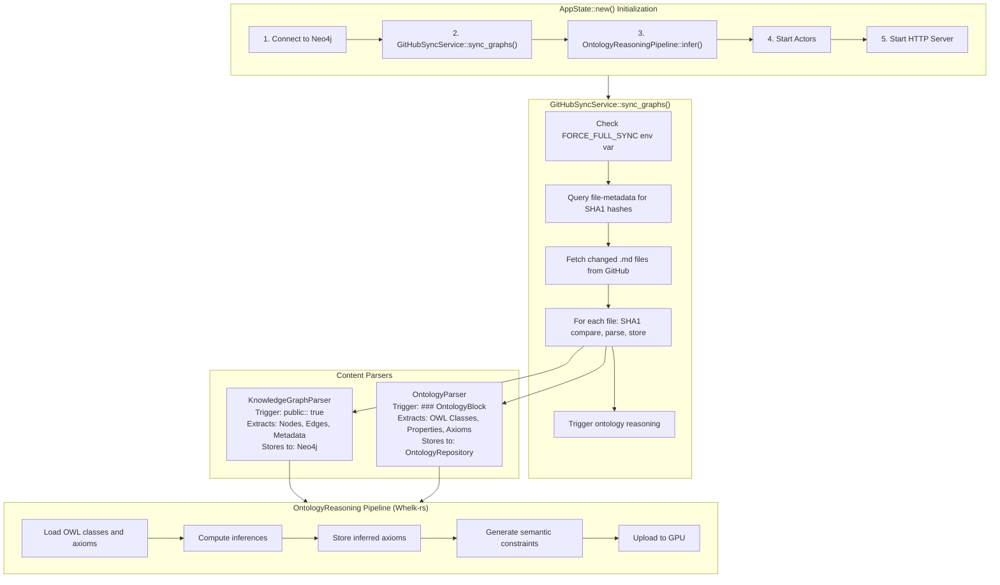

# GitHubSyncService Architecture Design

**Version**: 2.0
**Status**: Production Ready
**Architect**: VisionFlow Documentation Team

## Executive Summary

This document specifies the architecture for the GitHubSyncService, the component that populates **Neo4j** from the jjohare/logseq GitHub repository and triggers ontology reasoning.

## Problem Statement (Resolved)

**Previous State** (Pre-Nov 2, 2025):
- Databases created with correct schema ✅
- Databases completely empty ❌
- No automated data ingestion pipeline ❌
- Application crashes when querying empty databases ❌

**Current State** (Post-Migration):
- ✅ **Unified database** (Neo4j) with all domain tables
- ✅ **Automated GitHub sync** on startup with differential updates
- ✅ **Ontology reasoning pipeline** integrated
- ✅ **FORCE-FULL-SYNC** environment variable for complete reprocessing
- ✅ **316 nodes** loaded successfully (vs. previous 4-node bug)

**Root Cause (Historical)**: Missing GitHubSyncService to fetch and parse data from GitHub on startup. **Now Resolved**.

## Architecture Overview (Updated: Unified Database)



## Component Specifications

### 1. GitHubSyncService

**Location**: `src/services/github-sync-service.rs`

**Responsibilities**:
- Orchestrate data ingestion from GitHub
- File detection and routing
- Error handling and retry logic
- Progress reporting
- Idempotency (safe to re-run)

**Key Methods**:
```rust
pub struct GitHubSyncService {
    content-api: Arc<ContentAPI>,
    kg-parser: Arc<KnowledgeGraphParser>,
    onto-parser: Arc<OntologyParser>,
    kg-repo: Arc<KnowledgeGraphRepository>,
    onto-repo: Arc<OntologyRepository>,
}

impl GitHubSyncService {
    pub fn new(...) -> Self;

    pub async fn sync-graphs(&self) -> Result<SyncStatistics, SyncError>;

    async fn fetch-all-markdown-files(&self) -> Result<Vec<GitHubFileBasicMetadata>>;

    async fn process-file(&self, file: &GitHubFileBasicMetadata) -> Result<FileProcessResult>;

    fn detect-file-type(&self, content: &str) -> FileType;
}

pub struct SyncStatistics {
    pub total-files: usize,
    pub kg-files-processed: usize,
    pub ontology-files-processed: usize,
    pub errors: Vec<String>,
    pub duration: Duration,
}

pub enum FileType {
    KnowledgeGraph,  // Contains "public:: true"
    Ontology,        // Contains "- ### OntologyBlock"
    Skip,            // Neither marker found
}
```

**Error Handling**:
- Retry failed GitHub API calls (3 attempts, exponential backoff)
- Continue processing on individual file errors
- Collect all errors for reporting
- Log detailed error information

**Integration Point**: Called from `AppState::new()` line ~155 (after repository creation, before actors)

### 2. KnowledgeGraphParser

**Location**: `src/services/parsers/knowledge-graph-parser.rs`

**Trigger**: Files starting with `public:: true`

**Responsibilities**:
- Parse markdown content for graph structure
- Extract nodes (pages, concepts)
- Extract edges (links, relationships)
- Extract metadata (tags, properties)
- Generate Node and Edge objects

**Parsing Strategy**:
```markdown
public:: true
---
# Page Title  → Node (label)
- [[Link Target]]  → Edge (source: current page, target: Link Target)
- tag:: #concept   → Node metadata
- property:: value → Node metadata
```

**Database Schema Alignment**:
```sql
kg-nodes: (id, metadata-id, label, x, y, z, vx, vy, vz, color, size, metadata)
kg-edges: (id, source, target, weight, metadata)
```

**Key Methods**:
```rust
pub struct KnowledgeGraphParser;

impl KnowledgeGraphParser {
    pub fn parse(&self, content: &str, filename: &str) -> Result<GraphData>;

    fn extract-nodes(&self, content: &str) -> Vec<Node>;

    fn extract-edges(&self, content: &str, source-id: u32) -> Vec<Edge>;

    fn extract-metadata(&self, content: &str) -> HashMap<String, String>;
}
```

### 3. OntologyParser

**Location**: `src/services/parsers/ontology-parser.rs`

**Trigger**: Files containing `- ### OntologyBlock`

**Responsibilities**:
- Parse OWL class definitions
- Extract properties (ObjectProperty, DataProperty)
- Extract axioms (SubClassOf, DisjointWith, etc.)
- Generate OwlClass, OwlProperty, OwlAxiom objects

**Parsing Strategy**:
```markdown
- ### OntologyBlock
  - owl-class:: ClassName
    - label:: Human Readable Name
    - subClassOf:: ParentClass
  - objectProperty:: propertyName
    - domain:: SourceClass
    - range:: TargetClass
```

**Database Schema Alignment**:
```sql
owl-classes: (iri, label, description, source-file, properties)
owl-class-hierarchy: (class-iri, parent-iri)
owl-properties: (iri, label, property-type, domain, range)
owl-axioms: (id, axiom-type, subject, object, annotations, is-inferred)
```

**Key Methods**:
```rust
pub struct OntologyParser;

impl OntologyParser {
    pub fn parse(&self, content: &str, filename: &str) -> Result<OntologyData>;

    fn extract-classes(&self, content: &str) -> Vec<OwlClass>;

    fn extract-properties(&self, content: &str) -> Vec<OwlProperty>;

    fn extract-axioms(&self, content: &str) -> Vec<OwlAxiom>;

    fn extract-hierarchy(&self, content: &str) -> Vec<(String, String)>;
}
```

### 4. Existing Component Enhancements

**ContentAPI** (`src/services/github/content-enhanced.rs`):
- Already has `list-markdown-files()` ✅
- Already has `fetch-file-content()` ✅
- No changes needed! ✅

**Database Repositories**:
- Already have batch insert methods ✅
- Need to add idempotency (upsert instead of insert)
- Need to handle duplicate entries gracefully

## Integration Sequence

### AppState::new() Modification

```rust
// Line ~155 in src/app-state.rs (after repository creation)

info!("[AppState::new] Initializing GitHubSyncService for data ingestion");
let github-sync-service = Arc::new(GitHubSyncService::new(
    content-api.clone(),
    knowledge-graph-repository.clone(),
    ontology-repository.clone(),
));

info!("[AppState::new] Starting GitHub data sync (this may take 30-60 seconds)...");
match github-sync-service.sync-graphs().await {
    Ok(stats) => {
        info!("[AppState::new] GitHub sync complete!");
        info!("  - Total files scanned: {}", stats.total-files);
        info!("  - Knowledge graph files: {}", stats.kg-files-processed);
        info!("  - Ontology files: {}", stats.ontology-files-processed);
        info!("  - Duration: {:?}", stats.duration);
        if !stats.errors.is-empty() {
            warn!("  - Errors encountered: {}", stats.errors.len());
            for error in &stats.errors {
                warn!("    - {}", error);
            }
        }
    }
    Err(e) => {
        // Non-fatal: log error but continue startup
        // This allows manual data import via API if GitHub is down
        error!("[AppState::new] GitHub sync failed: {}", e);
        error!("[AppState::new] Databases may be empty - use manual import API");
    }
}

// Continue with actor initialization...
```

## Error Scenarios & Handling

| Scenario | Handling Strategy |
|----------|------------------|
| GitHub API rate limit | Exponential backoff, retry after delay |
| Invalid GitHub token | Log error, return empty datasets, allow manual import |
| Malformed markdown | Skip file, log warning, continue processing |
| Database write failure | Log error, attempt next file, collect errors |
| Network timeout | Retry 3 times, then skip file |
| Empty repository | Log info, return zero statistics (valid state) |

## Performance Considerations

**Expected Performance**:
- ~100-200 markdown files in jjohare/logseq
- ~2-5 files/second (GitHub API + parsing)
- Total sync time: 30-60 seconds
- Database writes: Batched for efficiency

**Optimization Strategies**:
1. Batch database inserts (100 items per transaction)
2. Parallel file processing (5 concurrent files)
3. Skip files that haven't changed (SHA comparison)
4. Cache file metadata for incremental syncs

## Testing Strategy

### Unit Tests
- Parser logic with sample markdown
- File type detection
- Error handling paths

### Integration Tests
- End-to-end sync with test repository
- Database population verification
- Idempotency (re-run sync, no duplicates)

### Manual Validation
```bash
# 1. Check database population
# Query via Neo4j Browser or cypher-shell:
# cypher-shell -d neo4j "MATCH (n:Node) RETURN count(n);"
# cypher-shell -d neo4j "MATCH (c:OwlClass) RETURN count(c);"
# Previously: sqlite3 data/Neo4j "SELECT count(*) FROM graph-nodes;"
# Query via Neo4j Browser or cypher-shell:
# cypher-shell -d neo4j "MATCH (n:Node) RETURN count(n);"
# cypher-shell -d neo4j "MATCH (c:OwlClass) RETURN count(c);"
# Previously: sqlite3 data/Neo4j "SELECT count(*) FROM owl-classes;"

# 2. Verify API endpoints return data
curl http://localhost:4000/api/graph/data
curl http://localhost:4000/api/ontology/classes
```

## Future Enhancements

1. **Incremental Sync**: Only process files modified since last sync
2. **Webhook Integration**: Auto-sync on GitHub repository changes
3. **Manual Trigger API**: `/api/admin/sync-github` endpoint
4. **Progress Streaming**: WebSocket updates during sync
5. **Conflict Resolution**: Handle duplicate nodes/classes intelligently

## Dependencies

**New Dependencies** (add to Cargo.toml):
```toml
# None required! All dependencies already present:
# - neo4rs (Neo4j database)
# - reqwest (HTTP)
# - serde-json (JSON parsing)
# - tokio (async)
# - log/tracing (logging)
```

## Implementation Checklist

- [ ] Create `src/services/github-sync-service.rs`
- [ ] Create `src/services/parsers/` directory
- [ ] Implement `KnowledgeGraphParser`
- [ ] Implement `OntologyParser`
- [ ] Add mod declarations to `src/services/mod.rs`
- [ ] Integrate into `AppState::new()`
- [ ] Add unit tests for parsers
- [ ] Test with real GitHub data
- [ ] Verify database population
- [ ] Clean up unnecessary spawn-blocking changes
- [ ] Update documentation

## Security Considerations

- GitHub token from environment variable (already implemented) ✅
- No token logging (verify in implementation)
- Rate limiting compliance (1000 requests/hour for authenticated)
- Input sanitization (prevent SQL injection via prepared statements)

## Rollback Plan

If sync fails catastrophically:
1. Databases remain empty (safe state)
2. Application continues to start
3. Manual data import via existing API endpoints
4. No data corruption risk (each sync is atomic)

---

**Architecture Approved**: Ready for Phase 2 Implementation
**Estimated Implementation Time**: 4-6 hours
**Risk Level**: Low (isolated component, fail-safe design)
