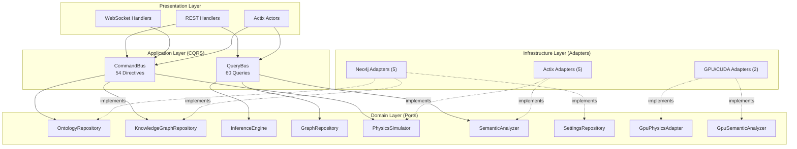

# Hexagonal Architecture with CQRS Pattern

VisionFlow employs hexagonal architecture (also known as ports and adapters) combined with Command Query Responsibility Segregation (CQRS) to enforce strict separation between domain logic, infrastructure concerns, and presentation. This document explains the pattern as implemented in the VisionFlow codebase.

---

## The Pattern in Brief

Hexagonal architecture places the domain at the centre of the system. The domain defines **ports** -- abstract trait interfaces that describe what capabilities it needs -- without specifying how those capabilities are provided. **Adapters** sit at the boundary and implement those ports against concrete technologies such as Neo4j, CUDA, or Actix WebSocket handlers. CQRS adds a further split: every operation is classified as either a **command** (directive) that mutates state, or a **query** that reads state without side effects.



---

## Ports: Technology-Agnostic Boundaries

Ports are defined as Rust async traits in `src/ports/`. Each trait describes a complete capability boundary without mentioning any database driver, GPU toolkit, or HTTP framework. The domain depends only on these traits, which makes it testable in isolation with mock implementations.

The nine port traits currently defined are:

| Port Trait | File | Responsibility |
|---|---|---|
| `OntologyRepository` | `src/ports/ontology_repository.rs` | OWL class/property/axiom storage, validation, inference result persistence |
| `KnowledgeGraphRepository` | `src/ports/knowledge_graph_repository.rs` | Graph CRUD, batch operations, position persistence, node search |
| `InferenceEngine` | `src/ports/inference_engine.rs` | OWL reasoning: load ontology, infer axioms, check consistency, explain entailments |
| `GraphRepository` | `src/ports/graph_repository.rs` | Core graph node/edge access |
| `PhysicsSimulator` | `src/ports/physics_simulator.rs` | Physics step computation |
| `SemanticAnalyzer` | `src/ports/semantic_analyzer.rs` | Community detection, pattern analysis |
| `SettingsRepository` | `src/ports/settings_repository.rs` | User/system configuration persistence |
| `GpuPhysicsAdapter` | `src/ports/gpu_physics_adapter.rs` | GPU-accelerated force computation, device management |
| `GpuSemanticAnalyzer` | `src/ports/gpu_semantic_analyzer.rs` | GPU-accelerated PageRank, clustering, pathfinding |

All port traits use `#[async_trait]` and require `Send + Sync` bounds so they can be shared safely across Actix actor threads.

---

## Adapters: Concrete Implementations

Adapters in `src/adapters/` implement port traits against specific technologies. VisionFlow currently has 12 adapters spanning three technology families:

**Neo4j adapters** (5) connect to the graph database via Bolt protocol and Cypher queries. `Neo4jOntologyRepository` implements the `OntologyRepository` port; `Neo4jGraphRepository` and `ActorGraphRepository` implement `GraphRepository`; `Neo4jSettingsRepository` implements `SettingsRepository`.

**GPU adapters** (2) wrap CUDA kernel invocations behind port interfaces. `GpuSemanticAnalyzerAdapter` provides GPU-accelerated analytics; `ActixPhysicsAdapter` bridges between the actor system and GPU physics computation.

**Actix bridge adapters** (5) translate between actor message-passing and port trait calls, allowing actors such as `PhysicsOrchestratorActor` to consume port interfaces through actor addresses.

Because adapters are injected via `Arc<dyn PortTrait>`, swapping a Neo4j-backed repository for an in-memory test double requires no changes to the domain or application layers.

---

## CQRS: Separating Reads from Writes

VisionFlow's CQRS layer lives in `src/application/` and organises all operations into two categories:

**Directives (commands)** mutate state. Each directive is a plain struct carrying the data needed for the mutation, paired with a handler that receives the appropriate port via dependency injection and executes the operation. There are currently 54 directive handlers across the ontology, knowledge graph, settings, and physics domains.

**Queries** read state without side effects. Each query struct describes the data requested, and its handler fetches results through read-only port methods. There are currently 60 query handlers.

Both directive and query handlers are registered in a type-safe bus that routes by `TypeId`, ensuring compile-time correctness:

```rust
// Registration
command_bus.register::<CreateClassDirective, _>(CreateClassHandler::new(
    Arc::clone(&ontology_repo),
));

// Dispatch
let class_id = command_bus.dispatch(CreateClassDirective {
    ontology_id: "my-ontology".into(),
    class_iri: "http://example.org/MyClass".into(),
    label: "My Class".into(),
}).await?;
```

This separation means query paths can be independently optimised (caching, read replicas) without affecting write consistency.

---

## Testing with Ports

The primary benefit of hexagonal architecture is testability. Domain logic is tested against mock adapters without requiring a running Neo4j instance or GPU:

```rust
#[tokio::test]
async fn test_ontology_inference() {
    let mock_repo = MockOntologyRepository::new();
    let mock_engine = MockInferenceEngine::new();
    let handler = InferOntologyHandler::new(
        Arc::new(mock_repo),
        Arc::new(mock_engine),
    );

    let result = handler.handle(InferOntologyQuery {
        ontology_id: "test".into(),
    }).await;

    assert!(result.is_ok());
}
```

Adapter tests run against real infrastructure (Neo4j, CUDA) to validate the integration layer separately.

---

## See Also

- [Hexagonal Architecture (concept)](../../concepts/hexagonal-architecture.md) -- higher-level explanation of the hexagonal pattern
- [Hexagonal CQRS Unified Reference](../hexagonal-cqrs-unified.md) -- exhaustive reference with actor hierarchy, all 114 handlers, and performance metrics
- [Actor System Architecture](../actor-system.md) -- how Actix actors interact with the CQRS layer
- [CQRS Directive Template](../cqrs-directive-template.md) -- template for adding new directives
- [Adapter Patterns](../adapter-patterns.md) -- detailed guide to writing adapters
