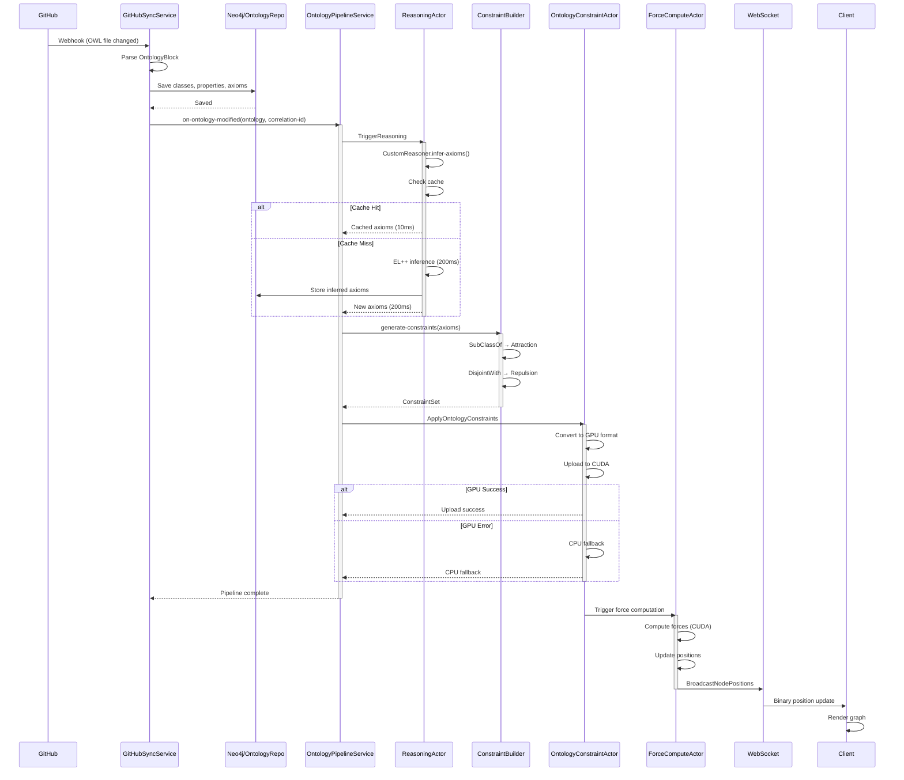
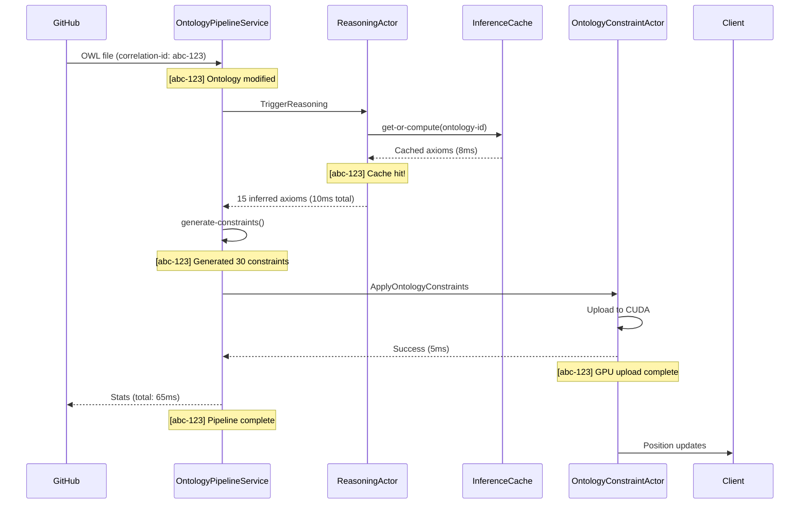
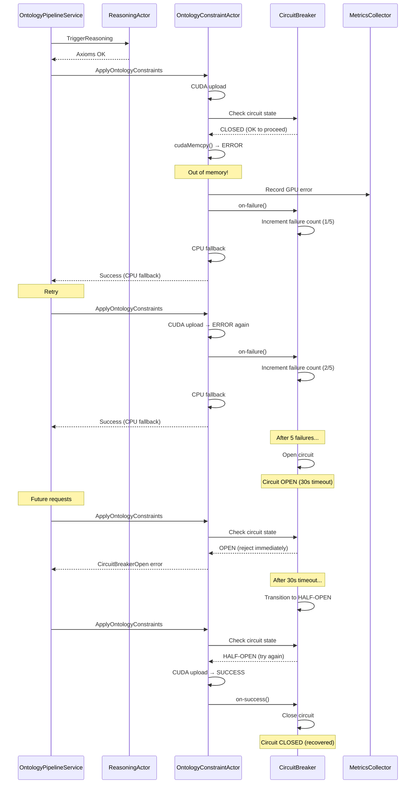
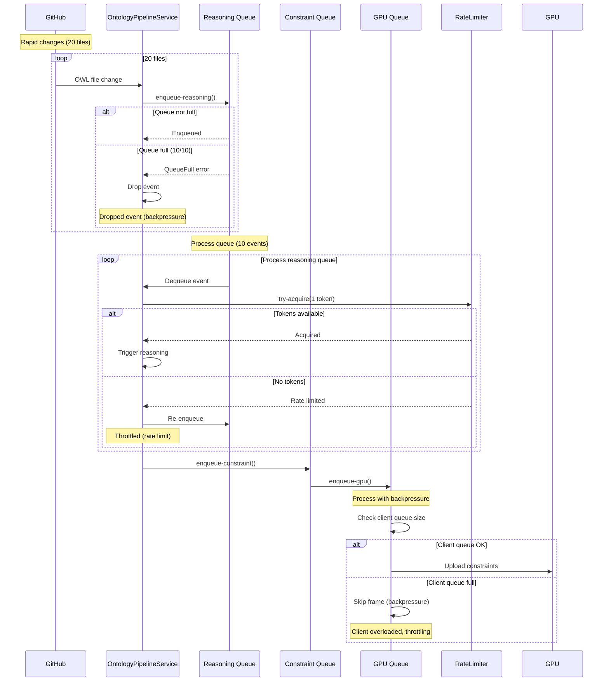
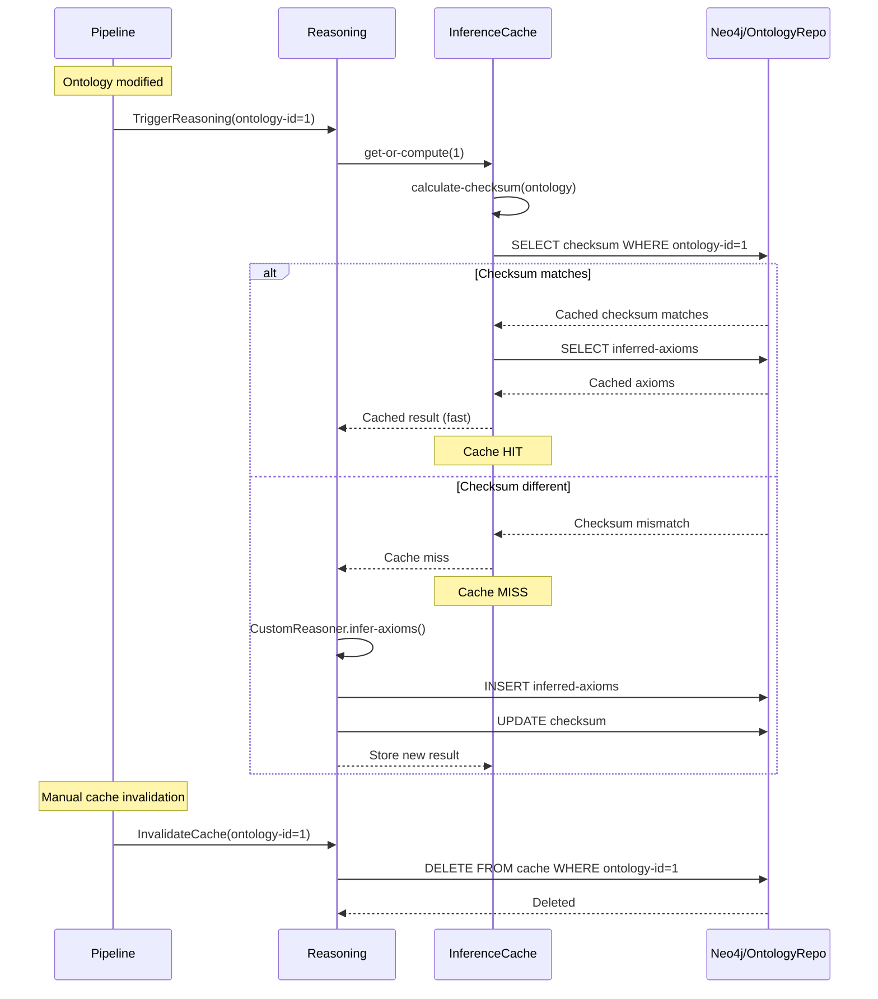
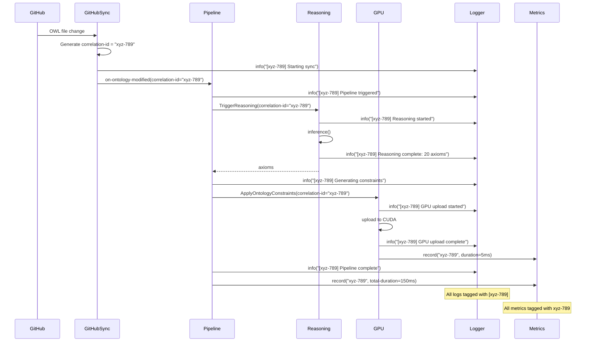
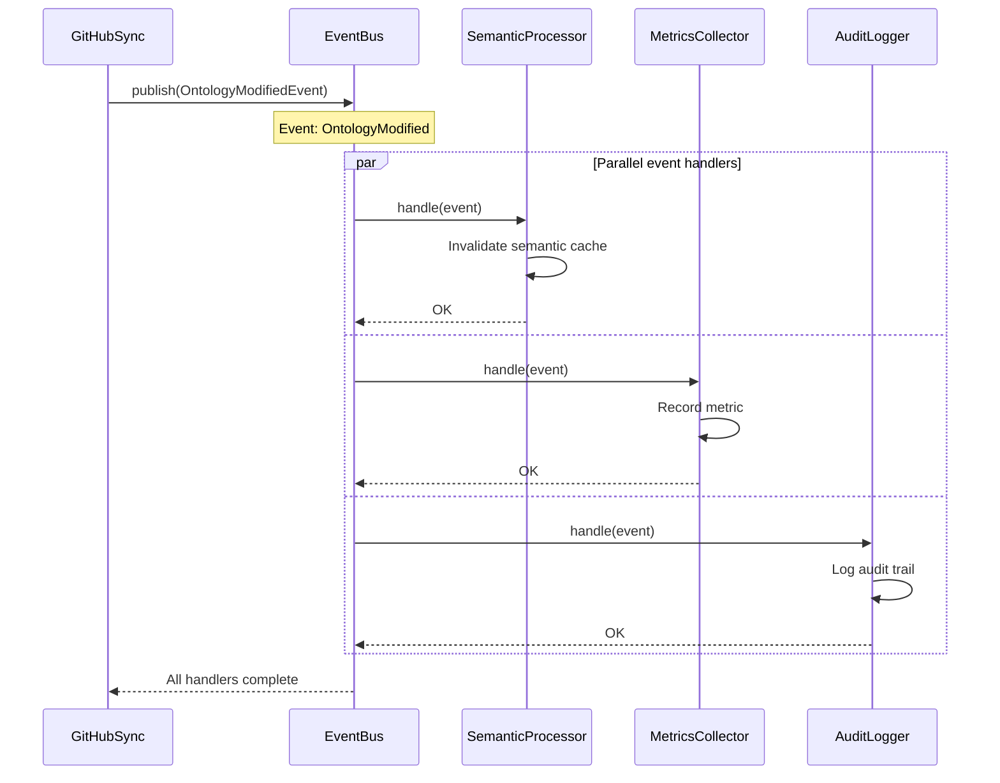
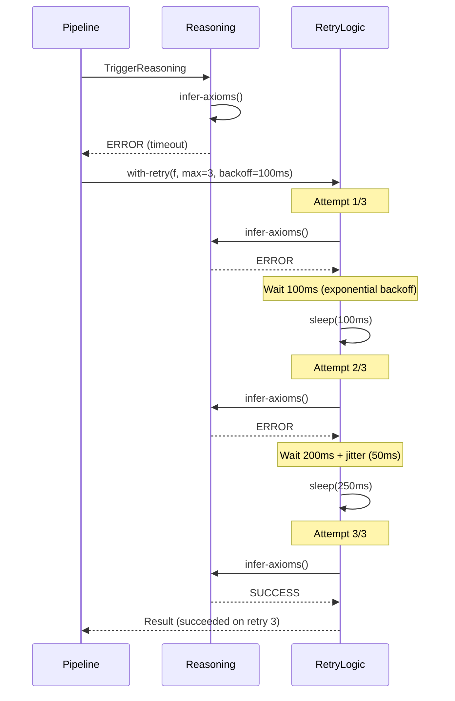
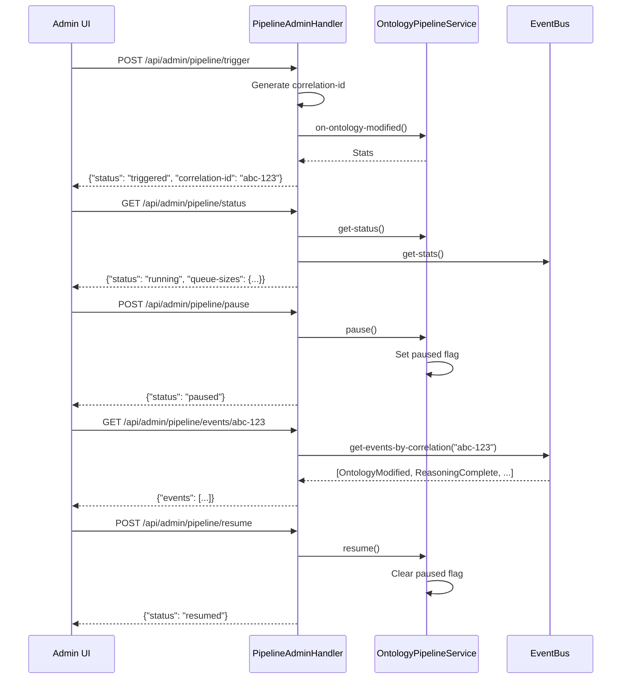

# Pipeline Sequence Diagrams

## Complete End-to-End Flow

## Happy Path (Cached)

## Error Path (GPU Failure)

## Backpressure Flow

## Cache Invalidation Flow

## Correlation ID Tracing

## Event-Driven Updates

## Retry Logic Flow

## Admin API Flow

## Version History

| Version | Date | Changes |
|---------|------|---------|
| 1.0.0 | 2025-01-03 | Initial sequence diagrams |
