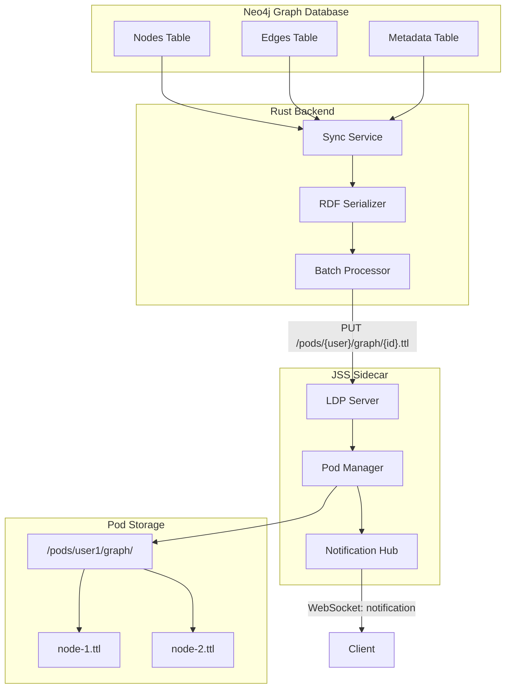
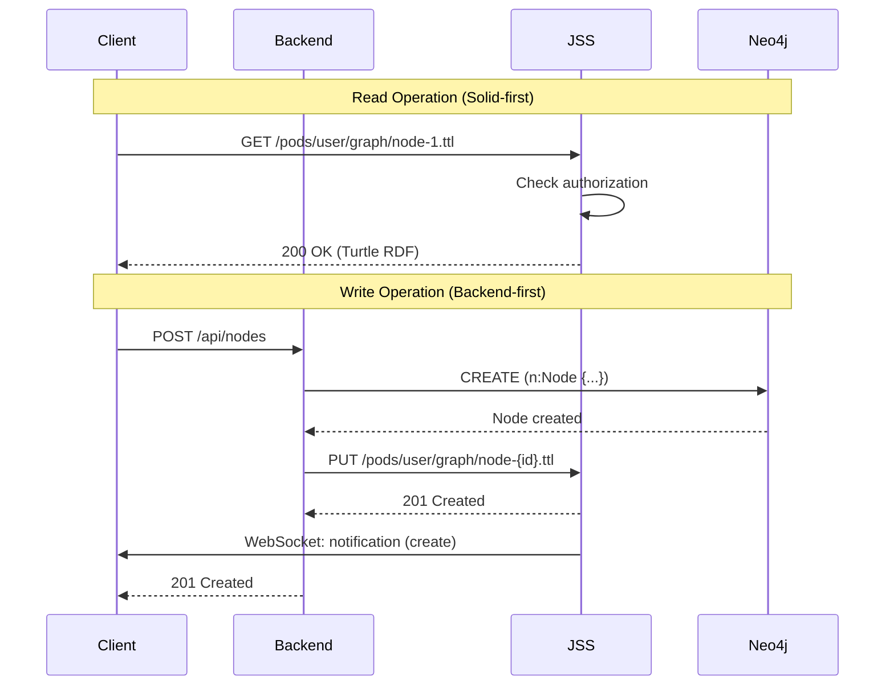
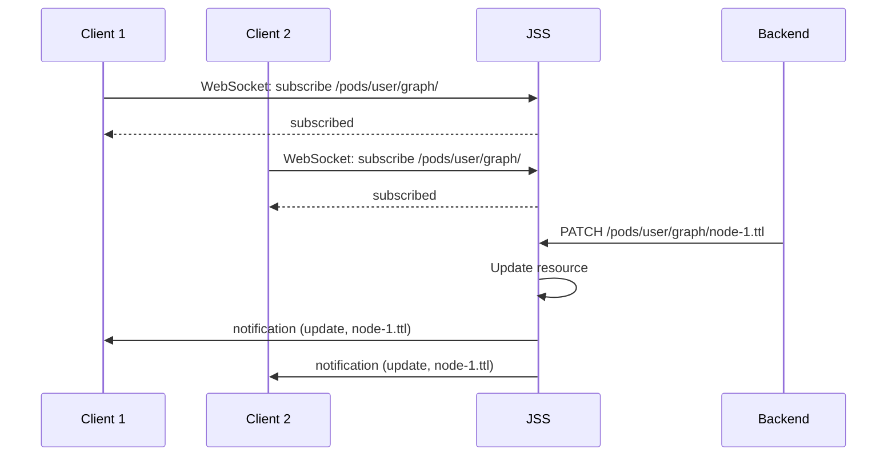
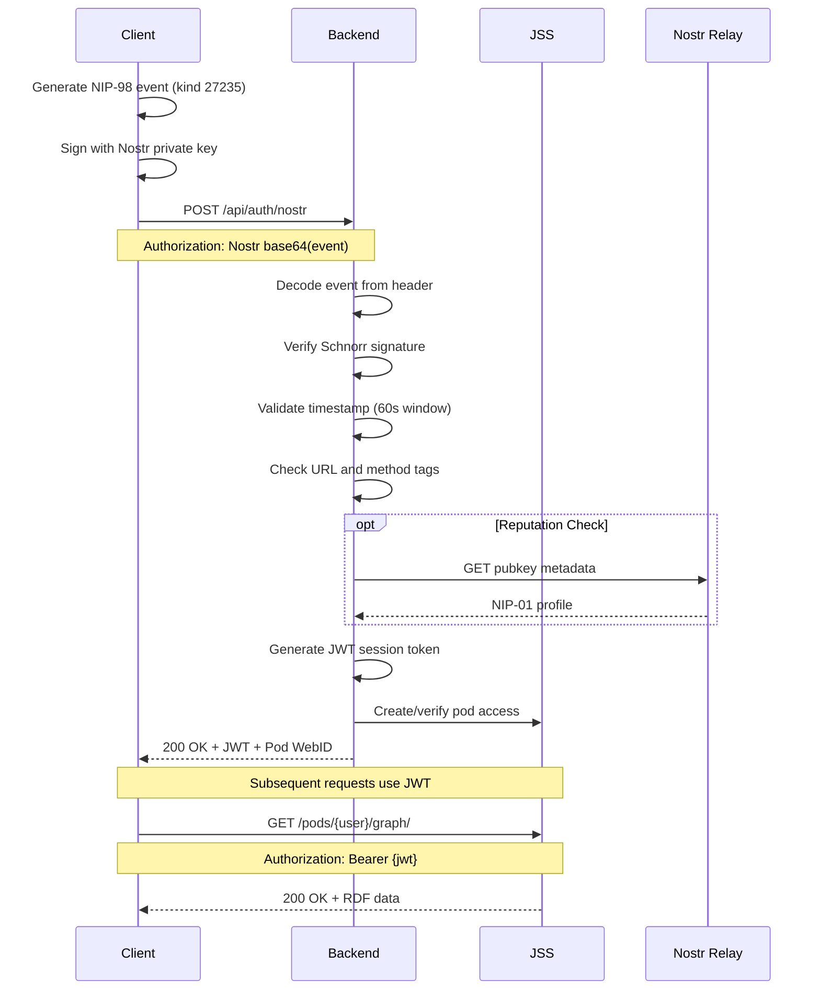
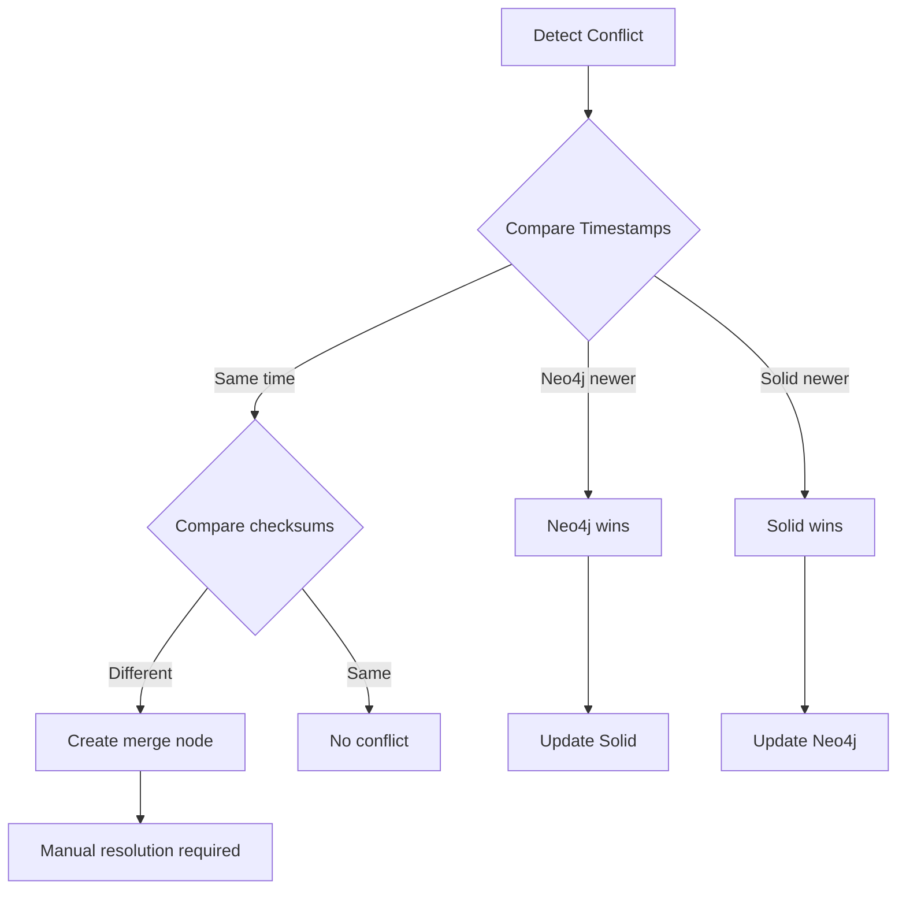

# Solid Sidecar Architecture
## Technical Architecture for Decentralized Data Storage

**Version:** 1.0
**Date:** 2025-12-29
**Target:** VisionFlow with Solid/LDP Integration
**Status:** Architecture Design

---

## Executive Summary

This document defines the technical architecture for VisionFlow's Solid integration, enabling decentralized data ownership through Linked Data Platform (LDP) compliance. The system uses JSON Solid Server (JSS) as a sidecar container, providing:

1. **Decentralized Storage** - User-owned Solid pods for graph data
2. **LDP Compliance** - Standard Linked Data Platform operations
3. **Real-time Notifications** - WebSocket-based resource change notifications
4. **NIP-98 Authentication** - Nostr-based decentralized identity

---

## 1. System Architecture Overview

### 1.1 High-Level Component Diagram

```
                                    VisionFlow System
    +------------------------------------------------------------------------+
    |                                                                        |
    |  +------------------+     +------------------+     +------------------+ |
    |  |                  |     |                  |     |                  | |
    |  |   React Client   |<--->|  Rust Backend    |<--->|     Neo4j        | |
    |  |   (Three.js)     |     |  (Axum/Actix)    |     |   (Graph DB)     | |
    |  |                  |     |                  |     |                  | |
    |  +--------+---------+     +--------+---------+     +------------------+ |
    |           |                        |                                   |
    |           | WebSocket              | HTTP/REST                         |
    |           | (Binary V2)            |                                   |
    |           |                        |                                   |
    |  +--------v------------------------v---------+                         |
    |  |                                           |                         |
    |  |        JSS Sidecar (Node.js)              |                         |
    |  |        +---------------------------+      |                         |
    |  |        |  Solid Server             |      |                         |
    |  |        |  - LDP Container Mgmt     |      |                         |
    |  |        |  - RDF Serialization      |      |                         |
    |  |        |  - WebSocket Notifications|      |                         |
    |  |        |  - NIP-98 Auth Handler    |      |                         |
    |  |        +---------------------------+      |                         |
    |  |                    |                      |                         |
    |  |        +-----------v-----------+          |                         |
    |  |        |    Pod Storage        |          |                         |
    |  |        |    /data/pods/        |          |                         |
    |  |        |    +-- user1/         |          |                         |
    |  |        |    |   +-- graph/     |          |                         |
    |  |        |    |   +-- profile/   |          |                         |
    |  |        |    +-- user2/         |          |                         |
    |  |        +-----------------------+          |                         |
    |  |                                           |                         |
    |  +-------------------------------------------+                         |
    |                                                                        |
    +------------------------------------------------------------------------+
```

### 1.2 Docker Compose Profile

```yaml
# docker-compose.solid.yml
version: '3.8'

services:
  jss:
    image: solidproject/community-server:latest
    container_name: visionflow-jss
    profiles:
      - solid
    ports:
      - "${JSS_PORT:-3000}:3000"
      - "${SOLID_WS_PORT:-3001}:3001"
    volumes:
      - solid-pods:/data/pods
      - ./config/solid.json:/config/config.json:ro
    environment:
      - CSS_CONFIG=/config/config.json
      - CSS_BASE_URL=${JSS_BASE_URL:-http://localhost:3000}
      - CSS_LOGGING_LEVEL=${JSS_LOG_LEVEL:-info}
    networks:
      - visionflow-net
    depends_on:
      - backend
    healthcheck:
      test: ["CMD", "curl", "-f", "http://localhost:3000/.well-known/solid"]
      interval: 30s
      timeout: 10s
      retries: 3

  backend:
    # ... existing backend config
    environment:
      - JSS_ENABLED=${JSS_ENABLED:-false}
      - JSS_HOST=jss
      - JSS_PORT=3000

volumes:
  solid-pods:
    driver: local

networks:
  visionflow-net:
    driver: bridge
```

---

## 2. Data Flow Architecture

### 2.1 Neo4j to Solid Synchronization



### 2.2 Client Request Flow



### 2.3 WebSocket Notification Flow



---

## 3. Component Specifications

### 3.1 JSS Configuration

```json
{
  "@context": "https://linkedsoftwaredependencies.org/bundles/npm/@solid/community-server/^7.0.0/components/context.jsonld",
  "import": [
    "css:config/app/main/default.json",
    "css:config/file/storage/file.json",
    "css:config/http/handler/default.json",
    "css:config/http/middleware/websockets.json",
    "css:config/identity/handler/default.json",
    "css:config/ldp/authorization/webacl.json",
    "css:config/ldp/handler/default.json",
    "css:config/storage/backend/file.json"
  ],
  "@graph": [
    {
      "@id": "urn:solid-server:default:ServerConfigurator",
      "comment": "VisionFlow JSS Configuration",
      "baseUrl": "http://localhost:3000/",
      "rootFilePath": "/data/pods/"
    },
    {
      "@id": "urn:solid-server:default:WebSocketHandler",
      "comment": "Enable WebSocket notifications",
      "WebSocketHandler:_protocol": "solid-0.1"
    }
  ]
}
```

### 3.2 RDF Serialization Format

VisionFlow graph nodes are serialized to Turtle RDF:

```turtle
@prefix vf: <https://visionflow.example.com/ontology#> .
@prefix ldp: <http://www.w3.org/ns/ldp#> .
@prefix xsd: <http://www.w3.org/2001/XMLSchema#> .
@prefix dcterms: <http://purl.org/dc/terms/> .

<> a vf:GraphNode ;
   vf:nodeId "node-550e8400-e29b-41d4-a716-446655440000"^^xsd:string ;
   vf:label "Example Concept"^^xsd:string ;
   vf:type "concept"^^xsd:string ;
   vf:position "1.5,-2.3,0.8"^^xsd:string ;
   vf:velocity "0.0,0.0,0.0"^^xsd:string ;
   vf:weight "1.0"^^xsd:decimal ;
   vf:group "ontology"^^xsd:string ;
   dcterms:created "2025-12-29T10:00:00Z"^^xsd:dateTime ;
   dcterms:modified "2025-12-29T12:30:00Z"^^xsd:dateTime .
```

### 3.3 Container Structure

```
/pods/
  +-- {userId}/
      +-- profile/
      |   +-- card#me           # WebID document
      |   +-- preferences.ttl   # User preferences
      +-- graph/
      |   +-- .meta             # Container metadata
      |   +-- node-{id}.ttl     # Individual node RDF
      |   +-- edge-{id}.ttl     # Edge relationships
      +-- workspaces/
      |   +-- {workspaceId}/
      |       +-- settings.ttl
      |       +-- graph/
      +-- .acl                  # Access control
```

---

## 4. Authentication Architecture

### 4.1 NIP-98 Integration



### 4.2 Access Control (WAC)

```turtle
# /pods/user123/.acl
@prefix acl: <http://www.w3.org/ns/auth/acl#> .
@prefix foaf: <http://xmlns.com/foaf/0.1/> .

<#owner>
    a acl:Authorization ;
    acl:agent <profile/card#me> ;
    acl:accessTo <./> ;
    acl:default <./> ;
    acl:mode acl:Read, acl:Write, acl:Control .

<#public-read>
    a acl:Authorization ;
    acl:agentClass foaf:Agent ;
    acl:accessTo <graph/> ;
    acl:default <graph/> ;
    acl:mode acl:Read .
```

---

## 5. Synchronization Strategy

### 5.1 Sync Modes

| Mode | Direction | Use Case |
|------|-----------|----------|
| `neo4j-to-solid` | Neo4j -> Solid | Export graph for sharing |
| `solid-to-neo4j` | Solid -> Neo4j | Import external data |
| `bidirectional` | Both | Collaborative editing |

### 5.2 Conflict Resolution



### 5.3 Batch Sync Process

```rust
// Pseudocode for batch synchronization
async fn sync_batch(nodes: Vec<Node>, pod_id: &str) -> Result<SyncResult> {
    let batch_size = config.solid_sync_batch_size;
    let mut results = SyncResult::default();

    for chunk in nodes.chunks(batch_size) {
        let rdf_batch = serialize_to_turtle(chunk)?;

        for (node, turtle) in chunk.iter().zip(rdf_batch) {
            let path = format!("/pods/{}/graph/node-{}.ttl", pod_id, node.id);

            match jss_client.put(&path, turtle).await {
                Ok(_) => results.created += 1,
                Err(e) if e.status() == 409 => {
                    // Conflict - attempt merge
                    handle_conflict(node, &path).await?;
                    results.merged += 1;
                }
                Err(e) => results.errors.push(e.to_string()),
            }
        }

        // Yield to event loop between batches
        tokio::task::yield_now().await;
    }

    Ok(results)
}
```

---

## 6. Performance Considerations

### 6.1 Caching Strategy

| Layer | Cache Type | TTL | Purpose |
|-------|------------|-----|---------|
| Client | Browser cache | 5 min | Reduce requests |
| Backend | Redis | 1 min | RDF serialization |
| JSS | In-memory | 30 sec | Hot resources |

### 6.2 Scaling Recommendations

| Deployment Size | Pods | JSS Instances | Memory |
|-----------------|------|---------------|--------|
| Small | < 100 | 1 | 512 MB |
| Medium | 100-1000 | 2-3 | 1 GB each |
| Large | > 1000 | 4+ | 2 GB each |

### 6.3 Resource Limits

```yaml
# docker-compose.solid.yml
services:
  jss:
    deploy:
      resources:
        limits:
          cpus: '2.0'
          memory: 2G
        reservations:
          cpus: '0.5'
          memory: 512M
```

---

## 7. Security Considerations

### 7.1 Security Checklist

- [ ] Enable HTTPS for production JSS
- [ ] Configure WAC for all containers
- [ ] Set CORS origins explicitly
- [ ] Enable DPoP token binding
- [ ] Implement rate limiting
- [ ] Regular security audits

### 7.2 Network Isolation

```yaml
networks:
  visionflow-internal:
    internal: true  # No external access
  visionflow-public:
    driver: bridge

services:
  jss:
    networks:
      - visionflow-internal
      - visionflow-public
  backend:
    networks:
      - visionflow-internal
  neo4j:
    networks:
      - visionflow-internal  # No direct external access
```

---

## 8. Monitoring and Observability

### 8.1 Health Endpoints

| Endpoint | Purpose |
|----------|---------|
| `GET /.well-known/solid` | Solid discovery |
| `GET /health` | JSS health check |
| `GET /metrics` | Prometheus metrics |

### 8.2 Key Metrics

- `solid_pods_total` - Total pod count
- `solid_requests_total` - Request count by method
- `solid_ws_connections` - Active WebSocket connections
- `solid_sync_duration_seconds` - Sync operation duration
- `solid_storage_bytes` - Storage usage per pod

---

## 9. Related Documentation

| Topic | Documentation |
|-------|---------------|
| Protocol Specification | [PROTOCOL_REFERENCE.md](../reference/protocols/README.md#solidldp-protocol) |
| API Endpoints | [rest-api-complete.md](../reference/api/rest-api-complete.md#solid-integration-endpoints) |
| Configuration | [CONFIGURATION_REFERENCE.md](../reference/configuration/README.md#solid-integration-jss-sidecar) |

---

**Architecture Version**: 1.0
**VisionFlow Version**: v0.1.0
**Maintainer**: VisionFlow Architecture Team
**Last Updated**: December 29, 2025
