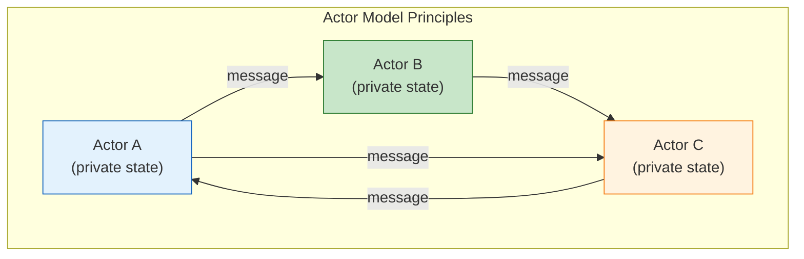

# Actor Model

The actor model is a mathematical model of concurrent computation in which the fundamental unit of processing is the **actor** -- an isolated entity with private state that communicates exclusively through asynchronous message passing. VisionFlow adopts this model through the Actix framework, using it to coordinate graph state management, GPU physics simulation, WebSocket broadcasting, and ontology processing across 21+ specialised actors.

---

## Why the Actor Model

VisionFlow must handle several inherently concurrent concerns simultaneously: WebSocket clients connect and disconnect at unpredictable intervals, GPU physics simulations run at 60 Hz, ontology changes trigger cascading graph updates, and REST API requests arrive in parallel. Traditional shared-state concurrency (mutexes, locks) leads to deadlocks and contention under these conditions.

The actor model addresses this by eliminating shared mutable state entirely. Each actor owns its data privately and processes one message at a time from its mailbox. Concurrency arises from having many actors running in parallel, each handling their own messages independently. Failures in one actor are contained and managed by supervisor actors that decide whether to restart, escalate, or ignore the failure.



---

## Actors in VisionFlow

VisionFlow organises its actors into a supervised hierarchy. The root `GraphServiceSupervisor` uses a one-for-one restart strategy, meaning a failure in any child actor triggers only that child's restart while siblings continue unaffected.

The key actors and their responsibilities are:

**GraphStateActor** -- the central state manager for the knowledge graph. It maintains the in-memory graph representation, handles node and edge CRUD operations through CQRS handlers, and coordinates with Neo4j for persistence. It operates as a state machine transitioning through `Uninitialized`, `Loading`, `Ready`, `Updating`, and `Simulating` states.

**PhysicsOrchestratorActor** -- coordinates 11 GPU sub-actors that collectively run the physics simulation pipeline. Each physics step involves parallel force computation (ForceComputeActor and SemanticForcesActor run concurrently), sequential constraint validation (ConstraintActor then OntologyConstraintActor), position updates, and a broadcast to connected clients. This actor uses an all-for-one supervision strategy because its GPU sub-actors share device state.

**ClientCoordinatorActor** -- manages WebSocket connections for all connected clients. It handles client registration and deregistration, serialises graph state into the 34-byte binary wire protocol, and implements adaptive broadcast intervals (60 FPS when the simulation is active, 5 Hz when the graph has settled).

**SemanticProcessorActor** -- drives AI and ML features including content embedding generation, topic classification, importance scoring, and constraint generation based on semantic similarity.

---

## Message Passing Patterns

Actix supports several message passing patterns that VisionFlow uses throughout the system:

**Request-Response** -- the sender awaits a typed response from the actor. Used when the caller needs the result before proceeding, such as fetching graph data for an API response:

```rust
let graph_data: Arc<GraphData> = graph_actor.send(GetGraphData).await?;
```

**Fire-and-Forget** -- the sender dispatches a message without waiting for acknowledgement. Used for broadcasting position updates to clients where the sender does not need confirmation:

```rust
client_coordinator.do_send(UpdateNodePositions { positions });
```

**Pub/Sub** -- an actor maintains a list of subscribers and notifies all of them when relevant events occur. The `GraphStateActor` uses this pattern to notify `SemanticProcessorActor` and `PhysicsOrchestratorActor` when the graph structure changes.

**Coordination** -- multi-actor orchestration where an actor fans out work to children and joins the results. The `PhysicsOrchestratorActor` uses `join!` to run force computation and semantic force computation in parallel, then sequences constraint validation before broadcasting.

---

## Fault Tolerance and Supervision

Each actor in the hierarchy has a supervision strategy that determines recovery behaviour when a child fails:

- **OneForOne** (default): only the failed actor restarts. Used by the root supervisor because most actors are independent.
- **AllForOne**: all children restart when any one fails. Used by the physics orchestrator because GPU sub-actors share CUDA device state.
- **RestForOne**: the failed actor and all actors started after it restart, preserving initialisation ordering for dependency chains.

Restart policies include exponential backoff (starting at 500ms, capping at 5 seconds) with a maximum of 3 restarts within a 10-second window. If an actor exceeds this limit, the failure escalates to its parent supervisor.

GPU-specific failures receive special treatment: a CUDA out-of-memory error causes the `ForceComputeActor` to stop itself, triggering the physics orchestrator's all-for-one strategy to reset all GPU actors and reinitialise device memory.

---

## Relationship to Hexagonal Architecture

Actors in VisionFlow serve as the **presentation layer** of the hexagonal architecture. They receive external inputs (HTTP requests, WebSocket messages, timer ticks) and translate them into domain operations by dispatching commands and queries through the CQRS bus. The bus handlers in turn call port trait methods, which are satisfied by adapters. This means actors never access the database or GPU directly -- they go through the hexagonal boundary, preserving testability and separation of concerns.

Some adapters bridge back into the actor system. The `ActorGraphRepository` adapter implements the `GraphRepository` port by sending messages to the `GraphStateActor`, allowing non-actor code (such as CQRS handlers) to access actor-managed state through the standard port interface.

---

## See Also

- [Actor System Architecture](../architecture/actor-system.md) -- detailed reference with all 21 actors, message patterns, performance characteristics, and lifecycle management
- [Hexagonal Architecture](hexagonal-architecture.md) -- how ports and adapters integrate with the actor system
- [Physics Engine](physics-engine.md) -- GPU actor coordination for physics simulation
- [Real-Time Sync](real-time-sync.md) -- WebSocket binary protocol managed by the ClientCoordinatorActor
- [Hexagonal CQRS Unified Reference](../architecture/hexagonal-cqrs-unified.md) -- exhaustive architecture reference
