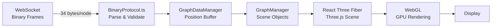
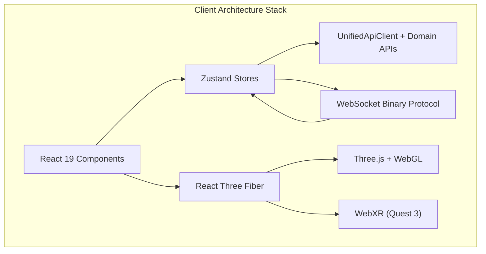

# Core Client Architecture

VisionFlow's client is a React 19 application that renders interactive 3D knowledge graphs using Three.js via React Three Fiber (R3F). It receives real-time node position updates from the server over a binary WebSocket protocol, manages application state with Zustand, and supports immersive viewing on Meta Quest 3 through WebXR. Voice interaction is provided through LiveKit-based audio streaming with Whisper STT and Kokoro TTS on the server side.

---

## Rendering Pipeline

The client's primary responsibility is rendering the knowledge graph as an interactive 3D scene. The rendering pipeline flows from data ingestion through scene management to GPU-accelerated browser rendering:

**React Three Fiber** wraps Three.js in a declarative React component model. The `GraphCanvas` component establishes the R3F canvas, camera controls, and post-processing effects (selective bloom, holographic data sphere). `GraphManager` maintains the Three.js scene graph, creating and updating instanced meshes for nodes and line geometries for edges.

**Instanced rendering** is used for nodes: a single draw call renders all nodes of the same type using `InstancedMesh`, with per-instance transform matrices updated each frame from the position buffer. This keeps draw calls constant regardless of graph size, enabling smooth rendering of graphs with 10K+ nodes.

**Post-processing** includes selective bloom (highlighting active or selected nodes), and the HolographicDataSphere module for environmental effects. Level-of-detail (LOD) and frustum culling reduce rendering work for off-screen and distant nodes.

---

## Binary WebSocket Protocol

The client receives node position updates through a binary WebSocket connection to the server's `/wss` endpoint. Each node is encoded in a compact 34-byte wire format:

| Offset | Field | Type | Purpose |
|---|---|---|---|
| 0 | `node_id` | `u16` | Node identifier (with type flags: 0x4000 = Knowledge, 0x8000 = Agent) |
| 2 | `position` | `[f32; 3]` | X, Y, Z coordinates |
| 14 | `velocity` | `[f32; 3]` | Velocity components (for interpolation) |
| 26 | `sssp_distance` | `f32` | Shortest-path distance from selected source |
| 30 | `sssp_parent` | `i32` | Parent node in shortest-path tree |

This binary encoding achieves a 95% bandwidth reduction compared to the equivalent JSON representation. The `BinaryWebSocketProtocol` handler layer parses incoming frames, validates node data ranges, and batches updates before passing them to the `GraphDataManager`.

The protocol supports four message type ranges: control messages (0x00-0x0F), data messages (0x10-0x3F), stream messages for voice (0x40-0x5F), and agent messages (0x60-0x7F). The client's `WebSocketService` manages connection lifecycle, automatic reconnection with backoff, and heartbeat monitoring.

---

## State Management

Application state is managed through Zustand stores, providing lightweight, hook-based reactive state without the boilerplate of Redux:

- **Settings Store** (`settingsStore.ts`) -- manages all user and system configuration with path-based lazy loading, undo/redo history, and an `AutoSaveManager` that debounces changes and batch-persists them to the server via the Settings API.

- **Graph Data Manager** -- maintains the current graph state including node positions (updated from WebSocket), node metadata (polled from REST API), and edge data. Separates high-frequency position data (binary WebSocket) from low-frequency metadata (REST polling at 3s active / 15s idle intervals).

- **Bots Data Provider** -- a React context provider that combines WebSocket-sourced agent position data with REST-polled agent metadata (status, health, CPU/memory metrics, capabilities) into a unified data context consumed by the agent visualisation components.

---

## REST API Integration

The client communicates with the server's REST API through `UnifiedApiClient`, a centralised HTTP client with consistent error handling, request batching, and caching. Domain-specific API modules build on this foundation:

- `settingsApi` -- debounced, batched settings persistence with priority queuing
- `analyticsApi` -- GPU analytics integration for clustering, pathfinding, and anomaly detection results
- `optimisationApi` -- graph layout optimisation triggers (stress majorisation, constraint solving)
- `workspaceApi` -- multi-tenant workspace CRUD operations
- `exportApi` -- graph export, publishing, and sharing

The layered API architecture totals approximately 3,145 lines of code with clear separation between the HTTP transport layer and domain-specific request/response handling.

---

## Voice and XR

**Voice interaction** uses the `useVoiceInteraction` hook to capture audio from the browser's MediaStream API, stream it to the server over the binary WebSocket protocol, process it through Whisper STT on the server, execute the recognised command, and return synthesised speech via Kokoro TTS. Voice components are integrated into the control panel rather than existing as standalone UI elements.

**WebXR support** enables immersive 3D graph exploration on Meta Quest 3. The `XRCoreProvider` detects Quest 3 hardware via user agent inspection or `?force=quest3` URL parameters, initialises a WebXR session, and switches the application layout from `MainLayout` to `Quest3AR` which provides spatial UI elements and hand tracking input.

---

## Performance Optimisations

The client employs several strategies to maintain interactive frame rates with large graphs:

1. **Binary protocol** -- 34-byte wire format eliminates JSON parse overhead and reduces bandwidth by 95%.
2. **Instanced rendering** -- single draw call per node type regardless of count.
3. **Frustum culling and LOD** -- skip rendering for off-screen and distant nodes.
4. **Batch processing** -- `BatchQueue` accumulates WebSocket updates and applies them in a single animation frame.
5. **Lazy loading** -- settings UI sections load on demand; virtualised components handle large configuration lists.
6. **Smart polling** -- agent metadata polling adapts between 3-second (active) and 15-second (idle) intervals, reducing server load by 70% compared to the original aggressive polling.

---

## See Also

- [Core Server Architecture](server.md) -- the Rust backend that drives the client
- [Physics Engine](../../physics-engine.md) -- server-side simulation that produces the position data consumed by the client
- [Real-Time Sync](../../real-time-sync.md) -- detailed WebSocket binary protocol specification
- [Client Overview (detailed)](../../../architecture/client/overview.md) -- exhaustive client architecture reference with component interaction matrix
- [Three.js Rendering Guide](../../../../how-to/development/three-js-rendering.md) -- practical guide to working with the rendering pipeline
- [WebSocket Best Practices](../../../../how-to/development/websocket-best-practices.md) -- development guidelines for WebSocket integration
