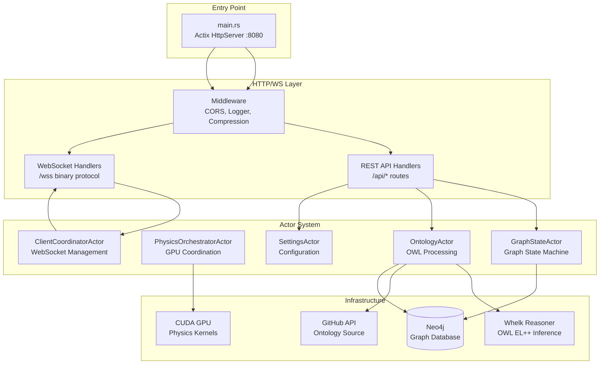
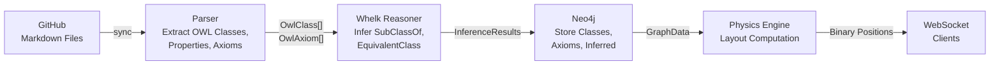

# Core Server Architecture

VisionFlow's server is a Rust application built on the Actix-web framework. It serves HTTP REST endpoints, manages real-time WebSocket connections, coordinates GPU physics simulation, and runs an ontology processing pipeline. The server uses Neo4j as its graph database and the Whelk OWL EL++ reasoner for ontology inference. All components are organised under a hexagonal (ports-and-adapters) architecture with CQRS for command/query separation.

---

## Server Components

The server process hosts four major subsystems, each managed by dedicated Actix actors:



**Actix-web HTTP Server** -- the `main.rs` entry point configures an Actix HttpServer on port 8080 (proxied through Nginx on port 3030 in production). Middleware handles CORS, request logging, response compression, and error recovery. Routes are organised into domain-specific handler modules: graph operations, file/GitHub integration, agent management, analytics, workspace management, and settings.

**Neo4j Graph Store** -- Neo4j serves as the single source of truth for all graph data, ontology structures, and user settings. The server communicates with Neo4j via the Bolt protocol using Cypher queries. Five Neo4j adapter implementations (`Neo4jAdapter`, `Neo4jGraphRepository`, `Neo4jOntologyRepository`, `Neo4jSettingsRepository`, `ActorGraphRepository`) satisfy the hexagonal port traits. Typical query latency is 2-3ms for simple lookups and ~12ms for full graph retrieval.

**Whelk OWL Reasoner** -- the `WhelkInferenceEngine` adapter implements the `InferenceEngine` port using Whelk, a Rust-native OWL EL++ reasoner. It loads OWL classes and axioms, performs classification and consistency checking, infers new axioms (SubClassOf, EquivalentClass, DisjointWith), and can explain entailments by tracing the axioms that support an inference. Reasoning typically completes in ~100ms.

**GPU Physics Subsystem** -- the `PhysicsOrchestratorActor` manages 11 specialised GPU sub-actors that execute CUDA kernels for force-directed layout, clustering, anomaly detection, shortest-path computation, and stress majorisation. See the [Physics Engine](../../physics-engine.md) concept page for details.

---

## Ontology Pipeline

VisionFlow processes ontologies through a multi-stage pipeline that begins with GitHub and ends with a reasoned, queryable knowledge graph stored in Neo4j:



1. **GitHub Sync** -- the `KnowledgeGraphRepository` port's `sync_from_github` capability fetches markdown files from a configured GitHub repository. Each file represents an ontology concept with structured frontmatter containing metadata such as term IDs, domain classification, quality scores, and OWL relationship declarations.

2. **Parsing** -- the enhanced ontology parser extracts `OwlClass` instances (with rich metadata including `term_id`, `preferred_term`, `source_domain`, `quality_score`, `owl_physicality`, and domain relationships), `OwlProperty` instances (with domain/range declarations), and `OwlAxiom` instances (SubClassOf, EquivalentClass, DisjointWith, and property assertions).

3. **Reasoning** -- the parsed ontology is loaded into the Whelk reasoner via `InferenceEngine::load_ontology()`. The reasoner classifies the hierarchy, checks consistency, and produces `InferenceResults` containing inferred axioms and timing metrics.

4. **Storage** -- classes, properties, explicit axioms, and inferred axioms are persisted to Neo4j via `OntologyRepository::save_ontology()`. The ontology graph is also merged into the main knowledge graph for unified visualisation.

5. **Visualisation** -- the stored graph feeds into the physics engine for layout computation, and the resulting positions stream to connected clients over the binary WebSocket protocol.

---

## Application State

The `AppState` struct is the central state container, shared across all Actix-web handlers via `web::Data<AppState>`. It holds actor addresses for the graph supervisor, GPU manager, client coordinator, settings actors, and agent monitoring actors. Handlers access domain operations by sending messages to the appropriate actor, which in turn dispatches through the CQRS bus to port-backed handlers.

```rust
pub struct AppState {
    pub graph_service_addr: Addr<TransitionalGraphSupervisor>,
    pub gpu_manager_addr: Addr<GPUManagerActor>,
    pub client_coordinator_addr: Addr<ClientCoordinatorActor>,
    pub settings_addr: Addr<OptimisedSettingsActor>,
    pub agent_monitor_addr: Addr<AgentMonitorActor>,
    // ... additional actor addresses
}
```

The server is currently in Phase 2 of a three-phase migration from a monolithic `GraphServiceActor` to the fully decomposed hexagonal CQRS architecture. The `TransitionalGraphSupervisor` bridges the legacy and new architectures during this transition.

---

## See Also

- [Core Client Architecture](client.md) -- the React/Three.js frontend that consumes this server's APIs
- [Actor Model](../../actor-model.md) -- how Actix actors coordinate server-side processing
- [Hexagonal Architecture](../../hexagonal-architecture.md) -- the ports-and-adapters pattern organising the server
- [Physics Engine](../../physics-engine.md) -- GPU-accelerated graph layout computation
- [Ontology Reasoning](../../ontology-reasoning.md) -- detailed explanation of OWL reasoning concepts
- [Server Overview (detailed)](../../../architecture/server/overview.md) -- exhaustive server architecture reference with Mermaid diagrams
