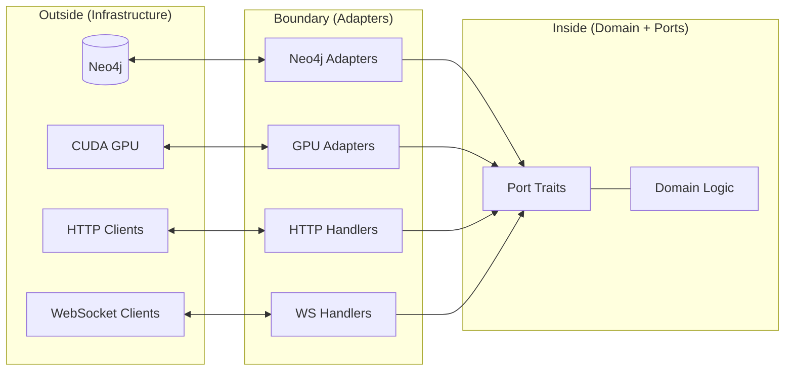

# Hexagonal Architecture

Hexagonal architecture -- originally described by Alistair Cockburn as the "Ports and Adapters" pattern -- is an architectural style that places the application's domain logic at the centre, surrounded by technology-agnostic interfaces (ports) that are implemented by interchangeable infrastructure components (adapters). VisionFlow adopts this pattern as the organising principle for its Rust backend.

---

## The Core Idea

Traditional layered architectures tend to leak infrastructure details into business logic. Database queries appear in HTTP handlers, GPU calls sit alongside domain validation, and testing requires standing up the entire infrastructure stack. Hexagonal architecture inverts these dependencies.

The domain core defines abstract traits (ports) that describe *what* it needs -- "store this OWL class", "compute forces for these nodes", "fetch the subclass hierarchy" -- without any knowledge of *how* those needs are fulfilled. Concrete implementations (adapters) satisfy the ports using specific technologies: Neo4j for graph storage, CUDA for GPU computation, Actix for actor coordination.

The result is that the domain can be tested in complete isolation by substituting mock adapters, infrastructure can be swapped without touching business logic, and multiple presentation layers (REST, WebSocket, GraphQL) can coexist against the same domain.

---

## How VisionFlow Implements It

VisionFlow defines nine port traits in `src/ports/`, each representing a distinct capability boundary. The three most architecturally significant are:

- **`OntologyRepository`** (`src/ports/ontology_repository.rs`) -- abstracts OWL class, property, and axiom storage. The `Neo4jOntologyRepository` adapter implements this against Neo4j's Cypher query language, but the domain's ontology pipeline has no knowledge of Neo4j.

- **`KnowledgeGraphRepository`** (`src/ports/knowledge_graph_repository.rs`) -- abstracts the main knowledge graph with node/edge CRUD, batch operations, and position persistence. Two adapters exist: `Neo4jGraphRepository` for direct database access, and `ActorGraphRepository` which bridges to the Actix actor system.

- **`InferenceEngine`** (`src/ports/inference_engine.rs`) -- abstracts OWL reasoning. The `WhelkInferenceEngine` adapter implements this using Whelk, a Rust OWL EL++ reasoner, but the port could equally be satisfied by an external OWL-API service.

Adapters live in `src/adapters/` and are injected into the application layer as `Arc<dyn PortTrait>`. This means every handler receives its dependencies through constructor injection, making the dependency graph explicit and testable.

---

## Why It Matters for VisionFlow

VisionFlow integrates several complex subsystems -- a graph database, GPU physics simulation, OWL reasoning, and real-time WebSocket communication -- into a single server process. Without hexagonal boundaries, these concerns would quickly become entangled. The pattern provides three concrete benefits:

1. **Independent evolution.** The GPU physics system can adopt new CUDA kernels or fall back to CPU computation without affecting the ontology pipeline, because both interact with the domain through separate ports.

2. **Isolation for testing.** Domain-level tests (of which there are 114 CQRS handlers) run against mock adapters in milliseconds, without requiring a Neo4j instance, GPU hardware, or network connectivity.

3. **Multiple adapters per port.** The `GraphRepository` port has both a direct Neo4j implementation and an actor-bridged implementation, chosen at startup based on configuration. The `GpuPhysicsAdapter` port has both a CUDA implementation and a CPU/Rayon fallback.

---

## Relationship to CQRS

VisionFlow pairs hexagonal architecture with Command Query Responsibility Segregation (CQRS). The application layer in `src/application/` organises every operation as either a **directive** (command / write) or a **query** (read). Directives flow through services that call port methods with mutation semantics; queries go through repositories for read-only access. This separation allows each path to be optimised independently and keeps write-side consistency concerns separate from read-side performance concerns.

For the detailed pattern reference -- including the full list of ports, adapters, handler distribution, and code examples -- see the [Hexagonal CQRS Pattern](../architecture/patterns/hexagonal-cqrs.md) documentation.

---

## See Also

- [Hexagonal CQRS Pattern](../architecture/patterns/hexagonal-cqrs.md) -- detailed pattern reference with code examples and handler inventory
- [Hexagonal CQRS Unified Reference](../architecture/hexagonal-cqrs-unified.md) -- exhaustive reference with actor hierarchy and performance metrics
- [Actor Model](actor-model.md) -- how the Actix actor system integrates with hexagonal ports
- [Adapter Patterns](../architecture/adapter-patterns.md) -- guide to writing new adapters
- [Architecture Overview](../architecture/README.md) -- top-level architecture documentation index
