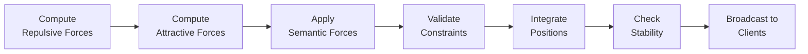

# Physics Engine

VisionFlow's physics engine computes force-directed graph layouts on the GPU, producing spatial positions for every node in the knowledge graph. The simulation runs server-side under the `PhysicsOrchestratorActor`, with CUDA kernels executing the core algorithms, and position updates streaming to connected clients over a binary WebSocket protocol at up to 60 FPS.

---

## Server-Authoritative Simulation

The physics simulation is **server-authoritative**: the server is the single source of truth for node positions. Clients receive position updates and render them, but they do not run their own simulation. This design ensures consistency across multiple simultaneous viewers, simplifies conflict resolution, and allows the server to leverage GPU hardware that clients may not have.

The simulation loop runs at a configurable tick rate (typically 60 Hz when the graph is actively settling, dropping to 5 Hz once kinetic energy falls below a stability threshold). Each tick follows a fixed pipeline:

The `PhysicsOrchestratorActor` coordinates 11 GPU sub-actors to execute this pipeline. Force computation and semantic force computation run in parallel (they read positions but do not write), followed by sequential constraint validation (which enforces hard layout rules), and finally position integration and client broadcast.

---

## CUDA Kernel Architecture

VisionFlow implements 87 production CUDA kernels across 13 files, with 37 kernels dedicated to physics simulation. The kernels use structure-of-arrays (SoA) memory layout for coalesced GPU memory access, achieving 8-10x better memory bandwidth than array-of-structures approaches.

The core physics kernels include:

- **`build_grid_kernel`** -- constructs a 3D spatial hash grid, enabling O(n) neighbour detection instead of O(n^2) pairwise comparisons. The grid is rebuilt each frame in approximately 0.3ms for 100K nodes.

- **`force_pass_kernel`** -- integrates multiple force types (repulsion, attraction, gravity) with Barnes-Hut approximation for distant node clusters. This reduces repulsive force computation from O(n^2) to O(n log n) by treating distant clusters as single masses when the ratio of cluster size to distance falls below a configurable theta parameter (typically 0.5).

- **`integrate_pass_kernel`** -- applies Verlet integration with adaptive timestep and velocity damping to update node positions from accumulated forces.

- **`check_system_stability_kernel`** -- computes total kinetic energy across all nodes. When KE drops below a threshold, the system enters a settled state and reduces its tick rate to conserve resources.

For 100K nodes, the entire working set (positions, velocities, forces, graph CSR structure) fits within approximately 10-22 MB, comfortably inside the GPU's L2 cache, minimising expensive global memory access.

---

## Stress Majorisation

In addition to local force-directed layout, VisionFlow implements a global stress majorisation algorithm that periodically optimises the layout to better match ideal graph-theoretic distances. Where force-directed simulation excels at local arrangement, stress majorisation provides global optimisation that reduces edge crossings, improves symmetry, and preserves graph distance relationships.

The stress function measures layout quality as the weighted sum of squared differences between ideal distances (shortest path lengths) and actual Euclidean distances between node pairs. GPU kernels compute stress gradients and apply majorisation steps, blending the result with the running force-directed simulation at a configurable blend factor (typically 0.2, favouring local dynamics 80/20).

Stress majorisation runs periodically (default: every 120 frames, i.e., every 2 seconds at 60 FPS) and uses early convergence detection to terminate when the layout is already satisfactory.

---

## Client Communication

Position updates reach clients through a compact binary WebSocket protocol. Each node is serialised into a 34-byte wire packet:

| Field | Type | Size |
|---|---|---|
| `node_id` | `u16` | 2 bytes |
| `position` | `[f32; 3]` | 12 bytes |
| `velocity` | `[f32; 3]` | 12 bytes |
| `sssp_distance` | `f32` | 4 bytes |
| `sssp_parent` | `i32` | 4 bytes |

This binary format achieves 95% bandwidth reduction compared to JSON serialisation. The `ClientCoordinatorActor` manages per-client filtering (so clients only receive updates for nodes in their viewport) and adapts broadcast frequency based on simulation state -- 60 FPS during active settling, 5 Hz once stable.

Internally, the GPU operates on a richer 48-byte `BinaryNodeDataGPU` structure that includes additional fields for cluster assignment, centrality scores, and mass. These fields are used for analytics and layout computation but are not transmitted to clients.

---

## Performance Characteristics

On an NVIDIA RTX 4090, the physics engine achieves the following frame times:

| Graph Size | Force Computation | Integration | Grid Construction | Total Frame |
|---|---|---|---|---|
| 10K nodes | 0.8 ms | 0.2 ms | 0.1 ms | 2.6 ms |
| 100K nodes | 2.5 ms | 0.5 ms | 0.3 ms | 10.8 ms |

At 100K nodes the total frame time of 10.8 ms consumes approximately 65% of the 16.67 ms budget for 60 FPS, leaving headroom for semantic forces, constraint validation, and analytics.

When CUDA hardware is unavailable, VisionFlow falls back to CPU computation using Rayon for parallelism and SIMD intrinsics (AVX2/SSE4.1) for vectorised force calculations. This fallback achieves performance within 2-4x of the GPU path, sufficient for interactive use on graphs up to approximately 10K nodes.

---

## See Also

- [GPU Acceleration](gpu-acceleration.md) -- detailed CUDA kernel inventory, memory hierarchy, and hardware requirements
- [Stress Majorization](../architecture/stress-majorization.md) -- full algorithm reference with configuration parameters and benchmarks
- [Actor Model](actor-model.md) -- how `PhysicsOrchestratorActor` coordinates GPU sub-actors
- [Constraint System](constraint-system.md) -- LOD-aware constraint management for physics layout
- [Semantic Forces](../architecture/physics/semantic-forces.md) -- force-based layout driven by ontology relationships
- [Real-Time Sync](real-time-sync.md) -- WebSocket binary protocol details
