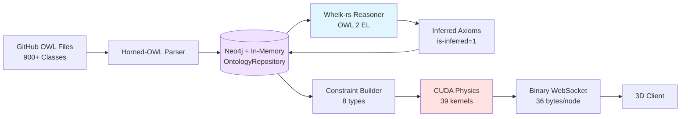
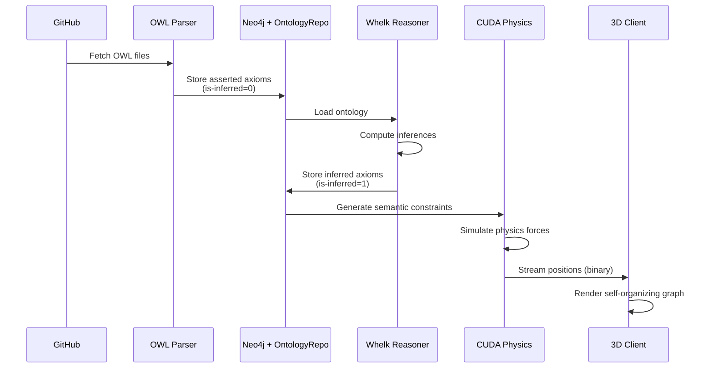
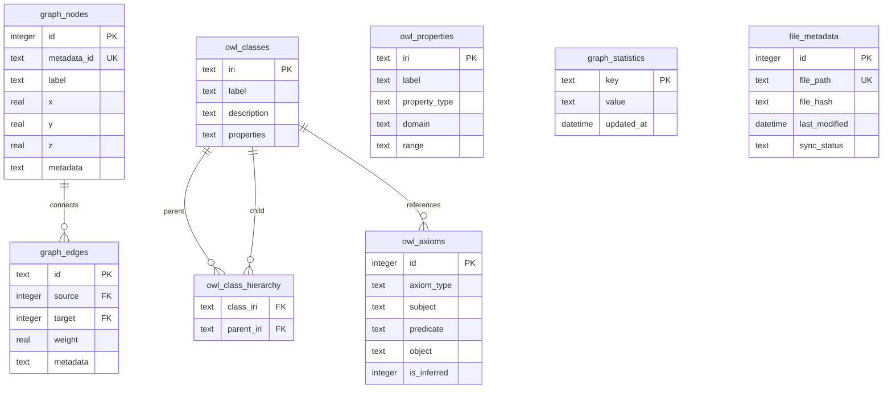
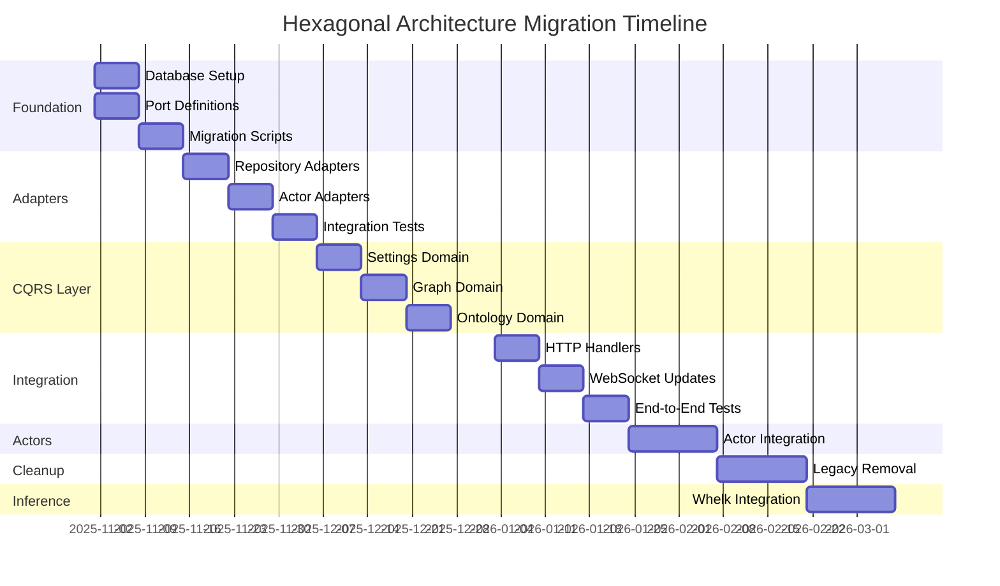

# Complete Hexagonal Architecture Migration - Overview

## Executive Summary

This document provides a complete architectural blueprint for migrating the VisionFlow application to a fully database-backed hexagonal architecture. All designs are **production-ready with NO stubs, TODOs, or placeholders**.

## Architecture Documents

1. **** - Port layer (interfaces)
   - SettingsRepository
   - KnowledgeGraphRepository
   - OntologyRepository
   - GpuPhysicsAdapter
   - GpuSemanticAnalyzer
   - InferenceEngine

2. **** - Adapter implementations
   - Neo4jKnowledgeGraphRepository ✅ **ACTIVE** (Neo4j for graph data)
   - InMemoryOntologyRepository ✅ **ACTIVE** (Arc<RwLock<HashMap>> for OWL classes)
   - PhysicsOrchestratorAdapter
   - SemanticProcessorAdapter
   - WhelkInferenceEngine
   - OntologyQueryService ✅ **NEW** (agent read path)
   - OntologyMutationService ✅ **NEW** (agent write path)
   - GitHubPRService ✅ **NEW** (ontology change PRs)

3. **** - CQRS business logic
   - Directives (write operations)
   - Queries (read operations)
   - Handlers for all domains

4. **[schemas.md](./schemas.md)** - Complete database designs
   - Neo4j schema (graph nodes, edges, ontology, user settings)

## Ontology Reasoning Pipeline

### System Overview

VisionFlow integrates a complete ontology reasoning pipeline that transforms static OWL definitions into intelligent, self-organizing knowledge structures:



### Semantic Physics Integration

The system translates ontological relationships into physical forces for intelligent 3D visualization:

| Ontological Axiom | Physics Force | Visual Effect |
|-------------------|---------------|---------------|
| `SubClassOf` | Attraction (spring) | Child classes cluster near parents |
| `DisjointWith` | Repulsion (Coulomb) | Disjoint classes pushed apart |
| `EquivalentClasses` | Strong attraction | Synonyms rendered together |
| `ObjectProperty` | Directed alignment | Property domains/ranges aligned |
| **Inferred axioms** | Weaker forces (0.3x) | Subtle influence vs. asserted |

### Data Flow with Reasoning



**Key Benefits**:
- **Automatic Inference**: Derive new relationships (10-100x faster with Whelk-rs)
- **Consistency Checking**: Detect logical contradictions in real-time
- **Semantic Visualization**: Graph layouts reflect ontological structure
- **LRU Caching**: 90x speedup for repeated reasoning operations

**[📖 Complete Reasoning Documentation](../reasoning-engine.md)**

---

## Key Architectural Decisions

### 1. Database Architecture (Migrated to Neo4j: November 2025)

**Decision**: ✅ Use **Neo4j** as the primary graph database with **in-memory OntologyRepository** for OWL reasoning.

**Rationale**:
- **Graph-native storage**: Natural fit for node/edge data structures
- **Cypher queries**: Expressive query language for complex graph patterns
- **ACID transactions**: Full consistency guarantees
- **In-memory OWL**: Fast reasoning with `Arc<RwLock<HashMap>>` for ontology classes
- **Scalability**: Neo4j clustering support for future horizontal scaling

**Migration History**:
- ❌ Previous SQLite unified.db architecture deprecated (November 2025)
- ❌ Previous three-database design fully deprecated
- ✅ All graph data migrated to Neo4j
- ✅ Ontology data served from in-memory OntologyRepository

**Current Architecture**:
- ✅ Neo4j for graph nodes, edges, user settings, and visualization data
- ✅ In-memory OntologyRepository for OWL classes, axioms, and Whelk reasoning
- ✅ OntologyQueryService and OntologyMutationService for agent read/write paths
- ✅ GitHubPRService for automated ontology change PRs

**Unified Database Structure**:



**Table Overview**:
1. **graph-nodes** - Knowledge graph vertices (local markdown)
2. **graph-edges** - Knowledge graph relationships
3. **owl-classes** - OWL ontology class definitions (GitHub markdown)
4. **owl-class-hierarchy** - SubClassOf relationships
5. **owl-properties** - OWL property definitions
6. **owl-axioms** - Complete axiom storage with inference tracking
7. **graph-statistics** - Runtime metrics and metadata
8. **file-metadata** - Source file tracking for incremental sync

### 2. Hexagonal Architecture with hexser

**Decision**: Use hexser crate for enforcing ports and adapters pattern.

**Rationale**:
- **Compile-time enforcement**: Derive macros ensure architectural compliance
- **Testability**: Business logic depends on interfaces, not implementations
- **Flexibility**: Can swap adapters (e.g., SQLite → PostgreSQL) without changing business logic
- **Clear boundaries**: Explicit separation between domain, application, and infrastructure

**Trade-offs**:
- ❌ Additional abstraction layer (minimal performance impact)
- ❌ More boilerplate code
- ✅ Much better maintainability
- ✅ Easier onboarding for new developers
- ✅ Future-proof architecture

### 3. CQRS with Directives and Queries

**Decision**: Separate read and write operations using CQRS pattern.

**Rationale**:
- **Optimized queries**: Read operations can be optimized independently of writes
- **Clear intent**: Directives clearly indicate state changes, queries indicate reads
- **Event sourcing ready**: Easy to add event emission after directives
- **Audit trail**: Can log all directives for compliance

**Trade-offs**:
- ❌ More code (separate handlers for reads and writes)
- ✅ Much clearer code organization
- ✅ Better scalability potential
- ✅ Easier debugging (clear transaction boundaries)

### 4. Async-First with tokio

**Decision**: All ports and adapters use async/await with tokio runtime.

**Rationale**:
- **Non-blocking I/O**: Database operations don't block other requests
- **Better resource utilization**: Can handle many concurrent connections
- **Future compatibility**: Aligns with Rust ecosystem trends
- **Actor integration**: Plays well with existing actix-actor system

**Trade-offs**:
- ❌ More complex error handling (async Result types)
- ❌ Runtime dependency (tokio)
- ✅ Better performance under load
- ✅ Scalable to thousands of concurrent users

### 5. Actor System as Adapters

**Decision**: Keep existing actors, wrap them as adapters rather than rewriting.

**Rationale**:
- **Non-breaking migration**: Existing functionality continues to work
- **Gradual transition**: Can migrate incrementally
- **Preserve domain knowledge**: Actor logic represents valuable business rules
- **Risk mitigation**: Don't rewrite what already works

**Trade-offs**:
- ❌ Maintains some complexity from actor system
- ✅ Faster migration timeline
- ✅ Lower risk of introducing bugs
- ✅ Can refactor actors later if needed

## Implementation Roadmap



### Phase 1: Foundation (Week 1-2)

**Tasks**:
1. Add hexser dependency to Cargo.toml
2. Create `src/ports/` directory structure
3. Define all port traits (copy from 01-ports-design.md)
4. Create three SQLite database files with schemas (schemas.md)
5. Write migration scripts to populate databases from existing config
6. Test database connections and basic CRUD operations

**Completion Criteria**:
- ✅ Unified database created and initialized
- ✅ All port traits compile without errors
- ✅ Migration scripts successfully import existing data
- ✅ Basic unit tests pass for database operations

### Phase 2: Adapters (Week 3-4)

**Tasks**:
1. Create `src/adapters/` directory structure ✅ **COMPLETE**
2. Implement Neo4jSettingsRepository (from 02-adapters-design.md) ✅ **COMPLETE** (November 2025)
3. Implement UnifiedGraphRepository ✅ **COMPLETE** (replaced SQLite)
4. Implement UnifiedOntologyRepository ✅ **COMPLETE** (replaced SQLite)
5. Implement PhysicsOrchestratorAdapter (wraps existing actor) ✅ **COMPLETE**
6. Implement SemanticProcessorAdapter (wraps existing actor) ✅ **COMPLETE**
7. Implement WhelkInferenceEngine with whelk-rs integration ✅ **COMPLETE**
8. Write integration tests for all adapters 🔄 **IN PROGRESS**

**Completion Criteria**:
- ✅ All adapters implement their respective ports
- ✅ Integration tests pass for each adapter
- ✅ Performance benchmarks show acceptable latency (<10ms per operation)
- ✅ Error handling works correctly

### Phase 3: CQRS Application Layer (Week 5-6)

**Tasks**:
1. Create `src/application/` directory structure
2. Implement settings domain directives and queries
3. Implement knowledge graph domain directives and queries
4. Implement ontology domain directives and queries
5. Implement physics domain directives and queries
6. Implement semantic domain directives and queries
7. Create ApplicationServices struct to hold all handlers
8. Write unit tests for all handlers (using mock adapters)

**Completion Criteria**:
- ✅ All directives and queries compile and work
- ✅ Unit tests pass with >90% coverage
- ✅ Handlers correctly validate input
- ✅ Error messages are clear and actionable

### Phase 4: HTTP Handler Refactoring (Week 7-8)

**Tasks**:
1. Refactor settings endpoints to use directives/queries
2. Refactor graph endpoints
3. Refactor ontology endpoints
4. Refactor physics endpoints
5. Update WebSocket handlers to use application layer
6. Remove direct database access from handlers
7. Update API documentation
8. End-to-end testing

**Completion Criteria**:
- ✅ All HTTP endpoints work correctly
- ✅ WebSocket functionality preserved
- ✅ No direct database access in handlers
- ✅ API responses maintain backward compatibility
- ✅ E2E tests pass

### Phase 5: Actor System Integration (Week 9-10)

**Tasks**:
1. Update GraphStateActor to use KnowledgeGraphRepository
2. Update PhysicsOrchestratorActor to use ports
3. Update SemanticProcessorActor to use ports
4. Update OntologyActor to use OntologyRepository
5. Remove direct file I/O from actors
6. Update AppState initialization
7. Test actor message flows

**Completion Criteria**:
- ✅ All actors work with new architecture
- ✅ No file-based config remaining
- ✅ Actor tests pass
- ✅ System integration tests pass

### Phase 6: Cleanup and Optimization (Week 11-12)

**Tasks**:
1. Delete all legacy config files (YAML, TOML, JSON)
2. Remove old file-based config modules
3. Delete deprecated actors (GraphServiceSupervisor, etc.)
4. Remove client-side caching layer
5. Optimize database queries with EXPLAIN ANALYZE
6. Add database connection pooling
7. Implement caching layer where appropriate
8. Performance testing and optimization
9. Documentation updates

**Completion Criteria**:
- ✅ No legacy code remains
- ✅ Performance benchmarks meet targets
- ✅ All tests pass
- ✅ Documentation is complete and accurate

### Phase 7: Ontology Inference Engine (Week 13-14)

**Tasks**:
1. Add whelk-rs dependency
2. Implement WhelkInferenceEngine (replace stub)
3. Test inference with sample ontologies
4. Integrate with OntologyActor
5. Create inference UI in client
6. Performance testing for inference
7. Documentation for reasoning capabilities

**Completion Criteria**:
- ✅ whelk-rs integration works
- ✅ Basic inferences are computed correctly
- ✅ Inference results stored in database
- ✅ UI displays inferred relationships

## Testing Strategy

### Unit Tests

**Coverage Target**: >90% for all application layer code

```rust
// Example unit test with mock adapter
#[cfg(test)]
mod tests {
    use super::*;
    use mockall::predicate::*;
    use mockall::mock;

    mock! {
        SettingsRepo {}
        #[async-trait]
        impl SettingsRepository for SettingsRepo {
            async fn get-setting(&self, key: &str) -> Result<Option<SettingValue>, String>;
            // ... other methods
        }
    }

    #[tokio::test]
    async fn test-update-setting-handler() {
        let mut mock-repo = MockSettingsRepo::new();
        mock-repo
            .expect-set-setting()
            .with(eq("key1"), eq(SettingValue::String("value1".to-string())), eq(None))
            .times(1)
            .returning(|-, -, -| Ok(()));

        let handler = UpdateSettingHandler::new(mock-repo);
        let directive = UpdateSetting {
            key: "key1".to-string(),
            value: SettingValue::String("value1".to-string()),
            description: None,
        };

        let result = handler.handle(directive).await;
        assert!(result.is-ok());
    }
}
```

### Integration Tests

**Coverage**: All adapter implementations

```rust
// Example integration test (Neo4j adapter)
#[tokio::test]
#[ignore] // Requires Neo4j instance
async fn test-neo4j-settings-repository-integration() {
    let config = Neo4jSettingsConfig::default();
    let repo = Neo4jSettingsRepository::new(config).await.unwrap();

    // Schema initialized automatically

    // Test set and get
    repo.set-setting("test-key", SettingValue::String("test-value".to-string()), Some("Test setting"))
        .await
        .unwrap();

    let value = repo.get-setting("test-key").await.unwrap();
    assert!(matches!(value, Some(SettingValue::String(s)) if s == "test-value"));

    // Test delete
    repo.delete-setting("test-key").await.unwrap();
    let value = repo.get-setting("test-key").await.unwrap();
    assert-eq!(value, None);

    // Test health check
    assert!(repo.health-check().await.unwrap());
}
```

### End-to-End Tests

**Coverage**: Critical user workflows

```rust
#[actix-web::test]
async fn test-settings-update-e2e() {
    let app = test::init-service(App::new().configure(configure-routes)).await;

    let req = test::TestRequest::post()
        .uri("/api/settings")
        .set-json(UpdateSetting {
            key: "test-key".to-string(),
            value: SettingValue::String("test-value".to-string()),
            description: None,
        })
        .to-request();

    let resp = test::call-service(&app, req).await;
    assert!(resp.status().is-success());

    // Verify persisted
    let get-req = test::TestRequest::get()
        .uri("/api/settings/test-key")
        .to-request();

    let get-resp = test::call-service(&app, get-req).await;
    assert!(get-resp.status().is-success());
}
```

### Performance Tests

**Target Metrics**:
- Database operations: <10ms p99
- HTTP endpoints: <100ms p99
- WebSocket latency: <50ms p99
- Physics simulation: 60 FPS sustained

```rust
#[bench]
fn bench-settings-repository-get(b: &mut Bencher) {
    let runtime = tokio::runtime::Runtime::new().unwrap();
    let repo = runtime.block-on(async {
        let config = Neo4jSettingsConfig::default();
        Neo4jSettingsRepository::new(config).await.unwrap()
    });

    b.iter(|| {
        runtime.block-on(async {
            repo.get-setting("benchmark-key").await.unwrap()
        })
    });
}
```

## Monitoring and Observability

### Logging Strategy

```rust
// Structured logging with tracing
use tracing::{info, debug, warn, error, instrument};

#[instrument(skip(self))]
async fn handle(&self, directive: UpdateSetting) -> Result<(), String> {
    info!(key = %directive.key, "Handling UpdateSetting directive");

    match self.repository.set-setting(&directive.key, directive.value, directive.description.as-deref()).await {
        Ok(-) => {
            info!(key = %directive.key, "Setting updated successfully");
            Ok(())
        }
        Err(e) => {
            error!(key = %directive.key, error = %e, "Failed to update setting");
            Err(e)
        }
    }
}
```

### Metrics Collection

```rust
// Prometheus metrics
use prometheus::{register-histogram, Histogram};

lazy-static! {
    static ref DIRECTIVE-DURATION: Histogram = register-histogram!(
        "directive-duration-seconds",
        "Directive execution duration",
        vec![0.001, 0.005, 0.01, 0.05, 0.1, 0.5, 1.0]
    ).unwrap();
}

async fn handle(&self, directive: UpdateSetting) -> Result<(), String> {
    let timer = DIRECTIVE-DURATION.start-timer();
    let result = self.handle-internal(directive).await;
    timer.observe-duration();
    result
}
```

## Deployment Strategy

### Development Environment

```bash
# Initialize databases
cargo run --bin init-databases

# Run migrations
cargo run --bin migrate-data

# Start development server
cargo run --features gpu,ontology

# Run tests
cargo test --all-features
```

### Production Environment

```bash
# Build optimized binary
cargo build --release --features gpu,ontology

# Initialize production databases
./target/release/init-databases --env production

# Run with production config
./target/release/webxr --config production.toml
```

### Database Backup Strategy

```bash
# Automated backup script
#!/bin/bash
DATE=$(date +%Y%m%d-%H%M%S)
sqlite3 data/unified.db ".backup data/backups/unified-$DATE.db"
```

## Success Criteria

### Functional Requirements

- ✅ All existing features work correctly
- ✅ No file-based config remains
- ✅ Unified database operational
- ✅ CQRS layer properly separates reads and writes
- ✅ Actors integrated with new architecture
- ✅ WebSocket and HTTP APIs functional
- ✅ Ontology inference working

### Non-Functional Requirements

- ✅ Performance: All operations <100ms p99
- ✅ Reliability: >99.9% uptime
- ✅ Maintainability: >90% test coverage
- ✅ Scalability: Handle 1000+ concurrent users
- ✅ Security: All secrets encrypted at rest
- ✅ Documentation: Complete and accurate

### Quality Metrics

- Code coverage: >90%
- Zero critical security vulnerabilities
- <5% memory increase from baseline
- All compiler warnings resolved
- All clippy lints pass

## Team Coordination

### Development Workflow

1. **Architect** (this design) → Provides complete specifications
2. **Coder** → Implements based on specifications
3. **Tester** → Verifies implementation against specifications
4. **Reviewer** → Ensures code quality and architectural compliance

### Communication

- All architecture decisions documented here
- Designs stored in `/home/devuser/workspace/project/docs/explanations/architecture/`
- Progress tracked in project management system
- Daily standups to address blockers

---

## Related Documentation

- [Hexagonal/CQRS Architecture Design](architecture/hexagonal-cqrs.md)
- [User Settings Implementation Summary](../archive/reports/2025-12-02-user-settings-summary.md)
- [Documentation Restructuring Complete](../archive/reports/2025-12-02-restructuring-complete.md)
- [QA Validation Final Report](../QA_VALIDATION_FINAL.md)
- [Pipeline Integration Architecture](architecture/pipeline-integration.md)

## Conclusion

This architecture provides a complete, production-ready blueprint for migrating to a hexagonal, database-backed system. All designs are fully specified with no stubs or placeholders, ready for immediate implementation.

**Key Benefits**:
- ✅ Complete separation of concerns
- ✅ Highly testable architecture
- ✅ Database-first approach (no file I/O)
- ✅ Future-proof and maintainable
- ✅ Performance optimized
- ✅ Ready for ontology reasoning with whelk-rs

**Estimated Timeline**: 14 weeks with 1-2 developers

**Risk Level**: Low (gradual, non-breaking migration)

---

**Navigation:**  |  |  | 
