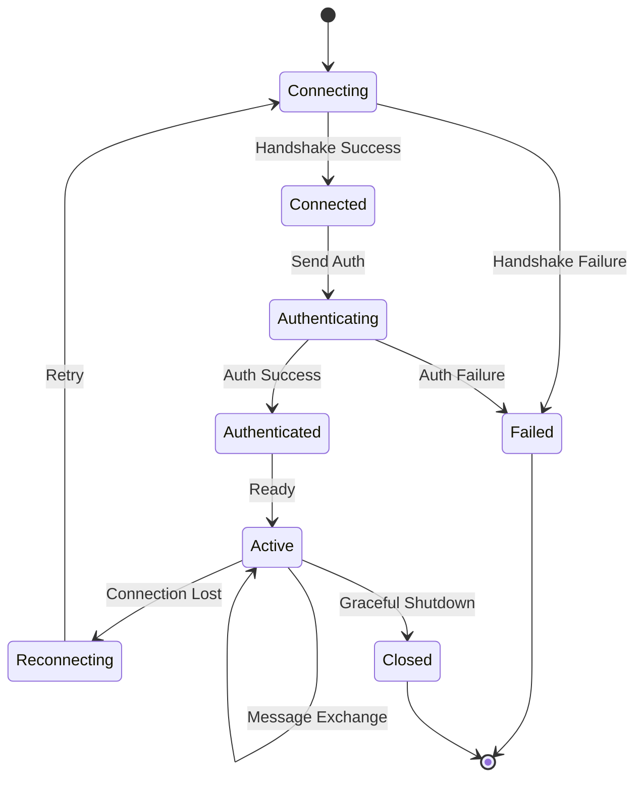
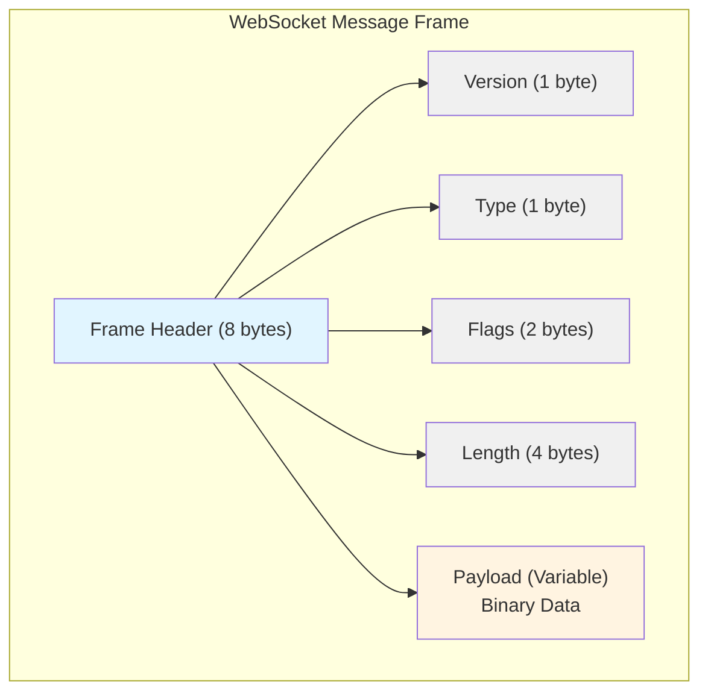
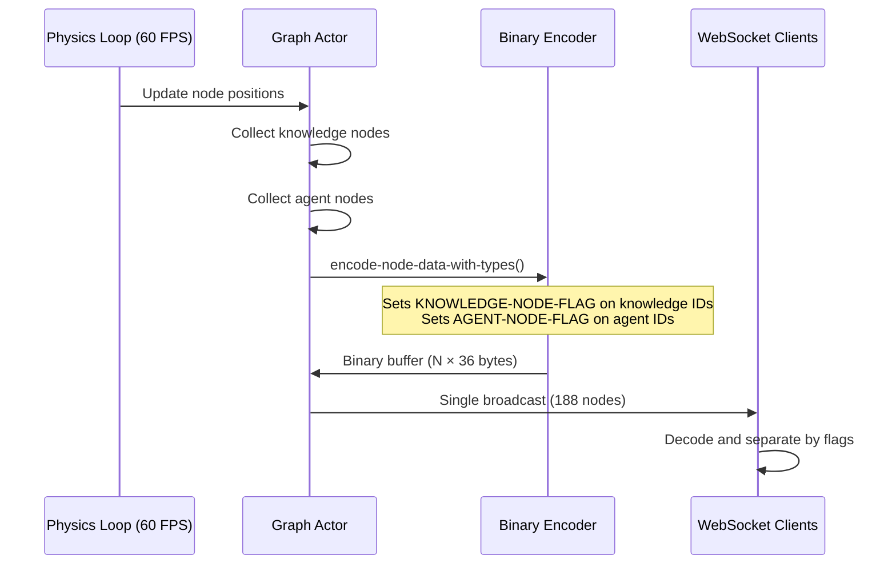
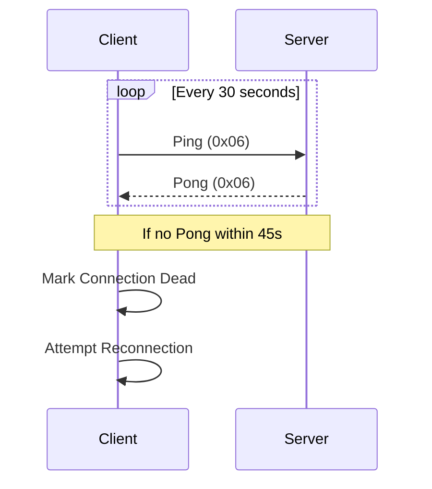

# WebSocket Binary Protocol

**Version**: 2.0 (Binary Protocol V2)
**Status**: Production Ready
**Last Updated**: October 2025
**Performance**: ~80% bandwidth reduction vs JSON

## Overview

The WebSocket binary protocol provides high-performance real-time communication between the Rust backend and TypeScript clients. Binary Protocol V2 uses 36-byte node frames with u32 IDs and dual-graph type flags, fixing the V1 node ID truncation bug while supporting unified knowledge + agent graph broadcasting.

## Protocol Architecture

### Connection Lifecycle



### Message Frame Structure

All WebSocket messages follow this binary frame structure:



**Binary Layout:**
| Offset | Size | Field | Description |
|--------|------|-------|-------------|
| 0 | 1 byte | Version | Protocol version (current: 1) |
| 1 | 1 byte | Type | Message type identifier |
| 2 | 2 bytes | Flags | Compression, priority flags |
| 4 | 4 bytes | Length | Payload size in bytes |
| 8 | Variable | Payload | Binary message data |

**Header Fields**:
- **Version** (1 byte): Protocol version (current: 1)
- **Type** (1 byte): Message type identifier
- **Flags** (2 bytes): Optional flags for compression, priority, etc.
- **Length** (4 bytes): Payload length in bytes

### Message Types

| Type ID | Name | Description | Direction |
|---------|------|-------------|-----------|
| 0x01 | NodeUpdate | Node position/velocity updates | Server → Client |
| 0x02 | EdgeUpdate | Edge state changes | Server → Client |
| 0x03 | SettingsSync | Settings synchronisation | Bidirectional |
| 0x04 | AgentState | Agent status updates | Server → Client |
| 0x05 | Command | Client commands | Client → Server |
| 0x06 | Heartbeat | Connection keep-alive | Bidirectional |
| 0x07 | Error | Error notifications | Server → Client |
| 0x08 | BatchUpdate | Multiple updates batched | Server → Client |

## Binary Data Formats

### Node Update Format (Binary Protocol V2)

Each node update uses exactly **36 bytes**:

```rust
struct WireNodeDataItemV2 {
    id: u32,                // 4 bytes - With type flags in high bits (31/30)
    position: Vec3Data,     // 12 bytes (3 × f32)
    velocity: Vec3Data,     // 12 bytes (3 × f32)
    sssp-distance: f32,     // 4 bytes - SSSP distance
    sssp-parent: i32,       // 4 bytes - Parent for path reconstruction
}
```

**Total**: 36 bytes per node (vs ~150 bytes JSON)

**Type Flags (Dual-Graph Support)**:
- **Bit 31** (`0x80000000`): Agent node flag
- **Bit 30** (`0x40000000`): Knowledge graph node flag
- **Bits 0-29** (`0x3FFFFFFF`): Actual node ID (30-bit, max 1 billion nodes)

### Vec3Data Format

3D vectors are serialised as three consecutive 32-bit floats:

**Binary Layout (12 bytes total):**
| Offset | Size | Field | Type | Description |
|--------|------|-------|------|-------------|
| 0 | 4 bytes | X | f32 | X coordinate (IEEE 754) |
| 4 | 4 bytes | Y | f32 | Y coordinate (IEEE 754) |
| 8 | 4 bytes | Z | f32 | Z coordinate (IEEE 754) |

**Byte order**: Little-endian
**Precision**: IEEE 754 single precision

### Settings Update Format

Settings use a variable-length format with path compression:

**Binary Layout:**
| Offset | Size | Field | Description |
|--------|------|-------|------|
| 0 | 2 bytes | Path ID | Pre-registered path identifier |
| 2 | 1 byte | Value Type | Type code (0x01-0x08) |
| 3 | 2 bytes | Value Length | Size of value data |
| 5 | Variable | Value | Actual value bytes |

**Path ID**: Pre-registered common paths (e.g., physics parameters)
**Value Types**:
- `0x01`: i32 (4 bytes)
- `0x02`: i64 (8 bytes)
- `0x03`: f32 (4 bytes)
- `0x04`: f64 (8 bytes)
- `0x05`: String (length-prefixed)
- `0x06`: Bytes (length-prefixed)
- `0x07`: Array (length-prefixed, recursive)
- `0x08`: Object (key-value pairs, recursive)

### Batch Update Format

Batch updates combine multiple node updates:

**Binary Layout:**
| Offset | Size | Field | Description |
|--------|------|-------|-------------|
| 0 | 2 bytes | Node Count | Number of nodes (N) |
| 2 | 2 bytes | Flags | Batch-level flags |
| 4 | N × 36 bytes | Node Updates | Array of node data |

**Batch size**: Up to 50 nodes per batch (default)
**Frequency**: Adaptive (60 FPS active, 5 Hz settled)

## Dual-Graph Broadcasting Architecture

### Overview

VisionFlow supports **unified dual-graph broadcasting** where both knowledge graphs and agent graphs are transmitted in a single WebSocket stream with type identification flags.

### Graph Structure

**Knowledge Graph:**
- Scientific concepts, papers, entities
- Physics-simulated positions
- ~185 nodes typical
- Flag: `0x40000000` (bit 30)

**Agent Graph:**
- LLM agents (Claude via MCP)
- Physics-simulated positions
- ~3-10 nodes typical
- Flag: `0x80000000` (bit 31)

### Unified Broadcast Flow



### Implementation (`src/actors/graph-actor.rs`)

**Unified Physics Broadcast** (lines 2087-2150):

```rust
// Collect BOTH graphs in single broadcast
let mut position-data: Vec<(u32, BinaryNodeData)> = Vec::new();
let mut knowledge-ids: Vec<u32> = Vec::new();
let mut agent-ids: Vec<u32> = Vec::new();

// Knowledge graph nodes
for (node-id, node) in self.node-map.iter() {
    position-data.push((*node-id, BinaryNodeDataClient::new(...)));
    knowledge-ids.push(*node-id);
}

// Agent graph nodes
for node in &self.bots-graph-data.nodes {
    position-data.push((node.id, BinaryNodeDataClient::new(...)));
    agent-ids.push(node.id);
}

// Single unified broadcast with type flags
let binary-data = encode-node-data-with-types(
    &position-data,
    &agent-ids,
    &knowledge-ids
);
```

**Result:** Single WebSocket message containing all 188 nodes with proper type separation.

### Client-Side Separation

Clients decode the unified stream and separate nodes by type:

```typescript
const nodeId = view.getUint32(offset, true);
const isAgent = (nodeId & 0x80000000) !== 0;
const isKnowledge = (nodeId & 0x40000000) !== 0;
const actualId = nodeId & 0x3FFFFFFF;

if (isAgent) {
    agentGraph.updateNode(actualId, position, velocity);
} else if (isKnowledge) {
    knowledgeGraph.updateNode(actualId, position, velocity);
}
```

### Benefits

1. **No Broadcast Conflicts**: Single source of truth eliminates race conditions
2. **Synchronized Updates**: Both graphs update simultaneously
3. **Efficient Bandwidth**: One message instead of two separate streams
4. **Type Safety**: Flags ensure proper graph separation on client

## Compression Strategy

### Selective Compression

Compression is applied selectively based on message size and type:

```rust
fn should-compress(payload: &[u8], msg-type: u8) -> bool {
    // Settings messages over 256 bytes
    if msg-type == 0x03 && payload.len() > 256 {
        return true;
    }

    // Batch updates over 1KB
    if msg-type == 0x08 && payload.len() > 1024 {
        return true;
    }

    false
}
```

**Compression Algorithm**: GZIP (level 6)
**Typical Ratios**:
- Settings messages: 70-85% reduction
- Large batch updates: 40-60% reduction
- Small updates: No compression (overhead exceeds benefit)

### Delta Encoding

Settings use delta encoding to transmit only changed values:

```rust
struct DeltaUpdate {
    changed-count: u16,        // Number of changed settings
    changes: Vec<SettingChange>
}

struct SettingChange {
    path-id: u16,
    value-type: u8,
    value: BinaryValue
}
```

**Change Detection**: Blake3 hashing for efficient delta identification
**Full Sync**: Every 10th update or on reconnection

## Rate Limiting

### Client-Side Batching

```typescript
const batchConfig: BatchQueueConfig = {
    batchSize: 50,           // Max items per batch
    flushIntervalMs: 200,    // 5Hz update rate
    maxQueueSize: 1000,      // Memory bounds
    priorityField: 'nodeId'  // Priority processing
};
```

### Server-Side Rate Limits

```rust
pub fn socket-flow-updates() -> RateLimitConfig {
    RateLimitConfig {
        requests-per-minute: 300,  // 5Hz × 60s
        burst-size: 50,
        cleanup-interval: Duration::from-secs(600),
        ban-duration: Duration::from-secs(600),
        max-violations: 10,
    }
}
```

## Connection Management

### Heartbeat Protocol



**Ping Interval**: 30 seconds
**Pong Timeout**: 45 seconds
**Reconnection Strategy**: Exponential backoff (1s to 30s max)

### Reconnection Flow

```rust
fn calculate-backoff(attempt: u32) -> Duration {
    let base-delay = 1000; // 1 second
    let exponential-delay = base-delay * 2u64.pow(attempt - 1);
    let max-delay = 30000; // 30 seconds

    Duration::from-millis(exponential-delay.min(max-delay))
}
```

### Connection Resilience

```typescript
class WebSocketService {
    private reconnect(): void {
        const delay = this.calculateBackoff();

        setTimeout(() => {
            this.connect();
        }, delay);

        this.reconnectAttempts++;
    }

    private queueMessage(message: BinaryMessage): void {
        // Queue messages during disconnection
        if (this.messageQueue.length < MAX-QUEUE-SIZE) {
            this.messageQueue.push(message);
        }
    }
}
```

## Performance Characteristics

### Bandwidth Reduction

| Message Type | JSON Size | Binary V2 Size | Reduction |
|--------------|-----------|----------------|-----------|
| Single Node | ~150 bytes | 36 bytes | 76% |
| 50 Nodes | ~7.5 KB | 1.8 KB | 76% |
| 188 Nodes (dual-graph) | ~28 KB | 6.8 KB | 76% |
| Settings Update | ~800 bytes | ~120 bytes | 85% |
| Batch (compressed) | ~10 KB | ~2 KB | 80% |

**Overall Achieved**: ~80% bandwidth reduction vs JSON

**V2 Improvements over V1:**
- +2 bytes per node (36 vs 34)
- Supports 1 billion nodes vs 16K
- Fixes node ID truncation bug
- Enables dual-graph type separation

### Latency Metrics

| Operation | P50 | P95 | P99 |
|-----------|-----|-----|-----|
| Serialisation | 0.2ms | 0.5ms | 1.0ms |
| Deserialisation | 0.3ms | 0.7ms | 1.2ms |
| Network RTT | 8ms | 18ms | 30ms |
| End-to-End | 10ms | 20ms | 35ms |

### Throughput

- **Messages/second**: 300 sustained, 600 burst
- **Bytes/second**: 500 KB sustained, 1 MB burst
- **Nodes/update**: Up to 100 (typical: 20-50)

## Error Handling

### Error Frame Format

**Binary Layout:**
| Offset | Size | Field | Description |
|--------|------|-------|-------------|
| 0 | 2 bytes | Error Code | Error code (0x0001-0x0005) |
| 2 | 1 byte | Severity | Severity level (0x01-0x04) |
| 3 | 2 bytes | Message Length | Error message size |
| 5 | Variable | Message | Error message string |

### Error Codes

| Code | Name | Description | Recovery |
|------|------|-------------|----------|
| 0x0001 | ParseError | Failed to parse message | Log and discard |
| 0x0002 | AuthFailure | Authentication failed | Reconnect with auth |
| 0x0003 | RateLimitExceeded | Too many requests | Backoff and retry |
| 0x0004 | InvalidState | Invalid connection state | Reset connection |
| 0x0005 | InternalError | Server internal error | Retry with backoff |

### Error Severity Levels

- **0x01 - Info**: Informational, no action required
- **0x02 - Warning**: Warning condition, may require attention
- **0x03 - Error**: Error condition, requires retry
- **0x04 - Critical**: Critical failure, connection termination

## Implementation Examples

### Rust Server Implementation

```rust
use actix-web-actors::ws;

impl StreamHandler<Result<ws::Message, ws::ProtocolError>> for WebSocketActor {
    fn handle(&mut self, msg: Result<ws::Message, ws::ProtocolError>, ctx: &mut Self::Context) {
        match msg {
            Ok(ws::Message::Binary(bin)) => {
                // Parse binary frame
                if let Ok(frame) = BinaryFrame::parse(&bin) {
                    self.handle-binary-frame(frame, ctx);
                }
            }
            Ok(ws::Message::Ping(msg)) => {
                ctx.pong(&msg);
            }
            - => {}
        }
    }
}

fn serialize-node-update(
    nodes: &[(u32, BinaryNodeData)],
    agent-ids: &[u32],
    knowledge-ids: &[u32]
) -> Vec<u8> {
    let mut buffer = Vec::with-capacity(nodes.len() * 36);

    // Encode nodes with dual-graph type flags
    for (node-id, data) in nodes {
        // Determine type flag
        let wire-id = if agent-ids.contains(node-id) {
            node-id | 0x80000000  // AGENT-NODE-FLAG
        } else if knowledge-ids.contains(node-id) {
            node-id | 0x40000000  // KNOWLEDGE-NODE-FLAG
        } else {
            *node-id
        };

        // Write node data (36 bytes)
        buffer.extend-from-slice(&wire-id.to-le-bytes());         // 4 bytes
        buffer.extend-from-slice(&data.position.x.to-le-bytes()); // 4 bytes
        buffer.extend-from-slice(&data.position.y.to-le-bytes()); // 4 bytes
        buffer.extend-from-slice(&data.position.z.to-le-bytes()); // 4 bytes
        buffer.extend-from-slice(&data.velocity.x.to-le-bytes()); // 4 bytes
        buffer.extend-from-slice(&data.velocity.y.to-le-bytes()); // 4 bytes
        buffer.extend-from-slice(&data.velocity.z.to-le-bytes()); // 4 bytes
        buffer.extend-from-slice(&data.sssp-distance.to-le-bytes()); // 4 bytes
        buffer.extend-from-slice(&data.sssp-parent.to-le-bytes());   // 4 bytes
    }

    buffer
}
```

### TypeScript Client Implementation

```typescript
class BinaryProtocolClient {
    private parseFrame(data: ArrayBuffer): BinaryFrame {
        const view = new DataView(data);
        let offset = 0;

        const version = view.getUint8(offset++);
        const type = view.getUint8(offset++);
        const flags = view.getUint16(offset, true); offset += 2;
        const length = view.getUint32(offset, true); offset += 4;

        const payload = new Uint8Array(data, offset, length);

        return { version, type, flags, length, payload };
    }

    private parseNodeUpdate(payload: Uint8Array): NodeData[] {
        const view = new DataView(payload.buffer, payload.byteOffset);
        const nodes: NodeData[] = [];
        const BINARY-NODE-SIZE = 36;
        let offset = 0;

        while (offset < payload.length) {
            // Parse node ID with type flags (V2: u32, 4 bytes)
            const rawId = view.getUint32(offset, true); offset += 4;
            const isAgent = (rawId & 0x80000000) !== 0;
            const isKnowledge = (rawId & 0x40000000) !== 0;
            const id = rawId & 0x3FFFFFFF;

            // Parse position (12 bytes)
            const x = view.getFloat32(offset, true); offset += 4;
            const y = view.getFloat32(offset, true); offset += 4;
            const z = view.getFloat32(offset, true); offset += 4;

            // Parse velocity (12 bytes)
            const vx = view.getFloat32(offset, true); offset += 4;
            const vy = view.getFloat32(offset, true); offset += 4;
            const vz = view.getFloat32(offset, true); offset += 4;

            // Parse SSSP data (8 bytes)
            const sssp-distance = view.getFloat32(offset, true); offset += 4;
            const sssp-parent = view.getInt32(offset, true); offset += 4;

            nodes.push({
                id,
                nodeType: isAgent ? 'agent' : isKnowledge ? 'knowledge' : 'normal',
                position: {x, y, z},
                velocity: {vx, vy, vz},
                sssp-distance,
                sssp-parent
            });
        }

        return nodes;
    }
}
```

## Testing and Validation

### Unit Tests

```rust
#[cfg(test)]
mod tests {
    use super::*;

    #[test]
    fn test-node-serialization-roundtrip() {
        let original = NodeData {
            id: 42,
            position: Vec3::new(1.0, 2.0, 3.0),
            velocity: Vec3::new(0.1, 0.2, 0.3),
            sssp-distance: 5.5,
            sssp-parent: 10,
        };

        let serialized = serialize-node(&original);
        let deserialized = deserialize-node(&serialized).unwrap();

        assert-eq!(original, deserialized);
        assert-eq!(serialized.len(), 36); // V2: 36 bytes
    }

    #[test]
    fn test-dual-graph-type-flags() {
        let nodes = vec![
            (10, create-test-node()),  // Regular
            (20, create-test-node()),  // Knowledge
            (30, create-test-node()),  // Agent
        ];
        let agent-ids = vec![30];
        let knowledge-ids = vec![20];

        let binary = encode-node-data-with-types(&nodes, &agent-ids, &knowledge-ids);

        // Verify flags in binary data
        let id1 = u32::from-le-bytes([binary[0], binary[1], binary[2], binary[3]]);
        let id2 = u32::from-le-bytes([binary[36], binary[37], binary[38], binary[39]]);
        let id3 = u32::from-le-bytes([binary[72], binary[73], binary[74], binary[75]]);

        assert-eq!(id1, 10); // No flags
        assert-eq!(id2 & 0x40000000, 0x40000000); // KNOWLEDGE-NODE-FLAG
        assert-eq!(id3 & 0x80000000, 0x80000000); // AGENT-NODE-FLAG
    }
}
```

### Integration Tests

```typescript
describe('BinaryProtocol', () => {
    it('should handle node updates correctly', async () => {
        const client = new BinaryProtocolClient();
        await client.connect();

        const updates = await client.waitForNodeUpdate();
        expect(updates).toHaveLength(50);
        expect(updates[0]).toHaveProperty('position');
    });
});
```

## Performance Optimisation Tips

### Server-Side Optimisations

1. **Pre-allocate Buffers**: Reuse buffers for serialisation
2. **Batch Updates**: Combine multiple small updates
3. **Zero-Copy**: Use `bytes::Bytes` for zero-copy operations
4. **Compression Threshold**: Only compress large messages
5. **Connection Pooling**: Reuse WebSocket connections

### Client-Side Optimisations

1. **ArrayBuffer Pooling**: Reuse ArrayBuffers for parsing
2. **Worker Threads**: Parse in Web Workers for large updates
3. **Incremental Updates**: Apply updates incrementally to UI
4. **Throttling**: Limit UI updates to 60 FPS
5. **Priority Queues**: Process critical updates first

## Monitoring and Debugging

### Performance Metrics

```rust
struct WebSocketMetrics {
    messages-sent: AtomicU64,
    messages-received: AtomicU64,
    bytes-sent: AtomicU64,
    bytes-received: AtomicU64,
    compression-ratio: AtomicF64,
    delta-messages: AtomicU64,
    full-sync-messages: AtomicU64,
}
```

### Debug Logging

Enable debug logging for protocol inspection:

```rust
RUST-LOG=visionflow::websocket=debug cargo run
```

### Browser DevTools

Monitor WebSocket traffic in Chrome DevTools:
1. Network tab → WS filter
2. View frame data with binary inspector
3. Monitor bandwidth usage in real-time

## Security Considerations

### Authentication

```rust
impl WebSocketActor {
    fn authenticate(&self, token: &str) -> Result<UserId, AuthError> {
        // Verify JWT token
        // Check token expiration
        // Validate user permissions
    }
}
```

### Input Validation

All binary input is validated before processing:

```rust
fn validate-frame(frame: &BinaryFrame) -> Result<(), ValidationError> {
    // Check version compatibility
    // Validate message type
    // Verify length bounds
    // Check flag combinations
}
```

### Rate Limiting

Per-connection and per-IP rate limits prevent abuse:

```rust
pub struct RateLimiter {
    requests-per-minute: u32,
    burst-size: u32,
    violations: HashMap<IpAddr, u32>,
}
```

## Migration Guide

### From JSON to Binary Protocol

1. **Implement Binary Serialisation**: Add binary encode/decode methods
2. **Update Client**: Integrate `BinaryProtocolClient`
3. **Test Thoroughly**: Validate roundtrip serialisation
4. **Deploy Gradually**: Use feature flags for rollout
5. **Monitor Performance**: Track bandwidth and latency improvements

## Version History

### Version 2.0 (October 2025) - Current

**Changes:**
- Upgraded to Binary Protocol V2 (36 bytes per node)
- Changed node ID from u16 to u32 (fixes truncation bug)
- Moved type flags from bits 15/14 to bits 31/30
- Implemented unified dual-graph broadcasting
- Added adaptive broadcast rate (60 FPS active, 5 Hz settled)

**Bug Fixes:**
- Fixed node ID truncation for IDs > 16,383
- Fixed dual-graph broadcast conflicts (knowledge + agent graphs)
- Eliminated race conditions from separate broadcast paths
- Fixed 2-byte misalignment causing "corrupted node data" errors

### Version 1.2.0 (Legacy) - Deprecated

**Format:**
- Binary Protocol V1 (34 bytes per node)
- u16 node IDs (bits 15/14 for type flags, bits 0-13 for ID)
- Separate broadcasts for knowledge and agent graphs
- Fixed 60 FPS broadcast rate

**Known Issues:**
- Node ID truncation bug (IDs > 16,383 collision)
- Dual-graph broadcast conflicts
- Limited to 16,383 nodes maximum

## Troubleshooting

### Common Issues

**Issue: "Corrupted node data" errors on client**
- **Cause**: Client using V1 parser (34 bytes) with V2 server (36 bytes)
- **Fix**: Update client `BINARY-NODE-SIZE` constant from 34 to 36
- **Fix**: Update parse offsets (position at offset 4, not 2)

**Issue: Nodes with wrong type (agent vs knowledge)**
- **Cause**: Client checking wrong flag bits (15/14 instead of 31/30)
- **Fix**: Update flag constants to `0x80000000` and `0x40000000`
- **Fix**: Use `getUint32()` instead of `getUint16()` for node ID

**Issue: Agent nodes not moving**
- **Cause**: Agent graph not included in unified broadcast
- **Fix**: Verify server logs show "188 nodes: 185 knowledge + 3 agents"
- **Fix**: Check `encode-node-data-with-types()` receives both ID lists

## References

- **** - Complete wire format details
- **[Dual-Graph Architecture](../core/visualization.md)** - Knowledge + agent graph visualization
- **** - API endpoint documentation
- **** - Bandwidth and latency metrics
