# Rust Server Architecture

> ⚠️ **DEPRECATION NOTICE** ⚠️
> **GraphServiceActor** is being replaced by the **hexagonal CQRS architecture**.
> This document describes legacy patterns and is being updated. See `/docs/guides/graphserviceactor-migration.md` for current recommendations.

**Last Updated**: 2025-10-12
**Status**: Simplified Multi-Agent Integration via Management API | 🔄 IN TRANSITION (Nov 2025)
**Analysis Base**: Direct source code inspection of Rust server implementation

> **Note**: This document reflects the current simplified architecture where VisionFlow integrates with the agentic-workstation container via HTTP Management API (port 9090) for task orchestration and MCP TCP (port 9500) for agent monitoring.

## High-Level System Overview

```mermaid
graph TB
    %% Client Layer
    Client[Web Clients<br/>Unity/Browser]

    %% Entry Point
    Main[main.rs<br/>HTTP Server Entry Point]

    %% Core Server Infrastructure
    subgraph "HTTP Server Layer"
        HttpServer[Actix HTTP Server<br/>:8080]
        Middleware[CORS + Logger + Compression<br/>Error Recovery Middleware]
        Router[Route Configuration]
    end

    %% Application State
    AppState[AppState<br/>Centralised State Management]

    %% Actor System - CURRENT STATE
    subgraph "Actor System (Actix) - Transitional Architecture"
        subgraph "Graph Supervision (Hybrid)"
            TransitionalSupervisor[TransitionalGraphSupervisor<br/>Bridge Pattern Wrapper]
            GraphActor[GraphServiceActor<br/>⚠️ DEPRECATED - See CQRS migration<br/>Monolithic (Being Refactored)]
            GraphStateActor[GraphStateActor<br/>State Management (Partial)]
            PhysicsOrchestrator[PhysicsOrchestratorActor<br/>Physics (Extracted)]
            SemanticProcessor[SemanticProcessorActor<br/>Semantic Analysis]
        end

        GPUManager[GPUManagerActor<br/>GPU Resource Management]
        ClientCoordinator[ClientCoordinatorActor<br/>WebSocket Connections]
        OptimisedSettings[OptimisedSettingsActor<br/>Configuration Management]
        ProtectedSettings[ProtectedSettingsActor<br/>Secure Configuration]
        MetadataActor[MetadataActor<br/>File Metadata Storage]
        WorkspaceActor[WorkspaceActor<br/>Project Management]
        AgentMonitorActor[AgentMonitorActor<br/>MCP TCP Polling :9500]
        TcpConnectionActor[TcpConnectionActor<br/>TCP Management]
        FileSearchActor[FileSearchActor<br/>Content Search]
        CacheActor[CacheActor<br/>Memory Caching]
        OntologyActor[OntologyActor<br/>Ontology Processing]
    end

    %% Non-Actor Services
    subgraph "Utility Services (Non-Actor)"
        ManagementApiClient[ManagementApiClient<br/>HTTP Client for Task Management]
        McpTcpClient[McpTcpClient<br/>Direct TCP Client]
        JsonRpcClient[JsonRpcClient<br/>MCP Protocol]
    end

    %% WebSocket Handlers
    subgraph "WebSocket Layer"
        SocketFlow[Socket Flow Handler<br/>Binary Graph Updates (34-byte)]
        SpeechWS[Speech WebSocket<br/>Voice Commands]
        MCPRelay[MCP Relay WebSocket<br/>Multi-Agent Communication]
        HealthWS[Health WebSocket<br/>System Monitoring]
    end

    %% REST API Handlers
    subgraph "REST API Layer"
        APIHandler[API Handler<br/>/api routes]
        GraphAPI[Graph API<br/>CRUD operations]
        FilesAPI[Files API<br/>GitHub integration]
        BotsAPI[Bots API<br/>Task Management via DockerHiveMind]
        HybridAPI[Hybrid API<br/>Docker/MCP Spawning]
        AnalyticsAPI[Analytics API<br/>GPU computations]
        WorkspaceAPI[Workspace API<br/>Project management]
    end

    %% GPU Subsystem - FULLY IMPLEMENTED
    subgraph "GPU Computation Layer (40 CUDA Kernels)"
        GPUResourceActor[GPU Resource Actor<br/>CUDA Device & Memory]
        ForceComputeActor[Force Compute Actor<br/>Physics Kernels]
        ClusteringActor[Clustering Actor<br/>K-means, Louvain]
        ConstraintActor[Constraint Actor<br/>Layout Constraints]
        AnomalyDetectionActor[Anomaly Detection Actor<br/>LOF, Z-score]
        StressMajorizationActor[Stress Majorisation<br/>Graph Layout]
    end

    %% Data Storage
    subgraph "Data Layer"
        FileStorage[File System Storage<br/>Metadata & Graph Data]
        MemoryStore[In-Memory Store<br/>Active Graph State]
        CUDA[CUDA GPU Memory<br/>Compute Buffers]
    end

    %% External Services
    subgraph "External Integrations"
        GitHub[GitHub API<br/>Content Fetching]
        AgenticWorkstation[agentic-workstation<br/>Management API :9090<br/>MCP TCP :9500]
        Nostr[Nostr Protocol<br/>Decentralised Identity]
        RAGFlow[RAGFlow API<br/>Chat Integration]
        Speech[Speech Services<br/>Voice Processing]
    end

    %% Connections
    Client --> HttpServer
    HttpServer --> Middleware
    Middleware --> Router
    Router --> AppState

    AppState --> TransitionalSupervisor
    TransitionalSupervisor --> GraphActor
    GraphActor -.-> GraphStateActor
    GraphActor -.-> PhysicsOrchestrator
    GraphActor -.-> SemanticProcessor

    AppState --> GPUManager
    AppState --> ClientCoordinator
    AppState --> OptimisedSettings
    AppState --> AgentMonitorActor

    AgentMonitorActor --> TcpConnectionActor
    AgentMonitorActor --> JsonRpcClient

    BotsAPI --> ManagementApiClient
    ManagementApiClient --> AgenticWorkstation

    Router --> SocketFlow
    SocketFlow --> ClientCoordinator

    GPUManager --> GPUResourceActor
    GPUManager --> ForceComputeActor
    GPUManager --> ClusteringActor
    GPUManager --> ConstraintActor
    GPUManager --> AnomalyDetectionActor
    GPUManager --> StressMajorizationActor

    TcpConnectionActor --> AgenticWorkstation
```

## Actor System Architecture - Transitional State

### Current Implementation Status

The server is in **Phase 2 of 3** of a major architectural refactoring:

#### Phase 1: ✅ COMPLETE - Actor Extraction
- Client management → `ClientCoordinatorActor`
- GPU management → `GPUManagerActor` + 6 specialised actors
- Settings → `OptimisedSettingsActor`
- TCP connections → `TcpConnectionActor`

#### Phase 2: 🔄 IN PROGRESS - Supervision Layer
- Implemented `TransitionalGraphSupervisor` as bridge pattern
- **LEGACY**: `GraphServiceActor` still handles core functionality (35,193 lines)
  - **CURRENT**: Migrating to hexagonal CQRS architecture with domain-driven design
  - See `/docs/guides/graphserviceactor-migration.md` for migration path
- Partial extraction of physics and semantic processing
- Message routing through supervisor wrapper

#### Phase 3: ❌ NOT STARTED - Full Decomposition
- Complete breakdown of monolithic `GraphServiceActor` (DEPRECATED APPROACH)
  - **NEW APPROACH**: Hexagonal CQRS architecture with bounded contexts
  - Domain-driven design with aggregate roots and repositories
  - See `/docs/guides/graphserviceactor-migration.md`
- Full `GraphServiceSupervisor` implementation (or equivalent CQRS coordinator)
- Pure message routing through commands/queries

### Transitional Architecture Details

```rust
// Current architecture in app-state.rs (LEGACY PATTERN)
pub struct AppState {
    pub graph-service-addr: Addr<TransitionalGraphSupervisor>, // ⚠️ DEPRECATED: Wrapper around GraphServiceActor
    pub gpu-manager-addr: Addr<GPUManagerActor>,
    pub client-coordinator-addr: Addr<ClientCoordinatorActor>,
    // ... other actors
}
```

**LEGACY**: The `TransitionalGraphSupervisor`:
- **Wraps** the existing monolithic `GraphServiceActor` (DEPRECATED)
- **Forwards** all messages to maintain compatibility
- **Manages** actor lifecycle and restarts
- **Bridges** between current and planned architecture

**CURRENT**: Migrating to hexagonal CQRS architecture:
- Command/Query separation with bounded contexts
- Domain aggregates with repository pattern
- Event-driven communication between domains
- See `/docs/guides/graphserviceactor-migration.md` for implementation details

### Planned Final Architecture (Not Yet Implemented)

```mermaid
graph TB
    Supervisor["GraphServiceSupervisor<br/>🎯 Future Architecture<br/>Pure Supervised Pattern"]

    subgraph "Planned Actor Decomposition"
        GraphState["GraphStateActor<br/>💾 State Management<br/>Persistence Layer"]
        PhysicsOrch["PhysicsOrchestratorActor<br/>⚡ Physics Simulation<br/>GPU Compute Integration"]
        SemanticProc["SemanticProcessorActor<br/>🧠 Semantic Analysis<br/>AI Features"]
        ClientCoord["ClientCoordinatorActor<br/>🔌 WebSocket Management<br/>Client Connections"]
    end

    Supervisor --> GraphState
    Supervisor --> PhysicsOrch
    Supervisor --> SemanticProc
    Supervisor --> ClientCoord

    style Supervisor fill:#fff9c4,stroke:#F57F17,stroke-width:3px,stroke-dasharray: 5 5
    style GraphState fill:#e3f2fd,stroke:#1565C0,stroke-dasharray: 5 5
    style PhysicsOrch fill:#c8e6c9,stroke:#2E7D32,stroke-dasharray: 5 5
    style SemanticProc fill:#e1bee7,stroke:#6A1B9A,stroke-dasharray: 5 5
    style ClientCoord fill:#ffccbc,stroke:#E65100,stroke-dasharray: 5 5
```



## Binary Protocol Specifications

### Wire Protocol Format (34 bytes)

Manual serialisation creates 34-byte packets:


```rust
// Wire format (manually serialised)
Wire Packet {
    node-id: u16,           // 2 bytes (truncated for bandwidth)
    position: [f32; 3],     // 12 bytes
    velocity: [f32; 3],     // 12 bytes
    sssp-distance: f32,     // 4 bytes (default: f32::INFINITY)
    sssp-parent: i32,       // 4 bytes (default: -1)
}
// Total: 34 bytes transmitted
```

### GPU Internal Format (48 bytes)

Server-side GPU computation format:


```rust
pub struct BinaryNodeDataGPU {
    pub node-id: u32,         // 4 bytes
    pub x: f32, y: f32, z: f32,     // 12 bytes - position
    pub vx: f32, vy: f32, vz: f32,  // 12 bytes - velocity
    pub sssp-distance: f32,   // 4 bytes
    pub sssp-parent: i32,     // 4 bytes
    pub cluster-id: i32,      // 4 bytes
    pub centrality: f32,      // 4 bytes
    pub mass: f32,            // 4 bytes
}
// Total: 48 bytes (GPU-only, not sent to clients)
```

## GPU Computation Layer

### CUDA Kernel Implementation

**40 Production CUDA Kernels** across 5 files:


#### Kernel Distribution:
- **visionflow-unified.cu**: 28 kernels (core physics, clustering, anomaly detection)
- **gpu-clustering-kernels.cu**: 8 kernels (specialised clustering algorithms)
- **visionflow-unified-stability.cu**: 2 kernels (stability optimisation)
- **sssp-compact.cu**: 2 kernels (SSSP frontier compaction)
- **dynamic-grid.cu**: Host-side optimisation only

### GPU Actor Hierarchy

All 6 specialised GPU actors are fully implemented:

```mermaid
graph TB
    GPUManager["GPUManagerActor<br/>🎯 Supervisor<br/>Orchestrates GPU Compute"]

    subgraph "Specialised GPU Actors"
        GPUResource["GPUResourceActor<br/>💾 Memory Management<br/>Device Allocation"]
        ForceCompute["ForceComputeActor<br/>⚡ Physics Simulation<br/>Force-directed Layout"]
        Clustering["ClusteringActor<br/>🔵 Clustering<br/>K-means, Louvain, Community"]
        Anomaly["AnomalyDetectionActor<br/>🔍 Anomaly Detection<br/>LOF, Z-score Analysis"]
        StressMaj["StressMajorizationActor<br/>📐 Layout Optimization<br/>Stress Minimization"]
        Constraint["ConstraintActor<br/>🔒 Constraints<br/>Distance, Position, Semantic"]
    end

    GPUManager --> GPUResource
    GPUManager --> ForceCompute
    GPUManager --> Clustering
    GPUManager --> Anomaly
    GPUManager --> StressMaj
    GPUManager --> Constraint

    style GPUManager fill:#fff9c4,stroke:#F57F17,stroke-width:3px
    style GPUResource fill:#e3f2fd,stroke:#1565C0
    style ForceCompute fill:#c8e6c9,stroke:#2E7D32
    style Clustering fill:#e1bee7,stroke:#6A1B9A
    style Anomaly fill:#ffccbc,stroke:#E65100
    style StressMaj fill:#b2dfdb,stroke:#00695C
    style Constraint fill:#f8bbd0,stroke:#C2185B
```



### GPU Capabilities


**Detailed Capabilities**:
- **Physics Engine**: Force-directed layout, spring-mass physics, spatial grid optimisation
- **Clustering**: K-means++, Louvain modularity, label propagation
- **Anomaly Detection**: Local Outlier Factor (LOF), statistical Z-score
- **Performance**: Stability gates, kinetic energy monitoring, dynamic grid sizing
- **Memory**: RAII wrappers, stream-based execution, shared context

### GPU Computation Pipeline

Complete data flow through the GPU compute system:

```mermaid
flowchart TB
    subgraph "Input Stage - CPU"
        GraphData["Graph Data<br/>Nodes & Edges<br/>CPU Memory"]
        SimConfig["Simulation Config<br/>Physics Parameters<br/>Constraints"]
        UserInput["User Interactions<br/>Drag, Pin, Zoom"]
    end

    subgraph "GPU Memory Transfer"
        HostToDevice["cudaMemcpy H→D<br/>Async Transfer"]
        DeviceBuffers["Device Buffers<br/>Node: 48 bytes<br/>Edge: 16 bytes"]
    end

    subgraph "GPU Kernel Execution - CUDA Cores"
        subgraph "Physics Pipeline"
            ForceCalc["Force Computation<br/>Spring + Repulsion<br/>Spatial Grid O(n log n)"]
            Integration["Verlet Integration<br/>Position Update<br/>Velocity Damping"]
            Constraints["Constraint Solver<br/>Pin, Distance, Semantic"]
        end

        subgraph "Analytics Pipeline"
            Clustering["K-means Clustering<br/>Louvain Modularity"]
            Anomaly["Anomaly Detection<br/>LOF, Z-score"]
            SSSP["Hybrid SSSP<br/>Shortest Paths"]
        end

        subgraph "Stability Control"
            KECheck["Kinetic Energy<br/>KE = Σ(½mv²)"]
            StabilityGate["Stability Gate<br/>Pause if KE < ε"]
        end
    end

    subgraph "GPU Memory Management"
        SharedMem["Shared Memory<br/>64KB per SM<br/>Fast Caching"]
        TextureCache["Texture Cache<br/>Spatial Locality"]
        StreamSync["CUDA Streams<br/>Async Execution"]
    end

    subgraph "Output Stage - CPU"
        DeviceToHost["cudaMemcpy D→H<br/>Result Transfer"]
        ResultProc["Result Processing<br/>Wire Protocol 34-byte"]
        WebSocket["WebSocket Broadcast<br/>Binary Update"]
    end

    GraphData --> HostToDevice
    SimConfig --> HostToDevice
    UserInput --> HostToDevice
    HostToDevice --> DeviceBuffers

    DeviceBuffers --> ForceCalc
    DeviceBuffers --> Clustering
    DeviceBuffers --> Anomaly

    ForceCalc --> Integration
    Integration --> Constraints
    Constraints --> KECheck
    KECheck -->|KE > ε| ForceCalc
    KECheck -->|KE < ε| StabilityGate

    Clustering --> SharedMem
    Anomaly --> TextureCache
    SSSP --> TextureCache

    SharedMem --> StreamSync
    TextureCache --> StreamSync

    StabilityGate --> DeviceToHost
    Integration --> DeviceToHost
    Clustering --> DeviceToHost
    Anomaly --> DeviceToHost
    SSSP --> DeviceToHost

    DeviceToHost --> ResultProc
    ResultProc --> WebSocket

    style ForceCalc fill:#c8e6c9,stroke:#2E7D32,stroke-width:2px
    style Integration fill:#c8e6c9,stroke:#2E7D32
    style Clustering fill:#e1bee7,stroke:#6A1B9A,stroke-width:2px
    style Anomaly fill:#ffccbc,stroke:#E65100,stroke-width:2px
    style KECheck fill:#fff9c4,stroke:#F57F17,stroke-width:2px
    style StabilityGate fill:#fff9c4,stroke:#F57F17
    style DeviceBuffers fill:#e3f2fd,stroke:#1565C0,stroke-width:2px
    style WebSocket fill:#b2dfdb,stroke:#00695C,stroke-width:2px
```



**Pipeline Performance**:
- **Throughput**: 5 Hz update rate (200ms per frame)
- **Latency**: <150ms P50, <195ms P99
- **Scalability**: 60 FPS @ 1K nodes, 30 FPS @ 10K nodes, 10 FPS @ 100K nodes
- **Memory**: Dynamic allocation based on graph size (4MB - 400MB)
- **Optimization**: Stability gates prevent unnecessary compute when graph is stable

## External Integration Architecture

### Simplified Multi-Agent Integration

**Architecture Overview**: VisionFlow now integrates with the agentic-workstation container through two clean interfaces:

1. **Management API (HTTP)**: Task orchestration and control
2. **MCP TCP (Port 9500)**: Agent status monitoring

#### Management API Client (HTTP :9090)
- **Location**: Utility service (to be implemented)
- **Pattern**: RESTful HTTP client
- **Target**: `agentic-workstation:9090`
- **Operations**:
  - `POST /v1/tasks` - Create isolated tasks
  - `GET /v1/tasks/:taskId` - Get task status and logs
  - `DELETE /v1/tasks/:taskId` - Stop running task
  - `GET /v1/status` - System health and GPU monitoring

**Key Benefits**:
- Clean HTTP interface replaces Docker exec complexity
- Process isolation via Management API task directories
- Bearer token authentication
- Structured JSON responses
- Rate limiting and security built-in

#### Agent Monitor Actor (formerly ClaudeFlowActor)
- **Location**: `/src/actors/claude-flow-actor.rs`
- **Renamed to**: AgentMonitorActor (conceptually)
- **Purpose**: Poll MCP TCP for agent status updates only
- **Pattern**: Read-only monitoring via MCP protocol
- **Target**: `agentic-workstation:9500`

**Responsibilities**:
- Poll agent list via MCP TCP
- Update graph visualization with agent status
- Monitor agent health metrics
- NO task creation/management (delegated to Management API)

### Integration Stack

#### Task Management Flow


#### Agent Monitoring Flow


### Network Architecture

**Container Network**: `docker-ragflow` (shared network)


**Network Configuration**:

| Container | Hostname | Services |
|-----------|----------|----------|
| VisionFlow | visionflow-container | Rust server :4000, Frontend :5173 |
| Agentic Flow | agentic-workstation | Management API :9090, MCP TCP :9500 |

### Removed Components

The following have been removed in the simplified architecture:

- **DockerHiveMind**: Replaced by Management API HTTP client
- **McpSessionBridge**: No longer needed with direct HTTP task management
- **SessionCorrelationBridge**: Removed in favor of task isolation
- **Docker exec pattern**: Replaced by RESTful HTTP API

## Data Models & Configuration

### Field Serialisation

All data models use consistent camelCase conversion:

```rust
#[derive(Serialize, Deserialize)]
#[serde(rename-all = "camelCase")]
pub struct GraphNode {
    pub node-id: u32,      // → "nodeId" in JSON
    pub display-name: String, // → "displayName" in JSON
    pub force-x: f32,      // → "forceX" in JSON
}
```

### Settings Management

- **OptimisedSettingsActor**: High-performance configuration management
- **ProtectedSettingsActor**: Secure settings with encryption
- **AppFullSettings**: Comprehensive configuration structure
- **Dynamic Updates**: Real-time settings propagation

## WebSocket Communication

### Binary Protocol (Position Updates)
- **Format**: 34-byte wire protocol
- **Frequency**: Real-time streaming
- **Compression**: Binary encoding (95% smaller than JSON)

### JSON Protocol (Metadata)
- **Settings Updates**: Configuration changes
- **Agent Status**: Task and health information
- **Graph Metadata**: Labels, relationships, properties

## Current Architecture Strengths

✅ **Modular GPU System**: 40 production kernels with proper actor separation
✅ **Transitional Stability**: Bridge pattern allows gradual migration
✅ **Protocol Efficiency**: Optimised binary format for real-time updates
✅ **Resilient Integration**: Multiple paths for external service communication
✅ **Type Safety**: Comprehensive Rust type system with serde serialisation

## Known Architecture Issues

⚠️ **DEPRECATED: Monolithic Graph Actor**: 35k+ lines `GraphServiceActor` being replaced by hexagonal CQRS architecture
  - **Migration Path**: See `/docs/guides/graphserviceactor-migration.md`
  - **Status**: 🔄 IN TRANSITION (Nov 2025)
⚠️ **Documentation Drift**: Missing actors referenced in docs
⚠️ **Binary Protocol Confusion**: Multiple formats with unclear documentation
⚠️ **Pattern Fragmentation**: Task orchestration split between utilities and handlers

## Migration Roadmap

1. **Current State**: TransitionalGraphSupervisor wrapping monolithic actor
2. **Next Phase**: Extract remaining functionality from GraphServiceActor
3. **Final State**: Pure supervised architecture with specialised actors
4. **Timeline**: Estimated 2-3 sprints for complete migration

---

*This architecture document represents the current transitional state of the VisionFlow Rust server as of 2025-09-27. The system is actively migrating from a monolithic to a supervised actor architecture. Documentation will be updated as the migration progresses.*