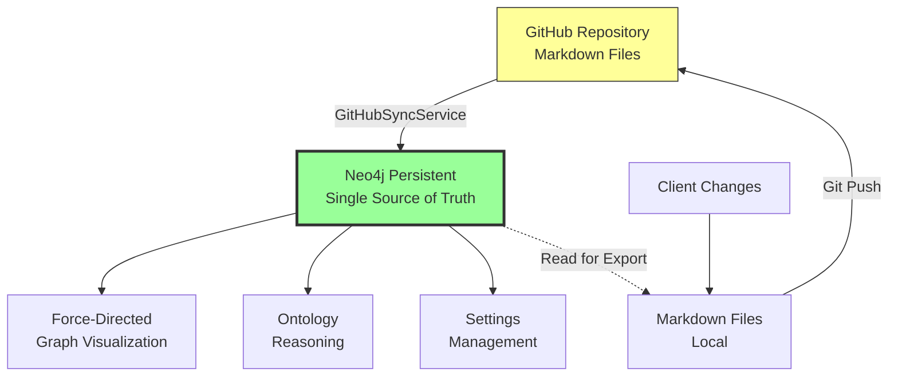

# ADR-001: Neo4j Persistent with Filesystem Sync Architecture

**Date:** 2025-11-05
**Status:** Accepted
**Decision Maker:** VisionFlow Architecture Team

---

## Context

VisionFlow previously operated with a hybrid persistence architecture:
- SQLite (unified.db) as primary graph storage
- Neo4j as optional/secondary graph storage
- Neo4j as primary settings storage
- Multiple sources of truth creating architectural confusion

After comprehensive readiness assessment (see `MARKDOWN_AS_DATABASE_READINESS_ASSESSMENT.md`), three architectural options were evaluated:

- **Option A:** Filesystem + Ephemeral Neo4j
- **Option B:** GitHub + Persistent Neo4j (CHOSEN)
- **Option C:** Hybrid (Current State)

---

## Decision

We adopt **Option B: GitHub-Synced with Persistent Neo4j** architecture.

### Architecture Diagram



### Core Principles

1. **Neo4j is the Single Source of Truth**
   - All graph data (nodes, edges, ontologies) stored in Neo4j
   - All settings stored in Neo4j
   - All semantic relationships stored in Neo4j
   - **Zero SQLite dependencies for runtime operations**

2. **Markdown as Interchange Format**
   - GitHub repository contains markdown representation
   - Markdown synced TO Neo4j via GitHubSyncService
   - Changes written TO markdown files, then pushed to GitHub
   - Markdown is **transport/export format**, not database

3. **Persistent Storage (No Ephemeral Mode)**
   - Neo4j data persists across restarts
   - No clear-on-startup operations
   - Data integrity maintained
   - Suitable for production cloud deployment

4. **Bidirectional Sync**
   - **Inbound:** GitHub → GitHubSyncService → Neo4j
   - **Outbound:** Neo4j → Export → Markdown Files → GitHub
   - Selective polling based on SHA1 differential sync
   - Conflict resolution via timestamps/versioning

---

## Consequences

### Positive

✅ **Single Source of Truth**
- No data duplication between SQLite and Neo4j
- Clear ownership of canonical data
- Simplified architecture

✅ **Native Graph Performance**
- Cypher queries for complex traversals
- Multi-hop path analysis
- Semantic reasoning at database level

✅ **Cloud-Ready**
- Persistent storage suitable for production
- No local file dependencies at runtime
- Scalable architecture

✅ **Simplified Codebase**
- Remove DualGraphRepository complexity
- Remove UnifiedOntologyRepository
- Single repository interface

✅ **Version Control Integration**
- Markdown files in Git provide audit trail
- Rollback capabilities via Git history
- Collaboration via pull requests

### Negative

⚠️ **Migration Required**
- Existing unified.db data must be migrated to Neo4j
- Breaking change for existing deployments
- Requires careful migration path

⚠️ **Neo4j Dependency**
- Application cannot run without Neo4j
- Increased infrastructure complexity vs SQLite
- Requires Neo4j deployment and maintenance

⚠️ **Network Latency**
- Network calls to Neo4j vs local SQLite
- Mitigated by connection pooling and caching

⚠️ **Sync Complexity**
- Bidirectional sync requires conflict resolution
- GitHub API rate limits for polling
- Network failures require retry logic

---

## Implementation Plan

### Phase 1: SQL Deprecation (Week 1)

**Goal:** Remove all SQLite dependencies

1. **Create Neo4j Ontology Repository**
   - Implement `OntologyRepository` trait using Neo4j
   - Support for OWL classes, properties, axioms
   - Hierarchical schema design

2. **Update AppState**
   - Replace `UnifiedOntologyRepository` with `Neo4jOntologyRepository`
   - Use `Neo4jAdapter` as primary `KnowledgeGraphRepository`
   - Remove all SQLite connection initialization

3. **Remove Deprecated Code**
   - Delete `src/repositories/unified_ontology_repository.rs`
   - Delete `src/adapters/dual_graph_repository.rs`
   - Remove SQLite dependencies from Cargo.toml

4. **Update Tests**
   - Migrate tests to use Neo4j test containers
   - Remove SQLite-specific test code
   - Verify all integration tests pass

**Deliverables:**
- [ ] Neo4j ontology repository implemented
- [ ] AppState updated to use Neo4j exclusively
- [ ] All SQLite code removed
- [ ] Tests passing with Neo4j

---

### Phase 2: GitHub Sync Enhancement (Week 2)

**Goal:** Ensure GitHubSyncService targets Neo4j

1. **Update GitHubSyncService**
   - Verify markdown parsing targets Neo4j
   - Remove any SQLite write operations
   - Implement differential sync with SHA1 hashing

2. **Implement Export to Markdown**
   - Query Neo4j for graph data
   - Serialize to markdown format
   - Write to local files for Git push

3. **Add Conflict Resolution**
   - Timestamp-based conflict detection
   - Last-write-wins strategy
   - Conflict logging and monitoring

**Deliverables:**
- [ ] GitHubSyncService targets Neo4j exclusively
- [ ] Export to markdown implemented
- [ ] Conflict resolution strategy in place

---

### Phase 3: Data Migration (Week 2-3)

**Goal:** Migrate existing data from unified.db to Neo4j

1. **Create Migration Script**
   - Read all data from unified.db
   - Transform to Neo4j schema
   - Batch insert to Neo4j

2. **Validate Migration**
   - Compare row counts
   - Verify relationships
   - Check data integrity

3. **Create Rollback Plan**
   - Backup unified.db before migration
   - Document rollback procedure
   - Test rollback process

**Deliverables:**
- [ ] Migration script implemented
- [ ] Data successfully migrated
- [ ] Validation passing
- [ ] Rollback plan documented

---

### Phase 4: Production Hardening (Week 3)

**Goal:** Production-ready deployment

1. **Configuration Management**
   - Update .env.example to make Neo4j mandatory
   - Remove DATABASE_PATH (unified.db)
   - Add Neo4j connection validation

2. **Error Handling**
   - Graceful degradation if Neo4j unavailable
   - Retry logic for transient failures
   - Health check endpoints

3. **Documentation**
   - Update architecture documentation
   - Create deployment guide
   - Write operator runbook

**Deliverables:**
- [ ] Production configuration ready
- [ ] Error handling comprehensive
- [ ] Documentation complete

---

## Technical Specifications

### Neo4j Schema Design

#### Graph Data

```cypher
// Nodes
CREATE CONSTRAINT graph_node_id IF NOT EXISTS FOR (n:GraphNode) REQUIRE n.id IS UNIQUE;
CREATE INDEX graph_node_metadata_id IF NOT EXISTS FOR (n:GraphNode) ON (n.metadata_id);
CREATE INDEX graph_node_label IF NOT EXISTS FOR (n:GraphNode) ON (n.label);

(:GraphNode {
  id: Int,
  metadata_id: String,
  label: String,
  node_type: String,
  x: Float,
  y: Float,
  z: Float,
  vx: Float,
  vy: Float,
  vz: Float,
  owl_class_iri: String,
  metadata: JSON,
  created_at: DateTime,
  updated_at: DateTime
})

// Edges
(:GraphNode)-[:EDGE {
  id: String,
  weight: Float,
  edge_type: String,
  owl_property_iri: String,
  metadata: JSON
}]->(:GraphNode)
```

#### Ontology Data

```cypher
// OWL Classes
CREATE CONSTRAINT owl_class_iri IF NOT EXISTS FOR (c:OwlClass) REQUIRE c.iri IS UNIQUE;

(:OwlClass {
  iri: String,
  label: String,
  description: String,
  ontology_id: String,
  file_sha1: String,
  markdown_content: String,
  created_at: DateTime,
  updated_at: DateTime
})

// OWL Class Hierarchy
(:OwlClass)-[:SUBCLASS_OF]->(:OwlClass)

// OWL Properties
(:OwlProperty {
  iri: String,
  label: String,
  property_type: String,  // ObjectProperty, DataProperty, AnnotationProperty
  domain_iri: String,
  range_iri: String
})

// OWL Axioms
(:OwlAxiom {
  id: String,
  axiom_type: String,
  axiom_data: JSON,
  is_inferred: Boolean
})
```

#### Settings Data (Already Implemented)

```cypher
(:SettingsRoot {id: 'default'})-[:HAS_PHYSICS_SETTINGS]->(:PhysicsSettings)
(:SettingsRoot)-[:HAS_RENDERING_SETTINGS]->(:RenderingSettings)
(:SettingsRoot)-[:HAS_SYSTEM_SETTINGS]->(:SystemSettings)
```

### Configuration

#### Environment Variables

```bash
# Neo4j Configuration (MANDATORY)
NEO4J_URI=bolt://localhost:7687
NEO4J_USER=neo4j
NEO4J_PASSWORD=your-secure-password
NEO4J_DATABASE=neo4j

# GitHub Configuration
GITHUB_OWNER=jjohare
GITHUB_REPO=logseq
GITHUB_TOKEN=github_pat_XXX
GITHUB_BASE_PATH=mainKnowledgeGraph/pages

# DEPRECATED - Remove these
# DATABASE_PATH=/app/data/unified.db
# NEO4J_ENABLED=false
```

#### Application State

```rust
pub struct AppState {
    // Neo4j repositories (ONLY persistence layer)
    pub settings_repository: Arc<Neo4jSettingsRepository>,
    pub ontology_repository: Arc<Neo4jOntologyRepository>,  // NEW
    pub graph_repository: Arc<Neo4jAdapter>,

    // REMOVED:
    // pub ontology_repository: Arc<UnifiedOntologyRepository>,  // SQLite-based

    // Services
    pub github_sync_service: Arc<GitHubSyncService>,
    // ... other services
}
```

---

## Migration Path

### For Existing Deployments

1. **Backup Current Data**
   ```bash
   cp data/unified.db data/unified.db.backup.$(date +%Y%m%d)
   ```

2. **Setup Neo4j**
   ```bash
   docker run -d \
     --name neo4j \
     -p 7474:7474 -p 7687:7687 \
     -e NEO4J_AUTH=neo4j/your-secure-password \
     neo4j:latest
   ```

3. **Run Migration Script**
   ```bash
   cargo run --bin migrate_sqlite_to_neo4j -- \
     --sqlite-path data/unified.db \
     --neo4j-uri bolt://localhost:7687 \
     --neo4j-user neo4j \
     --neo4j-password your-secure-password
   ```

4. **Verify Migration**
   ```bash
   cargo run --bin verify_migration
   ```

5. **Update Configuration**
   ```bash
   # Remove DATABASE_PATH from .env
   # Ensure NEO4J_* variables set
   vim .env
   ```

6. **Restart Application**
   ```bash
   cargo build --release
   ./target/release/webxr
   ```

### For New Deployments

- No migration needed
- Just configure Neo4j connection
- Application will initialize empty Neo4j database
- Sync from GitHub will populate data

---

## Monitoring & Observability

### Metrics to Track

- Neo4j connection pool utilization
- Query latency (p50, p95, p99)
- GitHub sync success rate
- Sync latency
- Conflict resolution frequency
- Graph size (node count, edge count)

### Health Checks

```rust
// Health check endpoint
GET /health

Response:
{
  "status": "healthy",
  "neo4j": {
    "connected": true,
    "latency_ms": 5,
    "node_count": 316,
    "edge_count": 450
  },
  "github_sync": {
    "last_sync": "2025-11-05T15:30:00Z",
    "status": "success",
    "files_synced": 42
  }
}
```

---

## Rollback Plan

If critical issues arise:

1. **Immediate Rollback (< 1 hour)**
   - Revert to previous Git commit
   - Restore unified.db from backup
   - Restart with old binary

2. **Data Recovery**
   - Unified.db backup contains all pre-migration data
   - Git history contains markdown snapshots
   - Neo4j snapshots taken before migration

3. **Rollback Procedure**
   ```bash
   # Stop application
   systemctl stop visionflow

   # Restore database
   cp data/unified.db.backup.20251105 data/unified.db

   # Checkout previous version
   git checkout <previous-commit>

   # Rebuild and restart
   cargo build --release
   systemctl start visionflow
   ```

---

## Success Criteria

### Must Have (Blocking)

- [ ] Application runs without unified.db
- [ ] All graph operations use Neo4j
- [ ] All ontology operations use Neo4j
- [ ] All settings operations use Neo4j
- [ ] GitHubSyncService syncs to Neo4j
- [ ] All tests pass with Neo4j
- [ ] No SQLite dependencies in runtime code

### Should Have (Non-blocking)

- [ ] Migration script for existing deployments
- [ ] Export to markdown functionality
- [ ] Conflict resolution strategy
- [ ] Health check endpoints
- [ ] Monitoring dashboard

### Nice to Have (Future)

- [ ] Automatic conflict resolution
- [ ] Real-time sync via webhooks
- [ ] Multi-cluster Neo4j support
- [ ] GraphQL API for Neo4j data

---

## References

- 
- 
- 

---

## Amendments

None yet.

---

**Approved By:** VisionFlow Architecture Team
**Date:** 2025-11-05
**Next Review:** After Phase 1 completion (1 week)
