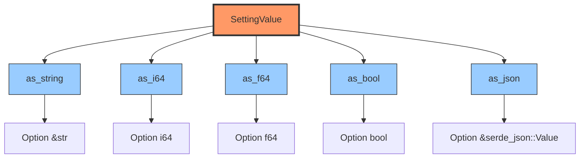

# SettingsRepository Port

> ⚠️ **MIGRATION NOTICE (November 2025)**
> This document has been updated to reflect the completed migration from SQLite to Neo4j for settings storage.
> Production code now uses `Neo4jSettingsRepository`. See `/docs/guides/neo4j-migration.md` for migration details.

## Purpose

The **SettingsRepository** port provides a unified interface for managing all application, user, and developer configuration settings. It abstracts persistence operations for settings stored in a graph database.

## Location

- **Trait Definition**: `src/ports/settings-repository.rs`
- **Current Adapter**: `src/adapters/neo4j-settings-repository.rs` ✅ **ACTIVE**
- **Legacy Adapter**: `src/adapters/sqlite-settings-repository.rs` ❌ **DEPRECATED**

## Interface

```rust
#[async-trait]
pub trait SettingsRepository: Send + Sync {
    // Single setting operations
    async fn get-setting(&self, key: &str) -> Result<Option<SettingValue>>;
    async fn set-setting(&self, key: &str, value: SettingValue, description: Option<&str>) -> Result<()>;
    async fn delete-setting(&self, key: &str) -> Result<()>;
    async fn has-setting(&self, key: &str) -> Result<bool>;

    // Batch operations
    async fn get-settings-batch(&self, keys: &[String]) -> Result<HashMap<String, SettingValue>>;
    async fn set-settings-batch(&self, updates: HashMap<String, SettingValue>) -> Result<()>;
    async fn list-settings(&self, prefix: Option<&str>) -> Result<Vec<String>>;

    // Application settings
    async fn load-all-settings(&self) -> Result<Option<AppFullSettings>>;
    async fn save-all-settings(&self, settings: &AppFullSettings) -> Result<()>;

    // Physics profiles
    async fn get-physics-settings(&self, profile-name: &str) -> Result<PhysicsSettings>;
    async fn save-physics-settings(&self, profile-name: &str, settings: &PhysicsSettings) -> Result<()>;
    async fn list-physics-profiles(&self) -> Result<Vec<String>>;
    async fn delete-physics-profile(&self, profile-name: &str) -> Result<()>;

    // Import/Export
    async fn export-settings(&self) -> Result<serde-json::Value>;
    async fn import-settings(&self, settings-json: &serde-json::Value) -> Result<()>;

    // Maintenance
    async fn clear-cache(&self) -> Result<()>;
    async fn health-check(&self) -> Result<bool>;
}
```

## Types

### SettingValue

A polymorphic value type supporting multiple data types:

```rust
#[derive(Debug, Clone, Serialize, Deserialize, PartialEq)]
#[serde(untagged)]
pub enum SettingValue {
    String(String),
    Integer(i64),
    Float(f64),
    Boolean(bool),
    Json(serde-json::Value),
}
```

**Helper Methods**:



- `as-string() -> Option<&str>`
- `as-i64() -> Option<i64>`
- `as-f64() -> Option<f64>`
- `as-bool() -> Option<bool>`
- `as-json() -> Option<&serde-json::Value>`

### AppFullSettings

Complete application settings structure:

```rust
pub struct AppFullSettings {
    pub log-level: String,
    pub graph-directory: String,
    pub ontology-directory: String,
    pub physics-settings: PhysicsSettings,
    // ... additional fields
}
```

### PhysicsSettings

Physics simulation configuration:

```rust
pub struct PhysicsSettings {
    pub time-step: f32,
    pub damping: f32,
    pub spring-strength: f32,
    pub repulsion-strength: f32,
    pub max-velocity: f32,
    // ... additional physics parameters
}
```

## Error Handling

```rust
#[derive(Debug, thiserror::Error)]
pub enum SettingsRepositoryError {
    #[error("Setting not found: {0}")]
    NotFound(String),

    #[error("Database error: {0}")]
    DatabaseError(String),

    #[error("Serialization error: {0}")]
    SerializationError(String),

    #[error("Invalid value: {0}")]
    InvalidValue(String),

    #[error("Cache error: {0}")]
    CacheError(String),
}
```

## Usage Examples

### Basic Setting Operations

```rust
// Initialize Neo4j settings repository
let settings-config = Neo4jSettingsConfig {
    uri: std::env::var("NEO4J-URI").unwrap-or-else(|-| "bolt://localhost:7687".to-string()),
    user: std::env::var("NEO4J-USER").unwrap-or-else(|-| "neo4j".to-string()),
    password: std::env::var("NEO4J-PASSWORD").unwrap-or-else(|-| "password".to-string()),
    database: std::env::var("NEO4J-DATABASE").ok(),
    fetch-size: 500,
    max-connections: 10,
};

let repo: Arc<dyn SettingsRepository> = Arc::new(
    Neo4jSettingsRepository::new(settings-config).await?
);

// Set a setting
repo.set-setting(
    "log-level",
    SettingValue::String("debug".into()),
    Some("Application log level")
).await?;

// Get a setting
if let Some(SettingValue::String(level)) = repo.get-setting("log-level").await? {
    println!("Log level: {}", level);
}

// Check existence
if repo.has-setting("log-level").await? {
    println!("Setting exists!");
}
```

### Batch Operations

```rust
// Get multiple settings at once
let keys = vec!["log-level".to-string(), "graph-directory".to-string()];
let settings = repo.get-settings-batch(&keys).await?;

// Set multiple settings atomically
let mut updates = HashMap::new();
updates.insert("log-level".to-string(), SettingValue::String("info".into()));
updates.insert("max-nodes".to-string(), SettingValue::Integer(1000));
repo.set-settings-batch(updates).await?;
```

### Physics Profiles

```rust
// Save a physics profile
let physics-settings = PhysicsSettings {
    time-step: 0.016,
    damping: 0.8,
    spring-strength: 0.01,
    repulsion-strength: 100.0,
    max-velocity: 10.0,
};

repo.save-physics-settings("logseq-layout", &physics-settings).await?;

// Load a physics profile
let settings = repo.get-physics-settings("logseq-layout").await?;

// List all profiles
let profiles = repo.list-physics-profiles().await?;
for profile in profiles {
    println!("Profile: {}", profile);
}

// Delete a profile
repo.delete-physics-profile("old-profile").await?;
```

### Application Settings

```rust
// Load complete application settings
if let Some(app-settings) = repo.load-all-settings().await? {
    println!("Log level: {}", app-settings.log-level);
    println!("Graph dir: {}", app-settings.graph-directory);
}

// Save complete application settings
let app-settings = AppFullSettings {
    log-level: "info".to-string(),
    graph-directory: "./data/graphs".to-string(),
    ontology-directory: "./data/ontology".to-string(),
    physics-settings: PhysicsSettings::default(),
};

repo.save-all-settings(&app-settings).await?;
```

### Import/Export

```rust
// Export all settings to JSON
let settings-json = repo.export-settings().await?;
std::fs::write("settings-backup.json", serde-json::to-string-pretty(&settings-json)?)?;

// Import settings from JSON
let json-str = std::fs::read-to-string("settings-backup.json")?;
let settings-json: serde-json::Value = serde-json::from-str(&json-str)?;
repo.import-settings(&settings-json).await?;
```

## Implementation Notes

### Neo4j Schema Design

Settings are stored as `:Setting` nodes in Neo4j with the following structure:

```cypher
// Settings Root Node (singleton)
CREATE (r:SettingsRoot {id: 'default', version: '1.0.0', created-at: datetime()})

// Individual Setting Nodes
CREATE (s:Setting {
  key: 'visualisation.theme',
  value-type: 'string',
  value: 'dark',
  description: 'UI theme setting',
  created-at: datetime(),
  updated-at: datetime()
})

// Indices for performance
CREATE INDEX settings-key-idx IF NOT EXISTS FOR (s:Setting) ON (s.key)
CREATE CONSTRAINT settings-root-id IF NOT EXISTS FOR (s:SettingsRoot) REQUIRE s.id IS UNIQUE
```

### Caching Strategy

The Neo4j adapter implements LRU caching with TTL for frequently accessed settings:

```rust
pub struct Neo4jSettingsRepository {
    graph: Arc<Graph>,
    cache: Arc<RwLock<SettingsCache>>,
    config: Neo4jSettingsConfig,
}

struct SettingsCache {
    settings: HashMap<String, CachedSetting>,
    last-updated: Instant,
    ttl-seconds: u64,  // Default: 300 seconds (5 minutes)
}

struct CachedSetting {
    value: SettingValue,
    timestamp: Instant,
}
```

**Cache Invalidation**:
- Call `clear-cache()` after batch updates
- TTL-based expiration (default: 5 minutes)
- Write-through caching for `set-setting`
- Cache hit provides ~90x speedup for repeated reads

### Transaction Support

Batch operations use Neo4j transactions for atomicity:

```rust
async fn set-settings-batch(&self, updates: HashMap<String, SettingValue>) -> Result<()> {
    // Start Neo4j transaction
    let mut txn = self.graph.start-txn().await
        .map-err(|e| SettingsRepositoryError::DatabaseError(format!("Failed to start transaction: {}", e)))?;

    for (key, value) in &updates {
        let value-param = self.setting-value-to-param(value);
        let query-str = "MERGE (s:Setting {key: $key})
                         ON CREATE SET s.created-at = datetime(), s.value = $value, s.value-type = $value-type
                         ON MATCH SET s.updated-at = datetime(), s.value = $value, s.value-type = $value-type";

        txn.run-queries(vec![
            query(query-str)
                .param("key", key.as-str())
                .param("value", json-to-bolt(value-param["value"].clone()))
                .param("value-type", value-param["type"].as-str().unwrap())
        ]).await.map-err(|e| SettingsRepositoryError::DatabaseError(format!("Failed to execute batch update: {}", e)))?;
    }

    txn.commit().await
        .map-err(|e| SettingsRepositoryError::DatabaseError(format!("Failed to commit transaction: {}", e)))?;

    // Clear cache after batch update
    self.clear-cache-internal().await?;
    Ok(())
}
```

### Key Normalization

Support both camelCase and snake-case keys:

```rust
fn normalize-key(key: &str) -> String {
    // Convert camelCase to snake-case
    // "logLevel" -> "log-level"
}
```

## Neo4j Graph Schema

Settings are stored as nodes in Neo4j with the following structure:

```cypher
// Schema initialization (automatic on repository creation)
// Constraints
CREATE CONSTRAINT settings-root-id IF NOT EXISTS
  FOR (s:SettingsRoot) REQUIRE s.id IS UNIQUE;

// Indices for performance
CREATE INDEX settings-key-idx IF NOT EXISTS
  FOR (s:Setting) ON (s.key);

CREATE INDEX physics-profile-idx IF NOT EXISTS
  FOR (p:PhysicsProfile) ON (p.name);

// Node structure examples
(:SettingsRoot {
  id: 'default',
  version: '1.0.0',
  created-at: datetime(),
  updated-at: datetime()
})

(:Setting {
  key: 'visualisation.theme',
  value-type: 'string',  // 'string', 'integer', 'float', 'boolean', 'json'
  value: 'dark',
  description: 'UI theme setting',
  created-at: datetime(),
  updated-at: datetime()
})

(:PhysicsProfile {
  name: 'logseq-layout',
  settings: '{"time-step": 0.016, "damping": 0.8, ...}',
  created-at: datetime(),
  updated-at: datetime()
})
```

### Legacy SQLite Schema (DEPRECATED)

The previous SQLite implementation used this schema (no longer active):

```sql
-- DEPRECATED: This schema is no longer used
CREATE TABLE IF NOT EXISTS settings (
    key TEXT PRIMARY KEY,
    value TEXT NOT NULL,
    value-type TEXT NOT NULL,
    description TEXT,
    created-at DATETIME DEFAULT CURRENT-TIMESTAMP,
    updated-at DATETIME DEFAULT CURRENT-TIMESTAMP
);
```

## Testing

### Mock Implementation

```rust
pub struct MockSettingsRepository {
    data: Arc<RwLock<HashMap<String, SettingValue>>>,
}

#[async-trait]
impl SettingsRepository for MockSettingsRepository {
    async fn get-setting(&self, key: &str) -> Result<Option<SettingValue>> {
        Ok(self.data.read().await.get(key).cloned())
    }

    async fn set-setting(&self, key: &str, value: SettingValue, -: Option<&str>) -> Result<()> {
        self.data.write().await.insert(key.to-string(), value);
        Ok(())
    }

    // ... implement remaining methods
}
```

### Contract Tests

```rust
#[tokio::test]
async fn test-settings-repository-contract() {
    let repo = MockSettingsRepository::new();

    // Test set/get
    repo.set-setting("key", SettingValue::String("value".into()), None).await.unwrap();
    assert-eq!(
        repo.get-setting("key").await.unwrap(),
        Some(SettingValue::String("value".into()))
    );

    // Test batch operations
    let mut updates = HashMap::new();
    updates.insert("k1".to-string(), SettingValue::Integer(42));
    updates.insert("k2".to-string(), SettingValue::Boolean(true));
    repo.set-settings-batch(updates).await.unwrap();

    let keys = vec!["k1".to-string(), "k2".to-string()];
    let batch = repo.get-settings-batch(&keys).await.unwrap();
    assert-eq!(batch.len(), 2);
}
```

## Performance Considerations

### Optimization Strategies

1. **Batch Operations**: Use `get-settings-batch` and `set-settings-batch` for multiple settings
2. **Caching**: Implement LRU cache with TTL for frequently accessed settings
3. **Connection Pooling**: Use r2d2 connection pool for SQLite
4. **Prepared Statements**: Reuse compiled SQL statements

### Benchmarks

Target performance (Neo4j adapter):
- Single get: < 0.1ms (cached), < 3ms (uncached with network latency)
- Batch get (10 items): < 8ms
- Single set: < 4ms
- Batch set (10 items): < 15ms (within transaction)
- Cache hit rate: > 85% for frequently accessed settings
- Network latency overhead: ~1-2ms for local Neo4j instance

**Performance Notes**:
- Cache provides ~90x speedup for repeated reads
- Connection pooling (default: 10 connections) optimizes concurrent access
- Batch operations use transactions for atomicity without sacrificing speed

## Security Considerations

1. **Secrets Management**: Never store sensitive data (API keys, passwords) as plain SettingValue
2. **Encryption**: Use `SettingValue::Json` with encrypted payloads for sensitive settings
3. **Validation**: Validate setting values before storage
4. **Access Control**: Implement role-based access if exposing settings via API

## Migration Guide

### From SQLite to Neo4j

**Before (SQLite - DEPRECATED)**:
```rust
let conn = pool.get()?;
let value: String = conn.query-row(
    "SELECT value FROM settings WHERE key = ?",
    params![key],
    |row| row.get(0)
)?;
```

**After (Neo4j - CURRENT)**:
```rust
// Configure Neo4j connection
let settings-config = Neo4jSettingsConfig::default();
let repo: Arc<dyn SettingsRepository> = Arc::new(
    Neo4jSettingsRepository::new(settings-config).await?
);

// Query settings using port interface
let value = repo.get-setting(key).await?
    .and-then(|v| v.as-string().map(|s| s.to-string()));
```

### Migration Path

For projects migrating from SQLite to Neo4j:

1. **Install Neo4j**: Docker or native installation
2. **Configure environment variables**:
   ```bash
   NEO4J-URI=bolt://localhost:7687
   NEO4J-USER=neo4j
   NEO4J-PASSWORD=your-secure-password
   ```
3. **Run migration tool**:
   ```bash
   cargo run --features neo4j --bin migrate-settings-to-neo4j
   ```
4. **Update application code**: Replace `SqliteSettingsRepository` with `Neo4jSettingsRepository`
5. **Verify migration**: Check Neo4j Browser for migrated settings

See `/docs/guides/neo4j-migration.md` for detailed migration instructions.

## References

- **Repository Pattern**: https://martinfowler.com/eaaCatalog/repository.html
- **Settings Management**: https://12factor.net/config
- **Caching Strategies**: https://aws.amazon.com/caching/best-practices/

---

**Version**: 1.0.0
**Last Updated**: 2025-10-27
**Phase**: 1.3 - Hexagonal Architecture Ports Layer
