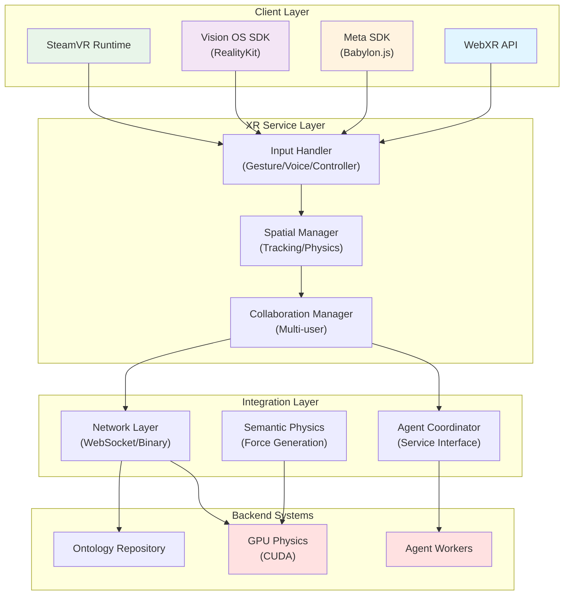
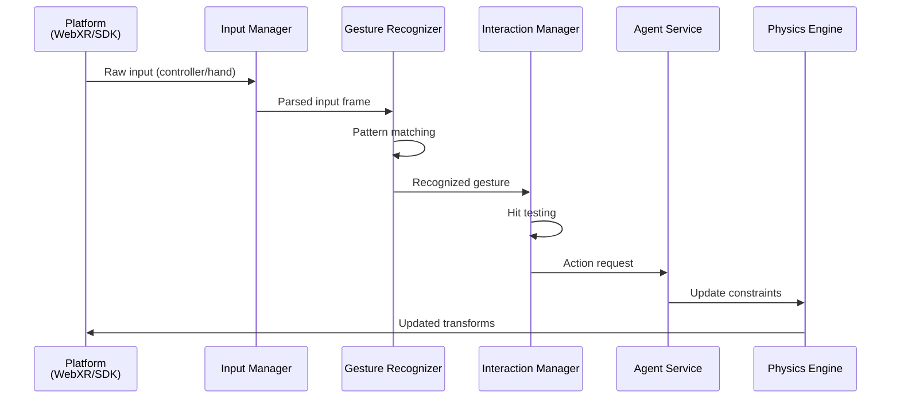
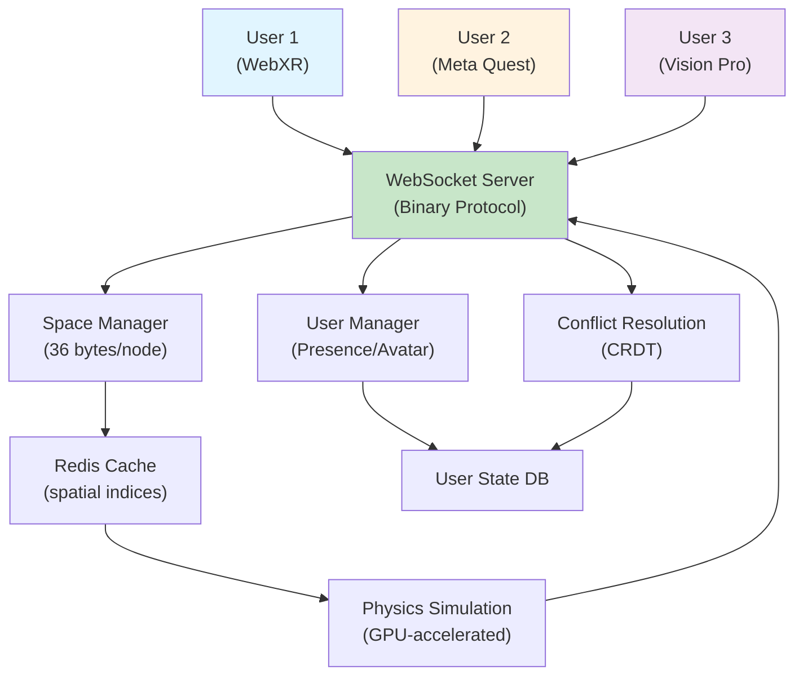

# XR Immersive System Architecture

## Executive Summary

VisionFlow's XR immersive system provides comprehensive extended reality (XR) support across WebXR, Meta Quest, Apple Vision Pro, and PC VR platforms. The architecture integrates spatial interaction, multi-user collaboration, and real-time semantic visualization within immersive 3D environments.

## System Overview



## Platform Support Architecture

### WebXR Implementation

**Target Browsers**: Chrome, Firefox, Meta Horizon, Microsoft Edge
**Hardware**: Meta Quest 2/3, Apple Vision Pro (via WebXR Polyfill), PC VR (with adapter)

```javascript
// WebXR Session Management
class WebXRSession {
  async initialize(mode = 'immersive-vr') {
    this.session = await navigator.xr.requestSession(mode, {
      requiredFeatures: ['dom-overlay', 'dom-overlay-for-handheld-ar'],
      optionalFeatures: ['secondary-views', 'hand-tracking']
    });

    this.inputSources = [];
    this.session.addEventListener('inputsourceschange', (event) => {
      this.handleInputChange(event);
    });

    return this.session;
  }

  async updatePoses(frame) {
    const viewer = frame.getViewerPose(this.refSpace);
    const poses = this.inputSources.map(source =>
      frame.getPose(source.targetRaySpace, this.refSpace)
    );

    return { viewer, input: poses };
  }
}
```

### Meta Quest Integration (Babylon.js)

**SDK Version**: Meta SDK 2.3+
**Target Devices**: Quest 2, Quest 3, Quest Pro

```typescript
// Meta Quest Setup
import { WebXRFeatureName, WebXRExperienceHelper } from "@babylonjs/core";

async function setupMetaQuest(engine: Engine, scene: Scene) {
  const xr = new WebXRExperienceHelper(scene);
  await xr.baseExperience.enterXRAsync(
    "immersive-vr",
    "local-floor",
    xr.teleportation.locomotionType
  );

  // Hand tracking
  const handTracking = xr.baseExperience.featuresManager.enableFeature(
    WebXRFeatureName.HAND-TRACKING,
    "latest"
  );

  // Near interaction for UI
  const nearInteraction = xr.baseExperience.featuresManager.enableFeature(
    WebXRFeatureName.NEAR-INTERACTION,
    "latest"
  );

  return { xr, handTracking, nearInteraction };
}
```

### Apple Vision Pro Support

**Integration**: WebXR Polyfill + RealityKit Bridge
**Capabilities**: Hand tracking, eye tracking, spatial anchors, real-world mesh

```swift
// Vision Pro RealityKit Integration
import RealityKit

@Model
final class ImmersiveEntity {
    var model: ModelEntity?
    var spatial: SpatialEntity?

    @MainActor
    func setupForVisionOS(anchor: AnchorEntity) throws {
        // Hand tracking
        let handTracking = HandTrackingProvider()

        // Eye tracking
        let eyeTracking = EyeTrackingProvider()

        // Mesh
        let meshProvider = WorldTrackingProvider()
    }
}
```

### PC VR Support (SteamVR)

**Integration**: OpenVR API with Babylon.js adapter
**Target Headsets**: HTC Vive, Valve Index, ASUS Mixed Reality

```cpp
// OpenVR Initialization
IVRSystem *vrSystem = VR-Init(nullptr, VRApplication-Scene);
IVRCompositor *vrCompositor = VRCompositor();

// Tracking
TrackedDevicePose-t poses[k-unMaxTrackedDeviceCount];
vrCompositor->WaitGetPoses(poses, k-unMaxTrackedDeviceCount, nullptr, 0);

for (uint32-t device = 0; device < k-unMaxTrackedDeviceCount; device++) {
    if (poses[device].bPoseIsValid) {
        HmdMatrix34-t &matrix = poses[device].mDeviceToAbsoluteTracking;
        // Update scene object position/rotation
    }
}
```

## Spatial Interaction Architecture

### Input Handling Pipeline



### Gesture Recognition

**Supported Gestures**:
- **Pinch**: Thumb + index finger (select/grab)
- **Point**: Index finger extended (ray cast)
- **Palm**: Open hand (menu/dismiss)
- **Thumbs Up**: Positive feedback/confirm
- **Two-hand Rotate**: Rotation control
- **Two-hand Scale**: Size adjustment

```typescript
class GestureRecognizer {
  async recognizeGesture(hands: Hand[]) {
    // Pinch detection
    if (this.isPinching(hands[0])) {
      return { type: 'pinch', confidence: 0.95, position: hands[0].palm };
    }

    // Point detection
    if (this.isPointing(hands[0])) {
      const ray = this.getRayFromIndexFinger(hands[0]);
      return { type: 'point', ray, confidence: 0.92 };
    }

    // Multi-hand detection
    if (hands.length > 1) {
      if (this.isTwoHandRotation(hands)) {
        return { type: 'rotate', axis: [...], angle: 0.15 };
      }
    }

    return null;
  }
}
```

### Voice Command Integration

**Voice Recognition**: Web Speech API / Platform SDK
**Commands**: Create, Delete, Move, Rotate, Scale, Inspect, Help

```typescript
class VoiceCommandHandler {
  private recognizer: SpeechRecognition;

  async initializeVoiceControl() {
    this.recognizer.addEventListener('result', (event) => {
      const transcript = Array.from(event.results)
        .map(r => r[0].transcript)
        .join('');

      this.processCommand(transcript);
    });
  }

  processCommand(command: string) {
    const { action, target, params } = this.parseCommand(command);

    switch (action) {
      case 'create':
        this.agentService.requestCreation(target, params);
        break;
      case 'move':
        this.spatialManager.updatePosition(target, params);
        break;
      case 'inspect':
        this.agentService.requestInspection(target);
        break;
    }
  }
}
```

## Multi-User Collaboration Architecture

### Shared Space Management



### User Presence & Avatars

**Avatar Components**:
- Head mesh + eye gaze direction
- Hand/controller meshes
- Voice indicator
- Name label
- Status indicator

```typescript
class UserAvatar {
  userId: string;
  headMesh: TransformNode;
  leftHand: HandMesh;
  rightHand: HandMesh;
  eyeGaze: Ray;
  voiceIndicator: VolumeMeter;

  async updateFromNetworkState(state: UserState) {
    // Update transforms at 90 Hz
    this.headMesh.position = state.headPosition;
    this.headMesh.rotationQuaternion = state.headRotation;

    this.leftHand.updatePoses(state.leftHandPoses);
    this.rightHand.updatePoses(state.rightHandPoses);

    this.eyeGaze = state.eyeGazeRay;
    this.voiceIndicator.setAmplitude(state.voiceAmplitude);
  }
}
```

### Synchronization Protocol

**Update Rate**: 90 Hz (per-frame)
**Compression**: Binary protocol with delta compression
**Conflict Resolution**: Last-write-wins with CRDT for concurrent edits

```typescript
// Binary update packet (36 bytes per node)
struct NodeUpdate {
  nodeId: u32,              // 4 bytes
  position: Vec3,           // 12 bytes
  rotation: Quaternion,     // 12 bytes
  scale: Vec3,              // 8 bytes (compressed to u16 x3)
  timestamp: u64            // but packed into 4 bytes delta
}
// Total: 36 bytes at 90 Hz = 3.24 MB/s per user
```

## Semantic Physics Integration

### XR Force Mapping

Ontological relationships translate to 3D interaction forces:

| Ontological Relation | XR Interpretation | Force Type |
|---------------------|------------------|-----------|
| `isPartOf` | Sub-component grouping | Weak spring |
| `isRelatedTo` | Spatial proximity hint | Directional alignment |
| `hasProperty` | Property visualization | Spring constraint |
| `isInstanceOf` | Type emphasis | Gravitational pull |

```typescript
class XRSemanticForces {
  async applyOntologyForces(node: Entity, relations: Relation[]) {
    for (const rel of relations) {
      const force = this.mapRelationToForce(rel);
      const targetPos = await this.resolveTargetPosition(rel.target);

      const direction = Vector3.Normalize(
        Vector3.Subtract(targetPos, node.position)
      );

      node.applyForce(
        Vector3.Scale(direction, force.magnitude),
        node.position
      );
    }
  }
}
```

## Agent Coordination in XR

### Agent Awareness in Immersive Space

Agents operate transparently within XR environments:

```typescript
class ImmersiveAgent extends Agent {
  private spatialState: SpatialState;

  async onUserInteraction(interaction: Interaction) {
    // Agent receives XR interactions as commands
    const { gesture, targetEntity } = interaction;

    switch (gesture) {
      case 'pinch':
        await this.handleSelection(targetEntity);
        break;
      case 'point':
        await this.handleRaycast(interaction.ray);
        break;
    }
  }

  async respondInSpace(response: AgentResponse) {
    // Agent responses manifest as spatial changes
    return {
      entityUpdates: response.data.map(d => ({
        nodeId: d.id,
        position: d.position,
        rotation: d.rotation
      })),
      audioData: response.speech  // Spatial audio
    };
  }
}
```

### Agent Visualization

Agents can be visualized in XR with:
- Work visualization (nodes being modified)
- Voice/communication indicators
- Status panels (if coordinating)
- Task progress bars

## Network Architecture

### WebSocket Binary Protocol

**Connection Establishment**:
```
Client → Server: HELLO (protocol-version, platform, capabilities)
Server → Client: WELCOME (session-id, world-state-snapshot)
```

**Frame Format**:
```
| type (1) | user-id (4) | timestamp (4) | sequence (2) | data-len (2) | data (up to 512) |
| 1 byte   | 4 bytes     | 4 bytes       | 2 bytes      | 2 bytes      | variable         |
```

**Message Types**:
- `POSE-UPDATE` (0x01): Transform changes
- `GESTURE-EVENT` (0x02): Interaction event
- `VOICE-DATA` (0x03): Audio stream
- `ENTITY-MODIFY` (0x04): Ontology update
- `AGENT-ACTION` (0x05): Agent-initiated change

### Bandwidth Optimization

| Content | Protocol | Bandwidth |
|---------|----------|-----------|
| Transforms (90 Hz) | Binary delta | 3.24 MB/s per user |
| Voice (16kHz mono) | Opus codec | 20 kB/s per user |
| Gestures | Binary events | < 1 kB/s per user |
| Ontology updates | Gzip + CBOR | variable |

## Performance Characteristics

### Frame Rate Targets
- **VR Min**: 72 Hz (Quest 2), 90 Hz (Quest 3, PCVR)
- **Vision Pro**: 90-120 Hz
- **WebXR**: 60-90 Hz (browser dependent)

### Latency Budgets
- **Input-to-Display**: < 20 ms (VR standard)
- **Network Round Trip**: < 100 ms (acceptable for collaboration)
- **Physics Simulation**: < 5 ms per frame

### Memory per User Session
- Avatar mesh + animations: 15 MB
- User state buffer: 2 MB
- Network receive buffer: 5 MB
- **Total per session**: ~25 MB

## Error Handling & Resilience

### Platform Fallbacks

```typescript
async function initializeXR() {
  try {
    return await navigator.xr?.requestSession?.('immersive-vr');
  } catch (e) {
    // Fallback sequence
    if (isMetaQuest()) {
      return await initializeMetaNative();
    } else if (isVisionOS()) {
      return await initializeVisionOSBridge();
    } else if (isSteamVR()) {
      return await initializeOpenVR();
    } else {
      return await initializeWebGL3DFallback();
    }
  }
}
```

### Connection Loss Recovery

- Automatic reconnection with exponential backoff
- Local prediction during network outage
- CRDT-based conflict resolution on reconnect
- User notification of desynchronization

---

---

## Related Documentation

- [Unified Services Guide](services-layer.md)
- [Architecture Documentation](README.md)
- [Adapter Patterns in VisionFlow](adapter-patterns.md)
- [Integration Patterns in VisionFlow](integration-patterns.md)
- [Semantic Physics Architecture](semantic-physics.md)

## Security Considerations

### XR-Specific Threats

1. **Spatial Injection**: Validate all entity positions against world bounds
2. **Voice Spoofing**: Verify voice data is from authenticated user
3. **Eye Tracking Data**: Encrypt per-frame gaze data
4. **Hand Position Tracking**: Validate against expected human kinematics

### Mitigation Strategies

```typescript
class XRSecurityValidator {
  validatePose(userId: string, pose: Pose): boolean {
    // Check position within world bounds
    if (!this.isWithinWorldBounds(pose.position)) {
      return false;
    }

    // Check for physically impossible motions
    const maxVelocity = 20; // meters per second
    const dt = performance.now() - this.lastUpdate[userId];
    const velocity = Vector3.Distance(
      pose.position,
      this.lastPosition[userId]
    ) / (dt / 1000);

    if (velocity > maxVelocity) {
      return false; // Reject teleportation attempts
    }

    return true;
  }
}
```
