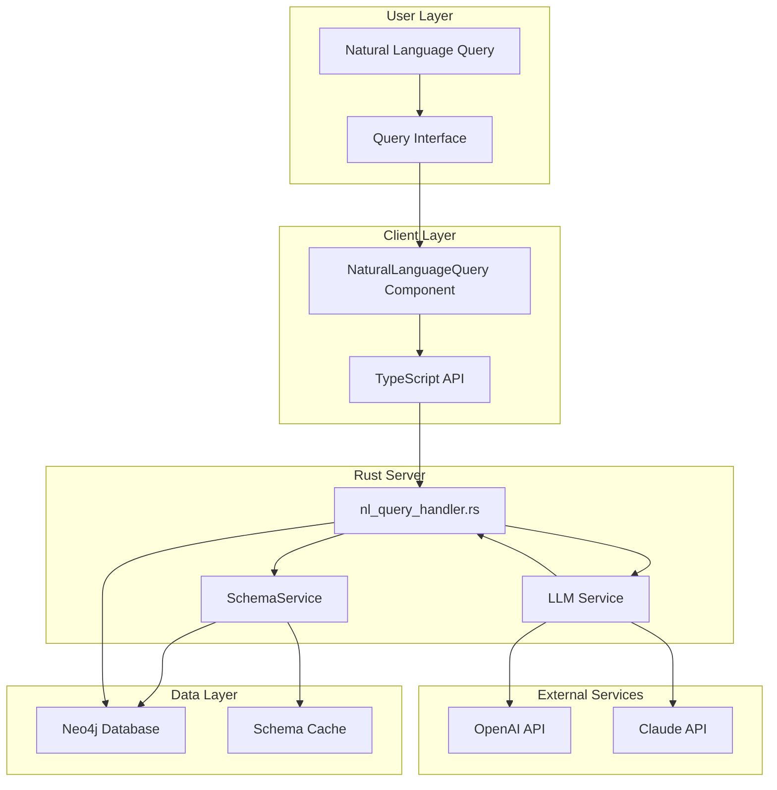
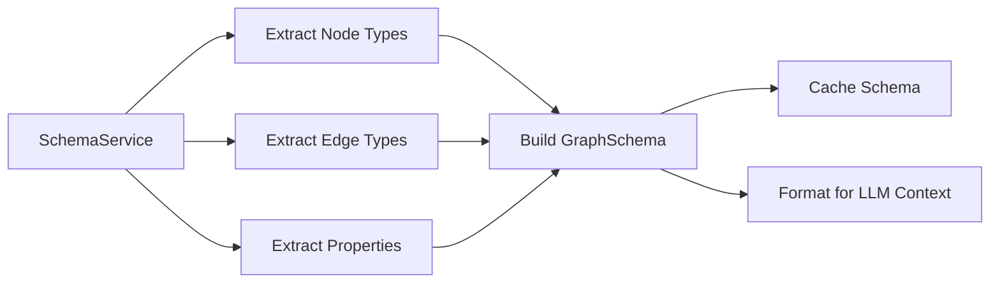
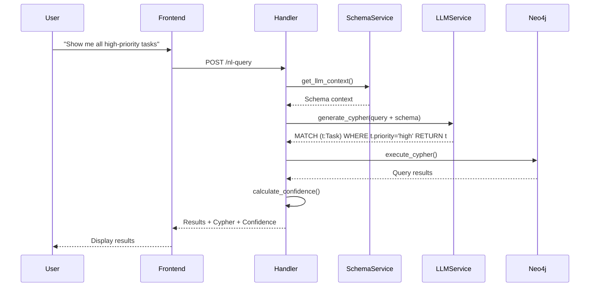
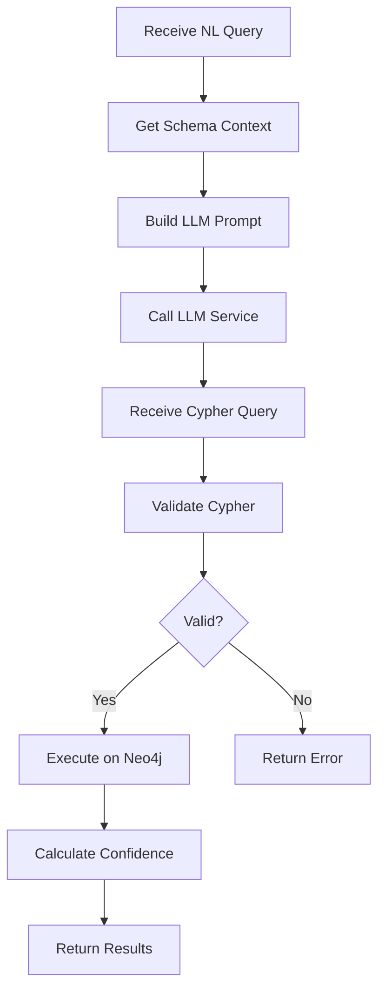

# Typed Ontology System with Natural Language Queries

**Status:** Implementation Ready
**Version:** 1.0
**Last Updated:** 2025-11-05

---

## Overview

The Typed Ontology System adds formal types to nodes and edges, exposes schema to LLMs, and enables natural language graph queries. This transforms VisionFlow from a visual graph database into an intelligent knowledge exploration platform with AI-powered query capabilities.

**Source Inspiration:** `graph_RAG` SPARQL integration patterns

**Key Benefits:**
- Natural language graph interaction
- Schema-aware query generation
- LLM-guided graph exploration
- Reduced barrier to entry for non-technical users

---

## System Architecture



---

## Core Components

### 1. Schema Exposure Service

Extracts and maintains graph schema for LLM context.



**Responsibilities:**
- Query Neo4j for schema metadata
- Build comprehensive schema representation
- Cache schema for performance
- Format schema for LLM consumption

**Implementation:** `src/services/schema_service.rs`

---

### 2. Natural Language Query Pipeline



---

## Data Model

### Graph Schema Structure

```rust
#[derive(Debug, Serialize)]
pub struct GraphSchema {
    pub node_types: Vec<NodeTypeSchema>,
    pub edge_types: Vec<EdgeTypeSchema>,
    pub properties: HashMap<String, PropertySchema>,
}

#[derive(Debug, Serialize)]
pub struct NodeTypeSchema {
    pub type_name: String,
    pub description: String,
    pub properties: Vec<String>,
    pub count: usize,
}

#[derive(Debug, Serialize)]
pub struct EdgeTypeSchema {
    pub type_name: String,
    pub description: String,
    pub properties: Vec<String>,
    pub count: usize,
}

#[derive(Debug, Serialize)]
pub struct PropertySchema {
    pub name: String,
    pub value_type: String,
    pub nullable: bool,
    pub examples: Vec<String>,
}
```

---

## Schema Service Implementation

### Schema Extraction

```rust
pub struct SchemaService {
    neo4j_adapter: Arc<Neo4jAdapter>,
    schema_cache: Arc<RwLock<Option<GraphSchema>>>,
}

impl SchemaService {
    pub async fn extract_schema(&self) -> Result<GraphSchema, ServiceError> {
        // Query Neo4j for all node types
        let node_types = self.extract_node_types().await?;
        let edge_types = self.extract_edge_types().await?;
        let properties = self.extract_properties().await?;

        let schema = GraphSchema {
            node_types,
            edge_types,
            properties,
        };

        // Cache for LLM context
        *self.schema_cache.write().await = Some(schema.clone());

        Ok(schema)
    }

    async fn extract_node_types(&self) -> Result<Vec<NodeTypeSchema>, ServiceError> {
        let query = r#"
            MATCH (n)
            WITH DISTINCT labels(n) AS labels, COUNT(n) AS count
            UNWIND labels AS label
            RETURN label, count
        "#;

        let results = self.neo4j_adapter.execute_cypher(query).await?;

        // Process results into NodeTypeSchema
        // ...
    }

    async fn extract_edge_types(&self) -> Result<Vec<EdgeTypeSchema>, ServiceError> {
        let query = r#"
            MATCH ()-[r]->()
            WITH type(r) AS rel_type, COUNT(r) AS count
            RETURN rel_type, count
        "#;

        let results = self.neo4j_adapter.execute_cypher(query).await?;

        // Process results
        // ...
    }
}
```

---

### LLM Context Formatting

```rust
impl SchemaService {
    pub async fn get_llm_context(&self) -> Result<String, ServiceError> {
        let schema = self.schema_cache.read().await.clone()
            .ok_or(ServiceError::SchemaNotLoaded)?;

        // Format for LLM consumption
        let context = format!(
            "Graph Database Schema:\n\n\
             Node Types:\n{}\n\n\
             Edge Types:\n{}\n\n\
             Properties:\n{}",
            self.format_node_types(&schema.node_types),
            self.format_edge_types(&schema.edge_types),
            self.format_properties(&schema.properties)
        );

        Ok(context)
    }

    fn format_node_types(&self, types: &[NodeTypeSchema]) -> String {
        types.iter()
            .map(|t| format!(
                "- {} ({}): {} instances, properties: {:?}",
                t.type_name,
                t.description,
                t.count,
                t.properties
            ))
            .collect::<Vec<_>>()
            .join("\n")
    }

    fn format_edge_types(&self, types: &[EdgeTypeSchema]) -> String {
        types.iter()
            .map(|t| format!(
                "- {} ({}): {} connections",
                t.type_name,
                t.description,
                t.count
            ))
            .collect::<Vec<_>>()
            .join("\n")
    }
}
```

**Example LLM Context:**
```
Graph Database Schema:

Node Types:
- Person (Individual human): 1,234 instances, properties: ["name", "email", "role"]
- Project (Software project): 56 instances, properties: ["title", "status", "deadline"]
- Task (Work item): 789 instances, properties: ["title", "priority", "assigned_to"]

Edge Types:
- WORKS_ON (Person works on Project): 1,890 connections
- DEPENDS_ON (Task depends on Task): 456 connections
- ASSIGNED_TO (Task assigned to Person): 789 connections

Properties:
- priority: string, values: ["high", "medium", "low"]
- status: string, values: ["active", "completed", "blocked"]
- deadline: datetime, nullable
```

---

## Natural Language Query Handler

### Query Processing Pipeline



### Implementation

```rust
#[derive(Debug, Deserialize)]
pub struct NaturalLanguageQueryRequest {
    pub query: String,
    pub llm_provider: Option<String>, // "openai", "anthropic", etc.
}

#[derive(Debug, Serialize)]
pub struct NaturalLanguageQueryResponse {
    pub interpreted_query: String,
    pub cypher_query: String,
    pub results: Vec<serde_json::Value>,
    pub confidence: f32,
}

pub async fn handle_nl_query(
    app_state: web::Data<AppState>,
    req: web::Json<NaturalLanguageQueryRequest>,
) -> Result<HttpResponse, ActixError> {
    // 1. Get schema for LLM context
    let schema_context = app_state.schema_service.get_llm_context().await?;

    // 2. Call LLM to translate natural language to Cypher
    let llm_prompt = format!(
        "{}\n\nUser Query: {}\n\nGenerate a Cypher query to answer this question.",
        schema_context,
        req.query
    );

    let cypher_query = app_state.llm_service
        .generate_cypher(llm_prompt, req.llm_provider.as_deref())
        .await?;

    // 3. Execute Cypher query
    let results = app_state.neo4j_adapter
        .execute_cypher(&cypher_query)
        .await?;

    // 4. Calculate confidence based on result count and query complexity
    let confidence = calculate_confidence(&results, &cypher_query);

    Ok(HttpResponse::Ok().json(NaturalLanguageQueryResponse {
        interpreted_query: req.query.clone(),
        cypher_query,
        results,
        confidence,
    }))
}
```

---

### Confidence Calculation

```rust
fn calculate_confidence(results: &[serde_json::Value], cypher: &str) -> f32 {
    let mut confidence = 1.0;

    // Reduce confidence for complex queries
    if cypher.contains("OPTIONAL") {
        confidence *= 0.9;
    }
    if cypher.matches("WHERE").count() > 2 {
        confidence *= 0.85;
    }

    // Reduce confidence for empty results
    if results.is_empty() {
        confidence *= 0.5;
    }

    // Reduce confidence for very large result sets (might be too broad)
    if results.len() > 1000 {
        confidence *= 0.7;
    }

    confidence.clamp(0.0, 1.0)
}
```

---

## LLM Service Integration

### Provider Abstraction

```rust
pub trait LLMProvider: Send + Sync {
    async fn generate_cypher(
        &self,
        prompt: String,
    ) -> Result<String, LLMError>;
}

pub struct OpenAIProvider {
    api_key: String,
    model: String,
}

pub struct AnthropicProvider {
    api_key: String,
    model: String,
}

pub struct LLMService {
    providers: HashMap<String, Box<dyn LLMProvider>>,
    default_provider: String,
}

impl LLMService {
    pub async fn generate_cypher(
        &self,
        prompt: String,
        provider: Option<&str>,
    ) -> Result<String, LLMError> {
        let provider_name = provider.unwrap_or(&self.default_provider);
        let provider = self.providers.get(provider_name)
            .ok_or(LLMError::ProviderNotFound)?;

        let cypher = provider.generate_cypher(prompt).await?;

        // Post-process: extract Cypher from markdown code blocks
        let cypher = self.extract_cypher_from_response(&cypher);

        Ok(cypher)
    }

    fn extract_cypher_from_response(&self, response: &str) -> String {
        // Extract from markdown code blocks if present
        if let Some(start) = response.find("```cypher") {
            if let Some(end) = response[start..].find("```") {
                return response[start + 9..start + end].trim().to_string();
            }
        }
        response.trim().to_string()
    }
}
```

---

## REST API

### Endpoints

| Method | Endpoint | Description |
|--------|----------|-------------|
| POST | `/api/nl-query` | Execute natural language query |
| GET | `/api/nl-query/schema` | Get current graph schema |
| POST | `/api/nl-query/schema/refresh` | Refresh schema cache |

### Execute Natural Language Query

**Request:**
```json
{
  "query": "Show me all high-priority tasks assigned to John",
  "llm_provider": "openai"
}
```

**Response:**
```json
{
  "interpreted_query": "Show me all high-priority tasks assigned to John",
  "cypher_query": "MATCH (t:Task)-[:ASSIGNED_TO]->(p:Person {name: 'John'}) WHERE t.priority = 'high' RETURN t",
  "results": [
    {
      "id": "task-123",
      "title": "Implement semantic forces",
      "priority": "high",
      "status": "in_progress"
    }
  ],
  "confidence": 0.95
}
```

### Get Schema

**Response:**
```json
{
  "node_types": [
    {
      "type_name": "Person",
      "description": "Individual human",
      "properties": ["name", "email", "role"],
      "count": 1234
    }
  ],
  "edge_types": [
    {
      "type_name": "ASSIGNED_TO",
      "description": "Task assignment",
      "properties": ["assigned_date"],
      "count": 789
    }
  ],
  "properties": {
    "priority": {
      "name": "priority",
      "value_type": "string",
      "nullable": false,
      "examples": ["high", "medium", "low"]
    }
  }
}
```

---

## Frontend Integration

### NaturalLanguageQuery Component

```typescript
export const NaturalLanguageQuery: React.FC = () => {
  const [query, setQuery] = useState('');
  const [loading, setLoading] = useState(false);
  const [results, setResults] = useState<NaturalLanguageQueryResponse | null>(null);

  const handleSubmit = async (e: React.FormEvent) => {
    e.preventDefault();
    setLoading(true);

    try {
      const response = await axios.post('/api/nl-query', { query });
      setResults(response.data);
    } catch (error) {
      console.error('Query failed:', error);
    } finally {
      setLoading(false);
    }
  };

  return (
    <div className="nl-query-panel">
      <h3>Ask a Question About Your Graph</h3>
      <form onSubmit={handleSubmit}>
        <textarea
          value={query}
          onChange={(e) => setQuery(e.target.value)}
          placeholder="e.g., Show me all high-priority tasks connected to the VisionFlow project"
          rows={3}
        />
        <button type="submit" disabled={loading}>
          {loading ? 'Querying...' : 'Ask Question'}
        </button>
      </form>

      {results && (
        <div className="query-results">
          <div className="interpreted">
            <strong>Cypher Query:</strong>
            <pre>{results.cypher_query}</pre>
          </div>
          <div className="confidence">
            Confidence: {(results.confidence * 100).toFixed(1)}%
          </div>
          <div className="results">
            <strong>Results ({results.results.length}):</strong>
            <QueryResultsTable data={results.results} />
          </div>
        </div>
      )}
    </div>
  );
};
```

**Location:** `client/src/features/query/components/NaturalLanguageQuery.tsx`

---

## Example Queries

### Query: Find Connections

**Natural Language:**
> "Show me all projects that John is working on"

**Generated Cypher:**
```cypher
MATCH (p:Person {name: 'John'})-[:WORKS_ON]->(proj:Project)
RETURN proj
```

---

### Query: Dependency Analysis

**Natural Language:**
> "What tasks are blocked by high-priority tasks?"

**Generated Cypher:**
```cypher
MATCH (blocking:Task {priority: 'high'})<-[:DEPENDS_ON]-(blocked:Task)
RETURN blocked
```

---

### Query: Aggregate Statistics

**Natural Language:**
> "How many tasks are assigned to each person?"

**Generated Cypher:**
```cypher
MATCH (t:Task)-[:ASSIGNED_TO]->(p:Person)
RETURN p.name AS person, COUNT(t) AS task_count
ORDER BY task_count DESC
```

---

## Security Considerations

### Query Validation

```rust
pub fn validate_cypher_query(cypher: &str) -> Result<(), ValidationError> {
    // Prevent dangerous operations
    let forbidden = ["DELETE", "REMOVE", "SET", "CREATE", "MERGE", "DROP"];
    let upper = cypher.to_uppercase();

    for keyword in &forbidden {
        if upper.contains(keyword) {
            return Err(ValidationError::ForbiddenOperation(keyword.to_string()));
        }
    }

    // Ensure read-only operations
    if !upper.starts_with("MATCH") && !upper.starts_with("OPTIONAL MATCH") {
        return Err(ValidationError::NotReadOnly);
    }

    Ok(())
}
```

### Rate Limiting

```rust
pub struct RateLimiter {
    requests: Arc<RwLock<HashMap<String, Vec<Instant>>>>,
    max_requests_per_minute: usize,
}

impl RateLimiter {
    pub async fn check_rate_limit(&self, user_id: &str) -> Result<(), RateLimitError> {
        let mut requests = self.requests.write().await;
        let user_requests = requests.entry(user_id.to_string()).or_insert_with(Vec::new);

        // Remove requests older than 1 minute
        let now = Instant::now();
        user_requests.retain(|&time| now.duration_since(time).as_secs() < 60);

        if user_requests.len() >= self.max_requests_per_minute {
            return Err(RateLimitError::TooManyRequests);
        }

        user_requests.push(now);
        Ok(())
    }
}
```

---

## Performance Characteristics

### Schema Extraction

- **Initial Load:** ~500ms for 10K nodes, 50K edges
- **Cached:** <1ms
- **Cache Invalidation:** Manual or on schema changes

### Query Generation

- **LLM Latency:** 1-3 seconds (OpenAI GPT-4)
- **Total Response Time:** 1.5-4 seconds
- **Optimization:** Cache common query patterns

### Neo4j Execution

- Depends on query complexity
- Use EXPLAIN/PROFILE for optimization
- Add indexes on frequently queried properties

---

## Related Documentation

- [Semantic Forces System](./explanations/architecture/semantic-forces-system.md)
- [Intelligent Pathfinding](./intelligent-pathfinding-system.md)
- [Neo4j Integration Guide](../guides/neo4j-integration.md)
- [Semantic Features Implementation Guide](../guides/semantic-features-implementation.md)

---

## Implementation Status

- [x] Schema service design
- [x] Natural language query handler design
- [x] LLM service abstraction
- [ ] Schema extraction implementation
- [ ] LLM provider integration
- [ ] Query validation
- [ ] Frontend component
- [ ] Security hardening
- [ ] Performance testing
- [ ] Documentation

**Next Steps:** See [Semantic Features Implementation Guide](../guides/semantic-features-implementation.md) for Phase 3 implementation details.
