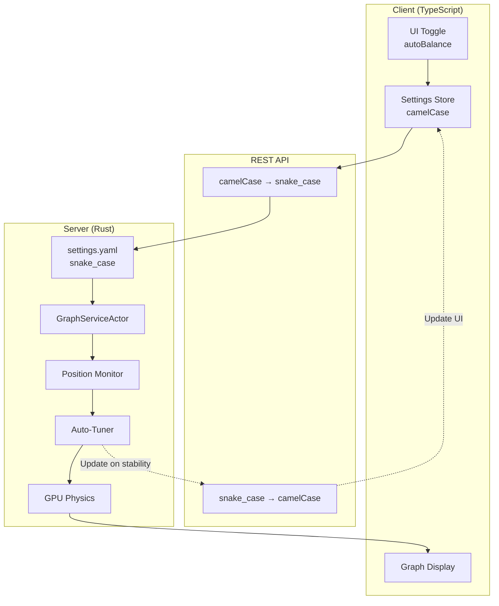
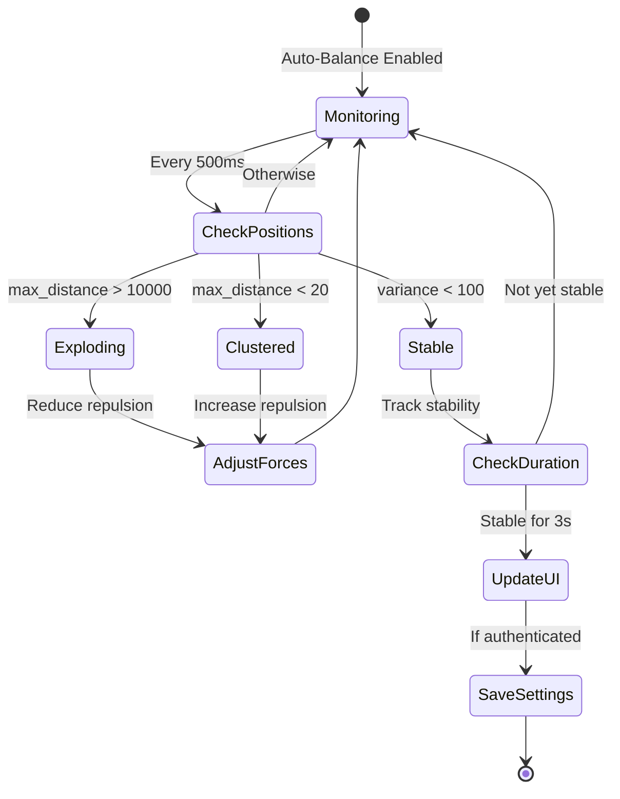

# Neural Auto-Balance Feature

## Overview

The Neural Auto-Balance feature provides intelligent, automatic tuning of physics parameters to achieve stable graph visualisation. When enabled, the system continuously monitors node positions and automatically adjusts physics forces to prevent graph explosion whilst maintaining optimal spacing.

## Architecture



## How It Works

### 1. Monitoring Phase
The system tracks node positions every 500ms (configurable via `auto_balance_interval_ms`) to detect:
- **Extreme positions**: Nodes beyond 1000 units from origin
- **Clustering**: Nodes compressed within 20 units
- **Stability**: Low variance in positions over time

### 2. Detection Algorithm



### 3. Auto-Tuning Parameters

When instability is detected, the system adjusts:

| Parameter | Explosion Adjustment | Clustering Adjustment |
|-----------|---------------------|----------------------|
| `repel_k` | × 0.5 (min: 0.01) | × 1.2 (max: 5.0) |
| `damping` | Blend towards 0.99 | No change |
| `max_velocity` | × 0.8 (min: 0.1) | No change |
| `enable_bounds` | Set to true | No change |
| `viewport_bounds` | Set to 100 | No change |

### 4. Stability Detection

The system detects a stable minima when:
1. Position variance < 100 over last 30 frames
2. No extreme positions detected
3. Maintains stability for 180 frames (3 seconds at 60fps)

## Configuration

### Settings File (`data/settings.yaml`)

```yaml
visualisation:
  graphs:
    logseq:
      physics:
        auto_balance: true              # Enable auto-tuning
        auto_balance_interval_ms: 500   # Check interval
        # Initial parameters (will be auto-tuned)
        repel_k: 0.1
        damping: 0.99
        max_velocity: 0.5
        spring_k: 0.5
        attraction_k: 0.1
        enable_bounds: true
        bounds_size: 100.0
```

### UI Control

The feature is controlled via the Neural Auto-Balance toggle in the Physics Settings panel:

```typescript
{ 
  key: 'autoBalance', 
  label: '🧠 Neural Auto-Balance', 
  type: 'toggle', 
  path: 'visualisation.graphs.logseq.physics.autoBalance' 
}
```

## Implementation Details

### Case Conversion Convention

The system maintains consistent naming across layers:
- **TypeScript/Client**: camelCase (`autoBalance`, `repelK`)
- **Rust/Server**: snake_case (`auto_balance`, `repel_k`)
- **REST API**: Automatic conversion at boundary

### Key Components

#### GraphServiceActor (`graph_actor.rs`)
- Monitors node positions in `update_node_positions()`
- Tracks position history for minima detection
- Adjusts physics parameters when instability detected
- Notifies settings system when stable

#### SettingsActor (`settings_actor.rs`)
- Handles `UpdatePhysicsFromAutoBalance` messages
- Updates UI sliders when stability achieved
- Persists to `settings.yaml` if `persist_settings` enabled

#### Validation (`settings_handler.rs`)
- Validates `autoBalance` as boolean
- Validates `autoBalanceIntervalMs` between 100-5000ms
- Relaxes physics parameter constraints after auto-tuning

## Benefits

1. **Automatic Optimisation**: No manual tuning required
2. **Data Adaptive**: Finds optimal parameters for any dataset
3. **Prevents Explosion**: Detects and corrects unstable physics
4. **UI Synchronisation**: Updates sliders to show tuned values
5. **Persistent Learning**: Saves optimal settings for future sessions

## Usage

1. Enable "🧠 Neural Auto-Balance" toggle in Physics Settings
2. System begins monitoring immediately
3. Watch as graph automatically stabilises
4. Once stable (after ~3 seconds), sliders update to show optimal values
5. Settings saved automatically if user is authenticated

## Performance Considerations

- Minimal overhead: Position checking every 500ms
- History buffer: 60 frames (1 second at 60fps)
- Debouncing: Prevents race conditions between UI and auto-tuning
- GPU-optimised: All physics calculations remain on GPU

## Troubleshooting

### Graph Still Bouncing
- Check `auto_balance` is `true` in settings.yaml
- Verify physics is enabled (`enabled: true`)
- Check logs for `[AUTO-BALANCE]` messages
- Ensure boundaries are reasonable (`bounds_size` < 10000)

### Auto-Balance Not Activating
- Confirm settings are loaded from yaml (not localStorage)
- Check REST API case conversion is working
- Verify `UpdateSimulationParams` messages in logs

### Parameters Not Updating
- Check `persist_settings: true` in system settings
- Verify user authentication status
- Look for `[AUTO-BALANCE] Stable minima found` in logs

## Future Enhancements

- Machine learning model for parameter prediction
- Multi-graph coordinated tuning
- Custom stability thresholds per dataset
- Export/import optimal parameter sets
- A/B testing of parameter combinations