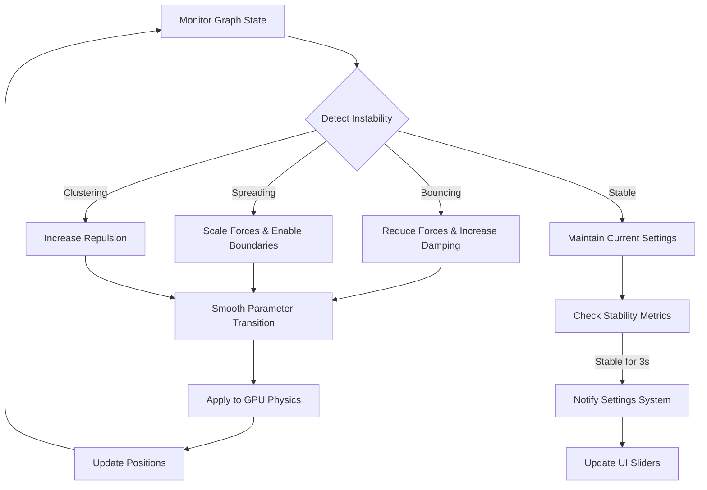
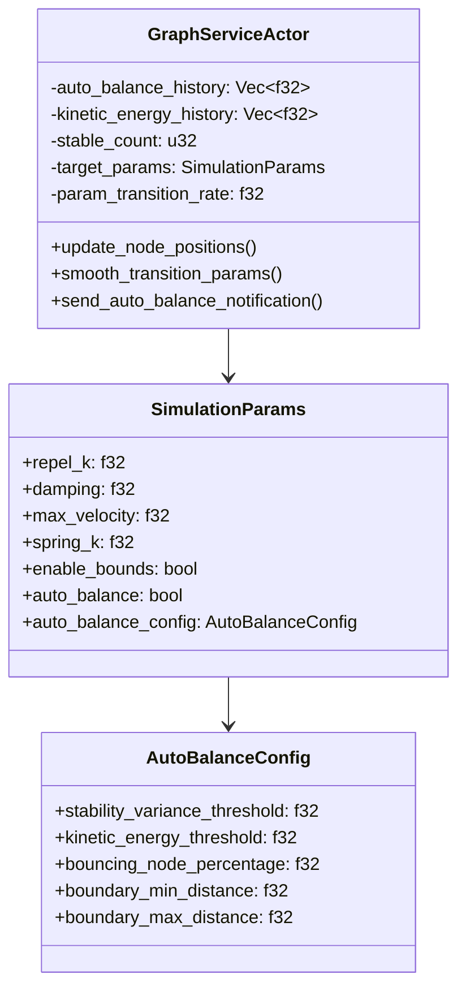

# Adaptive Balancing

## Overview

Adaptive Balancing is an intelligent physics auto-tuning system that automatically adjusts force-directed graph parameters to maintain stable, aesthetically pleasing visualisations. The system continuously monitors graph behaviour and makes real-time adjustments to prevent common issues like node clustering, boundary bouncing, and explosive spreading.

## How It Works



## Core Components

### 1. Stability Detection

The system uses multiple metrics to assess graph stability:

- **Position Variance**: Tracks changes in maximum node distances over time
- **Kinetic Energy**: Monitors total system energy to detect true equilibrium
- **Boundary Analysis**: Counts nodes at boundary positions to detect bouncing
- **Oscillation Detection**: Identifies repetitive movement patterns

### 2. Boundary Detection System

**CRITICAL FIX**: The system now uses **percentage-based boundary detection** relative to `viewport_bounds` instead of hardcoded values:

```rust
// OLD (Broken): Hardcoded boundaries
if dist > 90.0 && dist <= 110.0 {
    boundary_nodes += 1;  // Failed when viewport_bounds = 1000 and nodes at 980!
}

// NEW (Fixed): Percentage-based boundaries
let boundary_min_threshold = viewport_bounds * (config.boundary_min_distance / 100.0); // 90%
let boundary_max_threshold = viewport_bounds * (config.boundary_max_distance / 100.0); // 100%
if dist >= boundary_min_threshold && dist <= boundary_max_threshold {
    boundary_nodes += 1;  // Now correctly detects nodes at 980 when viewport_bounds = 1000
}
```

**Example scenarios**:
- `viewport_bounds = 1000`: boundary range = 900-1000 (now detects nodes at 980!)
- `viewport_bounds = 500`: boundary range = 450-500
- `viewport_bounds = 2000`: boundary range = 1800-2000

### 3. Parameter Clamping System

All physics parameters are now **clamped to safe ranges** to prevent extreme values:

```rust
// Prevent extreme parameter values that cause instability
new_target.repel_k = ((value).max(0.01)).min(100.0);     // 0.01 to 100.0
new_target.damping = ((value).max(0.01)).min(0.99);      // 0.01 to 0.99
new_target.max_velocity = ((value).max(0.1)).min(50.0);  // 0.1 to 50.0
new_target.spring_k = ((value).max(0.001)).min(10.0);    // 0.001 to 10.0
```

### 4. Parameter Adjustment Strategies

#### Bouncing Nodes
When nodes bounce at boundaries:
```rust
// Aggressive stabilisation
repel_k *= 0.5      // Reduce repulsion
damping = 0.99      // Maximum damping
max_velocity = 0.1  // Very low velocity
enable_bounds = true
viewport_bounds = 100.0
```

#### Spreading Nodes
When nodes spread too far:
```rust
// Scale based on spread distance
scale_factor = (100.0 / max_distance).clamp(0.3, 0.9)
repel_k *= scale_factor
damping += (1.0 - scale_factor) * 0.05
max_velocity *= (0.5 + scale_factor * 0.5)
```

#### Clustered Nodes
When nodes are too tightly packed:
```rust
// Gentle expansion
repel_k *= 1.2  // Increase repulsion slightly
```

### 3. Smooth Transitions

Parameters transition gradually to prevent destabilisation:

```rust
// Exponential smoothing with 10-20% per frame
current_param = current_param * (1.0 - rate) + target_param * rate
```

## Configuration

All thresholds are configurable in `settings.yaml`:

```yaml
physics:
  auto_balance: true
  auto_balance_interval_ms: 500
  auto_balance_config:
    # Stability detection
    stability_variance_threshold: 100.0
    stability_frame_count: 180
    kinetic_energy_threshold: 0.01
    kinetic_energy_variance_threshold: 0.001
    
    # Boundary detection (UPDATED: Now percentage-based)
    bouncing_node_percentage: 0.33
    boundary_min_distance: 90.0   # 90% of viewport_bounds
    boundary_max_distance: 100.0  # 100% of viewport_bounds (changed from 110.0)
    
    # Distance thresholds
    clustering_distance_threshold: 20.0
    spreading_distance_threshold: 500.0
    extreme_distance_threshold: 1000.0
    
    # Oscillation detection
    oscillation_detection_frames: 10
    oscillation_change_threshold: 5.0
    min_oscillation_changes: 5
```

## User Interface

### Control Centre Integration

The Adaptive Balancing toggle is located in the Physics Settings section:

```
Physics Settings
├── Physics Enabled        [Toggle]
├── ⚖️ Adaptive Balancing  [Toggle] ← Main control
├── Damping                [Slider]
├── Spring Strength        [Slider]
└── ...
```

### Visual Indicators

1. **Active Tuning Animation**: When actively adjusting parameters, an animated ⚖️ icon appears in the Control Centre header with pulsing dots

2. **Toast Notifications**: Real-time notifications appear for significant adjustments:
   - 🔵 Info: "Adaptive Balancing: Adjusting forces to contain spreading"
   - 🟡 Warning: "Adaptive Balancing: Stabilising bouncing nodes"
   - 🟢 Success: "Adaptive Balancing: Stable configuration found!"

## API Endpoints

### Get Auto-Balance Notifications

```http
GET /api/graph/auto-balance-notifications?since=1234567890
```

Response:
```json
{
  "success": true,
  "notifications": [
    {
      "message": "Adaptive Balancing: Stable configuration found!",
      "timestamp": 1234567890123,
      "severity": "success"
    }
  ]
}
```

## Performance Impact

- **CPU Overhead**: Minimal (~1-2% for metric calculations)
- **Memory Usage**: ~10KB for history buffers
- **Network Traffic**: 200 bytes/second during active tuning (REST polling)
- **GPU Impact**: None (calculations done on CPU)

## Best Practices

### When to Enable

✅ **Recommended for:**
- Initial graph exploration
- Unknown or varying node counts
- Dynamic graphs with frequent updates
- Demonstration environments

❌ **Not recommended for:**
- Fixed, pre-tuned layouts
- Performance-critical scenarios
- Graphs with custom constraints

### Manual Override

While Adaptive Balancing is active, manual slider adjustments are still possible but may be overridden. To make permanent manual changes:

1. Disable Adaptive Balancing
2. Adjust parameters manually
3. Save settings if authenticated

## Technical Implementation

### Backend Architecture



### Frontend Integration

```typescript
// Polling for notifications
const useAutoBalanceNotifications = () => {
  useEffect(() => {
    const interval = setInterval(async () => {
      const response = await fetch('/api/graph/auto-balance-notifications');
      const data = await response.json();
      
      data.notifications.forEach(notification => {
        toast[notification.severity](notification.message);
      });
    }, 2000);
    
    return () => clearInterval(interval);
  }, []);
};
```

## Fixed Issues

### Issue 1: Boundary Detection Mismatch (RESOLVED)

**Problem**: The system used hardcoded boundary values (90-110) but nodes were at 980 with `viewport_bounds=1000`, causing the auto-balance to report "boundary: 0/177" when ALL nodes were actually stuck at boundaries.

**Solution**: Implemented percentage-based boundary detection:
- `boundary_min_distance: 90.0` now means 90% of `viewport_bounds`
- `boundary_max_distance: 100.0` now means 100% of `viewport_bounds`
- Changed settings.yaml from 110.0 to 100.0 for the max threshold

### Issue 2: Extreme Parameter Values (RESOLVED)

**Problem**: Parameters could reach extreme values (repel_k=99.99994, damping≈0) causing system instability.

**Solution**: Added parameter clamping throughout the auto-balance system:
- All parameter adjustments now include `.max(min_value).min(max_value)` calls
- Prevents physics from entering unstable states
- Maintains reasonable parameter ranges even under extreme conditions

### Issue 3: Configuration Inconsistencies (RESOLVED)

**Problem**: Both logseq and visionflow graphs had different auto-balance configurations.

**Solution**: Updated both graph configurations in settings.yaml to use consistent percentage-based boundary detection.

## Troubleshooting

### Common Issues

| Issue | Cause | Solution |
|-------|-------|----------|
| Graph still bouncing | Thresholds too high | Reduce `bouncing_node_percentage` in config |
| Parameters changing too rapidly | Transition rate too high | Increase `param_transition_rate` for smoother changes |
| Not detecting instability | Variance threshold too high | Lower `stability_variance_threshold` |
| False positive detections | Thresholds too sensitive | Increase threshold values |

### Debug Logging

Enable debug logging to monitor auto-balance decisions:

```yaml
system:
  debug:
    enabled: true
    enablePhysicsDebug: true
```

Look for log entries with `[AUTO-BALANCE]` prefix:
```
[AUTO-BALANCE] Stats - max: 156.3, avg: 45.2, KE: 0.023, boundary: 12/45
[AUTO-BALANCE] Bouncing detected! Boundary nodes: 15/45
[AUTO-BALANCE] Stabilisation applied - repel_k: 0.250, damping: 0.990
```

## Future Enhancements

- **Machine Learning**: Train models on successful stabilisation patterns
- **Presets**: Save and load successful configurations for similar graphs
- **Predictive Adjustment**: Anticipate instability before it occurs
- **Multi-Graph Support**: Independent auto-balance for multiple graphs
- **Custom Strategies**: User-defined adjustment rules and thresholds

---

[← Back to Features](index.md) | [API Reference →](../api/rest/graph.md)