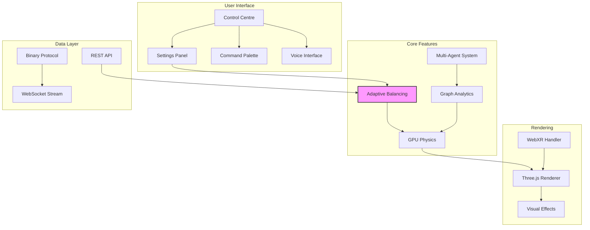

# Features Documentation

VisionFlow provides a comprehensive set of features for visualising and interacting with knowledge graphs and AI multi-agent systems. This section details each major feature and how to use it effectively.

## Core Features

### 🎯 Visualisation Features

#### [⚖️ Adaptive Balancing](adaptive-balancing.md)
Intelligent auto-tuning system that automatically adjusts physics parameters to maintain stable graph visualisation. Features multi-metric stability detection, smooth parameter transitions, and real-time feedback.

#### [🌐 WebXR Support](../client/xr-integration.md)
Immersive VR/AR visualisation capabilities with Quest 3 integration, enabling spatial interaction with knowledge graphs in three-dimensional space.

#### [🎨 Visual Effects](visual-effects.md)
Advanced rendering features including bloom effects, holographic nodes, edge flow animations, and customisable visual themes.

### 🤖 AI Integration

#### [Multi-Agent Visualisation](agent-orchestration.md)
Real-time visualisation of AI agent networks with Claude Flow MCP integration, showing agent relationships, token usage, and task execution flow.

#### [🔊 Voice Interaction](../voice-system.md)
Natural language interface for graph manipulation, supporting voice commands for navigation, search, and modification operations.

### 📊 Analytics & Performance

#### [GPU-Accelerated Analytics](analytics.md)
High-performance clustering, anomaly detection, and graph metrics computation using CUDA acceleration.

#### [Real-time Streaming](streaming.md)
Binary WebSocket protocol providing 85% bandwidth reduction with sub-millisecond latency for 60 FPS position updates.

## Feature Comparison

| Feature | Free Tier | Pro Tier | Enterprise |
|---------|-----------|----------|------------|
| **Graph Visualisation** | ✅ Up to 1000 nodes | ✅ Up to 10,000 nodes | ✅ Unlimited |
| **Adaptive Balancing** | ✅ Basic | ✅ Advanced | ✅ Custom strategies |
| **GPU Acceleration** | ✅ Single GPU | ✅ Multi-GPU | ✅ Cluster support |
| **WebXR Support** | ❌ | ✅ | ✅ |
| **Voice Commands** | ❌ | ✅ | ✅ |
| **AI Agent Integration** | ✅ Basic | ✅ Full | ✅ Custom agents |
| **Analytics** | ✅ Basic metrics | ✅ Advanced | ✅ Custom algorithms |
| **API Access** | ✅ Rate limited | ✅ Standard | ✅ Unlimited |

## Feature Architecture



## Feature Interactions

### Adaptive Balancing + GPU Physics
The Adaptive Balancing system works in tandem with the GPU physics engine to:
- Monitor real-time position updates from CUDA kernels
- Adjust force parameters that are applied in the next GPU computation cycle
- Ensure smooth transitions that don't destabilise the physics simulation

### Multi-Agent + Graph Visualisation
AI agents are visualised as a secondary graph layer that:
- Shares the same rendering pipeline but with distinct visual styling
- Can be toggled independently from the knowledge graph
- Shows real-time token usage and task execution

### WebXR + Voice Commands
In VR/AR mode, voice commands provide hands-free interaction:
- "Show connections for node X"
- "Zoom to cluster Y"
- "Enable adaptive balancing"

## Performance Considerations

### Feature Performance Impact

| Feature | CPU Impact | GPU Impact | Memory | Network |
|---------|------------|------------|---------|---------|
| **Adaptive Balancing** | Low (2%) | None | 10KB | 200B/s |
| **GPU Physics** | Low | High | 100MB+ | None |
| **WebXR Rendering** | Medium | High | 200MB+ | None |
| **Voice Processing** | Medium | None | 50MB | 1KB/s |
| **Multi-Agent Vis** | Low | Low | 20MB | 5KB/s |
| **Visual Effects** | Low | Medium | 50MB | None |

### Recommended Feature Combinations

#### For Best Performance
- GPU Physics + Binary Protocol
- Adaptive Balancing + Minimal Visual Effects
- Single Graph Layer

#### For Best Visual Quality
- All Visual Effects Enabled
- WebXR Mode
- High-Resolution Textures

#### For AI Development
- Multi-Agent Visualisation
- Voice Commands
- Real-time Metrics

## Feature Roadmap

### Q1 2024
- ✅ Adaptive Balancing System
- ✅ Kinetic Energy Monitoring
- ✅ Toast Notifications
- 🔄 Machine Learning Integration

### Q2 2024
- 📋 Collaborative Editing
- 📋 Graph Versioning
- 📋 Custom Shaders
- 📋 Mobile Support

### Q3 2024
- 📋 Distributed Rendering
- 📋 Cloud Sync
- 📋 Plugin System
- 📋 Advanced Analytics

### Q4 2024
- 📋 AI-Powered Layout
- 📋 Predictive Physics
- 📋 Natural Language Queries
- 📋 Enterprise Features

## Getting Started with Features

1. **Enable GPU Acceleration**
   ```yaml
   gpu:
     enabled: true
     device_id: 0
   ```

2. **Configure Adaptive Balancing**
   ```yaml
   physics:
     auto_balance: true
     auto_balance_interval_ms: 500
   ```

3. **Set Up Visual Effects**
   ```yaml
   visualisation:
     bloom:
       enabled: true
       strength: 0.5
   ```

4. **Activate Voice Commands**
   ```yaml
   voice:
     enabled: true
     language: en-GB
   ```

## Feature Support

For feature-specific issues or questions:
- Check the individual feature documentation
- Review the [Troubleshooting Guide](../reference/troubleshooting.md)
- Search [GitHub Issues](https://github.com/visionflow/visionflow/issues)
- Join our [Discord community](https://discord.gg/visionflow)

---

[← Back to Documentation](../README.md) | [Adaptive Balancing →](adaptive-balancing.md)