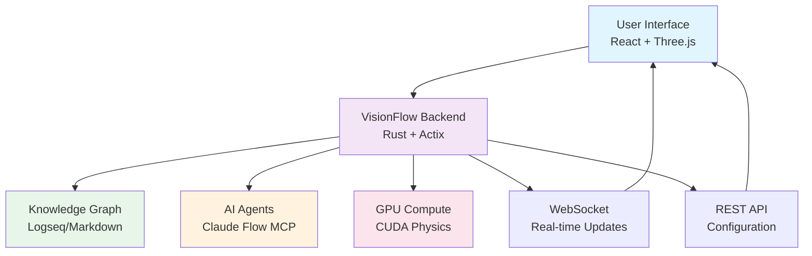

# Getting Started with VisionFlow

*[Getting-Started](../index.md)*

Welcome to VisionFlow, a cutting-edge platform for real-time visualisation of AI multi-agent systems and knowledge graphs. This comprehensive guide will help you get up and running quickly whilst providing the depth needed for advanced configurations.

## What is VisionFlow?

VisionFlow is a high-performance, GPU-accelerated platform that combines:

- **Real-Time 3D Visualisation**: Stunning visualisation of knowledge graphs and AI agent networks
- **Multi-Agent Orchestration**: Direct TCP integration with Claude Flow MCP for agent coordination
- **Knowledge Graph Integration**: Seamless synchronisation with Logseq graphs via GitHub
- **Advanced Analytics**: AI-powered clustering, anomaly detection, and intelligent insights
- **XR/AR Support**: Immersive experiences with Quest 3 integration
- **High Performance**: Rust backend with CUDA acceleration for demanding workloads

## Who Should Use VisionFlow?

### Developers and Engineers
- **AI Researchers**: Visualise multi-agent interactions and behaviours
- **Software Engineers**: Debug and optimise distributed systems
- **Data Scientists**: Explore knowledge graphs and analyse patterns
- **System Architects**: Design and monitor complex system interactions

### Organisations
- **Startups**: Rapid prototyping with AI-assisted development
- **Enterprises**: Large-scale system visualisation and monitoring
- **Educational Institutions**: Teaching distributed systems and AI concepts
- **Research Labs**: Advanced AI system development and analysis

## Quick Navigation

| Documentation | Description | Time Required |
|---------------|-------------|---------------|
| **[Installation](installation.md)** | Complete setup guide with Docker and prerequisites | 15-30 minutes |
| **[Quick Start](quickstart.md)** | 5-minute guide to your first graph visualisation | 5 minutes |
| **[Configuration](configuration.md)** | Environment variables and advanced settings | 10-15 minutes |

## Learning Path

### Beginner (First Time Users)
1. **[Check Prerequisites](installation.md#prerequisites)** - Ensure your system is ready
2. **[Install VisionFlow](installation.md#installation-steps)** - Get everything running
3. **[Create Your First Graph](quickstart.md)** - See immediate results
4. **[Basic Configuration](configuration.md#basic-configuration)** - Customise for your needs

### Intermediate (Existing Users)
1. **[Advanced Installation](installation.md#advanced-installation)** - GPU acceleration and optimisation
2. **[Multi-Agent Setup](quickstart.md#multi-agent-workflows)** - Deploy intelligent agent systems
3. **[Custom Configuration](configuration.md#advanced-configuration)** - Fine-tune performance
4. **[Integration Guide](../api/index.md)** - Connect with existing systems

### Advanced (Power Users)
1. **[Performance Optimisation](installation.md#performance-tuning)** - Maximum performance configuration
2. **[Custom Deployment](../deployment/index.md)** - Production environments
3. **[API Integration](../api/index.md)** - Programmatic control
4. **[Contributing](../contributing.md)** - Extend and improve VisionFlow

## System Overview

## Core Features

### 🎯 Knowledge Graph Visualisation
- **Logseq Integration**: Real-time synchronisation with your personal knowledge base
- **Markdown Processing**: Automatic conversion of markdown files to interactive graphs
- **Semantic Analysis**: AI-powered relationship detection and clustering
- **Interactive Navigation**: Intuitive 3D exploration with mouse and keyboard controls

### 🤖 Multi-Agent Systems
- **Agent Orchestration**: Deploy and coordinate intelligent AI agents
- **Real-time Monitoring**: Watch agent interactions and decision-making processes
- **Performance Analytics**: Track efficiency, resource usage, and task completion
- **Collaborative Workflows**: Agents working together on complex problems

### ⚡ High Performance
- **GPU Acceleration**: CUDA-powered physics simulation and rendering
- **Binary Protocol**: Optimised WebSocket communication for minimal latency
- **Actor Model**: Concurrent processing with Rust's Actix framework
- **Efficient Rendering**: Three.js optimisations for smooth 60fps visualisation

### 🔧 Extensibility
- **REST API**: Full programmatic control and integration
- **Plugin Architecture**: Extend functionality with custom components
- **Configuration**: Comprehensive settings for every aspect of the system
- **Docker Deployment**: Consistent environments across development and production

## Quick Start Preview

Here's what you can achieve in just 5 minutes:

1. **Start VisionFlow**: `docker-compose up` (2 minutes)
2. **Open Browser**: Navigate to `http://localhost:3001` (30 seconds)
3. **Load Sample Data**: Click "Load Demo Graph" (1 minute)
4. **Explore**: Use mouse to navigate your first 3D knowledge graph (1.5 minutes)

## Supported Platforms

### Operating Systems
- **Linux**: Ubuntu 20.04+, CentOS 8+, Debian 11+
- **macOS**: 12.0+ (Monterey and later)
- **Windows**: 10/11 with WSL2 or Docker Desktop

### Hardware Requirements

| Component | Minimum | Recommended | Enterprise |
|-----------|---------|-------------|------------|
| **CPU** | 4 cores, 2.5GHz | 8 cores, 3.0GHz | 16+ cores, 3.5GHz |
| **Memory** | 8GB RAM | 16GB RAM | 32GB+ RAM |
| **Storage** | 10GB free | 50GB SSD | 200GB+ NVMe |
| **GPU** | Integrated | GTX 1060/RTX 3060 | RTX 4080+ |
| **Network** | 10Mbps | 100Mbps | 1Gbps+ |

### Browser Support
- **Chrome**: 90+ (Recommended)
- **Firefox**: 88+
- **Safari**: 14+
- **Edge**: 90+

**WebGL Required**: All browsers must support WebGL 2.0 for 3D visualisation

## Community and Support

### Getting Help
- **[Documentation Hub](../index.md)**: Comprehensive guides and references
- **[Troubleshooting](../troubleshooting.md)**: Common issues and solutions
- **[GitHub Issues](https://github.com/visionflow/visionflow/issues)**: Bug reports and feature requests
- **[Discord Community](https://discord.gg/visionflow)**: Real-time community support

### Contributing
- **[Contributing Guide](../contributing.md)**: How to contribute code and documentation
- **[Development Setup](../development/setup.md)**: Set up local development environment
- **[Code Style](../development/standards.md)**: Coding standards and best practices

### Stay Updated
- **[Release Notes](../releases/index.md)**: Latest features and improvements
- **[Roadmap](../roadmap.md)**: Upcoming features and timeline
- **[Blog](https://blog.visionflow.ai)**: Technical articles and case studies

## Next Steps

Choose your path based on your immediate needs:

### 🚀 I want to start immediately
**Go to [Quick Start Guide](quickstart.md)** - Get VisionFlow running in 5 minutes with minimal setup.

### 🔧 I want to understand the setup
**Go to [Installation Guide](installation.md)** - Comprehensive installation with all options and prerequisites.

### ⚙️ I want to customise everything
**Go to [Configuration Guide](configuration.md)** - Deep dive into all configuration options and environment variables.

### 📚 I want the complete picture
**Go to [Architecture Overview](../architecture/system-overview.md)** - Understand how VisionFlow works under the hood.

---

**Ready to visualise the future of AI and knowledge?** Choose your path above and let's get started!
## Documents

- [Configuration Guide](./configuration.md)
- [Installation Guide](./installation.md)
- [Quick Start Guide](./quickstart.md)

## Related Topics

- [Configuration Guide](configuration.md)
- [Getting Started with VisionFlow](quickstart.md)
- [Installation Guide](installation.md)
- [Quick Start Guide](quickstart.md)
