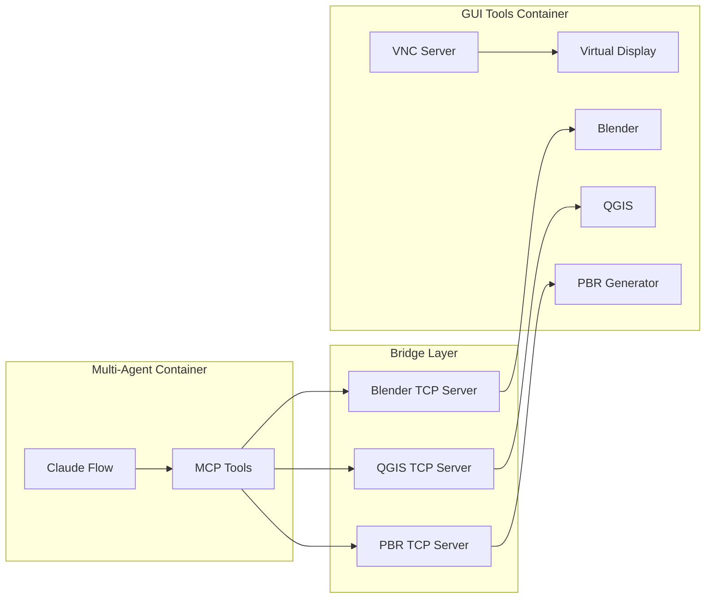

# Using the GUI Sandbox

*[← Back to Guides](index.md)*

This guide covers how to use the GUI sandbox environment with MCP (Model Context Protocol) tools for 3D modeling, geospatial analysis, image processing, and more.

## Table of Contents

1. [GUI Sandbox Overview](#gui-sandbox-overview)
2. [MCP Tool Ecosystem](#mcp-tool-ecosystem)
3. [Blender Integration](#blender-integration)
4. [QGIS Integration](#qgis-integration)
5. [ImageMagick Tools](#imagemagick-tools)
6. [PBR Texture Generation](#pbr-texture-generation)
7. [Electronic Design Tools](#electronic-design-tools)
8. [Creating Custom Tools](#creating-custom-tools)
9. [Best Practices](#best-practices)

## GUI Sandbox Overview

The GUI sandbox provides a containerized environment where AI agents can interact with professional GUI applications through the MCP protocol.

### Architecture



### Accessing the GUI Environment

1. **VNC Connection**
```bash
# Start GUI tools container
docker-compose up -d gui-tools-service

# Connect via VNC client
vncviewer localhost:5901
# Password: vncpassword
```

2. **Web VNC Access**
```bash
# Alternative: Use noVNC web interface
open http://localhost:6080
```

3. **Verify Services**
```bash
# Check running services
docker exec gui-tools-container ps aux | grep -E "Xvfb|blender|qgis"

# Test TCP servers
telnet localhost 9876  # Blender
telnet localhost 9877  # QGIS
telnet localhost 9878  # PBR Generator
```

## MCP Tool Ecosystem

### Available Tools

| Tool | Type | Port | Purpose |
|------|------|------|---------|
| `blender-mcp` | Bridge | 9876 | 3D modeling and rendering |
| `qgis-mcp` | Bridge | 9877 | Geospatial analysis |
| `pbr-generator-mcp` | Bridge | 9878 | PBR texture generation |
| `imagemagick-mcp` | Direct | - | Image processing |
| `kicad-mcp` | Direct | - | PCB design |
| `ngspice-mcp` | Direct | - | Circuit simulation |

### Tool Discovery

```bash
# List all available tools
docker exec multi-agent-container ./mcp-helper.sh list-tools

# Get tool details
docker exec multi-agent-container ./mcp-helper.sh describe-tool blender-mcp

# Test all tools
docker exec multi-agent-container ./mcp-helper.sh test-all
```

### Using MCP Helper

The MCP helper script simplifies tool interaction:

```bash
# Basic tool execution
./mcp-helper.sh run-tool <tool-name> '<json-params>'

# Example: Create an image
./mcp-helper.sh run-tool imagemagick-mcp '{
  "tool": "create",
  "params": {
    "width": 512,
    "height": 512,
    "color": "blue",
    "output": "blue_square.png"
  }
}'
```

## Blender Integration

### Blender MCP Capabilities

The Blender MCP tool provides programmatic access to Blender's full 3D capabilities:

1. **Scene Management**
```bash
# Get current scene information
./mcp-helper.sh run-tool blender-mcp '{
  "tool": "get_scene_info"
}'

# Clear scene
./mcp-helper.sh run-tool blender-mcp '{
  "tool": "execute_code",
  "params": {
    "code": "import bpy; bpy.ops.wm.read_factory_settings(use_empty=True)"
  }
}'
```

2. **Object Creation**
```bash
# Create a cube
./mcp-helper.sh run-tool blender-mcp '{
  "tool": "execute_code",
  "params": {
    "code": "import bpy; bpy.ops.mesh.primitive_cube_add(size=2, location=(0, 0, 1))"
  }
}'

# Create a complex scene
./mcp-helper.sh run-tool blender-mcp '{
  "tool": "execute_code",
  "params": {
    "code": "
import bpy
# Clear scene
bpy.ops.object.select_all(action=\"SELECT\")
bpy.ops.object.delete()

# Add ground plane
bpy.ops.mesh.primitive_plane_add(size=10, location=(0, 0, 0))

# Add sphere
bpy.ops.mesh.primitive_uv_sphere_add(location=(0, 0, 1))

# Add light
bpy.ops.object.light_add(type=\"SUN\", location=(5, 5, 10))

# Add camera
bpy.ops.object.camera_add(location=(7, -7, 5))
cam = bpy.context.object
cam.rotation_euler = (1.1, 0, 0.785)
    "
  }
}'
```

3. **Material and Texturing**
```bash
# Apply material
./mcp-helper.sh run-tool blender-mcp '{
  "tool": "execute_code",
  "params": {
    "code": "
import bpy
obj = bpy.context.active_object
mat = bpy.data.materials.new(name=\"Gold\")
mat.use_nodes = True
bsdf = mat.node_tree.nodes[\"Principled BSDF\"]
bsdf.inputs[0].default_value = (1.0, 0.766, 0.336, 1.0)  # Base Color
bsdf.inputs[4].default_value = 1.0  # Metallic
bsdf.inputs[7].default_value = 0.1  # Roughness
obj.data.materials.append(mat)
    "
  }
}'
```

4. **Rendering**
```bash
# Render current view
./mcp-helper.sh run-tool blender-mcp '{
  "tool": "get_viewport_screenshot",
  "params": {
    "filepath": "/workspace/renders/viewport.png"
  }
}'

# Full render
./mcp-helper.sh run-tool blender-mcp '{
  "tool": "execute_code",
  "params": {
    "code": "
import bpy
bpy.context.scene.render.filepath = \"/workspace/renders/final.png\"
bpy.context.scene.render.resolution_x = 1920
bpy.context.scene.render.resolution_y = 1080
bpy.ops.render.render(write_still=True)
    "
  }
}'
```

### Advanced Blender Features

1. **PolyHaven Asset Integration**
```bash
# Download and import HDR environment
./mcp-helper.sh run-tool blender-mcp '{
  "tool": "download_polyhaven_asset",
  "params": {
    "asset_name": "studio_small_03",
    "asset_type": "hdri",
    "resolution": "1k"
  }
}'

# Import 3D model
./mcp-helper.sh run-tool blender-mcp '{
  "tool": "download_polyhaven_asset",
  "params": {
    "asset_name": "food_apple_01",
    "asset_type": "model"
  }
}'
```

2. **Geometry Nodes**
```bash
./mcp-helper.sh run-tool blender-mcp '{
  "tool": "execute_code",
  "params": {
    "code": "
import bpy
# Create object with geometry nodes
bpy.ops.mesh.primitive_grid_add()
obj = bpy.context.object

# Add geometry nodes modifier
modifier = obj.modifiers.new(\"GeometryNodes\", \"NODES\")
node_group = bpy.data.node_groups.new(\"Scatter\", \"GeometryNodeTree\")
modifier.node_group = node_group

# Set up basic scatter system
nodes = node_group.nodes
input_node = nodes.new(\"NodeGroupInput\")
output_node = nodes.new(\"NodeGroupOutput\")
distribute_node = nodes.new(\"GeometryNodeDistributePointsOnFaces\")

# Connect nodes
node_group.links.new(input_node.outputs[0], distribute_node.inputs[0])
node_group.links.new(distribute_node.outputs[0], output_node.inputs[0])
    "
  }
}'
```

## QGIS Integration

### QGIS MCP Capabilities

QGIS MCP enables geospatial analysis and map creation:

1. **Loading Spatial Data**
```bash
# Load shapefile
./mcp-helper.sh run-tool qgis-mcp '{
  "tool": "load_layer",
  "params": {
    "path": "/workspace/data/countries.shp",
    "name": "World Countries"
  }
}'

# Load GeoJSON
./mcp-helper.sh run-tool qgis-mcp '{
  "tool": "load_layer",
  "params": {
    "path": "/workspace/data/cities.geojson",
    "name": "Major Cities"
  }
}'
```

2. **Spatial Analysis**
```bash
# Buffer analysis
./mcp-helper.sh run-tool qgis-mcp '{
  "tool": "execute_algorithm",
  "params": {
    "algorithm": "native:buffer",
    "parameters": {
      "INPUT": "cities",
      "DISTANCE": 10000,
      "OUTPUT": "/workspace/output/city_buffers.shp"
    }
  }
}'

# Intersection analysis
./mcp-helper.sh run-tool qgis-mcp '{
  "tool": "execute_algorithm",
  "params": {
    "algorithm": "native:intersection",
    "parameters": {
      "INPUT": "layer1",
      "OVERLAY": "layer2",
      "OUTPUT": "/workspace/output/intersection.shp"
    }
  }
}'
```

3. **Map Styling**
```bash
# Apply style to layer
./mcp-helper.sh run-tool qgis-mcp '{
  "tool": "style_layer",
  "params": {
    "layer_name": "countries",
    "style": {
      "fill_color": "#3498db",
      "stroke_color": "#2c3e50",
      "stroke_width": 0.5
    }
  }
}'
```

4. **Map Export**
```bash
# Export map as image
./mcp-helper.sh run-tool qgis-mcp '{
  "tool": "export_map",
  "params": {
    "output_path": "/workspace/maps/world_map.png",
    "width": 1920,
    "height": 1080,
    "dpi": 300
  }
}'
```

## ImageMagick Tools

### Direct Image Processing

ImageMagick MCP provides powerful image manipulation:

1. **Basic Operations**
```bash
# Create solid color image
./mcp-helper.sh run-tool imagemagick-mcp '{
  "tool": "create",
  "params": {
    "width": 800,
    "height": 600,
    "color": "#FF5733",
    "output": "orange_bg.png"
  }
}'

# Resize image
./mcp-helper.sh run-tool imagemagick-mcp '{
  "tool": "convert",
  "params": {
    "args": ["input.jpg", "-resize", "50%", "output.jpg"]
  }
}'
```

2. **Advanced Processing**
```bash
# Apply blur effect
./mcp-helper.sh run-tool imagemagick-mcp '{
  "tool": "convert",
  "params": {
    "args": ["input.jpg", "-blur", "0x8", "blurred.jpg"]
  }
}'

# Create gradient
./mcp-helper.sh run-tool imagemagick-mcp '{
  "tool": "convert",
  "params": {
    "args": ["-size", "800x600", "gradient:blue-red", "gradient.png"]
  }
}'

# Composite images
./mcp-helper.sh run-tool imagemagick-mcp '{
  "tool": "convert",
  "params": {
    "args": ["background.png", "overlay.png", "-composite", "result.png"]
  }
}'
```

3. **Text and Annotations**
```bash
# Add text to image
./mcp-helper.sh run-tool imagemagick-mcp '{
  "tool": "convert",
  "params": {
    "args": [
      "input.jpg",
      "-pointsize", "72",
      "-fill", "white",
      "-annotate", "+100+100", "Hello World",
      "annotated.jpg"
    ]
  }
}'
```

## PBR Texture Generation

### Creating Material Textures

The PBR Generator creates physically-based rendering textures:

1. **Basic Material Generation**
```bash
# Generate wood textures
./mcp-helper.sh run-tool pbr-generator-mcp '{
  "tool": "generate_material",
  "params": {
    "material": "wood",
    "resolution": "2048x2048",
    "types": ["diffuse", "normal", "roughness", "ao"],
    "output": "/workspace/textures/wood"
  }
}'

# Generate metal textures
./mcp-helper.sh run-tool pbr-generator-mcp '{
  "tool": "generate_material",
  "params": {
    "material": "metal",
    "resolution": "1024x1024",
    "types": ["diffuse", "normal", "metallic", "roughness"],
    "output": "/workspace/textures/metal"
  }
}'
```

2. **Available Materials**
- `wood` - Various wood patterns
- `metal` - Metallic surfaces
- `stone` - Rock and stone textures
- `fabric` - Cloth materials
- `leather` - Leather textures
- `concrete` - Concrete surfaces
- `brick` - Brick patterns
- `tiles` - Tile layouts

3. **Integration with Blender**
```bash
# Generate PBR textures
./mcp-helper.sh run-tool pbr-generator-mcp '{
  "tool": "generate_material",
  "params": {
    "material": "stone",
    "resolution": "2048x2048",
    "types": ["diffuse", "normal", "roughness"],
    "output": "/workspace/textures/stone"
  }
}'

# Apply to Blender object
./mcp-helper.sh run-tool blender-mcp '{
  "tool": "execute_code",
  "params": {
    "code": "
import bpy
obj = bpy.context.active_object
mat = bpy.data.materials.new(name=\"Stone\")
mat.use_nodes = True

# Get principled BSDF
bsdf = mat.node_tree.nodes[\"Principled BSDF\"]
nodes = mat.node_tree.nodes
links = mat.node_tree.links

# Load textures
diffuse_tex = nodes.new(\"ShaderNodeTexImage\")
diffuse_tex.image = bpy.data.images.load(\"/workspace/textures/stone/diffuse.png\")
links.new(diffuse_tex.outputs[0], bsdf.inputs[0])

normal_tex = nodes.new(\"ShaderNodeTexImage\")
normal_tex.image = bpy.data.images.load(\"/workspace/textures/stone/normal.png\")
normal_map = nodes.new(\"ShaderNodeNormalMap\")
links.new(normal_tex.outputs[0], normal_map.inputs[1])
links.new(normal_map.outputs[0], bsdf.inputs[20])

roughness_tex = nodes.new(\"ShaderNodeTexImage\")
roughness_tex.image = bpy.data.images.load(\"/workspace/textures/stone/roughness.png\")
links.new(roughness_tex.outputs[0], bsdf.inputs[7])

obj.data.materials.append(mat)
    "
  }
}'
```

## Electronic Design Tools

### KiCad Integration

1. **Project Management**
```bash
# Create new PCB project
./mcp-helper.sh run-tool kicad-mcp '{
  "method": "create_project",
  "params": {
    "project_name": "arduino_shield",
    "project_dir": "/workspace/pcb"
  }
}'

# Export Gerber files
./mcp-helper.sh run-tool kicad-mcp '{
  "method": "export_gerbers",
  "params": {
    "pcb_file": "/workspace/pcb/arduino_shield/arduino_shield.kicad_pcb",
    "output_dir": "/workspace/pcb/gerbers"
  }
}'
```

### NGSpice Circuit Simulation

1. **Basic Circuit Simulation**
```bash
# Simulate RC circuit
./mcp-helper.sh run-tool ngspice-mcp '{
  "method": "run_simulation",
  "params": {
    "netlist": "
* RC Circuit
V1 vin 0 DC 5
R1 vin vout 1k
C1 vout 0 1u
.tran 0.1m 10m
.control
run
plot v(vout)
.endc
.end
    "
  }
}'
```

2. **Complex Circuit Analysis**
```bash
# Op-amp circuit simulation
./mcp-helper.sh run-tool ngspice-mcp '{
  "method": "run_simulation",
  "params": {
    "netlist": "
* Op-Amp Inverting Amplifier
.include opamp.lib
V1 vin 0 AC 1 SIN(0 1 1k)
R1 vin n1 10k
R2 n1 vout 100k
X1 0 n1 vcc vee vout OPAMP
Vcc vcc 0 15
Vee vee 0 -15
.ac dec 10 1 100k
.tran 0.01m 5m
.control
run
plot v(vout) v(vin)
.endc
.end
    "
  }
}'
```

## Creating Custom Tools

### MCP Tool Structure

1. **Python-based Tool Template**
```python
#!/usr/bin/env python3
import sys
import json
import logging

class CustomMCPTool:
    def __init__(self):
        self.logger = logging.getLogger(__name__)
        
    def process_request(self, request):
        """Process incoming MCP request."""
        try:
            method = request.get('method', 'default')
            params = request.get('params', {})
            
            # Route to appropriate handler
            if method == 'process_data':
                return self.process_data(params)
            elif method == 'analyze':
                return self.analyze(params)
            else:
                return {'error': f'Unknown method: {method}'}
                
        except Exception as e:
            self.logger.error(f"Error processing request: {e}")
            return {'error': str(e)}
    
    def process_data(self, params):
        """Custom data processing logic."""
        data = params.get('data', [])
        # Your processing logic here
        result = {'processed': len(data), 'status': 'success'}
        return {'result': result}
    
    def analyze(self, params):
        """Custom analysis logic."""
        # Your analysis logic here
        return {'result': 'Analysis complete'}

def main():
    tool = CustomMCPTool()
    
    # Read from stdin, write to stdout
    for line in sys.stdin:
        try:
            request = json.loads(line.strip())
            response = tool.process_request(request)
            print(json.dumps(response), flush=True)
        except Exception as e:
            error_response = {'error': str(e)}
            print(json.dumps(error_response), flush=True)

if __name__ == '__main__':
    main()
```

2. **Register Tool in MCP Configuration**
```json
// Add to .mcp.json
{
  "tools": {
    "custom-tool": {
      "command": "python3",
      "args": ["-u", "./mcp-tools/custom_tool.py"],
      "description": "Custom MCP tool for specialized processing"
    }
  }
}
```

3. **Test Custom Tool**
```bash
# Direct test
echo '{"method": "process_data", "params": {"data": [1, 2, 3]}}' | python3 mcp-tools/custom_tool.py

# Test via MCP helper
./mcp-helper.sh run-tool custom-tool '{
  "method": "analyze",
  "params": {"input": "test data"}
}'
```

## Best Practices

### 1. Resource Management

```bash
# Monitor resource usage
docker stats gui-tools-container

# Clean up temporary files
docker exec gui-tools-container find /tmp -type f -mtime +1 -delete

# Limit memory usage
docker update --memory="4g" gui-tools-container
```

### 2. Error Handling

```python
# Robust error handling in tools
try:
    result = perform_operation(params)
    return {'result': result}
except ValidationError as e:
    return {'error': f'Invalid parameters: {e}'}
except ResourceError as e:
    return {'error': f'Resource unavailable: {e}'}
except Exception as e:
    logger.error(f"Unexpected error: {e}", exc_info=True)
    return {'error': 'Internal error occurred'}
```

### 3. Performance Optimization

```bash
# Batch operations
./mcp-helper.sh run-tool blender-mcp '{
  "tool": "execute_code",
  "params": {
    "code": "
import bpy
# Batch create objects
objects = []
for i in range(100):
    bpy.ops.mesh.primitive_cube_add(location=(i*3, 0, 0))
    objects.append(bpy.context.object)
    
# Batch apply materials
mat = bpy.data.materials.new(\"SharedMaterial\")
for obj in objects:
    obj.data.materials.append(mat)
    "
  }
}'
```

### 4. Security Considerations

- Validate all input parameters
- Sanitize file paths
- Limit resource consumption
- Use temporary directories for intermediate files
- Clean up after operations

### 5. Debugging Tips

```bash
# Enable debug logging
DEBUG=1 ./mcp-helper.sh run-tool blender-mcp '{"tool": "get_scene_info"}'

# Check tool logs
docker exec multi-agent-container tail -f /app/mcp-logs/*.log

# Interactive debugging
docker exec -it multi-agent-container bash
python3 -i mcp-tools/custom_tool.py
```

## Troubleshooting

### Common Issues

1. **Connection Refused**
```bash
# Check if services are running
docker exec gui-tools-container ps aux | grep -E "Xvfb|blender|qgis"

# Restart services
docker-compose restart gui-tools-service
```

2. **Tool Not Found**
```bash
# Refresh tool configuration
docker exec multi-agent-container /app/setup-workspace.sh --force

# Verify tool registration
docker exec multi-agent-container cat .mcp.json | jq '.tools'
```

3. **Rendering Issues**
```bash
# Check virtual display
docker exec gui-tools-container bash -c "DISPLAY=:99 xdpyinfo"

# Restart X server
docker exec gui-tools-container supervisorctl restart x11vnc
```

## Next Steps

- Continue to [Orchestrating Agents](04-orchestrating-agents.md) for agent management
- See [Extending the System](05-extending-the-system.md) for customization
- Check [Troubleshooting](06-troubleshooting.md) for more solutions

---

*[← Development Workflow](02-development-workflow.md) | [Back to Guides](index.md) | [Orchestrating Agents →](04-orchestrating-agents.md)*