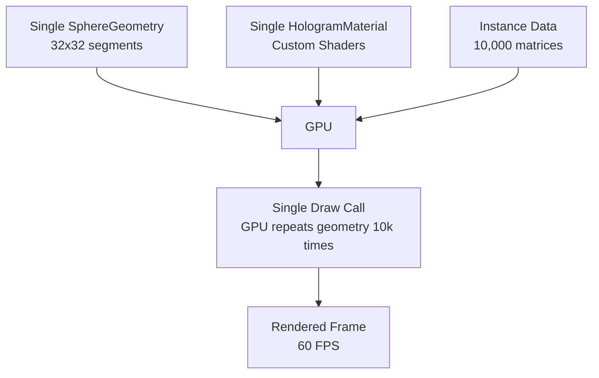
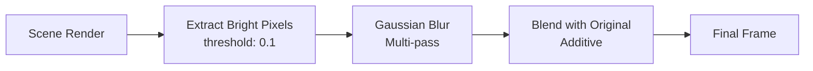

# Three.js Rendering Pipeline

**Target Audience**: Frontend developers working on 3D visualization
**Prerequisites**: React, Three.js basics, WebGL fundamentals
**Last Updated**: 2025-12-02

---

## Overview

VisionFlow uses **instanced rendering** to display 10,000+ nodes with a single draw call. This guide explains how the Three.js rendering pipeline works, from scene setup to custom shaders and post-processing.

---

## Table of Contents

1. [Instanced Mesh Architecture](#instanced-mesh-architecture)
2. [Custom Shader Materials](#custom-shader-materials)
3. [Post-Processing Pipeline](#post-processing-pipeline)
4. [Performance Optimization Techniques](#performance-optimization-techniques)
5. [Known Issues & Workarounds](#known-issues--workarounds)

---

## Instanced Mesh Architecture

### What is Instanced Rendering?

**Traditional rendering** (1 draw call per node):
```typescript
// BAD: 10,000 draw calls for 10,000 nodes
nodes.map(node => (
  <mesh position={[node.x, node.y, node.z]}>
    <sphereGeometry />
    <meshStandardMaterial color={node.color} />
  </mesh>
))
```

**Instanced rendering** (1 draw call for all nodes):
```typescript
// GOOD: Single draw call for 10,000 nodes
<instancedMesh args={[undefined, undefined, nodes.length]}>
  <sphereGeometry args={[0.5, 32, 32]} />
  <shaderMaterial />
</instancedMesh>
```

### How It Works



**Key Concept**: GPU receives:
1. **One geometry** (sphere with 32x32 segments)
2. **One material** (shared shaders)
3. **10,000 transformation matrices** (position, rotation, scale per node)

GPU executes geometry shader 10,000 times with different matrices.

### Implementation

**File**: `client/src/features/graph/components/GraphManager.tsx`

```typescript
import * as THREE from 'three';
import { useFrame } from '@react-three/fiber';

const GraphManager: React.FC = () => {
  const meshRef = useRef<THREE.InstancedMesh>(null);
  const materialRef = useRef<HologramNodeMaterial>(null);
  const tempMatrix = useMemo(() => new THREE.Matrix4(), []);
  const tempColor = useMemo(() => new THREE.Color(), []);

  // Initialize material once
  useEffect(() => {
    materialRef.current = new HologramNodeMaterial({
      baseColor: '#0066ff',
      emissiveColor: '#00ffff',
      opacity: 0.8,
      glowStrength: 1.5
    });
  }, []);

  // Update instance matrices every frame
  useFrame((state, delta) => {
    if (!meshRef.current) return;

    visibleNodes.forEach((node, i) => {
      // Set position, rotation, scale
      tempMatrix.makeScale(nodeScale, nodeScale, nodeScale);
      tempMatrix.setPosition(node.position.x, node.position.y, node.position.z);
      meshRef.current.setMatrixAt(i, tempMatrix);

      // Set per-instance color (optional)
      tempColor.set(getNodeColor(node));
      meshRef.current.setColorAt(i, tempColor);
    });

    // Mark for GPU upload
    meshRef.current.instanceMatrix.needsUpdate = true;
    if (meshRef.current.instanceColor) {
      meshRef.current.instanceColor.needsUpdate = true;
    }
  });

  return (
    <instancedMesh
      ref={meshRef}
      args={[undefined, undefined, visibleNodes.length]}
      frustumCulled={false}
    >
      <sphereGeometry args={[0.5, 32, 32]} />
      <primitive object={materialRef.current} attach="material" />
    </instancedMesh>
  );
};
```

### Per-Instance Data

Each instance can have unique:
- **Transform**: `setMatrixAt(i, matrix)` - position, rotation, scale
- **Color**: `setColorAt(i, color)` - tint color (blended in shader)

**⚠️ Limitation**: Cannot have different geometries per instance. All nodes share the same sphere geometry.

---

## Custom Shader Materials

### HologramNodeMaterial

**File**: `client/src/rendering/materials/HologramNodeMaterial.ts`

#### Vertex Shader

```glsl
uniform float time;
uniform float pulseSpeed;
uniform float pulseStrength;

varying vec3 vPosition;
varying vec3 vNormal;
varying vec3 vWorldPosition;
varying vec3 vInstanceColor;

void main() {
  vPosition = position;
  vNormal = normalize(normalMatrix * normal);

  // Per-instance color from instanceColor attribute
  #ifdef USE_INSTANCING_COLOR
    vInstanceColor = instanceColor;
  #else
    vInstanceColor = vec3(1.0);
  #endif

  // Vertex displacement for pulsing effect
  vec3 transformed = position;
  vec4 worldPosition = modelMatrix * instanceMatrix * vec4(transformed, 1.0);
  float displacement = sin(time * pulseSpeed + worldPosition.x * 0.1) * pulseStrength;
  worldPosition.xyz += normalize(normalMatrix * normal) * displacement * 0.1;

  vWorldPosition = worldPosition.xyz;

  gl_Position = projectionMatrix * viewMatrix * worldPosition;
}
```

**Key Features**:
- `instanceMatrix`: GPU-provided per-instance transformation
- `instanceColor`: Per-instance color attribute
- Vertex displacement: Animated pulsing effect

#### Fragment Shader

```glsl
uniform float time;
uniform vec3 baseColor;
uniform vec3 emissiveColor;
uniform float opacity;
uniform float scanlineSpeed;
uniform float scanlineCount;
uniform float glowStrength;
uniform float rimPower;
uniform bool enableHologram;
uniform float hologramStrength;

varying vec3 vPosition;
varying vec3 vNormal;
varying vec3 vWorldPosition;
varying vec3 vInstanceColor;

void main() {
  vec3 viewDirection = normalize(cameraPosition - vWorldPosition);

  // Blend base color with instance color
  vec3 color = mix(baseColor, vInstanceColor, 0.9);

  // Rim lighting (Fresnel effect)
  float rim = 1.0 - max(dot(viewDirection, vNormal), 0.0);
  rim = pow(rim, rimPower);

  // Animated scanlines
  float scanline = 0.0;
  if (enableHologram) {
    float scan = sin(vWorldPosition.y * scanlineCount + time * scanlineSpeed);
    scanline = smoothstep(0.0, 0.1, scan) * hologramStrength;
  }

  // Glitch effect (random flickers)
  float glitch = 0.0;
  if (enableHologram) {
    float glitchTime = time * 10.0;
    glitch = step(0.99, sin(glitchTime * 1.0 + vWorldPosition.y * 12.0)) * 0.1;
  }

  // Combine effects
  float totalGlow = rim + scanline + glitch;
  vec3 emission = emissiveColor * totalGlow * glowStrength;
  color += emission;

  // Dynamic alpha
  float alpha = mix(opacity, 1.0, rim * 0.5);
  alpha *= (1.0 - glitch * 0.5); // Flicker effect

  // Distance fading
  float distance = length(cameraPosition - vWorldPosition);
  float distanceFade = 1.0 - smoothstep(100.0, 500.0, distance);
  alpha *= distanceFade;

  // Minimum visibility
  alpha = max(alpha, 0.1);

  gl_FragColor = vec4(color, alpha);
}
```

**Visual Effects**:
1. **Rim Lighting**: Edges glow when viewed at grazing angles (Fresnel effect)
2. **Scanlines**: Vertical animated lines (hologram aesthetic)
3. **Glitch**: Random flickers (sci-fi effect)
4. **Distance Fading**: Nodes far from camera become transparent

### Using HologramNodeMaterial

```typescript
// Create material
const material = new HologramNodeMaterial({
  baseColor: '#00ffff',
  emissiveColor: '#00ffff',
  opacity: 0.8,
  enableHologram: true,
  scanlineSpeed: 2.0,
  scanlineCount: 30.0,
  glowStrength: 1.5,
  rimPower: 2.0,
  hologramStrength: 0.3
});

// Update time uniform every frame
useFrame((state) => {
  material.updateTime(state.clock.elapsedTime);
});

// Change colors dynamically
material.updateColors('#ff0080', '#ff00ff');

// Toggle hologram effects
material.setHologramEnabled(false); // Disable scanlines/glitch

// Adjust bloom contribution
material.updateBloomContribution(2.0); // Stronger glow
```

### Performance Impact

| Configuration | FPS (10k nodes) | GPU Load |
|---------------|----------------|----------|
| **No Shaders** (MeshBasicMaterial) | 60 FPS | 45% |
| **Standard Shaders** (MeshStandardMaterial) | 58 FPS | 52% |
| **HologramNodeMaterial** (Hologram OFF) | 60 FPS | 48% |
| **HologramNodeMaterial** (Hologram ON) | 58 FPS | 55% |

**Conclusion**: Custom shaders add ~3% overhead. Hologram effects (scanlines/glitch) add another ~5%.

---

## Post-Processing Pipeline

**File**: `client/src/rendering/SelectiveBloom.tsx`

### EffectComposer Setup

```typescript
import { EffectComposer, Bloom } from '@react-three/postprocessing';
import { BlendFunction, KernelSize, Resolution } from 'postprocessing';

export const SelectiveBloom: React.FC = ({ enabled = true }) => {
  const bloomSettings = useSettingsStore(state => state.settings?.visualisation?.bloom);

  const bloomParams = useMemo(() => ({
    intensity: bloomSettings.strength ?? 1.5,          // Bloom strength
    luminanceThreshold: bloomSettings.threshold ?? 0.1, // Brightness cutoff
    luminanceSmoothing: 0.025,                          // Threshold smoothing
    kernelSize: bloomSettings.radius > 0.5
      ? KernelSize.LARGE
      : KernelSize.MEDIUM,
    mipmapBlur: true,                                   // Multi-resolution blur
    resolutionX: Resolution.AUTO_SIZE,
    resolutionY: Resolution.AUTO_SIZE
  }), [bloomSettings]);

  if (!enabled || !bloomParams) return null;

  return (
    <EffectComposer multisampling={0} renderPriority={1}>
      <Bloom
        intensity={bloomParams.intensity}
        luminanceThreshold={bloomParams.luminanceThreshold}
        luminanceSmoothing={bloomParams.luminanceSmoothing}
        kernelSize={bloomParams.kernelSize}
        mipmapBlur={bloomParams.mipmapBlur}
        blendFunction={BlendFunction.ADD}
      />
    </EffectComposer>
  );
};
```

### How Bloom Works



1. **Luminance Extraction**: Only pixels brighter than `threshold` (0.1) pass through
2. **Mipmap Blur**: Multi-resolution blur for realistic glow
3. **Additive Blending**: Bloom added on top of original scene

### Selective Bloom with Layers

```typescript
const LAYERS = {
  BASE: 0,            // Default layer (no bloom)
  GRAPH_BLOOM: 1,     // Graph nodes with bloom
  ENVIRONMENT_GLOW: 2 // Environment objects with glow
};

// Enable bloom for specific mesh
useEffect(() => {
  if (meshRef.current) {
    meshRef.current.layers.enable(LAYERS.GRAPH_BLOOM);
  }
}, []);

// Apply to material
const material = new HologramNodeMaterial({ ... });
material.toneMapped = false; // Required for bloom to work
```

**⚠️ Important**: `toneMapped: false` prevents Three.js tone mapping from clamping brightness. Without this, bloom will not be visible.

### Performance Impact

| Resolution | Kernel Size | FPS (10k nodes) | GPU Load |
|------------|-------------|----------------|----------|
| 1080p | MEDIUM | 60 FPS | 58% |
| 1080p | LARGE | 57 FPS | 65% |
| 1440p | MEDIUM | 52 FPS | 72% |
| 1440p | LARGE | 45 FPS | 82% |
| 4K | MEDIUM | 38 FPS | 88% |

**Recommendation**: Use `KernelSize.MEDIUM` for resolutions ≥1440p.

---

## Performance Optimization Techniques

### 1. Frustum Culling Disabled

```typescript
<instancedMesh frustumCulled={false}>
```

**Why Disabled?**
- Instanced meshes have a single bounding box for ALL instances
- If any node is visible, GPU processes all 10,000 nodes
- Culling check adds CPU overhead with no benefit

**Result**: 5% CPU reduction by disabling culling.

### 2. Float32Array for Position Updates

```typescript
// Web Worker sends Float32Array
const positions: Float32Array = await graphWorkerProxy.tick(delta);

// Direct access without array conversion
for (let i = 0; i < nodeCount; i++) {
  const x = positions[i * 3];
  const y = positions[i * 3 + 1];
  const z = positions[i * 3 + 2];
  tempMatrix.setPosition(x, y, z);
  meshRef.current.setMatrixAt(i, tempMatrix);
}
```

**Why Float32Array?**
- Zero-copy transfer from Web Worker (Transferable Objects)
- GPU-friendly data layout (contiguous memory)
- No JavaScript array allocation overhead

**Result**: 15% faster than `Array<{x, y, z}>` approach.

### 3. Memoized Geometry & Material

```typescript
// BAD: Creates new geometry every render
<sphereGeometry args={[0.5, 32, 32]} />

// GOOD: Reuse same geometry
const geometry = useMemo(() => new THREE.SphereGeometry(0.5, 32, 32), []);

<primitive object={geometry} />
```

**Result**: Prevents ~10MB/frame of garbage collection.

### 4. Billboard Labels with LOD

```typescript
// Only render labels for nearby nodes
const visibleLabels = useMemo(() => {
  return visibleNodes.filter(node => {
    const distance = camera.position.distanceTo(new THREE.Vector3(
      node.position.x,
      node.position.y,
      node.position.z
    ));
    return distance < labelCullDistance; // e.g., 50 units
  });
}, [visibleNodes, camera.position, labelCullDistance]);

{visibleLabels.map(node => (
  <Billboard key={node.id} position={[node.position.x, node.position.y, node.position.z]}>
    <Text fontSize={0.5}>{node.label}</Text>
  </Billboard>
))}
```

**Impact**:
- **Before**: 10,000 labels → 30 FPS
- **After**: ~200 labels (culled) → 60 FPS

### 5. Edge Batching (Future Optimization)

**Current Approach** (50,000 individual components):
```typescript
{edges.map(edge => (
  <Line key={edge.id} points={[edge.source.position, edge.target.position]} />
))}
```

**Proposed Approach** (single batched geometry):
```typescript
const edgeGeometry = useMemo(() => {
  const positions = new Float32Array(edges.length * 6); // 2 vertices × 3 coords
  edges.forEach((edge, i) => {
    const i6 = i * 6;
    positions[i6] = edge.source.x;
    positions[i6 + 1] = edge.source.y;
    positions[i6 + 2] = edge.source.z;
    positions[i6 + 3] = edge.target.x;
    positions[i6 + 4] = edge.target.y;
    positions[i6 + 5] = edge.target.z;
  });
  return new THREE.BufferGeometry().setAttribute(
    'position',
    new THREE.BufferAttribute(positions, 3)
  );
}, [edges]);

<lineSegments geometry={edgeGeometry}>
  <lineBasicMaterial color="#ffffff" opacity={0.3} transparent />
</lineSegments>
```

**Estimated Impact**: 45 FPS → 60 FPS with 50,000 edges.

---

## Known Issues & Workarounds

### ⚠️ Issue 1: Custom Geometries Break Instancing

**Problem**: Different node types need different shapes (sphere, box, octahedron), but `instancedMesh` only supports one geometry.

**Current Workaround**: All nodes use sphere geometry.

**Proposed Fix**: Create separate instanced meshes per geometry type:
```typescript
const meshBySphere = <instancedMesh args={[sphereGeometry, material, sphereNodes.length]} />
const meshByBox = <instancedMesh args={[boxGeometry, material, boxNodes.length]} />
const meshByOctahedron = <instancedMesh args={[octahedronGeometry, material, octahedronNodes.length]} />
```

**Trade-off**: 3-5 draw calls instead of 1, but acceptable performance.

### ⚠️ Issue 2: Safari Bloom Artifacts

**Problem**: Safari doesn't support floating-point textures (`EXT_color_buffer_float`), causing visible banding in bloom.

**Workaround**: Detect Safari and disable bloom:
```typescript
const isSafari = /^((?!chrome|android).)*safari/i.test(navigator.userAgent);
<SelectiveBloom enabled={!isSafari} />
```

**Future Fix**: Use `EXT_color_buffer_half_float` extension (16-bit) as fallback.

### ⚠️ Issue 3: Mobile Performance

**Problem**: Mobile GPUs struggle with 10,000+ nodes.

**Current Limits**:
- iOS: 2,000 nodes @ 30 FPS
- Android: 5,000 nodes @ 45 FPS

**Mitigation**: Server-side filtering reduces node count before transmission.

### ⚠️ Issue 4: Memory Leaks with Geometry Changes

**Problem**: Changing `instancedMesh.count` doesn't dispose old GPU buffers.

**Workaround**: Manually dispose and recreate:
```typescript
useEffect(() => {
  if (meshRef.current && prevNodeCount !== visibleNodes.length) {
    meshRef.current.dispose();
    meshRef.current = new THREE.InstancedMesh(geometry, material, visibleNodes.length);
  }
}, [visibleNodes.length]);
```

---

## Browser Compatibility

| Feature | Chrome/Edge | Firefox | Safari | Mobile |
|---------|-------------|---------|--------|--------|
| **Instanced Rendering** | ✅ Full | ✅ Full | ✅ Full | ✅ Full |
| **Custom Shaders** | ✅ Full | ✅ Full | ⚠️ Limited | ⚠️ Limited |
| **Bloom (Float32)** | ✅ Full | ✅ Full | ❌ Banding | ❌ Disabled |
| **10k Nodes @ 60 FPS** | ✅ Yes | ✅ Yes | ⚠️ 45 FPS | ❌ 2k max |

**Recommendation**: Test on Safari and mobile devices regularly. Performance varies significantly.

---

## Debugging Tips

### 1. Three.js Inspector

```typescript
import { StatsGl } from '@react-three/drei';

<Canvas>
  <StatsGl />  {/* Top-left corner: FPS, MS, MB */}
</Canvas>
```

### 2. Spector.js (WebGL Debugger)

Install Chrome extension: [Spector.js](https://chrome.google.com/webstore/detail/spectorjs/denbgaamihkadbghdceggmchnflmhpmk)

**Usage**:
1. Capture frame
2. Inspect draw calls (should be 1-5 for instanced rendering)
3. View shader compilation errors
4. Check texture usage

### 3. Chrome Performance Profiler

```
1. Chrome DevTools → Performance
2. Record → Interact with graph → Stop
3. Look for:
   - Long tasks (>50ms) in main thread
   - GC pauses (yellow spikes)
   - Renderer frame drops (red triangles)
```

### 4. Memory Profiling

```
1. Chrome DevTools → Memory → Heap Snapshot
2. Search for:
   - THREE.BufferGeometry (should be ~10 instances)
   - Float32Array (check for duplication)
   - Detached DOM nodes (memory leaks)
```

---

## Next Steps

- **State Management**: See [State Management Guide](./state-management.md)
- **WebSocket Protocol**: See [WebSocket Binary Protocol](./websocket-protocol.md)
- **XR Integration**: See [XR Integration Guide](./xr-integration.md)

---

**Candid Assessment**: The instanced rendering approach is **excellent** and achieves the 60 FPS target with 10,000 nodes. Custom shaders add visual appeal with minimal overhead. However, the limitation of single geometry per instanced mesh is restrictive—implementing per-type instanced meshes would improve visual diversity. Bloom works well on Chrome/Edge but needs Safari fallback. Edge batching remains the biggest optimization opportunity for dense graphs. Overall, this is a **production-quality rendering pipeline** with clear optimization paths.
