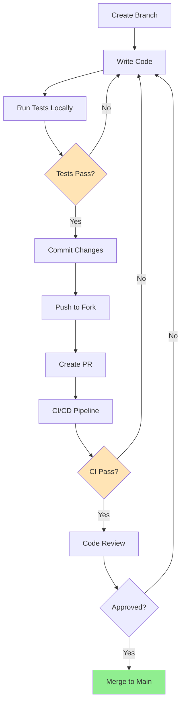

# Development Setup Guide

## Introduction

This guide will help you set up a complete development environment for VisionFlow. Follow these steps to start contributing to the project.

## Prerequisites

### Required Software

| Tool | Minimum Version | Purpose |
|------|----------------|---------|
| **Git** | 2.30+ | Version control |
| **Node.js** | 16.x LTS or 18.x LTS | JavaScript runtime |
| **npm** | 8.x+ | Package management |
| **Docker** | 20.10+ | Container runtime |
| **Docker Compose** | 1.29+ | Multi-container orchestration |

### Optional Tools

| Tool | Purpose |
|------|---------|
| **Python** | 3.9+ (if using Python components) |
| **Go** | 1.19+ (if working on Go services) |
| **PostgreSQL** | 14+ (for local database) |
| **Redis** | 6+ (for caching) |
| **Make** | Build automation |

### Development Environment

Recommended IDE/Editor:
- **VS Code** with extensions:
  - ESLint
  - Prettier
  - Docker
  - GitLens
  - REST Client
- **IntelliJ IDEA** or **WebStorm**
- **Vim/Neovim** with appropriate plugins

## Repository Setup

### 1. Fork and Clone

```bash
# Fork the repository on GitHub first, then:

# Clone your fork
git clone https://github.com/YOUR_USERNAME/visionflow.git
cd visionflow

# Add upstream remote
git remote add upstream https://github.com/original-org/visionflow.git

# Verify remotes
git remote -v
```

### 2. Install Dependencies

```bash
# Install Node.js dependencies
npm install

# Or use yarn
yarn install

# Install Python dependencies (if applicable)
pip install -r requirements-dev.txt

# Install Go dependencies (if applicable)
go mod download
```

### 3. Configure Environment

```bash
# Copy example environment file
cp .env.example .env

# Edit .env with your local settings
nano .env
```

**Example `.env` configuration**:
```bash
# Application
NODE_ENV=development
PORT=8080
API_PORT=9090

# Database
DB_HOST=localhost
DB_PORT=5432
DB_NAME=visionflow_dev
DB_USER=visionflow
DB_PASSWORD=dev_password

# Redis
REDIS_HOST=localhost
REDIS_PORT=6379

# Storage
STORAGE_TYPE=local
STORAGE_PATH=/tmp/visionflow-storage

# Logging
LOG_LEVEL=debug
LOG_FORMAT=pretty

# Development
HOT_RELOAD=true
DEBUG=true
```

## Development Services

### Starting Local Services

#### Option 1: Docker Compose (Recommended)

```bash
# Start all services
docker-compose -f docker-compose.dev.yml up -d

# View logs
docker-compose -f docker-compose.dev.yml logs -f

# Stop services
docker-compose -f docker-compose.dev.yml down
```

**docker-compose.dev.yml** includes:
- PostgreSQL database
- Redis cache
- MinIO (S3-compatible storage)
- MailHog (email testing)
- Mock services

#### Option 2: Native Services

```bash
# Start PostgreSQL
sudo systemctl start postgresql

# Start Redis
sudo systemctl start redis

# Or use Docker for individual services
docker run -d --name visionflow-postgres \
  -e POSTGRES_DB=visionflow_dev \
  -e POSTGRES_USER=visionflow \
  -e POSTGRES_PASSWORD=dev_password \
  -p 5432:5432 \
  postgres:14

docker run -d --name visionflow-redis \
  -p 6379:6379 \
  redis:6-alpine
```

### Database Setup

```bash
# Create database
createdb visionflow_dev

# Run migrations
npm run db:migrate

# Seed development data
npm run db:seed

# Reset database (careful!)
npm run db:reset
```

## Building the Project

### Development Build

```bash
# Build all packages
npm run build

# Build specific package
npm run build:api
npm run build:web
npm run build:cli

# Watch mode (auto-rebuild on changes)
npm run build:watch
```

### Build Output Structure

```
dist/
├── api/          # API server build
├── web/          # Web UI build
├── cli/          # CLI tool build
└── shared/       # Shared libraries
```

## Running the Application

### Development Mode

```bash
# Start all services in development mode
npm run dev

# Start specific service
npm run dev:api    # API server only
npm run dev:web    # Web UI only
npm run dev:worker # Background worker only
```

**Development features**:
- Hot module replacement (HMR)
- Auto-restart on file changes
- Source maps enabled
- Verbose logging
- Debug mode enabled

### Accessing the Application

| Service | URL | Purpose |
|---------|-----|---------|
| **Web UI** | http://localhost:3030 | Main interface |
| **API** | http://localhost:9090 | REST API |
| **API Docs** | http://localhost:9090/docs | Swagger UI |
| **GraphQL** | http://localhost:9090/graphql | GraphQL playground |
| **MailHog** | http://localhost:8025 | Email testing |

## Testing Setup

### Test Database

```bash
# Create test database
createdb visionflow_test

# Configure test environment
cp .env.test.example .env.test

# Run migrations for test database
NODE_ENV=test npm run db:migrate
```

### Running Tests

```bash
# Run all tests
npm test

# Run with coverage
npm run test:coverage

# Run specific test suite
npm test -- --grep "API"

# Watch mode
npm run test:watch

# E2E tests
npm run test:e2e

# Integration tests
npm run test:integration
```

### Test Structure

```
tests/
├── unit/           # Unit tests
├── integration/    # Integration tests
├── e2e/           # End-to-end tests
├── fixtures/      # Test data
└── helpers/       # Test utilities
```

## Code Quality Tools

### Linting

```bash
# Run ESLint
npm run lint

# Auto-fix issues
npm run lint:fix

# Lint specific files
npm run lint -- src/api/**/*.js
```

**ESLint Configuration** (`.eslintrc.js`):
```javascript
module.exports = {
  extends: [
    'eslint:recommended',
    'plugin:@typescript-eslint/recommended',
    'prettier'
  ],
  rules: {
    'no-console': 'warn',
    'no-unused-vars': 'error'
  }
};
```

### Code Formatting

```bash
# Format all files
npm run format

# Check formatting
npm run format:check

# Format specific files
prettier --write "src/**/*.{js,ts,json,md}"
```

**Prettier Configuration** (`.prettierrc`):
```json
{
  "semi": true,
  "trailingComma": "es5",
  "singleQuote": true,
  "printWidth": 80,
  "tabWidth": 2
}
```

### Type Checking

```bash
# Run TypeScript compiler
npm run typecheck

# Watch mode
npm run typecheck:watch
```

### Pre-commit Hooks

We use Husky for Git hooks:

```bash
# Install husky
npm run prepare

# Hooks automatically run on:
# - pre-commit: lint, format, typecheck
# - pre-push: test
```

## Development Workflow

### Development Flow Diagram



### Branch Naming Convention

```bash
# Feature branches
git checkout -b feature/add-user-authentication

# Bug fixes
git checkout -b fix/resolve-upload-timeout

# Hotfixes
git checkout -b hotfix/security-patch

# Documentation
git checkout -b docs/update-api-guide
```

### Commit Message Convention

Follow [Conventional Commits](https://www.conventionalcommits.org/):

```bash
# Format
<type>(<scope>): <description>

# Examples
feat(api): add user authentication endpoint
fix(web): resolve file upload timeout issue
docs(readme): update installation instructions
refactor(storage): improve S3 integration
test(api): add integration tests for auth
chore(deps): upgrade dependencies
```

**Types**:
- `feat`: New feature
- `fix`: Bug fix
- `docs`: Documentation changes
- `style`: Code style changes (formatting)
- `refactor`: Code refactoring
- `test`: Adding or updating tests
- `chore`: Maintenance tasks

## Debugging

### VS Code Debug Configuration

**`.vscode/launch.json`**:
```json
{
  "version": "0.2.0",
  "configurations": [
    {
      "type": "node",
      "request": "launch",
      "name": "Debug API Server",
      "program": "${workspaceFolder}/src/api/index.js",
      "env": {
        "NODE_ENV": "development",
        "DEBUG": "visionflow:*"
      }
    },
    {
      "type": "node",
      "request": "launch",
      "name": "Debug Tests",
      "program": "${workspaceFolder}/node_modules/jest/bin/jest",
      "args": ["--runInBand", "--no-cache"],
      "console": "integratedTerminal"
    }
  ]
}
```

### Debug Logging

```javascript
// Enable debug logs
DEBUG=visionflow:* npm run dev

// Specific modules
DEBUG=visionflow:api,visionflow:db npm run dev
```

### Chrome DevTools

```bash
# Start with Node inspector
node --inspect src/api/index.js

# Or with npm script
npm run dev:debug
```

Then open: `chrome://inspect`

## Common Development Tasks

### Adding a New API Endpoint

1. Define route in `src/api/routes/`
2. Create controller in `src/api/controllers/`
3. Add service logic in `src/api/services/`
4. Write tests in `tests/unit/api/`
5. Update API documentation

### Adding a New Feature

1. Create feature branch
2. Implement feature with TDD approach
3. Add/update documentation
4. Run full test suite
5. Submit pull request

### Updating Dependencies

```bash
# Check for outdated packages
npm outdated

# Update package
npm update package-name

# Update all packages (careful!)
npm update

# Check for security vulnerabilities
npm audit

# Fix vulnerabilities
npm audit fix
```

## Performance Profiling

### Node.js Profiling

```bash
# CPU profiling
node --prof src/api/index.js

# Memory profiling
node --inspect --expose-gc src/api/index.js
```

### Application Metrics

```bash
# Start with metrics enabled
ENABLE_METRICS=true npm run dev

# Access metrics
curl http://localhost:9090/metrics
```

## Environment Management

### Multiple Environments

```bash
# Development
npm run dev

# Staging
NODE_ENV=staging npm start

# Production
NODE_ENV=production npm start
```

### Environment Files

```
.env.example         # Template
.env                 # Local development (gitignored)
.env.test           # Test environment
.env.staging        # Staging environment
.env.production     # Production environment
```

## Troubleshooting Development Issues

### Port Already in Use

```bash
# Find process using port
lsof -i :8080

# Kill process
kill -9 <PID>
```

### Database Connection Issues

```bash
# Check PostgreSQL status
pg_isready -h localhost -p 5432

# Reset database
npm run db:reset
```

### Node Modules Issues

```bash
# Clear cache and reinstall
rm -rf node_modules package-lock.json
npm cache clean --force
npm install
```

### Build Issues

```bash
# Clean build artifacts
npm run clean

# Rebuild
npm run build
```

## Next Steps

- Review [Project Structure](./02-project-structure.md)
- Understand [Architecture](./03-architecture.md)
- Learn about [Adding Features](./04-adding-features.md)
- Set up [Testing](./05-testing.md)
- Read [Contributing Guidelines](./06-contributing.md)

## Development Resources

- **API Documentation**: http://localhost:9090/docs
- **Storybook** (UI components): http://localhost:6006
- **GraphQL Playground**: http://localhost:9090/graphql
- **Internal Wiki**: [Link to wiki]

## Getting Help

- **Slack/Discord**: #visionflow-dev
- **Team Meetings**: Weekly on [day/time]
- **Pair Programming**: Schedule via [calendar link]
- **Documentation**: https://docs.visionflow.dev
