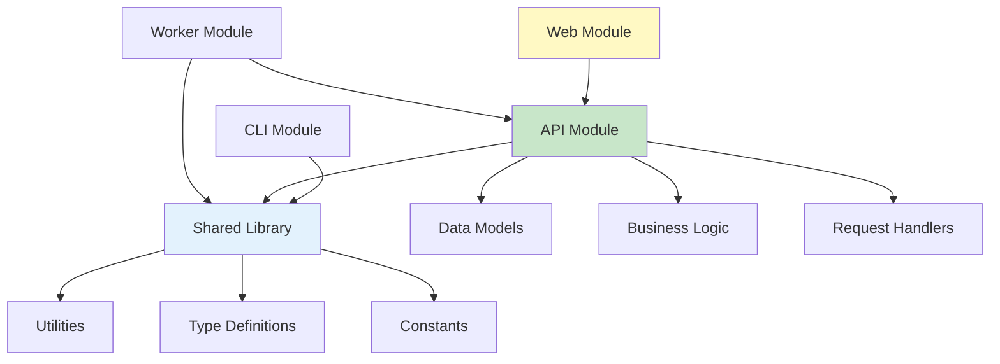
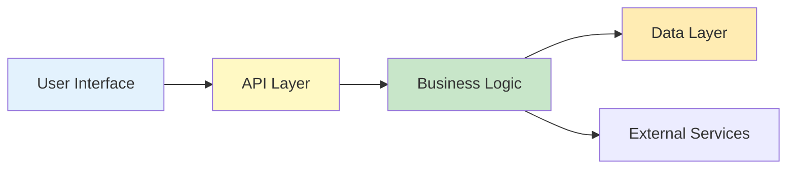

# Project Structure

## Overview

This document provides a comprehensive overview of VisionFlow's codebase structure, explaining the purpose of each directory and key files.

## Repository Layout

```
visionflow/
├── .github/                 # GitHub-specific files
│   ├── workflows/          # CI/CD workflows
│   ├── ISSUE-TEMPLATE/     # Issue templates
│   └── pull-request-template.md
├── docs/                    # Documentation
│   ├── api/                # API documentation
│   ├── user-guide/         # User documentation
│   ├── developer-guide/    # Developer documentation
│   └── deployment/         # Deployment guides
├── src/                     # Source code
│   ├── api/                # API server
│   ├── web/                # Web UI
│   ├── cli/                # CLI tool
│   ├── worker/             # Background workers
│   ├── shared/             # Shared libraries
│   └── types/              # TypeScript definitions
├── tests/                   # Test files
│   ├── unit/               # Unit tests
│   ├── integration/        # Integration tests
│   ├── e2e/                # End-to-end tests
│   └── fixtures/           # Test data
├── scripts/                 # Build and utility scripts
├── config/                  # Configuration files
├── migrations/              # Database migrations
├── public/                  # Static assets
├── docker/                  # Docker configurations
├── .vscode/                 # VS Code settings
├── node-modules/            # Dependencies (gitignored)
├── dist/                    # Build output (gitignored)
├── coverage/                # Test coverage (gitignored)
├── package.json             # Project metadata
├── tsconfig.json            # TypeScript config
├── .eslintrc.js            # ESLint config
├── .prettierrc             # Prettier config
├── docker-compose.yml      # Docker Compose config
├── Dockerfile              # Docker build file
├── readme.md               # Project readme
├── LICENSE                 # License file
└── changelog.md            # Change log
```

## Core Directories

### `/src` - Source Code

Main application source code organized by component.

#### `/src/api` - API Server

```
src/api/
├── index.js                 # Entry point
├── app.js                   # Express app setup
├── server.js                # HTTP server
├── routes/                  # Route definitions
│   ├── index.js
│   ├── auth.js
│   ├── projects.js
│   ├── assets.js
│   └── users.js
├── controllers/             # Request handlers
│   ├── AuthController.js
│   ├── ProjectController.js
│   ├── AssetController.js
│   └── UserController.js
├── services/                # Business logic
│   ├── AuthService.js
│   ├── ProjectService.js
│   ├── AssetService.js
│   └── UserService.js
├── models/                  # Data models
│   ├── User.js
│   ├── Project.js
│   └── Asset.js
├── middleware/              # Express middleware
│   ├── auth.js
│   ├── validation.js
│   ├── errorHandler.js
│   └── rateLimit.js
├── validators/              # Input validation schemas
│   ├── authValidator.js
│   └── projectValidator.js
├── utils/                   # Utility functions
│   ├── logger.js
│   ├── errors.js
│   └── helpers.js
└── config/                  # API-specific config
    └── swagger.js
```

**Key Files**:
- **index.js**: Application entry point
- **app.js**: Express application configuration
- **routes/**: API endpoint definitions
- **controllers/**: Handle HTTP requests/responses
- **services/**: Core business logic
- **models/**: Database models (ORM)
- **middleware/**: Request processing pipeline

#### `/src/web` - Web UI

```
src/web/
├── index.html               # HTML entry point
├── main.js                  # JavaScript entry point
├── App.vue                  # Root component (Vue)
├── components/              # Reusable components
│   ├── common/             # Common components
│   │   ├── Button.vue
│   │   ├── Input.vue
│   │   └── Modal.vue
│   ├── layout/             # Layout components
│   │   ├── Header.vue
│   │   ├── Sidebar.vue
│   │   └── Footer.vue
│   └── features/           # Feature components
│       ├── ProjectList.vue
│       ├── AssetManager.vue
│       └── Dashboard.vue
├── views/                   # Page components
│   ├── Home.vue
│   ├── Projects.vue
│   ├── Assets.vue
│   └── Settings.vue
├── router/                  # Routing configuration
│   └── index.js
├── store/                   # State management (Vuex/Pinia)
│   ├── index.js
│   ├── modules/
│   │   ├── auth.js
│   │   ├── projects.js
│   │   └── assets.js
├── services/                # API clients
│   ├── api.js
│   ├── authApi.js
│   └── projectApi.js
├── utils/                   # Utility functions
│   ├── formatters.js
│   └── validators.js
├── assets/                  # Static assets
│   ├── images/
│   ├── styles/
│   │   ├── main.css
│   │   └── variables.css
│   └── fonts/
└── composables/             # Vue composables
    ├── useAuth.js
    └── useProjects.js
```

**Key Files**:
- **main.js**: Application bootstrap
- **App.vue**: Root Vue component
- **components/**: Reusable UI components
- **views/**: Page-level components
- **router/**: Client-side routing
- **store/**: Global state management

#### `/src/cli` - Command Line Interface

```
src/cli/
├── index.js                 # CLI entry point
├── commands/                # Command implementations
│   ├── init.js
│   ├── start.js
│   ├── stop.js
│   ├── status.js
│   ├── upload.js
│   └── download.js
├── utils/                   # CLI utilities
│   ├── config.js
│   ├── logger.js
│   └── prompts.js
└── templates/               # File templates
    └── config.template.yml
```

#### `/src/worker` - Background Workers

```
src/worker/
├── index.js                 # Worker entry point
├── processors/              # Job processors
│   ├── ProcessingWorker.js
│   ├── ExportWorker.js
│   └── NotificationWorker.js
├── queue/                   # Queue management
│   ├── QueueManager.js
│   └── JobScheduler.js
└── utils/
    └── logger.js
```

#### `/src/shared` - Shared Libraries

```
src/shared/
├── constants/               # Shared constants
│   ├── errors.js
│   ├── status.js
│   └── config.js
├── utils/                   # Shared utilities
│   ├── logger.js
│   ├── crypto.js
│   └── validation.js
├── types/                   # TypeScript types
│   ├── User.ts
│   ├── Project.ts
│   └── Asset.ts
└── interfaces/              # Shared interfaces
    └── IStorage.ts
```

### `/tests` - Test Files

```
tests/
├── unit/                    # Unit tests
│   ├── api/
│   │   ├── controllers/
│   │   ├── services/
│   │   └── models/
│   └── web/
│       └── components/
├── integration/             # Integration tests
│   ├── api/
│   └── worker/
├── e2e/                     # End-to-end tests
│   ├── specs/
│   └── support/
├── fixtures/                # Test data
│   ├── users.json
│   ├── projects.json
│   └── assets/
├── helpers/                 # Test utilities
│   ├── setup.js
│   ├── teardown.js
│   └── factories.js
└── mocks/                   # Mock data/services
    ├── database.js
    └── storage.js
```

**Test Organization**:
- Mirror `src/` structure in `unit/` and `integration/`
- Group E2E tests by user journey
- Keep fixtures and mocks separate

### `/scripts` - Build & Utility Scripts

```
scripts/
├── build/                   # Build scripts
│   ├── build-api.js
│   ├── build-web.js
│   └── build-all.js
├── dev/                     # Development scripts
│   ├── start-dev.js
│   └── generate-types.js
├── db/                      # Database scripts
│   ├── migrate.js
│   ├── seed.js
│   └── reset.js
├── deploy/                  # Deployment scripts
│   ├── deploy-staging.sh
│   └── deploy-production.sh
└── utils/                   # Utility scripts
    ├── generate-docs.js
    └── check-deps.js
```

### `/config` - Configuration Files

```
config/
├── default.yml              # Default configuration
├── development.yml          # Development config
├── test.yml                 # Test config
├── staging.yml              # Staging config
├── production.yml           # Production config
└── custom-environment-variables.yml  # Env var mapping
```

**Configuration Loading**:
Uses [node-config](https://github.com/node-config/node-config) for hierarchical configuration.

### `/migrations` - Database Migrations

```
migrations/
├── 001-create-users-table.sql
├── 002-create-projects-table.sql
├── 003-create-assets-table.sql
└── 004-add-user-roles.sql
```

**Migration Naming**: `<number>-<description>.sql`

### `/docker` - Docker Configurations

```
docker/
├── Dockerfile.api           # API server image
├── Dockerfile.web           # Web UI image
├── Dockerfile.worker        # Worker image
├── nginx/                   # Nginx config
│   └── nginx.conf
└── scripts/                 # Docker scripts
    └── entrypoint.sh
```

## Key Configuration Files

### `package.json`

```json
{
  "name": "visionflow",
  "version": "1.0.0",
  "description": "VisionFlow description",
  "main": "dist/api/index.js",
  "scripts": {
    "dev": "nodemon src/api/index.js",
    "build": "npm run build:api && npm run build:web",
    "test": "jest",
    "lint": "eslint src/",
    "format": "prettier --write \"src/**/*.{js,ts,vue}\""
  },
  "dependencies": {},
  "devDependencies": {}
}
```

### `tsconfig.json`

```json
{
  "compilerOptions": {
    "target": "ES2020",
    "module": "commonjs",
    "lib": ["ES2020"],
    "outDir": "./dist",
    "rootDir": "./src",
    "strict": true,
    "esModuleInterop": true,
    "skipLibCheck": true,
    "forceConsistentCasingInFileNames": true,
    "resolveJsonModule": true,
    "declaration": true,
    "declarationMap": true,
    "sourceMap": true
  },
  "include": ["src/**/*"],
  "exclude": ["node-modules", "dist", "tests"]
}
```

### `.eslintrc.js`

```javascript
module.exports = {
  root: true,
  env: {
    node: true,
    es2021: true
  },
  extends: [
    'eslint:recommended',
    'plugin:@typescript-eslint/recommended',
    'plugin:vue/vue3-recommended',
    'prettier'
  ],
  parser: '@typescript-eslint/parser',
  parserOptions: {
    ecmaVersion: 2021,
    sourceType: 'module'
  },
  rules: {
    'no-console': process.env.NODE-ENV === 'production' ? 'warn' : 'off',
    'no-debugger': process.env.NODE-ENV === 'production' ? 'warn' : 'off'
  }
};
```

## Module Dependencies



## Code Organization Principles

### 1. Separation of Concerns

Each module has a single, well-defined responsibility:
- **API**: HTTP interface and routing
- **Web**: User interface
- **CLI**: Command-line interface
- **Worker**: Background processing
- **Shared**: Common utilities

### 2. Dependency Direction



Dependencies should flow inward:
- UI depends on API
- API depends on business logic
- Business logic depends on data layer
- No circular dependencies

### 3. Module Boundaries

```javascript
// ✅ Good: Clear module boundary
import { ProjectService } from '@/api/services/ProjectService';

// ❌ Bad: Reaching into implementation details
import { queryDatabase } from '@/api/services/ProjectService/internal';
```

### 4. File Naming Conventions

| Type | Convention | Example |
|------|-----------|---------|
| Components | PascalCase | `UserProfile.vue` |
| Services | PascalCase | `AuthService.js` |
| Utilities | camelCase | `formatDate.js` |
| Constants | UPPER-SNAKE-CASE | `API-ENDPOINTS.js` |
| Types | PascalCase | `User.ts` |
| Tests | Match source + `.test` | `AuthService.test.js` |

## Build Output Structure

```
dist/
├── api/                     # Compiled API server
│   ├── index.js
│   ├── routes/
│   ├── controllers/
│   └── services/
├── web/                     # Compiled web UI
│   ├── index.html
│   ├── assets/
│   └── js/
├── cli/                     # Compiled CLI
│   └── index.js
└── shared/                  # Compiled shared library
    ├── utils/
    └── types/
```

## Environment-Specific Files

| File | Purpose | Tracked in Git |
|------|---------|----------------|
| `.env.example` | Template | ✅ Yes |
| `.env` | Local development | ❌ No |
| `.env.test` | Test environment | ❌ No |
| `.env.staging` | Staging config | ⚠️ Encrypted |
| `.env.production` | Production config | ⚠️ Encrypted |

## Adding New Modules

When adding a new module:

1. Create directory in `/src`
2. Add entry point (`index.js`)
3. Update `package.json` scripts
4. Add tests in `/tests`
5. Update this documentation
6. Add to build process

## Next Steps

- Review [Architecture Overview](./03-architecture.md)
- Learn about [Adding Features](./04-adding-features.md)
- Understand [Testing Strategy](./05-testing-guide.md)
