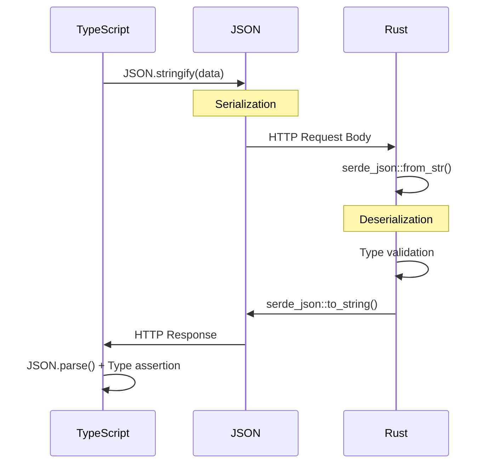

# JSON Serialization Patterns for VisionFlow

**Version:** 1.0
**Last Updated:** 2025-11-05
**Audience:** Frontend & Backend Developers

---

## Overview

This guide provides best practices for JSON serialization/deserialization in VisionFlow, ensuring type safety, performance, and reliability across the REST API and WebSocket boundaries.

**Key Topics:**
- Type-safe serialization patterns
- Runtime validation strategies
- Performance optimization
- Error handling
- Testing approaches

---

## Type-Safe Serialization

### TypeScript → JSON → Rust Flow



---

### TypeScript Patterns

#### ✅ DO: Use Interfaces for Request/Response Types

```typescript
// Define clear interfaces
export interface StartSimulationRequest {
  time_step?: number;
  damping?: number;
  spring_constant?: number;
  repulsion_strength?: number;
  attraction_strength?: number;
}

export interface StartSimulationResponse {
  simulation_id: string;
  status: 'starting' | 'running' | 'stopped';
  message?: string;
}

// Use generics in API client
export async function startSimulation(
  params: StartSimulationRequest
): Promise<StartSimulationResponse> {
  const response = await unifiedApiClient.post<StartSimulationResponse>(
    '/api/physics/start',
    params
  );
  return response.data;
}
```

**Benefits:**
- Compile-time type checking
- IntelliSense/autocomplete in IDE
- Refactoring safety
- Self-documenting code

---

#### ❌ DON'T: Use `any` or Implicit Types

```typescript
// BAD: No type safety
async function startSimulation(params: any): Promise<any> {
  const response = await axios.post('/api/physics/start', params);
  return response.data;
}

// Usage - no errors, but runtime crash
const result = await startSimulation({
  time_step: "not a number"  // Should be number!
});
console.log(result.simulaton_id);  // Typo - no compile error!
```

---

### Rust Patterns

#### ✅ DO: Use `serde` with Derive Macros

```rust
use serde::{Serialize, Deserialize};

#[derive(Debug, Serialize, Deserialize)]
pub struct StartSimulationRequest {
    #[serde(default)]
    pub time_step: Option<f64>,
    #[serde(default)]
    pub damping: Option<f64>,
    #[serde(default = "default_spring_constant")]
    pub spring_constant: Option<f64>,
    pub repulsion_strength: Option<f64>,
    pub attraction_strength: Option<f64>,
}

fn default_spring_constant() -> Option<f64> {
    Some(1.0)
}

#[derive(Debug, Serialize)]
pub struct StartSimulationResponse {
    pub simulation_id: String,
    pub status: SimulationStatus,
    pub message: Option<String>,
}

#[derive(Debug, Serialize, Deserialize)]
#[serde(rename_all = "lowercase")]
pub enum SimulationStatus {
    Starting,
    Running,
    Stopped,
}
```

**Serialization:**
```rust
let response = StartSimulationResponse {
    simulation_id: "sim_12345".to_string(),
    status: SimulationStatus::Running,
    message: None,
};

let json = serde_json::to_string(&response)?;
// Result: {"simulation_id":"sim_12345","status":"running","message":null}
```

**Deserialization:**
```rust
let json = r#"{"time_step":0.016,"damping":0.8}"#;
let request: StartSimulationRequest = serde_json::from_str(json)?;
```

---

## Runtime Validation

### Problem: Type Erasure at Runtime

```typescript
// TypeScript types are erased at runtime!
interface PhysicsStatus {
  running: boolean;
  statistics: {
    total_steps: number;
  };
}

// This compiles fine:
const status: PhysicsStatus = await api.get('/api/physics/status');

// But server might send:
// { "running": "yes", "statistics": null }
//           ↑ string!           ↑ null!

// Runtime crash:
console.log(status.statistics.total_steps);  // ❌ Cannot read property of null
```

---

### Solution 1: Zod Schema Validation

**✅ DO: Validate at Runtime**

```typescript
import { z } from 'zod';

// Define schema
const PhysicsStatusSchema = z.object({
  running: z.boolean(),
  statistics: z.object({
    total_steps: z.number(),
    average_step_time_ms: z.number(),
    average_energy: z.number(),
    gpu_memory_used_mb: z.number(),
  }).optional(),
  error: z.string().optional(),
});

// Infer TypeScript type from schema
type PhysicsStatus = z.infer<typeof PhysicsStatusSchema>;

// Validate response
export async function getPhysicsStatus(): Promise<PhysicsStatus> {
  const response = await unifiedApiClient.get('/api/physics/status');

  try {
    const validated = PhysicsStatusSchema.parse(response.data);
    return validated;
  } catch (error) {
    if (error instanceof z.ZodError) {
      console.error('[API] Invalid response:', error.errors);
      throw new Error(`Invalid API response: ${error.message}`);
    }
    throw error;
  }
}
```

**Benefits:**
- Runtime type safety
- Clear error messages
- Type and schema in sync
- Automatic TypeScript type inference

---

### Solution 2: Type Guards

**✅ DO: Use Type Guards for Complex Validation**

```typescript
export function isPhysicsStatus(data: unknown): data is PhysicsStatus {
  if (typeof data !== 'object' || data === null) return false;

  const obj = data as Record<string, unknown>;

  // Check required fields
  if (typeof obj.running !== 'boolean') return false;

  // Check optional statistics
  if (obj.statistics !== undefined) {
    if (typeof obj.statistics !== 'object' || obj.statistics === null) {
      return false;
    }

    const stats = obj.statistics as Record<string, unknown>;
    if (typeof stats.total_steps !== 'number') return false;
    if (typeof stats.average_step_time_ms !== 'number') return false;
  }

  return true;
}

// Usage
const response = await api.get('/api/physics/status');

if (isPhysicsStatus(response.data)) {
  // TypeScript knows this is PhysicsStatus
  console.log(response.data.statistics?.total_steps);
} else {
  throw new Error('Invalid response format');
}
```

---

### Solution 3: API Client Wrapper with Validation

**✅ DO: Create Validated API Client**

```typescript
import { z } from 'zod';

export class ValidatedApiClient {
  async get<T>(
    url: string,
    schema: z.ZodType<T>
  ): Promise<T> {
    const response = await unifiedApiClient.get(url);

    try {
      return schema.parse(response.data);
    } catch (error) {
      logger.error('API validation error', {
        url,
        error: error.message,
        data: response.data
      });
      throw new ApiValidationError(`Invalid response from ${url}`, error);
    }
  }

  async post<TRequest, TResponse>(
    url: string,
    data: TRequest,
    responseSchema: z.ZodType<TResponse>
  ): Promise<TResponse> {
    const response = await unifiedApiClient.post(url, data);
    return responseSchema.parse(response.data);
  }
}

// Usage
const validatedApi = new ValidatedApiClient();

const status = await validatedApi.get(
  '/api/physics/status',
  PhysicsStatusSchema
);
// TypeScript type: PhysicsStatus (validated at runtime!)
```

---

## Serialization Patterns

### Nested Objects

**✅ DO: Use Proper Typing for Nested Structures**

```typescript
export interface GraphSettings {
  physics: PhysicsSettings;
  rendering: RenderingSettings;
  interaction: InteractionSettings;
}

export interface PhysicsSettings {
  enabled: boolean;
  time_step: number;
  damping: number;
  forces: ForceSettings;
}

export interface ForceSettings {
  spring_constant: number;
  repulsion_strength: number;
  attraction_strength: number;
}

// Serialization preserves structure
const settings: GraphSettings = {
  physics: {
    enabled: true,
    time_step: 0.016,
    damping: 0.8,
    forces: {
      spring_constant: 1.0,
      repulsion_strength: 1.5,
      attraction_strength: 1.0
    }
  },
  rendering: { /* ... */ },
  interaction: { /* ... */ }
};

const json = JSON.stringify(settings);
// Result: Proper nested JSON structure
```

---

### Arrays

**✅ DO: Type Array Elements**

```typescript
export interface BatchUpdateRequest {
  updates: Array<{
    key: string;
    value: unknown;
  }>;
}

// With Zod validation
const BatchUpdateSchema = z.object({
  updates: z.array(z.object({
    key: z.string(),
    value: z.unknown()
  }))
});

// Serialization
const batch: BatchUpdateRequest = {
  updates: [
    { key: 'physics.damping', value: 0.8 },
    { key: 'physics.spring', value: 1.0 }
  ]
};

JSON.stringify(batch);
// Result: {"updates":[{"key":"physics.damping","value":0.8},{"key":"physics.spring","value":1.0}]}
```

---

### Optional Fields

**✅ DO: Use `Optional<T>` and `undefined`**

```typescript
export interface Node {
  id: string;              // Required
  label: string;           // Required
  properties?: Record<string, any>;  // Optional
  metadata?: {
    created_at?: string;
    updated_at?: string;
  };
}

// JSON with optional fields omitted
const node: Node = {
  id: "node-1",
  label: "Example"
  // properties and metadata omitted
};

JSON.stringify(node);
// Result: {"id":"node-1","label":"Example"}
```

**Rust side:**
```rust
#[derive(Serialize, Deserialize)]
pub struct Node {
    pub id: String,
    pub label: String,
    #[serde(skip_serializing_if = "Option::is_none")]
    pub properties: Option<HashMap<String, serde_json::Value>>,
    #[serde(skip_serializing_if = "Option::is_none")]
    pub metadata: Option<NodeMetadata>,
}
```

---

### Enums

**✅ DO: Use String Enums for JSON Compatibility**

```typescript
// TypeScript
export enum SimulationStatus {
  Starting = 'starting',
  Running = 'running',
  Stopped = 'stopped',
  Error = 'error'
}

export interface StatusResponse {
  status: SimulationStatus;
}

// Serialization
const response: StatusResponse = {
  status: SimulationStatus.Running
};

JSON.stringify(response);
// Result: {"status":"running"}
```

**Rust side:**
```rust
#[derive(Serialize, Deserialize)]
#[serde(rename_all = "lowercase")]
pub enum SimulationStatus {
    Starting,
    Running,
    Stopped,
    Error,
}
```

**❌ DON'T: Use Numeric Enums**
```typescript
// BAD: Not JSON-friendly
enum Status {
  Starting = 0,
  Running = 1,
  Stopped = 2
}

// Serializes to: {"status":1} - hard to read!
```

---

## Date/Time Handling

### ISO 8601 Strings

**✅ DO: Use ISO 8601 Format**

```typescript
export interface Event {
  id: string;
  timestamp: string;  // ISO 8601
  created_at: string; // ISO 8601
}

// Serialization
const event: Event = {
  id: "event-1",
  timestamp: new Date().toISOString(),  // "2025-11-05T10:30:00.000Z"
  created_at: new Date().toISOString()
};

// Deserialization
const parsed: Event = JSON.parse(jsonString);
const date = new Date(parsed.timestamp);  // Converts back to Date object
```

**Rust side:**
```rust
use chrono::{DateTime, Utc};

#[derive(Serialize, Deserialize)]
pub struct Event {
    pub id: String,
    pub timestamp: DateTime<Utc>,  // Serializes to ISO 8601
    pub created_at: DateTime<Utc>,
}
```

---

### Unix Timestamps

**✅ DO: Use for High-Precision or Compact Representation**

```typescript
export interface PositionUpdate {
  agent_id: number;
  position: Vector3;
  timestamp: number;  // Unix timestamp (milliseconds)
}

const update: PositionUpdate = {
  agent_id: 123,
  position: { x: 1.0, y: 2.0, z: 3.0 },
  timestamp: Date.now()  // 1699209600000
};

// Convert back
const date = new Date(update.timestamp);
```

---

## Performance Optimization

### Batch Operations

**✅ DO: Batch Multiple Updates**

```typescript
// Before: N API calls
for (const setting of settings) {
  await api.updateSetting(setting.key, setting.value);
}
// Result: N network requests, N JSON serializations

// After: 1 API call
await api.updateSettingsBatch(settings);
// Result: 1 network request, 1 JSON serialization

// Batch update interface
export interface BatchUpdateRequest {
  updates: Array<{
    key: string;
    value: unknown;
  }>;
}
```

**Performance Impact:**
- 10 settings: 10x faster
- 100 settings: 100x faster
- Reduced network overhead
- Single transaction on server

---

### Streaming Large Responses

**✅ DO: Use Streaming for Large Datasets**

```typescript
// Instead of loading all at once
const allNodes = await api.getNodes();  // ❌ 10MB JSON in memory

// Stream in chunks
const stream = await api.getNodesStream();
for await (const chunk of stream) {
  processChunk(chunk);  // ✅ Process incrementally
}
```

**Server Implementation (Rust):**
```rust
use actix_web::web::Bytes;
use futures::stream::Stream;

pub async fn get_nodes_stream() -> impl Stream<Item = Result<Bytes, Error>> {
    let nodes = repository.get_all_nodes().await?;

    // Stream in chunks of 100
    futures::stream::iter(nodes.chunks(100))
        .map(|chunk| {
            let json = serde_json::to_string(chunk)?;
            Ok(Bytes::from(json))
        })
}
```

---

### Selective Serialization

**✅ DO: Exclude Large Fields When Not Needed**

```rust
#[derive(Serialize)]
pub struct Node {
    pub id: String,
    pub label: String,

    #[serde(skip_serializing_if = "should_skip_properties")]
    pub properties: Option<LargeProperties>,
}

fn should_skip_properties(props: &Option<LargeProperties>) -> bool {
    // Skip if properties are large
    props.as_ref().map_or(true, |p| p.size() > 10_000)
}
```

**API Design:**
```typescript
// Fetch minimal data
const nodes = await api.getNodes({ include_properties: false });

// Fetch full data when needed
const fullNode = await api.getNode(nodeId, { include_properties: true });
```

---

## Error Handling

### API Error Response Format

**✅ DO: Standardize Error Responses**

```typescript
export interface ApiError {
  error: {
    code: string;
    message: string;
    details?: Record<string, any>;
    timestamp: string;
  };
}

// Usage
try {
  const response = await api.post('/api/endpoint', data);
} catch (error) {
  if (isApiError(error.response?.data)) {
    const apiError = error.response.data;
    console.error(`[API Error] ${apiError.error.code}: ${apiError.error.message}`);

    // Handle specific error codes
    if (apiError.error.code === 'VALIDATION_ERROR') {
      showValidationErrors(apiError.error.details);
    }
  }
}

// Type guard
function isApiError(data: unknown): data is ApiError {
  return (
    typeof data === 'object' &&
    data !== null &&
    'error' in data &&
    typeof (data as any).error.code === 'string'
  );
}
```

**Server Side (Rust):**
```rust
#[derive(Serialize)]
pub struct ApiError {
    pub error: ErrorDetail,
}

#[derive(Serialize)]
pub struct ErrorDetail {
    pub code: String,
    pub message: String,
    #[serde(skip_serializing_if = "Option::is_none")]
    pub details: Option<serde_json::Value>,
    pub timestamp: String,
}

// Return error
HttpResponse::BadRequest().json(ApiError {
    error: ErrorDetail {
        code: "VALIDATION_ERROR".to_string(),
        message: "Invalid input parameters".to_string(),
        details: Some(json!({ "field": "time_step", "error": "must be positive" })),
        timestamp: Utc::now().to_rfc3339(),
    }
})
```

---

### Serialization Error Handling

**✅ DO: Handle Serialization Failures Gracefully**

```typescript
function safeStringify(data: unknown, fallback: string = '{}'): string {
  try {
    return JSON.stringify(data);
  } catch (error) {
    console.error('[JSON] Serialization failed:', error);

    // Log for debugging
    logger.error('JSON serialization error', {
      error: error.message,
      dataType: typeof data
    });

    return fallback;
  }
}

// Usage
const json = safeStringify(complexObject, '{"error":"serialization_failed"}');
```

---

## Testing

### Unit Tests for Serialization

```typescript
describe('PhysicsStatus serialization', () => {
  it('should serialize valid status', () => {
    const status: PhysicsStatus = {
      running: true,
      statistics: {
        total_steps: 1000,
        average_step_time_ms: 16.5,
        average_energy: 42.3,
        gpu_memory_used_mb: 512
      }
    };

    const json = JSON.stringify(status);
    const parsed = JSON.parse(json);

    expect(parsed).toEqual(status);
  });

  it('should validate with Zod schema', () => {
    const validData = {
      running: true,
      statistics: {
        total_steps: 1000,
        average_step_time_ms: 16.5,
        average_energy: 42.3,
        gpu_memory_used_mb: 512
      }
    };

    expect(() => PhysicsStatusSchema.parse(validData)).not.toThrow();
  });

  it('should reject invalid data', () => {
    const invalidData = {
      running: "yes",  // Should be boolean
      statistics: null
    };

    expect(() => PhysicsStatusSchema.parse(invalidData)).toThrow(z.ZodError);
  });
});
```

---

### Integration Tests

```typescript
describe('Physics API integration', () => {
  it('should start simulation with valid parameters', async () => {
    const request: StartSimulationRequest = {
      time_step: 0.016,
      damping: 0.8,
      spring_constant: 1.0
    };

    const response = await api.startSimulation(request);

    expect(response.simulation_id).toBeDefined();
    expect(response.status).toBe('running');
  });

  it('should handle server errors', async () => {
    const invalidRequest = {
      time_step: -1  // Invalid negative value
    };

    await expect(
      api.startSimulation(invalidRequest)
    ).rejects.toThrow(ApiValidationError);
  });
});
```

---

## Related Documentation

- [WebSocket Best Practices](./websocket-best-practices.md)
- [Binary Protocol Specification](../../reference/binary-websocket.md)
- [API Reference](../../reference/api/readme.md)
- [UnifiedApiClient](../../../client/src/services/api/README.md)

---

## Checklist

### Implementation Checklist

- [ ] TypeScript interfaces defined for all API requests/responses
- [ ] Runtime validation implemented (Zod or type guards)
- [ ] Error types standardized across API
- [ ] Optional fields properly marked
- [ ] Enums use string values (not numeric)
- [ ] Dates use ISO 8601 or Unix timestamps consistently
- [ ] Batch endpoints implemented for repeated operations
- [ ] Large responses support streaming/pagination
- [ ] Serialization errors handled gracefully
- [ ] Unit tests for all serialization/deserialization
- [ ] Integration tests with actual API
- [ ] Documentation generated from TypeScript types

---

**Status:** Production Best Practices (validated November 2025)
