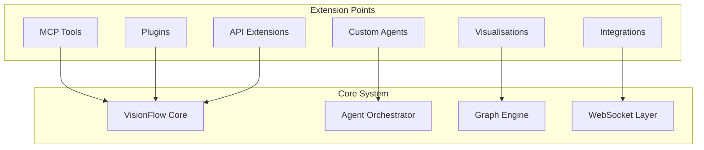

# Extending the System

[← Knowledge Base](../index.md) > [Guides](./index.md) > Extending the System

This guide covers how to extend VisionFlow with custom functionality, including creating new MCP tools, agent types, plugins, and API extensions. Learn how to tailor the system to your specific requirements and integrate with external services.

## Table of Contents

1. [Extension Points Overview](#extension-points-overview)
2. [Creating Custom Agents](#creating-custom-agents)
3. [Creating Custom MCP Tools](#creating-custom-mcp-tools)
4. [Building Plugins](#building-plugins)
5. [API Extensions](#api-extensions)
6. [Integration with External Services](#integration-with-external-services)
7. [Custom Visualisations](#custom-visualisations)
8. [Publishing Extensions](#publishing-extensions)
9. [Best Practices](#best-practices)
10. [Troubleshooting Extensions](#troubleshooting-extensions)

## Extension Points Overview

VisionFlow provides multiple extension points for customisation:



### Extension Architecture

| Extension Type | Purpose | Language | Interface |
|----------------|---------|----------|-----------|
| MCP Tools | External tool integration | Python/Node.js | Stdio JSON |
| Custom Agents | Specialised AI agents | Python | Agent API |
| Plugins | System functionality | Rust/TypeScript | Plugin API |
| API Extensions | New endpoints | Rust | REST/GraphQL |
| Visualisations | Custom 3D views | TypeScript/GLSL | React Three Fiber |
| Integrations | External services | Any | WebSocket/HTTP |

## Creating Custom Agents

Custom agents extend VisionFlow's capabilities by adding specialised behaviours and workflows. The system provides comprehensive agent templates to accelerate development.

### Understanding Agent Templates

Agent templates provide reusable patterns for common agent types. Browse the complete collection at [reference/agents/templates/](../reference/agents/templates/index.md).

Key template categories:
- **Automation Templates**: Intelligent automation and workflow management
- **Coordination Templates**: Multi-agent interaction patterns
- **Specialisation Templates**: Domain-specific implementations
- **Methodology Templates**: Development methodology patterns (SPARC, TDD)

### Step-by-Step: Create a Custom Agent from Template

#### 1. Choose Your Template

Review available templates in [reference/agents/templates/](../reference/agents/templates/index.md):

- [`automation-smart-agent.md`](../reference/agents/templates/automation-smart-agent.md) - Intelligent agent coordination
- [`implementer-sparc-coder.md`](../reference/agents/templates/implementer-sparc-coder.md) - SPARC methodology implementation
- [`orchestrator-task.md`](../reference/agents/templates/orchestrator-task.md) - Task orchestration patterns
- [`memory-coordinator.md`](../reference/agents/templates/memory-coordinator.md) - Memory management
- [`github-pr-manager.md`](../reference/agents/templates/github-pr-manager.md) - GitHub PR workflows

#### 2. Define Agent Structure

Create your agent definition file:

```yaml
# agents/my-custom-agent.yaml
---
name: data-processor
colour: "purple"
type: processing
description: Intelligent data processing and transformation specialist
capabilities:
  - data-extraction
  - data-transformation
  - data-validation
  - format-conversion
  - schema-inference
priority: high
hooks:
  pre: |
    echo "🔄 Data Processor initialising..."
    echo "📊 Loading transformation rules"
    memory_retrieve "transformation_config" || echo "Using default configuration"
  post: |
    echo "✅ Processing complete"
    memory_store "last_processing_$(date +%s)" "Data processing task completed"
    echo "📈 Metrics stored for analysis"
---
```

#### 3. Implement Agent Base Class

Based on the [automation-smart-agent](../reference/agents/templates/automation-smart-agent.md) template:

```python
# agents/base_agent.py
from abc import ABC, abstractmethod
from typing import Dict, List, Any, Optional
import asyncio
import logging

class BaseCustomAgent(ABC):
    """Base class for custom agents."""

    def __init__(self, agent_id: str, config: Dict[str, Any]):
        self.agent_id = agent_id
        self.config = config
        self.logger = logging.getLogger(f"agent.{agent_id}")

        # Agent state
        self.status = "initialising"
        self.capabilities = []
        self.active_tasks = []
        self.metrics = {
            "tasks_completed": 0,
            "tasks_failed": 0,
            "avg_task_duration": 0
        }

    @abstractmethod
    async def initialise(self):
        """Initialise agent resources."""
        pass

    @abstractmethod
    async def process_task(self, task: Dict[str, Any]) -> Any:
        """Process a single task."""
        pass

    @abstractmethod
    async def cleanup(self):
        """Clean up agent resources."""
        pass

    async def run(self):
        """Main agent execution loop."""
        try:
            await self.initialise()
            self.status = "ready"

            while self.status == "ready":
                task = await self.get_next_task()

                if task:
                    await self.execute_task(task)
                else:
                    await asyncio.sleep(1)

        except Exception as e:
            self.logger.error(f"Agent error: {e}", exc_info=True)
            self.status = "error"
        finally:
            await self.cleanup()

    async def execute_task(self, task: Dict[str, Any]):
        """Execute task with metrics tracking."""
        start_time = asyncio.get_event_loop().time()

        try:
            self.active_tasks.append(task['id'])
            result = await self.process_task(task)

            # Update metrics
            duration = asyncio.get_event_loop().time() - start_time
            self.update_metrics('success', duration)

            # Report result
            await self.report_result(task['id'], result)

        except Exception as e:
            self.logger.error(f"Task {task['id']} failed: {e}")
            self.update_metrics('failure', 0)
            await self.report_error(task['id'], str(e))

        finally:
            self.active_tasks.remove(task['id'])

    def update_metrics(self, status: str, duration: float):
        """Update agent metrics."""
        if status == 'success':
            self.metrics['tasks_completed'] += 1
            # Update average duration
            total_tasks = self.metrics['tasks_completed']
            current_avg = self.metrics['avg_task_duration']
            self.metrics['avg_task_duration'] = (
                (current_avg * (total_tasks - 1) + duration) / total_tasks
            )
        else:
            self.metrics['tasks_failed'] += 1

    async def get_next_task(self) -> Optional[Dict[str, Any]]:
        """Retrieve next task from queue."""
        # Implementation depends on your task queue system
        pass

    async def report_result(self, task_id: str, result: Any):
        """Report task result to orchestrator."""
        # Implementation depends on your communication protocol
        pass

    async def report_error(self, task_id: str, error: str):
        """Report task error to orchestrator."""
        # Implementation depends on your communication protocol
        pass
```

#### 4. Create Specialised Agent

Following the [implementer-sparc-coder](../reference/agents/templates/implementer-sparc-coder.md) pattern:

```python
# agents/data_processor_agent.py
import pandas as pd
from typing import Dict, Any
import aiofiles
import json

class DataProcessorAgent(BaseCustomAgent):
    """Agent specialised in data processing operations."""

    def __init__(self, agent_id: str, config: Dict[str, Any]):
        super().__init__(agent_id, config)
        self.capabilities = [
            'data_extraction',
            'data_transformation',
            'data_validation',
            'format_conversion',
            'schema_inference'
        ]
        self.transformation_rules = config.get('transformation_rules', {})
        self.validators = {}

    async def initialise(self):
        """Initialise data processing resources."""
        # Load transformation rules
        self.transformation_rules = await self.load_transformation_rules()

        # Initialise validators
        self.validators = {
            'schema': SchemaValidator(),
            'quality': DataQualityValidator(),
            'business': BusinessRuleValidator()
        }

        # Setup data cache
        self.cache = {}

        self.logger.info("Data processor agent initialised")

    async def process_task(self, task: Dict[str, Any]) -> Any:
        """Process data processing tasks."""
        task_type = task.get('type')

        handlers = {
            'extract': self.extract_data,
            'transform': self.transform_data,
            'validate': self.validate_data,
            'convert': self.convert_format,
            'infer_schema': self.infer_schema
        }

        handler = handlers.get(task_type)
        if not handler:
            raise ValueError(f"Unknown task type: {task_type}")

        return await handler(task.get('params', {}))

    async def extract_data(self, params: Dict) -> pd.DataFrame:
        """Extract data from various sources."""
        source_type = params.get('source_type')

        if source_type == 'file':
            file_path = params.get('file_path')
            file_format = params.get('format', 'csv')

            if file_format == 'csv':
                return pd.read_csv(file_path)
            elif file_format == 'json':
                async with aiofiles.open(file_path, 'r') as f:
                    content = await f.read()
                    data = json.loads(content)
                    return pd.DataFrame(data)
            elif file_format == 'parquet':
                return pd.read_parquet(file_path)
            else:
                raise ValueError(f"Unsupported format: {file_format}")

        elif source_type == 'database':
            # Database extraction logic
            query = params.get('query')
            connection = await self.get_db_connection(params.get('connection_string'))
            return pd.read_sql(query, connection)

        else:
            raise ValueError(f"Unsupported source type: {source_type}")

    async def transform_data(self, params: Dict) -> pd.DataFrame:
        """Apply transformations to data."""
        data = params.get('data')
        rules = params.get('transformation_rules', [])

        df = pd.DataFrame(data)

        for rule in rules:
            rule_type = rule.get('type')

            if rule_type == 'filter':
                column = rule['column']
                operator = rule['operator']
                value = rule['value']

                if operator == 'gt':
                    df = df[df[column] > value]
                elif operator == 'lt':
                    df = df[df[column] < value]
                elif operator == 'eq':
                    df = df[df[column] == value]

            elif rule_type == 'aggregate':
                group_by = rule['group_by']
                aggregations = rule['aggregations']
                df = df.groupby(group_by).agg(aggregations)

            elif rule_type == 'join':
                other_data = await self.get_cached_data(rule['dataset'])
                join_key = rule['join_key']
                join_type = rule.get('join_type', 'inner')
                df = df.merge(other_data, on=join_key, how=join_type)

            elif rule_type == 'compute':
                column_name = rule['column']
                expression = rule['expression']
                df[column_name] = df.eval(expression)

        return df

    async def validate_data(self, params: Dict) -> Dict[str, Any]:
        """Validate data against rules."""
        data = params.get('data')
        validation_rules = params.get('rules', [])

        df = pd.DataFrame(data)
        results = {
            'valid': True,
            'errors': [],
            'warnings': []
        }

        for rule in validation_rules:
            validator_type = rule.get('type')
            validator = self.validators.get(validator_type)

            if validator:
                validation_result = await validator.validate(df, rule)

                if not validation_result['valid']:
                    results['valid'] = False
                    results['errors'].extend(validation_result['errors'])

                results['warnings'].extend(validation_result.get('warnings', []))

        return results

    async def convert_format(self, params: Dict) -> str:
        """Convert data between formats."""
        data = params.get('data')
        source_format = params.get('source_format')
        target_format = params.get('target_format')
        output_path = params.get('output_path')

        df = pd.DataFrame(data)

        if target_format == 'csv':
            df.to_csv(output_path, index=False)
        elif target_format == 'json':
            df.to_json(output_path, orient='records', indent=2)
        elif target_format == 'parquet':
            df.to_parquet(output_path, index=False)
        elif target_format == 'excel':
            df.to_excel(output_path, index=False)
        else:
            raise ValueError(f"Unsupported target format: {target_format}")

        return output_path

    async def infer_schema(self, params: Dict) -> Dict[str, Any]:
        """Infer schema from data."""
        data = params.get('data')
        df = pd.DataFrame(data)

        schema = {
            'columns': [],
            'row_count': len(df),
            'nullable_columns': []
        }

        for column in df.columns:
            column_info = {
                'name': column,
                'type': str(df[column].dtype),
                'nullable': df[column].isnull().any(),
                'unique_count': df[column].nunique(),
                'sample_values': df[column].head(5).tolist()
            }

            schema['columns'].append(column_info)

            if column_info['nullable']:
                schema['nullable_columns'].append(column)

        return schema

    async def cleanup(self):
        """Clean up resources."""
        self.cache.clear()
        self.validators.clear()
        self.logger.info("Data processor agent cleaned up")

    async def load_transformation_rules(self) -> Dict:
        """Load transformation rules from configuration."""
        rules_path = self.config.get('rules_path')
        if rules_path:
            async with aiofiles.open(rules_path, 'r') as f:
                content = await f.read()
                return json.loads(content)
        return {}

    async def get_cached_data(self, dataset_id: str) -> pd.DataFrame:
        """Retrieve cached dataset."""
        if dataset_id in self.cache:
            return self.cache[dataset_id]
        else:
            raise ValueError(f"Dataset {dataset_id} not found in cache")

    async def get_db_connection(self, connection_string: str):
        """Get database connection."""
        # Implementation depends on your database system
        pass


# Validator implementations
class SchemaValidator:
    """Validates data against schema definitions."""

    async def validate(self, df: pd.DataFrame, rule: Dict) -> Dict:
        """Validate dataframe against schema."""
        schema = rule.get('schema', {})
        errors = []
        warnings = []

        # Check required columns
        required_columns = schema.get('required_columns', [])
        missing_columns = set(required_columns) - set(df.columns)
        if missing_columns:
            errors.append(f"Missing required columns: {missing_columns}")

        # Check data types
        for column, expected_type in schema.get('column_types', {}).items():
            if column in df.columns:
                actual_type = str(df[column].dtype)
                if actual_type != expected_type:
                    warnings.append(
                        f"Column '{column}' has type {actual_type}, expected {expected_type}"
                    )

        return {
            'valid': len(errors) == 0,
            'errors': errors,
            'warnings': warnings
        }


class DataQualityValidator:
    """Validates data quality metrics."""

    async def validate(self, df: pd.DataFrame, rule: Dict) -> Dict:
        """Validate data quality."""
        errors = []
        warnings = []

        # Check for null values
        max_null_percentage = rule.get('max_null_percentage', 0.1)
        for column in df.columns:
            null_percentage = df[column].isnull().sum() / len(df)
            if null_percentage > max_null_percentage:
                warnings.append(
                    f"Column '{column}' has {null_percentage:.2%} null values"
                )

        # Check for duplicates
        if rule.get('check_duplicates', False):
            duplicate_count = df.duplicated().sum()
            if duplicate_count > 0:
                warnings.append(f"Found {duplicate_count} duplicate rows")

        return {
            'valid': len(errors) == 0,
            'errors': errors,
            'warnings': warnings
        }


class BusinessRuleValidator:
    """Validates business rules."""

    async def validate(self, df: pd.DataFrame, rule: Dict) -> Dict:
        """Validate business rules."""
        errors = []
        warnings = []

        # Custom business rule validation logic
        business_rules = rule.get('rules', [])

        for br in business_rules:
            rule_type = br.get('type')

            if rule_type == 'range':
                column = br['column']
                min_val = br.get('min')
                max_val = br.get('max')

                if min_val is not None:
                    violations = df[df[column] < min_val]
                    if not violations.empty:
                        errors.append(
                            f"Column '{column}' has {len(violations)} values below minimum {min_val}"
                        )

                if max_val is not None:
                    violations = df[df[column] > max_val]
                    if not violations.empty:
                        errors.append(
                            f"Column '{column}' has {len(violations)} values above maximum {max_val}"
                        )

        return {
            'valid': len(errors) == 0,
            'errors': errors,
            'warnings': warnings
        }
```

#### 5. Register Your Agent

```yaml
# config/agents.yaml
custom_agents:
  data_processor:
    class: agents.data_processor_agent.DataProcessorAgent
    config:
      max_concurrent_tasks: 10
      rules_path: /workspace/config/transformation_rules.json
      cache_size: 1000
      transformation_rules:
        default:
          - type: filter
            column: status
            operator: eq
            value: active
          - type: compute
            column: full_name
            expression: "first_name + ' ' + last_name"
    resources:
      memory: "4Gi"
      cpu: "2.0"
    capabilities:
      - data_extraction
      - data_transformation
      - data_validation
      - format_conversion
      - schema_inference
```

#### 6. Test Your Agent

Create comprehensive tests following TDD principles from [implementer-sparc-coder](../reference/agents/templates/implementer-sparc-coder.md):

```python
# tests/test_data_processor_agent.py
import pytest
import pandas as pd
from agents.data_processor_agent import DataProcessorAgent

@pytest.fixture
async def agent():
    """Create test agent instance."""
    config = {
        'transformation_rules': {},
        'cache_size': 100
    }
    agent = DataProcessorAgent('test-agent', config)
    await agent.initialise()
    yield agent
    await agent.cleanup()

@pytest.mark.asyncio
async def test_extract_csv_data(agent, tmp_path):
    """Test CSV data extraction."""
    # Arrange
    test_file = tmp_path / "test.csv"
    test_data = pd.DataFrame({'col1': [1, 2, 3], 'col2': ['a', 'b', 'c']})
    test_data.to_csv(test_file, index=False)

    params = {
        'source_type': 'file',
        'file_path': str(test_file),
        'format': 'csv'
    }

    # Act
    result = await agent.extract_data(params)

    # Assert
    assert isinstance(result, pd.DataFrame)
    assert len(result) == 3
    assert list(result.columns) == ['col1', 'col2']

@pytest.mark.asyncio
async def test_transform_filter(agent):
    """Test data filtering transformation."""
    # Arrange
    test_data = pd.DataFrame({
        'value': [1, 2, 3, 4, 5],
        'category': ['A', 'B', 'A', 'B', 'A']
    })

    params = {
        'data': test_data.to_dict('records'),
        'transformation_rules': [
            {
                'type': 'filter',
                'column': 'value',
                'operator': 'gt',
                'value': 2
            }
        ]
    }

    # Act
    result = await agent.transform_data(params)

    # Assert
    assert len(result) == 3
    assert all(result['value'] > 2)

@pytest.mark.asyncio
async def test_validate_schema(agent):
    """Test schema validation."""
    # Arrange
    test_data = pd.DataFrame({
        'id': [1, 2, 3],
        'name': ['Alice', 'Bob', 'Charlie']
    })

    params = {
        'data': test_data.to_dict('records'),
        'rules': [
            {
                'type': 'schema',
                'schema': {
                    'required_columns': ['id', 'name', 'email'],
                    'column_types': {
                        'id': 'int64',
                        'name': 'object'
                    }
                }
            }
        ]
    }

    # Act
    result = await agent.validate_data(params)

    # Assert
    assert not result['valid']
    assert any('email' in error for error in result['errors'])

@pytest.mark.asyncio
async def test_infer_schema(agent):
    """Test schema inference."""
    # Arrange
    test_data = pd.DataFrame({
        'id': [1, 2, 3],
        'name': ['Alice', 'Bob', None],
        'score': [95.5, 87.3, 91.2]
    })

    params = {
        'data': test_data.to_dict('records')
    }

    # Act
    result = await agent.infer_schema(params)

    # Assert
    assert result['row_count'] == 3
    assert len(result['columns']) == 3
    assert 'name' in result['nullable_columns']
```

### Agent Template Resources

For more examples and patterns, explore:

- [Agent Templates Index](../reference/agents/templates/index.md) - Complete template catalogue
- [Automation Smart Agent](../reference/agents/templates/automation-smart-agent.md) - Intelligent coordination patterns
- [SPARC Coder](../reference/agents/templates/implementer-sparc-coder.md) - Implementation methodology
- [Task Orchestrator](../reference/agents/templates/orchestrator-task.md) - Orchestration patterns
- [Memory Coordinator](../reference/agents/templates/memory-coordinator.md) - Memory management
- [GitHub PR Manager](../reference/agents/templates/github-pr-manager.md) - GitHub workflows

### Contributing New Templates

Help expand the template library! See [Contributing Guide](./CONTRIBUTING.md) for:

- Template submission guidelines
- Documentation standards
- Testing requirements
- Review process

## Creating Custom MCP Tools

MCP (Model Context Protocol) tools enable external integrations through standardised stdio communication.

### MCP Tool Anatomy

MCP tools communicate via stdio using JSON messages:

```python
#!/usr/bin/env python3
"""
Custom MCP Tool Template
"""
import sys
import json
import logging
from typing import Dict, Any, Optional

class CustomMCPTool:
    def __init__(self):
        # Configure logging
        logging.basicConfig(
            level=logging.INFO,
            format='%(asctime)s - %(name)s - %(levelname)s - %(message)s',
            handlers=[logging.FileHandler('/app/logs/custom_tool.log')]
        )
        self.logger = logging.getLogger(__name__)

        # Initialise tool state
        self.config = self.load_config()
        self.capabilities = ['process', 'analyse', 'transform']

    def load_config(self) -> Dict:
        """Load tool configuration."""
        try:
            with open('/app/config/custom_tool.json', 'r') as f:
                return json.load(f)
        except Exception:
            return {}

    def process_request(self, request: Dict[str, Any]) -> Dict[str, Any]:
        """Process incoming MCP request."""
        try:
            method = request.get('method', 'default')
            params = request.get('params', {})

            # Route to appropriate handler
            handlers = {
                'process': self.handle_process,
                'analyse': self.handle_analyse,
                'transform': self.handle_transform,
                'capabilities': self.get_capabilities
            }

            handler = handlers.get(method, self.handle_unknown)
            result = handler(params)

            return {'result': result}

        except Exception as e:
            self.logger.error(f"Error processing request: {e}", exc_info=True)
            return {'error': str(e)}

    def handle_process(self, params: Dict) -> Any:
        """Handle process requests."""
        data = params.get('data')
        options = params.get('options', {})

        # Your processing logic here
        processed = self.process_data(data, options)

        return {
            'status': 'success',
            'processed': processed,
            'metadata': {
                'items_processed': len(processed) if hasattr(processed, '__len__') else 1,
                'options_used': options
            }
        }

    def handle_analyse(self, params: Dict) -> Any:
        """Handle analysis requests."""
        input_data = params.get('input')
        depth = params.get('depth', 1)

        # Analysis implementation
        analysis_result = {
            'summary': f"Analysed {len(input_data)} items at depth {depth}",
            'insights': [],
            'recommendations': []
        }

        return analysis_result

    def handle_transform(self, params: Dict) -> Any:
        """Handle transformation requests."""
        data = params.get('data')
        transformation = params.get('transformation')

        # Transformation implementation
        transformed_data = self.apply_transformation(data, transformation)

        return transformed_data

    def handle_unknown(self, params: Dict) -> Any:
        """Handle unknown methods."""
        return {'error': 'Unknown method'}

    def get_capabilities(self, params: Dict) -> list:
        """Return tool capabilities."""
        return self.capabilities

    def process_data(self, data: Any, options: Dict) -> Any:
        """Process data with options."""
        # Implementation
        return data

    def apply_transformation(self, data: Any, transformation: str) -> Any:
        """Apply transformation to data."""
        # Implementation
        return data

    def run(self):
        """Main execution loop."""
        self.logger.info("Custom MCP Tool started")

        # Read from stdin, write to stdout
        for line in sys.stdin:
            try:
                request = json.loads(line.strip())
                response = self.process_request(request)
                print(json.dumps(response), flush=True)
            except json.JSONDecodeError as e:
                error_response = {'error': f'Invalid JSON: {e}'}
                print(json.dumps(error_response), flush=True)
            except Exception as e:
                error_response = {'error': str(e)}
                print(json.dumps(error_response), flush=True)

if __name__ == '__main__':
    tool = CustomMCPTool()
    tool.run()
```

### Registering the Tool

1. **Add to MCP Configuration**
```json
// .mcp.json
{
  "tools": {
    "custom-tool": {
      "command": "python3",
      "args": ["-u", "./mcp-tools/custom_tool.py"],
      "description": "Custom tool for specialised processing",
      "schema": {
        "methods": {
          "process": {
            "params": {
              "data": "array",
              "options": "object"
            }
          },
          "analyse": {
            "params": {
              "input": "string",
              "depth": "number"
            }
          }
        }
      }
    }
  }
}
```

2. **Create Tool Wrapper Script**
```bash
#!/bin/bash
# mcp-tools/custom_tool_wrapper.sh

# Set environment
export PYTHONUNBUFFERED=1
export TOOL_CONFIG_PATH=/workspace/config/custom_tool.json

# Run tool with proper error handling
exec python3 -u /workspace/mcp-tools/custom_tool.py 2>>/app/logs/custom_tool.error.log
```

### Advanced MCP Tool Features

#### Asynchronous Operations

```python
import asyncio
import aiohttp

class AsyncMCPTool(CustomMCPTool):
    async def handle_fetch(self, params: Dict) -> Any:
        """Handle async fetch operations."""
        url = params.get('url')
        timeout = params.get('timeout', 30)

        async with aiohttp.ClientSession() as session:
            async with session.get(url, timeout=timeout) as response:
                data = await response.json()

        return {
            'status': response.status,
            'data': data,
            'headers': dict(response.headers)
        }

    def process_request(self, request: Dict[str, Any]) -> Dict[str, Any]:
        """Process request with async support."""
        method = request.get('method')

        if method == 'fetch':
            # Run async method in event loop
            loop = asyncio.new_event_loop()
            asyncio.set_event_loop(loop)
            result = loop.run_until_complete(
                self.handle_fetch(request.get('params', {}))
            )
            loop.close()
            return {'result': result}

        return super().process_request(request)
```

#### State Management

```python
from datetime import datetime
import uuid

class StatefulMCPTool(CustomMCPTool):
    def __init__(self):
        super().__init__()
        self.sessions = {}

    def handle_create_session(self, params: Dict) -> str:
        """Create new session."""
        session_id = str(uuid.uuid4())

        self.sessions[session_id] = {
            'created': datetime.utcnow().isoformat(),
            'data': {},
            'history': []
        }

        return session_id

    def handle_session_operation(self, params: Dict) -> Any:
        """Handle session-based operations."""
        session_id = params.get('session_id')
        operation = params.get('operation')

        if session_id not in self.sessions:
            raise ValueError("Invalid session ID")

        session = self.sessions[session_id]
        session['history'].append({
            'timestamp': datetime.utcnow().isoformat(),
            'operation': operation
        })

        # Process operation
        result = self.process_session_operation(session, operation)

        return result

    def handle_destroy_session(self, params: Dict) -> Dict:
        """Destroy session and clean up."""
        session_id = params.get('session_id')

        if session_id in self.sessions:
            session = self.sessions.pop(session_id)
            return {
                'status': 'destroyed',
                'operations_count': len(session['history'])
            }

        return {'status': 'not_found'}

    def process_session_operation(self, session: Dict, operation: Dict) -> Any:
        """Process operation within session context."""
        # Implementation
        return {'status': 'completed'}
```

## Building Plugins

### Plugin Architecture

```rust
// src/plugins/plugin_interface.rs
use async_trait::async_trait;
use serde::{Deserialize, Serialize};
use std::collections::HashMap;

#[async_trait]
pub trait Plugin: Send + Sync {
    /// Plugin metadata
    fn metadata(&self) -> PluginMetadata;

    /// Initialise plugin
    async fn initialise(&mut self, config: PluginConfig) -> Result<(), PluginError>;

    /// Handle plugin events
    async fn handle_event(&self, event: PluginEvent) -> Result<PluginResponse, PluginError>;

    /// Cleanup plugin
    async fn cleanup(&mut self) -> Result<(), PluginError>;
}

#[derive(Debug, Clone, Serialize, Deserialize)]
pub struct PluginMetadata {
    pub name: String,
    pub version: String,
    pub author: String,
    pub description: String,
    pub capabilities: Vec<String>,
}

#[derive(Debug, Clone, Serialize, Deserialize)]
pub struct PluginConfig {
    pub settings: HashMap<String, serde_json::Value>,
}

#[derive(Debug, Clone, Serialize, Deserialize)]
pub struct PluginEvent {
    pub event_type: String,
    pub payload: serde_json::Value,
}

#[derive(Debug, Clone, Serialize, Deserialize)]
pub struct PluginResponse {
    pub success: bool,
    pub data: Option<serde_json::Value>,
    pub error: Option<String>,
}

#[derive(Debug)]
pub enum PluginError {
    InitialisationError(String),
    InvalidData(String),
    UnknownEvent(String),
    ProcessingError(String),
}

impl std::fmt::Display for PluginError {
    fn fmt(&self, f: &mut std::fmt::Formatter) -> std::fmt::Result {
        match self {
            PluginError::InitialisationError(msg) => write!(f, "Initialisation error: {}", msg),
            PluginError::InvalidData(msg) => write!(f, "Invalid data: {}", msg),
            PluginError::UnknownEvent(msg) => write!(f, "Unknown event: {}", msg),
            PluginError::ProcessingError(msg) => write!(f, "Processing error: {}", msg),
        }
    }
}

impl std::error::Error for PluginError {}
```

### Example Plugin Implementation

```rust
// src/plugins/custom_analytics.rs
use super::{Plugin, PluginMetadata, PluginConfig, PluginEvent, PluginResponse, PluginError};
use async_trait::async_trait;
use std::collections::HashMap;
use serde::{Deserialize, Serialize};

#[derive(Debug, Serialize, Deserialize)]
struct Graph {
    nodes: Vec<Node>,
    edges: Vec<Edge>,
}

#[derive(Debug, Serialize, Deserialize)]
struct Node {
    id: String,
    label: String,
    properties: HashMap<String, serde_json::Value>,
}

#[derive(Debug, Serialize, Deserialize)]
struct Edge {
    source: String,
    target: String,
    weight: f64,
}

#[derive(Debug, Serialize, Deserialize)]
struct GraphMetrics {
    node_count: usize,
    edge_count: usize,
    average_degree: f64,
    clustering_coefficient: f64,
    connected_components: usize,
}

pub struct CustomAnalyticsPlugin {
    config: Option<PluginConfig>,
    metrics: HashMap<String, f64>,
}

impl CustomAnalyticsPlugin {
    pub fn new() -> Self {
        Self {
            config: None,
            metrics: HashMap::new(),
        }
    }

    fn setup_analytics_engine(&mut self) -> Result<(), PluginError> {
        // Initialise analytics engine
        self.metrics.insert("total_analyses".to_string(), 0.0);
        Ok(())
    }

    async fn analyse_graph(&self, data: serde_json::Value) -> Result<PluginResponse, PluginError> {
        // Parse graph data
        let graph: Graph = serde_json::from_value(data)
            .map_err(|e| PluginError::InvalidData(e.to_string()))?;

        // Perform analysis
        let metrics = self.calculate_graph_metrics(&graph)?;

        Ok(PluginResponse {
            success: true,
            data: Some(serde_json::to_value(metrics)
                .map_err(|e| PluginError::ProcessingError(e.to_string()))?),
            error: None,
        })
    }

    async fn detect_patterns(&self, data: serde_json::Value) -> Result<PluginResponse, PluginError> {
        let graph: Graph = serde_json::from_value(data)
            .map_err(|e| PluginError::InvalidData(e.to_string()))?;

        // Pattern detection logic
        let patterns = self.find_patterns(&graph)?;

        Ok(PluginResponse {
            success: true,
            data: Some(serde_json::to_value(patterns)
                .map_err(|e| PluginError::ProcessingError(e.to_string()))?),
            error: None,
        })
    }

    async fn find_anomalies(&self, data: serde_json::Value) -> Result<PluginResponse, PluginError> {
        let graph: Graph = serde_json::from_value(data)
            .map_err(|e| PluginError::InvalidData(e.to_string()))?;

        // Anomaly detection logic
        let anomalies = self.detect_anomalies_in_graph(&graph)?;

        Ok(PluginResponse {
            success: true,
            data: Some(serde_json::to_value(anomalies)
                .map_err(|e| PluginError::ProcessingError(e.to_string()))?),
            error: None,
        })
    }

    fn calculate_graph_metrics(&self, graph: &Graph) -> Result<GraphMetrics, PluginError> {
        let metrics = GraphMetrics {
            node_count: graph.nodes.len(),
            edge_count: graph.edges.len(),
            average_degree: self.calculate_average_degree(graph),
            clustering_coefficient: self.calculate_clustering_coefficient(graph),
            connected_components: self.find_connected_components(graph),
        };

        Ok(metrics)
    }

    fn calculate_average_degree(&self, graph: &Graph) -> f64 {
        if graph.nodes.is_empty() {
            return 0.0;
        }
        (2.0 * graph.edges.len() as f64) / graph.nodes.len() as f64
    }

    fn calculate_clustering_coefficient(&self, graph: &Graph) -> f64 {
        // Clustering coefficient calculation
        0.0 // Placeholder
    }

    fn find_connected_components(&self, graph: &Graph) -> usize {
        // Connected components algorithm
        1 // Placeholder
    }

    fn find_patterns(&self, graph: &Graph) -> Result<Vec<String>, PluginError> {
        // Pattern detection
        Ok(vec!["pattern1".to_string(), "pattern2".to_string()])
    }

    fn detect_anomalies_in_graph(&self, graph: &Graph) -> Result<Vec<String>, PluginError> {
        // Anomaly detection
        Ok(vec![])
    }
}

#[async_trait]
impl Plugin for CustomAnalyticsPlugin {
    fn metadata(&self) -> PluginMetadata {
        PluginMetadata {
            name: "Custom Analytics".to_string(),
            version: "1.0.0".to_string(),
            author: "Your Name".to_string(),
            description: "Advanced analytics for graph data".to_string(),
            capabilities: vec![
                "graph_analysis".to_string(),
                "pattern_detection".to_string(),
                "anomaly_detection".to_string(),
            ],
        }
    }

    async fn initialise(&mut self, config: PluginConfig) -> Result<(), PluginError> {
        self.config = Some(config);

        // Initialise analytics engine
        self.setup_analytics_engine()?;

        Ok(())
    }

    async fn handle_event(&self, event: PluginEvent) -> Result<PluginResponse, PluginError> {
        match event.event_type.as_str() {
            "analyse_graph" => self.analyse_graph(event.payload).await,
            "detect_patterns" => self.detect_patterns(event.payload).await,
            "find_anomalies" => self.find_anomalies(event.payload).await,
            _ => Err(PluginError::UnknownEvent(event.event_type)),
        }
    }

    async fn cleanup(&mut self) -> Result<(), PluginError> {
        self.metrics.clear();
        Ok(())
    }
}
```

### Plugin Registration

```toml
# plugins.toml
[[plugins]]
name = "custom-analytics"
path = "./plugins/custom_analytics.so"
enabled = true
config = { buffer_size = 1000, cache_ttl = 300 }

[[plugins]]
name = "external-integration"
path = "./plugins/external_integration.wasm"
enabled = true
config = { api_endpoint = "https://api.example.com" }
```

## API Extensions

### Creating Custom Endpoints

```rust
// src/api/extensions/custom_endpoints.rs
use actix_web::{web, HttpResponse, Result};
use serde::{Deserialize, Serialize};
use chrono::{DateTime, Utc};

#[derive(Serialize, Deserialize)]
struct CustomAnalysisRequest {
    graph_id: String,
    analysis_type: String,
    parameters: serde_json::Value,
}

#[derive(Serialize)]
struct CustomAnalysisResponse {
    result: serde_json::Value,
    metadata: AnalysisMetadata,
}

#[derive(Serialize)]
struct AnalysisMetadata {
    timestamp: DateTime<Utc>,
    duration_ms: u64,
}

pub fn configure_custom_routes(cfg: &mut web::ServiceConfig) {
    cfg.service(
        web::scope("/custom")
            .route("/analyse", web::post().to(analyse_graph))
            .route("/visualise/{id}", web::get().to(get_visualisation))
            .route("/export", web::post().to(export_data))
    );
}

async fn analyse_graph(
    req: web::Json<CustomAnalysisRequest>,
    app_state: web::Data<AppState>,
) -> Result<HttpResponse> {
    let start_time = std::time::Instant::now();

    let analysis_result = app_state
        .analyser
        .perform_analysis(&req.graph_id, &req.analysis_type, &req.parameters)
        .await?;

    let duration_ms = start_time.elapsed().as_millis() as u64;

    Ok(HttpResponse::Ok().json(CustomAnalysisResponse {
        result: analysis_result,
        metadata: AnalysisMetadata {
            timestamp: Utc::now(),
            duration_ms,
        },
    }))
}

async fn get_visualisation(
    path: web::Path<String>,
    app_state: web::Data<AppState>,
) -> Result<HttpResponse> {
    let graph_id = path.into_inner();

    let visualisation = app_state
        .visualisation_engine
        .generate(&graph_id)
        .await?;

    Ok(HttpResponse::Ok().json(visualisation))
}

async fn export_data(
    req: web::Json<ExportRequest>,
    app_state: web::Data<AppState>,
) -> Result<HttpResponse> {
    let export_result = app_state
        .exporter
        .export(&req.graph_id, &req.format)
        .await?;

    Ok(HttpResponse::Ok().json(export_result))
}

#[derive(Deserialize)]
struct ExportRequest {
    graph_id: String,
    format: String,
}

// Application state
pub struct AppState {
    pub analyser: Box<dyn GraphAnalyser>,
    pub visualisation_engine: Box<dyn VisualisationEngine>,
    pub exporter: Box<dyn DataExporter>,
}

// Traits for dependency injection
#[async_trait::async_trait]
pub trait GraphAnalyser: Send + Sync {
    async fn perform_analysis(
        &self,
        graph_id: &str,
        analysis_type: &str,
        parameters: &serde_json::Value,
    ) -> Result<serde_json::Value, Box<dyn std::error::Error>>;
}

#[async_trait::async_trait]
pub trait VisualisationEngine: Send + Sync {
    async fn generate(
        &self,
        graph_id: &str,
    ) -> Result<serde_json::Value, Box<dyn std::error::Error>>;
}

#[async_trait::async_trait]
pub trait DataExporter: Send + Sync {
    async fn export(
        &self,
        graph_id: &str,
        format: &str,
    ) -> Result<serde_json::Value, Box<dyn std::error::Error>>;
}
```

### GraphQL Extensions

```rust
// src/graphql/custom_schema.rs
use juniper::{FieldResult, RootNode, graphql_object};
use serde::{Deserialize, Serialize};

pub struct Context {
    pub search_engine: Box<dyn SearchEngine>,
    pub pattern_detector: Box<dyn PatternDetector>,
    pub visualisation_engine: Box<dyn VisualisationEngine>,
}

impl juniper::Context for Context {}

pub struct CustomQuery;

#[graphql_object(context = Context)]
impl CustomQuery {
    async fn advanced_search(
        ctx: &Context,
        query: String,
        filters: SearchFilters,
        limit: Option<i32>,
    ) -> FieldResult<SearchResults> {
        let results = ctx
            .search_engine
            .search(&query, filters, limit.unwrap_or(10))
            .await?;

        Ok(results)
    }

    async fn pattern_analysis(
        ctx: &Context,
        graph_id: String,
        pattern_type: PatternType,
    ) -> FieldResult<Vec<Pattern>> {
        let patterns = ctx
            .pattern_detector
            .find_patterns(&graph_id, pattern_type)
            .await?;

        Ok(patterns)
    }
}

pub struct CustomMutation;

#[graphql_object(context = Context)]
impl CustomMutation {
    async fn create_custom_visualisation(
        ctx: &Context,
        input: VisualisationInput,
    ) -> FieldResult<Visualisation> {
        let viz = ctx
            .visualisation_engine
            .create_custom(input)
            .await?;

        Ok(viz)
    }
}

#[derive(juniper::GraphQLInputObject)]
struct SearchFilters {
    category: Option<String>,
    tags: Option<Vec<String>>,
    date_range: Option<DateRange>,
}

#[derive(juniper::GraphQLInputObject)]
struct DateRange {
    start: String,
    end: String,
}

#[derive(juniper::GraphQLObject)]
struct SearchResults {
    total: i32,
    items: Vec<SearchResult>,
}

#[derive(juniper::GraphQLObject)]
struct SearchResult {
    id: String,
    title: String,
    score: f64,
}

#[derive(juniper::GraphQLEnum)]
enum PatternType {
    Cycle,
    Tree,
    Hub,
    Community,
}

#[derive(juniper::GraphQLObject)]
struct Pattern {
    id: String,
    pattern_type: String,
    nodes: Vec<String>,
    confidence: f64,
}

#[derive(juniper::GraphQLInputObject)]
struct VisualisationInput {
    graph_id: String,
    layout: String,
    colour_scheme: String,
}

#[derive(juniper::GraphQLObject)]
struct Visualisation {
    id: String,
    graph_id: String,
    layout: String,
    created_at: String,
}

// Trait definitions
#[async_trait::async_trait]
pub trait SearchEngine: Send + Sync {
    async fn search(
        &self,
        query: &str,
        filters: SearchFilters,
        limit: i32,
    ) -> Result<SearchResults, Box<dyn std::error::Error>>;
}

#[async_trait::async_trait]
pub trait PatternDetector: Send + Sync {
    async fn find_patterns(
        &self,
        graph_id: &str,
        pattern_type: PatternType,
    ) -> Result<Vec<Pattern>, Box<dyn std::error::Error>>;
}

#[async_trait::async_trait]
pub trait VisualisationEngine: Send + Sync {
    async fn create_custom(
        &self,
        input: VisualisationInput,
    ) -> Result<Visualisation, Box<dyn std::error::Error>>;
}
```

## Integration with External Services

### Webhook Integration

```python
# integrations/webhook_handler.py
from aiohttp import web
import aiohttp
import hmac
import hashlib
import logging
from typing import Callable, Dict, Any

logger = logging.getLogger(__name__)

class WebhookIntegration:
    def __init__(self, config: Dict[str, Any]):
        self.config = config
        self.secret = config.get('webhook_secret', '').encode()
        self.handlers: Dict[str, Callable] = {}

    def register_handler(self, event_type: str, handler: Callable):
        """Register webhook handler for event type."""
        self.handlers[event_type] = handler
        logger.info(f"Registered handler for event type: {event_type}")

    async def handle_webhook(self, request: web.Request) -> web.Response:
        """Handle incoming webhook."""
        # Verify webhook signature
        signature = request.headers.get('X-Webhook-Signature', '')
        body = await request.read()

        if not self.verify_signature(body, signature):
            logger.warning("Invalid webhook signature")
            return web.Response(status=401, text="Invalid signature")

        # Parse webhook data
        try:
            data = await request.json()
        except Exception as e:
            logger.error(f"Failed to parse webhook data: {e}")
            return web.json_response(
                {'status': 'error', 'error': 'Invalid JSON'},
                status=400
            )

        event_type = data.get('event_type')

        # Route to handler
        handler = self.handlers.get(event_type)
        if handler:
            try:
                result = await handler(data)
                logger.info(f"Successfully handled webhook: {event_type}")
                return web.json_response({'status': 'success', 'result': result})
            except Exception as e:
                logger.error(f"Handler error for {event_type}: {e}", exc_info=True)
                return web.json_response(
                    {'status': 'error', 'error': str(e)},
                    status=500
                )

        logger.warning(f"No handler registered for event type: {event_type}")
        return web.json_response(
            {'status': 'error', 'error': 'Unknown event type'},
            status=400
        )

    def verify_signature(self, body: bytes, signature: str) -> bool:
        """Verify webhook signature."""
        if not self.secret:
            logger.warning("No webhook secret configured")
            return False

        expected = hmac.new(
            self.secret,
            body,
            hashlib.sha256
        ).hexdigest()

        return hmac.compare_digest(expected, signature)
```

### External Service Client

```typescript
// src/integrations/ExternalServiceClient.ts
import axios, { AxiosInstance, AxiosError } from 'axios';
import { v4 as uuidv4 } from 'uuid';

interface ExternalServiceConfig {
  apiKey: string;
  baseUrl: string;
  timeout?: number;
  retryAttempts?: number;
}

interface SyncResult {
  status: string;
  syncedCount: number;
  errors: string[];
}

export class ExternalServiceClient {
  private apiKey: string;
  private baseUrl: string;
  private httpClient: AxiosInstance;
  private retryAttempts: number;

  constructor(config: ExternalServiceConfig) {
    this.apiKey = config.apiKey;
    this.baseUrl = config.baseUrl;
    this.retryAttempts = config.retryAttempts || 3;

    this.httpClient = axios.create({
      baseURL: this.baseUrl,
      headers: {
        'Authorisation': `Bearer ${this.apiKey}`,
        'Content-Type': 'application/json'
      },
      timeout: config.timeout || 30000
    });

    this.setupInterceptors();
  }

  private setupInterceptors(): void {
    // Request interceptor
    this.httpClient.interceptors.request.use(
      (config) => {
        config.headers['X-Request-ID'] = uuidv4();
        config.headers['X-Client-Version'] = '1.0.0';
        return config;
      },
      (error) => Promise.reject(error)
    );

    // Response interceptor
    this.httpClient.interceptors.response.use(
      (response) => response,
      async (error: AxiosError) => {
        if (error.response?.status === 401) {
          await this.refreshToken();
          return this.httpClient.request(error.config!);
        }

        if (error.response?.status === 429) {
          // Rate limit handling
          const retryAfter = error.response.headers['retry-after'];
          await this.delay(parseInt(retryAfter) * 1000 || 5000);
          return this.httpClient.request(error.config!);
        }

        return Promise.reject(error);
      }
    );
  }

  async syncData(data: any): Promise<SyncResult> {
    let lastError: Error | null = null;

    for (let attempt = 1; attempt <= this.retryAttempts; attempt++) {
      try {
        const response = await this.httpClient.post('/sync', {
          data,
          timestamp: new Date().toISOString()
        });

        return response.data;
      } catch (error) {
        lastError = error as Error;

        if (attempt < this.retryAttempts) {
          await this.delay(Math.pow(2, attempt) * 1000);
        }
      }
    }

    throw lastError;
  }

  async streamUpdates(onUpdate: (update: any) => void): Promise<void> {
    const eventSource = new EventSource(
      `${this.baseUrl}/stream?token=${this.apiKey}`
    );

    eventSource.onmessage = (event) => {
      try {
        const update = JSON.parse(event.data);
        onUpdate(update);
      } catch (error) {
        console.error('Failed to parse update:', error);
      }
    };

    eventSource.onerror = (error) => {
      console.error('Stream error:', error);
      eventSource.close();

      // Attempt reconnection
      setTimeout(() => this.streamUpdates(onUpdate), 5000);
    };
  }

  async batchRequest<T>(requests: Array<() => Promise<T>>): Promise<T[]> {
    const results = await Promise.allSettled(
      requests.map(req => req())
    );

    return results.map((result, index) => {
      if (result.status === 'fulfilled') {
        return result.value;
      } else {
        console.error(`Request ${index} failed:`, result.reason);
        throw result.reason;
      }
    });
  }

  private async refreshToken(): Promise<void> {
    // Token refresh implementation
    const response = await axios.post(`${this.baseUrl}/auth/refresh`, {
      apiKey: this.apiKey
    });

    this.apiKey = response.data.token;
    this.httpClient.defaults.headers['Authorisation'] = `Bearer ${this.apiKey}`;
  }

  private delay(ms: number): Promise<void> {
    return new Promise(resolve => setTimeout(resolve, ms));
  }
}
```

## Custom Visualisations

### Three.js Custom Component

```typescript
// src/components/CustomVisualisation.tsx
import React, { useRef, useMemo, useEffect } from 'react';
import { useFrame, useThree } from '@react-three/fiber';
import { BufferGeometry, Float32BufferAttribute, ShaderMaterial, Points } from 'three';
import * as THREE from 'three';

interface VisualisationData {
  points: Array<{
    x: number;
    y: number;
    z: number;
    colour: { r: number; g: number; b: number };
    size: number;
  }>;
}

interface VisualisationConfig {
  animationSpeed: number;
  colourScheme: string;
  particleSize: number;
}

interface CustomVisualisationProps {
  data: VisualisationData;
  config: VisualisationConfig;
}

export const CustomVisualisation: React.FC<CustomVisualisationProps> = ({
  data,
  config
}) => {
  const meshRef = useRef<Points>(null);
  const { camera } = useThree();

  // Generate geometry from data
  const geometry = useMemo(() => {
    const geo = new BufferGeometry();

    const positions = new Float32Array(data.points.length * 3);
    const colours = new Float32Array(data.points.length * 3);
    const sizes = new Float32Array(data.points.length);

    data.points.forEach((point, i) => {
      positions[i * 3] = point.x;
      positions[i * 3 + 1] = point.y;
      positions[i * 3 + 2] = point.z;

      colours[i * 3] = point.colour.r;
      colours[i * 3 + 1] = point.colour.g;
      colours[i * 3 + 2] = point.colour.b;

      sizes[i] = point.size * config.particleSize;
    });

    geo.setAttribute('position', new Float32BufferAttribute(positions, 3));
    geo.setAttribute('colour', new Float32BufferAttribute(colours, 3));
    geo.setAttribute('size', new Float32BufferAttribute(sizes, 1));

    return geo;
  }, [data, config.particleSize]);

  // Custom shader material
  const material = useMemo(() => {
    return new ShaderMaterial({
      uniforms: {
        time: { value: 0 },
        resolution: { value: new THREE.Vector2(window.innerWidth, window.innerHeight) },
        cameraPosition: { value: camera.position }
      },
      vertexShader: `
        attribute float size;
        attribute vec3 colour;

        varying vec3 vColor;
        varying float vDistance;

        uniform vec3 cameraPosition;

        void main() {
          vColor = colour;

          vec4 mvPosition = modelViewMatrix * vec4(position, 1.0);
          vDistance = length(cameraPosition - position);

          gl_PointSize = size * (300.0 / -mvPosition.z);
          gl_Position = projectionMatrix * mvPosition;
        }
      `,
      fragmentShader: `
        varying vec3 vColor;
        varying float vDistance;

        uniform float time;

        void main() {
          vec2 uv = gl_PointCoord - vec2(0.5);
          float dist = length(uv);

          if (dist > 0.5) discard;

          float alpha = 1.0 - smoothstep(0.0, 0.5, dist);
          alpha *= 1.0 - smoothstep(100.0, 500.0, vDistance);

          // Pulsing effect
          alpha *= 0.8 + 0.2 * sin(time * 2.0);

          gl_FragColor = vec4(vColor, alpha);
        }
      `,
      transparent: true,
      blending: THREE.AdditiveBlending
    });
  }, [camera]);

  // Animation
  useFrame((state, delta) => {
    if (meshRef.current) {
      material.uniforms.time.value += delta * config.animationSpeed;
      material.uniforms.cameraPosition.value = state.camera.position;
    }
  });

  // Cleanup
  useEffect(() => {
    return () => {
      geometry.dispose();
      material.dispose();
    };
  }, [geometry, material]);

  return (
    <points ref={meshRef} geometry={geometry} material={material} />
  );
};
```

## Publishing Extensions

### Package Structure

```
my-visionflow-extension/
├── package.json
├── README.md
├── LICENSE
├── src/
│   ├── index.ts
│   ├── agent/
│   │   └── MyCustomAgent.ts
│   ├── tools/
│   │   └── my_tool.py
│   ├── components/
│   │   └── MyVisualisation.tsx
│   └── api/
│       └── endpoints.ts
├── dist/
├── config/
│   ├── agent.yaml
│   └── tool.json
├── tests/
│   ├── agent.test.ts
│   └── tool.test.py
└── examples/
    └── usage.md
```

### Extension Manifest

```json
// extension.json
{
  "name": "my-visionflow-extension",
  "version": "1.0.0",
  "description": "Custom extension for VisionFlow",
  "author": "Your Name",
  "license": "MIT",
  "visionflow": {
    "minVersion": "1.0.0",
    "maxVersion": "2.0.0"
  },
  "components": {
    "agents": [
      {
        "type": "data-processor",
        "class": "MyCustomAgent",
        "config": "./config/agent.yaml"
      }
    ],
    "tools": [
      {
        "name": "my-tool",
        "command": "python3 -u ./src/tools/my_tool.py",
        "config": "./config/tool.json"
      }
    ],
    "visualisations": [
      {
        "name": "MyVisualisation",
        "component": "./dist/components/MyVisualisation.js"
      }
    ],
    "api": {
      "routes": "./dist/api/endpoints.js"
    }
  },
  "dependencies": {
    "visionflow-sdk": "^1.0.0"
  }
}
```

### Publishing Process

```bash
# Build extension
npm run build

# Test locally
visionflow-cli test-extension ./

# Validate extension
visionflow-cli validate-extension ./

# Package extension
visionflow-cli package-extension ./

# Publish to registry
visionflow-cli publish-extension ./dist/my-extension-1.0.0.vfx
```

### Extension Installation

```bash
# Install from registry
visionflow-cli install-extension my-visionflow-extension

# Install from file
visionflow-cli install-extension ./my-extension-1.0.0.vfx

# Install from GitHub
visionflow-cli install-extension github:username/repo

# List installed extensions
visionflow-cli list-extensions

# Update extension
visionflow-cli update-extension my-visionflow-extension

# Remove extension
visionflow-cli remove-extension my-visionflow-extension
```

## Best Practices

### Extension Development

1. **Modularity**: Keep extensions focused on specific functionality
2. **Documentation**: Provide clear documentation and examples
3. **Error Handling**: Implement robust error handling
4. **Performance**: Optimise for performance and resource usage
5. **Testing**: Include comprehensive tests

### Security Considerations

```python
# Validate inputs
import jsonschema

def validate_input(data: Dict) -> bool:
    """Validate and sanitise input data."""
    schema = {
        "type": "object",
        "properties": {
            "action": {"type": "string", "enum": ["process", "analyse"]},
            "data": {"type": "array", "maxItems": 1000}
        },
        "required": ["action", "data"]
    }

    try:
        jsonschema.validate(data, schema)
        return True
    except jsonschema.ValidationError:
        return False

# Sandbox execution
def execute_in_sandbox(code: str) -> Any:
    """Execute code in sandboxed environment."""
    restricted_globals = {
        "__builtins__": {
            "len": len,
            "range": range,
            "str": str,
            "int": int,
            "float": float,
            # Limited built-ins only
        }
    }

    return exec(code, restricted_globals, {})
```

### Version Compatibility

```typescript
// Check version compatibility
export function checkCompatibility(
  requiredVersion: string,
  currentVersion: string
): boolean {
  const required = parseVersion(requiredVersion);
  const current = parseVersion(currentVersion);

  return (
    current.major === required.major &&
    current.minor >= required.minor
  );
}

function parseVersion(version: string) {
  const [major, minor, patch] = version.split('.').map(Number);
  return { major, minor, patch };
}

// Provide compatibility layer
export class CompatibilityAdapter {
  constructor(private version: string) {}

  async callAPI(method: string, params: any): Promise<any> {
    if (this.version.startsWith('1.')) {
      return this.callV1API(method, params);
    } else if (this.version.startsWith('2.')) {
      return this.callV2API(method, params);
    }

    throw new Error(`Unsupported version: ${this.version}`);
  }

  private async callV1API(method: string, params: any): Promise<any> {
    // V1 implementation
    return {};
  }

  private async callV2API(method: string, params: any): Promise<any> {
    // V2 implementation
    return {};
  }
}
```

## Troubleshooting Extensions

### Common Issues

1. **Extension Not Loading**
```bash
# Check extension status
visionflow-cli status my-extension

# View extension logs
docker logs visionflow_container | grep my-extension

# Validate configuration
visionflow-cli validate-config ./extension.json
```

2. **Performance Issues**
```python
# Profile extension performance
import cProfile
import pstats

profiler = cProfile.Profile()
profiler.enable()

# Your extension code
result = process_data(large_dataset)

profiler.disable()
stats = pstats.Stats(profiler)
stats.sort_stats('cumulative')
stats.print_stats(10)
```

3. **Debugging Tips**
- Enable debug logging in extension config
- Use remote debugging for complex issues
- Monitor resource usage
- Test with minimal configuration first

## Related Documentation

- [Agent Templates](../reference/agents/templates/index.md) - Complete template catalogue
- [Contributing Guide](./CONTRIBUTING.md) - Contribution guidelines
- [Troubleshooting Guide](06-troubleshooting.md) - Common issues
- [Reference Documentation](../reference/README.md) - API details
- [Development Workflow](02-development-workflow.md) - Development practices

---

*[← Orchestrating Agents](04-orchestrating-agents.md) | [Back to Guides](README.md) | [Troubleshooting →](06-troubleshooting.md)*
