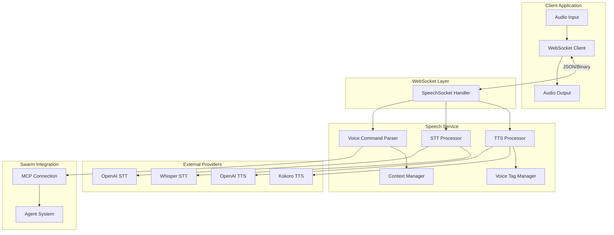
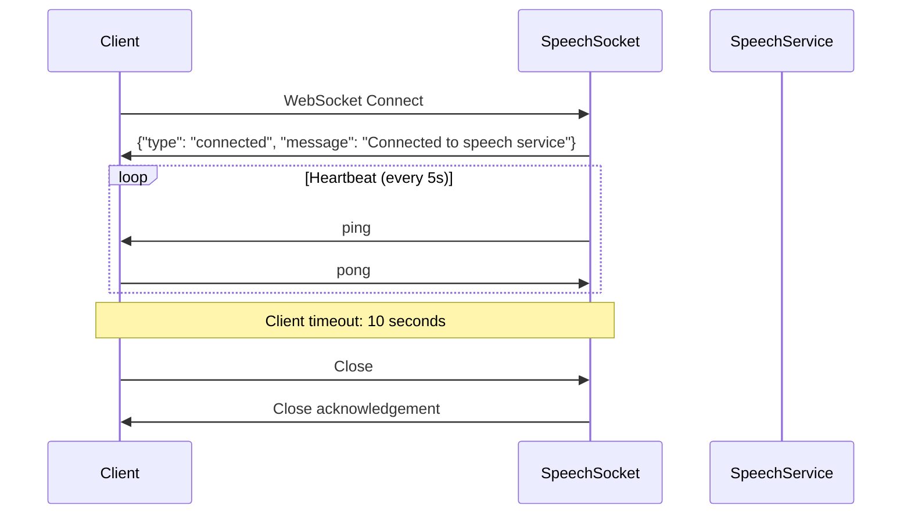
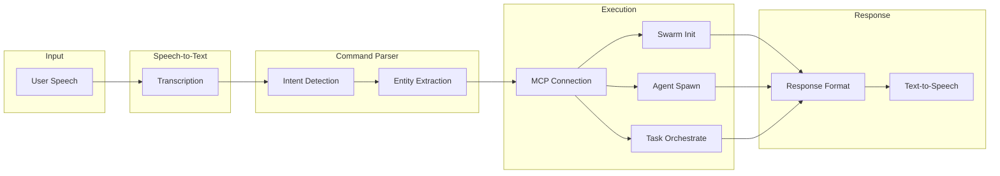
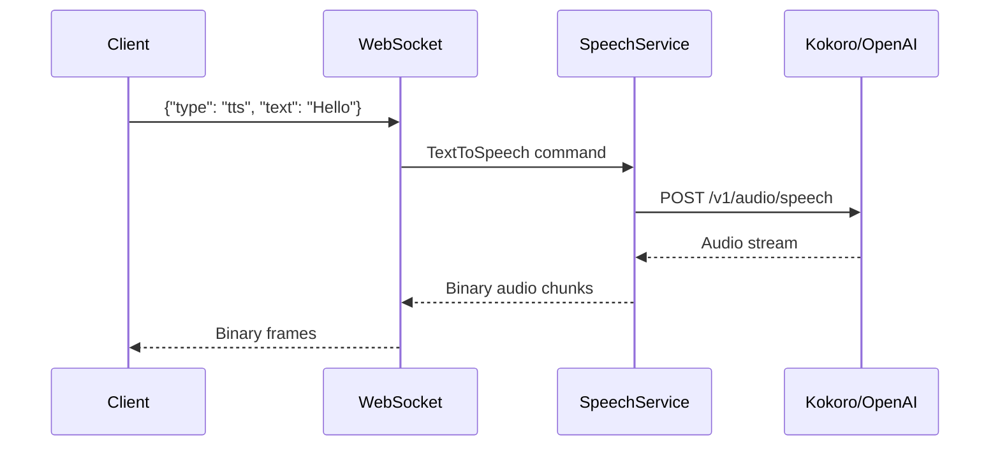
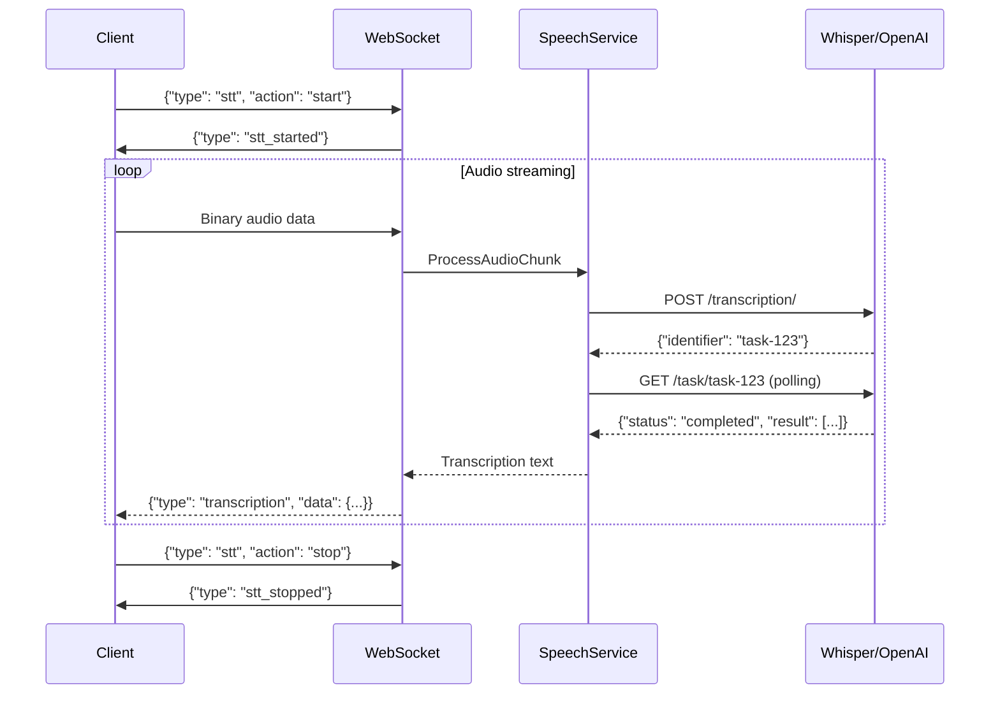
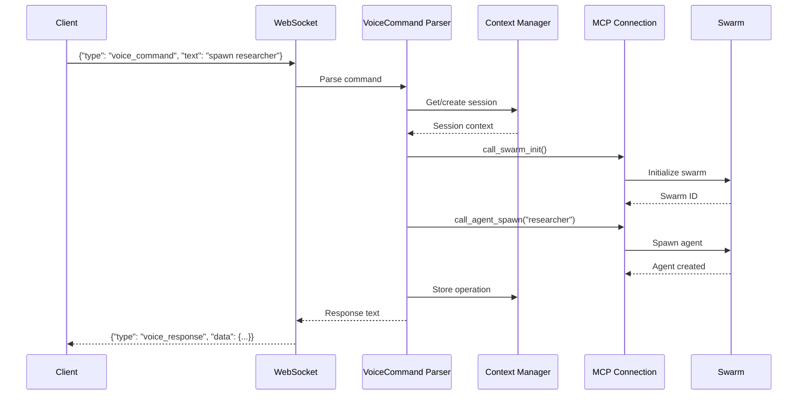
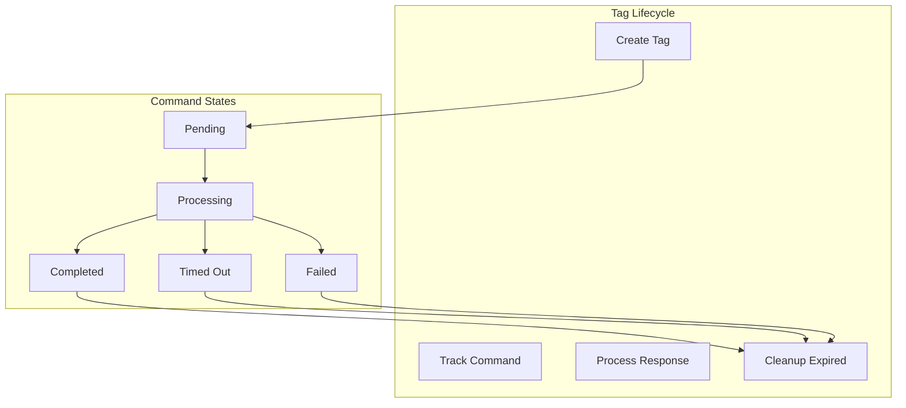

# Voice System Integration Guide

This guide explains how to integrate with VisionFlow's voice system for speech-to-text (STT), text-to-speech (TTS), and voice command processing.

## Overview

VisionFlow provides a comprehensive voice system that enables:

- **Text-to-Speech (TTS)**: Convert text responses to audio using Kokoro or OpenAI
- **Speech-to-Text (STT)**: Transcribe audio input using Whisper or OpenAI
- **Voice Commands**: Natural language commands for swarm orchestration
- **Conversation Context**: Multi-turn voice interactions with session persistence

## Architecture



## WebSocket Connection

### Endpoint

Connect to the speech WebSocket endpoint:

```
ws://<host>:<port>/ws/speech
```

### Connection Lifecycle



## Message Types

### Text-to-Speech (TTS)

Convert text to audio output.

**Request:**

```json
{
  "type": "tts",
  "text": "Hello, how can I help you today?",
  "voice": "af_sarah",
  "speed": 1.0,
  "stream": true
}
```

| Field | Type | Required | Description |
|-------|------|----------|-------------|
| `type` | string | Yes | Must be `"tts"` |
| `text` | string | Yes | Text to synthesize |
| `voice` | string | No | Voice identifier (default: `af_sarah`) |
| `speed` | float | No | Playback speed multiplier (default: `1.0`) |
| `stream` | boolean | No | Enable streaming audio (default: `true`) |

**Response:**

Audio data is sent as binary WebSocket frames.

**Error Response:**

```json
{
  "type": "error",
  "message": "Failed to process TTS request: <error details>"
}
```

### Speech-to-Text (STT)

Start or stop audio transcription.

**Start Transcription:**

```json
{
  "type": "stt",
  "action": "start",
  "language": "en",
  "model": "whisper-1"
}
```

| Field | Type | Required | Description |
|-------|------|----------|-------------|
| `type` | string | Yes | Must be `"stt"` |
| `action` | string | Yes | `"start"` or `"stop"` |
| `language` | string | No | Language code (e.g., `"en"`, `"es"`) |
| `model` | string | No | Model identifier |

**Response:**

```json
{
  "type": "stt_started",
  "message": "Transcription started"
}
```

**Stop Transcription:**

```json
{
  "type": "stt",
  "action": "stop"
}
```

**Transcription Result:**

```json
{
  "type": "transcription",
  "data": {
    "text": "Spawn a researcher agent",
    "isFinal": true,
    "timestamp": 1704067200000
  }
}
```

### Audio Data

Send raw audio data as binary WebSocket frames. The system auto-detects the format:

| Format | Header Bytes | MIME Type |
|--------|--------------|-----------|
| WebM | `0x1A 0x45 0xDF 0xA3` | `audio/webm` |
| WAV | `0x52 0x49 0x46 0x46` (RIFF) | `audio/wav` |

### Voice Commands

Send natural language commands to control the swarm.

**Request:**

```json
{
  "type": "voice_command",
  "text": "spawn a researcher agent",
  "sessionId": "abc123-session-id",
  "respondViaVoice": true
}
```

| Field | Type | Required | Description |
|-------|------|----------|-------------|
| `type` | string | Yes | Must be `"voice_command"` |
| `text` | string | Yes | Natural language command |
| `sessionId` | string | No | Session for context continuity |
| `respondViaVoice` | boolean | No | Send response via TTS |

**Response:**

```json
{
  "type": "voice_response",
  "data": {
    "text": "Successfully spawned researcher agent in swarm default-swarm.",
    "isFinal": true,
    "timestamp": 1704067200000
  }
}
```

## Voice Command Processing



### Supported Intents

| Intent | Keywords | Example |
|--------|----------|---------|
| **Spawn Agent** | spawn, add agent | "spawn a researcher agent" |
| **Query Status** | status | "what's the status of all agents" |
| **List Agents** | list agents, show agents | "list all agents" |
| **Stop Agent** | stop agent, remove agent | "stop the researcher agent" |
| **Execute Task** | execute, run | "execute code review task" |
| **Add Node** | add node | "add node called authentication" |
| **Help** | help | "help" |

### Agent Types

Recognized agent types for spawning:

- `researcher`
- `coder`
- `analyst`
- `coordinator`
- `optimizer`

## Configuration

### Kokoro TTS Settings

```json
{
  "kokoro": {
    "apiUrl": "http://kokoro-tts-container:8880",
    "defaultVoice": "af_sarah",
    "defaultFormat": "mp3",
    "defaultSpeed": 1.0,
    "timeout": 30000,
    "stream": true,
    "returnTimestamps": false,
    "sampleRate": 24000
  }
}
```

| Field | Type | Default | Description |
|-------|------|---------|-------------|
| `apiUrl` | string | `http://kokoro-tts-container:8880` | Kokoro API endpoint |
| `defaultVoice` | string | `af_sarah` | Default voice for synthesis |
| `defaultFormat` | string | `mp3` | Audio output format |
| `defaultSpeed` | float | `1.0` | Default playback speed |
| `timeout` | integer | `30000` | Request timeout (ms) |
| `stream` | boolean | `true` | Enable streaming mode |

### Whisper STT Settings

```json
{
  "whisper": {
    "apiUrl": "http://whisper-webui-backend:8000",
    "defaultModel": "whisper-1",
    "defaultLanguage": "en",
    "timeout": 30000,
    "temperature": 0.0,
    "vadFilter": true,
    "wordTimestamps": false,
    "initialPrompt": null
  }
}
```

| Field | Type | Default | Description |
|-------|------|---------|-------------|
| `apiUrl` | string | `http://whisper-webui-backend:8000` | Whisper API endpoint |
| `defaultModel` | string | `whisper-1` | Transcription model |
| `defaultLanguage` | string | `en` | Default language |
| `temperature` | float | `0.0` | Sampling temperature |
| `vadFilter` | boolean | `true` | Voice activity detection |
| `wordTimestamps` | boolean | `false` | Include word timing |

### OpenAI Settings

```json
{
  "openai": {
    "apiKey": "sk-...",
    "model": "gpt-4o"
  }
}
```

OpenAI can be used for both TTS and STT as an alternative to Kokoro/Whisper.

## Integration Examples

### JavaScript/TypeScript Client

```typescript
class VoiceClient {
  private ws: WebSocket;
  private audioContext: AudioContext;

  constructor(url: string) {
    this.ws = new WebSocket(url);
    this.audioContext = new AudioContext();

    this.ws.onopen = () => {
      console.log('Connected to speech service');
    };

    this.ws.onmessage = (event) => {
      if (event.data instanceof Blob) {
        // Binary audio data
        this.playAudio(event.data);
      } else {
        // JSON message
        const msg = JSON.parse(event.data);
        this.handleMessage(msg);
      }
    };
  }

  // Send text-to-speech request
  speak(text: string, options?: { voice?: string; speed?: number }) {
    this.ws.send(JSON.stringify({
      type: 'tts',
      text,
      voice: options?.voice ?? 'af_sarah',
      speed: options?.speed ?? 1.0,
      stream: true
    }));
  }

  // Start transcription
  startListening(language?: string) {
    this.ws.send(JSON.stringify({
      type: 'stt',
      action: 'start',
      language: language ?? 'en'
    }));
  }

  // Stop transcription
  stopListening() {
    this.ws.send(JSON.stringify({
      type: 'stt',
      action: 'stop'
    }));
  }

  // Send audio chunk
  sendAudio(audioData: ArrayBuffer) {
    this.ws.send(audioData);
  }

  // Send voice command
  sendCommand(text: string, sessionId?: string) {
    this.ws.send(JSON.stringify({
      type: 'voice_command',
      text,
      sessionId,
      respondViaVoice: true
    }));
  }

  private handleMessage(msg: any) {
    switch (msg.type) {
      case 'connected':
        console.log('Speech service ready');
        break;
      case 'transcription':
        console.log('Transcribed:', msg.data.text);
        break;
      case 'voice_response':
        console.log('Response:', msg.data.text);
        break;
      case 'error':
        console.error('Error:', msg.message);
        break;
    }
  }

  private async playAudio(blob: Blob) {
    const arrayBuffer = await blob.arrayBuffer();
    const audioBuffer = await this.audioContext.decodeAudioData(arrayBuffer);
    const source = this.audioContext.createBufferSource();
    source.buffer = audioBuffer;
    source.connect(this.audioContext.destination);
    source.start();
  }
}

// Usage
const voice = new VoiceClient('ws://localhost:8080/ws/speech');

// Text-to-speech
voice.speak('Hello, I am ready to help you manage your agents.');

// Voice command
voice.sendCommand('spawn a researcher agent', 'session-123');

// Start listening for voice input
voice.startListening('en');
```

### Recording Audio in Browser

```typescript
async function startRecording(voiceClient: VoiceClient) {
  const stream = await navigator.mediaDevices.getUserMedia({ audio: true });
  const mediaRecorder = new MediaRecorder(stream, {
    mimeType: 'audio/webm;codecs=opus'
  });

  mediaRecorder.ondataavailable = async (event) => {
    if (event.data.size > 0) {
      const arrayBuffer = await event.data.arrayBuffer();
      voiceClient.sendAudio(arrayBuffer);
    }
  };

  // Start transcription on server
  voiceClient.startListening();

  // Record in chunks
  mediaRecorder.start(250); // 250ms chunks

  return {
    stop: () => {
      mediaRecorder.stop();
      voiceClient.stopListening();
      stream.getTracks().forEach(track => track.stop());
    }
  };
}
```

## Data Flow

### TTS Data Flow



### STT Data Flow



### Voice Command Flow



## Voice Tag System

The voice tag system enables tracking voice commands through the agent system:



Tags enable:
- Correlation of voice commands with agent responses
- Automatic TTS routing for responses
- Session-based context preservation
- Timeout and cleanup management

## Session Management

Voice sessions maintain conversation context:

```json
{
  "sessionId": "abc123",
  "userId": "user-456",
  "conversationHistory": [
    ["spawn a researcher agent", "Successfully spawned researcher agent."],
    ["what's the status", "System status: 1 agent active."]
  ],
  "currentAgents": ["researcher"],
  "pendingOperations": [],
  "turnCount": 2
}
```

Sessions automatically:
- Track conversation history
- Remember spawned agents
- Monitor pending operations
- Expire after 2 hours of inactivity

## Troubleshooting

### Connection Issues

| Symptom | Cause | Solution |
|---------|-------|----------|
| WebSocket disconnect | Heartbeat timeout | Ensure client responds to pings within 10s |
| "Speech service not available" | Service not initialized | Check that `speech_service` is configured in app state |
| Connection refused | Wrong endpoint | Verify WebSocket URL `/ws/speech` |

### TTS Issues

| Symptom | Cause | Solution |
|---------|-------|----------|
| "Kokoro API error" | API unreachable | Check Kokoro container is running |
| No audio output | Stream not enabled | Set `stream: true` in request |
| Invalid voice | Unknown voice ID | Use supported voice like `af_sarah` |

### STT Issues

| Symptom | Cause | Solution |
|---------|-------|----------|
| "Whisper API error" | API unreachable | Check Whisper container is running |
| No transcription | Audio format | Ensure WebM or WAV format |
| Timeout polling | Long audio | Increase timeout or send shorter chunks |

### Voice Command Issues

| Symptom | Cause | Solution |
|---------|-------|----------|
| "Could not determine agent type" | Missing keyword | Include agent type in command |
| "Unknown message type" | Invalid `type` field | Use `tts`, `stt`, or `voice_command` |
| MCP connection failed | Network issue | Check MCP_HOST and MCP_TCP_PORT env vars |

## Environment Variables

| Variable | Default | Description |
|----------|---------|-------------|
| `MCP_HOST` | `multi-agent-container` | MCP server hostname |
| `MCP_TCP_PORT` | `9500` | MCP server port |

## Related Documentation

- [Swarm Orchestration Guide](/docs/guides/features/swarm-orchestration.md)
- [WebSocket API Reference](/docs/api/websocket.md)
- [Configuration Reference](/docs/reference/configuration.md)
