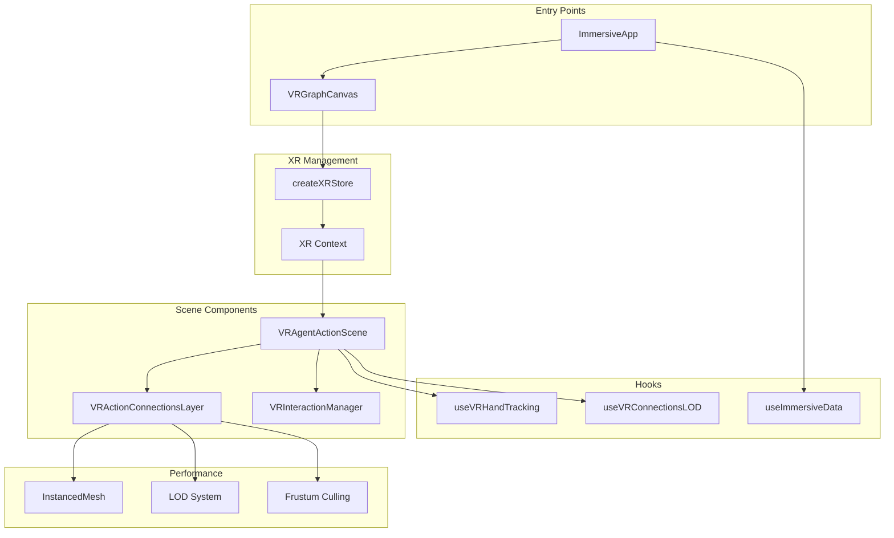
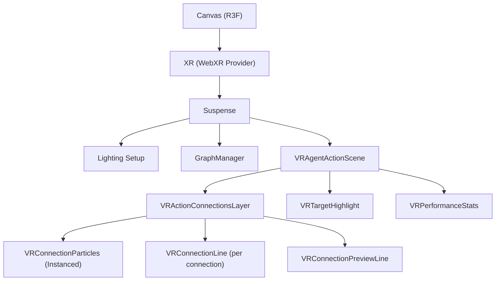
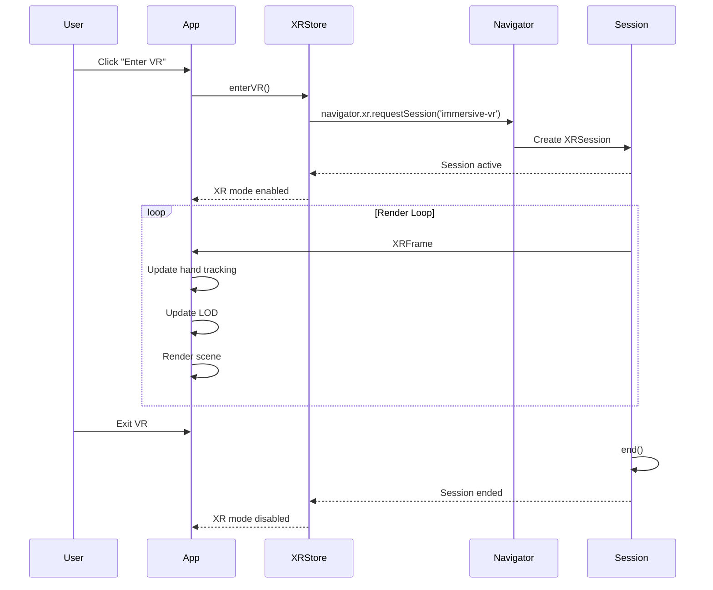
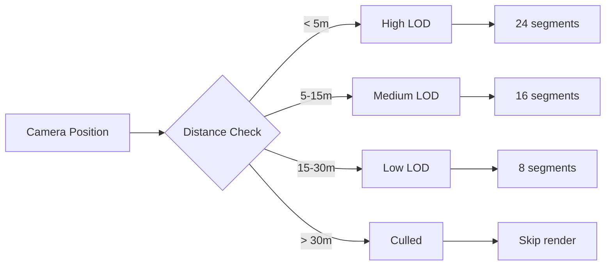

# VR/WebXR Development Guide

This guide covers VisionFlow's VR/WebXR implementation for immersive graph visualization, targeting Meta Quest 3 at 72fps.

## Overview

VisionFlow's VR system is built on:
- **@react-three/fiber** - React renderer for Three.js
- **@react-three/xr** - WebXR integration with React Three Fiber
- **Three.js** - 3D rendering engine

The architecture prioritizes performance through LOD (Level of Detail) management, instanced rendering, and aggressive culling.

## Architecture



## Component Hierarchy



## WebXR Session Lifecycle

### Session Initialization

```typescript
import { createXRStore, XR } from '@react-three/xr';

// Create XR store outside component to persist across renders
const xrStore = createXRStore({
  hand: true,      // Enable hand tracking
  controller: true, // Enable controller support
});
```

### Session Flow



### Checking VR Support

```typescript
// Check VR support on mount
React.useEffect(() => {
  if (navigator.xr) {
    navigator.xr.isSessionSupported('immersive-vr').then(setIsVRSupported);
  } else {
    setIsVRSupported(false);
  }
}, []);
```

### Entering VR

```tsx
{isVRSupported && (
  <button onClick={() => xrStore.enterVR()}>
    Enter VR
  </button>
)}

<Canvas>
  <XR store={xrStore}>
    {/* VR-aware content */}
  </XR>
</Canvas>
```

## Hand Tracking

### useVRHandTracking Hook

The `useVRHandTracking` hook manages hand/controller state and target detection.

```typescript
import { useVRHandTracking } from '../hooks/useVRHandTracking';

const {
  primaryHand,      // Right hand state
  secondaryHand,    // Left hand state
  targetedNode,     // Currently targeted node
  previewStart,     // Ray start position
  previewEnd,       // Ray end or target position
  showPreview,      // Whether to show preview line
  previewColor,     // Color based on targeting state
  updateHandState,  // Manual state updates
  setTargetNodes,   // Set available targets
  triggerHaptic,    // Trigger controller vibration
} = useVRHandTracking({
  maxRayDistance: 30,        // Max targeting distance (meters)
  targetRadius: 1.0,         // Hit detection radius
  activationThreshold: 0.7,  // Pinch strength threshold
  enableHaptics: true,       // Enable haptic feedback
});
```

### Hand State Interface

```typescript
interface HandState {
  position: THREE.Vector3;   // World position
  direction: THREE.Vector3;  // Pointing direction
  isTracking: boolean;       // Hand is detected
  isPointing: boolean;       // User is pointing gesture
  pinchStrength: number;     // 0-1 pinch intensity
}
```

### Target Detection

The hook uses raycasting with sphere intersection for efficient target detection:

```typescript
const findTargetAlongRay = (origin: Vector3, direction: Vector3): TargetNode | null => {
  raycaster.set(origin, direction);
  raycaster.far = maxRayDistance;

  for (const node of targetNodes) {
    const sphere = new THREE.Sphere(node.position, targetRadius);
    if (raycaster.ray.intersectSphere(sphere, intersectionPoint)) {
      // Found target
    }
  }
};
```

### Converting XR Input to Hand State

```typescript
import { xrControllerToHandState } from '../hooks/useVRHandTracking';

// In XR frame loop
const handState = xrControllerToHandState(controller, gamepad);
updateHandState('primary', handState);
```

## Controller Input Handling

### XR Events

Use `useXREvent` for controller input:

```typescript
import { useXREvent } from '@react-three/xr';

// Trigger/Select button
useXREvent('selectstart', (event) => {
  const inputSource = event.data as XRInputSource;
  if (inputSource?.handedness === 'right') {
    // Right trigger pressed
  }
}, { handedness: 'right' });

useXREvent('selectend', (event) => {
  // Trigger released
}, { handedness: 'right' });

// Grip/Squeeze button
useXREvent('squeezestart', (event) => {
  // Grip pressed
});

useXREvent('squeezeend', (event) => {
  // Grip released
});
```

### Button Mapping (Quest Controllers)

| Button | Index | Action |
|--------|-------|--------|
| Trigger | 0 | Select/Point |
| Grip | 1 | Grab/Squeeze |
| Thumbstick | 3 | Navigation |
| A/X | 4 | Action 1 |
| B/Y | 5 | Action 2 |

### Reading Gamepad State

```typescript
const gamepad = inputSource.gamepad;
if (gamepad) {
  const triggerPressed = gamepad.buttons[0]?.pressed;
  const triggerValue = gamepad.buttons[0]?.value; // 0-1
  const gripPressed = gamepad.buttons[1]?.pressed;
  const thumbstickX = gamepad.axes[2];
  const thumbstickY = gamepad.axes[3];
}
```

## VR Interaction Manager

The `VRInteractionManager` handles node selection and dragging:

```typescript
import { VRInteractionManager } from '../threejs/VRInteractionManager';

<VRInteractionManager
  nodes={nodeData}
  onNodeSelect={(nodeId) => console.log('Selected:', nodeId)}
  onNodeDrag={(nodeId, position) => updatePosition(nodeId, position)}
  onNodeRelease={(nodeId) => console.log('Released:', nodeId)}
  maxRayDistance={50}
/>
```

## Level of Detail (LOD) System

### useVRConnectionsLOD Hook

Manages geometry complexity based on distance to maintain 72fps:

```typescript
import { useVRConnectionsLOD } from '../hooks/useVRConnectionsLOD';

const {
  getLODLevel,          // Get LOD for position
  updateCameraPosition, // Update camera (call in useFrame)
  isVisible,            // Check if position is visible
  getSegmentCounts,     // Get geometry segments
  resetCache,           // Clear cache (on teleport)
} = useVRConnectionsLOD({
  highDistance: 5,      // Full detail < 5m
  mediumDistance: 15,   // Reduced 5-15m
  lowDistance: 30,      // Minimal 15-30m
  updateInterval: 2,    // Recalculate every 2 frames
  aggressiveCulling: false,
});
```

### LOD Levels

| Level | Distance | Curve Segments | Sphere Segments |
|-------|----------|----------------|-----------------|
| high | < 5m | 24 | 12 |
| medium | 5-15m | 16 | 8 |
| low | 15-30m | 8 | 6 |
| culled | > 30m | 0 (not rendered) | 0 |

### LOD Flow



### Calculating Optimal Thresholds

```typescript
import { calculateOptimalThresholds } from '../hooks/useVRConnectionsLOD';

// Adjust based on device and connection count
const config = calculateOptimalThresholds(72, connectionCount);
// Returns optimized distances and aggressiveCulling flag
```

## Performance Optimization

### Instanced Rendering

Use `InstancedMesh` for particles (single draw call):

```typescript
<instancedMesh
  ref={meshRef}
  args={[geometry, material, maxInstances]}
  frustumCulled={true}
>
  <sphereGeometry args={[0.15, 8, 8]} />
  <meshBasicMaterial transparent depthWrite={false} />
</instancedMesh>
```

### Frame Updates

```typescript
useFrame(() => {
  // Update instance transforms
  for (let i = 0; i < instances; i++) {
    dummy.position.copy(positions[i]);
    dummy.updateMatrix();
    meshRef.current.setMatrixAt(i, dummy.matrix);
  }
  meshRef.current.instanceMatrix.needsUpdate = true;
});
```

### Performance Guidelines

| Technique | Impact | Implementation |
|-----------|--------|----------------|
| Instanced Mesh | High | Single draw call for all particles |
| LOD | High | Reduce geometry at distance |
| Frustum Culling | Medium | Skip off-screen objects |
| Squared Distances | Low | Avoid sqrt in distance checks |
| Frame Skipping | Medium | Update LOD every 2 frames |
| Depth Write Off | Low | Prevent z-fighting in stereo |

### Performance Targets

| Metric | Target |
|--------|--------|
| Frame Rate | 72fps stable |
| Max Connections | 20 active |
| Draw Calls | < 50 |
| Triangles | < 100k |

### Opacity Scaling

Reduce opacity when many connections are active:

```typescript
const opacity = useMemo(() => {
  if (activeCount > 18) return 0.6;
  if (activeCount > 12) return 0.8;
  return 1.0;
}, [activeCount]);
```

## Complete VR Scene Example

```tsx
import React from 'react';
import { Canvas } from '@react-three/fiber';
import { createXRStore, XR } from '@react-three/xr';
import { VRAgentActionScene } from '../threejs/VRAgentActionScene';

const xrStore = createXRStore({
  hand: true,
  controller: true,
});

export function MyVRScene({ agents }) {
  const [vrSupported, setVrSupported] = React.useState(false);

  React.useEffect(() => {
    navigator.xr?.isSessionSupported('immersive-vr')
      .then(setVrSupported);
  }, []);

  return (
    <>
      {vrSupported && (
        <button onClick={() => xrStore.enterVR()}>
          Enter VR
        </button>
      )}

      <Canvas
        gl={{ antialias: true, alpha: false }}
        camera={{ position: [0, 1.6, 3], fov: 70 }}
      >
        <XR store={xrStore}>
          <ambientLight intensity={0.5} />
          <pointLight position={[10, 10, 10]} />

          <VRAgentActionScene
            agents={agents}
            maxConnections={20}
            baseDuration={500}
            enableHandTracking={true}
            showStats={false}
            onAgentSelected={(id) => console.log('Selected:', id)}
          />
        </XR>
      </Canvas>
    </>
  );
}
```

## Supported Devices

### Primary Target

| Device | Support Level | Notes |
|--------|--------------|-------|
| Meta Quest 3 | Full | Primary target, 72fps |
| Meta Quest 2 | Full | May need aggressive culling |
| Meta Quest Pro | Full | Enhanced hand tracking |

### Secondary Support

| Device | Support Level | Notes |
|--------|--------------|-------|
| Valve Index | Partial | Controller only |
| HTC Vive | Partial | Controller only |
| Windows MR | Basic | Limited testing |

### Browser Requirements

- Chrome 79+ (WebXR)
- Edge 79+
- Meta Quest Browser
- Firefox Reality

### Feature Detection

```typescript
// Check for WebXR support
const hasWebXR = 'xr' in navigator;

// Check for hand tracking
const hasHandTracking = await navigator.xr
  ?.isSessionSupported('immersive-vr', {
    requiredFeatures: ['hand-tracking']
  });
```

## Debugging

### Performance Stats

Enable the stats overlay:

```tsx
<VRAgentActionScene
  showStats={true}
  debug={true}
/>
```

### LOD Distribution

```typescript
import { getLODDistribution } from '../hooks/useVRConnectionsLOD';

const distribution = getLODDistribution(levels);
// { high: 5, medium: 8, low: 3, culled: 4 }
```

### Remote Logging

The `ImmersiveApp` component includes remote logging for Quest debugging:

```typescript
import { remoteLogger } from '../../services/remoteLogger';

// Log XR info on Quest devices
remoteLogger.logXRInfo();
```

## File Structure

```
client/src/immersive/
├── components/
│   └── ImmersiveApp.tsx         # Main entry point
├── hooks/
│   ├── index.ts                 # Hook exports
│   ├── useImmersiveData.ts      # Graph data subscription
│   ├── useVRConnectionsLOD.ts   # LOD management
│   └── useVRHandTracking.ts     # Hand/controller tracking
└── threejs/
    ├── index.ts                 # Component exports
    ├── VRGraphCanvas.tsx        # Main VR canvas
    ├── VRAgentActionScene.tsx   # Agent visualization scene
    ├── VRActionConnectionsLayer.tsx # Connection rendering
    └── VRInteractionManager.tsx # Node interaction
```

## Key APIs Reference

### VRGraphCanvas Props

| Prop | Type | Default | Description |
|------|------|---------|-------------|
| graphData | GraphData | required | Graph nodes and edges |
| onDragStateChange | (boolean) => void | - | Drag state callback |
| enableAgentActions | boolean | true | Show agent actions |
| showStats | boolean | false | Performance overlay |

### VRAgentActionScene Props

| Prop | Type | Default | Description |
|------|------|---------|-------------|
| agents | AgentData[] | [] | Agent node data |
| maxConnections | number | 20 | Max active connections |
| baseDuration | number | 500 | Animation duration (ms) |
| enableHandTracking | boolean | true | Enable hand input |
| showStats | boolean | false | Performance overlay |
| onAgentTargeted | (string) => void | - | Targeting callback |
| onAgentSelected | (string) => void | - | Selection callback |
| debug | boolean | false | Debug visualizations |

### VRHandTrackingConfig

| Option | Type | Default | Description |
|--------|------|---------|-------------|
| maxRayDistance | number | 30 | Ray length in meters |
| targetRadius | number | 1.0 | Hit detection radius |
| activationThreshold | number | 0.7 | Pinch threshold (0-1) |
| enableHaptics | boolean | true | Controller vibration |

### VRConnectionsLODConfig

| Option | Type | Default | Description |
|--------|------|---------|-------------|
| highDistance | number | 5 | High LOD threshold (m) |
| mediumDistance | number | 15 | Medium LOD threshold (m) |
| lowDistance | number | 30 | Low LOD threshold (m) |
| updateInterval | number | 2 | Frames between updates |
| aggressiveCulling | boolean | false | Extra culling for low-end |
