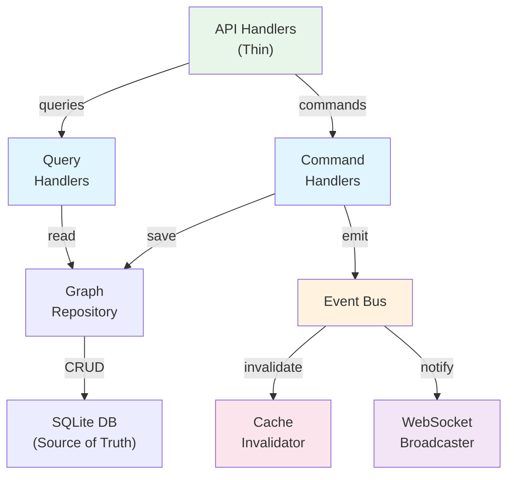

# GraphServiceActor Migration Guide

**Status**: 🔄 IN PROGRESS (November 2025)
**Target Completion**: December 2025
**Deprecation Date**: November 2025
**Last Updated**: November 4, 2025

---

## Executive Summary

The monolithic **GraphServiceActor** (48,000+ tokens, 4,614 lines) is being replaced with a **hexagonal CQRS architecture** that provides:

- ✅ **Separated concerns** - Commands ≠ Queries
- ✅ **Event-driven cache invalidation** - No stale data
- ✅ **Better testability** - Pure functions instead of actor messages
- ✅ **Horizontal scalability** - Event replay and distributed processing

### Migration Status

| Phase | Component | Status | Target Date |
|-------|-----------|--------|-------------|
| **Phase 1** | Query Handlers (8 handlers) | ✅ COMPLETE | Nov 2024 |
| **Phase 2** | Command Handlers (directives) | 🔄 IN PROGRESS | Jan 2025 |
| **Phase 3** | Event Bus (cache invalidation) | ⏳ PLANNED | Jan 2025 |
| **Phase 4** | Actor Removal | ⏳ PLANNED | Feb 2025 |

---

## The Problem with GraphServiceActor

### Cache Coherency Bug ❌

After GitHub sync writes 316 nodes to SQLite database:
- **Database**: ✅ Contains 316 nodes (correct)
- **GraphServiceActor cache**: ❌ Shows only 63 nodes (STALE)
- **API Response**: ❌ Returns stale 63 nodes to clients

**Root Cause**: No cache invalidation mechanism when database is updated externally.

### Monolithic Responsibilities

```rust
pub struct GraphServiceActor {
    graph-data: Arc<RwLock<GraphData>>,           // ← In-memory cache (STALE!)
    bots-graph-data: Arc<RwLock<GraphData>>,      // ← Separate cache
    simulation-params: Arc<RwLock<SimulationParams>>,
    ws-server: Option<Addr<WebSocketServer>>,    // ← Tight coupling
    physics-engine: Option<Addr<PhysicsEngine>>, // ← Mixed concerns
    // ... 50+ more fields mixing concerns
}
```

**Problems**:
1. 48K tokens - unmaintainable
2. Tightly coupled to WebSocket, Physics, AI systems
3. Cannot test graph logic without full actor setup
4. Single bottleneck for all operations
5. Cache stales when database is modified externally

---

## The Solution: Hexagonal CQRS Architecture

### Architecture Diagram



### Key Improvements

| Aspect | Before (GraphServiceActor) | After (CQRS) |
|--------|---------------------------|--------------|
| **Data Source** | Stale in-memory cache | Database (fresh always) |
| **Consistency** | Cache coherency bug | Event-driven invalidation |
| **Testing** | Needs actor setup | Pure functions |
| **Size** | 48,000 tokens | <500 tokens per handler |
| **Coupling** | Tightly coupled | Loosely coupled via events |
| **Scalability** | Single actor bottleneck | Horizontal scaling |
| **Operations** | All monolithic | Separated (Commands ≠ Queries) |

---

## Migration Patterns

### Pattern 1: Reading Graph Data (Query)

#### Before: ❌ DEPRECATED

```rust
// Old pattern: actor message
let graph-data = state.graph-service-addr
    .send(GetGraphData)
    .await??;
```

**Problems**:
- Returns stale data from in-memory cache
- Tightly coupled to actor infrastructure
- Cannot test without running actor

#### After: ✅ PRODUCTION

```rust
// New pattern: repository query
let graph = state.graph-repo
    .get-graph()
    .await?;
```

**Benefits**:
- Fresh data directly from database
- Testable without actor setup
- Can mock repository for tests

---

### Pattern 2: Updating Graph Data (Command)

#### Before: ❌ DEPRECATED

```rust
// Old pattern: send update to actor
state.graph-service-addr
    .send(UpdateGraphData {
        nodes: vec![...],
        edges: vec![...],
    })
    .await??;

// Then hope the cache invalidates...
```

**Problems**:
- Update reaches database BUT cache stays stale
- No guarantee cache will invalidate
- No way to know when update is complete

#### After: ✅ PRODUCTION

```rust
// New pattern: command handler with event emission
let result = state.graph-cmd-handler
    .handle-update-graph(UpdateGraphCommand {
        nodes: vec![...],
        edges: vec![...],
    })
    .await?;

// Handler automatically:
// 1. Saves to database
// 2. Emits GraphUpdated event
// 3. Event triggers cache invalidation
// 4. WebSocket broadcasts to clients
```

**Benefits**:
- Guaranteed database consistency
- Automatic cache invalidation via events
- Clients notified immediately
- Testable end-to-end

---

### Pattern 3: Broadcasting to Clients (WebSocket)

#### Before: ❌ DEPRECATED

```rust
// Coupling to WebSocket server
pub struct GraphServiceActor {
    ws-server: Option<Addr<WebSocketServer>>,
}

// In message handler:
self.ws-server.do-send(Broadcast {
    data: serialized-graph,
}).ok();
```

**Problems**:
- Actor directly coupled to WebSocket server
- If WebSocket server isn't running, broadcasts fail silently
- Hard to test without both actor and WebSocket server running

#### After: ✅ PRODUCTION

```rust
// Event-driven broadcasting
pub async fn handle-update-graph(
    cmd: UpdateGraphCommand,
) -> Result<UpdateGraphResponse> {
    let graph = repo.update(cmd.into()).await?;

    // Emit event - subscribers handle broadcasting
    event-bus.emit(GraphUpdated {
        graph: graph.clone(),
        timestamp: Utc::now(),
    }).await?;

    Ok(UpdateGraphResponse { graph })
}

// In WebSocket broadcaster (subscribes to events):
event-bus.subscribe(|event: GraphUpdated| {
    ws-server.broadcast(ClientMessage::GraphUpdated {
        graph: event.graph,
    });
});
```

**Benefits**:
- Loose coupling via events
- WebSocket optional (broadcasts still work without it)
- Easy to test - can mock event bus
- Multiple subscribers possible (WebSocket, logging, metrics, etc.)

---

## Current Implementation Status

### Phase 1: ✅ Query Handlers (COMPLETE)

**8 Query Handlers** now available in `src/handlers/graph-query-handlers/`:

1. `GetGraphData` - Fetch complete graph
2. `GetNodeById` - Fetch specific node
3. `GetEdgeById` - Fetch specific edge
4. `SearchNodes` - Search by properties
5. `GetGraphStats` - Compute graph statistics
6. `GetPhysicsState` - Current physics simulation state
7. `GetSemanticConstraints` - Ontology-derived constraints
8. `ValidateGraphConsistency` - Integrity checks

**Usage**:
```rust
// In handler:
let nodes = state.graph-query-handlers
    .get-graph-data
    .handle(GetGraphData::default())
    .await?;
```

### Phase 2: 🔄 Command Handlers (IN PROGRESS)

**Command Handlers** being implemented for:

1. `CreateNode` - Add new node to graph
2. `UpdateNode` - Modify node properties
3. `DeleteNode` - Remove node and cleanup edges
4. `CreateEdge` - Add relationship between nodes
5. `UpdateEdge` - Modify edge properties
6. `DeleteEdge` - Remove relationship
7. `BatchUpdate` - Transaction-like multi-operation
8. `SyncGitHub` - Import nodes from external sync

**Expected Completion**: January 2025

### Phase 3: ⏳ Event Bus (PLANNED)

**Event Infrastructure**:
- Event traits for all operations
- Subscriber registration
- Cache invalidation handlers
- WebSocket broadcast subscribers
- Persistence/audit logging

**Expected Completion**: January 2025

### Phase 4: ⏳ GraphServiceActor Removal (PLANNED)

- Migrate remaining actor-only features
- Remove GraphServiceActor completely
- Delete actor message types
- Full CQRS architecture in production

**Expected Completion**: February 2025

---

## Migration Checklist for Developers

### When Working with Graph Data

- [ ] **Queries**: Use `state.graph-query-handlers.get-X.handle()`
- [ ] **Updates**: Wait for command handlers (Phase 2), use TransitionalGraphSupervisor until then
- [ ] **Broadcasting**: Let event bus handle it, don't call WebSocket server directly
- [ ] **Testing**: Use repository mocks instead of actor mocks
- [ ] **Logging**: Use event subscribers instead of actor side-effects

### When Creating New Features

- [ ] **Don't** create new GraphServiceActor message types
- [ ] **Don't** add logic to GraphServiceActor
- [ ] **Do** create a new command/query handler if adding functionality
- [ ] **Do** emit events for side-effects (broadcasting, caching, etc.)
- [ ] **Do** use event subscribers for notifications

### Code Review Checklist

When reviewing PRs that touch graph operations:

- [ ] No new GraphServiceActor messages (flag as technical debt)
- [ ] Queries using handlers, not actor
- [ ] Events emitted for all mutations
- [ ] WebSocket broadcasts via event bus, not direct actor calls
- [ ] Tests don't require actor setup
- [ ] No in-memory caches (use database as source of truth)

---

## Troubleshooting

### Problem: Graph data is stale

**Symptoms**:
- API returns old data after update
- WebSocket notifications not sent
- Multiple requests show inconsistent data

**Solution**:
- Check that command handlers are used for updates
- Verify event bus is emitting events
- Check that cache invalidator is subscribed to events
- Query directly from database using repository

### Problem: WebSocket not receiving updates

**Symptoms**:
- Updates succeed but clients don't get notified
- Other clients see stale data

**Solution**:
- Use event-driven broadcasting, don't call WebSocket directly
- Check event bus subscription for WebSocket handler
- Verify broadcast message serialization

### Problem: Test failures with graph operations

**Symptoms**:
- Tests fail when running with GraphServiceActor
- Flaky tests with timing issues

**Solution**:
- Use repository mocks instead of actor mocks
- Don't require actor setup in tests
- Use in-memory repository implementation
- Await command results explicitly

---

## Timeline and Rollout

### Phase 1: Query Handlers ✅ DONE
- **Timeline**: November 2024
- **Status**: All 8 handlers implemented
- **Impact**: Queries no longer hit stale cache
- **Breaking Change**: No (backwards compatible)

### Phase 2: Command Handlers 🔄 ACTIVE
- **Timeline**: December 2024 - January 2025
- **Status**: In development
- **Impact**: Updates guaranteed to invalidate cache
- **Breaking Change**: No (parallel with TransitionalGraphSupervisor)

### Phase 3: Event Bus ⏳ PLANNING
- **Timeline**: January 2025
- **Status**: Architecture review stage
- **Impact**: All side-effects via events
- **Breaking Change**: No (backward compatible)

### Phase 4: Removal ⏳ PLANNING
- **Timeline**: February 2025
- **Status**: Planned after Phase 3
- **Impact**: GraphServiceActor completely removed
- **Breaking Change**: Yes (final deprecation)

---

## Resources

### Documentation
- [Hexagonal CQRS Architecture](/docs/concepts/architecture/hexagonal-cqrs-architecture.md) - Detailed architecture design
- [Architecture Overview](/docs/concepts/architecture/00-ARCHITECTURE-overview.md) - Current implementation
- [GPU Communication Flow](/docs/gpu/communication-flow.md) - Physics integration patterns

### Code References
- Query handlers: `src/handlers/graph-query-handlers/`
- Repository: `src/repositories/unified-graph-repository.rs`
- Event bus: `src/events/` (Phase 3)
- TransitionalGraphSupervisor: `src/actors/transitional-supervisor.rs` (bridge pattern)

### Related Deprecations
- [Neo4j Settings Migration](/docs/guides/neo4j-migration.md) - Similar deprecation pattern
- [Deprecation Strategy Index](/docs/deprecation-strategy-index.md) - General deprecation guidelines

---

## FAQ

**Q: When will GraphServiceActor be removed?**
A: February 2025, after all command handlers and event bus are complete.

**Q: Can I still use GraphServiceActor?**
A: Yes, but use TransitionalGraphSupervisor wrapper. Don't add new code that depends on it directly.

**Q: What about existing code using GraphServiceActor?**
A: Will be migrated during Phase 4. New code should use handlers.

**Q: How do I test without the actor?**
A: Mock the repository or query/command handlers. Avoid actor setup.

**Q: Will this break my code?**
A: Phase 1-3 are backward compatible. Phase 4 removal requires migration.

---

**Document Version**: 1.0
**Last Updated**: November 4, 2025
**Maintained By**: Architecture Team
**Related Issues**: GraphServiceActor cache coherency bug (nov-2024)
**Deprecation Status**: ⚠️ IN PROGRESS
