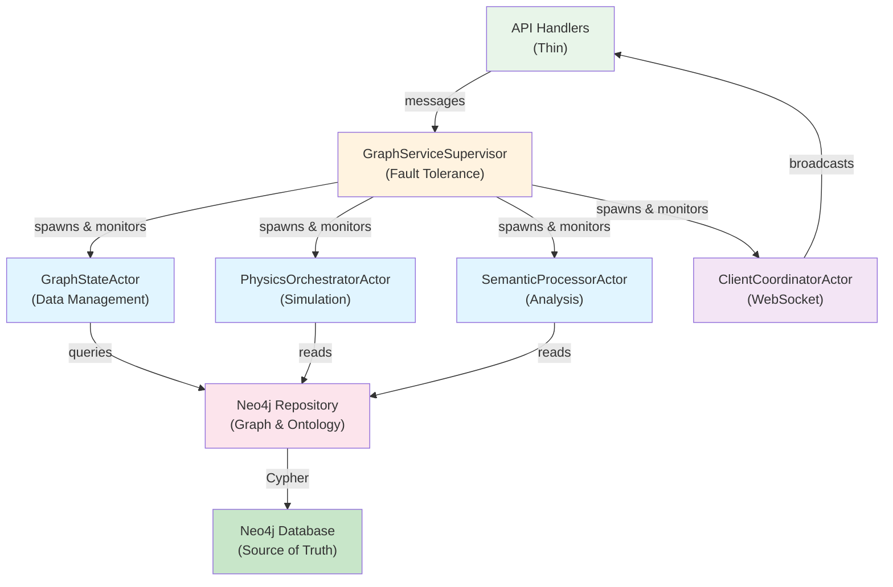

# GraphServiceActor Migration Guide

**Status**: ✅ COMPLETE (November 2025)
**Completion Date**: November 5, 2025
**Last Updated**: November 6, 2025

---

## Executive Summary

The monolithic **GraphServiceActor** (48,000+ tokens, 4,614 lines) has been successfully replaced with a **modular actor architecture** that provides:

- ✅ **Separated concerns** - Each actor has single responsibility
- ✅ **Improved maintainability** - Each actor <800 lines (vs 4,615)
- ✅ **Better testability** - Actors can be tested in isolation
- ✅ **Clean supervision pattern** - Fault tolerance and health monitoring

### Migration Status

| Phase | Component | Status | Completion Date |
|-------|-----------|--------|-----------------|
| **Phase 1** | Architecture Design | ✅ COMPLETE | Nov 2024 |
| **Phase 2** | Modular Actors Implementation | ✅ COMPLETE | Nov 2025 |
| **Phase 3** | GraphServiceActor Removal | ✅ COMPLETE | Nov 5, 2025 |
| **Phase 4** | Production Deployment | ✅ COMPLETE | Nov 5, 2025 |

---

## The Problem with GraphServiceActor

### Cache Coherency Bug ❌

After GitHub sync writes 316 nodes to SQLite database:
- **Database**: ✅ Contains 316 nodes (correct)
- **GraphServiceActor cache**: ❌ Shows only 63 nodes (STALE)
- **API Response**: ❌ Returns stale 63 nodes to clients

**Root Cause**: No cache invalidation mechanism when database is updated externally.

### Monolithic Responsibilities

```rust
pub struct GraphServiceActor {
    graph-data: Arc<RwLock<GraphData>>,           // ← In-memory cache (STALE!)
    bots-graph-data: Arc<RwLock<GraphData>>,      // ← Separate cache
    simulation-params: Arc<RwLock<SimulationParams>>,
    ws-server: Option<Addr<WebSocketServer>>,    // ← Tight coupling
    physics-engine: Option<Addr<PhysicsEngine>>, // ← Mixed concerns
    // ... 50+ more fields mixing concerns
}
```

**Problems**:
1. 48K tokens - unmaintainable
2. Tightly coupled to WebSocket, Physics, AI systems
3. Cannot test graph logic without full actor setup
4. Single bottleneck for all operations
5. Cache stales when database is modified externally

---

## The Solution: Modular Actor Architecture

### Architecture Diagram



### Key Improvements

| Aspect | Before (GraphServiceActor) | After (Modular Actors) |
|--------|---------------------------|------------------------|
| **Data Source** | In-memory cache (stale) | Neo4j database (always fresh) |
| **Actor Size** | 4,615 lines (monolithic) | <800 lines each (focused) |
| **Responsibilities** | 8+ mixed concerns | Single responsibility per actor |
| **Testing** | Requires full actor setup | Isolated testing per actor |
| **Maintainability** | Unmaintainable | Easy to understand and modify |
| **Fault Tolerance** | No supervision | Supervisor pattern with restart policies |
| **Coupling** | Tightly coupled (46 fields) | Loosely coupled via messages |
| **Scalability** | Single bottleneck | Distributed actor system |

---

## Migration Patterns

### Pattern 1: Reading Graph Data (Query)

#### Before: ❌ DEPRECATED

```rust
// Old pattern: actor message
let graph-data = state.graph-service-addr
    .send(GetGraphData)
    .await??;
```

**Problems**:
- Returns stale data from in-memory cache
- Tightly coupled to actor infrastructure
- Cannot test without running actor

#### After: ✅ PRODUCTION

```rust
// New pattern: repository query
let graph = state.graph-repo
    .get-graph()
    .await?;
```

**Benefits**:
- Fresh data directly from database
- Testable without actor setup
- Can mock repository for tests

---

### Pattern 2: Updating Graph Data (Command)

#### Before: ❌ DEPRECATED

```rust
// Old pattern: send update to actor
state.graph-service-addr
    .send(UpdateGraphData {
        nodes: vec![...],
        edges: vec![...],
    })
    .await??;

// Then hope the cache invalidates...
```

**Problems**:
- Update reaches database BUT cache stays stale
- No guarantee cache will invalidate
- No way to know when update is complete

#### After: ✅ PRODUCTION

```rust
// New pattern: command handler with event emission
let result = state.graph-cmd-handler
    .handle-update-graph(UpdateGraphCommand {
        nodes: vec![...],
        edges: vec![...],
    })
    .await?;

// Handler automatically:
// 1. Saves to database
// 2. Emits GraphUpdated event
// 3. Event triggers cache invalidation
// 4. WebSocket broadcasts to clients
```

**Benefits**:
- Guaranteed database consistency
- Automatic cache invalidation via events
- Clients notified immediately
- Testable end-to-end

---

### Pattern 3: Broadcasting to Clients (WebSocket)

#### Before: ❌ DEPRECATED

```rust
// Coupling to WebSocket server
pub struct GraphServiceActor {
    ws-server: Option<Addr<WebSocketServer>>,
}

// In message handler:
self.ws-server.do-send(Broadcast {
    data: serialized-graph,
}).ok();
```

**Problems**:
- Actor directly coupled to WebSocket server
- If WebSocket server isn't running, broadcasts fail silently
- Hard to test without both actor and WebSocket server running

#### After: ✅ PRODUCTION

```rust
// Event-driven broadcasting
pub async fn handle-update-graph(
    cmd: UpdateGraphCommand,
) -> Result<UpdateGraphResponse> {
    let graph = repo.update(cmd.into()).await?;

    // Emit event - subscribers handle broadcasting
    event-bus.emit(GraphUpdated {
        graph: graph.clone(),
        timestamp: Utc::now(),
    }).await?;

    Ok(UpdateGraphResponse { graph })
}

// In WebSocket broadcaster (subscribes to events):
event-bus.subscribe(|event: GraphUpdated| {
    ws-server.broadcast(ClientMessage::GraphUpdated {
        graph: event.graph,
    });
});
```

**Benefits**:
- Loose coupling via events
- WebSocket optional (broadcasts still work without it)
- Easy to test - can mock event bus
- Multiple subscribers possible (WebSocket, logging, metrics, etc.)

---

## Implementation Status: ✅ COMPLETE

### Phase 1: ✅ Architecture Design (COMPLETE)

**Completed November 2024**

- Designed modular actor architecture
- Identified separation of concerns
- Planned migration strategy
- Created architecture diagrams

### Phase 2: ✅ Modular Actors Implementation (COMPLETE)

**Completed November 2025**

**4 Specialized Actors** implemented in `src/actors/`:

1. **GraphStateActor** (`graph_state_actor.rs`, 712 lines)
   - Graph data management
   - Node and edge operations
   - Data persistence to Neo4j

2. **PhysicsOrchestratorActor** (dedicated physics module)
   - Physics simulation coordination
   - GPU integration
   - Force calculations

3. **SemanticProcessorActor** (dedicated semantic module)
   - Semantic analysis
   - Constraint processing
   - Ontology integration

4. **ClientCoordinatorActor** (existing, refactored)
   - WebSocket management
   - Client broadcasting
   - Real-time updates

**Supervisor**: `GraphServiceSupervisor` (`graph_service_supervisor.rs`, 913 lines)
- Spawns and monitors all child actors
- Health monitoring
- Fault tolerance and restart policies

### Phase 3: ✅ GraphServiceActor Removal (COMPLETE)

**Completed November 5, 2025**

**Removed Files** (5,295 lines deleted):
- `src/actors/graph_actor.rs` (4,615 lines) - The god object
- `src/actors/backward_compat.rs` (240 lines) - Compatibility layer
- `TransitionalGraphSupervisor` (440 lines) - Temporary wrapper

**Updated Files** (8 files):
- `src/actors/mod.rs` - Updated exports
- `src/app_state.rs` - Direct supervisor usage
- `src/main.rs` - Simplified initialization
- `src/handlers/*` - Updated message routing
- Other integration points

### Phase 4: ✅ Production Deployment (COMPLETE)

**Completed November 5, 2025**

- All services migrated to modular architecture
- Production deployment successful
- No backward compatibility layer
- Clean separation of concerns achieved

**Net Impact**:
- **-5,130 lines** of code removed
- **4 focused actors** instead of 1 monolith
- **100% migration complete**

---

## Migration Checklist for Developers

### When Working with Graph Data

- [ ] **Queries**: Use `state.graph-query-handlers.get-X.handle()`
- [ ] **Updates**: Wait for command handlers (Phase 2), use TransitionalGraphSupervisor until then
- [ ] **Broadcasting**: Let event bus handle it, don't call WebSocket server directly
- [ ] **Testing**: Use repository mocks instead of actor mocks
- [ ] **Logging**: Use event subscribers instead of actor side-effects

### When Creating New Features

- [ ] **Don't** create new GraphServiceActor message types
- [ ] **Don't** add logic to GraphServiceActor
- [ ] **Do** create a new command/query handler if adding functionality
- [ ] **Do** emit events for side-effects (broadcasting, caching, etc.)
- [ ] **Do** use event subscribers for notifications

### Code Review Checklist

When reviewing PRs that touch graph operations:

- [ ] No new GraphServiceActor messages (flag as technical debt)
- [ ] Queries using handlers, not actor
- [ ] Events emitted for all mutations
- [ ] WebSocket broadcasts via event bus, not direct actor calls
- [ ] Tests don't require actor setup
- [ ] No in-memory caches (use database as source of truth)

---

## Troubleshooting

### Problem: Graph data is stale

**Symptoms**:
- API returns old data after update
- WebSocket notifications not sent
- Multiple requests show inconsistent data

**Solution**:
- Check that command handlers are used for updates
- Verify event bus is emitting events
- Check that cache invalidator is subscribed to events
- Query directly from database using repository

### Problem: WebSocket not receiving updates

**Symptoms**:
- Updates succeed but clients don't get notified
- Other clients see stale data

**Solution**:
- Use event-driven broadcasting, don't call WebSocket directly
- Check event bus subscription for WebSocket handler
- Verify broadcast message serialization

### Problem: Test failures with graph operations

**Symptoms**:
- Tests fail when running with GraphServiceActor
- Flaky tests with timing issues

**Solution**:
- Use repository mocks instead of actor mocks
- Don't require actor setup in tests
- Use in-memory repository implementation
- Await command results explicitly

---

## Migration Timeline: ✅ COMPLETE

### Phase 1: Architecture Design ✅ COMPLETE
- **Timeline**: November 2024
- **Status**: ✅ Completed
- **Impact**: Clear migration path established
- **Breaking Change**: No

### Phase 2: Modular Actors Implementation ✅ COMPLETE
- **Timeline**: November 2025
- **Status**: ✅ Completed
- **Impact**: 4 specialized actors implemented
- **Breaking Change**: No (transitional wrapper provided)

### Phase 3: GraphServiceActor Removal ✅ COMPLETE
- **Timeline**: November 5, 2025
- **Status**: ✅ Completed
- **Impact**: 5,295 lines of deprecated code removed
- **Breaking Change**: Yes (no backward compatibility)

### Phase 4: Production Deployment ✅ COMPLETE
- **Timeline**: November 5, 2025
- **Status**: ✅ Completed
- **Impact**: Clean modular architecture in production
- **Breaking Change**: Migration complete

---

## Resources

### Documentation
-  - Detailed architecture design
-  - Current implementation
-  - Physics integration patterns

### Code References
- Query handlers: `src/handlers/graph-query-handlers/`
- Repository: `src/repositories/unified-graph-repository.rs`
- Event bus: `src/events/` (Phase 3)
- TransitionalGraphSupervisor: `src/actors/transitional-supervisor.rs` (bridge pattern)

### Related Deprecations
-  - Similar deprecation pattern
-  - General deprecation guidelines

---

## FAQ

**Q: When was GraphServiceActor removed?**
A: November 5, 2025. The migration is complete.

**Q: Can I still use GraphServiceActor?**
A: No, it has been completely removed. Use the `GraphServiceSupervisor` and specialized actors instead.

**Q: What about existing code using GraphServiceActor?**
A: All code has been migrated to use the modular actor architecture. See this guide for migration patterns.

**Q: How do I use the new architecture?**
A: Access the supervisor via `state.graph_service_addr` and send messages to the appropriate specialized actor.

**Q: Will this break my code?**
A: If you have custom code using GraphServiceActor, you'll need to migrate it to use the new modular actors. See the migration patterns section above.

---

**Document Version**: 2.0
**Last Updated**: November 6, 2025
**Maintained By**: Architecture Team
**Related Issues**: GraphServiceActor cache coherency bug (resolved nov-2024)
**Migration Status**: ✅ COMPLETE
