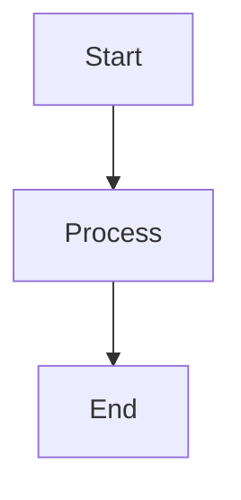

# Documentation Maintenance Guide

This guide outlines procedures for maintaining the unified documentation corpus at a high quality standard.

---

## Table of Contents

1. [Regular Maintenance Tasks](#regular-maintenance-tasks)
2. [Validation Procedures](#validation-procedures)
3. [Update Workflows](#update-workflows)
4. [Quality Standards](#quality-standards)
5. [Troubleshooting](#troubleshooting)

---

## Regular Maintenance Tasks

### Daily Tasks

**Run Automated Validation**

```bash
cd /home/devuser/workspace/project/docs
./scripts/validate-all.sh
```

Review validation reports in `/tmp/docs-validation/`.

**Check for Broken Links**

```bash
./scripts/validate-links.sh
```

Fix any broken links immediately to prevent documentation rot.

### Weekly Tasks

**Generate Metrics Report**

```bash
./scripts/generate-reports.sh
```

Review metrics for:
- Documentation completeness
- Update frequency
- Link density
- Tag distribution

**Update INDEX.md**

```bash
./scripts/generate-index.sh
```

Ensures navigation remains accurate as documentation evolves.

### Monthly Tasks

**Review Old Documentation**

```bash
find . -name "*.md" -type f -mtime +180 -exec ls -lh {} \;
```

Identify and update documents older than 6 months.

**Tag Audit**

Review tag consistency across documentation:

```bash
grep -h "^tags:" **/*.md | sort | uniq -c
```

Standardize tag naming and remove duplicates.

**Front Matter Validation**

```bash
./scripts/validate-frontmatter.sh
```

Ensure all documents have complete front matter with required fields.

---

## Validation Procedures

### Pre-Commit Validation

Before committing documentation changes:

```bash
# Validate all aspects
./scripts/validate-all.sh

# Check specific areas
./scripts/validate-links.sh
./scripts/validate-mermaid.sh
./scripts/detect-ascii.sh
```

### Pull Request Validation

All PRs must pass automated CI/CD checks:

1. Link validation
2. Front matter validation
3. Mermaid syntax validation
4. ASCII diagram detection
5. Coverage validation

See `.github/workflows/docs-ci.yml` for implementation.

### Release Validation

Before major releases:

```bash
# Full validation suite
./scripts/validate-all.sh

# Generate fresh reports
./scripts/generate-reports.sh

# Update index
./scripts/generate-index.sh

# Commit results
git add DOCUMENTATION_METRICS.md INDEX.md
git commit -m "Update documentation metrics and index"
```

---

## Update Workflows

### Adding New Documentation

**1. Create Document with Front Matter**

```markdown
---
title: "Your Document Title"
description: "Clear description of document contents"
category: architecture|development|deployment|api|guides|reference
tags: [tag1, tag2, tag3]
version: 2.0.0
last_updated: 2025-12-18
---

# Your Document Title

Content here...
```

**2. Add Cross-References**

Link to related documents using relative paths:

```markdown
See [Related Topic](../related-category/related-doc.md) for details.
```

**3. Use Mermaid for Diagrams**

```markdown

```

**4. Validate Before Committing**

```bash
./scripts/validate-all.sh
```

### Updating Existing Documentation

**1. Update Front Matter**

Always update `last_updated` field:

```yaml
last_updated: 2025-12-18
```

**2. Maintain Version History**

Add version notes if making significant changes:

```markdown
## Version History

- **2.0.0** (2025-12-18): Complete rewrite with Mermaid diagrams
- **1.0.0** (2025-01-15): Initial version
```

**3. Update Cross-References**

When moving or renaming files, update all links:

```bash
# Find all references to a file
grep -r "old-filename.md" **/*.md
```

**4. Regenerate Index**

```bash
./scripts/generate-index.sh
```

### Deprecating Documentation

**1. Mark as Deprecated**

Add deprecation notice to front matter:

```yaml
deprecated: true
deprecated_date: 2025-12-18
replacement: "../new-category/new-doc.md"
```

**2. Add Warning Banner**

```markdown
> **⚠ DEPRECATED**: This document is deprecated as of 2025-12-18.
> See [New Document](../new-category/new-doc.md) instead.
```

**3. Retain for Grace Period**

Keep deprecated docs for 3 months before removal to allow transition time.

**4. Archive Before Removal**

```bash
mkdir -p archive/deprecated
git mv old-doc.md archive/deprecated/
git commit -m "Archive deprecated documentation"
```

---

## Quality Standards

### Required Elements

Every documentation file must have:

- ✅ Front matter with all required fields
- ✅ Clear title and description
- ✅ Proper category classification
- ✅ Relevant tags (3-5 recommended)
- ✅ Version number
- ✅ Last updated date
- ✅ Table of contents (for documents >500 words)
- ✅ Cross-references to related documents
- ✅ Mermaid diagrams (not ASCII art)

### Writing Standards

**Clarity**
- Use clear, concise language
- Define technical terms on first use
- Provide examples for complex concepts

**Structure**
- Use hierarchical headings (H1 → H6)
- Keep paragraphs short (3-5 sentences)
- Use lists for multiple items
- Add code blocks for commands/examples

**Visual Elements**
- Use Mermaid for all diagrams
- Add alt text for images
- Use tables for structured data
- Highlight important notes with blockquotes

### Link Standards

**Internal Links**
- Use relative paths: `../category/doc.md`
- Link to specific sections: `doc.md#section-name`
- Avoid absolute paths
- Validate all links before committing

**External Links**
- Include protocol: `https://example.com`
- Use descriptive link text
- Verify external resources are stable
- Consider archiving critical external content

---

## Troubleshooting

### Common Issues

**Broken Links**

```bash
# Find broken links
./scripts/validate-links.sh

# Fix by updating paths
grep -r "broken-link.md" **/*.md
# Update all references
```

**Orphaned Documents**

```bash
# Find orphans
./scripts/validate-links.sh | grep "Orphaned"

# Add links from relevant documents
# or add to INDEX.md
```

**Invalid Mermaid Syntax**

```bash
# Validate Mermaid
./scripts/validate-mermaid.sh

# Test diagrams at https://mermaid.live
```

**Missing Front Matter**

```bash
# Find files without front matter
./scripts/validate-frontmatter.sh

# Add template front matter
cat > doc.md <<EOF
---
title: "Title"
description: "Description"
category: reference
tags: [tag1]
version: 2.0.0
last_updated: $(date +%Y-%m-%d)
---
EOF
```

### Validation Failures

**CI/CD Pipeline Fails**

1. Check GitHub Actions logs
2. Run local validation: `./scripts/validate-all.sh`
3. Fix identified issues
4. Commit fixes and re-run pipeline

**Coverage Issues**

1. Review coverage report: `./scripts/validate-coverage.sh`
2. Identify missing documentation areas
3. Create new documents or expand existing ones
4. Update category README files

---

## Automation

### Scheduled Tasks

Set up cron jobs for automated maintenance:

```bash
# Daily validation (run at 2 AM)
0 2 * * * cd /home/devuser/workspace/project/docs && ./scripts/validate-all.sh

# Weekly reports (run Sunday at 3 AM)
0 3 * * 0 cd /home/devuser/workspace/project/docs && ./scripts/generate-reports.sh

# Monthly index update (run 1st of month at 4 AM)
0 4 1 * * cd /home/devuser/workspace/project/docs && ./scripts/generate-index.sh
```

### Git Hooks

Add pre-commit hook for validation:

```bash
# .git/hooks/pre-commit
#!/bin/bash
cd docs
./scripts/validate-all.sh || exit 1
```

---

## Support

For issues or questions about documentation maintenance:

1. Check this guide first
2. Review validation reports
3. Consult [CONTRIBUTION.md](./CONTRIBUTION.md)
4. Open an issue on GitHub

---

*Last Updated: 2025-12-18*
*Version: 2.0.0*
