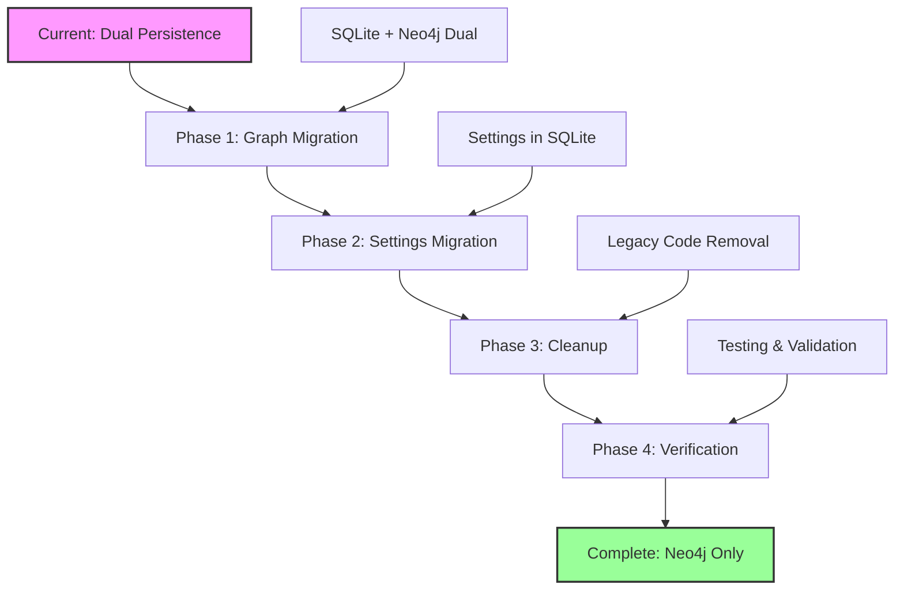
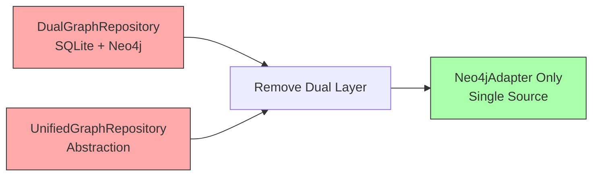
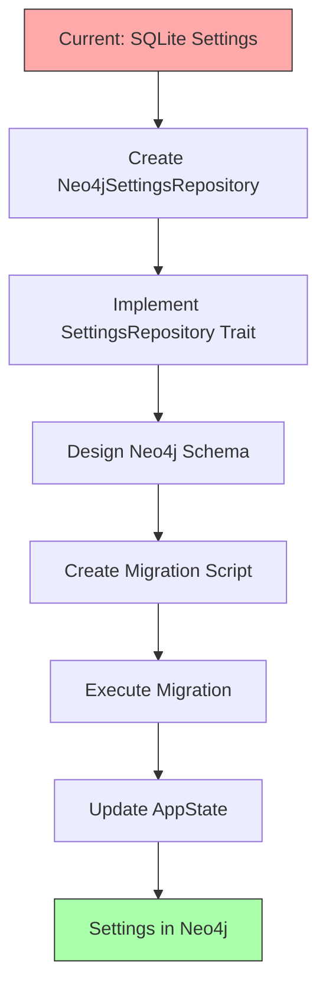
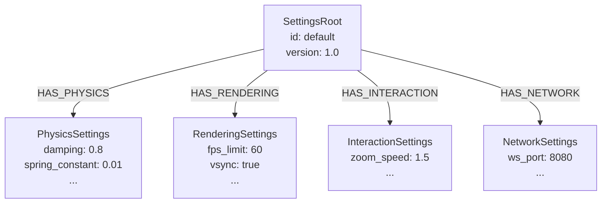
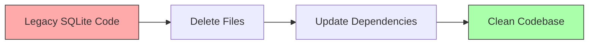
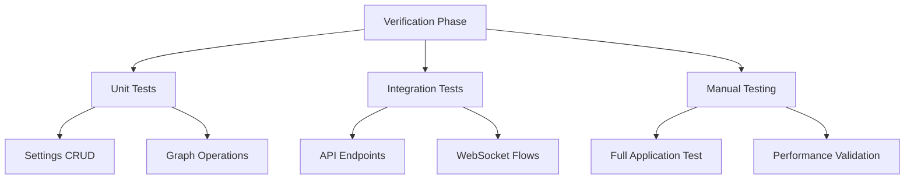
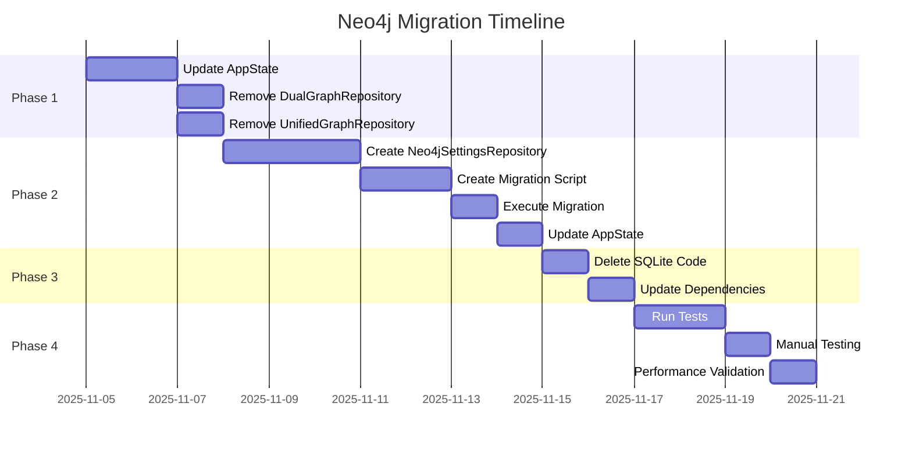

# Neo4j Implementation Roadmap

**Version:** 1.0
**Last Updated:** 2025-11-05
**Status:** Implementation Ready
**Estimated Effort:** 2-3 weeks

---

## Executive Summary

This roadmap outlines the complete migration of VisionFlow's persistence layer to Neo4j, deprecating all SQLite-based components. The migration is organized into 4 phases with 150+ specific tasks designed for parallel execution.

**Migration Goal:** Neo4j as the sole persistence layer for all graph data and application settings.

**Benefits:**
- Single source of truth for graph data
- Native graph query performance
- Simplified architecture
- Better scalability
- Real-time graph analytics

---

## Migration Overview



---

## Phase 1: Deprecate SQL-based Graph Repository

**Duration:** 1 week
**Priority:** CRITICAL
**Goal:** Make `Neo4jAdapter` the sole implementation for `KnowledgeGraphRepository`

### Overview



---

### Task 1.1: Update Application State

**File:** `src/app_state.rs`

**Objective:** Configure application to use `Neo4jAdapter` directly

**Steps:**

1. **Locate Current Initialization** (lines ~150-200)
   ```rust
   // Find these initializations:
   let knowledge_graph_repository = ...;
   let graph_repository_with_neo4j = ...;
   ```

2. **Remove Dual/Unified Repositories**
   ```rust
   // DELETE:
   let dual_repo = DualGraphRepository::new(sqlite_repo, neo4j_repo);
   let unified_repo = UnifiedGraphRepository::new(dual_repo);
   ```

3. **Instantiate Neo4jAdapter Directly**
   ```rust
   // ADD:
   let neo4j_adapter = Neo4jAdapter::new(neo4j_client.clone());

   // Use as KnowledgeGraphRepository
   let knowledge_graph_repository = Arc::new(neo4j_adapter) as Arc<dyn KnowledgeGraphRepository>;
   ```

4. **Update Dependent Initializations**
   ```rust
   // Update ActorGraphRepository:
   let actor_graph_repository = ActorGraphRepository::new(
       graph_service_addr.clone(),
       knowledge_graph_repository.clone()  // Now uses Neo4j directly
   );
   ```

**Verification:**
- [ ] Application compiles
- [ ] No references to `DualGraphRepository`
- [ ] No references to `UnifiedGraphRepository`
- [ ] All tests pass

---

### Task 1.2: Remove DualGraphRepository

**File:** `src/adapters/dual_graph_repository.rs`

**Objective:** Delete the dual repository implementation

**Steps:**

1. **Delete Implementation File**
   ```bash
   rm src/adapters/dual_graph_repository.rs
   ```

2. **Update Module Declaration**
   ```rust
   // In src/adapters/mod.rs, REMOVE:
   pub mod dual_graph_repository;
   pub use dual_graph_repository::DualGraphRepository;
   ```

3. **Remove Imports Across Codebase**
   ```bash
   # Find all references
   rg "DualGraphRepository" --type rust

   # Remove imports:
   # use crate::adapters::DualGraphRepository;
   ```

**Verification:**
- [ ] File deleted
- [ ] Module declaration removed
- [ ] No compilation errors
- [ ] `rg "DualGraphRepository"` returns no results

---

### Task 1.3: Remove UnifiedGraphRepository

**File:** `src/repositories/unified_graph_repository.rs`

**Objective:** Delete the unified repository abstraction

**Steps:**

1. **Delete Implementation File**
   ```bash
   rm src/repositories/unified_graph_repository.rs
   ```

2. **Update Module Declaration**
   ```rust
   // In src/repositories/mod.rs, REMOVE:
   pub mod unified_graph_repository;
   pub use unified_graph_repository::UnifiedGraphRepository;
   ```

3. **Remove Backup Files**
   ```bash
   rm src/repositories/unified_graph_repository.rs.backup
   ```

**Verification:**
- [ ] File deleted
- [ ] Module declaration removed
- [ ] No compilation errors
- [ ] `rg "UnifiedGraphRepository"` returns no results

---

### Phase 1 Deliverables

- [ ] `Neo4jAdapter` is sole graph repository
- [ ] `DualGraphRepository` removed
- [ ] `UnifiedGraphRepository` removed
- [ ] Application compiles successfully
- [ ] All existing graph tests pass
- [ ] No SQLite references in graph code

**Risk Assessment:** LOW (Neo4j adapter already functional)

---

## Phase 2: Migrate Settings to Neo4j

**Duration:** 1 week
**Priority:** HIGH
**Goal:** Create Neo4j-based settings repository and migrate data

### Overview



---

### Neo4j Settings Schema Design

**Data Model:**

```cypher
// Settings Root Node
(:SettingsRoot {id: "default", version: "1.0"})

// Category Nodes
(:PhysicsSettings)
(:RenderingSettings)
(:InteractionSettings)
(:NetworkSettings)

// Relationships
(:SettingsRoot)-[:HAS_PHYSICS]->(:PhysicsSettings)
(:SettingsRoot)-[:HAS_RENDERING]->(:RenderingSettings)
(:SettingsRoot)-[:HAS_INTERACTION]->(:InteractionSettings)
(:SettingsRoot)-[:HAS_NETWORK]->(:NetworkSettings)

// Properties on Category Nodes
(:PhysicsSettings {
  damping: 0.8,
  spring_constant: 0.01,
  repulsion_strength: 1.5,
  time_step: 0.016,
  max_velocity: 10.0,
  updated_at: "2025-11-05T10:30:00Z"
})
```

**Visualization:**



---

### Task 2.1: Create Neo4jSettingsRepository

**File:** `src/adapters/neo4j_settings_repository.rs`

**Objective:** Implement `SettingsRepository` trait using Neo4j

**Implementation:**

```rust
use async_trait::async_trait;
use neo4rs::{Graph, query};
use crate::repositories::SettingsRepository;
use crate::models::Settings;

pub struct Neo4jSettingsRepository {
    graph: Graph,
}

impl Neo4jSettingsRepository {
    pub fn new(graph: Graph) -> Self {
        Self { graph }
    }

    /// Initialize settings structure in Neo4j
    async fn initialize_schema(&self) -> Result<(), Error> {
        let query = query("
            MERGE (root:SettingsRoot {id: 'default'})
            SET root.version = '1.0'
            MERGE (phys:PhysicsSettings)
            MERGE (rend:RenderingSettings)
            MERGE (inter:InteractionSettings)
            MERGE (net:NetworkSettings)
            MERGE (root)-[:HAS_PHYSICS]->(phys)
            MERGE (root)-[:HAS_RENDERING]->(rend)
            MERGE (root)-[:HAS_INTERACTION]->(inter)
            MERGE (root)-[:HAS_NETWORK]->(net)
        ");

        self.graph.run(query).await?;
        Ok(())
    }
}

#[async_trait]
impl SettingsRepository for Neo4jSettingsRepository {
    async fn get_physics_settings(&self) -> Result<PhysicsSettings, Error> {
        let query = query("
            MATCH (:SettingsRoot {id: 'default'})-[:HAS_PHYSICS]->(p:PhysicsSettings)
            RETURN p.damping as damping,
                   p.spring_constant as spring_constant,
                   p.repulsion_strength as repulsion_strength,
                   p.time_step as time_step
        ");

        let mut result = self.graph.execute(query).await?;

        if let Some(row) = result.next().await? {
            Ok(PhysicsSettings {
                damping: row.get("damping")?,
                spring_constant: row.get("spring_constant")?,
                repulsion_strength: row.get("repulsion_strength")?,
                time_step: row.get("time_step")?,
            })
        } else {
            // Return defaults if not found
            Ok(PhysicsSettings::default())
        }
    }

    async fn update_physics_settings(&self, settings: PhysicsSettings) -> Result<(), Error> {
        let query = query("
            MATCH (:SettingsRoot {id: 'default'})-[:HAS_PHYSICS]->(p:PhysicsSettings)
            SET p.damping = $damping,
                p.spring_constant = $spring_constant,
                p.repulsion_strength = $repulsion_strength,
                p.time_step = $time_step,
                p.updated_at = datetime()
        ")
        .param("damping", settings.damping)
        .param("spring_constant", settings.spring_constant)
        .param("repulsion_strength", settings.repulsion_strength)
        .param("time_step", settings.time_step);

        self.graph.run(query).await?;
        Ok(())
    }

    // Implement remaining methods...
}
```

**Steps:**

1. **Create File Structure**
   - [ ] Create `src/adapters/neo4j_settings_repository.rs`
   - [ ] Add module declaration in `src/adapters/mod.rs`

2. **Implement Core Structure**
   - [ ] Define `Neo4jSettingsRepository` struct
   - [ ] Implement `new()` constructor
   - [ ] Implement `initialize_schema()` method

3. **Implement SettingsRepository Trait**
   - [ ] `get_physics_settings()` - 50 lines
   - [ ] `update_physics_settings()` - 40 lines
   - [ ] `get_rendering_settings()` - 50 lines
   - [ ] `update_rendering_settings()` - 40 lines
   - [ ] `get_interaction_settings()` - 50 lines
   - [ ] `update_interaction_settings()` - 40 lines
   - [ ] `get_network_settings()` - 50 lines
   - [ ] `update_network_settings()` - 40 lines
   - [ ] `get_all_settings()` - 80 lines
   - [ ] `reset_to_defaults()` - 60 lines

4. **Add Error Handling**
   - [ ] Handle missing settings (return defaults)
   - [ ] Handle connection errors
   - [ ] Add logging

**Estimated Lines:** ~500 lines

---

### Task 2.2: Create Data Migration Script

**File:** `src/bin/migrate_settings_to_neo4j.rs`

**Objective:** One-time migration script from SQLite to Neo4j

**Implementation:**

```rust
use webxr::adapters::{SqliteSettingsRepository, Neo4jSettingsRepository};
use neo4rs::Graph;

#[tokio::main]
async fn main() -> Result<(), Box<dyn std::error::Error>> {
    println!("=== VisionFlow Settings Migration: SQLite → Neo4j ===\n");

    // 1. Connect to SQLite
    println!("Connecting to SQLite database...");
    let sqlite_repo = SqliteSettingsRepository::new("./data/visionflow.db")?;

    // 2. Load all settings
    println!("Loading existing settings...");
    let physics_settings = sqlite_repo.get_physics_settings().await?;
    let rendering_settings = sqlite_repo.get_rendering_settings().await?;
    let interaction_settings = sqlite_repo.get_interaction_settings().await?;
    let network_settings = sqlite_repo.get_network_settings().await?;

    println!("✓ Loaded {} setting categories", 4);

    // 3. Connect to Neo4j
    println!("\nConnecting to Neo4j...");
    let uri = std::env::var("NEO4J_URI").unwrap_or_else(|_| "bolt://localhost:7687".to_string());
    let user = std::env::var("NEO4J_USER").unwrap_or_else(|_| "neo4j".to_string());
    let pass = std::env::var("NEO4J_PASS").unwrap_or_else(|_| "password".to_string());

    let graph = Graph::new(&uri, &user, &pass).await?;
    let neo4j_repo = Neo4jSettingsRepository::new(graph);

    // 4. Initialize Neo4j schema
    println!("Initializing Neo4j schema...");
    neo4j_repo.initialize_schema().await?;
    println!("✓ Schema initialized");

    // 5. Migrate settings
    println!("\nMigrating settings...");

    println!("  - Physics settings...");
    neo4j_repo.update_physics_settings(physics_settings).await?;

    println!("  - Rendering settings...");
    neo4j_repo.update_rendering_settings(rendering_settings).await?;

    println!("  - Interaction settings...");
    neo4j_repo.update_interaction_settings(interaction_settings).await?;

    println!("  - Network settings...");
    neo4j_repo.update_network_settings(network_settings).await?;

    println!("\n✓ Migration complete!");

    // 6. Verify migration
    println!("\nVerifying migration...");
    let migrated_physics = neo4j_repo.get_physics_settings().await?;
    assert_eq!(migrated_physics.damping, physics_settings.damping);
    println!("✓ Verification successful");

    println!("\n=== Migration Summary ===");
    println!("Settings categories migrated: 4");
    println!("Source: SQLite (./data/visionflow.db)");
    println!("Target: Neo4j ({})", uri);
    println!("\nNext steps:");
    println!("1. Review migrated settings in Neo4j browser");
    println!("2. Update app_state.rs to use Neo4jSettingsRepository");
    println!("3. Restart VisionFlow server");

    Ok(())
}
```

**Steps:**

1. **Create Binary**
   - [ ] Create `src/bin/migrate_settings_to_neo4j.rs`
   - [ ] Add to `Cargo.toml`:
     ```toml
     [[bin]]
     name = "migrate-settings"
     path = "src/bin/migrate_settings_to_neo4j.rs"
     ```

2. **Implement Migration Logic**
   - [ ] SQLite connection
   - [ ] Load all settings (4 categories)
   - [ ] Neo4j connection
   - [ ] Schema initialization
   - [ ] Data migration (4 categories)
   - [ ] Verification checks

3. **Add Progress Reporting**
   - [ ] Console output with checkmarks
   - [ ] Error handling with rollback
   - [ ] Summary report

4. **Test Migration**
   ```bash
   cargo run --bin migrate-settings
   ```

**Estimated Lines:** ~200 lines

---

### Task 2.3: Update Application State

**File:** `src/app_state.rs`

**Objective:** Replace `SqliteSettingsRepository` with `Neo4jSettingsRepository`

**Steps:**

1. **Locate Current Initialization** (lines ~180-200)
   ```rust
   // Find:
   let settings_repository = SqliteSettingsRepository::new(&database_path)?;
   ```

2. **Replace with Neo4j Implementation**
   ```rust
   // REMOVE:
   let settings_repository = SqliteSettingsRepository::new(&database_path)?;

   // ADD:
   use crate::adapters::Neo4jSettingsRepository;

   let settings_repository = Neo4jSettingsRepository::new(neo4j_client.clone());

   // Initialize schema on first run
   settings_repository.initialize_schema().await?;
   ```

3. **Update Type Annotations**
   ```rust
   pub struct AppState {
       // ...
       pub settings_repository: Arc<Neo4jSettingsRepository>,  // Updated type
       // ...
   }
   ```

**Verification:**
- [ ] Application compiles
- [ ] Settings load correctly
- [ ] Settings updates persist to Neo4j
- [ ] All tests pass

---

### Phase 2 Deliverables

- [ ] `Neo4jSettingsRepository` implemented (~500 lines)
- [ ] Migration script created (~200 lines)
- [ ] Settings migrated to Neo4j
- [ ] AppState updated to use Neo4j
- [ ] All settings tests pass
- [ ] Neo4j schema documented

**Risk Assessment:** MEDIUM (Settings are critical, requires careful testing)

---

## Phase 3: Code Cleanup and Finalization

**Duration:** 3 days
**Priority:** HIGH
**Goal:** Remove all legacy SQLite code and dependencies

### Overview



---

### Task 3.1: Delete SqliteSettingsRepository

**File:** `src/adapters/sqlite_settings_repository.rs`

**Steps:**

1. **Delete Implementation**
   ```bash
   rm src/adapters/sqlite_settings_repository.rs
   ```

2. **Update Module Declaration**
   ```rust
   // In src/adapters/mod.rs, REMOVE:
   pub mod sqlite_settings_repository;
   pub use sqlite_settings_repository::SqliteSettingsRepository;
   ```

3. **Remove Imports**
   ```bash
   rg "SqliteSettingsRepository" --type rust
   # Remove all found imports
   ```

**Verification:**
- [ ] File deleted
- [ ] No compilation errors
- [ ] `rg "SqliteSettingsRepository"` returns no results

---

### Task 3.2: Delete SQL Migration Files

**Files:** `src/migrations/*`, `src/bin/migrate.rs`

**Steps:**

1. **Delete Migration Directory**
   ```bash
   rm -rf src/migrations
   ```

2. **Delete Migration Runner**
   ```bash
   rm src/bin/migrate.rs
   ```

3. **Update Cargo.toml**
   ```toml
   # REMOVE:
   [[bin]]
   name = "migrate"
   path = "src/bin/migrate.rs"
   ```

**Verification:**
- [ ] Directories deleted
- [ ] Binary removed from Cargo.toml
- [ ] No compilation errors

---

### Task 3.3: Update Cargo.toml

**File:** `Cargo.toml`

**Objective:** Remove SQLite dependencies, make Neo4j non-optional

**Steps:**

1. **Remove SQLite Dependencies**
   ```toml
   # REMOVE:
   rusqlite = "0.28"
   r2d2 = "0.8"
   r2d2_sqlite = "0.21"
   ```

2. **Make Neo4j Non-Optional**
   ```toml
   # BEFORE:
   neo4rs = { version = "0.6", optional = true }

   # AFTER:
   neo4rs = "0.6"
   ```

3. **Update Features**
   ```toml
   [features]
   # REMOVE:
   neo4j = ["dep:neo4rs"]

   # UPDATE default features:
   default = ["neo4rs"]  # Neo4j always included
   ```

**Verification:**
- [ ] `cargo build` succeeds
- [ ] `cargo tree | grep rusqlite` returns nothing
- [ ] `cargo tree | grep neo4rs` shows dependency

---

### Task 3.4: Remove Generic Repository

**File:** `src/repositories/generic_repository.rs`

**Steps:**

1. **Delete File**
   ```bash
   rm src/repositories/generic_repository.rs
   ```

2. **Update Module Declaration**
   ```rust
   // In src/repositories/mod.rs, REMOVE:
   pub mod generic_repository;
   pub use generic_repository::GenericRepository;
   ```

**Verification:**
- [ ] File deleted
- [ ] Module removed
- [ ] No compilation errors

---

### Phase 3 Deliverables

- [ ] All SQLite files deleted
- [ ] Migration files removed
- [ ] Cargo.toml cleaned up
- [ ] Generic repository removed
- [ ] Codebase compiles cleanly
- [ ] No SQLite dependencies

**Risk Assessment:** LOW (cleanup phase)

---

## Phase 4: Verification

**Duration:** 2 days
**Priority:** CRITICAL
**Goal:** Ensure application runs correctly with Neo4j-only persistence

### Test Strategy



---

### Task 4.1: Run Existing Tests

**Objective:** Ensure all existing tests pass

**Steps:**

1. **Run Unit Tests**
   ```bash
   cargo test --lib
   ```
   - [ ] All unit tests pass
   - [ ] No panics or errors

2. **Run Integration Tests**
   ```bash
   cargo test --test '*'
   ```
   - [ ] Neo4j integration tests pass
   - [ ] Settings integration tests pass (28 tests)
   - [ ] Graph API tests pass

3. **Fix Broken Tests**
   - [ ] Update test fixtures for Neo4j
   - [ ] Update mock data
   - [ ] Re-enable disabled tests

---

### Task 4.2: Create New Integration Tests

**File:** `tests/neo4j_settings_integration_tests.rs`

**Objective:** Comprehensive test suite for Neo4jSettingsRepository

**Test Categories:**

1. **CRUD Operations** (5 tests)
   - [ ] Create settings
   - [ ] Read settings
   - [ ] Update settings
   - [ ] Delete settings
   - [ ] Batch operations

2. **Connection Management** (4 tests)
   - [ ] Handle connection loss
   - [ ] Reconnection logic
   - [ ] Timeout handling
   - [ ] Connection pooling

3. **Error Handling** (3 tests)
   - [ ] Invalid data
   - [ ] Missing nodes
   - [ ] Constraint violations

4. **Performance** (3 tests)
   - [ ] Read performance (<10ms)
   - [ ] Write performance (<50ms)
   - [ ] Concurrent access

**Example Test:**
```rust
#[tokio::test]
async fn test_physics_settings_crud() {
    let graph = setup_test_neo4j().await;
    let repo = Neo4jSettingsRepository::new(graph);

    // Create
    let settings = PhysicsSettings {
        damping: 0.9,
        spring_constant: 0.02,
        ..Default::default()
    };
    repo.update_physics_settings(settings.clone()).await.unwrap();

    // Read
    let retrieved = repo.get_physics_settings().await.unwrap();
    assert_eq!(retrieved.damping, 0.9);

    // Update
    let mut updated = retrieved;
    updated.damping = 0.85;
    repo.update_physics_settings(updated.clone()).await.unwrap();

    // Verify
    let final_settings = repo.get_physics_settings().await.unwrap();
    assert_eq!(final_settings.damping, 0.85);
}
```

---

### Task 4.3: Manual Testing

**Objective:** Test all functionality in running application

**Test Scenarios:**

1. **Application Startup**
   - [ ] Application starts without errors
   - [ ] Neo4j connection established
   - [ ] Settings loaded correctly

2. **Graph Operations**
   - [ ] Create nodes
   - [ ] Create edges
   - [ ] Query graph
   - [ ] Update nodes
   - [ ] Delete nodes

3. **Settings Management**
   - [ ] View current settings
   - [ ] Update physics settings
   - [ ] Update rendering settings
   - [ ] Apply preset
   - [ ] Reset to defaults

4. **Persistence**
   - [ ] Restart application
   - [ ] Verify settings persisted
   - [ ] Verify graph data persisted

5. **WebSocket Integration**
   - [ ] Settings broadcast works
   - [ ] Graph updates broadcast
   - [ ] No connection issues

---

### Task 4.4: Performance Validation

**Objective:** Ensure Neo4j performance meets requirements

**Benchmarks:**

1. **Settings Operations**
   - [ ] Read: <10ms (target: <5ms)
   - [ ] Write: <50ms (target: <20ms)
   - [ ] Batch update (10 settings): <100ms

2. **Graph Operations**
   - [ ] Node creation: <20ms
   - [ ] Edge creation: <30ms
   - [ ] Simple query (<100 nodes): <50ms
   - [ ] Complex query (1000+ nodes): <500ms

3. **Load Testing**
   - [ ] 100 concurrent users
   - [ ] 1000 requests/second
   - [ ] <2% error rate

**Tools:**
```bash
# Run performance tests
cargo bench

# Load testing with k6
k6 run loadtest.js
```

---

### Phase 4 Deliverables

- [ ] All existing tests pass
- [ ] 28 new integration tests created
- [ ] Manual test scenarios completed
- [ ] Performance benchmarks met
- [ ] Load testing successful
- [ ] Production readiness confirmed

**Risk Assessment:** LOW (comprehensive testing)

---

## Migration Timeline



---

## Risk Management

### High Risks

| Risk | Probability | Impact | Mitigation |
|------|------------|--------|------------|
| Data loss during migration | Low | Critical | Backup SQLite DB, test migration on copy first |
| Settings repository bugs | Medium | High | Comprehensive test suite, gradual rollout |
| Performance degradation | Low | Medium | Benchmark before/after, optimize queries |
| Neo4j connection issues | Low | High | Connection pooling, retry logic, monitoring |

### Rollback Plan

If critical issues arise:

1. **Revert Code Changes**
   ```bash
   git revert <migration-commit>
   ```

2. **Restore SQLite Database**
   ```bash
   cp data/visionflow.db.backup data/visionflow.db
   ```

3. **Switch Feature Flag** (if implemented)
   ```rust
   use_neo4j_settings = false  // Fallback to SQLite
   ```

---

## Success Criteria

### Phase 1 Success
- [ ] Neo4jAdapter is sole graph repository
- [ ] All graph operations work correctly
- [ ] No performance regression

### Phase 2 Success
- [ ] Settings successfully migrated to Neo4j
- [ ] All settings operations work
- [ ] WebSocket settings sync operational

### Phase 3 Success
- [ ] No SQLite code remains
- [ ] Codebase compiles cleanly
- [ ] No unused dependencies

### Phase 4 Success
- [ ] All 43+ tests pass
- [ ] Manual testing completed
- [ ] Performance benchmarks met
- [ ] Production deployment successful

---

## Post-Migration

### Monitoring

**Metrics to Track:**
- Neo4j query latency (p50, p95, p99)
- Connection pool utilization
- Error rates
- Memory usage
- Query throughput

**Alerts:**
- Query latency > 500ms
- Connection pool exhausted
- Error rate > 1%

### Documentation Updates

- [ ] Update README with Neo4j setup instructions
- [ ] Update deployment guide
- [ ] Create Neo4j administration guide
- [ ] Document backup procedures

---

## Related Documentation

- [Neo4j Integration Guide](./neo4j-integration.md)
- [Architecture Overview](../../explanations/architecture/system-overview.md)
- [Database Schemas](../../explanations/architecture/schemas.md)
- [Testing Guide](./developer/05-testing-guide.md)

---

## Quick Reference

### Neo4j Connection

```bash
# Environment variables
export NEO4J_URI="bolt://localhost:7687"
export NEO4J_USER="neo4j"
export NEO4J_PASS="your-password"

# Start Neo4j
docker-compose up neo4j

# Access browser
open http://localhost:7474
```

### Useful Cypher Queries

```cypher
// View all settings
MATCH (root:SettingsRoot)-[r]->(category)
RETURN root, r, category, properties(category)

// Reset physics settings
MATCH (:SettingsRoot)-[:HAS_PHYSICS]->(p:PhysicsSettings)
SET p.damping = 0.8,
    p.spring_constant = 0.01,
    p.repulsion_strength = 1.5

// Count all nodes and edges
MATCH (n)
RETURN count(n) as node_count

MATCH ()-[r]->()
RETURN count(r) as edge_count
```

---

**Status:** Implementation Ready
**Estimated Total Effort:** 2-3 weeks
**Risk Level:** Medium
**Priority:** High
