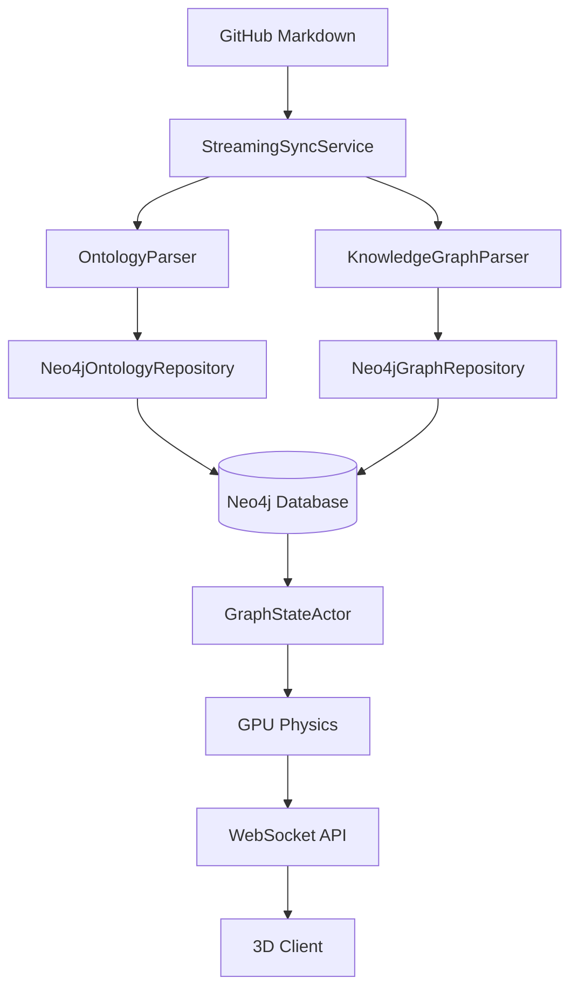

# Neo4j Integration Guide

**Status**: ✅ Production (Primary Database)
**Last Updated**: November 6, 2025

---

## Overview

**Neo4j 5.13 is the primary and sole persistence layer for VisionFlow.** All graph data, ontology information, and application settings are stored in Neo4j. The system requires a running Neo4j instance to function.

This guide covers:
- Neo4j setup and configuration
- Database schema and architecture
- Query patterns and best practices
- Performance tuning
- Troubleshooting

---

## Quick Start

### 1. Start Neo4j with Docker (Recommended)

```bash
# Using docker-compose.unified.yml (easiest)
docker-compose --profile dev up -d

# Or manually:
docker run -d \
  --name visionflow-neo4j \
  -p 7474:7474 -p 7687:7687 \
  -e NEO4J_AUTH=neo4j/your_secure_password \
  neo4j:5.13.0
```

### 2. Configure Environment Variables

```bash
# Required - VisionFlow will not start without these
NEO4J_URI=bolt://neo4j:7687  # Use 'neo4j' for Docker networks
NEO4J_USER=neo4j
NEO4J_PASSWORD=your_secure_password
NEO4J_DATABASE=neo4j
```

### 3. Verify Connection

```bash
# Access Neo4j Browser
open http://localhost:7474

# Check VisionFlow backend health
curl http://localhost:4000/api/health

# Query the graph
curl http://localhost:4000/api/graph/data
```

---

## Architecture

### Neo4j as Primary Database

VisionFlow uses **Neo4j as the single source of truth** for all data:



### What's Stored in Neo4j

| Data Type | Node Labels | Purpose |
|-----------|-------------|---------|
| **Knowledge Graph** | `:Node`, `:Edge` | User's knowledge graph nodes and relationships |
| **Ontology Classes** | `:OwlClass` | OWL class definitions with IRIs |
| **Ontology Properties** | `:OwlProperty` | Object and data properties |
| **Class Hierarchy** | `:SubClassOf` relationships | Taxonomic structure |
| **Ontology Axioms** | `:Axiom` | Logical constraints and rules |
| **Settings** | `:Setting` | Application configuration |

---

## Database Schema

### Knowledge Graph Schema

**Nodes (:Node)**
```cypher
CREATE (n:Node {
  metadata_id: "unique-id",
  label: "Node Label",
  public: "true",
  content: "Node content..."
})
```

**Edges (:EDGE relationships)**
```cypher
CREATE (a:Node)-[:EDGE {
  source_id: 1,
  target_id: 2,
  label: "connects to"
}]->(b:Node)
```

### Ontology Schema

**OWL Classes (:OwlClass)**
```cypher
CREATE (c:OwlClass {
  iri: "http://example.org/ontology#Person",
  label: "Person",
  user_defined: true
})
```

**Class Hierarchy (:SubClassOf)**
```cypher
CREATE (child:OwlClass)-[:SubClassOf]->(parent:OwlClass)
```

**Properties (:OwlProperty)**
```cypher
CREATE (p:OwlProperty {
  iri: "http://example.org/ontology#hasName",
  label: "has name",
  property_type: "ObjectProperty"
})
```

---

## Essential Cypher Queries

### View Knowledge Graph

```cypher
// Get all knowledge graph nodes
MATCH (n:Node)
RETURN n
LIMIT 25;

// Get nodes with their connections
MATCH (n:Node)-[r:EDGE]->(m:Node)
RETURN n, r, m
LIMIT 50;

// Find public nodes
MATCH (n:Node)
WHERE n.public = "true"
RETURN n.metadata_id, n.label
LIMIT 100;
```

### Explore Ontology

```cypher
// View ontology classes
MATCH (c:OwlClass)
RETURN c.iri, c.label
ORDER BY c.label
LIMIT 50;

// View class hierarchy
MATCH path = (child:OwlClass)-[:SubClassOf*1..3]->(parent:OwlClass)
RETURN path
LIMIT 25;

// Find all subclasses of a class
MATCH (c:OwlClass {label: "Entity"})<-[:SubClassOf*1..]-(sub:OwlClass)
RETURN sub.label, sub.iri;

// View properties
MATCH (p:OwlProperty)
RETURN p.iri, p.label, p.property_type
LIMIT 25;
```

### Pathfinding

```cypher
// Shortest path between two nodes
MATCH path = shortestPath(
  (a:Node {metadata_id: "start-id"})-[:EDGE*1..10]-(b:Node {metadata_id: "end-id"})
)
RETURN path;

// All paths up to 3 hops
MATCH path = (a:Node {metadata_id: "node-id"})-[:EDGE*1..3]-(b:Node)
RETURN DISTINCT b.metadata_id, b.label, length(path) as hops
ORDER BY hops
LIMIT 50;
```

### Analytics

```cypher
// Node degree distribution
MATCH (n:Node)
RETURN n.label,
       size((n)-[:EDGE]-()) as degree
ORDER BY degree DESC
LIMIT 20;

// Connected components count
MATCH (n:Node)
WITH COLLECT(DISTINCT id(n)) as nodes
RETURN size(nodes) as total_nodes;

// Ontology statistics
MATCH (c:OwlClass)
WITH count(c) as class_count
MATCH (p:OwlProperty)
WITH class_count, count(p) as property_count
MATCH ()-[r:SubClassOf]->()
RETURN class_count, property_count, count(r) as hierarchy_edges;
```

---

## REST API Endpoints

VisionFlow provides REST endpoints that query Neo4j:

### Graph Data

```bash
# Get all graph data
GET /api/graph/data

# Get specific node
GET /api/graph/nodes/{id}

# Get node neighbors
GET /api/graph/nodes/{id}/neighbors
```

### Ontology Data

```bash
# Get all ontology classes
GET /api/ontology/classes

# Get class hierarchy
GET /api/ontology/hierarchy

# Get properties
GET /api/ontology/properties
```

### Settings

```bash
# Get settings
GET /api/settings

# Update settings (authenticated)
POST /api/settings
```

---

## Performance Tuning

### Recommended Indexes

Run these after initial data load for optimal performance:

```cypher
// Knowledge graph indexes
CREATE INDEX node_metadata_id IF NOT EXISTS FOR (n:Node) ON (n.metadata_id);
CREATE INDEX node_public IF NOT EXISTS FOR (n:Node) ON (n.public);
CREATE INDEX node_label IF NOT EXISTS FOR (n:Node) ON (n.label);

// Ontology indexes
CREATE CONSTRAINT owl_class_iri_unique IF NOT EXISTS
  FOR (c:OwlClass) REQUIRE c.iri IS UNIQUE;
CREATE INDEX owl_class_label IF NOT EXISTS FOR (c:OwlClass) ON (c.label);

CREATE CONSTRAINT owl_property_iri_unique IF NOT EXISTS
  FOR (p:OwlProperty) REQUIRE p.iri IS UNIQUE;
CREATE INDEX owl_property_label IF NOT EXISTS FOR (p:OwlProperty) ON (p.label);

// Show all indexes
SHOW INDEXES;
```

### Memory Configuration

Adjust in `.env` based on your hardware:

```bash
# For 8GB RAM systems
NEO4J_PAGECACHE_SIZE=512M
NEO4J_HEAP_INIT=512M
NEO4J_HEAP_MAX=1G

# For 16GB+ RAM systems
NEO4J_PAGECACHE_SIZE=2G
NEO4J_HEAP_INIT=1G
NEO4J_HEAP_MAX=4G
```

Or in `docker-compose.unified.yml`:

```yaml
neo4j:
  environment:
    - NEO4J_server_memory_pagecache_size=2G
    - NEO4J_server_memory_heap_max__size=4G
```

### Query Performance Tips

1. **Use LIMIT**: Always limit result sets
   ```cypher
   MATCH (n:Node) RETURN n LIMIT 100;  // Good
   MATCH (n:Node) RETURN n;             // Bad - may return millions
   ```

2. **Use Indexes**: Query indexed properties
   ```cypher
   MATCH (n:Node {metadata_id: "id"}) RETURN n;  // Uses index
   ```

3. **Profile Queries**: Use PROFILE to identify bottlenecks
   ```cypher
   PROFILE MATCH (n:Node)-[:EDGE*1..3]-(m) RETURN count(m);
   ```

4. **Limit Path Depth**: Keep path queries under 5 hops
   ```cypher
   MATCH path = (a)-[:EDGE*1..3]-(b) RETURN path;  // Good
   MATCH path = (a)-[:EDGE*1..10]-(b) RETURN path; // Slow
   ```

---

## Backup and Restore

### Backup Neo4j Data

```bash
# Stop VisionFlow but keep Neo4j running
docker stop visionflow_container

# Create backup
docker exec visionflow-neo4j neo4j-admin database dump neo4j \
  --to-path=/var/lib/neo4j/data/dumps

# Copy to host
docker cp visionflow-neo4j:/var/lib/neo4j/data/dumps/neo4j.dump \
  ./neo4j-backup-$(date +%Y%m%d).dump
```

### Restore from Backup

```bash
# Stop both containers
docker-compose --profile dev down

# Start only Neo4j
docker-compose up -d neo4j

# Load backup
docker cp ./neo4j-backup-20251106.dump visionflow-neo4j:/tmp/restore.dump
docker exec visionflow-neo4j neo4j-admin database load neo4j \
  --from-path=/tmp

# Restart everything
docker-compose --profile dev up -d
```

---

## Migration from SQLite

If you're upgrading from an older VisionFlow version that used SQLite:

### Step 1: Export from SQLite

The old `unified.db` format is **no longer supported**. Historical data must be migrated.

### Step 2: Sync from GitHub

The recommended approach is to **re-sync from your GitHub repository**:

```bash
# Trigger full sync
curl -X POST http://localhost:4000/api/admin/sync/streaming
```

This will:
1. Parse all Markdown files from GitHub
2. Extract ontology and knowledge graph data
3. Populate Neo4j with clean, current data

### Step 3: Verify

```cypher
// Check node count
MATCH (n:Node) RETURN count(n);

// Check ontology classes
MATCH (c:OwlClass) RETURN count(c);

// Verify relationships
MATCH ()-[r]->() RETURN count(r);
```

---

## Troubleshooting

### Issue: "Failed to create Neo4j settings repository"

**Symptom**: Backend fails to start with Neo4j connection error

**Solution**:
1. Verify Neo4j is running: `docker ps | grep neo4j`
2. Check connection: `docker logs visionflow-neo4j`
3. Verify environment variables in `.env`
4. Test connectivity: `nc -zv localhost 7687`

**See**: 

### Issue: Slow Query Performance

**Solution**:
1. Check indexes exist: `SHOW INDEXES;`
2. Add missing indexes (see Performance Tuning section)
3. Use `PROFILE` to identify slow operations
4. Limit result sets with `LIMIT`
5. Reduce path traversal depth

### Issue: Out of Memory

**Solution**:
1. Increase heap size in docker-compose.yml
2. Add indexes to reduce memory usage
3. Use pagination for large result sets
4. Restart Neo4j: `docker restart visionflow-neo4j`

### Issue: Connection Refused

**Solution**:
1. Check Neo4j is listening: `docker logs visionflow-neo4j`
2. Verify port forwarding: `netstat -tuln | grep 7687`
3. Check firewall rules
4. Use correct URI format: `bolt://neo4j:7687` (Docker) or `bolt://localhost:7687` (host)

### Issue: Authentication Failed

**Solution**:
1. Verify password matches: `.env` must match Neo4j container
2. Reset password:
   ```bash
   docker exec -it visionflow-neo4j cypher-shell -u neo4j -p <old_password>
   CALL dbms.security.changePassword('<new_password>');
   ```
3. Update `.env` with new password
4. Restart VisionFlow: `docker-compose --profile dev restart visionflow`

---

## Advanced Topics

### Custom Cypher Queries

While VisionFlow provides a REST API, you can execute custom queries via Neo4j Browser or cypher-shell:

```bash
# Interactive shell
docker exec -it visionflow-neo4j cypher-shell -u neo4j -p your_password

# Execute script
docker exec -it visionflow-neo4j cypher-shell -u neo4j -p your_password \
  < your_script.cypher
```

### Monitoring

```cypher
// Show running queries
CALL dbms.listQueries();

// Show database info
CALL dbms.queryJmx('org.neo4j:instance=kernel#0,name=Kernel');

// Show indexes
SHOW INDEXES;

// Show constraints
SHOW CONSTRAINTS;
```

### APOC Procedures

APOC (Awesome Procedures on Cypher) is included:

```cypher
// Path finding with APOC
CALL apoc.path.expand(
  node,
  "EDGE>",
  null,
  1,
  3
) YIELD path RETURN path;

// Export to JSON
CALL apoc.export.json.all("export.json", {});
```

---

## Related Documentation

- **[Neo4j Migration Guide](neo4j-migration.md)** - Historical migration information
- **[Implementation Status](../reference/implementation-status.md)** - Current system completeness
- **** - Troubleshooting backend startup
- **** - GitHub synchronization
- **** - Complete deployment guide
- **[Neo4j Official Documentation](https://neo4j.com/docs/)** - Upstream docs

---

## Production Considerations

### Security

1. **Change default password**: Never use default Neo4j password in production
2. **Network isolation**: Use Docker networks, don't expose 7687 to internet
3. **Authentication**: Enable authentication (enabled by default)
4. **Backups**: Automated daily backups to separate storage

### Scalability

1. **Neo4j Enterprise**: Consider for clustering and advanced features
2. **Read replicas**: Distribute read load across multiple instances
3. **Sharding**: Partition large graphs by domain
4. **Caching**: Use Redis for frequently accessed data

### Monitoring

1. **Neo4j Metrics**: Enable Prometheus metrics exporter
2. **Query Logging**: Monitor slow queries
3. **Resource Usage**: Track memory, CPU, disk I/O
4. **Health Checks**: Automated monitoring via `/api/health`

---

**Document Version**: 2.0 (Neo4j Primary Architecture)
**Last Updated**: November 6, 2025
**Migration Status**: ✅ Complete - Neo4j is now the sole database
