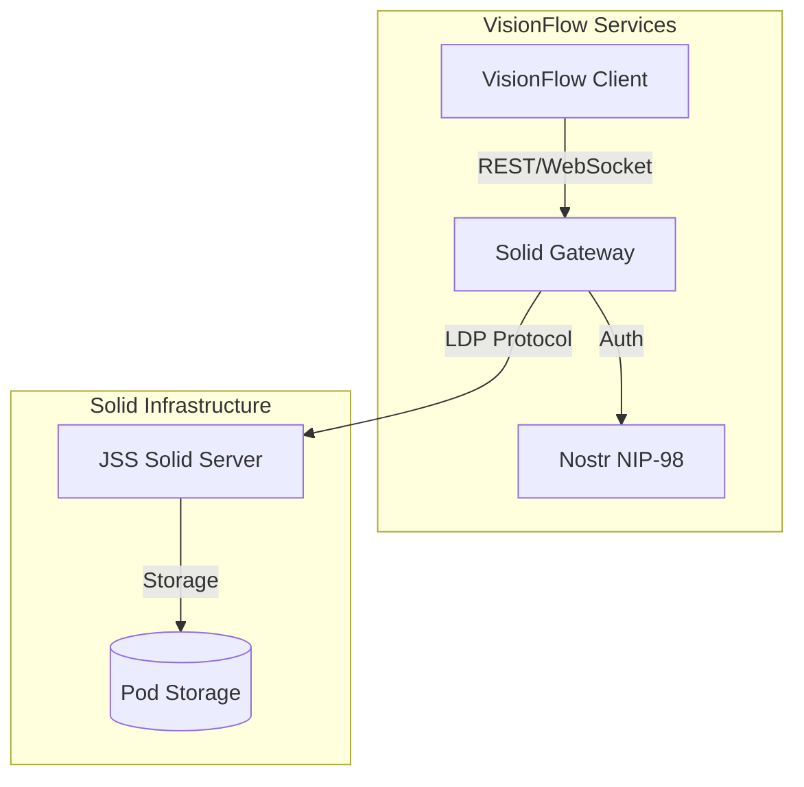
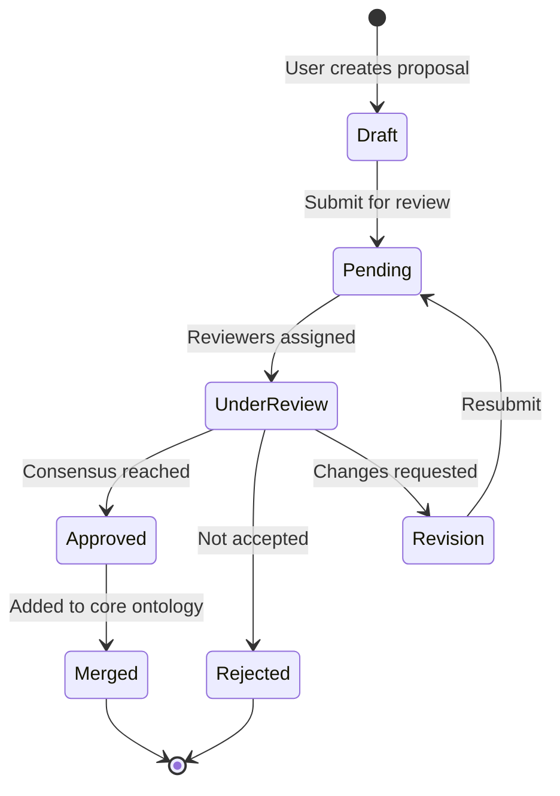

# Solid Pod Integration

## Overview

VisionFlow integrates with [Solid](https://solidproject.org/) (Social Linked Data) to provide decentralized, user-controlled data storage. This enables users to own their data while participating in the VisionFlow knowledge graph ecosystem.

### What is Solid?

Solid is a specification that lets people store their data securely in decentralized data stores called Pods. Users control who and what applications can access their data. Key features include:

- **Data Sovereignty**: Users own and control their data
- **Interoperability**: Data follows standard RDF/Linked Data formats
- **Decentralization**: No single point of failure or control
- **Fine-grained Access Control**: Granular permissions via WebACL

### Why VisionFlow Uses Solid

1. **User-Owned Knowledge**: Personal ontologies and graph contributions stay with users
2. **Agent Memory Persistence**: AI agent memories persist across sessions in user Pods
3. **Collaborative Ontology Evolution**: Users propose ontology additions stored in their Pods
4. **Privacy-First Design**: Sensitive knowledge remains under user control
5. **Nostr Identity Integration**: Leverages existing Nostr authentication for Pod access

### Architecture: Sidecar Gateway with JSS

VisionFlow implements Solid via a **sidecar gateway pattern**:



The gateway:
- Proxies LDP (Linked Data Platform) requests to JSS
- Handles Nostr-to-WebID identity mapping
- Manages Pod lifecycle (creation, deletion)
- Provides WebSocket notifications for real-time updates

### Authentication: Nostr NIP-98

VisionFlow uses [NIP-98](https://github.com/nostr-protocol/nips/blob/master/98.md) HTTP Auth for Solid operations:

1. Client signs authorization event with Nostr key
2. Event includes: method, URL, timestamp, payload hash
3. Gateway verifies signature and maps npub to WebID
4. JSS receives authenticated requests with proper WebID

See [Nostr Authentication](features/nostr-auth.md) for full authentication details.

---

## Quick Start

### Enable Solid Profile in Docker Compose

Add the Solid profile to your deployment:

```bash
# Enable Solid services
docker compose --profile solid up -d

# Or with full stack
docker compose --profile full --profile solid up -d
```

### Environment Variables

Configure Solid integration in your `.env` file:

```bash
# Solid Pod Server (JSS)
JSS_URL=http://localhost:3000
JSS_WS_URL=ws://localhost:3000

# Pod storage configuration
SOLID_POD_BASE=/pods
SOLID_DEFAULT_ACL=private

# Nostr-to-WebID mapping
SOLID_WEBID_PREFIX=https://visionflow.example/id/

# Optional: External Solid provider
SOLID_EXTERNAL_PROVIDER=https://solidcommunity.net
```

### First Pod Creation

After authentication, create your first Pod:

```typescript
// Client-side Pod creation
const response = await fetch('/solid/pods', {
  method: 'POST',
  headers: {
    'Authorization': `Nostr ${signedEvent}`,
    'Content-Type': 'application/json'
  },
  body: JSON.stringify({
    name: 'my-knowledge-base',
    template: 'visionflow-default'
  })
});

const pod = await response.json();
console.log('Pod created:', pod.url);
// Output: Pod created: /pods/npub1abc.../my-knowledge-base/
```

---

## Pod Management

### Pod URL Structure

Pods follow a predictable URL pattern:

```
/pods/{npub}/{pod-name}/
       |         |
       |         +-- User-defined pod identifier
       +------------ Nostr public key (npub format)
```

Example URLs:
- Profile: `/pods/npub1xyz.../profile/`
- Memories: `/pods/npub1xyz.../agent-memories/`
- Ontologies: `/pods/npub1xyz.../ontologies/`

### WebID Mapping to Nostr Pubkey

VisionFlow automatically maps Nostr identities to Solid WebIDs:

| Nostr Identity | Solid WebID |
|---------------|-------------|
| `npub1abc...` | `https://visionflow.example/id/npub1abc.../profile/card#me` |
| `npub1xyz...` | `https://visionflow.example/id/npub1xyz.../profile/card#me` |

The WebID document includes:

```turtle
@prefix foaf: <http://xmlns.com/foaf/0.1/> .
@prefix solid: <http://www.w3.org/ns/solid/terms#> .
@prefix nostr: <https://nostr.com/ns/> .

<#me>
    a foaf:Person ;
    foaf:name "Nostr User" ;
    nostr:pubkey "npub1abc..." ;
    solid:oidcIssuer <https://visionflow.example/> ;
    solid:account </pods/npub1abc.../> .
```

### Pod Contents Structure

Default Pod structure for VisionFlow:

```
/pods/{npub}/
├── profile/
│   ├── card               # WebID profile document
│   └── preferences        # User preferences (Turtle)
├── agent-memories/
│   ├── episodic/          # Session memories
│   ├── semantic/          # Long-term knowledge
│   └── procedural/        # Learned procedures
├── ontologies/
│   ├── personal/          # User-defined classes
│   ├── proposals/         # Community contributions
│   └── imported/          # Imported ontologies
├── graphs/
│   ├── personal-kg/       # Personal knowledge graphs
│   └── bookmarks/         # Saved graph views
└── .acl                   # Root access control
```

---

## LDP Operations

### CRUD with JSON-LD

VisionFlow uses [JSON-LD](https://json-ld.org/) as the primary RDF serialization:

#### Create Resource (POST)

```typescript
// Create a new episodic memory
const memory = {
  "@context": {
    "@vocab": "https://visionflow.example/ns/memory#",
    "xsd": "http://www.w3.org/2001/XMLSchema#"
  },
  "@type": "EpisodicMemory",
  "timestamp": "2025-12-29T10:30:00Z",
  "sessionId": "session-abc-123",
  "content": "User explored the software ontology focusing on design patterns",
  "entities": [
    { "@id": "http://example.org/ontology#DesignPattern" },
    { "@id": "http://example.org/ontology#SoftwareArchitecture" }
  ],
  "emotionalValence": 0.7,
  "importance": 0.8
};

await fetch('/solid/pods/npub1abc.../agent-memories/episodic/', {
  method: 'POST',
  headers: {
    'Authorization': `Nostr ${signedEvent}`,
    'Content-Type': 'application/ld+json',
    'Slug': 'memory-2025-12-29-001'
  },
  body: JSON.stringify(memory)
});
```

#### Read Resource (GET)

```typescript
// Fetch with content negotiation
const response = await fetch('/solid/pods/npub1abc.../profile/card', {
  headers: {
    'Authorization': `Nostr ${signedEvent}`,
    'Accept': 'application/ld+json'  // or text/turtle
  }
});

const profile = await response.json();
```

#### Update Resource (PUT)

```typescript
// Replace entire resource
await fetch('/solid/pods/npub1abc.../profile/preferences', {
  method: 'PUT',
  headers: {
    'Authorization': `Nostr ${signedEvent}`,
    'Content-Type': 'application/ld+json',
    'If-Match': '"etag-value"'  // Optimistic locking
  },
  body: JSON.stringify(updatedPreferences)
});
```

#### Delete Resource (DELETE)

```typescript
await fetch('/solid/pods/npub1abc.../agent-memories/episodic/old-memory', {
  method: 'DELETE',
  headers: {
    'Authorization': `Nostr ${signedEvent}`
  }
});
```

### Content Negotiation

The gateway supports multiple RDF formats:

| Accept Header | Format | Description |
|--------------|--------|-------------|
| `application/ld+json` | JSON-LD | Default, JavaScript-friendly |
| `text/turtle` | Turtle | Human-readable RDF |
| `application/n-triples` | N-Triples | Line-based RDF |
| `application/rdf+xml` | RDF/XML | Legacy XML format |

### WebSocket Notifications

Subscribe to Pod changes in real-time:

```typescript
// Connect to Solid WebSocket endpoint
const ws = new WebSocket('ws://localhost:9090/solid/ws');

ws.onopen = () => {
  // Subscribe to container updates
  ws.send(JSON.stringify({
    type: 'sub',
    resource: '/pods/npub1abc.../agent-memories/'
  }));
};

ws.onmessage = (event) => {
  const notification = JSON.parse(event.data);

  if (notification.type === 'pub') {
    console.log('Resource changed:', notification.resource);
    console.log('Change type:', notification.activity);  // created, updated, deleted
  }
};

// Unsubscribe when done
ws.send(JSON.stringify({
  type: 'unsub',
  resource: '/pods/npub1abc.../agent-memories/'
}));
```

---

## User Ontology

VisionFlow allows users to extend the shared ontology with personal classes and properties, stored in their Pods.

### Contributing Ontology Additions

Users can propose new ontology terms:

```typescript
// Create ontology proposal
const proposal = {
  "@context": {
    "owl": "http://www.w3.org/2002/07/owl#",
    "rdfs": "http://www.w3.org/2000/01/rdf-schema#",
    "vf": "https://visionflow.example/ontology#"
  },
  "@type": "owl:Class",
  "@id": "vf:MachineLearningModel",
  "rdfs:subClassOf": { "@id": "vf:SoftwareComponent" },
  "rdfs:label": "Machine Learning Model",
  "rdfs:comment": "A trained machine learning model used for inference",
  "vf:proposedBy": "npub1abc...",
  "vf:proposedDate": "2025-12-29",
  "vf:status": "pending"
};

await fetch('/solid/pods/npub1abc.../ontologies/proposals/', {
  method: 'POST',
  headers: {
    'Authorization': `Nostr ${signedEvent}`,
    'Content-Type': 'application/ld+json',
    'Slug': 'ml-model-class-proposal'
  },
  body: JSON.stringify(proposal)
});
```

### Proposal Workflow



### Merging Process

1. **Proposal Submission**: User creates proposal in their Pod
2. **Community Review**: Other users can view and comment
3. **Voting**: Weighted by contribution history
4. **Approval**: Maintainers merge approved proposals
5. **Notification**: All users notified of ontology updates

Merged ontologies are stored in the shared repository and distributed via the GitHub sync pipeline.

---

## Agent Memory

VisionFlow AI agents use Solid Pods for persistent memory across sessions.

### Memory Types

| Type | Description | Storage Location |
|------|-------------|-----------------|
| **Episodic** | Session-specific events and interactions | `/agent-memories/episodic/` |
| **Semantic** | Long-term knowledge and facts | `/agent-memories/semantic/` |
| **Procedural** | Learned procedures and workflows | `/agent-memories/procedural/` |

### Memory Schema

```typescript
interface EpisodicMemory {
  "@type": "vf:EpisodicMemory";
  timestamp: string;          // ISO 8601 datetime
  sessionId: string;          // VisionFlow session ID
  content: string;            // Natural language summary
  entities: EntityRef[];      // Referenced ontology entities
  emotionalValence: number;   // -1.0 to 1.0
  importance: number;         // 0.0 to 1.0
  decay?: number;             // Memory decay factor
}

interface SemanticMemory {
  "@type": "vf:SemanticMemory";
  subject: EntityRef;         // What the fact is about
  predicate: string;          // Relationship type
  object: EntityRef | string; // Related entity or value
  confidence: number;         // 0.0 to 1.0
  source: string;             // How this was learned
  lastAccessed: string;       // For recency tracking
}

interface ProceduralMemory {
  "@type": "vf:ProceduralMemory";
  name: string;               // Procedure name
  description: string;        // What it accomplishes
  steps: ProcedureStep[];     // Ordered steps
  triggers: string[];         // When to invoke
  successRate: number;        // Historical success
}
```

### claude-flow Hooks Integration

VisionFlow agents use `claude-flow` hooks for memory coordination:

```bash
# Before agent task - restore relevant memories
npx claude-flow@alpha hooks session-restore \
  --session-id "swarm-$(date +%s)" \
  --memory-source "solid:/pods/npub1abc.../agent-memories/"

# After each significant action - store memory
npx claude-flow@alpha hooks post-edit \
  --file "ontology.owl" \
  --memory-key "swarm/coder/ontology-update" \
  --memory-store "solid"

# End of session - persist all memories
npx claude-flow@alpha hooks session-end \
  --export-metrics true \
  --persist-to "solid:/pods/npub1abc.../agent-memories/episodic/"
```

### Memory Persistence Across Sessions

The Solid gateway ensures agent memories persist:

1. **Session Start**: Agent loads recent memories from Pod
2. **During Session**: Important events stored in working memory
3. **Session End**: Working memory distilled and persisted to Pod
4. **Next Session**: Relevant memories retrieved based on context

```typescript
// Agent memory retrieval with semantic search
const memories = await fetch('/solid/pods/npub1abc.../agent-memories/semantic/', {
  method: 'POST',
  headers: {
    'Authorization': `Nostr ${signedEvent}`,
    'Content-Type': 'application/json',
    'X-Solid-Query': 'sparql'
  },
  body: `
    PREFIX vf: <https://visionflow.example/ontology#>
    SELECT ?memory ?content ?importance
    WHERE {
      ?memory a vf:SemanticMemory ;
              vf:content ?content ;
              vf:importance ?importance .
      FILTER(?importance > 0.5)
    }
    ORDER BY DESC(?importance)
    LIMIT 10
  `
});
```

---

## API Reference

For complete API details, see [Solid API Reference](../reference/api/solid-api.md).

### Quick Reference

| Endpoint | Method | Description |
|----------|--------|-------------|
| `/solid/pods` | POST | Create new Pod |
| `/solid/pods/check` | GET | Check if Pod exists |
| `/solid/{path}` | GET | Read resource |
| `/solid/{path}` | PUT | Update resource |
| `/solid/{path}` | POST | Create resource in container |
| `/solid/{path}` | DELETE | Delete resource |
| `/solid/ws` | WebSocket | Real-time notifications |

---

## Related Documentation

- [Nostr Authentication](features/nostr-auth.md) - Identity and authentication
- [Solid API Reference](../reference/api/solid-api.md) - Complete API specification
- [Agent Orchestration](agent-orchestration.md) - Multi-agent coordination
- [Ontology Storage Guide](ontology-storage-guide.md) - Neo4j ontology persistence
- [Multi-Agent Skills](multi-agent-skills.md) - Agent capabilities

---

## Troubleshooting

### Common Issues

**Pod Creation Fails**
```
Error: Unauthorized - Invalid Nostr signature
```
- Ensure NIP-98 event timestamp is within 60 seconds
- Verify signature includes correct method and URL
- Check that pubkey matches authenticated session

**WebSocket Connection Refused**
```
Error: WebSocket upgrade failed
```
- Confirm `JSS_WS_URL` is correctly configured
- Check that Solid profile is enabled in Docker Compose
- Verify network connectivity to JSS server

**Content Negotiation Error**
```
Error: 406 Not Acceptable
```
- Ensure `Accept` header matches supported formats
- Default to `application/ld+json` if unsure

---

**Last Updated**: 2025-12-29
**Version**: 1.0
**Maintainer**: VisionFlow Documentation Team
