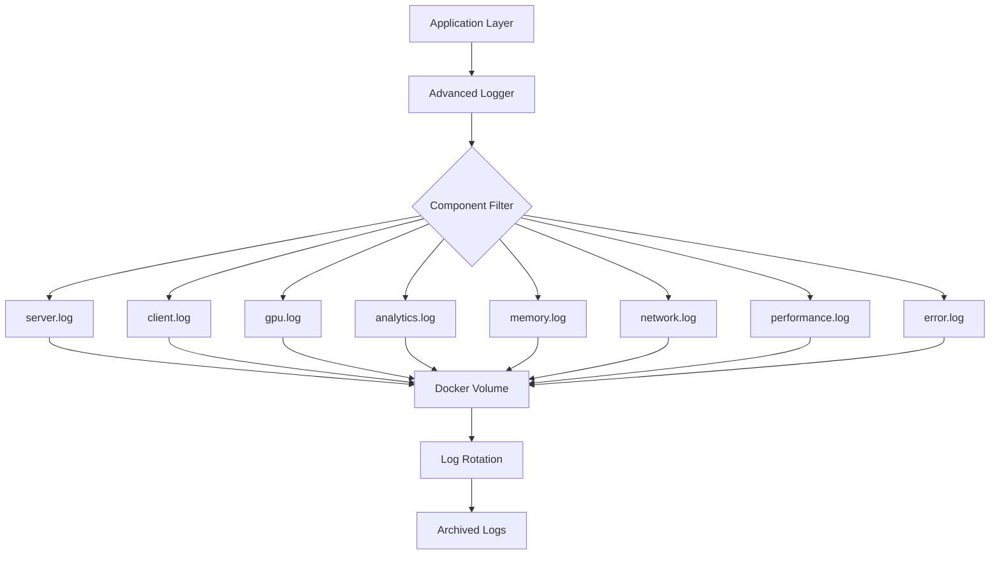

# Telemetry and Logging Guide

*[Guides](../guides/README.md) > Telemetry and Logging*

**Version**: 1.0.0
**Last Updated**: 2025-09-17
**Status**: ✅ COMPREHENSIVE IMPLEMENTATION

This guide provides complete documentation for the VisionFlow WebXR telemetry and logging system, including implementation details, operational procedures, and troubleshooting guidance.

## 📋 Table of Contents

1. [System Overview](#system-overview)
2. [Architecture and Components](#architecture-and-components)
3. [Implementation Guide](#implementation-guide)
4. [Log Formats and Structure](#log-formats-and-structure)
5. [Operational Procedures](#operational-procedures)
6. [Performance Monitoring](#performance-monitoring)
7. [Troubleshooting Guide](#troubleshooting-guide)
8. [Log Analysis and Queries](#log-analysis-and-queries)
9. [Best Practices](#best-practices)
10. [API Reference](#api-reference)

---

## System Overview

The VisionFlow telemetry system provides comprehensive logging, monitoring, and performance analysis capabilities across the entire application stack. It's designed for production-grade observability with structured logging, automatic correlation, and real-time metrics.

### Key Features

- **Structured JSON Logging**: All logs in parseable JSON format
- **Component Separation**: Dedicated log files by system component
- **Docker Volume Integration**: Persistent storage across container lifecycles
- **Performance Monitoring**: Real-time metrics and bottleneck detection
- **Agent Lifecycle Tracking**: Complete audit trail for multi-agent systems
- **Position Fix Logging**: Automatic detection and correction of agent clustering
- **Distributed Correlation**: Request tracing across service boundaries
- **GPU Telemetry**: Comprehensive GPU kernel and memory monitoring

### Supported Log Levels

- **DEBUG**: Detailed diagnostic information
- **INFO**: General operational messages
- **WARN**: Warning conditions that may require attention
- **ERROR**: Error conditions requiring immediate action
- **CRITICAL**: Critical system failures

---

## Architecture and Components

### Core Components



### Log Components

| Component | Purpose | File | Description |
|-----------|---------|------|-------------|
| **Server** | Backend operations | `server.log` | Rust server events, API calls, system status |
| **Client** | Frontend operations | `client.log` | TypeScript client events, UI interactions |
| **GPU** | GPU compute operations | `gpu.log` | Kernel execution, memory allocation, errors |
| **Analytics** | Data processing | `analytics.log` | Graph processing, algorithm execution |
| **Memory** | Memory management | `memory.log` | Allocation, deallocation, leak detection |
| **Network** | Network operations | `network.log` | WebSocket events, connection status |
| **Performance** | Performance metrics | `performance.log` | Timing data, throughput measurements |
| **Error** | Error aggregation | `error.log` | All errors across components |

### Storage and Retention

- **Location**: Docker volume `/app/logs`
- **Rotation**: Automatic at 50MB per file
- **Archive**: Timestamped files in `archived/` directory
- **Retention**: Maximum 10 archived files per component
- **Format**: JSON lines (one JSON object per line)

---

## Implementation Guide

### Rust Backend Integration

#### Basic Structured Logging

```rust
use crate::utils::advanced_logging::{log_structured, LogComponent};
use log::Level;
use serde_json::json;
use std::collections::HashMap;

// Simple log with message only
log_structured(
    LogComponent::Server,
    Level::Info,
    "Application started successfully",
    None
);

// Log with metadata
let metadata = HashMap::from([
    ("version".to_string(), json!("2.0.0")),
    ("port".to_string(), json!(3000)),
    ("debug_mode".to_string(), json!(false))
]);

log_structured(
    LogComponent::Server,
    Level::Info,
    "Server configuration loaded",
    Some(metadata)
);
```

#### GPU Kernel Logging

```rust
use crate::utils::advanced_logging::log_gpu_kernel;

// Log GPU kernel execution
log_gpu_kernel(
    "vector_addition",     // kernel name
    1250.5,               // execution time in microseconds
    256.0,                // allocated memory in MB
    512.0                 // peak memory in MB
);
```

#### Error Logging with Recovery

```rust
use crate::utils::advanced_logging::log_gpu_error;

// Log GPU error with recovery attempt
log_gpu_error("CUDA out of memory during clustering", true);

// Log application error with context
let error_metadata = HashMap::from([
    ("agent_id".to_string(), json!("agent-123")),
    ("operation".to_string(), json!("position_update")),
    ("retry_count".to_string(), json!(3)),
    ("recovery_action".to_string(), json!("agent_restart"))
]);

log_structured(
    LogComponent::Error,
    Level::Error,
    "Agent coordination timeout",
    Some(error_metadata)
);
```

#### Performance Logging

```rust
use crate::utils::advanced_logging::log_performance;
use std::time::Instant;

let start_time = Instant::now();

// ... perform operation ...

let duration_ms = start_time.elapsed().as_millis() as f64;
let throughput_ops_per_sec = Some(120.5);

log_performance(
    "graph_update_operation",
    duration_ms,
    throughput_ops_per_sec
);
```

#### Memory Event Logging

```rust
use crate::utils::advanced_logging::log_memory_event;

// Log memory allocation
log_memory_event("agent_spawn_allocation", 128.5, 256.0);

// Log memory deallocation
log_memory_event("agent_cleanup_deallocation", 64.2, 192.0);
```

### TypeScript Client Integration

#### Client Logger Setup

```typescript
import { createLogger } from '../utils/logger';

const logger = createLogger('AgentManager', {
    level: 'info',
    maxLogEntries: 1000
});

// Basic logging
logger.info('Agent system initializing', { agentCount: 5 });
logger.warn('Agent health below threshold', { agentId: 'agent-123', health: 45 });
logger.error('Agent spawn failed', new Error('Network timeout'));

// Access stored logs
const recentLogs = logger.getLogs();
console.log(`Retrieved ${recentLogs.length} log entries`);
```

#### Activity Log Panel Integration

The `ActivityLogPanel` component automatically displays real-time agent activities:

```typescript
import { ActivityLogPanel } from '../components/ActivityLogPanel';

<ActivityLogPanel
    className="activity-panel"
    maxEntries={200}
/>
```

### Docker Configuration

#### Volume Mounting

```yaml
# docker-compose.yml
services:
  multi-agent:
    volumes:
      - ./logs:/app/logs  # Mount host directory for log persistence
      - agent-logs:/app/logs  # Or use named volume

volumes:
  agent-logs:
    driver: local
```

#### Environment Variables

```yaml
environment:
  - LOG_DIR=/app/logs
  - LOG_LEVEL=info
  - RUST_LOG=info
  - DEBUG_ENABLED=false
```

---

## Log Formats and Structure

### Standard Log Entry Format

All log entries follow this JSON structure:

```json
{
  "timestamp": "2025-09-17T10:30:45.123Z",
  "level": "INFO",
  "component": "server",
  "message": "Agent spawned successfully",
  "metadata": {
    "agent_id": "agent-456",
    "agent_type": "coordinator",
    "spawn_time_ms": 1250,
    "memory_allocated_mb": 64.5
  },
  "execution_time_ms": 1250.0,
  "memory_usage_mb": 64.5,
  "gpu_metrics": null
}
```

### GPU-Specific Log Format

GPU operations include additional telemetry:

```json
{
  "timestamp": "2025-09-17T10:30:45.123Z",
  "level": "INFO",
  "component": "gpu",
  "message": "Kernel clustering_kernel executed in 1250.50μs",
  "metadata": null,
  "execution_time_ms": 1.2505,
  "memory_usage_mb": 256.0,
  "gpu_metrics": {
    "kernel_name": "clustering_kernel",
    "execution_time_us": 1250.5,
    "memory_allocated_mb": 256.0,
    "memory_peak_mb": 384.0,
    "gpu_utilization_percent": null,
    "error_count": 0,
    "recovery_attempts": 0,
    "performance_anomaly": false
  }
}
```

### Position Fix Log Format

Agent position corrections are logged with detailed before/after data:

```json
{
  "timestamp": "2025-09-17T10:30:45.123Z",
  "level": "WARN",
  "component": "analytics",
  "message": "Origin clustering detected, applying position fix",
  "metadata": {
    "agent_id": "agent-789",
    "position_x": 0.05,
    "position_y": 0.02,
    "position_z": 0.01,
    "origin_cluster_detected": true,
    "clustering_fix_applied": true
  }
}
```

### Error Log Format

Errors include comprehensive context and recovery information:

```json
{
  "timestamp": "2025-09-17T10:30:45.123Z",
  "level": "ERROR",
  "component": "gpu",
  "message": "CUDA kernel execution failed",
  "metadata": {
    "kernel_name": "force_computation",
    "error_code": "CUDA_OUT_OF_MEMORY",
    "recovery_attempted": true,
    "recovery_successful": false,
    "memory_requested_mb": 2048.0,
    "memory_available_mb": 1024.0
  },
  "gpu_metrics": {
    "kernel_name": "force_computation",
    "execution_time_us": null,
    "memory_allocated_mb": null,
    "memory_peak_mb": null,
    "gpu_utilization_percent": null,
    "error_count": 1,
    "recovery_attempts": 1,
    "performance_anomaly": null
  }
}
```

---

## Operational Procedures

### Monitoring Agent Health

#### Real-time Health Monitoring

```bash
# Monitor live agent health from logs
tail -f /app/logs/analytics.log | jq 'select(.message | contains("Agent health"))'

# Watch for position clustering issues
tail -f /app/logs/analytics.log | jq 'select(.metadata.origin_cluster_detected == true)'

# Monitor agent lifecycle events
grep -E "(Agent spawned|Agent terminated|Agent error)" /app/logs/server.log | tail -20
```

#### Health Check Queries

```bash
# Count active agents
grep "Agent spawned" /app/logs/server.log | wc -l

# Check for unhealthy agents (health < 50%)
jq 'select(.metadata.health? and (.metadata.health | tonumber) < 50)' /app/logs/analytics.log

# Monitor agent performance degradation
jq 'select(.metadata.performance_anomaly == true)' /app/logs/gpu.log
```

### Debugging Agent Position Issues

#### Position Clustering Detection

```bash
# Find agents with origin clustering issues
jq 'select(.metadata.origin_cluster_detected == true)' /app/logs/analytics.log

# Track position corrections over time
jq 'select(.message | contains("Position fix applied"))' /app/logs/analytics.log | \
jq '.timestamp, .metadata.agent_id, .metadata.corrected_position'

# Monitor position dispersion effectiveness
jq 'select(.metadata.clustering_fix_applied == true)' /app/logs/analytics.log | \
jq '.metadata | {agent_id, original_position, corrected_position}'
```

#### Position Validation Queries

```bash
# Check for agents still at origin after fix attempts
jq 'select(.metadata.position_x? and (.metadata.position_x | tonumber) < 1.0 and
          .metadata.position_y? and (.metadata.position_y | tonumber) < 1.0 and
          .metadata.position_z? and (.metadata.position_z | tonumber) < 1.0)' /app/logs/analytics.log

# Validate position fix success rate
grep -c "Position fix applied successfully" /app/logs/analytics.log
grep -c "Origin clustering detected" /app/logs/analytics.log
```

### Performance Bottleneck Analysis

#### GPU Performance Analysis

```bash
# Find slow GPU kernels (>5 seconds)
jq 'select(.gpu_metrics.execution_time_us? and (.gpu_metrics.execution_time_us | tonumber) > 5000000)' /app/logs/gpu.log

# Identify performance anomalies
jq 'select(.gpu_metrics.performance_anomaly == true)' /app/logs/gpu.log

# Memory usage patterns
jq '.gpu_metrics | select(.memory_peak_mb?) | {kernel: .kernel_name, peak_mb: .memory_peak_mb}' /app/logs/gpu.log

# GPU error frequency
jq 'select(.gpu_metrics.error_count? and (.gpu_metrics.error_count | tonumber) > 0)' /app/logs/gpu.log | wc -l
```

#### System Performance Metrics

```bash
# Slowest operations
jq 'select(.execution_time_ms? and (.execution_time_ms | tonumber) > 1000) |
    {operation: .message, time_ms: .execution_time_ms}' /app/logs/performance.log | \
    sort -k.time_ms -nr

# Memory allocation trends
jq 'select(.metadata.allocated_mb?) | {time: .timestamp, allocated: .metadata.allocated_mb}' /app/logs/memory.log

# Network latency issues
jq 'select(.component == "network" and .level == "WARN")' /app/logs/network.log
```

### Log Management Best Practices

#### Log Rotation Monitoring

```bash
# Check current log file sizes
ls -lh /app/logs/*.log

# Monitor archived logs
ls -lah /app/logs/archived/

# Check rotation frequency
find /app/logs/archived/ -name "*.log" -mtime -1 | wc -l
```

#### Space Management

```bash
# Total log space usage
du -sh /app/logs/

# Clean up old archived logs manually (if needed)
find /app/logs/archived/ -name "*.log" -mtime +30 -delete

# Monitor disk usage
df -h /app/logs/
```

#### Performance Impact Monitoring

```bash
# Check logging overhead
grep "Logging overhead" /app/logs/performance.log

# Monitor I/O wait times
jq 'select(.metadata.io_wait_ms?)' /app/logs/performance.log

# Verify concurrent logging safety
grep -c "concurrent_test" /app/logs/*.log
```

---

## Performance Monitoring

### Real-time Performance Dashboard

#### Key Performance Indicators (KPIs)

1. **Agent Health Metrics**
   - Active agent count
   - Average agent health score
   - Position clustering incidents
   - Agent spawn/termination rate

2. **GPU Performance Metrics**
   - Kernel execution times
   - Memory utilization
   - Error frequency
   - Performance anomalies

3. **System Performance Metrics**
   - Operation throughput
   - Memory allocation rate
   - Network latency
   - Log processing overhead

#### Performance Summary API

```bash
# Get current performance summary
curl http://localhost:3000/api/performance/summary

# Example response:
{
  "vector_addition": {
    "avg_time_us": 1250.5,
    "min_time_us": 980.2,
    "max_time_us": 2100.8,
    "sample_count": 1500,
    "total_time_us": 1875750.0
  },
  "gpu_errors": 3,
  "recovery_attempts": 2
}
```

### Performance Tuning Guidelines

#### Logging Configuration Optimization

```rust
// High-performance logging configuration
let logger = AdvancedLogger::new("/app/logs").expect("Logger init");

// Configure rotation for high-throughput scenarios
let rotation_config = LogRotationConfig {
    max_file_size_mb: 100,  // Larger files for fewer rotations
    max_files: 5,           // Fewer archived files
    compress_rotated: true, // Enable compression
    rotation_interval_hours: 12 // More frequent rotation
};
```

#### Memory Usage Optimization

- **Bounded Metrics**: Keep only last 100 measurements per kernel
- **Rolling Averages**: Use sliding window for anomaly detection
- **Lazy Evaluation**: Only compute summaries when requested
- **Efficient Serialization**: Minimal JSON overhead

#### I/O Performance Tuning

- **Buffered Writing**: Use `BufWriter` for efficient disk writes
- **Batch Operations**: Group log entries when possible
- **Async Logging**: Non-blocking log operations
- **Volume Optimization**: Use fast SSD storage for log volumes

### Alerting and Notifications

#### Critical Alert Conditions

```bash
# High error rate (>10 errors per minute)
tail -f /app/logs/error.log | while read line; do
    errors=$(echo "$line" | jq -r '.level' | grep -c "ERROR")
    if [ "$errors" -gt 10 ]; then
        echo "ALERT: High error rate detected"
    fi
done

# GPU memory exhaustion
tail -f /app/logs/gpu.log | jq 'select(.message | contains("out of memory"))'

# Agent clustering issues
tail -f /app/logs/analytics.log | jq 'select(.metadata.origin_cluster_detected == true)'
```

---

## Troubleshooting Guide

### Common Issues and Solutions

#### Issue: Log Files Not Created

**Symptoms:**
- Missing log files in `/app/logs/`
- No logging output visible

**Diagnosis:**
```bash
# Check directory permissions
ls -la /app/logs/
# Check environment variables
env | grep LOG
# Check logger initialization
grep "Advanced logging system initialized" /app/logs/server.log
```

**Solutions:**
1. Ensure log directory exists and is writable
2. Verify `LOG_DIR` environment variable
3. Check Docker volume mounting
4. Restart application with proper permissions

#### Issue: High Memory Usage

**Symptoms:**
- Application memory consumption growing
- Performance degradation over time

**Diagnosis:**
```bash
# Check memory metrics in logs
jq 'select(.memory_usage_mb?)' /app/logs/memory.log | tail -20

# Monitor performance summary growth
curl http://localhost:3000/api/performance/summary | jq 'keys | length'
```

**Solutions:**
1. Verify bounded metrics collection (max 100 per kernel)
2. Check for memory leaks in application code
3. Increase log rotation frequency
4. Reduce metadata complexity

#### Issue: Position Clustering Not Fixed

**Symptoms:**
- Agents remain clustered at origin
- Position fix logs present but ineffective

**Diagnosis:**
```bash
# Check fix application logs
jq 'select(.message | contains("Position fix applied"))' /app/logs/analytics.log

# Verify corrected positions are valid
jq 'select(.metadata.corrected_position?)' /app/logs/analytics.log
```

**Solutions:**
1. Increase position dispersion range
2. Check for position override issues
3. Verify agent update pipeline
4. Monitor position validation logic

#### Issue: GPU Performance Anomalies

**Symptoms:**
- Frequent performance anomaly flags
- GPU operations slower than expected

**Diagnosis:**
```bash
# Analyze kernel performance trends
jq 'select(.gpu_metrics.performance_anomaly == true)' /app/logs/gpu.log | \
jq '{kernel: .gpu_metrics.kernel_name, time: .gpu_metrics.execution_time_us}'

# Check for resource contention
jq 'select(.gpu_metrics.memory_peak_mb? and (.gpu_metrics.memory_peak_mb | tonumber) > 1000)' /app/logs/gpu.log
```

**Solutions:**
1. Adjust anomaly detection thresholds
2. Optimize GPU kernel implementations
3. Implement better memory management
4. Add GPU resource monitoring

#### Issue: Log Rotation Not Working

**Symptoms:**
- Log files growing beyond size limits
- Archived directory empty

**Diagnosis:**
```bash
# Check current file sizes
ls -lh /app/logs/*.log

# Verify rotation configuration
grep "rotation" /app/logs/server.log

# Check archived directory
ls -la /app/logs/archived/
```

**Solutions:**
1. Verify file permissions for log directory
2. Check disk space availability
3. Ensure rotation configuration is correct
4. Manual rotation if needed

### Debug Mode Activation

#### Enable Debug Logging

```bash
# Via environment variable
export RUST_LOG=debug
export DEBUG_ENABLED=true

# Via Docker Compose
services:
  multi-agent:
    environment:
      - RUST_LOG=debug
      - DEBUG_ENABLED=true
```

#### Debug Output Analysis

```bash
# Filter debug messages
jq 'select(.level == "DEBUG")' /app/logs/server.log

# Trace specific operations
jq 'select(.metadata.operation?)' /app/logs/server.log | \
jq '{time: .timestamp, op: .metadata.operation, result: .message}'
```

---

## Log Analysis and Queries

### Common Analysis Patterns

#### Agent Lifecycle Analysis

```bash
# Complete agent lifecycle for specific agent
AGENT_ID="agent-123"
grep "$AGENT_ID" /app/logs/*.log | jq 'select(.metadata.agent_id == "'$AGENT_ID'")' | \
sort_by(.timestamp)

# Agent spawn success rate
total_spawns=$(grep -c "Agent spawn requested" /app/logs/server.log)
successful_spawns=$(grep -c "Agent spawned successfully" /app/logs/server.log)
echo "Success rate: $(( successful_spawns * 100 / total_spawns ))%"
```

#### Performance Trend Analysis

```bash
# GPU kernel performance over time
jq 'select(.gpu_metrics.execution_time_us?) |
    {time: .timestamp, kernel: .gpu_metrics.kernel_name, us: .gpu_metrics.execution_time_us}' \
    /app/logs/gpu.log | head -100

# Memory allocation trends
jq 'select(.metadata.allocated_mb?) |
    {time: .timestamp, allocated: .metadata.allocated_mb}' \
    /app/logs/memory.log > memory_trend.json
```

#### Error Pattern Analysis

```bash
# Most common error types
jq 'select(.level == "ERROR") | .message' /app/logs/error.log | \
sort | uniq -c | sort -rn

# Error recovery success rate
total_errors=$(jq 'select(.level == "ERROR")' /app/logs/error.log | wc -l)
recovered_errors=$(jq 'select(.metadata.recovery_successful == true)' /app/logs/error.log | wc -l)
echo "Recovery rate: $(( recovered_errors * 100 / total_errors ))%"
```

### Advanced Query Examples

#### Multi-Component Correlation

```bash
# Find correlated events across components
CORRELATION_ID="req-123-456"
grep "$CORRELATION_ID" /app/logs/*.log | jq 'select(.metadata.correlation_id == "'$CORRELATION_ID'")' | \
jq '{component: .component, time: .timestamp, message: .message}' | \
sort_by(.time)
```

#### Performance Bottleneck Identification

```bash
# Operations taking longer than 1 second
jq 'select(.execution_time_ms? and (.execution_time_ms | tonumber) > 1000) |
    {op: .message, time_ms: .execution_time_ms, component: .component}' \
    /app/logs/performance.log | sort_by(.time_ms) | reverse

# Memory usage spikes
jq 'select(.memory_usage_mb? and (.memory_usage_mb | tonumber) > 500)' \
    /app/logs/memory.log
```

#### Anomaly Detection Queries

```bash
# GPU performance anomalies with context
jq 'select(.gpu_metrics.performance_anomaly == true) |
    {time: .timestamp, kernel: .gpu_metrics.kernel_name,
     time_us: .gpu_metrics.execution_time_us,
     memory_mb: .gpu_metrics.memory_peak_mb}' \
    /app/logs/gpu.log

# Network connectivity issues
jq 'select(.component == "network" and .level == "ERROR")' \
    /app/logs/network.log
```

---

## Best Practices

### Development Best Practices

#### Structured Logging Standards

1. **Consistent Metadata**: Always include relevant context
2. **Meaningful Messages**: Clear, actionable log messages
3. **Appropriate Levels**: Use correct log levels for different events
4. **Avoid Sensitive Data**: Never log passwords, tokens, or personal data
5. **Performance Consideration**: Minimise logging overhead in hot paths

#### Code Examples

```rust
// Good: Structured with context
log_structured(
    LogComponent::Server,
    Level::Info,
    "Agent coordination completed",
    Some(HashMap::from([
        ("agent_count".to_string(), json!(agents.len())),
        ("coordination_time_ms".to_string(), json!(duration)),
        ("success_rate".to_string(), json!(success_rate))
    ]))
);

// Bad: Unstructured, no context
println!("Done coordinating agents");
```

#### Error Handling Best Practices

```rust
// Good: Comprehensive error context
match result {
    Ok(value) => log_structured(
        LogComponent::Server,
        Level::Info,
        "Operation completed successfully",
        Some(HashMap::from([("result_size".to_string(), json!(value.len()))]))
    ),
    Err(e) => {
        let error_metadata = HashMap::from([
            ("error_type".to_string(), json!(e.to_string())),
            ("retry_count".to_string(), json!(retry_count)),
            ("operation".to_string(), json!("agent_spawn")),
            ("recovery_attempted".to_string(), json!(true))
        ]);

        log_structured(
            LogComponent::Error,
            Level::Error,
            "Agent spawn failed with recovery attempted",
            Some(error_metadata)
        );
    }
}
```

### Production Best Practices

#### Resource Management

1. **Log Retention Policy**: Configure appropriate retention based on compliance needs
2. **Volume Sizing**: Ensure adequate disk space for peak logging periods
3. **Rotation Strategy**: Balance between file size and rotation frequency
4. **Monitoring**: Set up alerts for log system health

#### Security Considerations

1. **Access Control**: Restrict log file access to authorised personnel
2. **Data Sanitisation**: Ensure no sensitive information in logs
3. **Audit Trail**: Maintain logs for security incident investigation
4. **Encryption**: Consider log encryption for sensitive environments

#### Performance Optimisation

1. **Sampling**: Use log sampling for high-frequency operations
2. **Async Logging**: Implement non-blocking logging for critical paths
3. **Buffer Management**: Optimise buffer sizes for I/O efficiency
4. **Resource Limits**: Set appropriate memory and CPU limits

---

## API Reference

### Rust API Functions

#### Basic Logging Functions

```rust
// Structured logging with metadata
pub fn log_structured(
    component: LogComponent,
    level: Level,
    message: &str,
    metadata: Option<HashMap<String, serde_json::Value>>
)

// GPU kernel performance logging
pub fn log_gpu_kernel(
    kernel_name: &str,
    execution_time_us: f64,
    memory_allocated_mb: f64,
    memory_peak_mb: f64
)

// GPU error logging with recovery tracking
pub fn log_gpu_error(error_msg: &str, recovery_attempted: bool)

// Memory event logging
pub fn log_memory_event(event_type: &str, allocated_mb: f64, peak_mb: f64)

// Performance metric logging
pub fn log_performance(
    operation: &str,
    duration_ms: f64,
    throughput: Option<f64>
)

// Performance summary retrieval
pub fn get_performance_summary() -> HashMap<String, serde_json::Value>
```

#### Component Types

```rust
pub enum LogComponent {
    Server,       // Backend operations
    Client,       // Frontend operations
    GPU,         // GPU compute operations
    Analytics,   // Data processing
    Memory,      // Memory management
    Network,     // Network operations
    Performance, // Performance metrics
    Error,       // Error aggregation
}
```

### TypeScript API Functions

#### Client Logger Functions

```typescript
interface LoggerOptions {
    disabled?: boolean;
    level?: LogLevel;
    maxLogEntries?: number;
}

type LogLevel = 'debug' | 'info' | 'warn' | 'error';

// Create logger instance
export function createLogger(namespace: string, options?: LoggerOptions): Logger

// Logger interface
interface Logger {
    debug(message: any, ...args: any[]): void;
    info(message: any, ...args: any[]): void;
    warn(message: any, ...args: any[]): void;
    error(message: any, ...args: any[]): void;
    getLogs(): LogEntry[];
}
```

### REST API Endpoints

#### Performance Metrics

```http
GET /api/performance/summary
```

Returns comprehensive performance metrics including GPU kernel statistics, error counts, and recovery attempts.

#### Health Check

```http
GET /api/health
```

Returns system health status including logging system status.

---

## Conclusion

The VisionFlow telemetry system provides comprehensive observability into all aspects of the multi-agent WebXR application. By following this guide, you can effectively monitor system health, debug issues, and optimise performance.

For additional support or feature requests, please refer to the main project documentation or create an issue in the project repository.

**Last Updated**: 2025-09-17
**Guide Version**: 1.0.0
**System Compatibility**: VisionFlow WebXR v2.0.0+