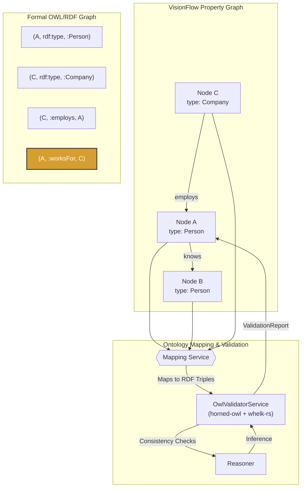

# Ontology Validation System

*[Server](../index.md) > [Features](../server/features/index.md)*

## Implementation Status

### ✅ Completed Components

- **OntologyActor** (`src/actors/ontology_actor.rs`): Fully implemented async actor system
- **OwlValidatorService** (`src/services/owl_validator.rs`): Complete validation engine with horned-owl integration
- **API Endpoints** (`src/handlers/api_handler/ontology/mod.rs`): Full REST and WebSocket API
- **Constraint Translation** (`src/physics/ontology_constraints.rs`): OWL axiom to physics constraint conversion
- **Real-time Updates**: WebSocket protocol for validation progress and constraint updates
- **Caching System**: Multi-level caching for performance optimisation
- **Error Handling**: Comprehensive error reporting with diagnostics

### 🔄 Current Capabilities

- **Ontology Loading**: Support for OWL, Turtle, RDF/XML formats from files, URLs, or direct content
- **Validation Modes**: Quick (<100ms), Full (<5s), and Incremental (<50ms) validation
- **Inference Engine**: Automatic discovery of implicit relationships using whelk-rs reasoner
- **Physics Integration**: Translation of logical axioms to visual physics constraints
- **Performance Monitoring**: Real-time metrics and health status reporting

### 📋 Related Documentation

- **[System Overview](ontology-system-overview.md)**: Complete architecture and component details
- **[API Reference](ontology-api-reference.md)**: Full REST and WebSocket API documentation
- **[User Guide](ontology-user-guide.md)**: Configuration, examples, and best practices

## Concept Overview

```mermaid
graph TB
    subgraph "Data Flow Overview"
        PG[Property Graph<br/>Flexible Structure] --> M[Mapping Service<br/>mapping.toml]
        M --> RDF[RDF Triples<br/>Formal Structure]
        RDF --> OV[OWL Validator<br/>horned-owl + whelk-rs]
        OV --> VR[Validation Report]
        OV --> IS[Inference Set]
        
        VR --> |Violations| D[Diagnostics<br/>& Fixes]
        IS --> |New Facts| G[Graph Enrichment]
        IS --> |Axioms| PC[Physics Constraints]
        
        PC --> GPU[GPU Physics Engine<br/>Constraint Groups]
        G --> PG
    end

    subgraph "System Architecture"
        API[REST/WS API<br/>/api/ontology/*] --> OA[Ontology Actor<br/>Async Message Handler]
        OA --> OVS[OwlValidatorService<br/>Core Logic]
        OA --> CT[Constraint Translator<br/>Axiom→Physics]
        
        OVS --> |Caching| Cache[In-Memory Cache<br/>Ontology/Mappings/Signatures]
        CT --> |Constraint Groups| CG[ontology_separation<br/>ontology_alignment<br/>ontology_boundaries<br/>ontology_identity]
    end

    subgraph "Validation Process"
        V1[Load Ontology<br/>Axioms] --> V2[Map Graph<br/>to RDF]
        V2 --> V3[Consistency<br/>Check]
        V3 --> V4[Run Inference<br/>Engine]
        V4 --> V5[Generate<br/>Report]
        V5 --> V6[Apply Results]
    end

    subgraph "Physics Translation"
        A1[DisjointClasses] --> |Repulsion| Sep[Separation Forces]
        A2[SubClassOf] --> |Attraction| Align[Alignment Forces]
        A3[InverseOf] --> |Bidirectional| Edge[Synthetic Edges]
        A4[SameAs] --> |Co-location| Merge[Identity Constraints]
    end

    style PG fill:#4A5568,stroke:#2D3748,stroke-width:2px,color:#fff
    style OV fill:#2B6CB0,stroke:#1A4E8D,stroke-width:2px,color:#fff
    style GPU fill:#D69E2E,stroke:#B7791F,stroke-width:2px,color:#fff
    style OA fill:#38A169,stroke:#276749,stroke-width:2px,color:#fff
```

## Introduction

The ontology system provides a formal validation and logical inference layer for the knowledge graph, acting as a "truth engine." While the base graph is a flexible property graph, the ontology system maps it to a strict OWL/RDF structure to perform powerful consistency checks and infer new knowledge.

This ensures that the knowledge graph remains logically sound and allows for the discovery of implicit relationships that are not explicitly defined.

## Hybrid Model: Property Graph + OWL/RDF

The system uses a hybrid model that combines the flexibility of a property graph with the formal rigidity of an OWL/RDF graph.

This hybrid approach allows developers and users to interact with a simple, flexible graph structure while leveraging the power of formal semantics for validation and advanced reasoning in the background.

## Architecture

### `OwlValidatorService`
-   **Location**: `owl_validator.rs` (planned)
-   **Description**: This is the core service responsible for the validation logic. It uses the `horned-owl` crate to parse OWL/RDF ontologies and the `whelk-rs` crate as its reasoner. The reasoner checks for logical inconsistencies (e.g., a node being an instance of two disjoint classes) and performs inference to derive new facts from the existing data and ontology axioms.

### `OntologyActor`
-   **Location**: `ontology_actor.rs` (planned)
-   **Description**: This actor provides an asynchronous, message-based API for the validation service. It is designed to handle potentially long-running reasoning tasks without blocking the main server threads.
-   **Message API**: It receives a `ValidateGraph` message, which contains the graph data to be validated. It then uses the `OwlValidatorService` to perform the validation and returns a `ValidationReport` to the caller.

## Workflow

The validation process follows a clear, step-by-step workflow:

1.  **Mapping to RDF**: The property graph is translated into a set of RDF triples. Node properties become data properties, and edges become object properties.
2.  **Consistency Check**: The `whelk-rs` reasoner loads the RDF triples and the domain ontology. It then checks for any logical contradictions based on the axioms defined in the ontology (e.g., `disjointWith`, cardinality restrictions).
3.  **Inference**: If the graph is consistent, the reasoner performs inference to generate new, implicit triples. For example, if the ontology states that `:employs` is the inverse property of `:worksFor`, the reasoner will infer that `(A, :worksFor, C)` is true if `(C, :employs, A)` exists.
4.  **Feedback Loop**: The results, including any inconsistencies or newly inferred relationships, are compiled into a `ValidationReport` and sent back to the `GraphServiceActor`. This report can be used to correct the graph or enrich it with the inferred knowledge.

## API Endpoint

-   **Endpoint**: `POST /api/analytics/validate` (planned)
-   **Description**: This endpoint will expose the ontology validation functionality over the REST API, allowing clients to request a formal validation of the current graph state.

## Use Cases

### Semantically-Aware Physics

The primary use case for the ontology system is to enable "Semantically-Aware Physics." The logical axioms in the ontology can be used to generate "hard" constraints for the physics engine.

For example:
-   An axiom like `Person disjointWith Company` can be translated into a strong repulsive force between all nodes of type `Person` and all nodes of type `Company`.
-   An axiom defining a parent-child relationship can be used to create a stronger attractive force between the parent and its children.

This allows the final graph layout to reflect the logical structure of the data, creating a more intuitive and insightful visualisation.

## Related Topics

- [AI Services Documentation](../../server/ai-services.md)
- [Actor System](../../server/actors.md)
- [Adaptive Balancing](../../features/adaptive-balancing.md)
- [Agent Orchestration Architecture](../../features/agent-orchestration.md)
- [Claude Flow MCP Integration](../../server/features/claude-flow-mcp-integration.md)
- [Configuration Architecture](../../server/config.md)
- [Feature Access Control](../../server/feature-access.md)
- [Features Documentation](../../features/index.md)
- [GPU Compute Architecture](../../server/gpu-compute.md)
- [GPU-Accelerated Analytics](../../client/features/gpu-analytics.md)
- [Graph Clustering](../../server/features/clustering.md)
- [MCP Integration](../../server/mcp-integration.md)
- [Multi Agent Orchestration](../../server/agent-swarm.md)
- [Neural Auto-Balance Feature](../../features/auto-balance.md)
- [Physics Engine](../../server/physics-engine.md)
- [Request Handlers Architecture](../../server/handlers.md)
- [Semantic Analysis Pipeline](../../server/features/semantic-analysis.md)
- [Server Architecture](../../server/architecture.md)
- [Server Documentation](../../server/index.md)
- [Server-Side Data Models](../../server/models.md)
- [Services Architecture](../../server/services.md)
- [Types Architecture](../../server/types.md)
- [Utilities Architecture](../../server/utils.md)
---

## Ontology Module — Development Plan (Actionable)

This plan specifies concrete modules, messages, endpoints, and milestones to integrate an OWL/RDF “truth engine” that complements the current semantic and physics layers. It is designed to plug cleanly into existing actors and analytics endpoints, and to translate formal axioms into runtime value: data validation, inference, and semantically-aware constraints.

### 1) Why this adds value now

- Detect and prevent data-quality regressions: type/range/domain/disjointness violations flagged early, with precise diagnostics and suggested fixes.
- Auto-enrich graph: inferred types, inverse relationships, and canonicalized identities improve navigation, analytics, and clustering baselines.
- Physics-aware semantics: translate ontology constraints to physically meaningful layout constraints (e.g., disjoint classes → separation; hierarchies → alignment), improving readability without hand-tuning.
- Incremental/repeatable: run lightweight validations “on every graph change” and heavier inferences “on demand” with caching and deltas.

---

## 2) Architecture Overview

New components (files are planned):

- Core service
  - [src/services/owl_validator.rs](src/services/owl_validator.rs)
    - Parses OWL (TTL/OWL/XML), builds ontology model (horned-owl), runs classification/consistency (whelk-rs), returns ValidationReport + InferenceSet.
- Actor boundary
  - [src/actors/ontology_actor.rs](src/actors/ontology_actor.rs)
    - Asynchronous API for validation/inference jobs; caches models; incremental runs.
- Mapping & storage
  - [ontology/mapping.toml](ontology/mapping.toml)
    - Declarative mapping from property-graph (nodes/edges/metadata) to IRIs/classes/object/data properties.
- API handler
  - [src/handlers/api_handler/ontology/mod.rs](src/handlers/api_handler/ontology/mod.rs)
    - REST + WS endpoints for validate/infer/report/config.
- Constraints translator
  - [src/physics/ontology_constraints.rs](src/physics/ontology_constraints.rs)
    - Converts OWL axioms + reasoner results into GPU-ready constraints and/or synthetic edges.

Integration points (existing):

- Semantic constraints generator: [rust.struct SemanticConstraintGenerator](src/physics/semantic_constraints.rs:157)
- Semantic processor actor: [rust.struct SemanticProcessorActor](src/actors/semantic_processor_actor.rs:122)
- Analytics feature flags: [rust.struct FeatureFlags](src/handlers/api_handler/analytics/mod.rs:2079)

---

## 3) Data Flow

1. Property Graph → RDF Triples
   - Map each node/edge/metadata via [ontology/mapping.toml](ontology/mapping.toml)
   - Output: triples + individual IRIs, class assertions, object/data properties

2. Reasoning
   - Load ontology axioms + mapped triples in [src/services/owl_validator.rs](src/services/owl_validator.rs)
   - Run:
     - Consistency check
     - Classification (subclasses, types)
     - Inference (inverse, symmetric, transitive, property restrictions)
   - Output: ValidationReport, InferenceSet

3. Translation to Value
   - Violations → diagnostics with actionable fixes (e.g., missing type, wrong range)
   - Inferences → a) node annotations (types/tags), b) synthetic edges, c) semantic constraints via [src/physics/ontology_constraints.rs](src/physics/ontology_constraints.rs)
   - Push constraints through either:
     - [rust.fn generate_constraints()](src/physics/semantic_constraints.rs:193)
     - Or direct constraint groups (new “ontology_*” groups) to the GPU pipeline

4. Feedback
   - REST/WS endpoints in [src/handlers/api_handler/ontology/mod.rs](src/handlers/api_handler/ontology/mod.rs)
   - UI toggles via analytics control panel; feature flag: `ontology_validation` (adds a new flag to [rust.struct FeatureFlags](src/handlers/api_handler/analytics/mod.rs:2079))

---

## 4) Mapping Specification (mapping.toml)

File: [ontology/mapping.toml](ontology/mapping.toml)

- Global
  - `base_iri = "https://visionflow.ai/graph#"`
  - `default_class = "vf:Thing"`
- Classes
  - `class_map.node_type."agent" = "vf:Agent"`
  - `class_map.node_type."file" = "vf:File"`
  - `class_map.fallback = "vf:Concept"`
- Properties
  - Object props from edges:
    - `edge_type."employs" = "vf:employs"`
    - `inverse."employs" = "vf:worksFor"`
  - Data props from metadata:
    - `metadata."fileSize" = "vf:fileSize"^^xsd:integer`
    - `metadata."language" = "vf:language"^^xsd:string`
- IRI templates
  - `iri.node = "vf:node/{id}"`
  - `iri.edge = "vf:edge/{source}-{target}"`
- Domain/Range hints (optional optimisation for validation)
  - `domain."vf:employs" = "vf:Company"`
  - `range."vf:employs" = "vf:Person"`

The mapper reads [src/models/graph.rs](src/models/graph.rs) nodes/edges and respects:
- Node ID: [rust.struct Node](src/models/node.rs:11) → IRI by template
- Edge: [rust.struct Edge](src/models/edge.rs:5) → object property by `edge_type` or configured defaults
- Metadata: from GraphData.metadata/id_to_metadata

---

## 5) Ontology → Physics Constraint Translation

The translator [src/physics/ontology_constraints.rs](src/physics/ontology_constraints.rs) converts axioms + inferred facts to constraint sets:

- DisjointClasses(A,B) ⇒ separation
  - Add constraints using [rust.fn generate_separation_constraints()](src/physics/semantic_constraints.rs:728)
- SubClassOf relationships and part-whole hints ⇒ alignment/sibling grouping
  - Reuse [rust.fn identify_hierarchical_relations()](src/physics/semantic_constraints.rs:597) outputs; boost alignment strength for confirmed hierarchies
- inverseOf(P,Q) ⇒ synthetic reciprocal edges; increases likelihood of cluster cohesion
- sameAs (identity) ⇒ candidate node merges or fixed-position co-location
- FunctionalProperty / cardinality ⇒ diagnostics; optional boundary or min-distance to reduce visual conflict.

The translator emits constraints in a dedicated “ontology_*” group so they can be toggled independently from semantic-only constraints:
- Groups: `ontology_separation`, `ontology_alignment`, `ontology_boundaries`, `ontology_identity`.

---

## 6) Actor/Message API (planned)

Add message types in [src/actors/messages.rs](src/actors/messages.rs):

- [rust.struct LoadOntologyAxioms](src/actors/messages.rs:1)
  - { source: OntologySource } // file path/string/url
- [rust.struct UpdateOntologyMapping](src/actors/messages.rs:1)
  - { mapping_toml: String }
- [rust.struct ValidateOntology](src/actors/messages.rs:1)
  - { graph: Arc&lt;GraphData&gt;, mode: ValidationMode } // quick|full
- [rust.struct ApplyInferences](src/actors/messages.rs:1)
  - { strategy: InferenceApplyMode } // annotate|edges|constraints|all
- [rust.struct GetOntologyReport](src/actors/messages.rs:1)
  - returns ValidationReportDTO
- [rust.struct GetOntologyHealth](src/actors/messages.rs:1)

New actor [src/actors/ontology_actor.rs](src/actors/ontology_actor.rs):
- In-memory cache of:
  - Parsed ontology (axioms)
  - Mappings
  - Last graph signature (hash for incremental runs)
- Scheduling:
  - Lightweight “quick consistency” on change bursts
  - Full classification/inference on manual trigger or idle windows
- Backpressure:
  - Bounded job queue with status polling.

Reports include:
- Violations: class inconsistency, disjointness, domain/range, cardinality
- Warnings: missing types, untyped properties
- Inferences: new types, edges, identities
- Constraint deltas: separated/aligned sets; boundary hints

---

## 7) REST & WS Endpoints

Under `/api/ontology` in [src/handlers/api_handler/ontology/mod.rs](src/handlers/api_handler/ontology/mod.rs):

- POST `/load-axioms` → Load ontology bytes/URL
- POST `/mapping` → Update mapping TOML (validates schema)
- POST `/validate` → Quick or full; returns job id + summary (blocking small graphs)
- GET `/report` → Latest report, includes diagnostics and suggested fixes
- POST `/apply` → Apply inferences (annotate graph, inject edges, add constraints)
- GET `/health` → Internal status/caches/reasoner status
- WS `/ws` → Push validation progress, new violations, inferences, and applied-constraint counts

Feature flag integration:
- Extend [rust.struct FeatureFlags](src/handlers/api_handler/analytics/mod.rs:2079) with `ontology_validation: bool`
- Toggle endpoints exposure and translator application
- Wire UI toggles through existing analytics control panel (converges with constraints view and GPU metrics)

---

## 8) Incremental & Performance Strategy

- Mapping cache keyed by node/edge version (hash over node fields + metadata id)
- Graph signature (blake3 over (n,e) IDs + counts + version clocks)
- Delta reasoning short path:
  - For type-only changes: check domain/range fast path, skip full classification
  - Batched “edge type” updates: local checks + inverse enforcement
- Time budgets:
  - Quick: &lt;100ms for small graphs; budget enforcer to abort heavy passes
  - Full: async job with progress and partial results on WS
- Memory pressure handling:
  - Release reasoner internals between runs; pool reused parser state

---

## 9) MVP → Phased Delivery

Milestone 1 (2–3 days)
- Skeletons: [src/services/owl_validator.rs](src/services/owl_validator.rs), [src/actors/ontology_actor.rs](src/actors/ontology_actor.rs)
- Minimal mapping: node_type → class; single inverse pair
- API: POST `/validate`, GET `/report`
- Constraints: implement DisjointClasses → separation
- Flag: add `ontology_validation` to [rust.struct FeatureFlags](src/handlers/api_handler/analytics/mod.rs:2079) + update [rust.fn update_feature_flags()](src/handlers/api_handler/analytics/mod.rs:2129)
- Tests: [tests/ontology_smoke_test.rs](tests/ontology_smoke_test.rs)

Milestone 2 (3–5 days)
- Full mapping.toml DSL (classes/object/data props; iri templates; domain/range hints)
- Inference: inverseOf, symmetric, transitive; sameAs detection persisted in report
- Translator: alignment and boundary constraints from hierarchies / part-whole
- Analytics panel integration: show violations & inferences; toggle apply-strategy
- Delta validation fast-path; graph signature cache

Milestone 3 (1–2 weeks)
- Cardinality checks; functional property handling; complex restrictions (someValuesFrom/allValuesFrom) to hints/warnings
- Synthetic edge apply path with rollback (annotate-only vs write-through)
- Optional SPARQL (OxiGraph optional module) for richer queries (deferred behind feature)
- Benchmarks on 1k/10k nodes; guidance for thresholds

---

## 10) Detailed Interfaces

OntologyActor public API (non-code notation; implemented in [src/actors/ontology_actor.rs](src/actors/ontology_actor.rs)):
- [rust.fn validate_graph()](src/actors/ontology_actor.rs:1)
- [rust.fn load_axioms()](src/actors/ontology_actor.rs:1)
- [rust.fn update_mapping()](src/actors/ontology_actor.rs:1)
- [rust.fn apply_inferences()](src/actors/ontology_actor.rs:1)
- [rust.fn get_report()](src/actors/ontology_actor.rs:1)

OwlValidatorService (in [src/services/owl_validator.rs](src/services/owl_validator.rs)):
- [rust.fn build_model()](src/services/owl_validator.rs:1) → parse + cache ontology
- [rust.fn map_graph_to_rdf()](src/services/owl_validator.rs:1) → use [ontology/mapping.toml](ontology/mapping.toml)
- [rust.fn run_consistency()](src/services/owl_validator.rs:1)
- [rust.fn run_inference()](src/services/owl_validator.rs:1)
- [rust.fn summarize()](src/services/owl_validator.rs:1) → ValidationReportDTO + InferenceSetDTO

Constraint translator (in [src/physics/ontology_constraints.rs](src/physics/ontology_constraints.rs)):
- [rust.fn axioms_to_constraints()](src/physics/ontology_constraints.rs:1)
- [rust.fn inferences_to_constraints()](src/physics/ontology_constraints.rs:1)
- Emits groups: `ontology_separation`, `ontology_alignment`, `ontology_boundaries`, `ontology_identity`
- Works alongside existing generators:
  - [rust.fn generate_constraints()](src/physics/semantic_constraints.rs:193)
  - [rust.fn generate_separation_constraints()](src/physics/semantic_constraints.rs:728)
  - [rust.fn identify_hierarchical_relations()](src/physics/semantic_constraints.rs:597)

---

## 11) Reports & Diagnostics

ValidationReport fields (DTO, serialized by [src/handlers/api_handler/ontology/mod.rs](src/handlers/api_handler/ontology/mod.rs)):
- summary: { consistent: bool, violations: u32, warnings: u32, inferredTriples: u64 }
- violations[]:
  - code: e.g., `DISJOINT_CLASS_VIOLATION`, `DOMAIN_MISMATCH`, `RANGE_MISMATCH`, `CARDINALITY_EXCEEDED`
  - iri(s), nodeId(s), property, details, suggestedFix
- inferences[]:
  - type assertions, inverse edges, equivalences, property closures
- constraints:
  - groups, counts, strength summary
- performance:
  - timing (parse/map/reason/translate), cache hits

Suggested fix examples:
- Add missing type mapping for node_type “X” → propose `vf:X`
- Flip edge direction or set inverse mapping if domain/range conflict
- Reduce duplicates or set sameAs for identity collisions

---

## 12) Testing & Datasets

- Unit: small ontology with:
  - `vf:Person disjointWith vf:Company`
  - `vf:employs inverseOf vf:worksFor`
  - Domain/Range for `vf:employs`
- Graph fixtures:
  - Company C employs Person P → OK
  - Company C employs Company D → violation
  - Only `employs` edge present → inferred `worksFor`
- Files:
  - [tests/ontology_smoke_test.rs](tests/ontology_smoke_test.rs)
  - [tests/fixtures/mini_ontology.ttl](tests/fixtures/mini_ontology.ttl)
  - [tests/fixtures/mapping.toml](tests/fixtures/mapping.toml)
- Integration:
  - Validate → Report → Apply-inferences (annotate-only) → Translator emits constraints → visible on `/api/analytics/constraints`

---

## 13) Dependencies & Feature Flags

Cargo dependencies (added later to Cargo.toml):
- horned-owl (parse/serialize)
- whelk-rs (reasoner)
- Optional: oxigraph (SPARQL/triple store for future analytics)
- Enable/disable via feature `ontology`:
  - If off: endpoints return 503; actor not started; translator inactive

Feature flags:
- Add `ontology_validation: bool` to [rust.struct FeatureFlags](src/handlers/api_handler/analytics/mod.rs:2079)
- Expose toggles through analytics control panel
- Persist flag with existing settings workflow

---

## 14) Risks & Mitigations

- Reasoner cost on large graphs → incremental mapping + delta runs + time budgets
- Mapping drift → validate [ontology/mapping.toml](ontology/mapping.toml) schema; report unknown edge_type/node_type
- UX overload → default to “annotate-only”; constraints application behind explicit toggle
- Identity merges (`sameAs`) → start as annotation-only; never auto-merge IDs by default

---

## 15) Success Metrics

- < 150ms quick validation on 2k nodes, 3k edges (cached ontology)
- ≥ 95% of inverse relationships realised after inference
- ≥ 80% of disjointness/domain/range violations produce actionable fixes adopted
- Layout coherence improvement (edge crossing reduction, cluster separation) with ontology constraints enabled

---

## 16) Immediate Next Actions (Day 1)

1) Create scaffolds  
- [src/services/owl_validator.rs](src/services/owl_validator.rs)  
- [src/actors/ontology_actor.rs](src/actors/ontology_actor.rs)  
- [src/physics/ontology_constraints.rs](src/physics/ontology_constraints.rs)  
- [src/handlers/api_handler/ontology/mod.rs](src/handlers/api_handler/ontology/mod.rs)  
- [ontology/mapping.toml](ontology/mapping.toml)

2) Add messages in [src/actors/messages.rs](src/actors/messages.rs):  
- [rust.struct ValidateOntology](src/actors/messages.rs:1), [rust.struct LoadOntologyAxioms](src/actors/messages.rs:1), [rust.struct UpdateOntologyMapping](src/actors/messages.rs:1)

3) Extend flags in [rust.struct FeatureFlags](src/handlers/api_handler/analytics/mod.rs:2079) with `ontology_validation: bool`

4) Minimal “DisjointClasses → separation” translator and end-to-end smoke test  
- [tests/ontology_smoke_test.rs](tests/ontology_smoke_test.rs)

This plan is intentionally incremental and immediately actionable, aligning with current actors and the constraint pipeline while keeping validation and inference orthogonal and safe to toggle.