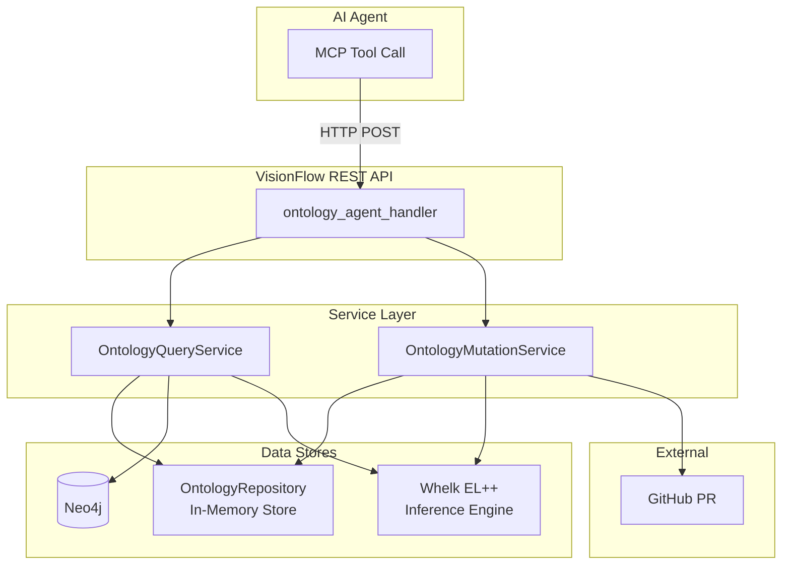

# Ontology Agent Tools

## Overview

VisionFlow exposes 7 ontology tools that agents can invoke via MCP (Model Context Protocol) or REST API. These tools enable agents to discover knowledge, read enriched notes, validate queries, traverse the ontology graph, and propose new notes or amendments — all grounded in OWL 2 EL++ reasoning via the Whelk inference engine.

Logseq markdown notes with `OntologyBlock` headers ARE the knowledge graph nodes. Discovery happens via ontology semantics: class hierarchy traversal, Whelk subsumption reasoning, and relationship fan-out.

## Architecture



## Tools Reference

### 1. `ontology_discover` — Semantic Discovery

Find relevant ontology classes by keyword with Whelk inference expansion.

**MCP Tool Name**: `ontology_discover`
**REST Endpoint**: `POST /api/ontology-agent/discover`

**Input**:
```json
{
  "query": "neural network",
  "limit": 10,
  "domain": "ai"
}
```

| Field | Type | Required | Description |
|-------|------|----------|-------------|
| `query` | string | Yes | Keywords to search for |
| `limit` | integer | No | Max results (default: 20) |
| `domain` | string | No | Filter by domain prefix (e.g., "ai", "mv") |

**Output**: Array of `DiscoveryResult`:
```json
[
  {
    "iri": "ai:NeuralNetwork",
    "preferred_term": "Neural Network",
    "definition_summary": "A computational model inspired by...",
    "relevance_score": 0.95,
    "quality_score": 0.8,
    "domain": "ai",
    "relationships": [
      { "rel_type": "subClassOf", "target_iri": "ai:MachineLearning", "target_term": "Machine Learning" }
    ],
    "whelk_inferred": false
  }
]
```

**Discovery Pipeline**:
1. Keyword match against `OwlClass` preferred_term and label
2. Expand via Whelk transitive closure (subclasses + superclasses)
3. Follow semantic relationships (has-part, requires, enables, bridges-to)
4. Score and rank results by relevance

---

### 2. `ontology_read` — Read Enriched Note

Read a full ontology note with axioms, relationships, and schema context.

**MCP Tool Name**: `ontology_read`
**REST Endpoint**: `POST /api/ontology-agent/read`

**Input**:
```json
{
  "iri": "mv:Person"
}
```

**Output**: `EnrichedNote` with:
- Full Logseq markdown content
- Ontology metadata (OWL class, physicality, role, domain, quality score)
- Whelk-inferred axioms
- Related notes with summaries
- Schema context for LLM grounding

---

### 3. `ontology_query` — Validated Cypher Execution

Execute Cypher queries against the knowledge graph with schema-aware validation.

**MCP Tool Name**: `ontology_query`
**REST Endpoint**: `POST /api/ontology-agent/query`

**Input**:
```json
{
  "cypher": "MATCH (n:Person) RETURN n LIMIT 10"
}
```

**Validation Features**:
- Checks all node labels against known OWL classes
- Provides Levenshtein distance hints for typos (e.g., "Perzon" → "Did you mean Person?")
- Built-in labels (OwlClass, OwlProperty, etc.) always pass validation
- Returns validation errors before execution

---

### 4. `ontology_traverse` — Graph Traversal

Walk the ontology graph via BFS from a starting node.

**MCP Tool Name**: `ontology_traverse`
**REST Endpoint**: `POST /api/ontology-agent/traverse`

**Input**:
```json
{
  "start_iri": "mv:Person",
  "depth": 3,
  "relationship_types": ["subClassOf", "has-part"]
}
```

| Field | Type | Required | Description |
|-------|------|----------|-------------|
| `start_iri` | string | Yes | Starting class IRI |
| `depth` | integer | No | Max BFS depth (default: 3) |
| `relationship_types` | array | No | Filter by relationship types |

**Output**: `TraversalResult` with nodes and edges discovered during BFS.

---

### 5. `ontology_propose` — Propose Create or Amend

Create new notes or amend existing ones with Whelk consistency checks.

**MCP Tool Name**: `ontology_propose`
**REST Endpoint**: `POST /api/ontology-agent/propose`

**Create Input**:
```json
{
  "action": "create",
  "preferred_term": "Quantum Computing",
  "definition": "A type of computation using quantum mechanics",
  "owl_class": "tc:QuantumComputing",
  "physicality": "non-physical",
  "role": "concept",
  "domain": "tc",
  "is_subclass_of": ["mv:Technology"],
  "relationships": { "requires": ["tc:Qubit"] },
  "alt_terms": ["QC"],
  "owner_user_id": "user-123",
  "agent_context": {
    "agent_id": "researcher-001",
    "agent_type": "researcher",
    "task_description": "Research quantum computing concepts",
    "confidence": 0.85,
    "user_id": "user-123"
  }
}
```

**Amend Input**:
```json
{
  "action": "amend",
  "target_iri": "mv:Person",
  "amendment": {
    "add_relationships": { "has-part": ["mv:Brain"] },
    "update_definition": "A human being or sentient entity"
  },
  "agent_context": { ... }
}
```

**Proposal Pipeline**:
1. Generate Logseq markdown with `OntologyBlock` header
2. Validate via OntologyParser round-trip
3. Check Whelk EL++ consistency (rejects inconsistent proposals)
4. Compute quality score (definition, relationships, alt_terms completeness)
5. Stage in repository
6. Create GitHub PR if `GITHUB_TOKEN` is set

**Output**: `ProposalResult` with:
- `proposal_id`: Unique identifier
- `consistency`: Whelk consistency report
- `quality_score`: Automated completeness score (0.0 - 1.0)
- `markdown_preview`: Generated Logseq markdown
- `pr_url`: GitHub PR URL (if created)
- `status`: Staged | PRCreated | Merged | Rejected

---

### 6. `ontology_validate` — Axiom Consistency Check

Validate a set of axioms against the Whelk reasoner without creating a proposal.

**MCP Tool Name**: `ontology_validate`
**REST Endpoint**: `POST /api/ontology-agent/validate`

**Input**:
```json
{
  "axioms": [
    { "axiom_type": "SubClassOf", "subject": "Cat", "object": "Animal" },
    { "axiom_type": "DisjointWith", "subject": "Cat", "object": "Dog" }
  ]
}
```

**Output**: `ConsistencyReport` with consistency status and explanation.

---

### 7. `ontology_status` — Service Health

Check ontology service health and statistics.

**MCP Tool Name**: `ontology_status`
**REST Endpoint**: `GET /api/ontology-agent/status`

**Output**: Class count, axiom count, service health status.

## Configuration

Configure ontology agent behavior in your environment or `AppFullSettings`:

```toml
[ontology_agent]
auto_merge_threshold = 0.95
min_confidence = 0.6
max_discovery_results = 50
require_consistency_check = true
github_owner = "DreamLab-AI"
github_repo = "VisionFlow"
github_base_branch = "main"
notes_path_prefix = "pages/"
pr_labels = ["ontology", "agent-proposed"]
```

| Setting | Default | Description |
|---------|---------|-------------|
| `auto_merge_threshold` | 0.95 | Quality score above which proposals auto-merge |
| `min_confidence` | 0.6 | Minimum agent confidence to accept proposals |
| `max_discovery_results` | 50 | Cap on discovery results |
| `require_consistency_check` | true | Require Whelk consistency before staging |

## Environment Variables

| Variable | Required | Description |
|----------|----------|-------------|
| `GITHUB_TOKEN` | No | Enables automatic PR creation for proposals |
| `GITHUB_OWNER` | No | GitHub repository owner |
| `GITHUB_REPO` | No | GitHub repository name |

## Per-User Note Ownership

Notes are per-user: each user's agents write to their own namespace. The `owner_user_id` in `NoteProposal` and `user_id` in `AgentContext` control ownership. Agents can only amend notes owned by their user.

## Related Documentation

- [Agent Orchestration](agent-orchestration.md) - Deploy and coordinate AI agents
- [Ontology Reasoning Pipeline](../../explanation/architecture/ontology-reasoning-pipeline.md) - Whelk inference details
- [Ontology Storage Architecture](../../explanation/architecture/ontology-storage-architecture.md) - Data persistence
- [REST API Reference](../../reference/api/rest-api-complete.md) - Full API documentation
