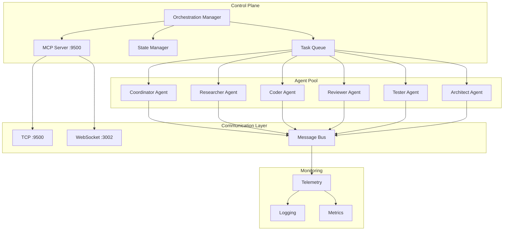
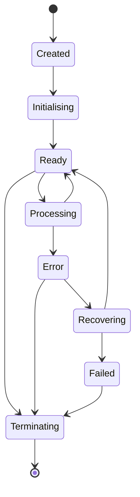

# Orchestrating Agents

 > [Guides](../index.md) > Orchestrating Agents

This comprehensive guide covers agent orchestration within the VisionFlow system, including practical examples, topology patterns, MCP protocol integration, and troubleshooting strategies for production multi-agent workflows.

## Table of Contents

1. [Agent Architecture Overview](#agent-architecture-overview)
2. [Agent Types and Roles](#agent-types-and-roles)
3. [Spawning and Managing Agents](#spawning-and-managing-agents)
4. [Coordination Topologies](#coordination-topologies)
5. [MCP Protocol Integration](#mcp-protocol-integration)
6. [Multi-Agent Container Integration](#multi-agent-container-integration)
7. [Inter-Agent Communication](#inter-agent-communication)
8. [Task Distribution](#task-distribution)
9. [Monitoring and Telemetry](#monitoring-and-telemetry)
10. [Error Handling and Recovery](#error-handling-and-recovery)
11. [Troubleshooting Agent Failures](#troubleshooting-agent-failures)
12. [Production Best Practices](#production-best-practices)

## Agent Architecture Overview

### System Components



### Core Concepts

1. **Agent**: Autonomous unit with specific capabilities and expertise
2. **Coordinator**: Meta-agent that orchestrates other agents
3. **Swarm**: Collection of agents working towards a common goal
4. **Task**: Unit of work with requirements and acceptance criteria
5. **Topology**: Communication and coordination pattern between agents
6. **MCP Protocol**: Model Context Protocol for agent communication (TCP port 9500)

## Agent Types and Roles

### Core Agent Types

| Agent Type | Role | Primary Capabilities | Use Cases |
|------------|------|---------------------|-----------|
| **Coordinator** | Orchestration | Task decomposition, agent supervision, workflow management | Complex project coordination, swarm management |
| **Researcher** | Information gathering | Web search, documentation analysis, data collection | Requirements analysis, technology research |
| **Coder** | Implementation | Code generation, refactoring, optimisation, API design | Feature development, code implementation |
| **Architect** | System design | Architecture planning, design patterns, scalability | System architecture, technical strategy |
| **Tester** | Quality assurance | Test creation, validation, automated testing | Testing, quality gates, validation |
| **Reviewer** | Code review | Quality assessment, best practices, security review | Code review, improvement suggestions |

### Practical Agent Examples

#### 1. Coordinator Agent

A coordinator manages high-level workflows and delegates to specialised agents:

```yaml
agent-type: coordinator
name: "project-coordinator"
capabilities:
  - task-decomposition
  - agent-supervision
  - workflow-management
  - performance-monitoring
  - conflict-resolution
config:
  max-workers: 10
  strategy: adaptive
  supervision-interval: 5000ms
```

**Example Workflow:**
```bash
# Initialize hierarchical swarm
mcp--claude-flow--swarm-init hierarchical \
  --maxAgents=10 \
  --strategy=adaptive

# Spawn specialised workers
mcp--claude-flow--agent-spawn researcher \
  --capabilities="research,analysis"

mcp--claude-flow--agent-spawn coder \
  --capabilities="implementation,testing"

# Coordinate task execution
mcp--claude-flow--task-orchestrate \
  "Build authentication service" \
  --strategy=sequential \
  --priority=high
```

See: Reference documentation for hierarchical coordination patterns

#### 2. Researcher Agent

Gathers information and analyses requirements:

```yaml
agent-type: researcher
name: "requirements-researcher"
capabilities:
  - information-gathering
  - market-research
  - competitive-analysis
  - documentation-analysis
config:
  search-depth: 5
  max-concurrent-tasks: 3
  timeout: 600
```

**Example Usage:**
```python
# Spawn researcher agent
researcher = await orchestrator.spawn-agent(
    agent-type="researcher",
    config={
        "search-depth": 5,
        "sources": ["web", "documentation", "code-repositories"],
        "timeout": 600
    }
)

# Assign research task
task = Task(
    type="requirements-analysis",
    description="Research authentication best practices",
    required-capabilities=["research", "security"]
)

result = await researcher.process-task(task)
```

See: Reference documentation for agent types and capabilities

#### 3. Coder Agent

Implements solutions following best practices:

```yaml
agent-type: coder
name: "backend-coder"
capabilities:
  - code-generation
  - refactoring
  - optimisation
  - api-design
  - error-handling
config:
  languages: ["python", "typescript", "rust"]
  linting: true
  formatting: true
  test-generation: true
```

**Example Implementation:**
```typescript
// Code generation with TDD approach
class CoderAgent {
  async implement(specification: Specification): Promise<Implementation> {
    // 1. Generate test cases first
    const tests = await this.generateTests(specification);

    // 2. Implement core functionality
    const code = await this.generateCode(specification);

    // 3. Refactor and optimise
    const optimised = await this.refactor(code);

    // 4. Run validation
    await this.validate(optimised, tests);

    return { code: optimised, tests };
  }
}
```

See: Reference documentation for coder agent capabilities

#### 4. Architect Agent

Designs system architecture and technical strategy:

```yaml
agent-type: architect
name: "system-architect"
capabilities:
  - system-design
  - architecture-patterns
  - scalability-planning
  - technical-strategy
config:
  design-methodology: "domain-driven-design"
  architecture-style: "microservices"
```

**Example Design Process:**
```bash
# Create architecture design
mcp--claude-flow--agent-spawn architect \
  --capabilities="system-design,patterns,scalability"

# Design authentication system
mcp--claude-flow--task-orchestrate \
  "Design scalable authentication architecture" \
  --requiredCapabilities="system-design,security" \
  --strategy=sequential
```

See: Reference documentation for architecture agent capabilities

#### 5. Tester Agent

Creates comprehensive test suites and validates functionality:

```yaml
agent-type: tester
name: "qa-tester"
capabilities:
  - test-creation
  - validation
  - quality-assurance
  - automated-testing
config:
  test-types: ["unit", "integration", "e2e"]
  coverage-threshold: 0.8
  test-framework: "pytest"
```

**Example Test Generation:**
```python
class TesterAgent:
    async def generate-test-suite(self, implementation):
        # Generate unit tests
        unit-tests = await self.generate-unit-tests(implementation)

        # Generate integration tests
        integration-tests = await self.generate-integration-tests(implementation)

        # Generate end-to-end tests
        e2e-tests = await self.generate-e2e-tests(implementation)

        # Run validation
        coverage = await self.run-tests-with-coverage([
            *unit-tests,
            *integration-tests,
            *e2e-tests
        ])

        return TestSuite(
            unit=unit-tests,
            integration=integration-tests,
            e2e=e2e-tests,
            coverage=coverage
        )
```

See: Reference documentation for tester agent capabilities

#### 6. Reviewer Agent

Performs code review and quality assessment:

```yaml
agent-type: reviewer
name: "code-reviewer"
capabilities:
  - code-review
  - quality-assessment
  - security-review
  - best-practices
config:
  review-depth: "thorough"
  focus-areas: ["security", "performance", "maintainability"]
```

**Example Review Process:**
```python
class ReviewerAgent:
    async def review-code(self, code-submission):
        # Analyse code quality
        quality-issues = await self.analyse-quality(code-submission)

        # Check security vulnerabilities
        security-issues = await self.check-security(code-submission)

        # Review best practices
        practice-issues = await self.check-best-practices(code-submission)

        # Performance analysis
        performance-issues = await self.analyse-performance(code-submission)

        return ReviewReport(
            quality=quality-issues,
            security=security-issues,
            practices=practice-issues,
            performance=performance-issues,
            recommendation=self.make-recommendation([
                quality-issues,
                security-issues,
                practice-issues,
                performance-issues
            ])
        )
```

See: Reference documentation for reviewer agent capabilities

## Spawning and Managing Agents

### Agent Lifecycle



### Manual Agent Spawning

#### Using MCP TCP Protocol (Port 9500)

```bash
# Connect to MCP server at multi-agent-container:9500
# Initialize swarm first
curl -X POST http://localhost:9500 \
  -H "Content-Type: application/json" \
  -d '{
    "jsonrpc": "2.0",
    "id": 1,
    "method": "tools/call",
    "params": {
      "name": "swarm-init",
      "arguments": {
        "topology": "hierarchical",
        "maxAgents": 10
      }
    }
  }'

# Spawn coder agent
curl -X POST http://localhost:9500 \
  -H "Content-Type: application/json" \
  -d '{
    "jsonrpc": "2.0",
    "id": 2,
    "method": "tools/call",
    "params": {
      "name": "agent-spawn",
      "arguments": {
        "agentType": "coder",
        "swarmId": "swarm-1757880683494-yl81sece5",
        "config": {
          "model": "claude-3-opus",
          "capabilities": ["python", "rust", "typescript"],
          "maxTokens": 4096,
          "timeout": 300
        }
      }
    }
  }'
```

#### Using Docker Exec

```bash
# Spawn agent inside multi-agent-container
docker exec multi-agent-container mcp--claude-flow--agent-spawn \
  researcher \
  --swarmId="swarm-1757880683494-yl81sece5" \
  --capabilities="research,analysis,information-gathering"

# Spawn coder agent with specific configuration
docker exec multi-agent-container mcp--claude-flow--agent-spawn \
  coder \
  --swarmId="swarm-1757880683494-yl81sece5" \
  --config='{"language":"python","frameworks":["fastapi","sqlalchemy"]}'
```

### Programmatic Spawning

```python
from visionflow import AgentOrchestrator
import asyncio

async def spawn-development-team():
    orchestrator = AgentOrchestrator(
        mcp-host="multi-agent-container",
        mcp-port=9500
    )

    # Initialize swarm
    swarm = await orchestrator.initialize-swarm(
        topology="hierarchical",
        max-agents=10
    )

    # Spawn coordinator
    coordinator = await orchestrator.spawn-agent(
        agent-type="coordinator",
        swarm-id=swarm.id,
        config={
            "max-workers": 5,
            "strategy": "adaptive"
        }
    )

    # Spawn development team
    team = await orchestrator.spawn-agents([
        {
            "type": "researcher",
            "count": 1,
            "config": {"search-depth": 5}
        },
        {
            "type": "architect",
            "count": 1,
            "config": {"design-methodology": "ddd"}
        },
        {
            "type": "coder",
            "count": 2,
            "config": {"languages": ["python", "typescript"]}
        },
        {
            "type": "tester",
            "count": 1,
            "config": {"coverage-threshold": 0.8}
        },
        {
            "type": "reviewer",
            "count": 1,
            "config": {"review-depth": "thorough"}
        }
    ])

    return swarm, coordinator, team

# Run
swarm, coordinator, team = asyncio.run(spawn-development-team())
```

### Agent Configuration

```yaml
# config/agents.yaml
agent-templates:
  coordinator:
    class: visionflow.agents.CoordinatorAgent
    default-config:
      max-workers: 10
      supervision-interval: 5000
      strategy: adaptive
      escalation-threshold: 0.7
    resources:
      memory: "4Gi"
      cpu: "2.0"

  researcher:
    class: visionflow.agents.ResearcherAgent
    default-config:
      max-concurrent-tasks: 3
      search-depth: 5
      sources: ["web", "documentation", "code-repositories"]
      timeout: 600
    resources:
      memory: "2Gi"
      cpu: "1.0"

  coder:
    class: visionflow.agents.CoderAgent
    default-config:
      languages: ["python", "typescript", "rust"]
      linting: true
      formatting: true
      test-generation: true
      coverage-threshold: 0.8
    resources:
      memory: "4Gi"
      cpu: "2.0"

  architect:
    class: visionflow.agents.ArchitectAgent
    default-config:
      design-methodology: "domain-driven-design"
      architecture-style: "microservices"
      documentation-level: "comprehensive"
    resources:
      memory: "3Gi"
      cpu: "1.5"

  tester:
    class: visionflow.agents.TesterAgent
    default-config:
      test-types: ["unit", "integration", "e2e"]
      coverage-threshold: 0.8
      test-framework: "pytest"
      parallel-execution: true
    resources:
      memory: "3Gi"
      cpu: "1.5"

  reviewer:
    class: visionflow.agents.ReviewerAgent
    default-config:
      review-depth: "thorough"
      focus-areas: ["security", "performance", "maintainability"]
      automated-fixes: false
    resources:
      memory: "2Gi"
      cpu: "1.0"
```

## Coordination Topologies

### 1. Hierarchical Topology

**Best for:** Large projects with clear structure, mission-critical systems, complex workflows with dependencies.

```
    👑 Coordinator
   /   |   |   \
  🔬   💻   📊   🧪
Research Code Analyst Test
Workers Workers Workers Workers
```

**Characteristics:**
- Centralised command and control
- Clear reporting structure
- Efficient resource allocation
- Single point of coordination

**Example Implementation:**
```python
class HierarchicalCoordinator:
    def --init--(self):
        self.hierarchy = {
            "manager": None,
            "team-leads": [],
            "workers": {}
        }

    async def build-hierarchy(self, project-config):
        # Create manager (coordinator)
        self.hierarchy["manager"] = await self.spawn-agent(
            type="coordinator",
            config={
                "max-workers": 10,
                "strategy": "centralized"
            }
        )

        # Create team leads for each domain
        for team in project-config["teams"]:
            team-lead = await self.spawn-agent(
                type=team["lead-type"],
                config=team["config"]
            )
            self.hierarchy["team-leads"].append(team-lead)

            # Spawn workers for this team
            workers = []
            for worker-spec in team["workers"]:
                worker = await self.spawn-agent(
                    type=worker-spec["type"],
                    config=worker-spec["config"]
                )
                workers.append(worker)

            self.hierarchy["workers"][team-lead.id] = workers

    async def delegate-task(self, task):
        # Manager assigns to appropriate team
        manager = self.hierarchy["manager"]
        team-assignment = await manager.assign-to-team(task)

        # Team lead distributes to workers
        team-lead = self.get-team-lead(team-assignment)
        worker-tasks = await team-lead.distribute-work(task)

        # Workers execute in parallel
        results = await asyncio.gather(*[
            worker.process-task(subtask)
            for worker, subtask in worker-tasks
        ])

        # Team lead aggregates results
        team-result = await team-lead.aggregate-results(results)

        # Manager reviews final output
        final-result = await manager.review-result(team-result)

        return final-result
```

**MCP Commands:**
```bash
# Initialize hierarchical swarm
mcp--claude-flow--swarm-init hierarchical \
  --maxAgents=10 \
  --strategy=centralized

# Monitor hierarchy health
mcp--claude-flow--swarm-monitor --interval=5000

# Generate performance report
mcp--claude-flow--performance-report \
  --format=detailed \
  --timeframe=24h
```

See: 

### 2. Mesh Topology

**Best for:** Highly distributed systems, fault-tolerant applications, collaborative development, democratic decision-making.

```
    🌐 MESH TOPOLOGY
   A ←→ B ←→ C
   ↕     ↕     ↕
   D ←→ E ←→ F
   ↕     ↕     ↕
   G ←→ H ←→ I
```

**Characteristics:**
- Peer-to-peer coordination
- No single point of failure
- Democratic consensus
- Full connectivity between agents

**Example Implementation:**
```python
class MeshCoordinator:
    def --init--(self):
        self.peers = []
        self.connections = {}
        self.consensus-protocol = "gossip"

    async def initialize-mesh(self, agent-count):
        # Spawn peer agents
        for i in range(agent-count):
            peer = await self.spawn-agent(
                type="peer-agent",
                config={
                    "peer-discovery": True,
                    "consensus-protocol": self.consensus-protocol
                }
            )
            self.peers.append(peer)

        # Establish full mesh connectivity
        for peer-a in self.peers:
            for peer-b in self.peers:
                if peer-a != peer-b:
                    await self.establish-connection(peer-a, peer-b)

    async def distribute-task(self, task):
        # Broadcast task to all peers
        bids = await self.broadcast-task-auction(task)

        # Peers vote on best candidate
        winner = await self.conduct-consensus-vote(bids)

        # Winning peer executes task
        result = await winner.execute-task(task)

        # Replicate result across mesh for fault tolerance
        await self.replicate-result(result, replication-factor=3)

        return result

    async def gossip-protocol(self):
        """Gossip algorithm for information dissemination"""
        while True:
            for peer in self.peers:
                # Select random peers for gossip
                targets = random.sample(self.peers, k=3)

                # Exchange state information
                for target in targets:
                    await peer.exchange-state(target)

            await asyncio.sleep(2)  # Gossip interval
```

**MCP Commands:**
```bash
# Initialize mesh network
mcp--claude-flow--swarm-init mesh \
  --maxAgents=12 \
  --strategy=distributed

# Establish peer connections
mcp--claude-flow--daa-communication \
  --from="mesh-coordinator" \
  --to="all" \
  --message='{"type":"network-init","topology":"mesh"}'

# Conduct consensus vote
mcp--claude-flow--daa-consensus \
  --agents="all" \
  --proposal='{"task-assignment":"auth-service","voting-mechanism":"weighted"}'

# Monitor network health
mcp--claude-flow--swarm-monitor \
  --interval=3000 \
  --metrics="connectivity,latency,throughput"
```

See: Reference documentation for mesh coordination patterns

### 3. Sequential (Pipeline) Topology

**Best for:** Workflows with clear stages, data processing pipelines, CI/CD automation.

```
Research → Plan → Code → Review → Test → Deploy
```

**Example Implementation:**
```python
class PipelineCoordinator:
    def --init--(self, stages):
        self.stages = stages
        self.pipeline = self.build-pipeline(stages)

    async def execute-pipeline(self, initial-input):
        result = initial-input

        for stage in self.pipeline:
            # Get appropriate agent for stage
            agent = await self.get-agent-for-stage(stage)

            # Create task
            task = Task(
                type=stage['task-type'],
                input=result,
                config=stage.get('config', {})
            )

            # Execute stage
            result = await agent.process-task(task)

            # Transform output if needed
            if stage.get('transform'):
                result = stage

            # Validate stage output
            if stage.get('validation'):
                await self.validate-stage-output(result, stage['validation'])

        return result

# Usage example
pipeline = PipelineCoordinator([
    {
        "stage": "research",
        "agent-type": "researcher",
        "task-type": "gather-requirements",
        "validation": {"completeness": 0.9}
    },
    {
        "stage": "architecture",
        "agent-type": "architect",
        "task-type": "design-system",
        "validation": {"scalability-score": 0.8}
    },
    {
        "stage": "implementation",
        "agent-type": "coder",
        "task-type": "implement-solution",
        "validation": {"code-quality": 0.85}
    },
    {
        "stage": "review",
        "agent-type": "reviewer",
        "task-type": "review-code",
        "validation": {"approval-required": True}
    },
    {
        "stage": "testing",
        "agent-type": "tester",
        "task-type": "run-tests",
        "validation": {"coverage": 0.8, "pass-rate": 1.0}
    }
])

result = await pipeline.execute-pipeline(project-requirements)
```

**MCP Commands:**
```bash
# Execute sequential pipeline
mcp--claude-flow--task-orchestrate \
  "Build authentication service" \
  --strategy=sequential \
  --priority=high \
  --stages="research,architect,code,review,test"
```

## MCP Protocol Integration

### MCP Server Connection (TCP Port 9500)

The MCP server runs in `multi-agent-container` and provides agent orchestration capabilities via TCP.

**Connection Details:**
- **Host:** `multi-agent-container` (within Docker network)
- **Port:** `9500` (TCP)
- **Protocol:** JSON-RPC 2.0
- **Transport:** TCP with line-delimited JSON

### Establishing MCP Connection

#### Rust Client

```rust
use tokio::net::TcpStream;
use tokio-util::codec::{Framed, LinesCodec};
use futures::{SinkExt, StreamExt};
use serde-json::{json, Value};

pub struct MCPClient {
    connection: Framed<TcpStream, LinesCodec>,
    request-id: u64,
}

impl MCPClient {
    pub async fn connect() -> Result<Self> {
        // Connect to MCP TCP server
        let stream = TcpStream::connect("multi-agent-container:9500").await?;
        let mut connection = Framed::new(stream, LinesCodec::new());

        // Initialize connection
        let init-request = json!({
            "jsonrpc": "2.0",
            "id": 1,
            "method": "initialize",
            "params": {
                "protocolVersion": "2024-11-05",
                "clientInfo": {
                    "name": "visionflow",
                    "version": "0.1.0"
                }
            }
        });

        connection.send(init-request.to-string()).await?;

        // Wait for initialization response
        if let Some(Ok(response)) = connection.next().await {
            let parsed: Value = serde-json::from-str(&response)?;
            if parsed.get("result").is-some() {
                return Ok(Self {
                    connection,
                    request-id: 2,
                });
            }
        }

        Err("MCP initialization failed".into())
    }

    pub async fn spawn-agent(
        &mut self,
        agent-type: &str,
        swarm-id: &str,
        config: Value
    ) -> Result<String> {
        let request = json!({
            "jsonrpc": "2.0",
            "id": self.request-id,
            "method": "tools/call",
            "params": {
                "name": "agent-spawn",
                "arguments": {
                    "agentType": agent-type,
                    "swarmId": swarm-id,
                    "config": config
                }
            }
        });

        self.request-id += 1;
        self.connection.send(request.to-string()).await?;

        // Wait for response
        if let Some(Ok(response)) = self.connection.next().await {
            let parsed: Value = serde-json::from-str(&response)?;
            if let Some(result) = parsed.get("result") {
                return Ok(result["agentId"].as-str().unwrap().to-string());
            }
        }

        Err("Failed to spawn agent".into())
    }

    pub async fn orchestrate-task(
        &mut self,
        swarm-id: &str,
        task: Value
    ) -> Result<Value> {
        let request = json!({
            "jsonrpc": "2.0",
            "id": self.request-id,
            "method": "tools/call",
            "params": {
                "name": "task-orchestrate",
                "arguments": {
                    "swarmId": swarm-id,
                    "task": task
                }
            }
        });

        self.request-id += 1;
        self.connection.send(request.to-string()).await?;

        // Wait for response
        if let Some(Ok(response)) = self.connection.next().await {
            let parsed: Value = serde-json::from-str(&response)?;
            if let Some(result) = parsed.get("result") {
                return Ok(result.clone());
            }
        }

        Err("Task orchestration failed".into())
    }
}
```

#### Python Client

```python
import asyncio
import json
from typing import Dict, Any

class MCPClient:
    def --init--(self):
        self.reader = None
        self.writer = None
        self.request-id = 1

    async def connect(self, host="multi-agent-container", port=9500):
        """Connect to MCP TCP server"""
        self.reader, self.writer = await asyncio.open-connection(host, port)

        # Initialize connection
        init-request = {
            "jsonrpc": "2.0",
            "id": self.request-id,
            "method": "initialize",
            "params": {
                "protocolVersion": "2024-11-05",
                "clientInfo": {
                    "name": "visionflow-python",
                    "version": "0.1.0"
                }
            }
        }

        await self.-send-request(init-request)
        response = await self.-read-response()

        if "result" not in response:
            raise Exception("MCP initialization failed")

        self.request-id += 1

    async def -send-request(self, request: Dict[str, Any]):
        """Send JSON-RPC request"""
        message = json.dumps(request) + "\n"
        self.writer.write(message.encode())
        await self.writer.drain()

    async def -read-response(self) -> Dict[str, Any]:
        """Read JSON-RPC response"""
        data = await self.reader.readline()
        return json.loads(data.decode())

    async def spawn-agent(
        self,
        agent-type: str,
        swarm-id: str,
        config: Dict[str, Any]
    ) -> str:
        """Spawn new agent"""
        request = {
            "jsonrpc": "2.0",
            "id": self.request-id,
            "method": "tools/call",
            "params": {
                "name": "agent-spawn",
                "arguments": {
                    "agentType": agent-type,
                    "swarmId": swarm-id,
                    "config": config
                }
            }
        }

        self.request-id += 1
        await self.-send-request(request)
        response = await self.-read-response()

        if "result" in response:
            return response["result"]["agentId"]
        else:
            raise Exception(f"Agent spawn failed: {response.get('error')}")

    async def orchestrate-task(
        self,
        swarm-id: str,
        task: Dict[str, Any]
    ) -> Dict[str, Any]:
        """Orchestrate task execution"""
        request = {
            "jsonrpc": "2.0",
            "id": self.request-id,
            "method": "tools/call",
            "params": {
                "name": "task-orchestrate",
                "arguments": {
                    "swarmId": swarm-id,
                    "task": task
                }
            }
        }

        self.request-id += 1
        await self.-send-request(request)
        response = await self.-read-response()

        if "result" in response:
            return response["result"]
        else:
            raise Exception(f"Task orchestration failed: {response.get('error')}")

    async def close(self):
        """Close connection"""
        if self.writer:
            self.writer.close()
            await self.writer.wait-closed()

# Usage example
async def main():
    client = MCPClient()

    try:
        # Connect to MCP server
        await client.connect()

        # Initialize swarm
        swarm-request = {
            "jsonrpc": "2.0",
            "id": 1,
            "method": "tools/call",
            "params": {
                "name": "swarm-init",
                "arguments": {
                    "topology": "hierarchical",
                    "maxAgents": 10
                }
            }
        }

        # Spawn agents
        agent-id = await client.spawn-agent(
            agent-type="coder",
            swarm-id="swarm-1757880683494-yl81sece5",
            config={
                "model": "claude-3-opus",
                "capabilities": ["python", "rust"],
                "maxTokens": 4096
            }
        )

        # Orchestrate task
        result = await client.orchestrate-task(
            swarm-id="swarm-1757880683494-yl81sece5",
            task={
                "description": "Implement authentication service",
                "priority": "high",
                "requiredCapabilities": ["python", "security"]
            }
        )

        print(f"Task result: {result}")

    finally:
        await client.close()

asyncio.run(main())
```

### MCP Real-World Examples

#### Example 1: Spawning an Agent with Real TCP Connection

**Request:**
```json
{
    "jsonrpc": "2.0",
    "id": 3,
    "method": "tools/call",
    "params": {
        "name": "agent-spawn",
        "arguments": {
            "agentType": "coder",
            "swarmId": "swarm-1757880683494-yl81sece5",
            "config": {
                "model": "claude-3-opus",
                "temperature": 0.7,
                "capabilities": ["python", "rust", "typescript"],
                "maxTokens": 4096,
                "timeout": 300,
                "retryAttempts": 3
            },
            "resources": {
                "cpuLimit": "2000m",
                "memoryLimit": "4Gi",
                "gpuAccess": true
            }
        }
    }
}
```

**Response:**
```json
{
    "jsonrpc": "2.0",
    "id": 3,
    "result": {
        "agentId": "agent-1757967065850-dv2zg7",
        "swarmId": "swarm-1757880683494-yl81sece5",
        "status": "spawning",
        "estimatedReadyTime": "2025-01-22T10:00:30Z",
        "tcpEndpoint": "multi-agent-container:9500",
        "capabilities": ["python", "rust", "typescript"],
        "resources": {
            "allocated": true,
            "cpu": "2000m",
            "memory": "4Gi",
            "gpuDevice": 0
        },
        "connectionPool": {
            "poolId": "pool-123",
            "connections": 3,
            "healthCheck": "passing"
        },
        "initialisationMetrics": {
            "spawnTime": 1247,
            "modelLoadTime": 892,
            "memoryAllocated": "3.2 GB"
        }
    }
}
```

#### Example 2: Task Orchestration with Distributed Execution

**Request:**
```json
{
    "jsonrpc": "2.0",
    "id": 4,
    "method": "tools/call",
    "params": {
        "name": "task-orchestrate",
        "arguments": {
            "swarmId": "swarm-1757880683494-yl81sece5",
            "task": {
                "description": "Analyse security vulnerabilities in auth module",
                "priority": "high",
                "strategy": "adaptive",
                "timeout": 300,
                "requiredCapabilities": ["security", "code", "review"],
                "parallelism": 3,
                "consensusRequired": true
            },
            "execution": {
                "mode": "distributed",
                "retryPolicy": "exponential-backoff",
                "resultAggregation": "majority-vote",
                "failureThreshold": 0.2
            }
        }
    }
}
```

**Response:**
```json
{
    "jsonrpc": "2.0",
    "id": 4,
    "result": {
        "taskId": "task-1757967065850-abc123",
        "swarmId": "swarm-1757880683494-yl81sece5",
        "status": "orchestrating",
        "assignedAgents": [
            {
                "agentId": "agent-1757967065850-dv2zg7",
                "role": "coordinator",
                "capabilities": ["security", "code"]
            },
            {
                "agentId": "agent-1757967065851-def456",
                "role": "worker",
                "capabilities": ["code", "review"]
            },
            {
                "agentId": "agent-1757967065852-ghi789",
                "role": "validator",
                "capabilities": ["security", "review"]
            }
        ],
        "orchestrationPlan": {
            "phases": [
                {
                    "name": "analysis",
                    "agents": ["agent-1757967065851-def456"],
                    "estimatedDuration": 120
                },
                {
                    "name": "security-scan",
                    "agents": ["agent-1757967065850-dv2zg7"],
                    "estimatedDuration": 180,
                    "dependencies": ["analysis"]
                },
                {
                    "name": "validation",
                    "agents": ["agent-1757967065852-ghi789"],
                    "estimatedDuration": 60,
                    "dependencies": ["security-scan"]
                }
            ]
        },
        "coordination": {
            "consensusThreshold": 0.7,
            "votingMechanism": "weighted",
            "conflictResolution": "expert-priority"
        },
        "estimatedCompletion": "2025-01-22T10:05:00Z",
        "mcpConnections": {
            "active": 3,
            "poolUtilization": 0.6
        }
    }
}
```

See: Reference documentation for MCP protocol details

## Multi-Agent Container Integration

### Container Architecture

The multi-agent environment runs in a dedicated Docker container with full MCP support:

```yaml
services:
  multi-agent:
    container-name: multi-agent-container
    ports:
      - "3000:3000"    # Claude Flow UI
      - "3002:3002"    # WebSocket Bridge
      - "9500:9500"    # MCP TCP Server (PRIMARY)
    environment:
      # MCP Configuration
      - MCP-TCP-PORT=9500
      - MCP-ENABLE-TCP=true
      - MCP-LOG-LEVEL=info

      # Agent Configuration
      - MAX-AGENTS=20
      - AGENT-TIMEOUT=300

      # Connection Pooling
      - MCP-POOL-SIZE=10
      - MCP-RETRY-ATTEMPTS=3

    networks:
      - docker-ragflow
```

### Accessing Multi-Agent Container

```bash
# Enter container shell
docker exec -it multi-agent-container /bin/bash

# Run agent commands
mcp--claude-flow--swarm-init hierarchical --maxAgents=10

# Check MCP server status
mcp-tcp-status

# View agent logs
docker logs -f multi-agent-container
```

### Container-to-Container Communication

Agents in the multi-agent-container can communicate with GUI tools in gui-tools-container:

```python
# Connect to Blender in GUI container
blender-client = MCPClient(
    host="gui-tools-service",
    port=9876
)

# Execute Blender command
await blender-client.execute-code(
    "import bpy; bpy.ops.mesh.primitive-cube-add()"
)
```

See: Multi-agent Docker documentation for container setup

## Inter-Agent Communication

### Communication Patterns

#### 1. Direct Messaging

```python
class Agent:
    async def send-message(self, target-agent-id: str, message: dict):
        """Send direct message to another agent"""
        await self.message-bus.publish(
            channel=f"agent.{target-agent-id}",
            message={
                "from": self.agent-id,
                "to": target-agent-id,
                "type": "direct",
                "content": message,
                "timestamp": datetime.utcnow().isoformat()
            }
        )

    async def handle-message(self, message: dict):
        """Process incoming messages"""
        if message["type"] == "task-request":
            await self.handle-task-request(message["content"])
        elif message["type"] == "status-update":
            await self.handle-status-update(message["content"])
        elif message["type"] == "data-share":
            await self.handle-data-share(message["content"])
```

#### 2. Broadcast Communication

```python
async def broadcast-task(task: Task, agent-filter=None):
    """Broadcast task to multiple agents"""
    message = {
        "type": "task-broadcast",
        "task": task.to-dict(),
        "requirements": task.requirements,
        "timestamp": datetime.utcnow().isoformat()
    }

    if agent-filter:
        channel = f"broadcast.{agent-filter}"
    else:
        channel = "broadcast.all"

    await message-bus.publish(channel, message)
```

#### 3. Event-Based Communication

```python
class EventDrivenAgent(BaseAgent):
    def --init--(self, *args, **kwargs):
        super().--init--(*args, **kwargs)
        self.event-handlers = {
            "task.completed": self.on-task-completed,
            "task.failed": self.on-task-failed,
            "agent.joined": self.on-agent-joined,
            "agent.left": self.on-agent-left,
            "error.occurred": self.on-error-occurred
        }

    async def subscribe-to-events(self):
        """Subscribe to relevant events"""
        for event-type in self.event-handlers:
            await self.event-bus.subscribe(
                event-type,
                self.handle-event
            )

    async def handle-event(self, event):
        """Route events to appropriate handlers"""
        handler = self.event-handlers.get(event.type)
        if handler:
            await handler(event)
```

### Message Protocols

```python
from pydantic import BaseModel
from typing import Optional, Dict, Any
from datetime import datetime

class AgentMessage(BaseModel):
    """Standard agent message format"""
    message-id: str
    from-agent: str
    to-agent: Optional[str]
    message-type: str
    content: Dict[str, Any]
    timestamp: datetime
    correlation-id: Optional[str]
    priority: int = 0

class TaskMessage(AgentMessage):
    """Task-specific message"""
    task-id: str
    task-type: str
    deadline: Optional[datetime]

class StatusMessage(AgentMessage):
    """Agent status update"""
    status: str
    metrics: Dict[str, float]
    capabilities: list[str]
```

## Task Distribution

### Task Queue Management

```python
from heapq import heappush, heappop
from dataclasses import dataclass, field
from typing import Optional

@dataclass(order=True)
class PrioritisedTask:
    priority: int
    task: Task = field(compare=False)
    created-at: datetime = field(default-factory=datetime.utcnow, compare=False)

class TaskQueue:
    def --init--(self):
        self.queue = []
        self.task-map = {}
        self.processing = set()

    async def add-task(self, task: Task, priority: int = 0):
        """Add task to queue with priority"""
        prioritised = PrioritisedTask(priority, task)
        heappush(self.queue, prioritised)
        self.task-map[task.id] = task

        # Notify available agents
        await self.notify-agents(task)

    async def get-task(self, agent-capabilities: list[str]) -> Optional[Task]:
        """Get next suitable task for agent"""
        # Find first matching task
        for i, prioritised in enumerate(self.queue):
            task = prioritised.task
            if (task.id not in self.processing and
                self.can-handle(task, agent-capabilities)):
                self.queue.pop(i)
                self.processing.add(task.id)
                return task
        return None

    def can-handle(self, task: Task, capabilities: list[str]) -> bool:
        """Check if agent can handle task"""
        required = set(task.required-capabilities)
        available = set(capabilities)
        return required.issubset(available)
```

### Capability-Based Assignment

```python
class CapabilityMatcher:
    def match-agent-to-task(
        self,
        task: Task,
        agents: list[Agent]
    ) -> Optional[Agent]:
        """Match task to most capable agent"""
        suitable-agents = []

        for agent in agents:
            if agent.is-available and self.has-capabilities(agent, task):
                score = self.calculate-match-score(agent, task)
                suitable-agents.append((agent, score))

        if suitable-agents:
            # Return agent with highest match score
            suitable-agents.sort(key=lambda x: x[1], reverse=True)
            return suitable-agents[0][0]

        return None

    def calculate-match-score(self, agent: Agent, task: Task) -> float:
        """Calculate how well agent matches task"""
        score = 0.0

        # Exact capability matches (40% weight)
        matching-caps = set(agent.capabilities) & set(task.required-capabilities)
        score += (len(matching-caps) / len(task.required-capabilities)) * 40

        # Past performance (30% weight)
        if agent.metrics.get('task-success-rate'):
            score += agent.metrics['task-success-rate'] * 30

        # Current workload (20% weight)
        workload = agent.current-tasks / agent.max-tasks
        score += (1 - workload) * 20

        # Response time (10% weight)
        if agent.metrics.get('avg-response-time'):
            response-score = max(0, 1 - (agent.metrics['avg-response-time'] / 300))
            score += response-score * 10

        return score
```

### Load Balancing

```python
class LoadBalancer:
    def --init--(self):
        self.agent-loads = {}

    async def assign-task(self, task: Task) -> Agent:
        """Assign task using load balancing"""
        available-agents = await self.get-available-agents(task)

        if not available-agents:
            raise NoAvailableAgentError()

        # Find least loaded agent
        min-load = float('inf')
        selected-agent = None

        for agent in available-agents:
            load = self.calculate-load(agent)
            if load < min-load:
                min-load = load
                selected-agent = agent

        # Update load tracking
        self.agent-loads[selected-agent.id] = min-load + task.estimated-duration

        return selected-agent

    def calculate-load(self, agent: Agent) -> float:
        """Calculate agent's current load"""
        base-load = self.agent-loads.get(agent.id, 0)

        # Add current task processing time
        for task in agent.active-tasks:
            base-load += task.remaining-time

        return base-load
```

## Monitoring and Telemetry

### Agent Telemetry System

```python
class AgentTelemetry:
    """Collect and process agent telemetry data"""

    def --init--(self):
        self.metrics = {}
        self.events = []
        self.prometheus-client = PrometheusClient()

    async def collect-metrics(self, agent-id: str):
        """Collect metrics from agent"""
        agent = await self.get-agent(agent-id)

        metrics = {
            "cpu-usage": psutil.cpu-percent(),
            "memory-usage": psutil.virtual-memory().percent,
            "active-tasks": len(agent.active-tasks),
            "completed-tasks": agent.metrics["completed-tasks"],
            "error-rate": agent.metrics["error-rate"],
            "avg-task-duration": agent.metrics["avg-duration"],
            "success-rate": agent.metrics["success-rate"],
            "timestamp": datetime.utcnow()
        }

        self.metrics[agent-id] = metrics

        # Export to Prometheus
        await self.export-to-prometheus(agent-id, metrics)

        return metrics

    async def export-to-prometheus(self, agent-id: str, metrics: dict):
        """Export metrics to Prometheus"""
        for metric-name, value in metrics.items():
            if isinstance(value, (int, float)):
                self.prometheus-client.gauge(
                    f"agent-{metric-name}",
                    value,
                    labels={"agent-id": agent-id}
                )
```

### Real-time Monitoring

```python
class RealtimeMonitor:
    """Real-time agent monitoring via WebSocket"""

    def --init--(self, websocket-url: str):
        self.ws-url = websocket-url
        self.connections = {}
        self.alert-thresholds = {
            "error-rate": 0.1,
            "cpu-usage": 90,
            "memory-usage": 90,
            "response-time": 10
        }

    async def monitor-agent(self, agent-id: str, callback):
        """Monitor specific agent in real-time"""
        ws = await websockets.connect(f"{self.ws-url}/agent/{agent-id}")

        try:
            async for message in ws:
                data = json.loads(message)
                await callback(data)

                # Check for alerts
                if self.should-alert(data):
                    await self.send-alert(agent-id, data)
        finally:
            await ws.close()

    def should-alert(self, data: dict) -> bool:
        """Check if metrics warrant an alert"""
        return any([
            data.get("error-rate", 0) > self.alert-thresholds["error-rate"],
            data.get("cpu-usage", 0) > self.alert-thresholds["cpu-usage"],
            data.get("memory-usage", 0) > self.alert-thresholds["memory-usage"],
            data.get("response-time", 0) > self.alert-thresholds["response-time"]
        ])

    async def send-alert(self, agent-id: str, data: dict):
        """Send alert notification"""
        alert = {
            "agent-id": agent-id,
            "timestamp": datetime.utcnow().isoformat(),
            "metrics": data,
            "severity": self.calculate-severity(data)
        }

        # Send to alerting system
        await self.alerting-system.send-alert(alert)
```

### Monitoring Dashboard

```bash
# Access Grafana dashboard
docker exec -it multi-agent-container grafana-server

# View agent metrics
curl http://localhost:3000/api/agents/metrics

# Generate performance report
docker exec multi-agent-container mcp--claude-flow--performance-report \
  --format=json \
  --timeframe=24h
```

## Error Handling and Recovery

### Failure Detection

```python
class FailureDetector:
    """Detect and handle agent failures"""

    def --init--(self, heartbeat-interval: int = 30):
        self.heartbeat-interval = heartbeat-interval
        self.last-heartbeat = {}
        self.failure-handlers = {}
        self.failure-history = defaultdict(list)

    async def monitor-heartbeats(self):
        """Monitor agent heartbeats"""
        while True:
            current-time = time.time()

            for agent-id, last-beat in self.last-heartbeat.items():
                time-since-heartbeat = current-time - last-beat

                if time-since-heartbeat > self.heartbeat-interval * 2:
                    # Agent may have failed
                    await self.handle-potential-failure(agent-id)

            await asyncio.sleep(self.heartbeat-interval / 2)

    async def handle-potential-failure(self, agent-id: str):
        """Handle potential agent failure"""
        # Verify failure with multiple checks
        if await self.verify-failure(agent-id):
            logger.warning(f"Agent {agent-id} failed")

            # Record failure
            self.failure-history[agent-id].append({
                "timestamp": time.time(),
                "type": "heartbeat-timeout"
            })

            # Get agent's active tasks
            agent = await self.get-agent(agent-id)
            active-tasks = agent.active-tasks if agent else []

            # Mark agent as failed
            await self.mark-agent-failed(agent-id)

            # Reassign tasks
            for task in active-tasks:
                await self.reassign-task(task)

            # Attempt recovery
            await self.attempt-recovery(agent-id)

    async def verify-failure(self, agent-id: str) -> bool:
        """Verify agent failure with multiple checks"""
        checks = [
            self.check-heartbeat(agent-id),
            self.check-tcp-connection(agent-id),
            self.check-process-status(agent-id)
        ]

        results = await asyncio.gather(*checks, return-exceptions=True)

        # Fail if majority of checks indicate failure
        failures = sum(1 for r in results if isinstance(r, Exception) or not r)
        return failures >= len(checks) // 2 + 1
```

### Recovery Strategies

```python
class RecoveryManager:
    """Manage agent recovery strategies"""

    async def recover-agent(self, agent-id: str, failure-type: str):
        """Recover failed agent based on failure type"""

        strategies = {
            "timeout": self.recover-from-timeout,
            "crash": self.recover-from-crash,
            "resource-exhaustion": self.recover-from-resource-exhaustion,
            "network-failure": self.recover-from-network-failure,
            "deadlock": self.recover-from-deadlock
        }

        recovery-fn = strategies.get(failure-type, self.default-recovery)
        return await recovery-fn(agent-id)

    async def recover-from-timeout(self, agent-id: str):
        """Recover from timeout failure"""
        # Kill stuck processes
        await self.kill-agent-processes(agent-id)

        # Restart agent with increased timeout
        agent-config = await self.get-agent-config(agent-id)
        agent-config["timeout"] *= 1.5  # Increase timeout by 50%

        agent = await self.restart-agent(agent-id, agent-config)

        # Restore state
        await self.restore-agent-state(agent)

        return agent

    async def recover-from-crash(self, agent-id: str):
        """Recover from agent crash"""
        # Analyse crash logs
        crash-info = await self.analyse-crash-logs(agent-id)

        # Fix configuration if needed
        if crash-info.get("config-error"):
            await self.fix-agent-config(agent-id, crash-info)

        # Restart with backoff
        return await self.restart-with-backoff(agent-id)

    async def recover-from-resource-exhaustion(self, agent-id: str):
        """Recover from resource exhaustion"""
        # Increase resource limits
        agent-config = await self.get-agent-config(agent-id)
        agent-config["resources"]["memory"] = str(
            int(agent-config["resources"]["memory"].rstrip("Gi")) * 1.5
        ) + "Gi"

        # Restart with increased resources
        return await self.restart-agent(agent-id, agent-config)

    async def restart-with-backoff(
        self,
        agent-id: str,
        max-attempts: int = 3
    ):
        """Restart agent with exponential backoff"""
        delay = 1

        for attempt in range(max-attempts):
            try:
                agent = await self.restart-agent(agent-id)
                return agent
            except Exception as e:
                if attempt == max-attempts - 1:
                    raise

                logger.warning(
                    f"Restart attempt {attempt + 1} failed for {agent-id}: {e}"
                )
                await asyncio.sleep(delay)
                delay *= 2  # Exponential backoff
```

### Circuit Breaker Pattern

```python
class CircuitBreaker:
    """Circuit breaker for agent operations"""

    def --init--(self, failure-threshold: int = 5, timeout: int = 60):
        self.failure-threshold = failure-threshold
        self.timeout = timeout
        self.failures = defaultdict(int)
        self.last-failure-time = {}
        self.state = defaultdict(lambda: "closed")  # closed, open, half-open

    async def call(self, agent-id: str, operation: Callable):
        """Execute operation with circuit breaker protection"""
        if self.state[agent-id] == "open":
            # Check if timeout has elapsed
            if time.time() - self.last-failure-time[agent-id] > self.timeout:
                self.state[agent-id] = "half-open"
            else:
                raise CircuitOpenError(
                    f"Circuit open for agent {agent-id}. "
                    f"Retry after {self.timeout}s"
                )

        try:
            result = await operation()

            # Success - reset failures
            if self.state[agent-id] == "half-open":
                self.state[agent-id] = "closed"
            self.failures[agent-id] = 0

            return result

        except Exception as e:
            self.failures[agent-id] += 1
            self.last-failure-time[agent-id] = time.time()

            # Open circuit if threshold exceeded
            if self.failures[agent-id] >= self.failure-threshold:
                self.state[agent-id] = "open"
                logger.error(
                    f"Circuit opened for agent {agent-id} "
                    f"after {self.failures[agent-id]} failures"
                )

            raise e
```

## Troubleshooting Agent Failures

### Common Failure Scenarios

#### 1. Agent Not Responding

**Symptoms:**
- Heartbeat timeouts
- Tasks stuck in processing state
- No response to messages

**Diagnosis:**
```bash
# Check agent status
docker exec multi-agent-container mcp--claude-flow--swarm-status

# View agent logs
docker logs multi-agent-container | grep "agent-[agent-id]"

# Check TCP connection
docker exec multi-agent-container nc -zv multi-agent-container 9500

# Verify MCP server status
docker exec multi-agent-container mcp-tcp-status
```

**Resolution:**
```bash
# Restart specific agent
docker exec multi-agent-container mcp--claude-flow--agent-restart \
  --agentId="agent-1757967065850-dv2zg7"

# If restart fails, respawn agent
docker exec multi-agent-container mcp--claude-flow--agent-spawn \
  coder \
  --swarmId="swarm-1757880683494-yl81sece5" \
  --config='{"capabilities":["python","rust"]}'
```

#### 2. Task Queue Backlog

**Symptoms:**
- Growing queue depth
- Increasing task wait times
- Agent pool utilisation below 50%

**Diagnosis:**
```bash
# Check queue status
docker exec multi-agent-container mcp--claude-flow--swarm-status | \
  jq '.taskQueue'

# Check agent workload distribution
docker exec multi-agent-container mcp--claude-flow--performance-report \
  --format=json | jq '.agents[] | {id, active-tasks, utilization}'
```

**Resolution:**
```bash
# Clear stuck tasks
docker exec multi-agent-container mcp--claude-flow--task-queue-clear \
  --filter="status:stuck,age:>3600"

# Scale up agent pool
docker exec multi-agent-container mcp--claude-flow--agent-scale \
  --count=5 \
  --agentType="coder"

# Rebalance workload
docker exec multi-agent-container mcp--claude-flow--load-balance \
  --strategy="even-distribution"
```

#### 3. High Error Rate

**Symptoms:**
- Frequent task failures
- Increased retry attempts
- Error rate > 10%

**Diagnosis:**
```bash
# View error statistics
docker exec multi-agent-container mcp--claude-flow--performance-report \
  --format=json | jq '.errorMetrics'

# Analyse error patterns
docker logs multi-agent-container 2>&1 | \
  grep -i "error\|exception" | \
  awk '{print $5}' | \
  sort | uniq -c | sort -rn

# Check resource constraints
docker stats multi-agent-container --no-stream
```

**Resolution:**
```python
# Implement error recovery
async def handle-high-error-rate(agent-id: str):
    # Get error history
    errors = await get-agent-errors(agent-id)

    # Analyse error patterns
    error-types = Counter(e["type"] for e in errors)

    # Apply appropriate recovery strategy
    if error-types.most-common(1)[0][0] == "timeout":
        # Increase timeouts
        await update-agent-config(agent-id, {"timeout": 600})
    elif error-types.most-common(1)[0][0] == "resource-exhaustion":
        # Increase resources
        await scale-agent-resources(agent-id, {"memory": "8Gi"})
    else:
        # General recovery: restart agent
        await restart-agent(agent-id)
```

#### 4. Memory Leaks

**Symptoms:**
- Gradually increasing memory usage
- OOM kills
- Degraded performance over time

**Diagnosis:**
```bash
# Monitor memory trends
docker stats multi-agent-container --format \
  "table {{.Container}}\t{{.MemUsage}}\t{{.MemPerc}}"

# Check for memory leaks in agent processes
docker exec multi-agent-container ps aux --sort=-rss | head -10

# Profile agent memory usage
docker exec multi-agent-container python -m memory-profiler agent.py
```

**Resolution:**
```python
# Implement periodic agent recycling
class AgentRecycler:
    async def recycle-agents(self):
        """Periodically recycle agents to prevent memory leaks"""
        while True:
            agents = await self.get-all-agents()

            for agent in agents:
                # Check memory usage
                if agent.memory-usage > 0.9 * agent.memory-limit:
                    # Gracefully drain tasks
                    await agent.stop-accepting-tasks()
                    await agent.wait-for-tasks-complete()

                    # Respawn fresh agent
                    new-agent = await self.spawn-agent(
                        agent-type=agent.type,
                        config=agent.config
                    )

                    # Terminate old agent
                    await agent.terminate()

            # Check every hour
            await asyncio.sleep(3600)
```

#### 5. Network Partitioning

**Symptoms:**
- Agents unable to communicate
- Inconsistent swarm state
- Split-brain scenarios

**Diagnosis:**
```bash
# Check network connectivity
docker exec multi-agent-container ping -c 3 gui-tools-service

# Verify MCP connectivity between containers
docker exec multi-agent-container nc -zv gui-tools-service 9876

# Check Docker network status
docker network inspect docker-ragflow
```

**Resolution:**
```bash
# Restart Docker network
docker network disconnect docker-ragflow multi-agent-container
docker network connect docker-ragflow multi-agent-container

# Reconnect agents to MCP server
docker exec multi-agent-container mcp--claude-flow--swarm-reconnect \
  --swarmId="swarm-1757880683494-yl81sece5"

# Verify connectivity restored
docker exec multi-agent-container mcp-tcp-test
```

### Diagnostic Commands Reference

```bash
# Agent Status
mcp--claude-flow--swarm-status              # View swarm and agent status
mcp--claude-flow--agent-health --agentId=X  # Check specific agent health
mcp--claude-flow--performance-report        # Generate performance report

# Network Diagnostics
nc -zv multi-agent-container 9500           # Test TCP connectivity
mcp-tcp-status                              # Check MCP server status
docker network inspect docker-ragflow      # Inspect Docker network

# Resource Monitoring
docker stats multi-agent-container          # Real-time resource usage
docker logs -f multi-agent-container        # Follow logs in real-time
htop                                        # Interactive process viewer

# Troubleshooting
mcp--claude-flow--debug-enable              # Enable debug logging
mcp--claude-flow--agent-restart --agentId=X # Restart specific agent
mcp--claude-flow--swarm-reset               # Reset swarm state
```

## Production Best Practices

### 1. Agent Design Principles

- **Single Responsibility**: Each agent has one clear purpose
- **Stateless Operations**: Avoid storing state; use external state management
- **Idempotency**: Operations can be safely retried
- **Graceful Degradation**: Handle partial failures elegantly
- **Observable**: Emit comprehensive metrics and logs

### 2. Scaling Guidelines

```yaml
# Horizontal Scaling
min-agents-per-type:
  coordinator: 1
  researcher: 2
  architect: 1
  coder: 3
  tester: 2
  reviewer: 1

max-agents-per-type:
  coordinator: 2
  researcher: 5
  architect: 2
  coder: 10
  tester: 5
  reviewer: 3

# Vertical Scaling
resource-limits:
  coordinator:
    memory: "4Gi"
    cpu: "2.0"
  researcher:
    memory: "2Gi"
    cpu: "1.0"
  coder:
    memory: "4Gi"
    cpu: "2.0"
  architect:
    memory: "3Gi"
    cpu: "1.5"
  tester:
    memory: "3Gi"
    cpu: "1.5"
  reviewer:
    memory: "2Gi"
    cpu: "1.0"
```

### 3. Performance Optimisation

```python
# Efficient task batching
async def batch-process-tasks(agent, tasks: list[Task]):
    """Process multiple tasks efficiently"""
    # Group similar tasks
    task-groups = defaultdict(list)
    for task in tasks:
        task-groups[task.type].append(task)

    results = []
    for task-type, group in task-groups.items():
        # Process group in parallel if supported
        if agent.supports-batch(task-type):
            result = await agent.batch-process(group)
            results.extend(result)
        else:
            # Sequential processing with concurrency limit
            for batch in chunks(group, size=5):
                batch-results = await asyncio.gather(*[
                    agent.process-task(task) for task in batch
                ])
                results.extend(batch-results)

    return results
```

### 4. Monitoring Best Practices

- **Track Key Metrics**: Throughput, latency, error rate, resource utilisation
- **Set Up Alerts**: Anomaly detection for critical metrics
- **Log Structured Data**: Use JSON logging for analysis
- **Distributed Tracing**: Track requests across agent boundaries

### 5. Security Best Practices

- **Authentication**: Use tokens for MCP connections
- **Authorisation**: Implement role-based access control
- **Input Validation**: Sanitise all agent inputs
- **Rate Limiting**: Prevent abuse with rate limits
- **Audit Logging**: Log all security-relevant events

## Related Documentation

- [Development Workflow](../development/development-workflow.md)
- [Configuration Guide](../operations/configuration.md)
- [Agent Control Panel](./agent-orchestration.md)
- 

---

*[Back to Guides](../index.md) | [Development Workflow →](../development/development-workflow.md)*
