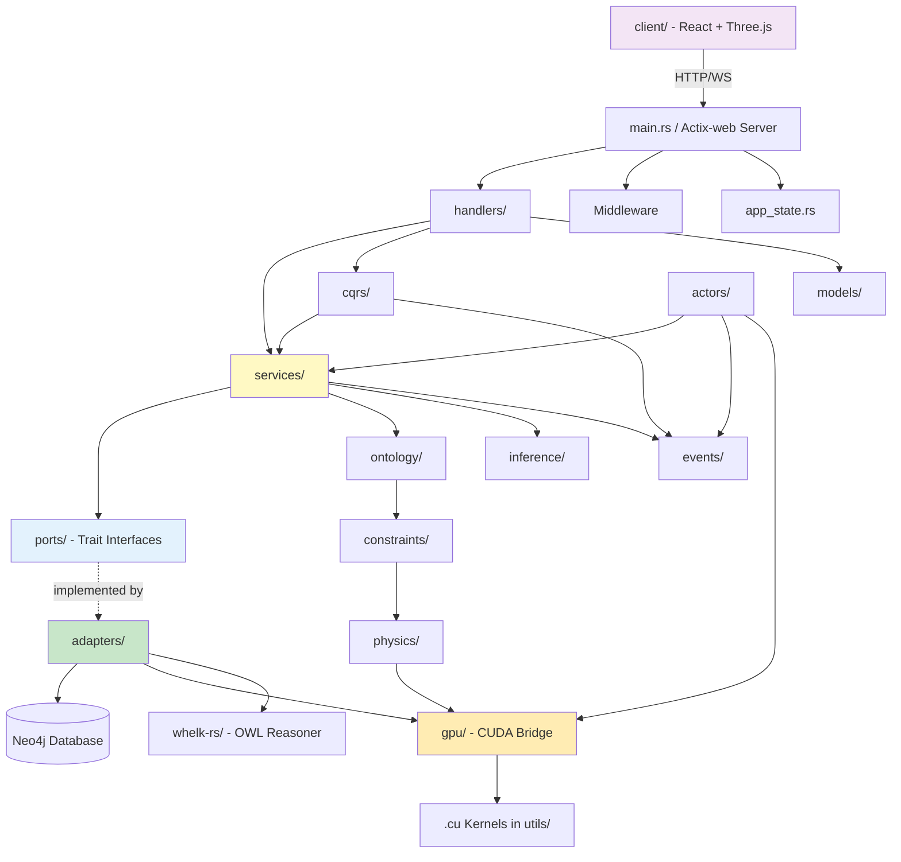

# Project Structure

## Overview

VisionFlow is a real-time 3D graph visualization platform built with a **Rust/Actix-web backend**, a **React 19 + Three.js + TypeScript frontend**, **Neo4j** as its graph database, and **CUDA** GPU-accelerated physics kernels. The backend follows hexagonal (ports and adapters) architecture, and the entire system is designed for high-performance graph layout with ontology-driven semantic reasoning.

## Repository Root Layout

```
VisionFlow/
├── Cargo.toml                   # Rust workspace and dependency manifest
├── Cargo.lock                   # Locked dependency versions
├── build.rs                     # Rust build script (PTX compilation, codegen)
├── config.yml                   # Application runtime configuration
├── ontology_physics.toml        # Physics-ontology mapping rules
├── docker-compose.yml           # Primary Docker Compose orchestration
├── docker-compose.dev.yml       # Development environment compose
├── docker-compose.production.yml # Production environment compose
├── docker-compose.unified.yml   # Unified single-container compose
├── docker-compose.voice.yml     # Voice pipeline compose
├── Dockerfile.dev               # Development Docker image
├── Dockerfile.production        # Production Docker image
├── Dockerfile.unified           # Unified single-container image
├── nginx.conf                   # Default Nginx reverse proxy config
├── nginx.dev.conf               # Development Nginx config
├── nginx.production.conf        # Production Nginx config
├── supervisord.dev.conf         # Supervisord process manager (dev)
├── supervisord.production.conf  # Supervisord process manager (prod)
├── package.json                 # Root-level Node tooling (scripts, hooks)
├── LICENSE                      # Project license
├── README.md                    # Project readme
├── CHANGELOG.md                 # Release changelog
├── AGENTS.md                    # Multi-agent coordination docs
│
├── src/                         # Rust backend source code
├── client/                      # React + Three.js frontend application
├── tests/                       # Backend integration and unit tests
├── multi-agent-docker/          # Multi-agent Docker infrastructure
├── scripts/                     # Build, migration, and utility scripts
├── docs/                        # Documentation (Diataxis structure)
├── schema/                      # Database and API schema definitions
├── config/                      # Runtime configuration files
├── data/                        # Default data, ontology examples, settings
├── examples/                    # Runnable example programs
├── sdk/                         # Client SDKs (e.g., vircadia-world-sdk-ts)
├── public/                      # Static public assets
├── output/                      # Build artifacts and generated output
└── whelk-rs/                    # Whelk OWL reasoning engine (Rust subcrate)
```

## Backend: `src/` -- Rust with Actix-web

The backend is organized using **hexagonal architecture** (ports and adapters). Domain logic lives in `services/` and `application/`, with `ports/` defining trait-based interfaces and `adapters/` providing concrete implementations.

```
src/
├── main.rs                      # Application entry point, Actix-web server bootstrap
├── lib.rs                       # Library root, module re-exports
├── app_state.rs                 # Shared application state (Arc-wrapped)
├── openapi.rs                   # OpenAPI/Swagger spec generation
├── test_helpers.rs              # Shared test utilities
│
├── ports/                       # Port traits (hexagonal architecture inbound/outbound)
│   ├── mod.rs
│   ├── graph_repository.rs      # Graph persistence trait
│   ├── knowledge_graph_repository.rs
│   ├── ontology_repository.rs   # Ontology storage trait
│   ├── settings_repository.rs   # Settings persistence trait
│   ├── physics_simulator.rs     # Physics simulation trait
│   ├── gpu_physics_adapter.rs   # GPU physics computation trait
│   ├── gpu_semantic_analyzer.rs # GPU semantic analysis trait
│   ├── inference_engine.rs      # OWL inference engine trait
│   └── semantic_analyzer.rs     # Semantic analysis trait
│
├── adapters/                    # Adapter implementations (concrete port impls)
│   ├── mod.rs
│   ├── neo4j_adapter.rs         # Neo4j database driver adapter
│   ├── neo4j_graph_repository.rs
│   ├── neo4j_ontology_repository.rs
│   ├── neo4j_settings_repository.rs
│   ├── actor_graph_repository.rs
│   ├── actix_physics_adapter.rs # Actix actor-based physics adapter
│   ├── actix_semantic_adapter.rs
│   ├── gpu_semantic_analyzer.rs # GPU-accelerated semantic adapter
│   ├── physics_orchestrator_adapter.rs
│   ├── whelk_inference_engine.rs # Whelk OWL reasoner adapter
│   └── messages.rs              # Adapter message types
│
├── handlers/                    # HTTP and WebSocket request handlers
│   ├── mod.rs
│   ├── api_handler/             # Versioned REST API handlers
│   ├── graph_state_handler.rs   # Graph CRUD operations
│   ├── physics_handler.rs       # Physics parameter endpoints
│   ├── settings_handler.rs      # Settings read/write endpoints
│   ├── ontology_handler.rs      # Ontology management endpoints
│   ├── ontology_agent_handler.rs
│   ├── semantic_handler.rs      # Semantic query endpoints
│   ├── semantic_pathfinding_handler.rs
│   ├── inference_handler.rs     # OWL inference endpoints
│   ├── clustering_handler.rs    # Graph clustering endpoints
│   ├── natural_language_query_handler.rs
│   ├── schema_handler.rs        # Schema introspection
│   ├── mcp_relay_handler.rs     # MCP protocol relay
│   ├── fastwebsockets_handler.rs # High-perf WebSocket handler
│   ├── socket_flow_handler.rs   # Binary WebSocket flow
│   ├── speech_socket_handler.rs # Voice/STT/TTS socket handler
│   ├── ragflow_handler.rs       # RAGFlow integration handler
│   ├── nostr_handler.rs         # Nostr protocol handler
│   ├── bots_handler.rs          # Bot management handler
│   ├── graph_export_handler.rs  # Export (GEXF, JSON, etc.)
│   ├── constraints_handler.rs   # Ontology constraint endpoints
│   ├── validation_handler.rs    # Input validation endpoints
│   ├── consolidated_health_handler.rs # Health check endpoints
│   ├── workspace_handler.rs     # Workspace management
│   ├── pages_handler.rs         # Static page serving
│   ├── solid_proxy_handler.rs   # Solid pod proxy
│   └── utils.rs                 # Handler utilities
│
├── services/                    # Domain/business logic services
│   ├── mod.rs
│   ├── github/                  # GitHub integration services
│   ├── parsers/                 # Data format parsers
│   ├── ontology_reasoning_service.rs
│   ├── ontology_query_service.rs
│   ├── ontology_mutation_service.rs
│   ├── ontology_pipeline_service.rs
│   ├── ontology_enrichment_service.rs
│   ├── ontology_converter.rs
│   ├── ontology_content_analyzer.rs
│   ├── ontology_file_cache.rs
│   ├── ontology_reasoner.rs
│   ├── owl_extractor_service.rs
│   ├── owl_validator.rs
│   ├── semantic_analyzer.rs
│   ├── semantic_pathfinding_service.rs
│   ├── semantic_type_registry.rs
│   ├── natural_language_query_service.rs
│   ├── schema_service.rs
│   ├── pathfinding.rs           # Graph pathfinding algorithms
│   ├── edge_classifier.rs
│   ├── graph_serialization.rs
│   ├── empty_graph_check.rs
│   ├── file_service.rs
│   ├── github_sync_service.rs
│   ├── github_pr_service.rs
│   ├── local_file_sync_service.rs
│   ├── ragflow_service.rs       # RAGFlow integration
│   ├── perplexity_service.rs    # Perplexity AI integration
│   ├── nostr_service.rs         # Nostr protocol service
│   ├── bots_client.rs
│   ├── mcp_relay_manager.rs     # MCP server relay management
│   ├── multi_mcp_agent_discovery.rs
│   ├── management_api_client.rs
│   ├── speech_service.rs        # TTS/STT service
│   ├── speech_voice_integration.rs
│   ├── voice_context_manager.rs
│   ├── voice_tag_manager.rs
│   ├── audio_router.rs
│   ├── agent_visualization_processor.rs
│   └── agent_visualization_protocol.rs
│
├── actors/                      # Actix actor system (concurrent state machines)
│   ├── mod.rs
│   ├── supervisor.rs            # Actor supervision tree
│   ├── lifecycle.rs             # Actor lifecycle management
│   ├── messages.rs              # Actor message definitions
│   ├── messaging/               # Actor messaging infrastructure
│   ├── gpu/                     # GPU-specific actors
│   ├── graph_state_actor.rs     # Graph state management actor
│   ├── graph_service_supervisor.rs
│   ├── physics_orchestrator_actor.rs # Physics tick loop actor
│   ├── semantic_processor_actor.rs
│   ├── ontology_actor.rs        # Ontology lifecycle actor
│   ├── optimized_settings_actor.rs
│   ├── protected_settings_actor.rs
│   ├── workspace_actor.rs
│   ├── metadata_actor.rs
│   ├── client_coordinator_actor.rs # Client session coordination
│   ├── client_filter.rs         # Client subscription filtering
│   ├── multi_mcp_visualization_actor.rs
│   ├── agent_monitor_actor.rs
│   ├── task_orchestrator_actor.rs
│   ├── voice_commands.rs
│   └── event_coordination.rs
│
├── models/                      # Data models and domain entities
│   ├── mod.rs
│   ├── node.rs                  # Graph node model
│   ├── edge.rs                  # Graph edge model
│   ├── graph.rs                 # Full graph model
│   ├── graph_types.rs           # Graph type enums
│   ├── graph_export.rs          # Export format models
│   ├── metadata.rs              # Node/edge metadata
│   ├── constraints.rs           # Ontology constraint models
│   ├── simulation_params.rs     # Physics simulation parameters
│   ├── user_settings.rs         # User preferences model
│   ├── protected_settings.rs    # Admin-protected settings
│   ├── pagination.rs            # Pagination helpers
│   ├── workspace.rs             # Workspace model
│   └── ragflow_chat.rs          # RAGFlow chat message model
│
├── types/                       # Shared type definitions
│   ├── mod.rs
│   ├── vec3.rs                  # 3D vector type
│   ├── ontology_tools.rs        # Ontology-related types
│   ├── mcp_responses.rs         # MCP protocol response types
│   ├── claude_flow.rs           # Claude Flow integration types
│   └── speech.rs                # Voice/speech types
│
├── gpu/                         # GPU compute pipeline (CUDA bridge)
│   ├── mod.rs
│   ├── kernel_bridge.rs         # Rust-CUDA FFI bridge
│   ├── memory_manager.rs        # GPU memory allocation
│   ├── streaming_pipeline.rs    # Streaming GPU data pipeline
│   ├── dynamic_buffer_manager.rs # Dynamic GPU buffer management
│   ├── backpressure.rs          # GPU backpressure handling
│   ├── broadcast_optimizer.rs   # Broadcast optimization
│   ├── semantic_forces.rs       # Semantic force computation (GPU)
│   ├── visual_analytics.rs      # GPU-accelerated visual analytics
│   ├── conversion_utils.rs      # Host/device data conversion
│   └── types.rs                 # GPU-specific type definitions
│
├── physics/                     # Physics simulation engine
│   ├── mod.rs
│   ├── stress_majorization.rs   # Stress majorization layout algorithm
│   ├── simd_forces.rs           # SIMD-optimized force calculations
│   ├── lsh.rs                   # Locality-sensitive hashing
│   ├── ontology_constraints.rs  # Ontology-driven physics constraints
│   ├── semantic_constraints.rs  # Semantic force constraints
│   └── integration_tests.rs
│
├── constraints/                 # Ontology constraint system
│   ├── mod.rs
│   ├── physics_constraint.rs    # Physics constraint definitions
│   ├── axiom_mapper.rs          # OWL axiom to constraint mapping
│   ├── constraint_blender.rs    # Multi-constraint blending
│   ├── constraint_lod.rs        # Level-of-detail constraints
│   ├── gpu_converter.rs         # Constraint to GPU buffer conversion
│   ├── priority_resolver.rs     # Constraint priority resolution
│   ├── semantic_axiom_translator.rs
│   ├── semantic_gpu_buffer.rs
│   └── semantic_physics_types.rs
│
├── ontology/                    # Ontology subsystem
│   ├── mod.rs
│   ├── actors/                  # Ontology-specific actors
│   ├── parser/                  # OWL/RDF parsing
│   ├── physics/                 # Ontology-physics integration
│   └── services/                # Ontology domain services
│
├── inference/                   # OWL inference engine integration
│   ├── mod.rs
│   ├── owl_parser.rs            # OWL document parser
│   ├── cache.rs                 # Inference result caching
│   ├── optimization.rs          # Query optimization
│   └── types.rs                 # Inference type definitions
│
├── reasoning/                   # Custom reasoning engine
│   ├── mod.rs
│   └── custom_reasoner.rs       # Domain-specific reasoner
│
├── cqrs/                        # CQRS (Command Query Responsibility Segregation)
│   ├── mod.rs
│   ├── bus.rs                   # Command/query bus
│   ├── commands/                # Command definitions
│   ├── queries/                 # Query definitions
│   ├── handlers/                # Command/query handlers
│   └── types.rs                 # CQRS type definitions
│
├── events/                      # Domain event system
│   ├── mod.rs
│   ├── bus.rs                   # Event bus
│   ├── store.rs                 # Event store
│   ├── domain_events.rs         # Domain event definitions
│   ├── handlers/                # Event handlers
│   ├── inference_triggers.rs    # Inference-triggering events
│   ├── middleware.rs            # Event middleware
│   └── types.rs                 # Event type definitions
│
├── application/                 # Application layer (use cases, orchestration)
│   ├── mod.rs
│   ├── graph/                   # Graph use cases
│   ├── physics/                 # Physics use cases
│   ├── ontology/                # Ontology use cases
│   ├── knowledge_graph/         # Knowledge graph use cases
│   ├── settings/                # Settings use cases
│   ├── events.rs                # Application events
│   ├── inference_service.rs     # Inference orchestration
│   ├── physics_service.rs       # Physics orchestration
│   └── semantic_service.rs      # Semantic orchestration
│
├── middleware/                   # Actix-web middleware
│   ├── mod.rs
│   ├── auth.rs                  # Authentication middleware
│   ├── rate_limit.rs            # Rate limiting
│   ├── timeout.rs               # Request timeout
│   └── validation.rs            # Request validation
│
├── config/                      # Configuration module
│   ├── mod.rs
│   ├── dev_config.rs            # Development config defaults
│   ├── feature_access.rs        # Feature flag access
│   └── path_access.rs           # Config path resolution
│
├── settings/                    # Settings subsystem
│   ├── mod.rs
│   ├── api/                     # Settings API integration
│   ├── models.rs                # Settings data models
│   ├── settings_actor.rs        # Settings Actix actor
│   └── auth_extractor.rs        # Auth token extraction
│
├── repositories/                # Repository implementations
│   └── mod.rs
│
├── protocols/                   # Wire protocols
│   └── binary_settings_protocol.rs # Binary settings protocol
│
├── telemetry/                   # Observability and telemetry
│   ├── mod.rs
│   └── agent_telemetry.rs       # Agent telemetry collection
│
├── validation/                  # Input validation
│   ├── mod.rs
│   └── actor_validation.rs      # Actor message validation
│
├── errors/                      # Error types and handling
│   └── mod.rs
│
├── client/                      # Server-side client helpers
│   ├── mod.rs
│   ├── mcp_tcp_client.rs        # MCP TCP client
│   └── settings_cache_client.ts # Settings cache (TypeScript bridge)
│
├── bin/                         # Additional binary targets
│   ├── generate_types.rs        # Type generation utility
│   ├── load_ontology.rs         # Ontology loader CLI
│   ├── sync_github.rs           # GitHub sync CLI
│   ├── sync_local.rs            # Local file sync CLI
│   ├── test_mcp_connection.rs   # MCP connection test utility
│   └── test_tcp_connection_fixed.rs
│
├── utils/                       # Utility modules
│   ├── mod.rs
│   ├── neo4j_helpers.rs         # Neo4j query helpers
│   ├── ptx.rs                   # PTX (CUDA) compilation utilities
│   ├── gpu_memory.rs            # GPU memory utilities
│   ├── gpu_safety.rs            # GPU safety guards
│   ├── gpu_diagnostics.rs       # GPU diagnostic tools
│   ├── cuda_error_handling.rs   # CUDA error handling
│   ├── unified_gpu_compute.rs   # Unified GPU compute utilities
│   ├── dynamic_grid.cu          # CUDA dynamic grid kernel
│   ├── gpu_aabb_reduction.cu    # CUDA AABB reduction kernel
│   ├── gpu_clustering_kernels.cu # CUDA clustering kernel
│   ├── gpu_connected_components.cu # CUDA connected components kernel
│   ├── gpu_landmark_apsp.cu     # CUDA landmark APSP kernel
│   ├── ontology_constraints.cu  # CUDA ontology constraint kernel
│   ├── pagerank.cu              # CUDA PageRank kernel
│   ├── semantic_forces.cu       # CUDA semantic force kernel
│   ├── sssp_compact.cu          # CUDA SSSP kernel
│   ├── visionflow_unified.cu    # Unified CUDA physics kernel
│   ├── visionflow_unified_stability.cu
│   ├── binary_protocol.rs       # Binary wire protocol utilities
│   ├── delta_encoding.rs        # Delta encoding for state diffs
│   ├── memory_bounds.rs         # Memory bounds checking
│   ├── time.rs                  # Time utilities
│   ├── json.rs                  # JSON helpers
│   ├── auth.rs                  # Auth utilities
│   ├── nip98.rs                 # NIP-98 (Nostr) auth utilities
│   ├── handler_commons.rs       # Shared handler helpers
│   ├── response_macros.rs       # HTTP response macros
│   ├── result_helpers.rs        # Result type helpers
│   ├── mcp_client_utils.rs      # MCP client helpers
│   ├── mcp_connection.rs        # MCP connection management
│   ├── mcp_tcp_client.rs        # MCP TCP client
│   ├── network/                 # Network utilities
│   ├── validation/              # Validation utilities
│   ├── websocket_heartbeat.rs   # WebSocket keepalive
│   ├── socket_flow_constants.rs # Socket flow constants
│   ├── socket_flow_messages.rs  # Socket flow message types
│   ├── standard_websocket_messages.rs
│   ├── audio_processor.rs       # Audio processing utilities
│   └── edge_data.rs             # Edge data helpers
│
└── tests/                       # In-crate unit tests
    └── (module-level #[cfg(test)] blocks)
```

## Frontend: `client/` -- React 19 + Three.js + TypeScript

The frontend is a Vite-powered React 19 application with Three.js for 3D graph rendering, Tailwind CSS for styling, and Zustand-based state management.

```
client/
├── package.json                 # Frontend dependencies and scripts
├── package-lock.json
├── tsconfig.json                # TypeScript configuration
├── vite.config.ts               # Vite build configuration
├── vitest.config.ts             # Vitest test runner configuration
├── playwright.config.ts         # Playwright E2E test configuration
├── eslint.config.js             # ESLint flat config
├── tailwind.config.js           # Tailwind CSS configuration
├── postcss.config.cjs           # PostCSS configuration
├── index.html                   # HTML entry point
├── crates/                      # WASM crate integrations
├── scripts/                     # Frontend build/dev scripts
├── public/                      # Static assets served at root
├── tests/                       # Playwright E2E and integration tests
│   ├── e2e/                     # End-to-end tests
│   ├── *.spec.ts                # Playwright spec files
│   └── ...
│
└── src/
    ├── main.tsx                 # (via app/) React DOM entry point
    ├── vite-env.d.ts            # Vite type declarations
    ├── setupTests.ts            # Test setup (Vitest)
    │
    ├── app/                     # Application shell
    │   ├── App.tsx              # Root component
    │   ├── AppInitializer.tsx   # Bootstrap logic
    │   ├── MainLayout.tsx       # Main layout wrapper
    │   ├── main.tsx             # ReactDOM.createRoot entry
    │   └── components/          # App-level components
    │
    ├── components/              # Shared/reusable UI components
    │   ├── ControlCenter/       # Control center panel
    │   ├── settings/            # Settings UI components
    │   ├── error-handling/      # Error boundary components
    │   ├── LoadingScreen.tsx
    │   ├── ErrorBoundary.tsx
    │   ├── ErrorNotification.tsx
    │   ├── VoiceButton.tsx
    │   ├── VoiceIndicator.tsx
    │   ├── SpaceMouseStatus.tsx
    │   ├── NostrLoginScreen.tsx
    │   ├── KeyboardShortcutsModal.tsx
    │   ├── ConnectionWarning.tsx
    │   ├── BrowserSupportWarning.tsx
    │   └── DebugControlPanel.tsx
    │
    ├── features/                # Feature modules (domain slices)
    │   ├── graph/               # 3D graph visualization (Three.js)
    │   ├── physics/             # Physics controls and overlays
    │   ├── ontology/            # Ontology browser and editor
    │   ├── analytics/           # Analytics dashboards
    │   ├── settings/            # Settings management UI
    │   ├── visualisation/       # Visualization modes and effects
    │   ├── design-system/       # Design system / component library
    │   ├── bots/                # Bot management UI
    │   ├── command-palette/     # Command palette (Ctrl+K)
    │   ├── monitoring/          # System monitoring UI
    │   ├── onboarding/          # Onboarding flow
    │   ├── help/                # Help and documentation UI
    │   └── solid/               # Solid protocol integration
    │
    ├── rendering/               # Three.js rendering pipeline
    │   ├── index.ts
    │   ├── rendererFactory.ts   # WebGL renderer factory
    │   ├── GemPostProcessing.tsx # Post-processing effects
    │   └── materials/           # Custom shader materials
    │
    ├── immersive/               # Immersive/XR mode
    │   ├── components/          # XR UI components
    │   ├── hooks/               # XR-specific hooks
    │   └── threejs/             # Three.js XR integration
    │
    ├── hooks/                   # Custom React hooks
    │   ├── useGraphSettings.ts
    │   ├── useMouseControls.ts
    │   ├── useKeyboardShortcuts.ts
    │   ├── useSettingsWebSocket.ts
    │   ├── useAnalytics.ts
    │   ├── useVoiceInteraction.ts
    │   ├── useNostrAuth.ts
    │   ├── useSolidPod.ts
    │   ├── useHeadTracking.ts
    │   ├── useQuest3Integration.ts
    │   ├── useWasmSceneEffects.ts
    │   ├── useOptimizedFrame.ts
    │   ├── useWorkspaces.ts
    │   ├── useToast.ts
    │   └── ...
    │
    ├── store/                   # Zustand state management
    │   ├── settingsStore.ts     # Settings state
    │   ├── websocketStore.ts    # WebSocket connection state
    │   ├── workerErrorStore.ts  # Worker error tracking
    │   ├── autoSaveManager.ts   # Auto-save orchestration
    │   └── settingsRetryManager.ts
    │
    ├── services/                # External service clients
    │   ├── api/                 # REST API clients
    │   ├── bridges/             # Service bridges
    │   ├── vircadia/            # Vircadia world integration
    │   ├── __tests__/           # Service tests
    │   ├── BinaryWebSocketProtocol.ts
    │   ├── WebSocketEventBus.ts
    │   ├── WebSocketRegistry.ts
    │   ├── AudioContextManager.ts
    │   ├── AudioInputService.ts
    │   ├── AudioOutputService.ts
    │   ├── LiveKitVoiceService.ts
    │   ├── VoiceOrchestrator.ts
    │   ├── VoiceWebSocketService.ts
    │   ├── PushToTalkService.ts
    │   ├── SolidPodService.ts
    │   ├── SpaceDriverService.ts
    │   ├── nostrAuthService.ts
    │   ├── platformManager.ts
    │   ├── quest3AutoDetector.ts
    │   └── remoteLogger.ts
    │
    ├── api/                     # API layer (typed fetch wrappers)
    │   ├── index.ts
    │   ├── settingsApi.ts
    │   ├── analyticsApi.ts
    │   ├── constraintsApi.ts
    │   ├── exportApi.ts
    │   ├── optimizationApi.ts
    │   └── workspaceApi.ts
    │
    ├── contexts/                # React context providers
    │   ├── ApplicationModeContext.tsx
    │   ├── VircadiaContext.tsx
    │   └── VircadiaBridgesContext.tsx
    │
    ├── telemetry/               # Client-side telemetry
    │   ├── index.ts
    │   ├── AgentTelemetry.ts
    │   ├── DebugOverlay.tsx
    │   ├── useTelemetry.ts
    │   └── __tests__/
    │
    ├── types/                   # TypeScript type definitions
    │   ├── websocketTypes.ts
    │   ├── binaryProtocol.ts
    │   ├── idMapping.ts
    │   ├── ragflowTypes.ts
    │   └── *.d.ts               # Third-party type declarations
    │
    ├── styles/                  # Global stylesheets
    │   ├── index.css            # Entry CSS (Tailwind imports)
    │   ├── base.css             # Base styles
    │   └── tailwind-utilities.css
    │
    ├── wasm/                    # WASM bridge modules
    │   └── scene-effects-bridge.ts
    │
    ├── utils/                   # Frontend utility functions
    └── __tests__/               # Component unit tests
        └── __mocks__/           # Test mocks
```

## Tests: `tests/`

Backend tests live in the top-level `tests/` directory (Rust integration test convention). Module-level unit tests use inline `#[cfg(test)]` blocks within `src/`.

```
tests/
├── mod.rs                       # Test module root
├── test_utils.rs                # Shared test utilities
│
├── adapters/                    # Adapter integration tests
│   ├── mod.rs
│   ├── actor_wrapper_tests.rs
│   └── integration_actor_tests.rs
│
├── ports/                       # Port mock/contract tests
│   ├── mod.rs
│   ├── mocks.rs                 # Port trait mocks
│   ├── test_gpu_physics_adapter.rs
│   ├── test_gpu_semantic_analyzer.rs
│   ├── test_inference_engine.rs
│   ├── test_knowledge_graph_repository.rs
│   ├── test_ontology_repository.rs
│   └── test_settings_repository.rs
│
├── actors/                      # Actor integration tests
│   ├── mod.rs
│   └── integration_tests.rs
│
├── events/                      # Event system tests
│   ├── mod.rs
│   ├── event_bus_tests.rs
│   └── integration_tests.rs
│
├── cqrs/                        # CQRS integration tests
│   ├── mod.rs
│   └── integration_tests.rs
│
├── inference/                   # Inference engine tests
│   ├── mod.rs
│   ├── owl_parsing_tests.rs
│   ├── classification_tests.rs
│   ├── consistency_tests.rs
│   ├── explanation_tests.rs
│   ├── cache_tests.rs
│   └── performance_tests.rs
│
├── integration/                 # End-to-end integration tests
│   ├── mod.rs
│   ├── pipeline_end_to_end_test.rs
│   ├── ontology_pipeline_e2e_test.rs
│   ├── semantic_physics_integration_test.rs
│   ├── security_validation_test.py    # Python security tests
│   ├── gpu_stability_test.py
│   └── run_tests.sh
│
├── unit/                        # Additional unit tests
│   ├── mod.rs
│   └── ontology_reasoning_test.rs
│
├── benchmarks/                  # Performance benchmarks
│   ├── reasoning_benchmarks.rs
│   └── repository_benchmarks.rs
│
├── load/                        # Load tests
│   └── locustfile.py            # Locust load test definitions
│
├── fixtures/                    # Test fixture data
│   ├── mod.rs
│   ├── ontologies/              # Sample OWL/RDF ontology files
│   └── ontology/                # Ontology fixture data
│
├── settings/                    # Settings-specific tests
│   └── PresetSelector.test.tsx
│
├── api/                         # API endpoint tests
├── solid/                       # Solid protocol tests
├── examples/                    # Example-based tests
│
├── *.rs                         # Standalone integration test files
│   (e.g., neo4j_settings_integration_tests.rs,
│    gpu_safety_tests.rs, ontology_smoke_test.rs,
│    reasoning_integration_tests.rs,
│    telemetry_integration_tests.rs, etc.)
│
└── *.sh                         # Shell-based test scripts
    (e.g., gpu_fallback_test.sh,
     manual_physics_parameter_test.sh, etc.)
```

## Multi-Agent Docker: `multi-agent-docker/`

Infrastructure for running VisionFlow's multi-agent orchestration system (Claude-based agents, MCP servers, skills).

```
multi-agent-docker/
├── Dockerfile.unified           # Unified agent container image
├── docker-compose.unified.yml   # Agent orchestration compose
├── build-unified.sh             # Container build script
├── REBUILD.sh                   # Quick rebuild script
├── QUICKSTART.md                # Quick start guide
├── README.md
├── package.json                 # Node.js tooling for agent infra
│
├── mcp-infrastructure/          # MCP (Model Context Protocol) servers
│   ├── servers/                 # MCP server implementations
│   ├── auth/                    # MCP auth configuration
│   ├── config/                  # MCP server configs
│   ├── logging/                 # MCP logging setup
│   ├── monitoring/              # MCP monitoring
│   ├── scripts/                 # MCP management scripts
│   ├── mcp.json                 # MCP registry
│   └── mcp-full-registry.json   # Full MCP server registry
│
├── config/                      # Agent configuration
│   ├── cuda-compatibility.yml   # CUDA compatibility settings
│   └── gemini-flow.config.ts    # Gemini Flow config
│
├── unified-config/              # Unified container config
│   ├── entrypoint-unified.sh    # Container entrypoint
│   ├── supervisord.unified.conf # Process supervision
│   ├── hyprland.conf            # Window manager config
│   ├── kitty.conf               # Terminal config
│   ├── tmux-autostart.sh        # Tmux session auto-start
│   ├── turbo-flow-aliases.sh    # Shell aliases
│   ├── statusline.sh            # Status bar script
│   ├── init-ruvector.sql        # RuVector DB initialization
│   ├── scripts/                 # Container utility scripts
│   └── terminal-init/           # Terminal initialization
│
├── skills/                      # Agent skill definitions (100+)
│   ├── rust-development/        # Rust development skill
│   ├── cuda/                    # CUDA development skill
│   ├── playwright/              # Browser testing skill
│   ├── docker-manager/          # Docker management skill
│   ├── github-code-review/      # Code review skill
│   ├── performance-analysis/    # Performance analysis skill
│   ├── ontology-core/           # Ontology management skill
│   ├── webapp-testing/          # Web app testing skill
│   └── ...                      # Many more agent skills
│
├── schemas/                     # JSON schemas
├── scripts/                     # Management scripts
├── docs/                        # Agent infrastructure docs
├── aisp-integration/            # AISP integration
├── claude-zai/                  # Claude orchestration
├── comfyui/                     # ComfyUI integration
├── https-bridge/                # HTTPS bridge proxy
└── management-api/              # Agent management REST API
```

## Scripts: `scripts/`

Build, migration, testing, and operational utility scripts.

```
scripts/
├── build_ptx.sh                 # Compile CUDA .cu files to PTX
├── compile_cuda.sh              # CUDA compilation wrapper
├── check_ptx_compilation.sh     # Verify PTX compilation
├── verify_ptx.sh                # PTX validation
├── run_gpu_tests.sh             # Run GPU test suite
├── run-gpu-test-suite.sh        # Extended GPU test suite
│
├── neo4j/                       # Neo4j database scripts
├── migrations/                  # Database migration scripts
├── clean_all_graph_data.sql     # Wipe all graph data
├── clean_github_data.sql        # Wipe GitHub sync data
├── fix-ontology-schema.sql      # Ontology schema fixes
├── fix-ontology-schema-v2.sql
├── init-vircadia-db.sql         # Vircadia DB initialization
├── migrate_ontology_database.sql
│
├── dev-entrypoint.sh            # Development entrypoint
├── prod-entrypoint.sh           # Production entrypoint
├── production-entrypoint.sh     # Alt production entrypoint
├── production-startup.sh        # Production startup sequence
├── launch.sh                    # Generic launch script
├── start.sh                     # Quick start script
├── provision.sh                 # Environment provisioning
│
├── hooks/                       # Git hooks
├── link-generation/             # Link generation tools
├── whelk-rs/                    # Whelk build scripts
│
├── add-frontmatter.js           # Add YAML frontmatter to docs
├── validate-frontmatter.js      # Validate doc frontmatter
├── validate-markdown-links.js   # Validate Markdown link targets
├── fix-mermaid-diagrams.py      # Fix Mermaid diagram syntax
├── log_aggregator.py            # Aggregate log files
├── log_monitor_dashboard.py     # Real-time log dashboard
│
├── migrate_*.py / migrate_*.rs  # Various migration scripts
├── refactor_*.py                # Code refactoring scripts
├── test-*.ts                    # TypeScript test scripts
└── ...
```

## Documentation: `docs/`

Documentation follows the [Diataxis](https://diataxis.fr/) framework, organized into four categories.

```
docs/
├── README.md
├── CHANGELOG.md
├── CONTRIBUTING.md
├── architecture.md              # Architecture overview
├── integration-guide.md         # Integration guide
├── security.md                  # Security documentation
│
├── tutorials/                   # Learning-oriented guides
├── how-to/                      # Task-oriented guides
│   ├── development/             # Development how-tos (this file lives here)
│   ├── deployment/              # Deployment how-tos
│   ├── features/                # Feature usage guides
│   ├── infrastructure/          # Infrastructure guides
│   ├── agents/                  # Agent configuration guides
│   ├── ai-integration/          # AI integration guides
│   ├── integration/             # Third-party integration
│   └── operations/              # Operational runbooks
├── explanation/                 # Understanding-oriented docs
├── reference/                   # Information-oriented reference
├── api/                         # API reference docs
├── architecture/                # Architecture decision records
├── diagrams/                    # Mermaid and visual diagrams
├── testing/                     # Testing documentation
├── audit/                       # Security and code audit reports
└── use-cases/                   # Use case documentation
```

## Key Configuration Files

### `Cargo.toml`

The Rust workspace manifest defines all backend dependencies, feature flags, and binary targets. Key sections include:

- **[dependencies]**: `actix-web`, `actix-rt`, `actix`, `neo4rs` (Neo4j driver), `serde`, `tokio`, `uuid`, etc.
- **[build-dependencies]**: CUDA PTX compilation tooling
- **[[bin]]**: Multiple binary targets (`visionflow`, `generate_types`, `load_ontology`, `sync_github`, `sync_local`)
- **[features]**: Feature flags for optional subsystems (GPU, voice, etc.)

### `client/package.json`

The frontend package manifest. Key dependencies include:

- **react** / **react-dom** (v19)
- **three** / **@react-three/fiber** / **@react-three/drei** (Three.js integration)
- **zustand** (state management)
- **tailwindcss** (utility-first CSS)
- **vite** (build tool)
- **vitest** (unit test runner)
- **playwright** (E2E test runner)

### `config.yml` / `data/settings.yaml`

Runtime configuration for the Actix-web server, Neo4j connection, GPU settings, physics parameters, and feature flags.

### Docker Compose Files

| File | Purpose |
|------|---------|
| `docker-compose.yml` | Primary development orchestration |
| `docker-compose.dev.yml` | Development overrides (hot reload, debug) |
| `docker-compose.production.yml` | Production deployment |
| `docker-compose.unified.yml` | Single-container deployment |
| `docker-compose.voice.yml` | Voice pipeline services |
| `docker-compose.vircadia.yml` | Vircadia world integration |

### Nginx Configuration

| File | Purpose |
|------|---------|
| `nginx.conf` | Default reverse proxy (WebSocket upgrade, static serving) |
| `nginx.dev.conf` | Development proxy (HMR support) |
| `nginx.production.conf` | Production proxy (caching, compression) |

## Module Dependency Architecture



## Code Organization Principles

### 1. Hexagonal Architecture (Ports and Adapters)

Domain logic is isolated from infrastructure concerns:

- **Ports** (`src/ports/`): Define trait interfaces for all external dependencies (database, GPU, inference engine).
- **Adapters** (`src/adapters/`): Implement port traits with concrete technology (Neo4j, CUDA, Whelk).
- **Services** (`src/services/`): Contain pure business logic, depending only on port traits.
- **Handlers** (`src/handlers/`): Translate HTTP/WS requests into service calls.

```rust
// Port trait (src/ports/graph_repository.rs)
#[async_trait]
pub trait GraphRepository: Send + Sync {
    async fn get_node(&self, id: &Uuid) -> Result<Node, GraphError>;
    async fn create_node(&self, node: NewNode) -> Result<Node, GraphError>;
}

// Adapter implementation (src/adapters/neo4j_graph_repository.rs)
pub struct Neo4jGraphRepository { /* ... */ }

#[async_trait]
impl GraphRepository for Neo4jGraphRepository {
    async fn get_node(&self, id: &Uuid) -> Result<Node, GraphError> {
        // Neo4j Cypher query here
    }
}
```

### 2. Actor Model Concurrency

Long-lived stateful components use Actix actors (`src/actors/`):

- **PhysicsOrchestratorActor**: Runs the physics simulation tick loop.
- **GraphStateActor**: Manages authoritative graph state.
- **OntologyActor**: Manages ontology lifecycle and caching.
- **ClientCoordinatorActor**: Manages per-client WebSocket sessions.

### 3. CQRS and Event Sourcing

Commands and queries are separated through the CQRS bus (`src/cqrs/`), with domain events (`src/events/`) enabling loose coupling between subsystems.

### 4. File Naming Conventions

| Context | Convention | Example |
|---------|-----------|---------|
| Rust modules | `snake_case` | `neo4j_adapter.rs` |
| Rust types/traits | `PascalCase` | `GraphRepository`, `Neo4jAdapter` |
| Rust constants | `UPPER_SNAKE_CASE` | `MAX_BATCH_SIZE` |
| React components | `PascalCase` | `ControlCenter.tsx` |
| React hooks | `camelCase` with `use` prefix | `useGraphSettings.ts` |
| React stores | `camelCase` | `settingsStore.ts` |
| TypeScript types | `PascalCase` | `WebSocketMessage` |
| CSS files | `kebab-case` or `camelCase` | `tailwind-utilities.css` |
| CUDA kernels | `snake_case` with `.cu` extension | `semantic_forces.cu` |
| Test files (Rust) | `snake_case` with `_test` suffix | `gpu_safety_tests.rs` |
| Test files (TS) | Match source + `.test` or `.spec` | `websocketStore.test.ts` |

## Build Commands

### Backend (Rust)

```bash
# Build the backend (debug mode)
cargo build

# Build the backend (release mode with optimizations)
cargo build --release

# Run the backend server
cargo run

# Run backend tests
cargo test

# Build CUDA PTX kernels
bash scripts/build_ptx.sh

# Run a specific binary target
cargo run --bin generate_types
cargo run --bin load_ontology
cargo run --bin sync_github
```

### Frontend (React + TypeScript)

```bash
# Install frontend dependencies
cd client && npm install

# Start development server (Vite HMR)
cd client && npm run dev

# Build for production
cd client && npm run build

# Run unit tests (Vitest)
cd client && npm run test

# Run E2E tests (Playwright)
cd client && npx playwright test

# Lint
cd client && npx eslint .
```

### Docker

```bash
# Start full stack (dev)
docker compose -f docker-compose.dev.yml up

# Start full stack (production)
docker compose -f docker-compose.production.yml up

# Start unified single-container
docker compose -f docker-compose.unified.yml up

# Rebuild production image
docker compose -f docker-compose.production.yml build
```

## Environment-Specific Files

| File | Purpose | Tracked in Git |
|------|---------|----------------|
| `.env.example` | Template for environment variables | Yes |
| `.env` | Local development secrets | No |
| `config.yml` | Runtime configuration | Yes |
| `data/settings.yaml` | Default settings | Yes |
| `data/dev_config.toml` | Development config overrides | Yes |
| `ontology_physics.toml` | Ontology-physics mapping | Yes |

---

## Related Documentation

- [Architecture Overview](./03-architecture.md)
- [Adding Features](./04-adding-features.md)
- [Testing Guide](./05-testing-guide.md)
- [Contributing Guidelines](06-contributing.md)
- [Troubleshooting Guide](../infrastructure/troubleshooting.md)
- [VisionFlow Guides](../index.md)
