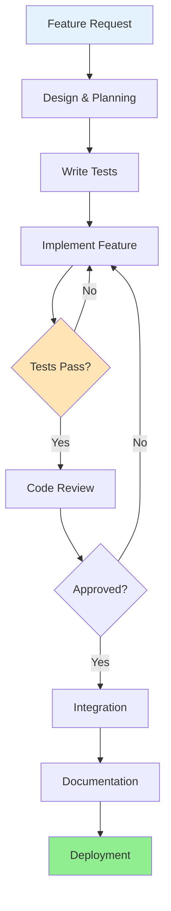

# Adding Features

## Feature Development Process

This guide walks through the complete process of adding a new feature to VisionFlow using Test-Driven Development (TDD).

## Development Workflow



## Example: Adding User Notifications Feature

### Step 1: Planning & Design

**Requirements**:
- Users can receive email and in-app notifications
- Notifications for: project created, processing complete, errors
- Users can manage notification preferences
- RESTful API endpoints
- UI components for notifications

**Design Decisions**:
```yaml
database:
  - notifications table
  - notification-preferences table

api-endpoints:
  - GET /api/notifications
  - POST /api/notifications/:id/read
  - GET /api/notifications/preferences
  - PUT /api/notifications/preferences

services:
  - NotificationService
  - EmailNotificationProvider
  - InAppNotificationProvider
```

### Step 2: Create Feature Branch

```bash
git checkout -b feature/user-notifications
```

### Step 3: Database Migration

**File**: `migrations/005-create-notifications.sql`

```sql
-- Create notifications table
CREATE TABLE notifications (
  id UUID PRIMARY KEY DEFAULT gen-random-uuid(),
  user-id UUID NOT NULL REFERENCES users(id) ON DELETE CASCADE,
  type VARCHAR(50) NOT NULL,
  title VARCHAR(255) NOT NULL,
  message TEXT,
  data JSONB,
  read BOOLEAN DEFAULT FALSE,
  created-at TIMESTAMP DEFAULT CURRENT-TIMESTAMP,
  INDEX idx-notifications-user-id (user-id),
  INDEX idx-notifications-created-at (created-at)
);

-- Create notification preferences table
CREATE TABLE notification-preferences (
  id UUID PRIMARY KEY DEFAULT gen-random-uuid(),
  user-id UUID NOT NULL UNIQUE REFERENCES users(id) ON DELETE CASCADE,
  email-enabled BOOLEAN DEFAULT TRUE,
  in-app-enabled BOOLEAN DEFAULT TRUE,
  preferences JSONB DEFAULT '{}',
  created-at TIMESTAMP DEFAULT CURRENT-TIMESTAMP,
  updated-at TIMESTAMP DEFAULT CURRENT-TIMESTAMP
);
```

Run migration:
```bash
npm run db:migrate
```

### Step 4: Write Tests First (TDD)

**File**: `tests/unit/api/services/NotificationService.test.js`

```javascript
const NotificationService = require('@/api/services/NotificationService');
const { Notification, NotificationPreference } = require('@/api/models');

describe('NotificationService', () => {
  let service;

  beforeEach(() => {
    service = new NotificationService();
  });

  describe('create', () => {
    it('should create a notification', async () => {
      const data = {
        userId: 'user-123',
        type: 'project-created',
        title: 'Project Created',
        message: 'Your project was created successfully'
      };

      const notification = await service.create(data);

      expect(notification).toHaveProperty('id');
      expect(notification.userId).toBe(data.userId);
      expect(notification.type).toBe(data.type);
      expect(notification.read).toBe(false);
    });

    it('should send email if user preferences allow', async () => {
      const mockSendEmail = jest.spyOn(service.emailProvider, 'send');

      await service.create({
        userId: 'user-123',
        type: 'project-created',
        title: 'Test',
        message: 'Test message'
      });

      expect(mockSendEmail).toHaveBeenCalled();
    });
  });

  describe('markAsRead', () => {
    it('should mark notification as read', async () => {
      const notification = await service.create({
        userId: 'user-123',
        type: 'test',
        title: 'Test'
      });

      const updated = await service.markAsRead(notification.id);

      expect(updated.read).toBe(true);
    });
  });

  describe('getUserNotifications', () => {
    it('should return user notifications', async () => {
      await service.create({
        userId: 'user-123',
        type: 'test1',
        title: 'Test 1'
      });

      await service.create({
        userId: 'user-123',
        type: 'test2',
        title: 'Test 2'
      });

      const notifications = await service.getUserNotifications('user-123');

      expect(notifications).toHaveLength(2);
    });

    it('should filter by read status', async () => {
      const n1 = await service.create({
        userId: 'user-123',
        type: 'test1',
        title: 'Test 1'
      });

      await service.create({
        userId: 'user-123',
        type: 'test2',
        title: 'Test 2'
      });

      await service.markAsRead(n1.id);

      const unread = await service.getUserNotifications('user-123', {
        read: false
      });

      expect(unread).toHaveLength(1);
    });
  });
});
```

Run tests (they should fail):
```bash
npm test -- NotificationService
```

### Step 5: Implement Data Models

**File**: `src/api/models/Notification.js`

```javascript
const { Model } = require('objection');

class Notification extends Model {
  static get tableName() {
    return 'notifications';
  }

  static get jsonSchema() {
    return {
      type: 'object',
      required: ['userId', 'type', 'title'],
      properties: {
        id: { type: 'string', format: 'uuid' },
        userId: { type: 'string', format: 'uuid' },
        type: { type: 'string', maxLength: 50 },
        title: { type: 'string', maxLength: 255 },
        message: { type: ['string', 'null'] },
        data: { type: ['object', 'null'] },
        read: { type: 'boolean', default: false },
        createdAt: { type: 'string', format: 'date-time' }
      }
    };
  }

  static get relationMappings() {
    const User = require('./User');

    return {
      user: {
        relation: Model.BelongsToOneRelation,
        modelClass: User,
        join: {
          from: 'notifications.userId',
          to: 'users.id'
        }
      }
    };
  }
}

module.exports = Notification;
```

**File**: `src/api/models/NotificationPreference.js`

```javascript
const { Model } = require('objection');

class NotificationPreference extends Model {
  static get tableName() {
    return 'notification-preferences';
  }

  static get jsonSchema() {
    return {
      type: 'object',
      required: ['userId'],
      properties: {
        id: { type: 'string', format: 'uuid' },
        userId: { type: 'string', format: 'uuid' },
        emailEnabled: { type: 'boolean', default: true },
        inAppEnabled: { type: 'boolean', default: true },
        preferences: { type: 'object', default: {} },
        createdAt: { type: 'string', format: 'date-time' },
        updatedAt: { type: 'string', format: 'date-time' }
      }
    };
  }
}

module.exports = NotificationPreference;
```

### Step 6: Implement Service Layer

**File**: `src/api/services/NotificationService.js`

```javascript
const Notification = require('../models/Notification');
const NotificationPreference = require('../models/NotificationPreference');
const EmailNotificationProvider = require('./providers/EmailNotificationProvider');
const logger = require('../utils/logger');

class NotificationService {
  constructor() {
    this.emailProvider = new EmailNotificationProvider();
  }

  async create(data) {
    const { userId, type, title, message, metadata } = data;

    // Create notification in database
    const notification = await Notification.query().insert({
      userId,
      type,
      title,
      message,
      data: metadata
    });

    // Check user preferences
    const preferences = await this.getUserPreferences(userId);

    // Send email if enabled
    if (preferences.emailEnabled) {
      try {
        await this.emailProvider.send({
          to: userId,
          subject: title,
          body: message
        });
      } catch (error) {
        logger.error('Failed to send email notification', { error, userId });
      }
    }

    return notification;
  }

  async markAsRead(notificationId) {
    return await Notification.query()
      .patchAndFetchById(notificationId, { read: true });
  }

  async getUserNotifications(userId, filters = {}) {
    let query = Notification.query()
      .where('userId', userId)
      .orderBy('createdAt', 'desc');

    if (filters.read !== undefined) {
      query = query.where('read', filters.read);
    }

    if (filters.type) {
      query = query.where('type', filters.type);
    }

    if (filters.limit) {
      query = query.limit(filters.limit);
    }

    return await query;
  }

  async getUserPreferences(userId) {
    let preferences = await NotificationPreference.query()
      .where('userId', userId)
      .first();

    if (!preferences) {
      preferences = await NotificationPreference.query().insert({
        userId,
        emailEnabled: true,
        inAppEnabled: true
      });
    }

    return preferences;
  }

  async updateUserPreferences(userId, updates) {
    const preferences = await this.getUserPreferences(userId);

    return await NotificationPreference.query()
      .patchAndFetchById(preferences.id, {
        ...updates,
        updatedAt: new Date()
      });
  }
}

module.exports = NotificationService;
```

### Step 7: Implement API Endpoints

**File**: `src/api/controllers/NotificationController.js`

```javascript
const NotificationService = require('../services/NotificationService');
const { asyncHandler } = require('../utils/asyncHandler');

class NotificationController {
  constructor() {
    this.service = new NotificationService();
  }

  getNotifications = asyncHandler(async (req, res) => {
    const { read, type, limit } = req.query;
    const userId = req.user.id;

    const notifications = await this.service.getUserNotifications(userId, {
      read: read !== undefined ? read === 'true' : undefined,
      type,
      limit: limit ? parseInt(limit) : undefined
    });

    res.json({
      success: true,
      data: notifications
    });
  });

  markAsRead = asyncHandler(async (req, res) => {
    const { id } = req.params;

    const notification = await this.service.markAsRead(id);

    res.json({
      success: true,
      data: notification
    });
  });

  getPreferences = asyncHandler(async (req, res) => {
    const userId = req.user.id;

    const preferences = await this.service.getUserPreferences(userId);

    res.json({
      success: true,
      data: preferences
    });
  });

  updatePreferences = asyncHandler(async (req, res) => {
    const userId = req.user.id;
    const updates = req.body;

    const preferences = await this.service.updateUserPreferences(
      userId,
      updates
    );

    res.json({
      success: true,
      data: preferences
    });
  });
}

module.exports = new NotificationController();
```

**File**: `src/api/routes/notifications.js`

```javascript
const express = require('express');
const router = express.Router();
const NotificationController = require('../controllers/NotificationController');
const { authenticate } = require('../middleware/auth');
const { validate } = require('../middleware/validation');
const { notificationPreferencesSchema } = require('../validators');

// All routes require authentication
router.use(authenticate);

// Get user notifications
router.get('/', NotificationController.getNotifications);

// Mark notification as read
router.post('/:id/read', NotificationController.markAsRead);

// Get notification preferences
router.get('/preferences', NotificationController.getPreferences);

// Update notification preferences
router.put(
  '/preferences',
  validate(notificationPreferencesSchema),
  NotificationController.updatePreferences
);

module.exports = router;
```

**File**: `src/api/index.js` (update)

```javascript
// Add to existing routes
app.use('/api/notifications', require('./routes/notifications'));
```

### Step 8: Add Frontend Components

**File**: `src/web/components/NotificationBell.vue`

```vue
<template>
  <div class="notification-bell">
    <button @click="toggleDropdown" class="bell-button">
      🔔
      <span v-if="unreadCount > 0" class="badge">{{ unreadCount }}</span>
    </button>

    <div v-if="isOpen" class="dropdown">
      <div class="dropdown-header">
        <h3>Notifications</h3>
        <button @click="markAllAsRead">Mark all read</button>
      </div>

      <div class="notifications-list">
        <NotificationItem
          v-for="notification in notifications"
          :key="notification.id"
          :notification="notification"
          @mark-read="handleMarkRead"
        />
      </div>

      <div class="dropdown-footer">
        <router-link to="/notifications">View all</router-link>
      </div>
    </div>
  </div>
</template>

<script>
import { ref, computed, onMounted } from 'vue';
import { useNotifications } from '@/composables/useNotifications';
import NotificationItem from './NotificationItem.vue';

export default {
  name: 'NotificationBell',
  components: {
    NotificationItem
  },
  setup() {
    const isOpen = ref(false);
    const { notifications, unreadCount, fetchNotifications, markAsRead } =
      useNotifications();

    const toggleDropdown = () => {
      isOpen.value = !isOpen.value;
    };

    const handleMarkRead = async (id) => {
      await markAsRead(id);
    };

    const markAllAsRead = async () => {
      await Promise.all(
        notifications.value
          .filter(n => !n.read)
          .map(n => markAsRead(n.id))
      );
    };

    onMounted(() => {
      fetchNotifications();
    });

    return {
      isOpen,
      notifications,
      unreadCount,
      toggleDropdown,
      handleMarkRead,
      markAllAsRead
    };
  }
};
</script>

<style scoped>
.notification-bell {
  position: relative;
}

.bell-button {
  position: relative;
  background: none;
  border: none;
  font-size: 24px;
  cursor: pointer;
}

.badge {
  position: absolute;
  top: -5px;
  right: -5px;
  background: #ff4444;
  color: white;
  border-radius: 50%;
  padding: 2px 6px;
  font-size: 12px;
}

.dropdown {
  position: absolute;
  right: 0;
  top: 100%;
  width: 400px;
  background: white;
  border: 1px solid #ddd;
  border-radius: 8px;
  box-shadow: 0 4px 6px rgba(0, 0, 0, 0.1);
  z-index: 1000;
}

/* Additional styles... */
</style>
```

**File**: `src/web/composables/useNotifications.js`

```javascript
import { ref, computed } from 'vue';
import api from '@/services/api';

const notifications = ref([]);

export function useNotifications() {
  const unreadCount = computed(() =>
    notifications.value.filter(n => !n.read).length
  );

  const fetchNotifications = async () => {
    const response = await api.get('/notifications');
    notifications.value = response.data.data;
  };

  const markAsRead = async (id) => {
    await api.post(`/notifications/${id}/read`);
    const notification = notifications.value.find(n => n.id === id);
    if (notification) {
      notification.read = true;
    }
  };

  return {
    notifications,
    unreadCount,
    fetchNotifications,
    markAsRead
  };
}
```

### Step 9: Run Tests

```bash
# Run all tests
npm test

# Run specific test suite
npm test -- NotificationService

# Run with coverage
npm run test:coverage
```

### Step 10: Documentation

**File**: `docs/api/notifications.md`

```markdown
# Notifications API

## Endpoints

### GET /api/notifications

Get user notifications

**Query Parameters**:
- `read` (boolean): Filter by read status
- `type` (string): Filter by notification type
- `limit` (number): Limit results

**Response**:
\`\`\`json
{
  "success": true,
  "data": [
    {
      "id": "uuid",
      "type": "project-created",
      "title": "Project Created",
      "message": "Your project was created",
      "read": false,
      "createdAt": "2025-01-23T10:00:00Z"
    }
  ]
}
\`\`\`

### POST /api/notifications/:id/read

Mark notification as read

### GET /api/notifications/preferences

Get user notification preferences

### PUT /api/notifications/preferences

Update notification preferences

**Request Body**:
\`\`\`json
{
  "emailEnabled": true,
  "inAppEnabled": true
}
\`\`\`
```

### Step 11: Integration & Event Hooks

**File**: `src/api/services/ProjectService.js` (update)

```javascript
const NotificationService = require('./NotificationService');

class ProjectService {
  constructor() {
    this.notificationService = new NotificationService();
  }

  async create(data) {
    const project = await Project.query().insert(data);

    // Send notification
    await this.notificationService.create({
      userId: data.userId,
      type: 'project-created',
      title: 'Project Created',
      message: `Your project "${project.name}" was created successfully`,
      metadata: { projectId: project.id }
    });

    return project;
  }
}
```

### Step 12: Code Review & Pull Request

## Agent-Driven Development

### Parallel Agent Execution

**Spawn agents concurrently for feature development:**

```javascript
// Example: Adding authentication feature
Task("Researcher", "Analyze authentication patterns and security requirements", "researcher")
Task("Architect", "Design authentication system architecture", "system-architect")
Task("Backend Dev", "Implement authentication endpoints", "backend-dev")
Task("Frontend Dev", "Build authentication UI components", "coder")
Task("Tester", "Create comprehensive authentication tests", "tester")
Task("Security Reviewer", "Audit authentication implementation", "reviewer")
```

### Agent Coordination Hooks

**Ensure hooks run during development:**

```bash
# Before starting
npx claude-flow@alpha hooks pre-task --description "Add feature X"

# After file edits
npx claude-flow@alpha hooks post-edit --file "path/to/file"

# After completion
npx claude-flow@alpha hooks post-task --task-id "feature-x"
```

### Memory Coordination

**Store feature decisions:**
```bash
npx claude-flow@alpha memory store \
  --key "features/your-feature/decisions" \
  --value "{\"architecture\": \"...\", \"rationale\": \"...\"}"
```


```bash
# Push feature branch
git add .
git commit -m "feat(notifications): add user notification system"
git push origin feature/user-notifications

# Create pull request on GitHub
```

## Feature Checklist

Before submitting a pull request, ensure:

- [ ] All tests pass
- [ ] Code coverage meets minimum threshold (80%+)
- [ ] ESLint passes with no warnings
- [ ] TypeScript type checking passes
- [ ] API documentation updated
- [ ] User documentation updated
- [ ] Database migrations tested
- [ ] Frontend components tested
- [ ] Integration tests added
- [ ] Performance impact assessed
- [ ] Security review completed
- [ ] Accessibility requirements met
- [ ] Mobile responsiveness verified

## Best Practices

1. **Start with Tests**: Write tests before implementation
2. **Keep Changes Focused**: One feature per pull request
3. **Follow Patterns**: Use existing code as examples
4. **Document As You Go**: Update docs with code
5. **Consider Edge Cases**: Handle errors gracefully
6. **Performance**: Profile and optimize
7. **Security**: Validate input, sanitize output
8. **Accessibility**: Follow WCAG guidelines

---

## Related Documentation

- [Testing Guide](../../archive/docs/guides/developer/05-testing-guide.md)
- [Working with Agents](../../archive/docs/guides/user/working-with-agents.md)
- [RAGFlow Knowledge Management Integration](../ai-models/ragflow-integration.md)
- [Client State Management with Zustand](../client/state-management.md)
- [Skills Documentation](../../multi-agent-docker/SKILLS.md)

## Next Steps

- Review [Testing Guide](../testing-guide.md)
- Read [Contributing Guidelines](./06-contributing.md)
