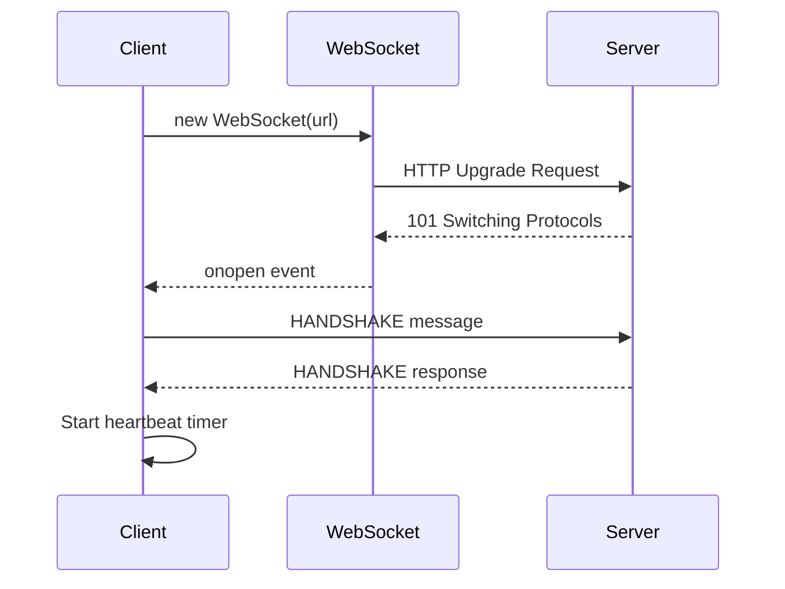
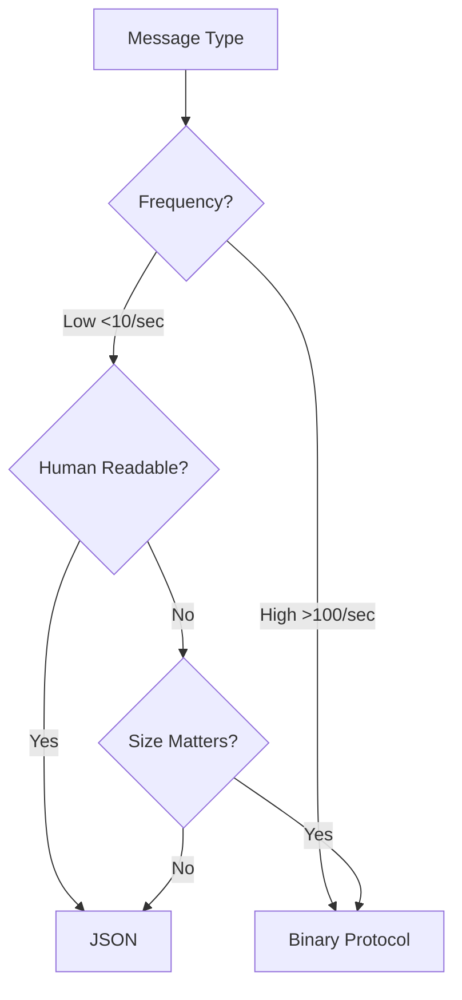
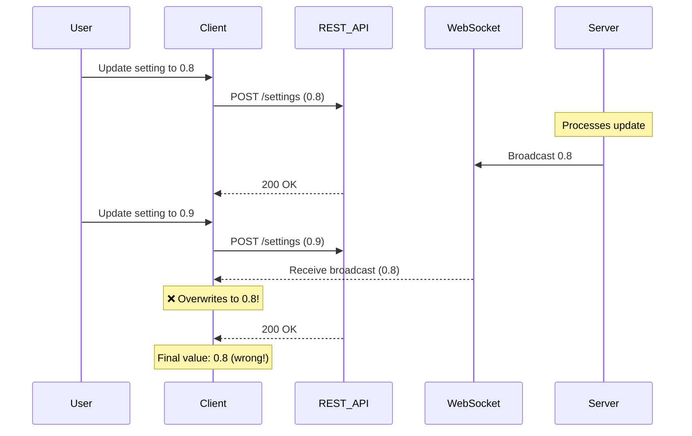

# WebSocket Best Practices for VisionFlow

**Version:** 1.0
**Last Updated:** 2025-11-05
**Audience:** Frontend & Backend Developers

---

## Overview

This guide provides best practices for implementing and maintaining WebSocket connections in VisionFlow, based on production experience and audit findings from November 2025.

**Key Topics:**
- Connection management & reconnection strategies
- Dual protocol architecture (JSON + Binary)
- Message ordering & conflict resolution
- Error handling & recovery
- Performance optimization

---

## Connection Management

### Establishing Connections



**Implementation:**

```typescript
export class WebSocketService {
  private ws: WebSocket | null = null;
  private config = {
    reconnect: {
      maxAttempts: 10,
      baseDelay: 1000,      // 1 second
      maxDelay: 30000,      // 30 seconds
      backoffFactor: 2
    },
    heartbeat: {
      interval: 30000,      // 30 seconds
      timeout: 10000        // 10 seconds
    },
    compression: true,
    binaryProtocol: true
  };

  connect(url: string): void {
    this.ws = new WebSocket(url);

    this.ws.onopen = () => {
      console.log('[WS] Connected');
      this.sendHandshake();
      this.startHeartbeat();
      this.reconnectAttempts = 0;
    };

    this.ws.onclose = (event) => {
      console.log('[WS] Disconnected:', event.code, event.reason);
      this.stopHeartbeat();
      this.scheduleReconnect();
    };

    this.ws.onerror = (error) => {
      console.error('[WS] Error:', error);
      // Connection will close, triggering onclose
    };

    this.ws.onmessage = (event) => {
      this.handleMessage(event);
    };
  }
}
```

---

### Exponential Backoff Reconnection

**✅ DO:** Implement exponential backoff to avoid overwhelming the server

```typescript
private scheduleReconnect(): void {
  if (this.reconnectAttempts >= this.config.reconnect.maxAttempts) {
    console.error('[WS] Max reconnection attempts reached');
    this.emit('max_reconnects_reached');
    return;
  }

  this.reconnectAttempts++;
  const delay = Math.min(
    this.config.reconnect.baseDelay * Math.pow(this.config.reconnect.backoffFactor, this.reconnectAttempts - 1),
    this.config.reconnect.maxDelay
  );

  console.log(`[WS] Reconnecting in ${delay}ms (attempt ${this.reconnectAttempts})`);

  this.reconnectTimer = setTimeout(() => {
    this.connect(this.lastUrl);
  }, delay);
}
```

**Reconnection Timeline:**
```
Attempt 1: 1s delay
Attempt 2: 2s delay
Attempt 3: 4s delay
Attempt 4: 8s delay
Attempt 5: 16s delay
Attempt 6: 30s delay (max)
...
Attempt 10: 30s delay (final attempt)
```

**❌ DON'T:** Reconnect immediately without backoff
```typescript
// BAD: Creates connection storm
this.ws.onclose = () => {
  this.connect(url);  // Immediate reconnection
};
```

---

### Heartbeat / Keepalive

**✅ DO:** Implement bidirectional heartbeats to detect dead connections

```typescript
private startHeartbeat(): void {
  this.heartbeatTimer = setInterval(() => {
    if (this.ws?.readyState === WebSocket.OPEN) {
      this.send({ type: MessageType.HEARTBEAT, timestamp: Date.now() });

      // Start timeout timer
      this.heartbeatTimeout = setTimeout(() => {
        console.warn('[WS] Heartbeat timeout, closing connection');
        this.ws?.close();
      }, this.config.heartbeat.timeout);
    }
  }, this.config.heartbeat.interval);
}

private handleHeartbeatResponse(): void {
  // Server responded, clear timeout
  if (this.heartbeatTimeout) {
    clearTimeout(this.heartbeatTimeout);
    this.heartbeatTimeout = null;
  }
}
```

**Why Needed:**
- Detects half-open connections (one side thinks connection is alive)
- Mobile browsers may suspend connections
- Proxy servers may timeout idle connections
- Network failures may not trigger immediate close events

---

## Dual Protocol Architecture

### When to Use JSON vs Binary



**Use JSON for:**
- ✅ Control messages (infrequent)
- ✅ Settings updates
- ✅ Analysis results (complex structure)
- ✅ Debugging (human-readable)

**Use Binary for:**
- ✅ Real-time position updates (>100/sec)
- ✅ Agent states (high-frequency)
- ✅ Voice data streams
- ✅ Large numeric arrays

---

### JSON Message Pattern

```typescript
interface BaseWebSocketMessage {
  type: string;
  timestamp: number;
  clientId?: string;
  sessionId?: string;
}

interface WorkspaceUpdateMessage extends BaseWebSocketMessage {
  type: 'workspace_update';
  data: {
    workspaceId: string;
    operation: 'create' | 'update' | 'delete';
    changes: Record<string, any>;
  };
}

// Sending JSON
const message: WorkspaceUpdateMessage = {
  type: 'workspace_update',
  timestamp: Date.now(),
  data: {
    workspaceId: 'ws_123',
    operation: 'update',
    changes: { name: 'New Name' }
  }
};

ws.send(JSON.stringify(message));

// Receiving JSON
ws.onmessage = (event) => {
  if (typeof event.data === 'string') {
    const message = JSON.parse(event.data) as BaseWebSocketMessage;
    handleJsonMessage(message);
  }
};
```

---

### Binary Message Pattern

**Message Structure:**

```
┌─────────────┬────────────────┬─────────────┐
│ Header      │ Type-Specific  │ Payload     │
│ (4 bytes)   │ Header         │ (variable)  │
└─────────────┴────────────────┴─────────────┘

Header:
Byte 0:    Message Type (MessageType enum)
Byte 1:    Protocol Version (1 or 2)
Bytes 2-3: Payload Length (uint16, little-endian)
```

**Position Update (21 bytes):**
```typescript
export function encodePositionUpdate(agentId: number, position: Vector3, timestamp: number): ArrayBuffer {
  const buffer = new ArrayBuffer(21);
  const view = new DataView(buffer);

  view.setUint32(0, agentId, true);        // little-endian
  view.setFloat32(4, position.x, true);
  view.setFloat32(8, position.y, true);
  view.setFloat32(12, position.z, true);
  view.setUint32(16, timestamp, true);
  view.setUint8(20, 0);  // flags

  return buffer;
}

export function decodePositionUpdate(buffer: ArrayBuffer): PositionUpdate {
  const view = new DataView(buffer);

  return {
    agentId: view.getUint32(0, true),
    position: {
      x: view.getFloat32(4, true),
      y: view.getFloat32(8, true),
      z: view.getFloat32(12, true)
    },
    timestamp: view.getUint32(16, true),
    flags: view.getUint8(20)
  };
}
```

**Sending Binary:**
```typescript
const buffer = encodePositionUpdate(agentId, position, Date.now());
ws.send(buffer);
```

**Receiving Binary:**
```typescript
ws.onmessage = (event) => {
  if (event.data instanceof ArrayBuffer) {
    const update = decodePositionUpdate(event.data);
    handlePositionUpdate(update);
  }
};
```

**Performance Comparison:**

| Format | Size | Encoding Time | Bandwidth Savings |
|--------|------|---------------|-------------------|
| JSON | ~150 bytes | ~0.1ms | Baseline |
| Binary V2 | 21 bytes | ~0.01ms | **7:1 reduction** |

---

## Message Ordering & Conflict Resolution

### Problem: Race Conditions



### Solution: Timestamp-Based Conflict Resolution

```typescript
interface SettingsBroadcastMessage {
  type: 'SettingChanged';
  key: string;
  value: unknown;
  timestamp: number;  // ← Server timestamp
}

// Track local timestamps
const settingTimestamps = new Map<string, number>();

const handleMessage = (message: SettingsBroadcastMessage) => {
  const localTimestamp = settingTimestamps.get(message.key);

  // Only apply if remote change is newer
  if (localTimestamp && localTimestamp > message.timestamp) {
    console.log(`[SettingsWS] Ignoring stale update for ${message.key}`);
    return;
  }

  // Apply remote change
  updateSetting(message.key, message.value);
  settingTimestamps.set(message.key, message.timestamp);
};

// When making local changes
const updateSettingLocally = (key: string, value: unknown) => {
  const timestamp = Date.now();
  settingTimestamps.set(key, timestamp);

  // Send to server
  api.updateSetting(key, value, timestamp);
};
```

**✅ Result:** User's most recent changes always win, even with network delays.

---

## Error Handling & Recovery

### JSON Parse Errors

**✅ DO:** Handle parse errors gracefully with recovery

```typescript
ws.onmessage = (event) => {
  if (typeof event.data !== 'string') return;

  try {
    const message: BaseWebSocketMessage = JSON.parse(event.data);
    handleMessage(message);
    setLastUpdate(new Date());
    parseErrorCount = 0;  // Reset on success
  } catch (error) {
    console.error('[WS] Failed to parse message:', error);

    // Log for debugging
    logger.error('WebSocket parse error', {
      error: error.message,
      rawData: event.data.substring(0, 100),  // First 100 chars
      timestamp: Date.now()
    });

    // Report to error tracking
    if (window.Sentry) {
      window.Sentry.captureException(error, {
        tags: { component: 'WebSocket' },
        extra: { rawMessage: event.data }
      });
    }

    // Request full state reload if errors persist
    parseErrorCount++;
    if (parseErrorCount > 3) {
      console.warn('[WS] Too many parse errors, requesting full state reload');
      requestFullStateReload();
      parseErrorCount = 0;
    }
  }
};
```

**❌ DON'T:** Silently ignore parse errors
```typescript
// BAD: Message lost, no recovery
ws.onmessage = (event) => {
  try {
    const message = JSON.parse(event.data);
    handleMessage(message);
  } catch (error) {
    // Silent failure - bad!
  }
};
```

---

### Connection State Management

**✅ DO:** Track connection state explicitly

```typescript
enum ConnectionState {
  DISCONNECTED = 'disconnected',
  CONNECTING = 'connecting',
  CONNECTED = 'connected',
  RECONNECTING = 'reconnecting',
  FAILED = 'failed'
}

class WebSocketService {
  private state: ConnectionState = ConnectionState.DISCONNECTED;

  connect(url: string): void {
    this.setState(ConnectionState.CONNECTING);
    this.ws = new WebSocket(url);

    this.ws.onopen = () => {
      this.setState(ConnectionState.CONNECTED);
    };

    this.ws.onclose = () => {
      if (this.reconnectAttempts < this.config.reconnect.maxAttempts) {
        this.setState(ConnectionState.RECONNECTING);
        this.scheduleReconnect();
      } else {
        this.setState(ConnectionState.FAILED);
      }
    };
  }

  private setState(newState: ConnectionState): void {
    const oldState = this.state;
    this.state = newState;
    this.emit('state_change', { oldState, newState });
  }

  getState(): ConnectionState {
    return this.state;
  }
}
```

**UI Integration:**
```tsx
export const WebSocketStatus: React.FC = () => {
  const { state } = useWebSocketService();

  return (
    <div className="ws-status">
      <StatusIndicator state={state} />
      {state === 'reconnecting' && <span>Reconnecting...</span>}
      {state === 'failed' && <button onClick={reconnect}>Retry</button>}
    </div>
  );
};
```

---

### Message Queue for Offline Messages

**✅ DO:** Queue messages when disconnected

```typescript
class WebSocketService {
  private messageQueue: Array<string | ArrayBuffer> = [];
  private maxQueueSize = 100;

  send(data: string | ArrayBuffer): void {
    if (this.ws?.readyState === WebSocket.OPEN) {
      this.ws.send(data);
    } else {
      // Queue for later
      if (this.messageQueue.length < this.maxQueueSize) {
        this.messageQueue.push(data);
        console.log(`[WS] Queued message (${this.messageQueue.length} in queue)`);
      } else {
        console.warn('[WS] Message queue full, dropping message');
      }
    }
  }

  private onConnected(): void {
    console.log(`[WS] Connected, sending ${this.messageQueue.length} queued messages`);

    while (this.messageQueue.length > 0) {
      const message = this.messageQueue.shift()!;
      this.ws!.send(message);
    }
  }
}
```

---

## Protocol Version Negotiation

### Handshake Pattern

**✅ DO:** Negotiate protocol version during handshake

```typescript
// Client sends supported versions
const handshake = {
  type: MessageType.HANDSHAKE,
  version: PROTOCOL_VERSION,
  supportedVersions: [1, 2],
  clientId: generateClientId(),
  capabilities: ['compression', 'binary', 'delta_updates']
};

ws.send(JSON.stringify(handshake));

// Server responds with selected version
interface HandshakeResponse {
  type: MessageType.HANDSHAKE;
  selectedVersion: number;
  serverId: string;
  serverFeatures: string[];
}

ws.onmessage = (event) => {
  const response: HandshakeResponse = JSON.parse(event.data);

  if (response.type === MessageType.HANDSHAKE) {
    this.protocolVersion = response.selectedVersion;
    console.log(`[WS] Using protocol version ${this.protocolVersion}`);

    // Enable features based on negotiation
    this.enabledFeatures = response.serverFeatures;
  }
};
```

---

## Performance Optimization

### Batch Updates

**✅ DO:** Batch multiple updates into single message

```typescript
// Before: 3 separate messages
ws.send(JSON.stringify({ type: 'SettingChanged', key: 'damping', value: 0.8 }));
ws.send(JSON.stringify({ type: 'SettingChanged', key: 'spring', value: 1.0 }));
ws.send(JSON.stringify({ type: 'SettingChanged', key: 'repulsion', value: 1.5 }));

// After: 1 batched message
ws.send(JSON.stringify({
  type: 'SettingsBatchChanged',
  changes: [
    { key: 'damping', value: 0.8 },
    { key: 'spring', value: 1.0 },
    { key: 'repulsion', value: 1.5 }
  ],
  timestamp: Date.now()
}));
```

**Impact:** 3x fewer messages, reduced latency, better throughput

---

### Compression

**✅ DO:** Enable WebSocket compression when available

```typescript
// Server-side (Rust with tungstenite)
let ws_config = WebSocketConfig {
    max_frame_size: Some(16 << 20),  // 16 MB
    accept_unmasked_frames: false,
    compression: Some(CompressionConfig::default()),  // ← Enable compression
};

// Client-side (automatic if server supports)
// Check in dev tools: Network → WS → Frames → "permessage-deflate"
```

**Compression Ratios:**
- JSON messages: 2-4x compression
- Binary messages: Minimal (already optimized)

---

### Throttling High-Frequency Updates

**✅ DO:** Throttle position updates to match frame rate

```typescript
class PositionUpdateThrottler {
  private lastSent = 0;
  private minInterval = 16;  // 60 FPS max

  sendPositionUpdate(agentId: number, position: Vector3): void {
    const now = Date.now();

    if (now - this.lastSent < this.minInterval) {
      // Skip this update
      return;
    }

    this.lastSent = now;
    const buffer = encodePositionUpdate(agentId, position, now);
    ws.send(buffer);
  }
}
```

**❌ DON'T:** Send updates on every physics tick
```typescript
// BAD: Sends 1000+ updates/sec, overwhelms network
physicsEngine.onTick((positions) => {
  positions.forEach((pos, agentId) => {
    ws.send(encodePositionUpdate(agentId, pos, Date.now()));
  });
});
```

---

## Security Best Practices

### Authentication

**✅ DO:** Authenticate WebSocket connections

```typescript
// Option 1: Token in URL (less secure, simple)
const ws = new WebSocket(`wss://api.example.com/ws?token=${authToken}`);

// Option 2: Token in handshake message (more secure)
const ws = new WebSocket('wss://api.example.com/ws');
ws.onopen = () => {
  ws.send(JSON.stringify({
    type: 'AUTH',
    token: authToken
  }));
};

// Option 3: Cookie-based (automatic)
// Server validates session cookie on upgrade
```

---

### Input Validation

**✅ DO:** Validate all incoming messages

```typescript
import { z } from 'zod';

const SettingChangedSchema = z.object({
  type: z.literal('SettingChanged'),
  key: z.string().min(1).max(200),
  value: z.unknown(),
  timestamp: z.number().positive()
});

ws.onmessage = (event) => {
  try {
    const raw = JSON.parse(event.data);
    const message = SettingChangedSchema.parse(raw);  // Validates structure
    handleMessage(message);
  } catch (error) {
    console.error('[WS] Invalid message:', error);
  }
};
```

---

## Testing

### Unit Tests

```typescript
describe('WebSocketService', () => {
  let ws: WebSocketService;
  let mockServer: MockWebSocketServer;

  beforeEach(() => {
    mockServer = new MockWebSocketServer('ws://localhost:8080');
    ws = new WebSocketService();
  });

  it('should reconnect with exponential backoff', async () => {
    ws.connect('ws://localhost:8080');
    mockServer.close();

    const delays = [];
    ws.on('reconnect_scheduled', (delay) => delays.push(delay));

    await waitFor(() => delays.length === 3);
    expect(delays).toEqual([1000, 2000, 4000]);
  });

  it('should queue messages when disconnected', () => {
    ws.connect('ws://localhost:8080');
    mockServer.close();

    ws.send('message1');
    ws.send('message2');

    expect(ws.getQueueSize()).toBe(2);

    mockServer.open();
    expect(mockServer.receivedMessages).toEqual(['message1', 'message2']);
  });
});
```

---

## Related Documentation

- [Binary Protocol Specification](../../reference/binary-websocket.md)
- [JSON Serialization Patterns](./json-serialization-patterns.md)
- [WebSocket Protocol Architecture](../../../architecture/protocols/websocket.md)
- [API Reference](../../reference/api/03-websocket.md)

---

## Checklist

### Implementation Checklist

- [ ] Exponential backoff reconnection implemented
- [ ] Heartbeat mechanism implemented (30s interval)
- [ ] JSON and Binary message handlers separated
- [ ] Message queue for offline messages
- [ ] Connection state tracking & UI indicator
- [ ] Timestamp-based conflict resolution
- [ ] JSON parse error handling with recovery
- [ ] Protocol version negotiation in handshake
- [ ] Input validation on all messages
- [ ] Throttling for high-frequency updates
- [ ] Compression enabled (server + client)
- [ ] Authentication mechanism implemented
- [ ] Error reporting to telemetry
- [ ] Unit tests for reconnection logic
- [ ] Integration tests with mock server

---

**Status:** Production Best Practices (validated November 2025)
