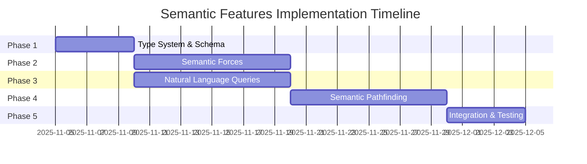

# Semantic Features Implementation Guide

**Version:** 1.0
**Last Updated:** 2025-11-05
**Status:** Implementation Roadmap
**Estimated Effort:** 6 weeks
**Priority:** High
**Risk Level:** Medium

---

## Executive Summary

This guide provides the complete implementation roadmap for integrating three major semantic intelligence features into VisionFlow:

1. **Semantic Forces** - GPU-accelerated physics with semantic meaning
2. **Typed Ontology System** - Schema-aware nodes and edges with natural language queries
3. **Intelligent Pathfinding** - Query-guided and LLM-assisted graph traversal

**Expected Impact:**
- 10x more intuitive graph layouts (semantic forces)
- Natural language graph interaction (LLM integration)
- 5x more relevant pathfinding results (semantic SSSP)

---

## Implementation Phases



---

## Phase 1: Type System & Schema (Week 1)

**Duration:** 5 days
**Priority:** CRITICAL (foundation for all other features)

### Goals

- Add NodeType/EdgeType enumerations to models
- Migrate Neo4j schema to include types
- Implement SchemaService for schema extraction
- Add schema API endpoints
- Test type system

### Tasks

#### Day 1: Data Model Updates

**Task 1.1:** Update graph models
- [ ] File: `src/models/graph_models.rs`
- [ ] Add `NodeType` enum (9 variants)
- [ ] Add `EdgeType` enum (7 variants)
- [ ] Add `SemanticForceConfig` struct
- [ ] Add `SemanticForceType` enum (5 variants)
- [ ] Update serialization derives

**Code Reference:**
```rust
#[derive(Debug, Clone, Serialize, Deserialize, PartialEq)]
pub enum NodeType {
    Generic, Person, Organization, Project,
    Task, Concept, Class, Individual, Custom(String),
}
```

---

**Task 1.2:** Update Neo4j models
- [ ] File: `src/models/neo4j_models.rs`
- [ ] Add `node_type: NodeType` to `Neo4jNode`
- [ ] Add `semantic_weight: f32` to `Neo4jNode`
- [ ] Add `hierarchy_level: Option<i32>` to `Neo4jNode`
- [ ] Add `edge_type: EdgeType` to `Neo4jEdge`
- [ ] Add `semantic_strength: f32` to `Neo4jEdge`

---

#### Day 2-3: Schema Service Implementation

**Task 1.3:** Create SchemaService
- [ ] File: `src/services/schema_service.rs`
- [ ] Implement `SchemaService` struct
- [ ] Implement `extract_schema()` method
- [ ] Implement `extract_node_types()` method
- [ ] Implement `extract_edge_types()` method
- [ ] Implement `extract_properties()` method
- [ ] Add schema caching with `Arc<RwLock<Option<GraphSchema>>>`

**Cypher Queries:**
```cypher
// Node types query
MATCH (n)
WITH DISTINCT labels(n) AS labels, COUNT(n) AS count
UNWIND labels AS label
RETURN label, count

// Edge types query
MATCH ()-[r]->()
WITH type(r) AS rel_type, COUNT(r) AS count
RETURN rel_type, count
```

---

**Task 1.4:** Implement LLM context formatting
- [ ] Add `get_llm_context()` method
- [ ] Add `format_node_types()` helper
- [ ] Add `format_edge_types()` helper
- [ ] Add `format_properties()` helper
- [ ] Format output for LLM consumption

---

#### Day 4: API Endpoints

**Task 1.5:** Create schema handler
- [ ] File: `src/handlers/schema_handler.rs`
- [ ] Implement `get_schema()` endpoint (GET /api/schema)
- [ ] Implement `refresh_schema()` endpoint (POST /api/schema/refresh)
- [ ] Implement `get_llm_context()` endpoint (GET /api/schema/llm-context)
- [ ] Add error handling

**Task 1.6:** Register routes
- [ ] Update `src/main.rs` or routing configuration
- [ ] Add schema routes to service config
- [ ] Test endpoint accessibility

---

#### Day 5: Testing & Validation

**Task 1.7:** Unit tests
- [ ] Test `NodeType` serialization/deserialization
- [ ] Test `EdgeType` serialization/deserialization
- [ ] Test schema extraction with mock data
- [ ] Test LLM context formatting

**Task 1.8:** Integration tests
- [ ] Test schema extraction from Neo4j
- [ ] Test schema caching
- [ ] Test API endpoints
- [ ] Verify LLM context quality

---

### Deliverables

- [ ] Updated data models with type system
- [ ] Functional SchemaService
- [ ] Schema API endpoints (3 total)
- [ ] Unit tests (>80% coverage)
- [ ] Integration tests
- [ ] Documentation update

---

## Phase 2: Semantic Forces (Week 2-3)

**Duration:** 10 days
**Priority:** HIGH

### Goals

- Implement CUDA kernels for semantic forces
- Create SemanticPhysicsEngine wrapper
- Add HierarchyCalculator
- Implement API endpoints
- Add frontend controls
- Test and tune forces

### Tasks

#### Day 6-7: CUDA Kernel Implementation

**Task 2.1:** DAG Layout Kernel
- [ ] File: `src/gpu/kernels/semantic_forces.cu`
- [ ] Implement `apply_dag_force()` kernel
- [ ] Support 3 layout modes (top-down, radial, left-right)
- [ ] Handle hierarchy level positioning
- [ ] Add configurable strength and level_distance

---

**Task 2.2:** Type Clustering Kernel
- [ ] Implement `apply_type_clustering()` kernel
- [ ] Calculate attraction to type cluster centers
- [ ] Apply reduced repulsion for same-type nodes
- [ ] Add configurable clustering parameters

---

**Task 2.3:** Collision Detection Kernel
- [ ] Implement `apply_collision_force()` kernel
- [ ] Calculate node overlap based on radii
- [ ] Apply repulsion proportional to overlap
- [ ] Optimize with spatial partitioning (optional)

---

**Task 2.4:** Attribute-Weighted Springs Kernel
- [ ] Implement `apply_attribute_weighted_springs()` kernel
- [ ] Modify spring forces by semantic strength
- [ ] Use atomic operations for velocity updates
- [ ] Handle edge weight modifications

---

#### Day 8-9: Rust Backend Implementation

**Task 2.5:** Create SemanticPhysicsEngine
- [ ] File: `src/gpu/semantic_physics.rs`
- [ ] Implement `SemanticPhysicsEngine` struct
- [ ] Implement `apply_semantic_forces()` method
- [ ] Add force configuration management
- [ ] Integrate with GPU context
- [ ] Add error handling

---

**Task 2.6:** Implement HierarchyCalculator
- [ ] File: `src/gpu/hierarchy_calculator.rs`
- [ ] Implement `HierarchyCalculator` struct
- [ ] Implement `calculate_levels()` method
- [ ] Add cycle detection (DAG validation)
- [ ] Implement topological sort with BFS
- [ ] Add result caching

**Algorithm Steps:**
1. Build directed graph from edges
2. Detect cycles → return error if found
3. Calculate in-degrees
4. BFS with level assignment: `level = max(parent_levels) + 1`
5. Cache results

---

#### Day 10-11: API & Handler

**Task 2.7:** Create semantic forces handler
- [ ] File: `src/handlers/semantic_forces_handler.rs`
- [ ] Implement `configure_semantic_force()` (POST /api/semantic-forces/configure)
- [ ] Implement `get_semantic_force_status()` (GET /api/semantic-forces/status)
- [ ] Implement `calculate_hierarchy()` (POST /api/semantic-forces/hierarchy)
- [ ] Add request/response models
- [ ] Add validation

---

#### Day 12-13: Frontend Integration

**Task 2.8:** Create SemanticForceControls component
- [ ] File: `client/src/features/physics/components/SemanticForceControls.tsx`
- [ ] Add DAG layout toggle (3 modes)
- [ ] Add type clustering toggle
- [ ] Add collision detection toggle
- [ ] Add attribute weighting controls
- [ ] Add hierarchy calculation button

**Task 2.9:** Create TypeScript API client
- [ ] File: `client/src/api/semanticForces.ts`
- [ ] Add `configure()` method
- [ ] Add `getStatus()` method
- [ ] Add `calculateHierarchy()` method
- [ ] Add TypeScript interfaces

---

#### Day 14-15: Testing & Tuning

**Task 2.10:** Unit tests
- [ ] Test each CUDA kernel independently
- [ ] Test HierarchyCalculator with various graphs
- [ ] Test SemanticPhysicsEngine orchestration
- [ ] Test API endpoints

**Task 2.11:** Integration tests
- [ ] Test end-to-end force application
- [ ] Test frontend-backend integration
- [ ] Test with various graph topologies
- [ ] Performance benchmarks

**Task 2.12:** Parameter tuning
- [ ] Tune DAG layout spacing
- [ ] Tune clustering strengths
- [ ] Tune collision parameters
- [ ] Create preset configurations

---

### Deliverables

- [ ] 4 CUDA kernels implemented
- [ ] SemanticPhysicsEngine operational
- [ ] HierarchyCalculator with caching
- [ ] 3 API endpoints
- [ ] Frontend controls
- [ ] Test suite (unit + integration)
- [ ] Performance benchmarks
- [ ] Documentation

---

## Phase 3: Natural Language Queries (Week 3-4)

**Duration:** 10 days (overlaps with Phase 2)
**Priority:** HIGH

### Goals

- Implement LLMService for Cypher generation
- Add natural language query handler
- Create frontend query interface
- Test with various query types
- Optimize prompt engineering

### Tasks

#### Day 8-9: LLM Service Implementation

**Task 3.1:** Create LLM provider abstraction
- [ ] File: `src/services/llm_service.rs`
- [ ] Define `LLMProvider` trait
- [ ] Implement `OpenAIProvider`
- [ ] Implement `AnthropicProvider`
- [ ] Add provider registry

---

**Task 3.2:** Implement Cypher generation
- [ ] Add `LLMService::generate_cypher()` method
- [ ] Implement prompt construction
- [ ] Add Cypher extraction from markdown
- [ ] Add error handling
- [ ] Add retry logic

---

#### Day 10-11: Query Handler

**Task 3.3:** Create natural language query handler
- [ ] File: `src/handlers/nl_query_handler.rs`
- [ ] Implement `handle_nl_query()` (POST /api/nl-query)
- [ ] Integrate SchemaService for context
- [ ] Integrate LLMService for translation
- [ ] Execute Cypher on Neo4j
- [ ] Calculate confidence scores

---

**Task 3.4:** Add security validation
- [ ] Implement `validate_cypher_query()` function
- [ ] Block dangerous operations (DELETE, CREATE, etc.)
- [ ] Ensure read-only queries
- [ ] Add rate limiting

---

#### Day 12-13: Frontend Implementation

**Task 3.5:** Create NaturalLanguageQuery component
- [ ] File: `client/src/features/query/components/NaturalLanguageQuery.tsx`
- [ ] Add query textarea
- [ ] Add submit button
- [ ] Add results display
- [ ] Show generated Cypher
- [ ] Show confidence score
- [ ] Add loading states

---

**Task 3.6:** Create TypeScript API
- [ ] File: `client/src/api/nlQuery.ts`
- [ ] Add `executeQuery()` method
- [ ] Add TypeScript interfaces
- [ ] Add error handling

---

#### Day 14-15: Testing & Optimization

**Task 3.7:** Test query types
- [ ] Test simple node queries
- [ ] Test relationship queries
- [ ] Test aggregation queries
- [ ] Test complex multi-hop queries
- [ ] Test edge cases

---

**Task 3.8:** Prompt engineering optimization
- [ ] Optimize schema context format
- [ ] Add few-shot examples
- [ ] Improve Cypher extraction
- [ ] Test with multiple LLM providers

---

**Task 3.9:** Integration tests
- [ ] Test end-to-end query pipeline
- [ ] Test with real Neo4j database
- [ ] Test error scenarios
- [ ] Performance testing

---

### Deliverables

- [ ] LLMService with 2+ providers
- [ ] NL query handler
- [ ] Security validation
- [ ] Rate limiting
- [ ] Frontend query interface
- [ ] Test suite
- [ ] Prompt templates
- [ ] Documentation

---

## Phase 4: Semantic Pathfinding (Week 4-5)

**Duration:** 10 days
**Priority:** HIGH

### Goals

- Enhance SSSP with semantic weighting
- Implement QueryTraversal algorithm
- Implement ChunkTraversal algorithm
- Add LLM-guided traversal (optional)
- Create pathfinding API
- Add frontend pathfinder UI
- Performance testing

### Tasks

#### Day 16-17: Semantic SSSP

**Task 4.1:** Enhance HybridSSP
- [ ] File: `src/algorithms/semantic_sssp.rs`
- [ ] Create `SemanticSSP` struct
- [ ] Implement `calculate_path()` method
- [ ] Add query embedding
- [ ] Add node similarity calculation
- [ ] Modify edge weights based on similarity
- [ ] Recalculate path with new weights

---

**Task 4.2:** Implement similarity calculator
- [ ] File: `src/services/similarity_calculator.rs`
- [ ] Add embedding generation (via API or local model)
- [ ] Add cosine similarity calculation
- [ ] Add embedding caching

---

#### Day 18-19: Query-Guided Traversal

**Task 4.3:** Implement QueryTraversal
- [ ] File: `src/algorithms/query_traversal.rs`
- [ ] Create `QueryTraversal` struct
- [ ] Implement `traverse()` method
- [ ] Add neighbor similarity scoring
- [ ] Add greedy best-first search
- [ ] Add content extraction
- [ ] Add termination conditions

---

#### Day 20: Chunk Traversal (Optional)

**Task 4.4:** Implement ChunkTraversal
- [ ] File: `src/algorithms/chunk_traversal.rs`
- [ ] Create `ChunkTraversal` struct
- [ ] Optimize for document chunks
- [ ] Add chunk ordering logic
- [ ] Add parent document context

---

#### Day 21: LLM-Guided Traversal (Optional)

**Task 4.5:** Implement LLM-guided pathfinding
- [ ] File: `src/algorithms/llm_traversal.rs`
- [ ] Create `LLMTraversal` struct
- [ ] Integrate LLMService for decision-making
- [ ] Add reasoning step tracking
- [ ] Add termination logic

---

#### Day 22-23: API & Handler

**Task 4.6:** Create semantic pathfinding handler
- [ ] File: `src/handlers/semantic_pathfinding_handler.rs`
- [ ] Implement `find_semantic_path()` (POST /api/semantic-pathfinding/find-path)
- [ ] Support all algorithm types
- [ ] Add request validation
- [ ] Add result formatting

---

**Task 4.7:** Add path caching
- [ ] Implement `PathCache` with LRU eviction
- [ ] Cache by (source, target, query, algorithm)
- [ ] Add cache hit metrics

---

#### Day 24-25: Frontend Implementation

**Task 4.8:** Create SemanticPathfinder component
- [ ] File: `client/src/features/pathfinding/components/SemanticPathfinder.tsx`
- [ ] Add source/target inputs
- [ ] Add query textarea
- [ ] Add algorithm selector
- [ ] Add "Find Path" button
- [ ] Display path results
- [ ] Show relevance scores
- [ ] Visualize path in 3D graph

---

**Task 4.9:** Create visualization components
- [ ] PathVisualization component
- [ ] PathMetrics component
- [ ] SimilarityHeatmap component

---

### Deliverables

- [ ] SemanticSSP algorithm
- [ ] QueryTraversal algorithm
- [ ] Path caching
- [ ] API endpoints
- [ ] Frontend pathfinder UI
- [ ] Test suite
- [ ] Performance benchmarks
- [ ] Documentation

---

## Phase 5: Integration & Documentation (Week 6)

**Duration:** 5 days
**Priority:** MEDIUM

### Goals

- End-to-end testing
- Performance optimization
- Create comprehensive documentation
- User guides and examples
- Deploy and monitor

### Tasks

#### Day 26-27: End-to-End Testing

**Task 5.1:** Integration testing
- [ ] Test semantic forces in production-like environment
- [ ] Test NL queries with real user queries
- [ ] Test pathfinding with various graphs
- [ ] Test all three features together

---

**Task 5.2:** Performance testing
- [ ] Benchmark CUDA kernels
- [ ] Benchmark LLM query latency
- [ ] Benchmark pathfinding algorithms
- [ ] Identify bottlenecks
- [ ] Optimize hot paths

---

#### Day 28-29: Documentation

**Task 5.3:** User documentation
- [ ] Write semantic forces user guide
- [ ] Write NL query tutorial
- [ ] Write pathfinding user guide
- [ ] Add examples and screenshots

---

**Task 5.4:** Developer documentation
- [ ] Document CUDA kernel implementations
- [ ] Document algorithm details
- [ ] Update API reference
- [ ] Add architecture diagrams

---

**Task 5.5:** Operations documentation
- [ ] Write deployment guide
- [ ] Add monitoring setup
- [ ] Document common issues
- [ ] Create troubleshooting guide

---

#### Day 30: Deployment

**Task 5.6:** Production readiness
- [ ] Code review
- [ ] Security review
- [ ] Performance validation
- [ ] Feature flags setup
- [ ] Gradual rollout plan

---

**Task 5.7:** Monitoring
- [ ] Add metrics (latency, throughput, errors)
- [ ] Add logging
- [ ] Set up alerts
- [ ] Create dashboards

---

### Deliverables

- [ ] End-to-end test suite
- [ ] Performance benchmarks
- [ ] User guides (3)
- [ ] Developer docs
- [ ] Operations docs
- [ ] Monitoring setup
- [ ] Production deployment

---

## Testing Strategy

### Unit Tests

**Coverage Target:** >80%

```rust
// Example: Test semantic force configuration
#[test]
fn test_dag_force_configuration() {
    let config = SemanticForceConfig {
        force_type: SemanticForceType::DAGLayout,
        strength: 10.0,
        enabled: true,
        parameters: HashMap::from([
            ("direction".to_string(), json!("top_down")),
            ("level_distance".to_string(), json!(100.0)),
        ]),
    };

    assert_eq!(config.force_type, SemanticForceType::DAGLayout);
    assert_eq!(config.strength, 10.0);
    assert!(config.enabled);
}
```

---

### Integration Tests

**Test Scenarios:**

1. **Semantic Forces Integration**
   - Apply forces to test graph
   - Verify position updates
   - Validate hierarchy calculations

2. **Natural Language Query Integration**
   - Submit NL query
   - Verify Cypher generation
   - Validate results

3. **Semantic Pathfinding Integration**
   - Find path with query
   - Verify semantic weighting
   - Validate relevance scores

---

### Performance Tests

**Benchmarks:**

```rust
#[bench]
fn bench_dag_force_10k_nodes(b: &mut Bencher) {
    let nodes = generate_test_graph(10_000, 50_000);
    let engine = SemanticPhysicsEngine::new();

    b.iter(|| {
        engine.apply_semantic_forces(&nodes, &[]);
    });
}
```

**Performance Targets:**
- 100K nodes: <10ms per frame
- NL query: <3s end-to-end
- Pathfinding: <100ms for 10K nodes

---

## Risk Mitigation

### High Risks

| Risk | Probability | Impact | Mitigation |
|------|------------|--------|------------|
| CUDA kernel bugs | Medium | High | Extensive unit testing, visual validation |
| LLM API downtime | Medium | Medium | Fallback providers, graceful degradation |
| Performance issues | Low | High | Early benchmarking, profiling tools |
| Schema extraction issues | Low | Medium | Mock data testing, error handling |

---

### Dependencies

**External:**
- CUDA Toolkit 11.8+
- OpenAI API or Anthropic Claude API
- Neo4j 5.x

**Internal:**
- Existing GPU physics system
- Unified API client
- Neo4j adapter

---

## Success Criteria

### Phase 1 Success Criteria
- [ ] Type system compiles and serializes correctly
- [ ] Schema extraction works on test database
- [ ] API endpoints return valid responses
- [ ] >80% test coverage

### Phase 2 Success Criteria
- [ ] CUDA kernels produce expected force vectors
- [ ] DAG layout visually correct for hierarchical graphs
- [ ] Type clustering creates visible groupings
- [ ] Performance targets met (<10ms for 100K nodes)

### Phase 3 Success Criteria
- [ ] NL queries successfully generate valid Cypher
- [ ] 90% of test queries return expected results
- [ ] Query latency <3s end-to-end
- [ ] Security validation blocks dangerous operations

### Phase 4 Success Criteria
- [ ] Semantic paths differ meaningfully from base paths
- [ ] Query-guided traversal returns relevant nodes
- [ ] Pathfinding latency <100ms for 10K node graphs
- [ ] Relevance scores correlate with manual evaluation

### Phase 5 Success Criteria
- [ ] All integration tests pass
- [ ] Documentation complete and reviewed
- [ ] Production deployment successful
- [ ] No P0/P1 bugs in first week

---

## Related Documentation

- [Semantic Forces System](../../concepts/semantic-forces-system.md)
- [Typed Ontology System](../../explanations/ontology/ontology-typed-system.md)
- [Intelligent Pathfinding System](../../explanations/ontology/intelligent-pathfinding-system.md)
- [GPU Architecture](../../architecture/gpu/README.md)
- [Neo4j Integration Guide](./neo4j-integration.md)

---

## Implementation Checklist

### Pre-Implementation
- [ ] Review all design documents
- [ ] Set up development environment
- [ ] Create feature branch
- [ ] Plan sprint milestones

### During Implementation
- [ ] Daily progress tracking
- [ ] Code reviews after each phase
- [ ] Continuous testing
- [ ] Documentation as you go

### Post-Implementation
- [ ] Performance validation
- [ ] Security audit
- [ ] User acceptance testing
- [ ] Production deployment
- [ ] Monitoring setup
- [ ] Post-mortem review

---

**Implementation Start Date:** TBD
**Target Completion:** 6 weeks from start
**Status:** Ready for Implementation
