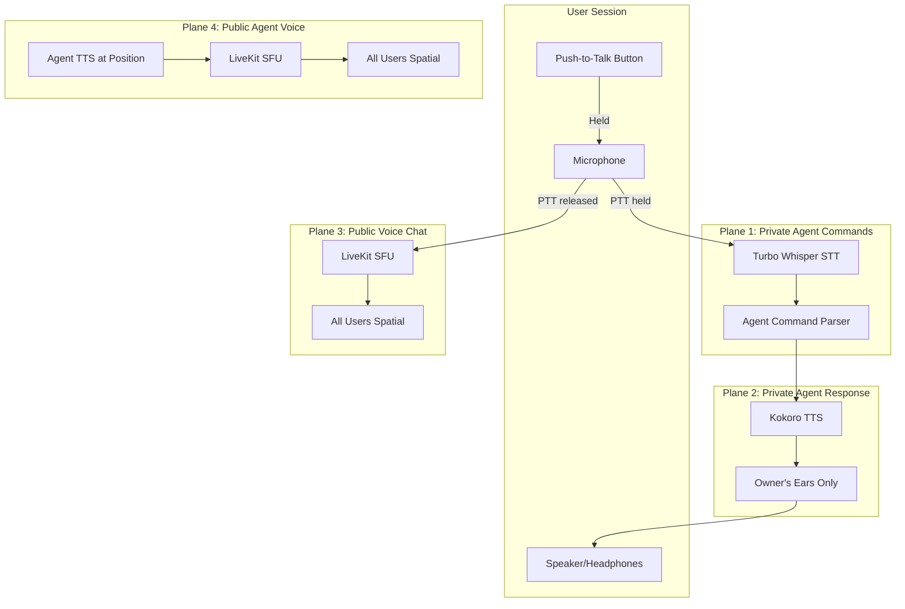

# Voice Routing

## Overview

VisionFlow's AudioRouter provides multi-user voice routing across four audio planes, enabling both private agent interaction and public spatial voice chat within the Vircadia 3D world.

Each user gets an isolated voice session with per-user broadcast channels. Push-to-talk (PTT) controls audio routing between agent commands and spatial voice chat.

## Audio Planes



| Plane | Direction | Scope | When Active |
|-------|-----------|-------|-------------|
| **1** | User mic → STT → Agent | Private (per-user) | PTT held |
| **2** | Agent → TTS → User ear | Private (per-user) | Agent responds |
| **3** | User mic → LiveKit → All users | Public (spatial) | PTT released |
| **4** | Agent TTS → LiveKit → All users | Public (spatial) | Agent configured as public |

## Push-to-Talk (PTT)

PTT determines where microphone audio is routed:

- **PTT held**: Audio routes to Plane 1 (Turbo Whisper STT for agent commands)
- **PTT released**: Audio routes to Plane 3 (LiveKit SFU for spatial voice chat)

## Per-User Voice Sessions

Each user gets an isolated `UserVoiceSession`:

```rust
pub struct UserVoiceSession {
    pub user_id: String,
    pub private_audio_tx: broadcast::Sender<Vec<u8>>,  // TTS audio for this user only
    pub transcription_tx: broadcast::Sender<String>,     // STT results for this user
    pub owned_agents: Vec<String>,                       // Agent IDs owned by user
    pub ptt_active: bool,                                // Current PTT state
    pub livekit_participant_id: Option<String>,          // LiveKit session
    pub spatial_position: [f32; 3],                      // 3D position in Vircadia
}
```

## Agent Voice Identities

Each agent has a distinct voice identity with spatial positioning:

```rust
pub struct AgentVoiceIdentity {
    pub agent_id: String,
    pub agent_type: String,
    pub owner_user_id: String,
    pub voice_id: String,        // Kokoro voice preset (e.g., "af_sarah")
    pub speed: f32,              // Speech speed multiplier
    pub position: [f32; 3],      // Agent's 3D position
    pub public_voice: bool,      // Whether all users hear this agent
}
```

### Default Voice Presets by Agent Type

| Agent Type | Voice ID | Speed | Character |
|------------|----------|-------|-----------|
| researcher | `af_sarah` | 1.0 | Clear, informative |
| coder | `am_adam` | 1.1 | Quick, technical |
| analyst | `bf_emma` | 1.0 | Measured, precise |
| optimizer | `am_michael` | 0.95 | Deliberate, methodical |
| coordinator | `af_heart` | 1.0 | Warm, collaborative |

## Setup

### Prerequisites

- LiveKit server (for spatial voice chat)
- Kokoro TTS container (for agent voice synthesis)
- Turbo Whisper STT (for speech recognition)

### Environment Variables

| Variable | Default | Description |
|----------|---------|-------------|
| `LIVEKIT_URL` | — | LiveKit server URL |
| `LIVEKIT_API_KEY` | — | LiveKit API key |
| `LIVEKIT_API_SECRET` | — | LiveKit API secret |
| `KOKORO_API_URL` | `http://kokoro-tts-container:8880` | Kokoro TTS endpoint |
| `WHISPER_API_URL` | `http://whisper-webui-backend:8000` | Whisper STT endpoint |

### Docker Compose

Add the LiveKit service to your Docker Compose:

```yaml
livekit:
  image: livekit/livekit-server:latest
  ports:
    - "7880:7880"
    - "7881:7881"
    - "7882:7882/udp"
  environment:
    - LIVEKIT_KEYS=devkey:secret
  command: --dev
```

## Integration with Vircadia XR

Voice routing integrates with Vircadia's spatial audio system:

1. User positions are synced from Vircadia World Server
2. Agent positions are set when agents are spawned in the 3D world
3. LiveKit applies HRTF spatialization based on relative positions
4. Audio volume attenuates with distance

## Related Documentation

- [Voice Integration](voice-integration.md) - TTS/STT WebSocket protocol details
- [Vircadia XR Guide](vircadia-xr-complete-guide.md) - Multi-user XR setup
- [Vircadia Multi-User Guide](vircadia-multi-user-guide.md) - Collaboration features
