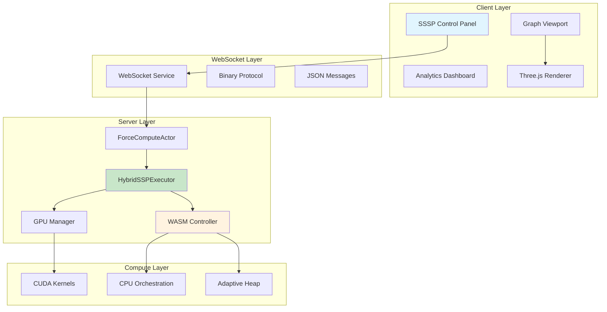

# Hybrid CPU-WASM/GPU SSSP Integration Plan

## Executive Summary

This document provides a comprehensive plan for integrating the hybrid CPU-WASM/GPU SSSP implementation with the VisionFlow WebXR system's existing graph visualization, physics simulation, client UI/UX, and real-time WebSocket communication infrastructure.

## Table of Contents

1. [System Architecture Overview](#system-architecture-overview)
2. [Phase 1: Backend Integration](#phase-1-backend-integration)
3. [Phase 2: Client-Side Integration](#phase-2-client-side-integration)
4. [Phase 3: UI/UX Enhancement](#phase-3-uiux-enhancement)
5. [Phase 4: Real-time Updates & WebSocket](#phase-4-real-time-updates--websocket)
6. [Phase 5: Performance & Visualization](#phase-5-performance--visualization)
7. [Implementation Timeline](#implementation-timeline)
8. [Risk Mitigation](#risk-mitigation)

---

## System Architecture Overview



---

## Phase 1: Backend Integration

### 1.1 ForceComputeActor Enhancement

**Location**: `/workspace/ext/src/actors/gpu/force_compute_actor.rs`

```rust
// Add to ForceComputeActor
use crate::gpu::hybrid_sssp::{HybridSSPExecutor, HybridSSPConfig};

pub struct ForceComputeActor {
    // ... existing fields ...

    /// Hybrid SSSP executor for hierarchical layout
    hybrid_sssp: Option<HybridSSPExecutor>,

    /// SSSP computation state
    sssp_state: SSPState,
}

#[derive(Default)]
struct SSPState {
    enabled: bool,
    last_computation: std::time::Instant,
    update_interval_ms: u32,  // Default: 500ms
    distances: Vec<f32>,
    source_nodes: Vec<u32>,
}

impl ForceComputeActor {
    /// Initialize hybrid SSSP if enabled
    async fn init_hybrid_sssp(&mut self) -> Result<(), String> {
        if self.simulation_params.use_hierarchical_layout {
            let config = HybridSSPConfig {
                enable_hybrid: self.gpu_state.num_nodes > 10000,
                use_pinned_memory: true,
                enable_profiling: cfg!(debug_assertions),
                ..Default::default()
            };

            let mut executor = HybridSSPExecutor::new(config);
            executor.initialize().await?;
            self.hybrid_sssp = Some(executor);

            info!("Hybrid SSSP initialized for {} nodes", self.gpu_state.num_nodes);
        }
        Ok(())
    }

    /// Compute SSSP distances for force adjustment
    async fn compute_sssp_distances(&mut self) -> Result<(), String> {
        if let Some(ref mut executor) = self.hybrid_sssp {
            let now = std::time::Instant::now();

            // Only recompute if interval has passed
            if now.duration_since(self.sssp_state.last_computation).as_millis()
                < self.sssp_state.update_interval_ms as u128 {
                return Ok(());
            }

            // Execute hybrid SSSP
            let result = executor.execute(
                self.gpu_state.num_nodes as usize,
                self.gpu_state.num_edges as usize,
                &self.sssp_state.source_nodes,
                &self.csr_row_offsets,
                &self.csr_col_indices,
                &self.csr_weights,
            ).await?;

            // Store distances for physics integration
            self.sssp_state.distances = result.distances;
            self.sssp_state.last_computation = now;

            // Log performance metrics
            if result.metrics.complexity_factor < 2.0 {
                info!("SSSP computation achieved {:.2}x theoretical complexity",
                      result.metrics.complexity_factor);
            }
        }
        Ok(())
    }
}
```

### 1.2 Physics Integration

**Location**: `/workspace/ext/src/utils/unified_gpu_compute.rs`

```rust
// Add SSSP distance integration to force computation
impl UnifiedGPUCompute {
    pub fn integrate_sssp_distances(
        &mut self,
        sssp_distances: &[f32],
    ) -> Result<(), String> {
        // Upload SSSP distances to GPU
        self.upload_sssp_distances_to_gpu(sssp_distances)?;

        // Distances will be used in force kernel to adjust spring rest lengths
        // ideal_length = base_length + alpha * |d_u - d_v|
        Ok(())
    }
}
```

### 1.3 Actor Message Handling

```rust
// New message types for SSSP control
#[derive(Message)]
#[rtype(result = "Result<(), String>")]
pub struct EnableHybridSSP {
    pub source_nodes: Vec<u32>,
    pub update_interval_ms: u32,
}

#[derive(Message)]
#[rtype(result = "SSPMetrics")]
pub struct GetSSPMetrics;

impl Handler<EnableHybridSSP> for ForceComputeActor {
    type Result = Result<(), String>;

    fn handle(&mut self, msg: EnableHybridSSP, ctx: &mut Context<Self>) -> Self::Result {
        self.sssp_state.enabled = true;
        self.sssp_state.source_nodes = msg.source_nodes;
        self.sssp_state.update_interval_ms = msg.update_interval_ms;

        // Initialize in background
        ctx.spawn(async move {
            self.init_hybrid_sssp().await
        }.into_actor(self));

        Ok(())
    }
}
```

---

## Phase 2: Client-Side Integration

### 2.1 SSSP Service Creation

**File**: `/workspace/ext/client/src/services/SSPService.ts`

```typescript
// SSSP Service for managing hierarchical layout computation
export class SSPService {
    private ws: WebSocketService;
    private enabled: boolean = false;
    private metrics: SSPMetrics | null = null;
    private updateCallbacks: Set<(metrics: SSPMetrics) => void> = new Set();

    constructor(ws: WebSocketService) {
        this.ws = ws;
        this.setupMessageHandlers();
    }

    private setupMessageHandlers() {
        this.ws.addMessageHandler('sssp_metrics', (data: SSPMetrics) => {
            this.metrics = data;
            this.notifyCallbacks(data);
        });
    }

    public async enableHybridSSP(
        sourceNodes: number[],
        updateInterval: number = 500
    ): Promise<void> {
        await this.ws.send({
            type: 'enable_hybrid_sssp',
            payload: {
                source_nodes: sourceNodes,
                update_interval_ms: updateInterval,
            }
        });
        this.enabled = true;
    }

    public async disableSSP(): Promise<void> {
        await this.ws.send({
            type: 'disable_sssp',
        });
        this.enabled = false;
    }

    public onMetricsUpdate(callback: (metrics: SSPMetrics) => void) {
        this.updateCallbacks.add(callback);
        return () => this.updateCallbacks.delete(callback);
    }

    private notifyCallbacks(metrics: SSPMetrics) {
        this.updateCallbacks.forEach(cb => cb(metrics));
    }

    public getMetrics(): SSPMetrics | null {
        return this.metrics;
    }

    public isEnabled(): boolean {
        return this.enabled;
    }
}

interface SSPMetrics {
    total_time_ms: number;
    cpu_time_ms: number;
    gpu_time_ms: number;
    transfer_time_ms: number;
    recursion_levels: number;
    total_relaxations: number;
    pivots_selected: number;
    complexity_factor: number;
}
```

### 2.2 React Hook for SSSP

**File**: `/workspace/ext/client/src/hooks/useSSP.ts`

```typescript
import { useState, useEffect, useCallback } from 'react';
import { useWebSocket } from './useWebSocket';
import { SSPService } from '../services/SSPService';

export function useSSP() {
    const { ws } = useWebSocket();
    const [service] = useState(() => new SSPService(ws));
    const [metrics, setMetrics] = useState<SSPMetrics | null>(null);
    const [enabled, setEnabled] = useState(false);

    useEffect(() => {
        const unsubscribe = service.onMetricsUpdate(setMetrics);
        return unsubscribe;
    }, [service]);

    const enableHierarchicalLayout = useCallback(async (
        sourceNodes?: number[]
    ) => {
        const sources = sourceNodes || [0]; // Default to node 0
        await service.enableHybridSSP(sources);
        setEnabled(true);
    }, [service]);

    const disableHierarchicalLayout = useCallback(async () => {
        await service.disableSSP();
        setEnabled(false);
    }, [service]);

    return {
        enabled,
        metrics,
        enableHierarchicalLayout,
        disableHierarchicalLayout,
    };
}
```

---

## Phase 3: UI/UX Enhancement

### 3.1 SSSP Control Panel Component

**File**: `/workspace/ext/client/src/features/analytics/components/HybridSSPPanel.tsx`

```tsx
import React, { useState, useCallback } from 'react';
import { useSSP } from '../../../hooks/useSSP';
import { Button } from '../../design-system/components/Button';
import { Switch } from '../../design-system/components/Switch';
import { Progress } from '../../design-system/components/Progress';
import { Badge } from '../../design-system/components/Badge';
import { Card } from '../../design-system/components/Card';
import { Tabs } from '../../design-system/components/Tabs';

export const HybridSSPPanel: React.FC = () => {
    const { enabled, metrics, enableHierarchicalLayout, disableHierarchicalLayout } = useSSP();
    const [selectedNodes, setSelectedNodes] = useState<number[]>([]);
    const [updateInterval, setUpdateInterval] = useState(500);

    const handleToggle = useCallback(async () => {
        if (enabled) {
            await disableHierarchicalLayout();
        } else {
            await enableHierarchicalLayout(selectedNodes.length > 0 ? selectedNodes : undefined);
        }
    }, [enabled, selectedNodes, enableHierarchicalLayout, disableHierarchicalLayout]);

    const getComplexityColor = (factor: number) => {
        if (factor < 1.5) return 'text-green-500';
        if (factor < 2.5) return 'text-yellow-500';
        return 'text-red-500';
    };

    return (
        <Card className="p-4">
            <div className="space-y-4">
                {/* Header */}
                <div className="flex items-center justify-between">
                    <h3 className="text-lg font-semibold">Hierarchical Layout (SSSP)</h3>
                    <Switch
                        checked={enabled}
                        onCheckedChange={handleToggle}
                        aria-label="Toggle hierarchical layout"
                    />
                </div>

                {/* Status Badge */}
                <div className="flex items-center gap-2">
                    <Badge variant={enabled ? 'success' : 'secondary'}>
                        {enabled ? 'Active' : 'Inactive'}
                    </Badge>
                    {enabled && metrics && (
                        <Badge variant="outline">
                            Complexity: <span className={getComplexityColor(metrics.complexity_factor)}>
                                {metrics.complexity_factor.toFixed(2)}x
                            </span>
                        </Badge>
                    )}
                </div>

                {/* Configuration */}
                {!enabled && (
                    <div className="space-y-2">
                        <label className="text-sm font-medium">Update Interval (ms)</label>
                        <input
                            type="range"
                            min="100"
                            max="2000"
                            step="100"
                            value={updateInterval}
                            onChange={(e) => setUpdateInterval(Number(e.target.value))}
                            className="w-full"
                        />
                        <span className="text-xs text-gray-500">{updateInterval}ms</span>
                    </div>
                )}

                {/* Performance Metrics */}
                {enabled && metrics && (
                    <Tabs defaultValue="performance">
                        <Tabs.List>
                            <Tabs.Trigger value="performance">Performance</Tabs.Trigger>
                            <Tabs.Trigger value="algorithm">Algorithm</Tabs.Trigger>
                            <Tabs.Trigger value="timing">Timing</Tabs.Trigger>
                        </Tabs.List>

                        <Tabs.Content value="performance" className="space-y-2">
                            <MetricRow label="Total Time" value={`${metrics.total_time_ms.toFixed(2)}ms`} />
                            <MetricRow label="Relaxations" value={metrics.total_relaxations.toLocaleString()} />
                            <MetricRow
                                label="Efficiency"
                                value={`${(100 / metrics.complexity_factor).toFixed(1)}%`}
                                highlight={metrics.complexity_factor < 1.5}
                            />
                        </Tabs.Content>

                        <Tabs.Content value="algorithm" className="space-y-2">
                            <MetricRow label="Recursion Levels" value={metrics.recursion_levels} />
                            <MetricRow label="Pivots Selected" value={metrics.pivots_selected} />
                            <MetricRow label="Complexity Factor" value={`${metrics.complexity_factor.toFixed(3)}x`} />
                        </Tabs.Content>

                        <Tabs.Content value="timing" className="space-y-2">
                            <TimingBar label="CPU" value={metrics.cpu_time_ms} total={metrics.total_time_ms} />
                            <TimingBar label="GPU" value={metrics.gpu_time_ms} total={metrics.total_time_ms} />
                            <TimingBar label="Transfer" value={metrics.transfer_time_ms} total={metrics.total_time_ms} />
                        </Tabs.Content>
                    </Tabs>
                )}

                {/* Action Buttons */}
                <div className="flex gap-2">
                    <Button
                        size="sm"
                        variant="outline"
                        onClick={() => setSelectedNodes([])}
                        disabled={enabled}
                    >
                        Clear Sources
                    </Button>
                    <Button
                        size="sm"
                        variant="outline"
                        onClick={() => {/* Open node selector */}}
                        disabled={enabled}
                    >
                        Select Sources
                    </Button>
                </div>
            </div>
        </Card>
    );
};

const MetricRow: React.FC<{ label: string; value: string | number; highlight?: boolean }> = ({
    label, value, highlight = false
}) => (
    <div className="flex justify-between">
        <span className="text-sm text-gray-600">{label}:</span>
        <span className={`text-sm font-mono ${highlight ? 'text-green-600 font-semibold' : ''}`}>
            {value}
        </span>
    </div>
);

const TimingBar: React.FC<{ label: string; value: number; total: number }> = ({
    label, value, total
}) => {
    const percentage = (value / total) * 100;
    return (
        <div className="space-y-1">
            <div className="flex justify-between text-xs">
                <span>{label}</span>
                <span>{value.toFixed(2)}ms ({percentage.toFixed(1)}%)</span>
            </div>
            <Progress value={percentage} className="h-2" />
        </div>
    );
};
```

### 3.2 Integration with Graph Analysis Tab

**Update**: `/workspace/ext/client/src/features/visualisation/components/tabs/GraphAnalysisTab.tsx`

```tsx
// Add to existing GraphAnalysisTab
import { HybridSSPPanel } from '../../../analytics/components/HybridSSPPanel';

export const GraphAnalysisTab: React.FC = () => {
    return (
        <div className="space-y-4">
            {/* Existing analysis tools */}
            <ShortestPathControls />
            <SemanticClusteringControls />

            {/* New Hybrid SSSP Panel */}
            <HybridSSPPanel />

            {/* Existing SSSP Analysis */}
            <SSSPAnalysisPanel />
        </div>
    );
};
```

---

## Phase 4: Real-time Updates & WebSocket

### 4.1 Binary Protocol Extension

**File**: `/workspace/ext/src/utils/wire_format.rs`

```rust
// Add new message types for SSSP
pub enum MessageType {
    // ... existing types ...
    EnableSSP = 0x20,
    DisableSSP = 0x21,
    SSPMetrics = 0x22,
    SSPDistances = 0x23,  // For streaming distance updates
}

// Binary format for SSSP distance updates (efficient streaming)
pub struct SSPDistanceUpdate {
    pub node_id: u32,      // 4 bytes
    pub distance: f32,     // 4 bytes
    pub parent: i32,       // 4 bytes
}  // Total: 12 bytes per node

impl SSPDistanceUpdate {
    pub fn to_bytes(&self) -> [u8; 12] {
        let mut bytes = [0u8; 12];
        bytes[0..4].copy_from_slice(&self.node_id.to_le_bytes());
        bytes[4..8].copy_from_slice(&self.distance.to_le_bytes());
        bytes[8..12].copy_from_slice(&self.parent.to_le_bytes());
        bytes
    }
}
```

### 4.2 WebSocket Handler Updates

**File**: `/workspace/ext/src/handlers/websocket_handler.rs`

```rust
// Handle SSSP-related messages
async fn handle_sssp_message(
    msg: &[u8],
    actor: &Addr<ForceComputeActor>,
) -> Result<Vec<u8>, String> {
    let message_type = msg[0];

    match message_type {
        0x20 => { // EnableSSP
            let source_count = u32::from_le_bytes(msg[1..5].try_into()?);
            let mut sources = Vec::with_capacity(source_count as usize);

            for i in 0..source_count {
                let idx = 5 + (i as usize) * 4;
                sources.push(u32::from_le_bytes(msg[idx..idx+4].try_into()?));
            }

            actor.send(EnableHybridSSP {
                source_nodes: sources,
                update_interval_ms: 500,
            }).await??;

            Ok(vec![0x20, 0x01]) // ACK
        },
        0x21 => { // DisableSSP
            actor.send(DisableSSP).await??;
            Ok(vec![0x21, 0x01]) // ACK
        },
        0x22 => { // GetSSPMetrics
            let metrics = actor.send(GetSSPMetrics).await??;
            Ok(serialize_metrics(metrics))
        },
        _ => Err("Unknown SSSP message type".to_string())
    }
}
```

### 4.3 Streaming Distance Updates

```typescript
// Client-side handler for streaming SSSP updates
class SSPDistanceStream {
    private buffer: ArrayBuffer = new ArrayBuffer(0);
    private distances: Float32Array;
    private parents: Int32Array;

    constructor(private nodeCount: number) {
        this.distances = new Float32Array(nodeCount);
        this.parents = new Int32Array(nodeCount);
        this.distances.fill(Infinity);
        this.parents.fill(-1);
    }

    public processChunk(data: ArrayBuffer) {
        const view = new DataView(data);
        const updateCount = data.byteLength / 12; // 12 bytes per update

        for (let i = 0; i < updateCount; i++) {
            const offset = i * 12;
            const nodeId = view.getUint32(offset, true);
            const distance = view.getFloat32(offset + 4, true);
            const parent = view.getInt32(offset + 8, true);

            this.distances[nodeId] = distance;
            this.parents[nodeId] = parent;
        }

        // Notify graph renderer of updates
        this.notifyRenderer();
    }

    private notifyRenderer() {
        // Update node colors based on distance
        // Update edge highlighting for shortest paths
    }
}
```

---

## Phase 5: Performance & Visualization

### 5.1 Visual Feedback for SSSP

**File**: `/workspace/ext/client/src/features/graph/shaders/SSPShader.ts`

```typescript
// Shader for visualizing SSSP distances
export const SSPDistanceShader = {
    uniforms: {
        minDistance: { value: 0.0 },
        maxDistance: { value: 100.0 },
        sourceColor: { value: new THREE.Color(0x00ff00) },
        farColor: { value: new THREE.Color(0xff0000) },
        unreachableColor: { value: new THREE.Color(0x333333) },
        distances: { value: null }, // Texture containing distances
    },

    vertexShader: `
        attribute float distance;
        varying float vDistance;

        void main() {
            vDistance = distance;
            vec4 mvPosition = modelViewMatrix * vec4(position, 1.0);
            gl_Position = projectionMatrix * mvPosition;
            gl_PointSize = 8.0 * (1.0 / -mvPosition.z);
        }
    `,

    fragmentShader: `
        uniform float minDistance;
        uniform float maxDistance;
        uniform vec3 sourceColor;
        uniform vec3 farColor;
        uniform vec3 unreachableColor;
        varying float vDistance;

        void main() {
            if (vDistance >= 999999.0) {
                gl_FragColor = vec4(unreachableColor, 0.5);
            } else {
                float t = (vDistance - minDistance) / (maxDistance - minDistance);
                t = clamp(t, 0.0, 1.0);
                vec3 color = mix(sourceColor, farColor, t);
                gl_FragColor = vec4(color, 1.0);
            }
        }
    `
};
```

### 5.2 Performance Dashboard Integration

```tsx
// Add to existing dashboard
export const SSPPerformanceWidget: React.FC = () => {
    const { metrics } = useSSP();

    if (!metrics) return null;

    const data = [
        { name: 'CPU', value: metrics.cpu_time_ms, color: '#8884d8' },
        { name: 'GPU', value: metrics.gpu_time_ms, color: '#82ca9d' },
        { name: 'Transfer', value: metrics.transfer_time_ms, color: '#ffc658' },
    ];

    return (
        <Card className="p-4">
            <h4 className="text-sm font-medium mb-2">SSSP Performance</h4>
            <ResponsiveContainer width="100%" height={100}>
                <PieChart>
                    <Pie
                        data={data}
                        dataKey="value"
                        nameKey="name"
                        cx="50%"
                        cy="50%"
                        outerRadius={40}
                        fill="#8884d8"
                    >
                        {data.map((entry, index) => (
                            <Cell key={`cell-${index}`} fill={entry.color} />
                        ))}
                    </Pie>
                    <Tooltip />
                </PieChart>
            </ResponsiveContainer>
            <div className="mt-2 text-xs text-center">
                Complexity: {metrics.complexity_factor.toFixed(2)}x theoretical
            </div>
        </Card>
    );
};
```

---

## Implementation Timeline

### Week 1-2: Backend Integration
- [ ] Integrate HybridSSPExecutor with ForceComputeActor
- [ ] Add message handlers for SSSP control
- [ ] Implement CSR graph format conversion
- [ ] Test with existing graph data

### Week 3-4: Client Services
- [ ] Create SSPService TypeScript class
- [ ] Implement React hooks for SSSP
- [ ] Add WebSocket message handlers
- [ ] Create binary protocol extensions

### Week 5-6: UI Components
- [ ] Build HybridSSPPanel component
- [ ] Integrate with GraphAnalysisTab
- [ ] Add source node selection UI
- [ ] Create performance widgets

### Week 7-8: Visualization
- [ ] Implement SSSP distance shaders
- [ ] Add shortest path highlighting
- [ ] Create hierarchical layout adjustments
- [ ] Add interactive source selection

### Week 9-10: Testing & Optimization
- [ ] Performance benchmarking
- [ ] Load testing with large graphs
- [ ] UI/UX user testing
- [ ] Documentation and examples

---

## Risk Mitigation

### Technical Risks

1. **WASM Compilation Issues**
   - **Mitigation**: Pre-compile WASM modules, provide fallback to GPU-only

2. **Memory Pressure**
   - **Mitigation**: Implement adaptive algorithm selection based on graph size

3. **WebSocket Bandwidth**
   - **Mitigation**: Use binary protocol, implement delta compression

4. **Browser Compatibility**
   - **Mitigation**: Feature detection, progressive enhancement

### Performance Risks

1. **Large Graph Handling**
   - **Mitigation**: Implement LOD (Level of Detail) for visualization

2. **Real-time Updates**
   - **Mitigation**: Throttle updates, use requestAnimationFrame

3. **CPU-GPU Synchronization**
   - **Mitigation**: Use double buffering, async execution

---

## Testing Strategy

### Unit Tests
```typescript
describe('HybridSSPService', () => {
    it('should initialize with correct configuration', () => {});
    it('should handle source node selection', () => {});
    it('should process metrics updates', () => {});
    it('should gracefully handle failures', () => {});
});
```

### Integration Tests
```rust
#[tokio::test]
async fn test_sssp_actor_integration() {
    let actor = ForceComputeActor::new();
    let result = actor.send(EnableHybridSSP {
        source_nodes: vec![0],
        update_interval_ms: 500
    }).await;
    assert!(result.is_ok());
}
```

### Performance Tests
```typescript
describe('SSSP Performance', () => {
    it('should achieve <2x theoretical complexity for 100K nodes', async () => {
        const metrics = await runSSPBenchmark(100000, 500000);
        expect(metrics.complexity_factor).toBeLessThan(2.0);
    });
});
```

---

## Documentation Requirements

1. **API Documentation**
   - Document all new WebSocket messages
   - Document REST endpoints for SSSP control

2. **User Guide**
   - How to enable hierarchical layout
   - Understanding SSSP metrics
   - Performance tuning guide

3. **Developer Guide**
   - Architecture overview
   - Extension points
   - Debugging SSSP issues

---

## Success Metrics

1. **Performance**
   - Achieve <2x theoretical complexity on average
   - <500ms computation time for 100K node graphs
   - <100ms UI response time

2. **User Experience**
   - Intuitive SSSP controls
   - Clear performance feedback
   - Smooth visual transitions

3. **System Stability**
   - Zero crashes from SSSP computation
   - Graceful degradation on failure
   - Memory usage within bounds

---

## Conclusion

This integration plan provides a comprehensive roadmap for incorporating the hybrid CPU-WASM/GPU SSSP implementation into the VisionFlow WebXR system. The phased approach ensures systematic integration while maintaining system stability and performance. The plan addresses all major components from backend compute to frontend visualization, with clear milestones and risk mitigation strategies.

The integration leverages existing infrastructure (Actor system, WebSocket communication, React components) while introducing new capabilities that will significantly enhance the graph visualization system's ability to handle large-scale hierarchical layouts efficiently.

---

*Last Updated: 2025-09-15*
*Version: 1.0*