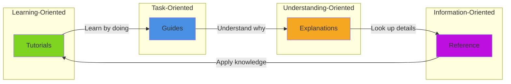
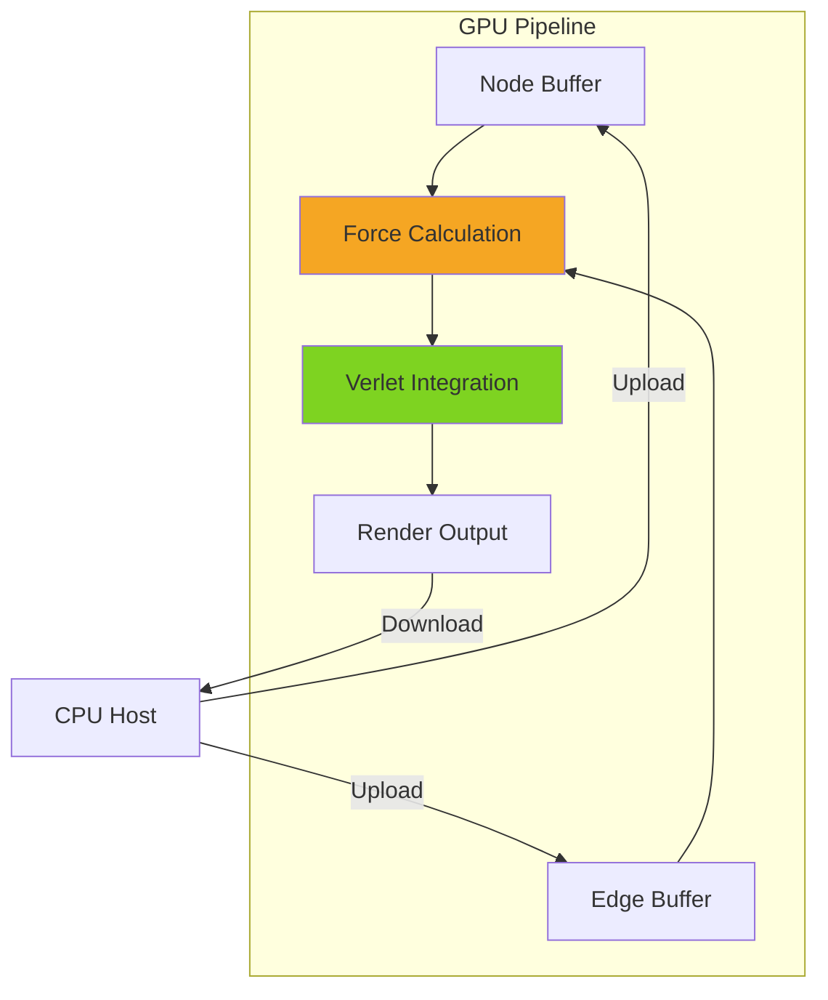
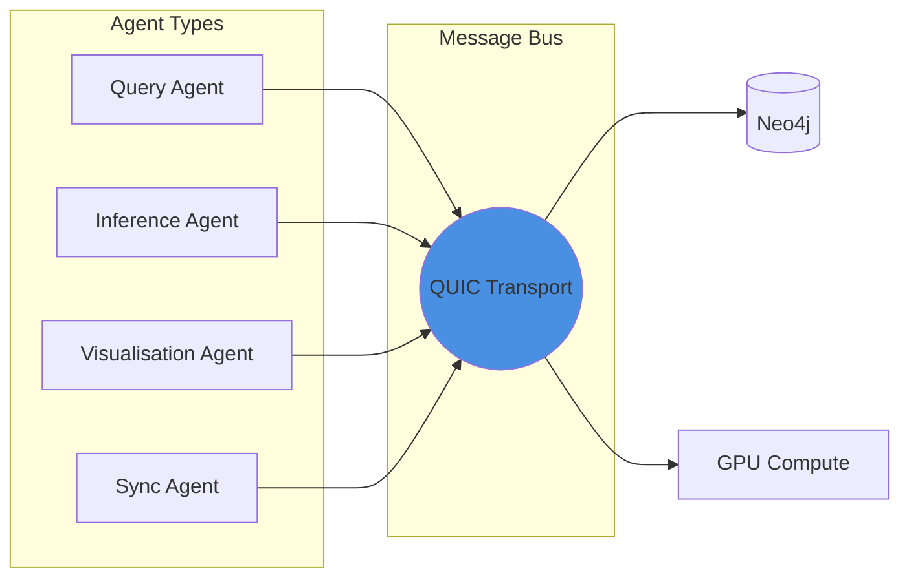

# VisionFlow Documentation
{: .fs-9 }

Enterprise-grade multi-agent knowledge graphing system with GPU-accelerated physics, semantic search, and XR integration.
{: .fs-6 .fw-300 }

[Get Started](/tutorials/installation/){: .btn .btn-primary .fs-5 .mb-4 .mb-md-0 .mr-2 }
[View on GitHub](https://github.com/dreamlab-ai/VisionFlow){: .btn .fs-5 .mb-4 .mb-md-0 }

---

## What is VisionFlow?

VisionFlow is an enterprise-grade system for creating, managing, and visualising complex knowledge graphs. It combines:

- **GPU-Accelerated Physics** - Real-time force-directed graph layouts using CUDA
- **Semantic Search** - Intelligent querying with embedding-based similarity
- **Multi-Agent Architecture** - Distributed processing with autonomous agents
- **XR Integration** - Immersive visualisation for Quest 3 and other VR devices
- **Neo4j Backend** - Enterprise graph database with Cypher query language

---

## Quick Navigation

<div class="code-example" markdown="1">

### For New Users

| Resource | Description |
|:---------|:------------|
| [Installation Guide](/tutorials/installation/) | Set up VisionFlow in your environment |
| [First Graph Tutorial](/tutorials/first-graph/) | Create your first knowledge graph |
| [Overview](/overview/) | Understand what VisionFlow does |

### For Developers

| Resource | Description |
|:---------|:------------|
| [Developer Journey](/developer-journey/) | Complete onboarding path |
| [Architecture Overview](/architecture-overview/) | System design and patterns |
| [API Reference](/reference/api/) | Complete API documentation |

### For Architects

| Resource | Description |
|:---------|:------------|
| [Hexagonal Architecture](/explanations/architecture/hexagonal-cqrs/) | CQRS and port/adapter patterns |
| [Database Architecture](/explanations/architecture/database-architecture/) | Neo4j integration and schemas |
| [Technology Choices](/technology-choices/) | Why we chose each technology |

</div>

---

## Documentation Structure

This documentation follows the [Diataxis Framework](https://diataxis.fr/) for technical documentation:



| Category | Purpose | Example Content |
|:---------|:--------|:----------------|
| **Tutorials** | Learning-oriented guides | Step-by-step installation, first graph |
| **Guides** | Task-oriented how-tos | Configuration, troubleshooting, features |
| **Explanations** | Understanding concepts | Architecture deep-dives, design decisions |
| **Reference** | Information lookup | API specs, schemas, error codes |

---

## Key Features

### GPU-Accelerated Graph Physics

VisionFlow uses CUDA kernels for real-time force-directed graph layouts:



### Multi-Agent Architecture

Distributed processing with specialised agents:



### XR Visualisation

Immersive graph exploration in virtual reality:

- Quest 3 native support
- Hand tracking interaction
- Spatial audio feedback
- Multi-user collaboration

---

## Getting Started

### Prerequisites

- **Rust** 1.75+ (for server components)
- **Node.js** 18+ (for client and tooling)
- **Neo4j** 5.x (graph database)
- **CUDA** 12.0+ (for GPU acceleration, optional)

### Quick Start

```bash
# Clone the repository
git clone https://github.com/dreamlab-ai/VisionFlow.git
cd VisionFlow

# Install dependencies
cargo build --release
npm install

# Start services
docker-compose up -d neo4j
cargo run --release --bin visionflow-server

# Open the client
npm run dev
```

For detailed instructions, see the [Installation Guide](/tutorials/installation/).

---

## Project Status

| Component | Status | Version |
|:----------|:-------|:--------|
| Server (Rust) | Stable | 0.9.x |
| Client (TypeScript) | Stable | 0.9.x |
| CUDA Kernels | Beta | 0.8.x |
| XR Integration | Alpha | 0.7.x |
| Neo4j Adapter | Stable | 0.9.x |

---

## Community

- [GitHub Issues](https://github.com/dreamlab-ai/VisionFlow/issues) - Bug reports and feature requests
- [Discussions](https://github.com/dreamlab-ai/VisionFlow/discussions) - Questions and ideas
- [Contributing Guide](/contribution/) - How to contribute

---

## Licence

VisionFlow is released under the [MIT Licence](https://github.com/dreamlab-ai/VisionFlow/blob/main/LICENSE).
