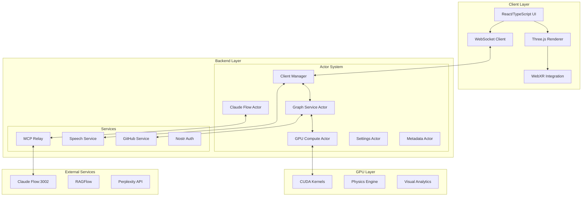

# VisionFlow Documentation

## Overview

VisionFlow is a sophisticated real-time 3D visualization platform that combines AI agent orchestration, GPU-accelerated physics, and cutting-edge XR capabilities. Built with a decoupled actor-based architecture using Rust backend and React/TypeScript frontend, it provides a powerful environment for visualizing and interacting with complex knowledge graphs and AI Multi Agents.

## System Architecture



## Core Features

### 🤖 AI Agent Orchestration
- **15+ Agent Types**: Coordinator, Researcher, Coder, Analyst, Architect, Optimizer, and more
- **Claude Flow Integration**: Direct WebSocket connection via enhanced MCP protocol
- **multi-agent Topologies**: Hierarchical, mesh, ring, and star configurations
- **Task Distribution**: Parallel, sequential, and adaptive execution strategies
- **Real-time Monitoring**: Activity logs, health metrics, and performance tracking

### 🎮 GPU-Accelerated Physics
- **CUDA Implementation**: Optimized for NVIDIA A6000 with 256-thread blocks
- **Dual-Graph Support**: Simultaneous knowledge and agent graph processing
- **Force-Directed Layout**: Stress majorization with semantic constraints
- **Streaming Pipeline**: Continuous GPU processing with differential updates
- **Visual Analytics**: Real-time performance metrics and optimization

### 🥽 XR/AR Capabilities
- **Meta Quest 3**: Automatic detection and optimization
- **Hand Tracking**: Full finger joint recognition with interaction system
- **WebXR API**: Complete implementation with reference space management
- **AR Passthrough**: Mixed reality with spatial anchoring
- **Controller Support**: Touch controllers and gamepad integration

### 🔌 Real-time Communication
- **Binary Protocol**: 28-byte node format for minimal bandwidth
- **WebSocket Endpoints**: `/ws/socket_flow`, `/ws/speech`, `/ws/mcp_relay`, `/ws/bots_visualization`
- **Differential Updates**: Only transmit changes for optimal performance
- **Voice Streaming**: Real-time voice interaction with WebSocket audio

## Quick Start

### Prerequisites
```bash
# Required
- Docker 20.10+ with Docker Compose
- NVIDIA GPU with CUDA 11.8+ (for GPU features)
- Node.js 22+ and Rust 1.75+ (for development)

# Optional
- Meta Quest 3 (for XR features)
- SpacePilot 3D mouse (for advanced navigation)
```

### Installation

```bash
# Clone repository
git clone <repository-url>
cd ext

# Production deployment
docker-compose up -d

# Development environment
./scripts/dev.sh

# Access application
open http://localhost:3001
```

## Documentation Structure

### 📐 Architecture
- [System Overview](architecture/system-overview.md) - Complete system design
- [Dual Graph Architecture](architecture/dual-graph.md) - Parallel graph processing
- [Claude Flow Actor](architecture/claude-flow-actor.md) - Enhanced MCP integration
- [GPU Compute](architecture/gpu-compute.md) - CUDA acceleration details
- [MCP Integration](architecture/mcp-integration.md) - Model Context Protocol

### 🔌 API Reference
- [REST API](api/rest.md) - HTTP endpoints documentation
- [WebSocket Protocols](api/websocket-protocols.md) - Real-time protocols
- [Binary Protocol](api/binary-protocol.md) - Efficient data format

### 🖥️ Server Documentation
- [Actor System](server/actors.md) - Actix actor implementation
- [Handlers](server/handlers.md) - Request processing
- [Services](server/services.md) - Business logic layer
- [Models](server/models.md) - Data structures
- [Physics Engine](server/physics-engine.md) - Force calculations

### 🎨 Client Documentation
- [Architecture](client/architecture.md) - Frontend design patterns
- [Components](client/components.md) - React component library
- [Visualization](client/visualization.md) - 3D rendering system
- [XR Integration](client/xr.md) - WebXR implementation
- [Settings System](client/settings-panel-redesign.md) - Dynamic configuration

### ⚙️ Configuration
- [Configuration Guide](configuration/index.md) - System settings
- [Quick Reference](configuration/quick-reference.md) - Common configurations
- [Settings Guide](SETTINGS_GUIDE.md) - Detailed settings documentation

### 🚀 Deployment
- [Docker Deployment](deployment/docker.md) - Container setup
- [Docker MCP Integration](deployment/docker-mcp-integration.md) - MCP in Docker
- [Production Guide](deployment/index.md) - Production best practices

### 🛠️ Development
- [Development Setup](development/setup.md) - Local environment
- [Rust Development](RUST_DEVELOPMENT.md) - Backend development
- [Testing Guide](development/testing.md) - Test strategies
- [Debugging Guide](development/debugging.md) - Troubleshooting

### 📚 Features
- [Multi Agent](server/agent-multi-agent.md) - AI agent orchestration
- [Bots Implementation](bots-implementation.md) - Agent system details
- [Voice System](voice-system.md) - Speech interaction
- [Command Palette](client/command-palette.md) - Keyboard shortcuts
- [Onboarding](client/onboarding.md) - User onboarding

### 🔧 Technical References
- [Decoupled Graph Architecture](technical/decoupled-graph-architecture.md)
- [MCP Tool Usage](technical/mcp_tool_usage.md)
- [Agent Visualization](agent-visualization-architecture.md)
- [WebSocket Protocols](WEBSOCKET_PROTOCOLS.md)

## Technology Stack

### Backend
- **Rust 1.75+** - Systems programming language
- **Actix-Web 4.4** - Async web framework
- **CUDA 11.8+** - GPU acceleration
- **Tokio** - Async runtime
- **Serde** - Serialization framework

### Frontend
- **React 18** - UI framework
- **TypeScript 5** - Type-safe JavaScript
- **Three.js** - 3D graphics library
- **React Three Fiber** - React renderer for Three.js
- **@react-three/xr** - WebXR integration

### Infrastructure
- **Docker** - Containerization
- **NGINX** - Reverse proxy
- **WebSockets** - Real-time communication
- **MCP** - Model Context Protocol

## Performance Metrics

| Metric | Capability |
|--------|-----------|
| Node Capacity | 100,000+ nodes |
| Edge Capacity | 1,000,000+ edges |
| Update Rate | 60 FPS sustained |
| Network Efficiency | 28 bytes/node |
| GPU Utilization | 80%+ efficiency |
| Agent Types | 15+ specialized |
| Concurrent Clients | 100+ WebSocket |

## Contributing

See [Contributing Guide](contributing.md) for development workflow, code standards, and submission process.

## Support

- **Documentation**: This documentation site
- **Issues**: GitHub issue tracker
- **Discussions**: GitHub discussions

## License

Copyright © 2024 VisionFlow. All rights reserved.