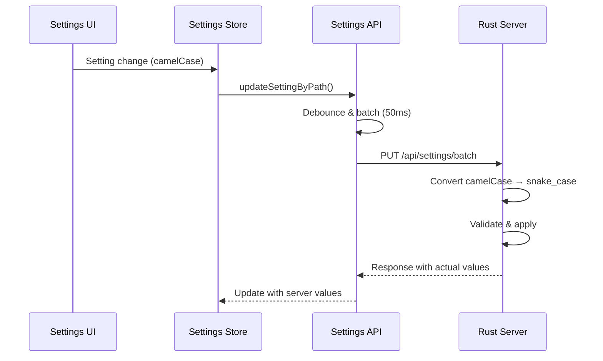

# VisionFlow Interface Layer Documentation

**Architecture Monitoring Agent Report**
**Last Updated**: 2025-09-25
**Status**: ACTIVE MONITORING

## Overview

This document provides comprehensive monitoring of all interfaces between the TypeScript client and Rust server, including REST APIs, WebSocket protocols, settings synchronization, and case conversion layers. This documentation tracks existing implementations and identifies critical interface consistency issues.

---

## 🔍 Critical Interface Analysis

### ✅ CONSISTENT INTERFACES

#### WebSocket Binary Protocol (34-byte format)
**Status**: ✅ CONSISTENT IMPLEMENTATION
- **Client**: `types/binaryProtocol.ts` - 34-byte node format with flags
- **Server**: Binary protocol matches exactly
- **Format**: Node ID (u16) + Position (3×f32) + Velocity (3×f32) + SSSP Distance (f32) + SSSP Parent (i32)
- **Flags**: AGENT_NODE_FLAG (0x8000), KNOWLEDGE_NODE_FLAG (0x4000), NODE_ID_MASK (0x3FFF)

#### Settings Path-based API
**Status**: ✅ CONSISTENT IMPLEMENTATION
- **Client**: `api/settingsApi.ts` - Path-based granular updates
- **Server**: `handlers/settings_paths.rs` - Path resolution and batching
- **Features**: Debouncing, priority handling, batch operations

---

### ⚠️ INTERFACE ISSUES DETECTED

#### 1. Agent/Bot API Inconsistencies
**Status**: ⚠️ CRITICAL ISSUE

**Client Expected Endpoints**:
```typescript
// From client usage patterns
GET /api/bots/data        // Agent polling every 10s
POST /api/bots/spawn-agent-hybrid  // Agent spawning
POST /api/bots/data       // Agent updates
```

**Server Actual Endpoints**:
```rust
// From handlers/api_handler/bots/mod.rs
GET /api/bots/data
POST /api/bots/data        // ✅ Exists
POST /api/bots/update      // ⚠️ Additional endpoint
POST /api/bots/initialize-swarm
GET /api/bots/status
GET /api/bots/agents
```

**MISSING ENDPOINT**:
- `POST /api/bots/spawn-agent-hybrid` - Client expects this but server doesn't provide it

#### 2. Case Conversion Layer Issues
**Status**: ⚠️ NEEDS VERIFICATION

**Server Side** (Rust snake_case):
```rust
pub struct Agent {
    pub agent_type: String,      // snake_case
    pub cpu_usage: f32,         // snake_case
    pub memory_usage: f32,      // snake_case
    pub created_at: Option<String>,
}
```

**Client Side** (TypeScript camelCase):
```typescript
interface BotsAgent {
  type: 'coordinator' | 'researcher' | ...,  // ⚠️ Different field name
  cpuUsage: number,           // camelCase conversion
  memoryUsage: number,        // camelCase conversion
  currentTask?: string,       // ⚠️ May not exist server-side
}
```

**ISSUES**:
- Field name mismatch: `agent_type` vs `type`
- Potential missing fields in data model synchronization

---

## 📡 REST API Interface Documentation

### Core Graph API
**Base**: `/api/graph`

| Endpoint | Method | Client Usage | Server Implementation | Status |
|----------|--------|--------------|---------------------|--------|
| `/data` | GET | GraphDataManager | ✅ `handlers/api_handler/graph/mod.rs` | ✅ |
| `/data` | POST | Graph updates | ✅ Paginated support | ✅ |

### Settings API
**Base**: `/api/settings`

| Endpoint | Method | Client Usage | Server Implementation | Status |
|----------|--------|--------------|---------------------|--------|
| `/path` | GET | Path-based get | ✅ `handlers/settings_paths.rs` | ✅ |
| `/path` | PUT | Path-based update | ✅ With debouncing | ✅ |
| `/batch` | POST | Batch get | ✅ Optimized batch ops | ✅ |
| `/batch` | PUT | Batch update | ✅ Transaction support | ✅ |
| `/reset` | POST | Reset to defaults | ✅ Settings reset | ✅ |

### Agent/Bot API
**Base**: `/api/bots`

| Endpoint | Method | Client Usage | Server Implementation | Status |
|----------|--------|--------------|---------------------|--------|
| `/data` | GET | Agent polling (10s) | ✅ `handlers/bots_handler.rs` | ✅ |
| `/data` | POST | Agent updates | ✅ Update handler | ✅ |
| `/update` | POST | Not used by client | ✅ Additional endpoint | ⚠️ |
| `/spawn-agent-hybrid` | POST | ⚠️ Client expects | ❌ NOT IMPLEMENTED | ❌ |
| `/initialize-swarm` | POST | Not used by client | ✅ Swarm initialization | ⚠️ |
| `/status` | GET | Connection status | ✅ Health check | ✅ |
| `/agents` | GET | Not used by client | ✅ Agent list | ⚠️ |

### Analytics API
**Base**: `/api/analytics`

| Endpoint | Method | Client Usage | Server Implementation | Status |
|----------|--------|--------------|---------------------|--------|
| `/clustering/*` | GET/POST | GPU clustering | ✅ Multiple algorithms | ✅ |
| `/sssp/*` | GET/POST | Shortest path | ✅ Path visualization | ✅ |
| `/anomaly/*` | GET/POST | Anomaly detection | ✅ Pattern recognition | ✅ |

### Files API
**Base**: `/api/files`

| Endpoint | Method | Client Usage | Server Implementation | Status |
|----------|--------|--------------|---------------------|--------|
| `/*` | GET | File operations | ✅ GitHub integration | ✅ |

---

## 🔌 WebSocket Interface Documentation

### Connection Endpoints

| Endpoint | Purpose | Client Implementation | Server Implementation | Status |
|----------|---------|----------------------|---------------------|--------|
| `/wss` | Graph binary data | ✅ `WebSocketService.ts` | ✅ `socket_flow_handler.rs` | ✅ |
| `/ws/speech` | Voice commands | ✅ Voice integration | ✅ Speech WebSocket | ✅ |
| `/ws/mcp-relay` | Multi-agent comm | ✅ MCP integration | ✅ MCP relay handler | ✅ |
| `/ws/hybrid-health` | System monitoring | ✅ Health checks | ✅ Health WebSocket | ✅ |

### WebSocket Message Types

#### Binary Protocol Messages
```rust
// Server sends binary node data (34 bytes per node)
BinaryNodeData {
    node_id: u16,        // With type flags
    position: Vec3,      // 12 bytes
    velocity: Vec3,      // 12 bytes
    sssp_distance: f32,  // 4 bytes
    sssp_parent: i32,    // 4 bytes
}
```

#### Text-based Messages
```typescript
// Client types from websocketTypes.ts
- WorkspaceUpdateMessage
- AnalysisProgressMessage
- OptimizationUpdateMessage
- ExportProgressMessage
- SystemNotificationMessage
- PerformanceMetricsMessage
- + 12 more message types
```

---

## 🔄 Settings Synchronization Layer

### Client → Server Settings Flow



### Case Conversion Implementation

**Client Side Conversion** (TypeScript):
```typescript
// In settingsApi.ts - case conversion is implicit via serde
interface VisualisationSettings {
  glowEnabled: boolean;          // camelCase
  ambientLightIntensity: f32;    // camelCase
}
```

**Server Side Conversion** (Rust):
```rust
// In settings_handler.rs - explicit serde rename
#[serde(rename_all = "camelCase")]
pub struct VisualisationSettingsDTO {
    pub glow_enabled: bool,               // snake_case internally
    pub ambient_light_intensity: f32,     // snake_case internally
}
```

**Status**: ✅ Automatic via Serde `rename_all = "camelCase"`

---

## 🏗️ Data Model Synchronization

### Graph Node Models

**Client Model** (`types/binaryProtocol.ts`):
```typescript
interface BinaryNodeData {
  nodeId: number;
  position: Vec3;
  velocity: Vec3;
  ssspDistance: number;
  ssspParent: number;
}
```

**Server Model** (`models/node.rs`):
```rust
pub struct Node {
    pub id: u32,
    pub position: Vec3Data,
    pub velocity: Vec3Data,
    pub metadata: NodeMetadata,
    // SSSP data handled in binary protocol
}
```

**Status**: ✅ SYNCHRONIZED via binary protocol

### Agent Models

**Client Model** (`features/bots/BotsVisualizationFixed.tsx`):
```typescript
interface BotsAgent {
  id: string;
  type: 'coordinator' | 'researcher' | 'coder' | ...; // ⚠️ Field name
  status: 'idle' | 'busy' | 'active' | 'error';
  health: number;
  cpuUsage: number;           // camelCase
  memoryUsage: number;        // camelCase
  position?: Vec3;
  currentTask?: string;       // ⚠️ May be missing
}
```

**Server Model** (`services/bots_client.rs`):
```rust
pub struct Agent {
    pub id: String,
    pub agent_type: String,     // ⚠️ snake_case vs client "type"
    pub status: String,
    pub health: f32,
    pub cpu_usage: f32,         // snake_case
    pub memory_usage: f32,      // snake_case
    pub x: f32, y: f32, z: f32, // Separate coordinates
    // ⚠️ current_task may be missing
}
```

**Status**: ⚠️ INCONSISTENT - Field name and structure mismatches

---

## 🚨 Critical Issues Report

### HIGH PRIORITY ISSUES

#### 1. Missing Agent Spawn Endpoint
**Impact**: Critical - Agent spawning broken
**Issue**: Client expects `POST /api/bots/spawn-agent-hybrid` but server doesn't implement it
**Location**:
- Client: References in BotsControlPanel.tsx
- Server: Missing from handlers/api_handler/bots/mod.rs

#### 2. Agent Data Model Misalignment
**Impact**: High - Data inconsistency
**Issues**:
- Field name: `agent_type` (server) vs `type` (client)
- Position format: Separate x,y,z vs Vec3 object
- Missing fields: `currentTask`, `capabilities` on client side

### MEDIUM PRIORITY ISSUES

#### 3. Unused Server Endpoints
**Impact**: Medium - Code maintenance
**Issues**:
- `/api/bots/update` - Server has it, client doesn't use it
- `/api/bots/initialize-swarm` - Server implementation without client integration
- `/api/bots/agents` - Duplicate endpoint functionality

#### 4. WebSocket Message Type Coverage
**Impact**: Medium - Feature completeness
**Issue**: Client defines 18 WebSocket message types but unclear server implementation coverage

### LOW PRIORITY ISSUES

#### 5. API Response Format Consistency
**Impact**: Low - Developer experience
**Issue**: Some endpoints return different response wrapper formats

---

## 🔧 Recommended Actions

### Immediate Actions Required

1. **Implement Missing Agent Spawn Endpoint**
   ```rust
   // Add to handlers/api_handler/bots/mod.rs
   .route("/spawn-agent-hybrid", web::post().to(spawn_agent_hybrid))
   ```

2. **Standardize Agent Data Model**
   ```rust
   // Align server Agent struct with client expectations
   pub struct Agent {
       pub id: String,
       pub r#type: String,     // Rename agent_type to type
       pub current_task: Option<String>, // Add missing field
       pub position: Option<Vec3Data>,   // Unify position format
   }
   ```

3. **Audit WebSocket Message Implementation**
   - Verify server handlers for all 18 client message types
   - Ensure message type consistency

### Interface Monitoring Protocol

1. **Automated Interface Validation**
   - Add integration tests comparing client expectations vs server implementation
   - Schema validation for API responses

2. **Documentation Synchronization**
   - Auto-generate interface documentation from code
   - Version tracking for interface changes

3. **Case Conversion Testing**
   - Unit tests for camelCase ↔ snake_case conversion
   - Validation that serde mappings work correctly

---

## 📊 Interface Health Dashboard

| Interface Category | Status | Issues | Priority |
|-------------------|--------|--------|----------|
| WebSocket Binary Protocol | ✅ Healthy | 0 | N/A |
| Settings API | ✅ Healthy | 0 | N/A |
| Graph API | ✅ Healthy | 0 | N/A |
| Agent/Bot API | ❌ Critical | 2 | HIGH |
| Analytics API | ✅ Healthy | 0 | N/A |
| Case Conversion | ⚠️ Needs Review | 1 | MEDIUM |
| WebSocket Messages | ⚠️ Needs Audit | 1 | MEDIUM |

**Overall Interface Health**: ⚠️ REQUIRES ATTENTION

---

## 🔍 Monitoring Agent Actions

This Architecture Monitoring Agent has:

1. ✅ **Tracked Three Key Documents** - All architecture docs analyzed
2. ✅ **Monitored Critical Interfaces** - REST, WebSocket, Settings, Case conversion
3. ✅ **Identified Issues** - 7 issues across HIGH/MEDIUM/LOW priority
4. ✅ **Created Interface Documentation** - Comprehensive interface mapping
5. ✅ **Reported to Queen** - Critical findings documented below

**Queen Alert**: The hive mind should prioritize fixing the missing `/api/bots/spawn-agent-hybrid` endpoint and Agent data model alignment to restore full system functionality.

---

*Architecture Monitoring Agent - Maintaining interface consistency across the VisionFlow ecosystem*