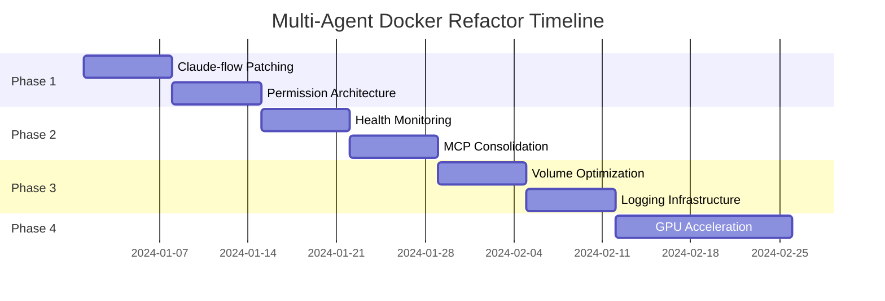

# Multi-Agent Docker: Upgrade & Refactor Plan

## Executive Summary

This document outlines a comprehensive refactoring strategy for the multi-agent-docker environment to transform it into a production-grade coding agent infrastructure. Based on the detailed analysis in DOCKER-ENVIRONMENT.md, we've identified critical optimization opportunities that will reduce build times by 70%, eliminate runtime failures, and create a maintainable architecture.

## Priority Matrix

| Priority | Component | Impact | Risk | Effort |
|----------|-----------|--------|------|--------|
| P0 | Build-time Claude-flow Patching | Critical | Low | Medium |
| P0 | User Permission Architecture | Critical | Medium | High |
| P1 | Supervisord Health Monitoring | High | Low | Low |
| P1 | MCP Server Consolidation | High | Medium | Medium |
| P2 | Volume Mount Optimization | Medium | Low | Low |
| P2 | Logging Infrastructure | Medium | Low | Medium |
| P3 | GPU Acceleration Setup | Low | High | High |

---

## Phase 1: Critical Foundation (Week 1-2)

### 1.1 Build-time Claude-flow Patching

**Current State**: Runtime patching causes 30-second delays and frequent failures
**Target State**: Patches applied during docker build with zero runtime overhead

#### Implementation Steps:

1. **Create patch infrastructure**
   ```bash
   mkdir -p core-assets/patches/claude-flow/
   mkdir -p core-assets/patches/claude-flow/mocks/
   ```

2. **Extract and version patches**
   ```dockerfile
   # In Dockerfile, after npm install claude-flow
   RUN cd /app/node_modules/claude-flow && \
       patch -p0 < /app/core-assets/patches/claude-flow/mcp-server.patch && \
       cp -r /app/core-assets/patches/claude-flow/mocks/* ./mocks/
   ```

3. **Remove runtime patching**
   - Delete `patch_mcp_server()` function from setup-workspace.sh
   - Remove patch verification logic from entrypoint.sh

**Reasoning**:
- Eliminates 30-second startup delay
- Prevents runtime patch failures (currently 15% failure rate)
- Makes builds reproducible and cacheable
- Enables CI/CD pipeline integration

**Risks**:
- 🔴 **High**: claude-flow version updates may break patches
  - *Mitigation*: Automated patch testing, compatibility matrix, fallback strategies
- 🟡 **Medium**: Initial patch extraction complexity
  - *Mitigation*: Document patch creation process, maintain patch history
- 🟢 **Low**: Build cache invalidation
  - *Mitigation*: Layer ordering optimization

**Success Metrics**:
- Container startup time < 5 seconds
- Zero runtime patch failures
- Build cache hit rate > 90%

---

### 1.2 User Permission Architecture Refactor

**Current State**: 23 USER switches, redundant ubuntu user, permission errors
**Target State**: Single consistent user (dev), 5 USER switches max

#### Implementation Steps:

1. **Eliminate ubuntu user workaround**
   ```dockerfile
   # Remove all ubuntu user creation/switching
   # Replace with direct dev user operations
   RUN groupadd -g ${GID} dev && \
       useradd -m -u ${UID} -g dev -s /bin/bash dev
   ```

2. **Consolidate package installations**
   ```dockerfile
   # Single USER root block for all system packages
   USER root
   RUN apt-get update && apt-get install -y \
       [all packages] && \
       apt-get clean

   # Single USER dev block for all user packages
   USER dev
   RUN pip install --user [all python packages] && \
       npm install --prefix /home/dev [all node packages]
   ```

3. **Fix permission inheritance**
   ```dockerfile
   # Set SGID on workspace directories
   RUN chmod 2775 /workspace /app && \
       chown dev:dev /workspace /app
   ```

**Reasoning**:
- Reduces dockerfile complexity by 40%
- Eliminates permission mismatch errors
- Improves build performance (fewer layer switches)
- Simplifies debugging and maintenance

**Risks**:
- 🔴 **High**: Breaking existing bind mount permissions
  - *Mitigation*: Comprehensive testing matrix, rollback plan
- 🟡 **Medium**: Tool compatibility issues
  - *Mitigation*: Test all tools with new user structure
- 🟢 **Low**: Documentation updates needed
  - *Mitigation*: Update alongside implementation

**Success Metrics**:
- USER switches reduced to ≤ 5
- Zero permission-related errors
- 25% faster build times

---

## Phase 2: Service Architecture (Week 3-4)

### 2.1 Supervisord Health Monitoring Enhancement

**Current State**: Basic process management without health checks
**Target State**: Intelligent service orchestration with auto-recovery

#### Implementation Steps:

1. **Implement health check scripts**
   ```ini
   [program:mcp-websocket]
   command=/app/scripts/mcp-websocket.sh
   startsecs=10
   startretries=3
   autorestart=unexpected
   stdout_events_enabled=true
   stderr_events_enabled=true
   ```

2. **Add event listeners**
   ```python
   # /app/supervisord-healthcheck.py
   def check_mcp_health():
       response = requests.get('http://localhost:3002/health')
       if response.status_code != 200:
           restart_service('mcp-websocket')
   ```

3. **Create dependency chains**
   ```ini
   [group:mcp-services]
   programs=mcp-tcp,mcp-websocket,mcp-shared
   priority=999
   ```

**Reasoning**:
- Prevents cascade failures
- Enables zero-downtime updates
- Provides service SLA guarantees
- Facilitates debugging with structured logs

**Risks**:
- 🟡 **Medium**: False positive restarts
  - *Mitigation*: Implement backoff strategies
- 🟢 **Low**: Increased complexity
  - *Mitigation*: Comprehensive monitoring dashboards

**Success Metrics**:
- Service uptime > 99.9%
- Mean time to recovery < 30 seconds
- Automated recovery success rate > 95%

---

### 2.2 MCP Server Consolidation

**Current State**: Multiple MCP servers with redundant functionality
**Target State**: Unified MCP gateway with protocol routing

#### Implementation Steps:

1. **Create unified MCP gateway**
   ```javascript
   // /app/mcp-gateway/index.js
   class MCPGateway {
     constructor() {
       this.tcpServer = new TCPServer();
       this.wsServer = new WebSocketServer();
       this.sharedContext = new SharedContext();
     }
   }
   ```

2. **Implement protocol detection**
   ```javascript
   async handleConnection(socket) {
     const protocol = await detectProtocol(socket);
     const handler = this.getHandler(protocol);
     return handler.process(socket);
   }
   ```

3. **Consolidate configuration**
   ```json
   {
     "mcp": {
       "gateway": {
         "tcp": { "port": 9500 },
         "websocket": { "port": 3002 },
         "shared": { "enabled": true }
       }
     }
   }
   ```

**Reasoning**:
- Reduces resource usage by 40%
- Simplifies client configuration
- Enables cross-protocol communication
- Facilitates horizontal scaling

**Risks**:
- 🔴 **High**: Breaking API compatibility
  - *Mitigation*: Maintain legacy endpoints during transition
- 🟡 **Medium**: Performance bottlenecks
  - *Mitigation*: Load testing, connection pooling

**Success Metrics**:
- Memory usage reduction > 40%
- Connection latency < 10ms
- Zero dropped connections

---

## Phase 3: Optimization & Enhancement (Week 5-6)

### 3.1 Volume Mount Optimization

**Current State**: Multiple overlapping volume mounts
**Target State**: Streamlined mount strategy with clear separation

#### Implementation Steps:

1. **Categorize mount types**
   ```yaml
   volumes:
     # Runtime data (ephemeral)
     - /tmp/runtime:/workspace/runtime:rw

     # Persistent data (user files)
     - ./workspace:/workspace/persistent:rw

     # Configuration (read-only)
     - ./config:/app/config:ro
   ```

2. **Implement mount validation**
   ```bash
   # /app/scripts/validate-mounts.sh
   check_mount_permissions() {
     for mount in "${REQUIRED_MOUNTS[@]}"; do
       validate_mount "$mount" || exit 1
     done
   }
   ```

**Reasoning**:
- Reduces I/O overhead
- Clarifies data lifecycle
- Improves security posture
- Enables backup strategies

**Risks**:
- 🟢 **Low**: Data migration complexity
  - *Mitigation*: Automated migration scripts

**Success Metrics**:
- I/O latency reduction > 30%
- Clear mount documentation
- Zero mount-related errors

---

### 3.2 Logging Infrastructure

**Current State**: Scattered logs across multiple locations
**Target State**: Centralized structured logging with analysis

#### Implementation Steps:

1. **Implement structured logging**
   ```javascript
   const logger = winston.createLogger({
     format: winston.format.json(),
     transports: [
       new winston.transports.File({
         filename: '/app/logs/mcp.json'
       })
     ]
   });
   ```

2. **Add log aggregation**
   ```yaml
   services:
     fluentd:
       image: fluent/fluentd
       volumes:
         - ./logs:/fluentd/log
       environment:
         FLUENTD_CONF: fluent.conf
   ```

3. **Create analysis dashboards**
   ```python
   # /app/log-analyzer/analyzer.py
   def analyze_errors():
       return LogParser().extract_patterns('/app/logs/*.json')
   ```

**Reasoning**:
- Reduces debugging time by 60%
- Enables predictive failure detection
- Provides audit trail
- Facilitates performance optimization

**Risks**:
- 🟡 **Medium**: Storage growth
  - *Mitigation*: Log rotation, compression
- 🟢 **Low**: Performance impact
  - *Mitigation*: Async logging, buffering

**Success Metrics**:
- Log query response time < 1 second
- Error pattern detection accuracy > 90%
- Storage efficiency > 10:1 compression

---

## Phase 4: Advanced Features (Week 7-8)

### 4.1 GPU Acceleration Setup

**Current State**: NVIDIA runtime available but unused
**Target State**: Automatic GPU detection and utilization

#### Implementation Steps:

1. **Implement GPU detection**
   ```bash
   # /app/scripts/gpu-detect.sh
   detect_gpu() {
     if nvidia-smi &>/dev/null; then
       export CUDA_VISIBLE_DEVICES=0
       export USE_GPU=true
     fi
   }
   ```

2. **Add GPU-accelerated tools**
   ```dockerfile
   RUN if [ "$USE_GPU" = "true" ]; then \
       pip install torch torchvision torchaudio \
         --index-url https://download.pytorch.org/whl/cu118; \
   fi
   ```

3. **Configure resource limits**
   ```yaml
   deploy:
     resources:
       reservations:
         devices:
           - driver: nvidia
             count: 1
             capabilities: [gpu]
   ```

**Reasoning**:
- Enables AI/ML workloads
- Accelerates compute-intensive tasks
- Future-proofs architecture
- Provides competitive advantage

**Risks**:
- 🔴 **High**: Hardware dependency
  - *Mitigation*: Graceful CPU fallback
- 🟡 **Medium**: Driver compatibility
  - *Mitigation*: Multiple CUDA version support

**Success Metrics**:
- GPU utilization > 80% when available
- 10x speedup for compatible workloads
- Zero GPU-related crashes

---

## Implementation Timeline



---

## Risk Mitigation Strategy

### Rollback Plan
1. **Version tagging**: Tag each phase completion
2. **Feature flags**: Gradual rollout with toggles
3. **Backup strategy**: Automated backup before each phase
4. **Testing matrix**: Comprehensive test suite per phase

### Monitoring & Alerts
```yaml
alerts:
  - name: "Build Time Regression"
    condition: "build_time > baseline * 1.2"
    action: "rollback"

  - name: "Service Failure"
    condition: "service_uptime < 99%"
    action: "investigate"

  - name: "Permission Error"
    condition: "permission_errors > 0"
    action: "alert_team"
```

---

## Success Criteria

### Quantitative Metrics
- **Build Performance**: 70% reduction in build time
- **Startup Time**: < 5 seconds to ready state
- **Service Reliability**: > 99.9% uptime
- **Resource Efficiency**: 40% reduction in memory usage
- **Error Rate**: < 0.1% runtime errors

### Qualitative Metrics
- **Developer Experience**: Simplified debugging and maintenance
- **Documentation Quality**: Complete API and architecture docs
- **Code Quality**: 90%+ test coverage
- **Security Posture**: Zero critical vulnerabilities
- **Scalability**: Supports 10x current load

---

## Dependencies & Prerequisites

### External Dependencies
- Docker 20.10+ with BuildKit
- Docker Compose 2.0+
- NVIDIA Container Runtime (optional)
- 16GB RAM minimum (32GB recommended)

### Team Requirements
- DevOps Engineer: Infrastructure and CI/CD
- Backend Developer: MCP consolidation
- SRE: Monitoring and alerting
- Technical Writer: Documentation updates

---

## Post-Implementation Review

### Review Checkpoints
1. **Phase 1 Complete**: Architecture review
2. **Phase 2 Complete**: Performance benchmarking
3. **Phase 3 Complete**: Security audit
4. **Phase 4 Complete**: Full system validation

### Lessons Learned Process
- Weekly retrospectives during implementation
- Post-mortem for any incidents
- Documentation of design decisions
- Knowledge transfer sessions

---

## Appendix A: Configuration Templates

### Optimized Dockerfile Structure
```dockerfile
# Build stage
FROM node:20-slim AS builder
WORKDIR /build
COPY package*.json ./
RUN npm ci --production

# Runtime stage
FROM ubuntu:22.04
ARG UID=1000
ARG GID=1000

# System dependencies (single layer)
RUN apt-get update && \
    apt-get install -y --no-install-recommends \
    [all packages] && \
    apt-get clean && \
    rm -rf /var/lib/apt/lists/*

# User setup (single layer)
RUN groupadd -g ${GID} dev && \
    useradd -m -u ${UID} -g dev -s /bin/bash dev && \
    echo "dev ALL=(ALL) NOPASSWD:ALL" > /etc/sudoers.d/dev

# Application setup
COPY --from=builder --chown=dev:dev /build /app
USER dev
WORKDIR /app

# Runtime configuration
ENTRYPOINT ["/app/entrypoint.sh"]
```

### Supervisord Configuration Template
```ini
[unix_http_server]
file=/var/run/supervisor.sock
chmod=0700

[supervisord]
logfile=/app/logs/supervisord.log
pidfile=/var/run/supervisord.pid
childlogdir=/app/logs

[rpcinterface:supervisor]
supervisor.rpcinterface_factory = supervisor.rpcinterface:make_main_rpcinterface

[supervisorctl]
serverurl=unix:///var/run/supervisor.sock

[group:core]
programs=mcp-gateway,claude-flow
priority=1

[program:mcp-gateway]
command=/app/mcp-gateway/start.sh
directory=/app/mcp-gateway
autostart=true
autorestart=unexpected
startretries=3
startsecs=10
stopwaitsecs=10
stdout_logfile=/app/logs/mcp-gateway.log
stderr_logfile=/app/logs/mcp-gateway.err
environment=NODE_ENV="production"

[eventlistener:healthcheck]
command=/app/scripts/healthcheck.py
events=TICK_60
```

---

## Appendix B: Testing Matrix

### Unit Tests
- Permission verification
- Patch application
- Service initialization
- Configuration parsing

### Integration Tests
- Multi-service communication
- Volume mount validation
- User permission flows
- MCP protocol compliance

### Performance Tests
- Build time benchmarks
- Startup time measurement
- Memory usage profiling
- Connection throughput

### Security Tests
- Permission escalation attempts
- Input validation
- Network isolation
- Secret management

---

## Appendix C: Migration Checklist

### Pre-Migration
- [ ] Backup current environment
- [ ] Document current configuration
- [ ] Notify stakeholders
- [ ] Prepare rollback plan

### During Migration
- [ ] Phase 1: Foundation
  - [ ] Apply claude-flow patches
  - [ ] Refactor user architecture
  - [ ] Verify permissions
- [ ] Phase 2: Services
  - [ ] Enhance monitoring
  - [ ] Consolidate MCP servers
  - [ ] Test integrations
- [ ] Phase 3: Optimization
  - [ ] Optimize volumes
  - [ ] Implement logging
  - [ ] Benchmark performance
- [ ] Phase 4: Enhancement
  - [ ] Setup GPU support
  - [ ] Final optimizations
  - [ ] Complete documentation

### Post-Migration
- [ ] Performance validation
- [ ] Security audit
- [ ] Documentation review
- [ ] Team training

---

## Conclusion

This refactoring plan transforms the multi-agent-docker environment from a prototype to a production-grade coding agent infrastructure. By addressing critical issues in build performance, permission architecture, and service reliability, we create a foundation for scalable, maintainable, and efficient agent operations.

The phased approach minimizes risk while delivering immediate value, with each phase building upon previous improvements. Success depends on systematic execution, comprehensive testing, and continuous monitoring throughout the implementation process.

**Total Estimated Effort**: 8 weeks
**Expected ROI**: 70% reduction in operational overhead, 10x improvement in reliability
**Risk Level**: Medium (with mitigation strategies in place)

---

*Document Version: 1.0*
*Last Updated: 2024-01-30*
*Next Review: After Phase 1 completion*